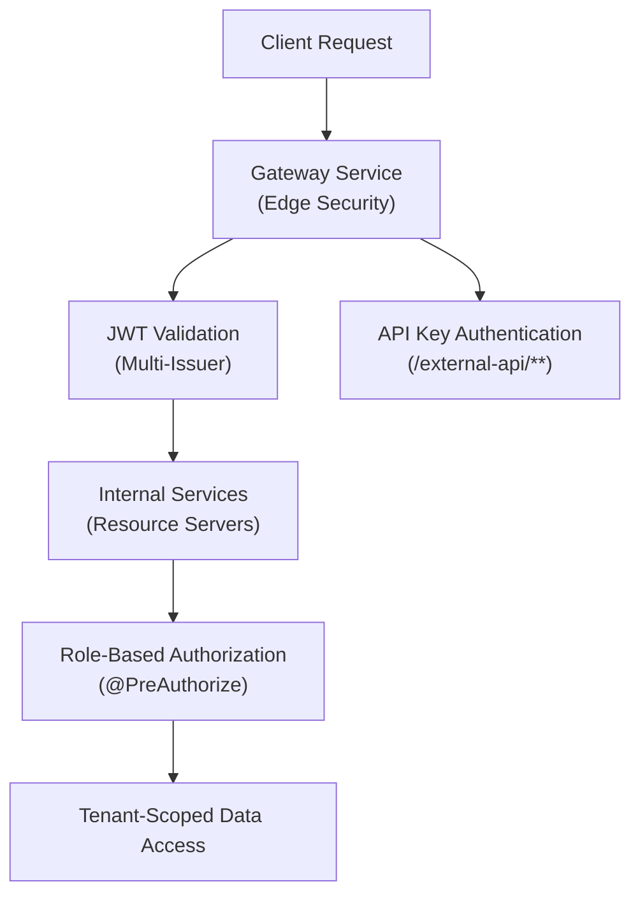
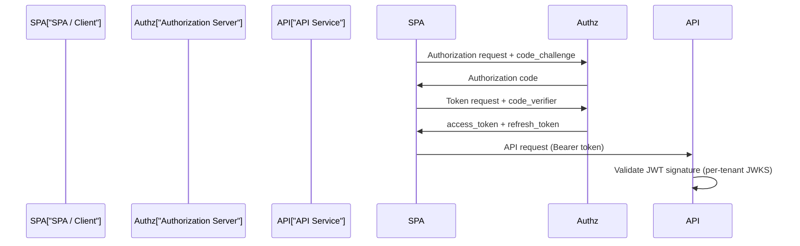
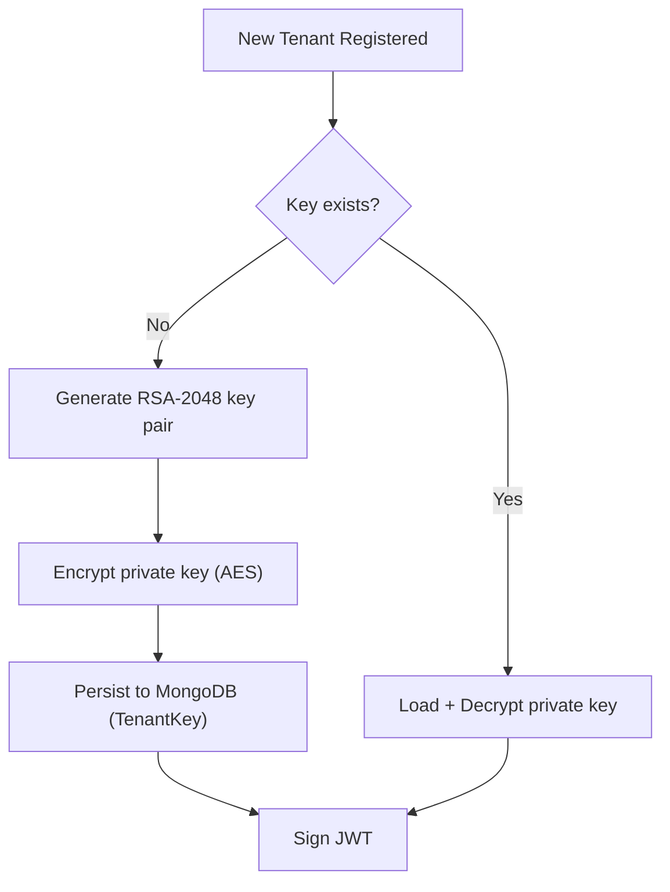
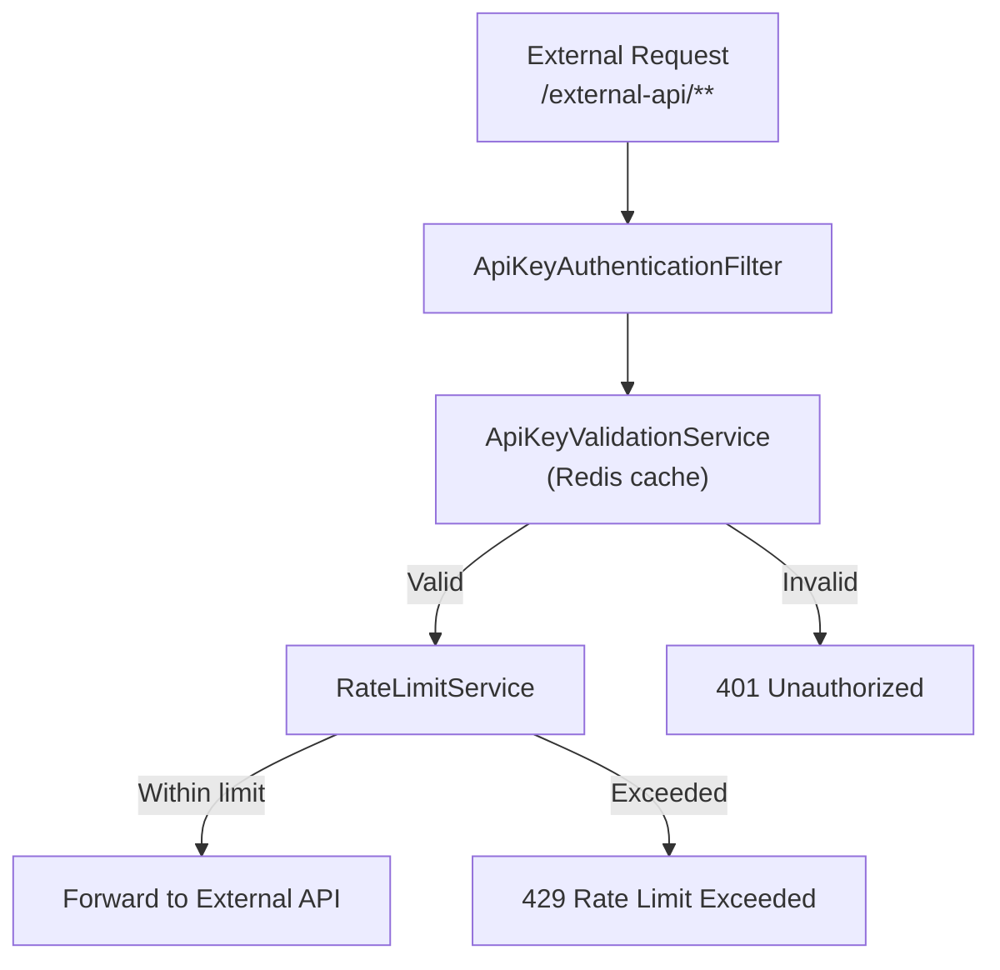

# Security Best Practices

This document covers authentication and authorization patterns, data protection, input validation, secrets management, and security testing guidelines for OpenFrame OSS Tenant.

---

## Authentication and Authorization Architecture

OpenFrame uses a layered security model:



### Layers of Security

| Layer | Component | Responsibility |
|-------|-----------|---------------|
| **Edge** | `GatewaySecurityConfig` | JWT validation, CORS, API key auth, rate limiting |
| **Service** | `SecurityConfig` (per service) | OAuth2 resource server, role extraction |
| **Application** | `@PreAuthorize`, `AuthPrincipal` | Method-level authorization |
| **Data** | `tenantId` scoping in repositories | Data isolation per tenant |

---

## OAuth2 / JWT Patterns

### Obtaining Tokens

All services act as **OAuth2 Resource Servers** — they validate JWT Bearer tokens but do not issue them. Tokens are issued by the **Authorization Server**.

**OAuth2 Authorization Code + PKCE flow:**



### JWT Claims and Role Extraction

Each JWT contains:

```json
{
  "iss": "https://auth.yourtenant.openframe.ai",
  "sub": "user-id-123",
  "tenant_id": "your-tenant-id",
  "userId": "user-id-123",
  "roles": ["ADMIN"],
  "exp": 1700000000
}
```

**Role mapping in Gateway (`GatewaySecurityConfig`):**

```text
/api/**              → ROLE_ADMIN
/tools/agent/**      → ROLE_AGENT
/clients/**          → ROLE_AGENT
/external-api/**     → API Key (X-API-Key header)
/ws/tools/**         → ROLE_ADMIN or ROLE_AGENT
```

### Multi-Issuer JWT Validation

The Gateway and API services support multiple JWT issuers simultaneously — one per tenant. Issuer URLs follow the pattern:

```text
https://auth.{tenantId}.openframe.ai
```

Token validation uses cached `NimbusReactiveJwtDecoder` instances (Caffeine cache) to avoid repeated JWKS fetching.

---

## Per-Tenant Cryptographic Isolation

Each tenant has its own **RSA-2048 key pair** for JWT signing:

- Private key: stored in MongoDB, encrypted at rest using `EncryptionService`
- Public key: exposed via JWKS endpoint (`/.well-known/jwks.json`)
- `kid` (key ID): included in JWT headers for key lookup

**Key lifecycle:**



> **Never store unencrypted private keys.** Always use the `EncryptionService` for at-rest encryption.

---

## API Key Security

External API consumers authenticate using API keys via the `X-API-Key` header.

### API Key Validation Flow



### Rate Limit Headers

API key responses include rate limit metadata:

```text
X-Rate-Limit-Limit-Minute: 60
X-Rate-Limit-Remaining-Minute: 45
X-Rate-Limit-Limit-Hour: 1000
X-Rate-Limit-Remaining-Hour: 987
```

### Best Practices for API Keys

- Store API keys in a secrets manager, not in code or config files
- Rotate keys regularly and revoke unused keys via the Settings API
- Use the most restrictive scope necessary
- Monitor API key usage for anomalies via the audit logs

---

## Secrets Management

### Environment Variables

All sensitive configuration must be provided via environment variables or a secrets manager — **never hardcoded in source code or committed to version control**.

| Secret | Where Used | Example |
|--------|-----------|---------|
| `ENCRYPTION_KEY` | Tenant key encryption | Use 256-bit AES key |
| `OAUTH2_CLIENT_SECRET` | OAuth2 client registration | Random 64+ char string |
| `SPRING_DATA_MONGODB_URI` | MongoDB connection | Include auth credentials |
| `ANTHROPIC_API_KEY` | AI agent tooling | Starts with `sk-ant-` |

### `.gitignore` Enforcement

Ensure these files are always in `.gitignore`:

```text
.env
.env.local
.env.*.local
application-local.yml
application-local.yaml
*.key
*.pem
secrets/
```

### Production Secrets

In production, use a dedicated secrets manager:

- **HashiCorp Vault** — Recommended for self-hosted deployments
- **AWS Secrets Manager / GCP Secret Manager** — For cloud deployments
- **Kubernetes Secrets** — For Kubernetes-based deployments (prefer sealed secrets or external secrets operator)

---

## Input Validation and Sanitization

### Java Service Layer

All REST endpoint inputs are validated using Bean Validation (`@Valid`):

```java
// Example controller pattern
@PostMapping("/organizations")
public ResponseEntity<OrganizationResponse> create(
    @Valid @RequestBody CreateOrganizationRequest request,
    @AuthenticationPrincipal AuthPrincipal principal) {
    ...
}
```

Custom validators exist for domain-specific constraints:

| Validator | Purpose |
|-----------|---------|
| `@ValidEmail` + `ValidEmailValidator` | Validates email format |
| `@TenantDomain` + `TenantDomainValidator` | Validates tenant domain format |
| Tag validation (`TagValidation`) | Validates tag key/value constraints |

### GraphQL Input Validation

GraphQL mutations use typed input objects (DTOs) with validation annotations. Invalid inputs return GraphQL errors rather than HTTP errors.

### Preventing Injection Attacks

- **MongoDB:** Spring Data automatically parameterizes queries — avoid raw MongoDB `$where` clauses
- **GraphQL:** Relay global IDs are decoded and validated before use
- **NATS Messages:** All agent messages are deserialized against strict schemas

---

## CORS Configuration

CORS is configured at the **Gateway** layer via `CorsConfig` / `CorsDisableConfig`:

- Allowed origins: configured per environment
- Allowed methods: `GET`, `POST`, `PUT`, `PATCH`, `DELETE`, `OPTIONS`
- Credentials: allowed for authenticated requests
- Preflight caching: enabled

> For local development, CORS may be relaxed. **Always enforce strict CORS in production.**

---

## Security Testing Guidelines

### Running Security Tests

```bash
# Run Spring Security integration tests
mvn test -pl openframe/services/openframe-api \
  -Dtest="*SecurityTest,*AuthTest"

# Run all tests including security
mvn test -pl openframe/services/openframe-api
```

### Security Test Patterns

The project uses `spring-security-test` for securing test contexts:

```java
@WithMockUser(roles = {"ADMIN"})
@Test
void shouldReturnDevicesForAdmin() {
    // test code
}

@Test
void shouldRejectUnauthenticatedRequest() {
    mockMvc.perform(get("/api/devices"))
        .andExpect(status().isUnauthorized());
}
```

### Static Analysis

Run security-focused static analysis:

```bash
# OWASP Dependency Check (checks for known CVEs)
mvn org.owasp:dependency-check-maven:check

# SonarQube / SonarCloud analysis
mvn sonar:sonar \
  -Dsonar.projectKey=openframe-oss-tenant \
  -Dsonar.host.url=https://sonarcloud.io
```

---

## Common Security Vulnerabilities and Mitigations

| Vulnerability | Mitigation in OpenFrame |
|---------------|------------------------|
| **Broken Authentication** | OAuth2 + PKCE, short-lived JWTs, refresh token rotation |
| **Broken Access Control** | Tenant-scoped data access, role-based authorization at gateway and service layers |
| **Injection (MongoDB)** | Spring Data parameterized queries, no raw query execution |
| **Cross-Site Request Forgery** | CSRF disabled (stateless JWT-based auth), SameSite cookies |
| **Sensitive Data Exposure** | Private keys encrypted at rest; secrets via env vars only |
| **Security Misconfiguration** | CORS restricted by env; permissive configs blocked in prod profile |
| **Broken Object Level Authorization** | Relay global IDs validated against tenant context; no direct ID access without ownership check |
| **Rate Limiting** | API key rate limits enforced at gateway (per-minute, per-hour, per-day) |

---

## Security Code Review Checklist

Before merging any PR that touches security-sensitive code:

- [ ] No secrets, passwords, or API keys in source code
- [ ] All new REST endpoints are authenticated (or explicitly documented as public)
- [ ] All new REST endpoints validate input with `@Valid`
- [ ] GraphQL mutations use strongly-typed input DTOs
- [ ] New MongoDB queries use parameterized criteria (not raw query strings)
- [ ] Tenant scoping is applied in all new repository queries
- [ ] Error responses do not expose internal implementation details
- [ ] New scheduled tasks use ShedLock to prevent duplicate execution
- [ ] Password/secret fields are excluded from logs (`@JsonIgnore`, `@ToString.Exclude`)
