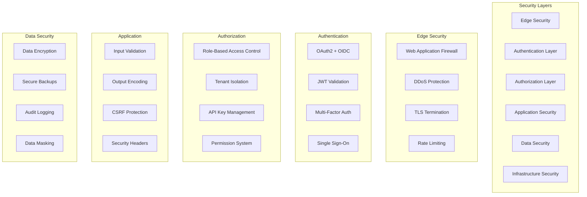

# Security Best Practices

Security is a foundational principle in OpenFrame's architecture. This guide covers security best practices, common vulnerabilities, secure development patterns, and guidelines for maintaining a secure MSP platform.

## Security Architecture Overview

OpenFrame implements a comprehensive security model based on industry best practices:



## Authentication and Authorization

### 1. OAuth2 + OIDC Implementation

OpenFrame uses industry-standard OAuth2 with OIDC for authentication:

#### Secure Configuration
```yaml
# application-security.yml
spring:
  security:
    oauth2:
      authorizationserver:
        issuer: https://your-domain.com
        client:
          openframe-web:
            client-secret: "{bcrypt}$2a$10$..."  # Always encrypt secrets
            require-authorization-consent: true
            authorization-grant-types:
              - authorization_code
            redirect-uris:
              - "https://your-domain.com/login/oauth2/code/openframe"
            scopes:
              - openid
              - profile
              - email
              - read:devices
              - write:devices
```

#### JWT Security Best Practices

**1. Strong Signing Algorithms**
```java
@Configuration
public class JwtSecurityConfig {
    
    @Bean
    public JWKSource<SecurityContext> jwkSource() {
        RSAKey rsaKey = generateRSAKey();
        JWKSet jwkSet = new JWKSet(rsaKey);
        return new ImmutableJWKSet<>(jwkSet);
    }
    
    private RSAKey generateRSAKey() {
        KeyPair keyPair = generateRSAKeyPair();
        RSAPublicKey publicKey = (RSAPublicKey) keyPair.getPublic();
        RSAPrivateKey privateKey = (RSAPrivateKey) keyPair.getPrivate();
        
        return new RSAKey.Builder(publicKey)
                .privateKey(privateKey)
                .keyID(UUID.randomUUID().toString())
                .build();
    }
    
    private KeyPair generateRSAKeyPair() {
        try {
            KeyPairGenerator keyPairGenerator = KeyPairGenerator.getInstance("RSA");
            keyPairGenerator.initialize(2048); // Minimum 2048-bit keys
            return keyPairGenerator.generateKeyPair();
        } catch (Exception ex) {
            throw new IllegalStateException(ex);
        }
    }
}
```

**2. Token Validation**
```java
@Component
public class JwtTokenValidator {
    
    @Value("${app.jwt.issuer}")
    private String issuer;
    
    @Value("${app.jwt.max-age:3600}")
    private int maxAge;
    
    public boolean validateToken(String token, String expectedTenant) {
        try {
            Jwt jwt = jwtDecoder.decode(token);
            
            // Validate issuer
            if (!issuer.equals(jwt.getIssuer().toString())) {
                log.warn("Invalid token issuer: {}", jwt.getIssuer());
                return false;
            }
            
            // Validate expiration
            if (jwt.getExpiresAt().isBefore(Instant.now())) {
                log.warn("Token expired");
                return false;
            }
            
            // Validate tenant (critical for multi-tenancy)
            String tokenTenant = jwt.getClaimAsString("tenant_id");
            if (!expectedTenant.equals(tokenTenant)) {
                log.warn("Token tenant mismatch. Expected: {}, Got: {}", 
                    expectedTenant, tokenTenant);
                return false;
            }
            
            return true;
        } catch (Exception e) {
            log.error("Token validation failed", e);
            return false;
        }
    }
}
```

### 2. Multi-Tenant Authorization

#### Tenant Context Security

**Always validate tenant context in every operation:**

```java
@RestController
@PreAuthorize("hasRole('USER')")
public class DeviceController {
    
    @GetMapping("/devices")
    public ResponseEntity<List<Device>> getDevices(
            @AuthenticationPrincipal AuthPrincipal principal) {
        
        // Extract and validate tenant
        String tenantId = principal.getTenantId();
        validateTenantAccess(tenantId, principal);
        
        // Query with mandatory tenant filter
        List<Device> devices = deviceService.findByTenantId(tenantId);
        return ResponseEntity.ok(devices);
    }
    
    private void validateTenantAccess(String tenantId, AuthPrincipal principal) {
        if (!principal.hasAccessToTenant(tenantId)) {
            throw new AccessDeniedException("No access to tenant: " + tenantId);
        }
    }
}
```

#### Repository-Level Security

**Enforce tenant isolation at the data layer:**

```java
@Repository
public class SecureDeviceRepository extends BaseRepository<Device> {
    
    @Override
    public List<Device> findAll(String tenantId) {
        // CRITICAL: Always include tenant filter
        return mongoTemplate.find(
            Query.query(Criteria.where("tenantId").is(tenantId)),
            Device.class
        );
    }
    
    @Override
    public Optional<Device> findById(String deviceId, String tenantId) {
        // CRITICAL: Validate both ID and tenant
        return Optional.ofNullable(
            mongoTemplate.findOne(
                Query.query(
                    Criteria.where("id").is(deviceId)
                            .and("tenantId").is(tenantId)
                ),
                Device.class
            )
        );
    }
}
```

## Input Validation and Sanitization

### 1. Comprehensive Input Validation

**Validate all inputs at multiple layers:**

```java
@RestController
@Validated
public class OrganizationController {
    
    @PostMapping("/organizations")
    public ResponseEntity<Organization> createOrganization(
            @Valid @RequestBody CreateOrganizationRequest request,
            @AuthenticationPrincipal AuthPrincipal principal) {
        
        // Additional business logic validation
        validateOrganizationRequest(request, principal);
        
        Organization organization = organizationService.create(request, principal.getTenantId());
        return ResponseEntity.ok(organization);
    }
    
    private void validateOrganizationRequest(CreateOrganizationRequest request, AuthPrincipal principal) {
        // Domain validation
        if (!isValidDomain(request.getDomain())) {
            throw new ValidationException("Invalid domain format");
        }
        
        // Business rule validation
        if (organizationService.existsByDomain(request.getDomain(), principal.getTenantId())) {
            throw new ValidationException("Domain already exists");
        }
        
        // Sanitize HTML content
        if (request.getDescription() != null) {
            request.setDescription(sanitizeHtml(request.getDescription()));
        }
    }
}
```

### 2. DTO Validation

**Use comprehensive validation annotations:**

```java
@Data
@NoArgsConstructor
public class CreateOrganizationRequest {
    
    @NotBlank(message = "Organization name is required")
    @Size(min = 2, max = 100, message = "Name must be between 2 and 100 characters")
    @Pattern(regexp = "^[a-zA-Z0-9\\s\\-_]+$", message = "Name contains invalid characters")
    private String name;
    
    @NotBlank(message = "Domain is required")
    @Pattern(regexp = "^[a-zA-Z0-9.-]+\\.[a-zA-Z]{2,}$", message = "Invalid domain format")
    private String domain;
    
    @Email(message = "Invalid email format")
    @NotBlank(message = "Contact email is required")
    private String contactEmail;
    
    @Size(max = 1000, message = "Description cannot exceed 1000 characters")
    private String description;
    
    @Valid
    private AddressDto address;
}
```

### 3. Custom Validators

**Implement domain-specific validation:**

```java
@Component
public class TenantDomainValidator implements ConstraintValidator<TenantDomain, String> {
    
    @Autowired
    private TenantService tenantService;
    
    @Override
    public boolean isValid(String domain, ConstraintValidatorContext context) {
        if (domain == null || domain.trim().isEmpty()) {
            return false;
        }
        
        // Check domain format
        if (!domain.matches("^[a-zA-Z0-9.-]+\\.[a-zA-Z]{2,}$")) {
            return false;
        }
        
        // Check if domain is not already taken
        return !tenantService.existsByDomain(domain);
    }
}
```

## Secure Data Handling

### 1. Data Encryption

#### Sensitive Data Encryption

```java
@Component
public class DataEncryptionService {
    
    @Value("${app.encryption.key}")
    private String encryptionKey;
    
    public String encrypt(String plainText) {
        try {
            Cipher cipher = Cipher.getInstance("AES/GCM/NoPadding");
            SecretKeySpec keySpec = new SecretKeySpec(
                encryptionKey.getBytes(), "AES");
            cipher.init(Cipher.ENCRYPT_MODE, keySpec);
            
            byte[] encryptedData = cipher.doFinal(plainText.getBytes(StandardCharsets.UTF_8));
            return Base64.getEncoder().encodeToString(encryptedData);
        } catch (Exception e) {
            throw new EncryptionException("Failed to encrypt data", e);
        }
    }
    
    public String decrypt(String encryptedText) {
        try {
            byte[] encryptedData = Base64.getDecoder().decode(encryptedText);
            
            Cipher cipher = Cipher.getInstance("AES/GCM/NoPadding");
            SecretKeySpec keySpec = new SecretKeySpec(
                encryptionKey.getBytes(), "AES");
            cipher.init(Cipher.DECRYPT_MODE, keySpec);
            
            byte[] plainTextData = cipher.doFinal(encryptedData);
            return new String(plainTextData, StandardCharsets.UTF_8);
        } catch (Exception e) {
            throw new EncryptionException("Failed to decrypt data", e);
        }
    }
}
```

#### Database Field Encryption

```java
@Document(collection = "api_keys")
public class ApiKey {
    
    @Id
    private String id;
    
    @Field("key_hash")
    private String keyHash;  // Store hash, not plain key
    
    @Field("encrypted_secret")
    @Convert(converter = EncryptedStringConverter.class)
    private String encryptedSecret;  // Encrypt sensitive data
    
    // Generate secure hash for API key lookup
    public void setKey(String plainKey) {
        this.keyHash = BCrypt.hashpw(plainKey, BCrypt.gensalt(12));
    }
    
    public boolean matchesKey(String candidateKey) {
        return BCrypt.checkpw(candidateKey, this.keyHash);
    }
}
```

### 2. Secure Password Handling

```java
@Service
public class PasswordSecurityService {
    
    private static final int MIN_PASSWORD_LENGTH = 8;
    private static final int BCRYPT_ROUNDS = 12;
    
    private final PasswordEncoder passwordEncoder = 
        new BCryptPasswordEncoder(BCRYPT_ROUNDS);
    
    public boolean isPasswordStrong(String password) {
        if (password == null || password.length() < MIN_PASSWORD_LENGTH) {
            return false;
        }
        
        // Check complexity requirements
        return password.matches(".*[a-z].*") &&  // lowercase
               password.matches(".*[A-Z].*") &&  // uppercase
               password.matches(".*[0-9].*") &&  // numbers
               password.matches(".*[!@#$%^&*()].*");  // special chars
    }
    
    public String hashPassword(String plainPassword) {
        validatePasswordStrength(plainPassword);
        return passwordEncoder.encode(plainPassword);
    }
    
    public boolean verifyPassword(String plainPassword, String hashedPassword) {
        return passwordEncoder.matches(plainPassword, hashedPassword);
    }
    
    private void validatePasswordStrength(String password) {
        if (!isPasswordStrong(password)) {
            throw new WeakPasswordException(
                "Password must be at least " + MIN_PASSWORD_LENGTH + 
                " characters with mixed case, numbers, and special characters");
        }
    }
}
```

## API Security

### 1. Rate Limiting

```java
@Component
public class ApiRateLimitingFilter implements GlobalFilter {
    
    @Autowired
    private RedisTemplate<String, Object> redisTemplate;
    
    @Value("${app.rate-limit.requests-per-minute:60}")
    private int requestsPerMinute;
    
    @Override
    public Mono<Void> filter(ServerWebExchange exchange, GatewayFilterChain chain) {
        String clientId = extractClientId(exchange);
        String key = "rate_limit:" + clientId;
        
        return checkRateLimit(key)
            .flatMap(allowed -> {
                if (!allowed) {
                    return handleRateLimitExceeded(exchange);
                }
                return chain.filter(exchange);
            });
    }
    
    private Mono<Boolean> checkRateLimit(String key) {
        return Mono.fromCallable(() -> {
            String countStr = (String) redisTemplate.opsForValue().get(key);
            int currentCount = countStr != null ? Integer.parseInt(countStr) : 0;
            
            if (currentCount >= requestsPerMinute) {
                return false;
            }
            
            if (currentCount == 0) {
                redisTemplate.opsForValue().set(key, "1", Duration.ofMinutes(1));
            } else {
                redisTemplate.opsForValue().increment(key);
            }
            
            return true;
        });
    }
}
```

### 2. CORS Configuration

```java
@Configuration
public class SecurityCorsConfig {
    
    @Bean
    public CorsConfigurationSource corsConfigurationSource() {
        CorsConfiguration configuration = new CorsConfiguration();
        
        // Only allow specific origins in production
        if (isProduction()) {
            configuration.setAllowedOrigins(Arrays.asList(
                "https://app.yourcompany.com",
                "https://admin.yourcompany.com"
            ));
        } else {
            configuration.setAllowedOrigins(Arrays.asList(
                "http://localhost:3000",
                "http://localhost:8080"
            ));
        }
        
        configuration.setAllowedMethods(Arrays.asList("GET", "POST", "PUT", "DELETE", "OPTIONS"));
        configuration.setAllowedHeaders(Arrays.asList("*"));
        configuration.setAllowCredentials(true);
        configuration.setMaxAge(3600L);
        
        UrlBasedCorsConfigurationSource source = new UrlBasedCorsConfigurationSource();
        source.registerCorsConfiguration("/**", configuration);
        return source;
    }
}
```

### 3. Security Headers

```java
@Configuration
public class SecurityHeadersConfig {
    
    @Bean
    public WebSecurityConfigurerAdapter securityHeadersAdapter() {
        return new WebSecurityConfigurerAdapter() {
            @Override
            protected void configure(HttpSecurity http) throws Exception {
                http.headers(headers -> headers
                    .contentTypeOptions(ContentTypeOptionsConfig::and)
                    .frameOptions(FrameOptionsConfig::denyFromSameOrigin)
                    .httpStrictTransportSecurity(hstsConfig -> hstsConfig
                        .maxAgeInSeconds(31536000)
                        .includeSubdomains(true)
                        .preload(true))
                    .contentSecurityPolicy(
                        "default-src 'self'; " +
                        "script-src 'self' 'unsafe-inline'; " +
                        "style-src 'self' 'unsafe-inline'; " +
                        "img-src 'self' data: https:; " +
                        "connect-src 'self' wss: https:; " +
                        "frame-ancestors 'none';"
                    )
                );
            }
        };
    }
}
```

## Vulnerability Prevention

### 1. SQL/NoSQL Injection Prevention

```java
@Repository
public class SecureQueryRepository {
    
    @Autowired
    private MongoTemplate mongoTemplate;
    
    // GOOD: Parameterized query
    public List<Device> findDevicesByName(String name, String tenantId) {
        Query query = Query.query(
            Criteria.where("name").regex(Pattern.quote(name), "i")
                   .and("tenantId").is(tenantId)
        );
        return mongoTemplate.find(query, Device.class);
    }
    
    // BAD: String concatenation - vulnerable to injection
    // public List<Device> findDevicesByNameUnsafe(String name, String tenantId) {
    //     String queryString = "{'name': /" + name + "/i, 'tenantId': '" + tenantId + "'}";
    //     // This is vulnerable - DON'T DO THIS
    // }
}
```

### 2. XSS Prevention

```java
@Component
public class XSSProtectionService {
    
    private final Policy policy;
    
    public XSSProtectionService() {
        this.policy = new PolicyFactory().sanitize();
    }
    
    public String sanitizeHtml(String input) {
        if (input == null) {
            return null;
        }
        return policy.sanitize(input);
    }
    
    public String escapeHtml(String input) {
        if (input == null) {
            return null;
        }
        return StringEscapeUtils.escapeHtml4(input);
    }
}
```

### 3. CSRF Protection

```java
@Configuration
public class CSRFConfig {
    
    @Bean
    public CsrfTokenRepository csrfTokenRepository() {
        CookieCsrfTokenRepository repository = CookieCsrfTokenRepository.withHttpOnlyFalse();
        repository.setCookieName("XSRF-TOKEN");
        repository.setHeaderName("X-XSRF-TOKEN");
        return repository;
    }
    
    @Bean
    public WebSecurityConfigurerAdapter csrfAdapter() {
        return new WebSecurityConfigurerAdapter() {
            @Override
            protected void configure(HttpSecurity http) throws Exception {
                http.csrf(csrf -> csrf
                    .csrfTokenRepository(csrfTokenRepository())
                    .ignoringAntMatchers("/api/public/**")  // Only for truly public APIs
                );
            }
        };
    }
}
```

## Secrets Management

### 1. Environment-Based Configuration

```yaml
# application-production.yml
spring:
  datasource:
    url: ${DATABASE_URL}
    username: ${DATABASE_USERNAME}
    password: ${DATABASE_PASSWORD}
  
  security:
    oauth2:
      client:
        registration:
          google:
            client-id: ${GOOGLE_CLIENT_ID}
            client-secret: ${GOOGLE_CLIENT_SECRET}

app:
  encryption:
    key: ${ENCRYPTION_KEY}
  jwt:
    signing-key: ${JWT_SIGNING_KEY}
```

### 2. Secure Key Rotation

```java
@Component
public class KeyRotationService {
    
    @Autowired
    private KeyManagementService keyManagementService;
    
    @Scheduled(fixedRate = 86400000) // 24 hours
    public void rotateKeys() {
        try {
            // Generate new signing key
            RSAKey newKey = generateNewSigningKey();
            
            // Add to JWK Set
            keyManagementService.addKey(newKey);
            
            // Mark old keys for deprecation (don't remove immediately)
            keyManagementService.deprecateOldKeys();
            
            log.info("Key rotation completed successfully");
        } catch (Exception e) {
            log.error("Key rotation failed", e);
            // Alert administrators
            alertService.sendAlert("Key rotation failed", e);
        }
    }
}
```

## Audit Logging and Monitoring

### 1. Security Event Logging

```java
@Component
public class SecurityAuditLogger {
    
    private static final Logger auditLogger = 
        LoggerFactory.getLogger("SECURITY_AUDIT");
    
    public void logAuthenticationSuccess(String username, String tenantId, String clientIp) {
        AuditEvent event = AuditEvent.builder()
            .eventType("AUTHENTICATION_SUCCESS")
            .username(username)
            .tenantId(tenantId)
            .clientIp(clientIp)
            .timestamp(Instant.now())
            .build();
            
        auditLogger.info(event.toJson());
    }
    
    public void logAuthenticationFailure(String username, String reason, String clientIp) {
        AuditEvent event = AuditEvent.builder()
            .eventType("AUTHENTICATION_FAILURE")
            .username(username)
            .failureReason(reason)
            .clientIp(clientIp)
            .timestamp(Instant.now())
            .riskLevel("MEDIUM")
            .build();
            
        auditLogger.warn(event.toJson());
    }
    
    public void logPrivilegeEscalation(String username, String tenantId, String action) {
        AuditEvent event = AuditEvent.builder()
            .eventType("PRIVILEGE_ESCALATION_ATTEMPT")
            .username(username)
            .tenantId(tenantId)
            .action(action)
            .timestamp(Instant.now())
            .riskLevel("HIGH")
            .build();
            
        auditLogger.error(event.toJson());
        // Immediate alert for privilege escalation attempts
        alertService.sendImmediateAlert("Privilege escalation attempt", event);
    }
}
```

### 2. Security Monitoring

```java
@Component
public class SecurityMonitoringService {
    
    private final RedisTemplate<String, Object> redisTemplate;
    private final AlertService alertService;
    
    @EventListener
    public void handleFailedAuthentication(AuthenticationFailureEvent event) {
        String clientIp = event.getClientIp();
        String key = "failed_auth:" + clientIp;
        
        Long failureCount = redisTemplate.opsForValue().increment(key);
        
        if (failureCount == 1) {
            redisTemplate.expire(key, Duration.ofMinutes(15));
        }
        
        if (failureCount >= 5) {
            // Potential brute force attack
            alertService.sendAlert(
                "Potential brute force attack from IP: " + clientIp,
                event
            );
            
            // Consider IP blocking
            blockIpAddress(clientIp, Duration.ofHours(1));
        }
    }
    
    @EventListener 
    public void handlePrivilegeEscalation(PrivilegeEscalationEvent event) {
        // Immediate response to privilege escalation
        alertService.sendImmediateAlert(
            "CRITICAL: Privilege escalation attempt",
            event
        );
        
        // Temporarily suspend user account
        userService.suspendUser(event.getUserId(), "Security investigation");
    }
}
```

## Development Security Guidelines

### 1. Secure Coding Checklist

- [ ] **Input Validation**: All inputs validated and sanitized
- [ ] **Output Encoding**: All outputs properly encoded
- [ ] **Authentication**: Proper authentication checks
- [ ] **Authorization**: Appropriate permission checks
- [ ] **Tenant Isolation**: Multi-tenant security enforced
- [ ] **Error Handling**: No sensitive data in error messages
- [ ] **Logging**: Security events properly logged
- [ ] **Dependencies**: All dependencies up to date and secure

### 2. Code Review Security Focus

**Review these areas carefully:**

- Authentication and authorization logic
- Input validation and sanitization
- Database queries (injection prevention)
- Error handling (information disclosure)
- Configuration management (secrets handling)
- Tenant isolation implementation

### 3. Security Testing

```java
@SpringBootTest
@TestPropertySource(properties = {
    "spring.security.user.name=test",
    "spring.security.user.password=test"
})
class SecurityIntegrationTest {
    
    @Autowired
    private MockMvc mockMvc;
    
    @Test
    void testUnauthorizedAccessBlocked() throws Exception {
        mockMvc.perform(get("/api/devices"))
            .andExpect(status().isUnauthorized());
    }
    
    @Test
    void testTenantIsolationEnforced() throws Exception {
        // Test that tenant A cannot access tenant B's data
        String tenantAToken = generateTokenForTenant("tenant-a");
        String tenantBDeviceId = "device-from-tenant-b";
        
        mockMvc.perform(get("/api/devices/" + tenantBDeviceId)
                .header("Authorization", "Bearer " + tenantAToken))
            .andExpect(status().isForbidden());
    }
    
    @Test
    void testXSSProtection() throws Exception {
        String maliciousInput = "<script>alert('xss')</script>";
        
        mockMvc.perform(post("/api/organizations")
                .contentType(MediaType.APPLICATION_JSON)
                .content(createOrganizationJson(maliciousInput)))
            .andExpect(status().isBadRequest());
    }
}
```

## Emergency Security Procedures

### 1. Security Incident Response

```java
@Component
public class SecurityIncidentResponse {
    
    public void handleSecurityBreach(SecurityIncident incident) {
        // 1. Immediate containment
        containBreach(incident);
        
        // 2. Alert security team
        alertSecurityTeam(incident);
        
        // 3. Log detailed information
        logIncident(incident);
        
        // 4. Begin investigation
        startInvestigation(incident);
    }
    
    private void containBreach(SecurityIncident incident) {
        switch (incident.getType()) {
            case PRIVILEGE_ESCALATION:
                suspendAffectedUsers(incident.getAffectedUsers());
                break;
            case DATA_BREACH:
                isolateAffectedTenants(incident.getAffectedTenants());
                break;
            case SYSTEM_COMPROMISE:
                enableEmergencyMode();
                break;
        }
    }
}
```

### 2. Emergency Configuration

```yaml
# Emergency security configuration
app:
  security:
    emergency-mode:
      enabled: false  # Enable during security incidents
      block-new-registrations: true
      require-admin-approval: true
      enhanced-logging: true
      rate-limit-factor: 0.1  # Reduce rate limits by 90%
```

## Compliance and Regulations

### 1. Data Protection (GDPR/CCPA)

- **Data Minimization**: Only collect necessary data
- **Consent Management**: Clear consent mechanisms
- **Right to Deletion**: Implement data deletion workflows
- **Data Portability**: Provide data export functionality
- **Breach Notification**: Automated breach detection and reporting

### 2. SOC 2 Compliance

- **Access Controls**: Role-based access control
- **System Monitoring**: Comprehensive logging and monitoring
- **Data Encryption**: Encryption at rest and in transit
- **Incident Response**: Documented procedures and automated responses

## Next Steps

To implement comprehensive security in your OpenFrame deployment:

1. **[Review Testing Guidelines](../testing/README.md)** - Security testing practices
2. **[Explore Contributing Guidelines](../contributing/guidelines.md)** - Secure development workflows
3. **[Join Security Discussions](https://join.slack.com/t/openmsp/shared_invite/zt-36bl7mx0h-3~U2nFH6nqHqoTPXMaHEHA)** - Community security discussions

Remember: Security is everyone's responsibility. Every developer should understand and implement these security practices consistently across the OpenFrame platform.