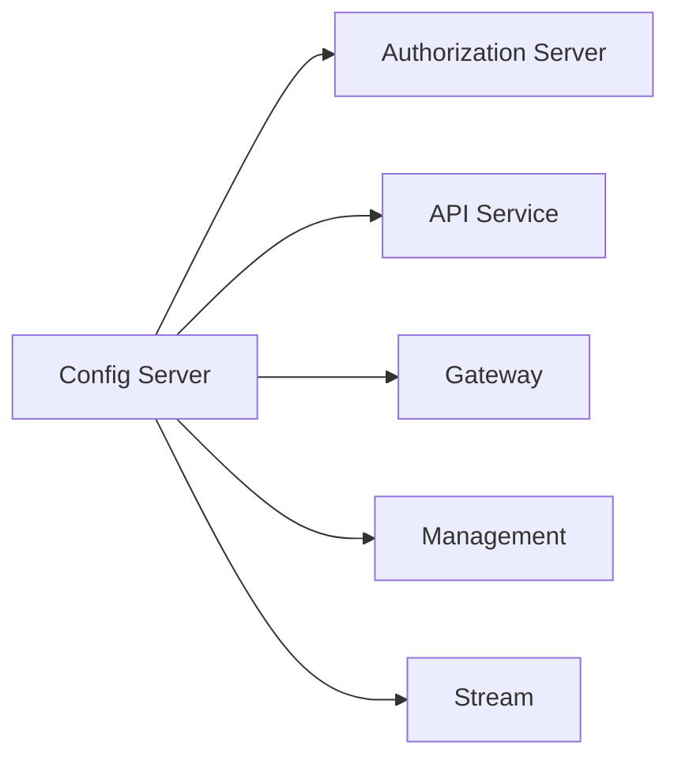

# Local Development Guide

This guide covers how to clone the repository, run services locally, use hot reload, and configure debugging.

---

## Clone and Setup

### Clone the Repository

```bash
git clone https://github.com/flamingo-run/openframe-oss-tenant.git
cd openframe-oss-tenant
```

### Install Dependencies

```bash
# Install Node.js dependencies (AI agent tooling)
npm install

# Build all Java services (skip tests for speed)
mvn clean install -DskipTests
```

---

## Local Infrastructure

Before starting services, ensure the required infrastructure is running.

### Starting MongoDB

```bash
docker run -d \
  --name openframe-mongo \
  -p 27017:27017 \
  -e MONGO_INITDB_DATABASE=openframe \
  mongo:7
```

To enable Debezium CDC, MongoDB must run with a replica set:

```bash
docker run -d \
  --name openframe-mongo \
  -p 27017:27017 \
  -e MONGO_INITDB_DATABASE=openframe \
  mongo:7 --replSet rs0

# Initialize the replica set
docker exec openframe-mongo mongosh --eval "rs.initiate()"
```

### Starting Redis

```bash
docker run -d \
  --name openframe-redis \
  -p 6379:6379 \
  redis:7
```

### Starting NATS with JetStream

```bash
docker run -d \
  --name openframe-nats \
  -p 4222:4222 \
  -p 8222:8222 \
  nats:2 -js -m 8222
```

### Starting Kafka + Zookeeper

```bash
# Zookeeper
docker run -d --name openframe-zookeeper \
  -p 2181:2181 \
  -e ZOOKEEPER_CLIENT_PORT=2181 \
  confluentinc/cp-zookeeper:7.5.0

# Kafka
docker run -d --name openframe-kafka \
  -p 9092:9092 \
  -e KAFKA_BROKER_ID=1 \
  -e KAFKA_ZOOKEEPER_CONNECT=host.docker.internal:2181 \
  -e KAFKA_ADVERTISED_LISTENERS=PLAINTEXT://localhost:9092 \
  confluentinc/cp-kafka:7.5.0
```

---

## Running Backend Services

Services should be started in the following order (dependency order):



### 1. Config Server

```bash
cd openframe/services/openframe-config
mvn spring-boot:run
```

The Config Server starts on port `8888`.

### 2. Authorization Server

```bash
cd openframe/services/openframe-authorization-server
mvn spring-boot:run -Dspring-boot.run.profiles=local
```

### 3. API Service

```bash
cd openframe/services/openframe-api
mvn spring-boot:run -Dspring-boot.run.profiles=local
```

### 4. Gateway

```bash
cd openframe/services/openframe-gateway
mvn spring-boot:run -Dspring-boot.run.profiles=local
```

The Gateway is the entry point for all external traffic.

### 5. Management Service (optional for full functionality)

```bash
cd openframe/services/openframe-management
mvn spring-boot:run -Dspring-boot.run.profiles=local
```

### 6. Stream Service (optional for event processing)

```bash
cd openframe/services/openframe-stream
mvn spring-boot:run -Dspring-boot.run.profiles=local
```

---

## Running the Frontend

The frontend is a Next.js application located at `openframe/services/openframe-frontend`.

### Install Frontend Dependencies

```bash
cd openframe/services/openframe-frontend
npm install
```

### Start in Development Mode

```bash
npm run dev
```

The frontend starts with hot reload at `http://localhost:3000`.

### Environment Variables

Create `.env.local` in `openframe/services/openframe-frontend/`:

```bash
NEXT_PUBLIC_APP_URL=http://localhost:3000
NEXT_PUBLIC_GRAPHQL_URL=http://localhost:8080/graphql
```

---

## Hot Reload and Watch Mode

### Spring Boot DevTools (Java)

Add Spring Boot DevTools to your service's `pom.xml` dependencies (dev scope only):

```xml
<dependency>
    <groupId>org.springframework.boot</groupId>
    <artifactId>spring-boot-devtools</artifactId>
    <scope>runtime</scope>
    <optional>true</optional>
</dependency>
```

With DevTools enabled, Spring Boot automatically restarts when class files change. In IntelliJ, trigger a build with **Ctrl+F9** (Windows/Linux) or **Cmd+F9** (macOS).

### Next.js Hot Reload

Next.js dev mode (`npm run dev`) includes Fast Refresh by default. Changes to React components, pages, and CSS are reflected instantly without full page reloads.

### Maven Build Watch

For continuous Java compilation:

```bash
# Auto-compile on file changes using an IDE build watcher
# Or use the Maven compiler directly
mvn compile -Dmaven.compiler.useIncrementalCompilation=true
```

---

## Debug Configuration

### IntelliJ IDEA: Remote Debug Spring Boot

1. Start any service with debug flags:

```bash
mvn spring-boot:run \
  -Dspring-boot.run.jvmArguments="-agentlib:jdwp=transport=dt_socket,server=y,suspend=n,address=*:5005"
```

2. In IntelliJ, create a **Remote JVM Debug** run configuration:
   - Transport: `Socket`
   - Debugger mode: `Attach to remote JVM`
   - Host: `localhost`
   - Port: `5005`

3. Start the debug configuration and set breakpoints.

### VS Code: Debug Next.js

Create `.vscode/launch.json`:

```json
{
  "version": "0.2.0",
  "configurations": [
    {
      "name": "Next.js: debug server-side",
      "type": "node-terminal",
      "request": "launch",
      "command": "npm run dev"
    },
    {
      "name": "Next.js: debug client-side",
      "type": "chrome",
      "request": "launch",
      "url": "http://localhost:3000"
    }
  ]
}
```

---

## Useful Development Commands

### Backend

```bash
# Build specific service only
mvn clean install -pl openframe/services/openframe-api -DskipTests

# Run a specific test
mvn test -pl openframe/services/openframe-api -Dtest=MyServiceTest

# Check for dependency conflicts
mvn dependency:tree

# Generate effective POM
mvn help:effective-pom
```

### Frontend

```bash
# Type check without building
npm run type-check

# Lint and auto-fix
npm run lint -- --fix

# Build for production (verify no build errors)
npm run build

# Run Storybook (if configured)
npm run storybook
```

### AI Agent Tooling (Node.js)

```bash
# Run the agent tooling from root
node -e "require('./index.js')"

# Or with tsx for TypeScript
npx tsx src/index.ts
```

---

## Common Local Development Issues

### Port Already in Use

```bash
# Find what's using a port
lsof -i :8080

# Kill the process
kill -9 <PID>
```

### MongoDB Connection Refused

Verify MongoDB is running:

```bash
docker ps | grep mongo
# If not running:
docker start openframe-mongo
```

### Kafka Consumer Group Lag

Reset consumer group offsets if events are stuck:

```bash
docker exec openframe-kafka kafka-consumer-groups.sh \
  --bootstrap-server localhost:9092 \
  --group openframe-stream \
  --reset-offsets \
  --to-earliest \
  --all-topics \
  --execute
```

### Spring Boot Context Fails to Start

Check that all required environment variables are set. Enable verbose Spring logging:

```bash
mvn spring-boot:run -Dlogging.level.org.springframework=DEBUG
```
