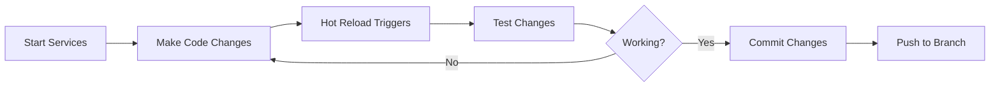

# Local Development Guide

This guide walks you through cloning OpenFrame, setting up the complete development environment, and running the platform locally with hot reload capabilities for efficient development.

## Prerequisites Verification

Before starting, ensure you have completed the [Environment Setup](./environment.md) and have:

- ✅ Java 21+ installed and configured
- ✅ Maven 3.9+ installed
- ✅ Node.js 18+ with npm
- ✅ Docker 24.0+ and Docker Compose
- ✅ Git configured with your credentials
- ✅ IDE setup (IntelliJ IDEA or VS Code)

## Repository Setup

### Clone the Repository

```bash
# Clone the main repository
git clone https://github.com/flamingo-run/openframe-oss-tenant.git
cd openframe-oss-tenant

# Verify repository structure
ls -la
# Expected directories: openframe/, clients/, manifests/, scripts/, docs/
```

### Configure GitHub Access

Set up authentication for private dependencies:

```bash
# Set GitHub credentials for Maven
export GITHUB_TOKEN="your_personal_access_token"
export GITHUB_USERNAME="your_github_username"

# For persistence, add to your shell profile:
echo 'export GITHUB_TOKEN="your_personal_access_token"' >> ~/.bashrc
echo 'export GITHUB_USERNAME="your_github_username"' >> ~/.bashrc
source ~/.bashrc
```

### Project Structure Overview

```
openframe-oss-tenant/
├── openframe/                          # Main Java project
│   ├── pom.xml                         # Parent POM
│   ├── services/                       # Microservices
│   │   ├── openframe-api/              # GraphQL API (Port 8082)
│   │   ├── openframe-gateway/          # API Gateway (Port 8081) 
│   │   ├── openframe-management/       # Admin Service (Port 8083)
│   │   ├── openframe-stream/           # Stream Processing (Port 8084)
│   │   ├── openframe-config/           # Config Server (Port 8888)
│   │   ├── openframe-client/           # Agent Management (Port 8085)
│   │   └── openframe-frontend/         # Vue.js Frontend (Port 8080)
│   └── libs/                          # Shared libraries
├── clients/                           # Client applications
│   ├── openframe-client/              # Rust system agent
│   └── openframe-chat/                # Chat client
├── integrated-tools/                 # External tool configs
└── scripts/                          # Development scripts
```

## Database Setup

### Start Development Databases

```bash
# Start all required databases using Docker Compose
cd integrated-tools
docker-compose -f docker-compose.dev.yml up -d mongodb redis cassandra kafka

# Verify databases are running
docker ps --format "table {{.Names}}\t{{.Status}}\t{{.Ports}}"
```

Expected output:
```
NAMES               STATUS              PORTS
mongodb             Up 2 minutes        0.0.0.0:27017->27017/tcp
redis               Up 2 minutes        0.0.0.0:6379->6379/tcp
cassandra           Up 2 minutes        0.0.0.0:9042->9042/tcp
kafka               Up 2 minutes        0.0.0.0:9092->9092/tcp
zookeeper           Up 2 minutes        0.0.0.0:2181->2181/tcp
```

### Initialize Development Data

```bash
# Return to project root
cd ..

# Run database initialization
./scripts/init-dev-data.sh

# This script will:
# - Create development databases
# - Insert sample organizations and users  
# - Set up default configurations
# - Create test data for development
```

## Backend Services Setup

### Build All Java Services

```bash
# Clean and build all services
mvn clean install -DskipTests

# Expected build time: 2-4 minutes
# Look for "BUILD SUCCESS" message
```

### Start Services in Development Mode

#### Option 1: Using Development Script (Recommended)

```bash
# Start all services with development profiles
./scripts/dev-start-services.sh

# This starts services in this order:
# 1. Config Server (8888)
# 2. API Gateway (8081)  
# 3. API Service (8082)
# 4. Management Service (8083)
# 5. Stream Service (8084)
# 6. Client Service (8085)
```

#### Option 2: Manual Service Startup

Start each service in separate terminal windows:

```bash
# Terminal 1: Config Server
cd openframe/services/openframe-config
mvn spring-boot:run -Dspring-boot.run.profiles=dev,local

# Terminal 2: API Gateway  
cd openframe/services/openframe-gateway
mvn spring-boot:run -Dspring-boot.run.profiles=dev,local

# Terminal 3: API Service
cd openframe/services/openframe-api  
mvn spring-boot:run -Dspring-boot.run.profiles=dev,local

# Terminal 4: Management Service
cd openframe/services/openframe-management
mvn spring-boot:run -Dspring-boot.run.profiles=dev,local

# Terminal 5: Stream Service
cd openframe/services/openframe-stream
mvn spring-boot:run -Dspring-boot.run.profiles=dev,local

# Terminal 6: Client Service
cd openframe/services/openframe-client
mvn spring-boot:run -Dspring-boot.run.profiles=dev,local
```

### Verify Backend Services

```bash
# Check service health
curl http://localhost:8888/actuator/health  # Config Server
curl http://localhost:8081/actuator/health  # Gateway
curl http://localhost:8082/actuator/health  # API Service
curl http://localhost:8083/actuator/health  # Management  
curl http://localhost:8084/actuator/health  # Stream Service
curl http://localhost:8085/actuator/health  # Client Service

# All should return: {"status":"UP"}
```

### Test GraphQL API

```bash
# Test GraphQL endpoint
curl -X POST \
  http://localhost:8082/graphql \
  -H "Content-Type: application/json" \
  -d '{"query":"{ organizations { edges { node { id name } } } }"}'
```

## Frontend Development Setup

### Install Dependencies

```bash
cd openframe/services/openframe-frontend

# Install Node.js dependencies
npm install

# Verify installation
npm list --depth=0
```

### Start Development Server

```bash
# Start Vite development server with hot reload
npm run dev

# Expected output:
# Local:   http://localhost:8080/
# Network: use --host to expose
```

### Frontend Environment Configuration

Create `openframe/services/openframe-frontend/.env.local`:

```bash
# API Configuration
VITE_API_URL=http://localhost:8081
VITE_GRAPHQL_URL=http://localhost:8082/graphql
VITE_WS_URL=ws://localhost:8081/ws

# Development Settings
VITE_NODE_ENV=development
VITE_LOG_LEVEL=debug

# Feature Flags
VITE_ENABLE_DEBUG_TOOLS=true
VITE_MOCK_API=false
```

### Verify Frontend

1. **Open browser** to http://localhost:8080
2. **Check console** for any errors
3. **Test login** with default credentials:
   - Username: `admin@openframe.local`
   - Password: `admin123!`

## Hot Reload Development

### Backend Hot Reload (Spring DevTools)

#### Configure IntelliJ IDEA

1. **Enable** Build project automatically:
   - Settings → Build, Execution, Deployment → Compiler
   - Check "Build project automatically"

2. **Enable** Registry setting:
   - Help → Find Action → Registry
   - Enable `compiler.automake.allow.when.app.running`

3. **Configure** run configuration:
   ```xml
   <option name="VM_PARAMETERS" value="-Dspring.devtools.restart.enabled=true" />
   ```

#### Configure VS Code

Add to `launch.json`:
```json
{
  "type": "java",
  "request": "launch", 
  "mainClass": "com.openframe.api.ApiApplication",
  "projectName": "openframe-api",
  "vmArgs": "-Dspring.devtools.restart.enabled=true"
}
```

### Frontend Hot Reload (Vite HMR)

Frontend changes automatically reload when you save files:

```bash
# Watch mode is enabled by default with npm run dev
# Changes to .vue, .ts, .css files trigger instant reload
# Changes to configuration files may require restart
```

### Database Changes with Hot Reload

For schema changes during development:

```bash
# MongoDB - No restart needed for most changes
# Add indexes or collections through MongoDB Compass

# Redis - Restart if configuration changes
docker restart redis

# Cassandra - Restart if schema changes
docker restart cassandra
```

## Rust Client Development (Optional)

### Setup Rust Development

```bash
cd clients/openframe-client

# Install dependencies
cargo fetch

# Build in development mode
cargo build

# Run with file watching
cargo install cargo-watch
cargo watch -x run
```

### Client Configuration

Create `clients/openframe-client/.env`:
```bash
# OpenFrame API Configuration
OPENFRAME_API_URL=http://localhost:8081
OPENFRAME_CLIENT_ID=development-client
OPENFRAME_CLIENT_SECRET=dev-secret

# Logging
RUST_LOG=debug
RUST_BACKTRACE=1

# Development Settings
AGENT_UPDATE_INTERVAL=30s
HEARTBEAT_INTERVAL=60s
```

## Development Workflow

### Typical Development Cycle



### Daily Development Routine

1. **Start Development Environment**:
   ```bash
   # Start databases
   cd integrated-tools && docker-compose -f docker-compose.dev.yml up -d
   
   # Start backend services
   ./scripts/dev-start-services.sh
   
   # Start frontend
   cd openframe/services/openframe-frontend && npm run dev
   ```

2. **Make Changes**:
   - Backend: Edit Java files, changes auto-reload with DevTools
   - Frontend: Edit Vue/TypeScript files, changes auto-reload with Vite
   - Database: Use GUI tools or scripts to modify data

3. **Test Changes**:
   ```bash
   # Run specific tests
   mvn test -Dtest=UserServiceTest
   
   # Run frontend tests  
   cd openframe/services/openframe-frontend
   npm run test:unit
   ```

4. **Commit and Push**:
   ```bash
   git add .
   git commit -m "feat: add user management feature"
   git push origin feature/user-management
   ```

## Debugging Setup

### Backend Debugging

#### IntelliJ IDEA Debugging
1. **Set breakpoints** in your Java code
2. **Run in debug mode** (green bug icon)
3. **Use debugging tools**:
   - Step through code
   - Inspect variables
   - Evaluate expressions

#### Remote Debugging
```bash
# Start service with debug port
mvn spring-boot:run -Dspring-boot.run.jvmArguments="-Xdebug -Xrunjdwp:transport=dt_socket,server=y,suspend=n,address=5005"

# Connect IntelliJ IDEA to localhost:5005
```

### Frontend Debugging

#### Browser DevTools
1. **Open Chrome DevTools** (F12)
2. **Use Vue DevTools** extension
3. **Check Network tab** for API calls
4. **Use Console** for JavaScript debugging

#### VS Code Debugging
```json
{
  "type": "chrome",
  "request": "launch",
  "name": "Debug Frontend",
  "url": "http://localhost:8080",
  "webRoot": "${workspaceFolder}/openframe/services/openframe-frontend/src"
}
```

## Testing During Development

### Backend Testing

```bash
# Run all tests
mvn test

# Run tests for specific service
cd openframe/services/openframe-api
mvn test

# Run specific test class
mvn test -Dtest=UserServiceTest

# Run tests with coverage
mvn test jacoco:report
```

### Frontend Testing

```bash
cd openframe/services/openframe-frontend

# Run unit tests
npm run test:unit

# Run tests in watch mode
npm run test:watch

# Run E2E tests (if configured)
npm run test:e2e

# Type checking
npm run type-check
```

### Integration Testing

```bash
# Test full API flow
cd openframe-e2e-tests
mvn test -Dtest=UserRegistrationTest
```

## Performance Monitoring

### Development Metrics

#### Monitor Resource Usage
```bash
# Check Docker container resources
docker stats

# Monitor Java heap usage
jps -v
jstat -gc <java-process-id>

# Monitor Node.js memory
node --inspect-brk=0.0.0.0:9229 node_modules/.bin/vite
```

#### Profile Applications
```bash
# Java profiling with JProfiler or VisualVM
# Connect to running Spring Boot applications

# Frontend profiling with Chrome DevTools
# Performance tab in Chrome DevTools
```

## Common Development Issues

### Port Conflicts

```bash
# Find what's using a port
lsof -i :8080

# Kill process using port
kill -9 <PID>

# Change service port temporarily
mvn spring-boot:run -Dserver.port=8090
```

### Memory Issues

```bash
# Increase Java heap for Maven
export MAVEN_OPTS="-Xmx4g -XX:MaxMetaspaceSize=512m"

# Increase Node.js memory
export NODE_OPTIONS="--max-old-space-size=8192"

# Clear Docker resources
docker system prune -a
```

### Database Connection Issues

```bash
# Restart database containers
docker-compose restart mongodb redis cassandra

# Check database logs
docker logs mongodb

# Reset development database
./scripts/reset-dev-database.sh
```

### Dependency Issues

```bash
# Clean Maven dependencies
mvn dependency:purge-local-repository

# Clean npm cache
npm cache clean --force
rm -rf node_modules package-lock.json
npm install

# Update dependencies
mvn versions:display-dependency-updates
npm outdated
```

## IDE-Specific Development Tips

### IntelliJ IDEA

#### Useful Shortcuts
- `Ctrl+Shift+F10`: Run current class
- `Ctrl+Shift+F9`: Debug current class
- `Ctrl+Shift+R`: Reload changed classes
- `Alt+F12`: Terminal
- `Ctrl+E`: Recent files

#### Live Templates
Create custom templates for OpenFrame patterns:
```java
// Spring Service template
@Service
public class $CLASS_NAME$ {
    private final $REPOSITORY$ repository;
    
    public $CLASS_NAME$($REPOSITORY$ repository) {
        this.repository = repository;
    }
}
```

### VS Code

#### Useful Extensions for OpenFrame
- **Thunder Client**: API testing
- **GitLens**: Git integration  
- **Bracket Pair Colorizer**: Code readability
- **Auto Rename Tag**: HTML/Vue tag editing

#### Workspace Settings
```json
{
  "java.configuration.workspaces": ["openframe"],
  "java.import.gradle.enabled": false,
  "java.configuration.maven.userSettings": "~/.m2/settings.xml"
}
```

## Next Steps

With your local development environment running:

1. **[Architecture Overview](../architecture/overview.md)** - Understand the system design
2. **[Testing Overview](../testing/overview.md)** - Learn the testing strategies  
3. **[Contributing Guidelines](../contributing/guidelines.md)** - Start contributing to OpenFrame

## Development Resources

### Useful Commands Reference
```bash
# Development environment commands
alias of-start="./scripts/dev-start-services.sh"
alias of-stop="./scripts/dev-stop-services.sh"
alias of-restart="./scripts/dev-restart-services.sh"
alias of-logs="./scripts/dev-show-logs.sh"

# Build commands
alias of-build="mvn clean install -DskipTests"
alias of-test="mvn test"
alias of-frontend="cd openframe/services/openframe-frontend && npm run dev"

# Database commands  
alias of-db-start="docker-compose -f integrated-tools/docker-compose.dev.yml up -d"
alias of-db-stop="docker-compose -f integrated-tools/docker-compose.dev.yml down"
alias of-db-reset="./scripts/reset-dev-database.sh"
```

### Community Support
- **OpenMSP Slack**: [Join Here](https://join.slack.com/t/openmsp/shared_invite/zt-36bl7mx0h-3~U2nFH6nqHqoTPXMaHEHA)
- **Development Channel**: #openframe-dev  
- **Questions**: #general or #help

---

You're now ready for efficient OpenFrame development with hot reload capabilities! 🚀 Happy coding!