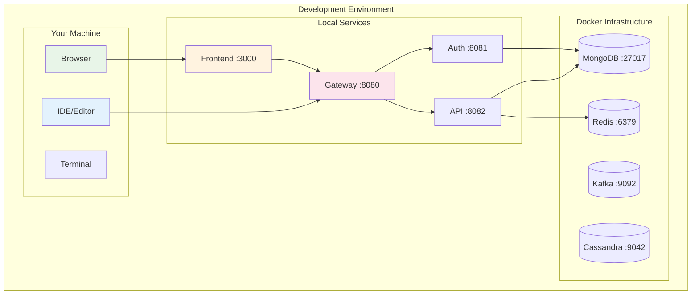

# Local Development Guide

This guide walks you through setting up OpenFrame for local development, including hot reload, debugging, and testing workflows. Perfect for contributors and developers building integrations.

## Prerequisites

Before starting, ensure you have completed the [Environment Setup](environment.md) guide and have all required tools installed.

## Quick Development Start

```bash
# Clone and enter the repository
git clone https://github.com/flamingo-stack/openframe-oss-tenant.git
cd openframe-oss-tenant

# Start infrastructure services
docker compose -f integrated-tools/docker-compose.yml up -d

# Build all Java services
mvn clean install -DskipTests

# Start development mode
./scripts/dev/start-dev.sh
```

## Development Architecture

In development mode, OpenFrame runs with these characteristics:



## Service-by-Service Development

### Backend Services Development

#### 1. Gateway Service Development

The gateway is the entry point for all requests:

```bash
# Start gateway in development mode
cd openframe/services/openframe-gateway
mvn spring-boot:run -Dspring-boot.run.profiles=dev

# With debugging enabled
mvn spring-boot:run -Dspring-boot.run.profiles=dev \
  -Dspring-boot.run.jvmArguments="-Xdebug -Xrunjdwp:transport=dt_socket,server=y,suspend=n,address=5005"
```

**Gateway Features in Development:**
- Hot reload with Spring Boot DevTools
- CORS enabled for local frontend
- Debug logging for request routing
- Health checks at `http://localhost:8080/actuator/health`

#### 2. API Service Development

The main GraphQL and REST API service:

```bash
# Start API service
cd openframe/services/openframe-api
mvn spring-boot:run -Dspring-boot.run.profiles=dev

# Enable GraphQL playground
# Access at: http://localhost:8082/graphiql
```

**Development Features:**
- GraphQL playground for query testing
- Database auto-schema creation
- Sample data loading
- Debug endpoints enabled

**Sample GraphQL Queries:**
```graphql
# Get all devices
query GetDevices {
  devices {
    edges {
      node {
        id
        name
        status
        operatingSystem
        lastSeen
      }
    }
  }
}

# Get organizations
query GetOrganizations {
  organizations {
    edges {
      node {
        id
        name
        contactPerson {
          name
          email
        }
      }
    }
  }
}
```

#### 3. Authorization Service Development

OAuth2/OIDC authentication service:

```bash
# Start authorization service
cd openframe/services/openframe-authorization-server
mvn spring-boot:run -Dspring-boot.run.profiles=dev
```

**Development Configuration:**
- Pre-configured OAuth providers for testing
- Mock SMTP for email verification
- Test user accounts auto-created
- OIDC discovery at `http://localhost:8081/.well-known/openid-configuration`

### Frontend Development

#### Vue.js Frontend Development

```bash
# Start frontend development server
cd openframe/services/openframe-frontend
npm install
npm run dev
```

**Development Features:**
- Hot module replacement (HMR)
- TypeScript compilation with type checking
- ESLint and Prettier integration
- Vue DevTools support
- Mock data for offline development

#### Frontend Development Configuration

```typescript
// vite.config.ts (simplified)
export default defineConfig({
  server: {
    port: 3000,
    proxy: {
      '/api': 'http://localhost:8080',
      '/graphql': 'http://localhost:8080',
      '/ws': {
        target: 'ws://localhost:8080',
        ws: true
      }
    }
  },
  resolve: {
    alias: {
      '@': path.resolve(__dirname, './src')
    }
  }
})
```

#### Frontend Environment Variables

```bash
# .env.development (in frontend directory)
VITE_API_URL=http://localhost:8080
VITE_WS_URL=ws://localhost:8080/ws
VITE_ENABLE_MOCKS=false
VITE_LOG_LEVEL=debug
VITE_FEATURE_FLAGS=dev-tools,debug-panels
```

## Database Development Workflow

### MongoDB Development

```bash
# Connect to development database
mongosh "mongodb://localhost:27017/openframe_dev"

# Common development queries
db.machines.find().limit(5)
db.users.find({"email": /@example\.com$/})
db.organizations.countDocuments()

# Reset database for clean testing
db.dropDatabase()
```

**Development Collections:**
- `users` - User accounts and profiles
- `organizations` - Tenant organizations
- `machines` - Managed devices
- `installedAgents` - Agent installations
- `apiKeys` - API key management

### Redis Development

```bash
# Connect to Redis
redis-cli

# Monitor Redis commands in real-time
redis-cli monitor

# Check cache keys
redis-cli keys "*session*"
redis-cli keys "*cache*"

# Clear development cache
redis-cli flushdb
```

**Development Usage:**
- Session storage
- API response caching
- Rate limiting counters
- WebSocket connection tracking

### Kafka Development

```bash
# List topics
docker exec -it openframe-kafka kafka-topics.sh --bootstrap-server localhost:9092 --list

# Watch messages in development
docker exec -it openframe-kafka kafka-console-consumer.sh \
  --bootstrap-server localhost:9092 \
  --topic device-events \
  --from-beginning

# Produce test messages
echo '{"type":"test","data":"hello"}' | \
docker exec -i openframe-kafka kafka-console-producer.sh \
  --bootstrap-server localhost:9092 \
  --topic device-events
```

**Development Topics:**
- `device-events` - Device status changes
- `log-events` - Aggregated log entries
- `tool-events` - Tool integration events
- `audit-events` - Security and audit logs

## Debugging and Testing

### Backend Debugging

#### IntelliJ IDEA Debug Configuration

1. **Create Debug Configuration**:
   - Run → Edit Configurations
   - Add → Remote JVM Debug
   - Host: localhost, Port: 5005
   - Module: openframe-gateway (or respective service)

2. **Start Service with Debug**:
   ```bash
   mvn spring-boot:run -Dspring-boot.run.jvmArguments="-agentlib:jdwp=transport=dt_socket,server=y,suspend=n,address=*:5005"
   ```

3. **Attach Debugger**: Click debug button in IDE

#### VSCode Debug Configuration

```json
// .vscode/launch.json
{
  "version": "0.2.0",
  "configurations": [
    {
      "type": "java",
      "name": "Debug Gateway",
      "request": "attach",
      "hostName": "localhost",
      "port": 5005
    },
    {
      "type": "node",
      "name": "Debug Frontend",
      "request": "launch",
      "program": "${workspaceFolder}/openframe/services/openframe-frontend/node_modules/.bin/vite",
      "args": ["--mode", "development"],
      "console": "integratedTerminal",
      "cwd": "${workspaceFolder}/openframe/services/openframe-frontend"
    }
  ]
}
```

### Frontend Debugging

#### Vue DevTools

```bash
# Install Vue DevTools browser extension
# Chrome: https://chrome.google.com/webstore/detail/vuejs-devtools/nhdogjmejiglipccpnnnanhbledajbpd
# Firefox: https://addons.mozilla.org/en-US/firefox/addon/vue-js-devtools/

# Enable in development
# Automatically enabled when NODE_ENV=development
```

#### Debug Configuration

```typescript
// main.ts
import { createApp } from 'vue'

const app = createApp(App)

if (import.meta.env.DEV) {
  // Enable Vue DevTools
  app.config.performance = true
  app.config.devtools = true
  
  // Global debug helpers
  window.app = app
  window.store = store
}
```

### Testing During Development

#### Running Unit Tests

```bash
# Java unit tests
mvn test

# Frontend unit tests  
cd openframe/services/openframe-frontend
npm run test:unit

# Run tests in watch mode (re-run on file changes)
npm run test:unit -- --watch
```

#### Integration Testing

```bash
# Start test environment
docker compose -f integrated-tools/docker-compose.test.yml up -d

# Run integration tests
mvn test -Dtest=**/*IntegrationTest

# End-to-end tests
cd openframe-e2e-tests
mvn test -Dtest=**/*E2ETest
```

#### API Testing

Use the GraphQL Playground for interactive testing:

1. **Access Playground**: http://localhost:8082/graphiql
2. **Authentication**: Use the built-in auth for testing
3. **Query Examples**:

```graphql
# Mutation: Create test organization
mutation CreateOrg {
  createOrganization(input: {
    name: "Test Org"
    contactPerson: {
      name: "Test User"
      email: "test@example.com"
    }
  }) {
    id
    name
  }
}

# Query: Fetch with filters
query FilteredDevices($filter: DeviceFilterInput) {
  devices(filter: $filter) {
    totalCount
    edges {
      node {
        id
        name
        status
      }
    }
  }
}
```

## Hot Reload Configuration

### Backend Hot Reload

Spring Boot DevTools provides automatic restart:

```xml
<!-- pom.xml - already included in OpenFrame services -->
<dependency>
  <groupId>org.springframework.boot</groupId>
  <artifactId>spring-boot-devtools</artifactId>
  <scope>runtime</scope>
  <optional>true</optional>
</dependency>
```

**Hot Reload Behavior:**
- **Java files**: Automatic restart on compilation
- **Properties files**: Automatic restart
- **Static resources**: No restart needed
- **Templates**: Hot swap support

### Frontend Hot Reload

Vite provides near-instantaneous updates:

```typescript
// Hot Module Replacement (HMR) in development
if (import.meta.hot) {
  import.meta.hot.accept()
}
```

**Hot Reload Features:**
- **Vue components**: State-preserving hot reload
- **CSS/SCSS**: Instant style updates
- **TypeScript**: Fast incremental compilation
- **Assets**: Automatic browser refresh

## Development Scripts and Automation

### Useful Development Scripts

Create these scripts for common development tasks:

```bash
# scripts/dev/reset-db.sh - Reset development database
#!/bin/bash
mongosh "mongodb://localhost:27017/openframe_dev" --eval "db.dropDatabase()"
redis-cli flushdb
echo "✅ Development databases reset"

# scripts/dev/check-services.sh - Check all services
#!/bin/bash
echo "🔍 Checking service health..."
curl -s http://localhost:8080/actuator/health | jq '.status'
curl -s http://localhost:8082/actuator/health | jq '.status'  
curl -s http://localhost:3000 > /dev/null && echo "✅ Frontend OK"

# scripts/dev/logs.sh - Tail all service logs
#!/bin/bash
docker compose -f integrated-tools/docker-compose.yml logs -f &
tail -f openframe/services/*/target/logs/*.log 2>/dev/null &
npm --prefix openframe/services/openframe-frontend run dev 2>&1 | grep -v "vite"
```

### Git Hooks for Development

```bash
# .git/hooks/pre-commit
#!/bin/bash
echo "Running pre-commit checks..."

# Check Java formatting
mvn spotless:check -q || {
  echo "❌ Java formatting check failed. Run 'mvn spotless:apply'"
  exit 1
}

# Check frontend formatting
cd openframe/services/openframe-frontend
npm run lint || {
  echo "❌ Frontend linting failed. Run 'npm run lint:fix'"
  exit 1
}

echo "✅ Pre-commit checks passed"
```

## Performance Optimization for Development

### JVM Optimization

```bash
# Set development-friendly JVM options
export MAVEN_OPTS="-Xmx2g -XX:+UseG1GC -XX:+UseStringDeduplication"

# Enable JVM debugging and monitoring
export JAVA_OPTS="-Xdebug -Xrunjdwp:transport=dt_socket,server=y,suspend=n,address=5005 -Djava.awt.headless=true"
```

### Build Optimization

```xml
<!-- pom.xml - Maven optimization for development -->
<properties>
  <!-- Skip unnecessary checks in development -->
  <maven.test.skip>true</maven.test.skip>
  <spotbugs.skip>true</spotbugs.skip>
  <checkstyle.skip>true</checkstyle.skip>
  
  <!-- Parallel builds -->
  <maven.compiler.fork>true</maven.compiler.fork>
  <maven.compiler.maxmem>1024m</maven.compiler.maxmem>
</properties>
```

### Frontend Build Optimization

```typescript
// vite.config.ts
export default defineConfig({
  build: {
    sourcemap: true, // Enable for debugging
    rollupOptions: {
      output: {
        manualChunks: {
          vendor: ['vue', 'pinia', '@apollo/client']
        }
      }
    }
  },
  optimizeDeps: {
    include: ['vue', 'pinia', '@apollo/client']
  }
})
```

## Troubleshooting Development Issues

### Common Backend Issues

#### Port Conflicts
```bash
# Check what's using a port
sudo lsof -i :8080

# Kill process using port
sudo kill -9 $(lsof -t -i:8080)

# Use different port temporarily
mvn spring-boot:run -Dspring-boot.run.arguments="--server.port=8090"
```

#### Database Connection Issues
```bash
# Check if MongoDB is running
docker ps | grep mongo

# Check database connectivity
mongosh "mongodb://localhost:27017" --eval "db.runCommand({ping: 1})"

# Reset database connection pool
# Restart the application service
```

#### Memory Issues
```bash
# Check Java process memory usage
jps -v

# Increase heap size for Maven
export MAVEN_OPTS="-Xmx4g"

# Monitor memory usage
htop
```

### Common Frontend Issues

#### Node.js Version Issues
```bash
# Check Node version
node --version

# Switch to correct version
nvm use 20

# Clear npm cache if needed
npm cache clean --force
```

#### Dependencies Issues
```bash
# Clear node_modules and reinstall
rm -rf node_modules package-lock.json
npm install

# Check for conflicting dependencies
npm ls

# Update dependencies
npm update
```

#### Build Issues
```bash
# Check TypeScript errors
npm run type-check

# Check for syntax errors
npm run lint

# Clear Vite cache
rm -rf node_modules/.vite
```

## What's Next?

With your local development environment running:

1. **Explore Architecture**: Read [Architecture Overview](../architecture/overview.md)
2. **Run Tests**: Learn about [Testing Overview](../testing/overview.md)
3. **Make Changes**: Follow [Contributing Guidelines](../contributing/guidelines.md)

---

Your local development environment is now ready for OpenFrame development! You can make changes and see them reflected immediately in your running local instance.