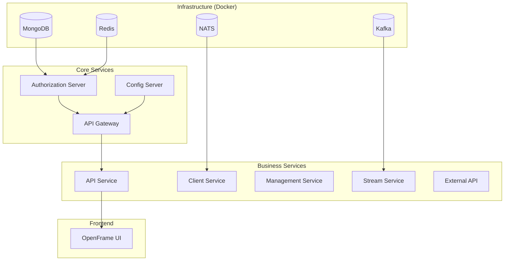
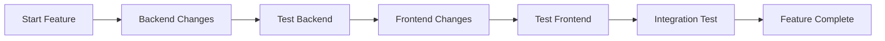

# Local Development Guide

This guide covers running OpenFrame services locally for development, including startup procedures, debugging, hot reload configuration, and common development workflows.

## Overview

OpenFrame's microservices architecture requires running multiple services simultaneously. This guide provides efficient strategies for local development, from single-service debugging to full-stack development.

## Quick Start for Impatient Developers

If you just want to get everything running quickly:

```bash
# Clone and enter the repository
git clone https://github.com/flamingo-stack/openframe-oss-tenant.git
cd openframe-oss-tenant

# Start infrastructure and all services
./scripts/run-mac.sh --silent     # macOS
./scripts/run-linux.sh --silent   # Linux  
./scripts/run-windows.ps1 -Silent # Windows
```

This will start all services and open the frontend at `http://localhost:3000`.

## Service Startup Order

Services have dependencies and should be started in this order for optimal startup time:



## Infrastructure Services

### Starting Infrastructure with Docker

All infrastructure services run in Docker for consistency:

```bash
# Start all infrastructure services
cd integrated-tools
docker-compose up -d

# Start specific services only
docker-compose up -d mongodb redis

# Check service status
docker-compose ps

# View service logs
docker-compose logs -f mongodb
```

### Verifying Infrastructure

Ensure all infrastructure is ready before starting application services:

```bash
# Test MongoDB
mongosh --eval "db.runCommand('ping')" mongodb://localhost:27017/openframe

# Test Redis  
redis-cli -h localhost -p 6379 ping

# Test Kafka (requires kafka tools)
kafka-topics.sh --bootstrap-server localhost:9092 --list

# Test NATS
curl -s http://localhost:8222/varz | jq .
```

## Backend Services Development

### Running Individual Services

Each service can be run independently for focused development:

#### Authorization Server (Port 8082)
```bash
cd openframe/services/openframe-authorization-server

# Standard startup
mvn spring-boot:run

# With debug port 5005
mvn spring-boot:run -Dspring-boot.run.jvmArguments="-Xdebug -Xrunjdwp:transport=dt_socket,server=y,suspend=n,address=5005"

# With specific profile
mvn spring-boot:run -Dspring-boot.run.profiles=development,debug
```

#### API Gateway (Port 8080)
```bash
cd openframe/services/openframe-gateway

# Standard startup - requires Authorization Server running
mvn spring-boot:run

# With enhanced logging
mvn spring-boot:run -Dspring-boot.run.arguments="--logging.level.com.openframe.gateway=DEBUG"
```

#### API Service (Port 8081)
```bash
cd openframe/services/openframe-api

# Standard startup
mvn spring-boot:run  

# With GraphQL playground enabled
mvn spring-boot:run -Dspring-boot.run.arguments="--graphql.playground.enabled=true"
```

#### Management Service (Port 8083)
```bash
cd openframe/services/openframe-management

# Standard startup
mvn spring-boot:run

# Skip schedulers for development
mvn spring-boot:run -Dspring-boot.run.arguments="--openframe.schedulers.enabled=false"
```

### Parallel Service Startup

For full-stack development, run services in parallel:

**Terminal 1 - Authorization Server**:
```bash
cd openframe/services/openframe-authorization-server && mvn spring-boot:run
```

**Terminal 2 - API Gateway**:
```bash
# Wait for Authorization Server to start
sleep 30
cd openframe/services/openframe-gateway && mvn spring-boot:run
```

**Terminal 3 - API Service**:
```bash
# Wait for Gateway to start  
sleep 45
cd openframe/services/openframe-api && mvn spring-boot:run
```

**Terminal 4 - Management Service**:
```bash
cd openframe/services/openframe-management && mvn spring-boot:run
```

### Automated Service Management

Create a development service manager script (`scripts/dev-services.sh`):

```bash
#!/bin/bash

SERVICE_ROOT="openframe/services"
PIDS_FILE="/tmp/openframe-pids"

start_service() {
    local service=$1
    local port=$2
    local wait_time=${3:-0}
    
    echo "Starting $service (port $port)..."
    
    if [ $wait_time -gt 0 ]; then
        echo "Waiting ${wait_time}s for dependencies..."
        sleep $wait_time
    fi
    
    cd "$SERVICE_ROOT/$service"
    mvn spring-boot:run > /tmp/openframe-$service.log 2>&1 &
    local pid=$!
    echo "$service:$pid" >> $PIDS_FILE
    echo "Started $service with PID $pid"
    cd - > /dev/null
}

stop_services() {
    if [ -f $PIDS_FILE ]; then
        while IFS=: read -r service pid; do
            echo "Stopping $service (PID $pid)..."
            kill $pid 2>/dev/null
        done < $PIDS_FILE
        rm $PIDS_FILE
    fi
}

case "$1" in
    start)
        echo "Starting all OpenFrame services..."
        > $PIDS_FILE
        
        # Start services with proper delays
        start_service "openframe-authorization-server" 8082 0
        start_service "openframe-gateway" 8080 30
        start_service "openframe-api" 8081 15
        start_service "openframe-management" 8083 10
        
        echo "All services started. PIDs saved to $PIDS_FILE"
        ;;
    stop)
        echo "Stopping all OpenFrame services..."
        stop_services
        ;;
    restart)
        stop_services
        sleep 5
        $0 start
        ;;
    *)
        echo "Usage: $0 {start|stop|restart}"
        exit 1
        ;;
esac
```

## Frontend Development

### Standard Development Server

```bash
cd openframe/services/openframe-frontend

# Install dependencies (first time only)
npm install

# Start development server with hot reload
npm run dev

# The server will start on http://localhost:3000
# Changes to source files will automatically reload
```

### Advanced Frontend Development

#### With Backend API Integration

```bash
# Start with specific API endpoint
VITE_API_BASE_URL=http://localhost:8080 npm run dev

# Start with GraphQL debugging enabled
VITE_GRAPHQL_DEBUG=true npm run dev

# Start with mock data (no backend required)
VITE_USE_MOCK_DATA=true npm run dev
```

#### Development with Hot Module Replacement

Vite provides excellent HMR. To optimize the experience:

**`vite.config.ts` optimizations**:
```typescript
export default defineConfig({
  server: {
    port: 3000,
    host: true, // Allow external connections
    hmr: {
      overlay: true // Show errors as overlay
    },
    proxy: {
      '/api': {
        target: 'http://localhost:8080',
        changeOrigin: true
      },
      '/graphql': {
        target: 'http://localhost:8081', 
        changeOrigin: true
      }
    }
  },
  build: {
    sourcemap: true // Enable source maps for debugging
  }
})
```

### Frontend-Only Development

For UI development without backend services:

```bash
# Use Vite's built-in mocks
npm run dev:mock

# Or with MSW (Mock Service Worker)
npm run dev:msw
```

## Hot Reload and Development Features

### Spring Boot DevTools

Automatically enabled in development, provides:

- **Automatic Restart**: When classpath changes
- **LiveReload**: Browser refresh when resources change
- **Property Defaults**: Development-friendly defaults

#### Configuration

Add to `application-development.yml`:

```yaml
spring:
  devtools:
    restart:
      enabled: true
      additional-paths: src/main/java
    livereload:
      enabled: true
      port: 35729
```

### Frontend Hot Reload

Vite provides instant hot reload for:
- **Vue Component Changes**: Preserves component state
- **CSS/Style Changes**: Updates without page reload  
- **GraphQL Schema Changes**: Automatic regeneration
- **Route Changes**: Navigation updates

#### Optimizing Hot Reload Performance

**Exclude heavy directories from watching**:
```javascript
// vite.config.ts
export default defineConfig({
  server: {
    watch: {
      ignored: [
        '**/node_modules/**',
        '**/dist/**',
        '**/coverage/**'
      ]
    }
  }
})
```

## Debugging Configuration

### Backend Service Debugging

#### IntelliJ IDEA Setup

1. **Create Run Configuration**:
   ```
   Name: OpenFrame API Debug
   Main Class: com.openframe.api.ApiApplication
   VM Options: -Xdebug -Xrunjdwp:transport=dt_socket,server=y,suspend=n,address=5005
   Program Arguments: --spring.profiles.active=development
   ```

2. **Remote Debug Configuration**:
   ```
   Name: Remote Debug API
   Host: localhost
   Port: 5005
   Module: openframe-api
   ```

#### VS Code Setup

**`.vscode/launch.json`**:
```json
{
  "version": "0.2.0",
  "configurations": [
    {
      "name": "Debug API Service",
      "type": "java",
      "request": "attach",
      "hostName": "localhost",
      "port": 5005,
      "projectName": "openframe-api"
    },
    {
      "name": "Debug Frontend",
      "type": "node", 
      "request": "launch",
      "program": "${workspaceFolder}/openframe/services/openframe-frontend/node_modules/.bin/vite",
      "args": ["dev"],
      "env": {
        "NODE_ENV": "development"
      }
    }
  ]
}
```

### Database Debugging

#### MongoDB Query Profiling

```javascript
// In mongo shell
db.setProfilingLevel(1, {slowms: 100})

// View slow queries
db.system.profile.find().limit(5).sort({ts: -1}).pretty()
```

#### Redis Command Monitoring

```bash
# Monitor all Redis commands
redis-cli monitor

# Monitor specific key patterns
redis-cli --scan --pattern "*session*"
```

### GraphQL Debugging

#### Enable GraphQL Playground

Add to API service `application-development.yml`:

```yaml
graphql:
  playground:
    enabled: true
    mapping: /graphiql
  tools:
    schema-location-pattern: "**/*.graphqls"
```

Access at: `http://localhost:8081/graphiql`

#### Frontend GraphQL Debugging

**Apollo Client DevTools Configuration**:
```typescript
const client = new ApolloClient({
  uri: 'http://localhost:8081/graphql',
  cache: new InMemoryCache(),
  devtools: {
    enabled: process.env.NODE_ENV === 'development'
  }
})
```

## Development Workflows

### Feature Development Workflow



#### Typical Development Session

1. **Start Infrastructure**: `docker-compose up -d`
2. **Start Core Services**: Authorization, Gateway, API
3. **Start Frontend**: `npm run dev`
4. **Make Changes**: Edit code with hot reload
5. **Test Changes**: Use browser dev tools and API testing
6. **Commit**: When tests pass

### Testing During Development

#### Unit Testing

```bash
# Backend unit tests
mvn test -pl openframe-api

# Frontend unit tests  
npm run test:unit

# Watch mode for continuous testing
npm run test:watch
```

#### Integration Testing

```bash
# API integration tests
mvn test -pl openframe-api -Dtest=*IntegrationTest

# End-to-end tests
npm run test:e2e:dev
```

#### Manual Testing

Use these endpoints for manual testing:

| Service | Health Check | Key Endpoints |
|---------|-------------|---------------|
| **Gateway** | `GET /actuator/health` | `/api/*`, `/auth/*` |
| **API** | `GET /actuator/health` | `/graphql`, `/graphiql` |
| **Authorization** | `GET /actuator/health` | `/oauth2/*`, `/.well-known/openid-configuration` |

## Performance Optimization

### JVM Tuning for Development

```bash
# Optimized JVM settings for development
export MAVEN_OPTS="-Xmx4g -Xms2g -XX:+UseG1GC -XX:+UseStringDeduplication -XX:TieredStopAtLevel=1"

# Faster startup (reduced optimization)
export JAVA_TOOL_OPTIONS="-Djava.compiler=NONE -Xverify:none"
```

### Database Performance

#### MongoDB Development Optimization

```javascript
// Disable journaling for development (data loss acceptable)
mongod --nojournal --smallfiles

// Use in-memory storage for tests
mongod --storageEngine ephemeralForTest
```

#### Redis Development Settings

```bash
# Disable persistence for development
redis-cli CONFIG SET save ""
redis-cli CONFIG SET appendonly no
```

## Troubleshooting Common Issues

### Service Startup Problems

**Port Already in Use**:
```bash
# Find and kill process using port
lsof -ti :8080 | xargs kill -9

# Change port temporarily
mvn spring-boot:run -Dspring-boot.run.arguments="--server.port=8090"
```

**Service Won't Start**:
```bash
# Clear Maven cache
rm -rf ~/.m2/repository/com/openframe

# Check Java version
java -version  # Must be Java 21

# Clear logs and restart
rm -rf logs/ && mvn clean compile
```

### Frontend Issues

**HMR Not Working**:
```bash
# Clear Vite cache
rm -rf node_modules/.vite

# Restart dev server
npm run dev
```

**Build Issues**:
```bash
# Clear all caches
rm -rf node_modules dist .vite
npm install
```

### Database Connection Issues

**MongoDB Connection Failed**:
```bash
# Check if MongoDB is running
docker ps | grep mongo

# Reset MongoDB data (development only!)
docker-compose down -v
docker-compose up -d mongodb
```

**Redis Connection Issues**:
```bash
# Check Redis status
redis-cli ping

# Reset Redis data
redis-cli FLUSHALL
```

## Development Best Practices

### Efficient Development Habits

1. **Start Infrastructure First**: Always start Docker services before application services
2. **Use Service Dependencies**: Start services in the correct order
3. **Monitor Logs**: Keep log windows open for each service
4. **Use Hot Reload**: Make the most of automatic restart features
5. **Test Early**: Run tests frequently during development

### Resource Management

```bash
# Monitor resource usage
top -p $(pgrep -f "spring-boot")

# Limit Maven memory usage
export MAVEN_OPTS="-Xmx1g"

# Use Docker resource limits
docker run --memory=512m --cpus="1.0" mongo:7
```

### Environment Consistency

```bash
# Use consistent Java version
sdk use java 21.0.2-tem

# Use consistent Node version  
nvm use 18

# Document versions in README
java -version > .java-version
node -v > .nvmrc
```

## Next Steps

With local development running smoothly:

1. **[Review Architecture](../architecture/overview.md)** - Understand service interactions
2. **[Learn Testing Approaches](../testing/overview.md)** - Write effective tests
3. **[Study Contributing Guidelines](../contributing/guidelines.md)** - Follow project conventions
4. **[Explore Advanced Topics](../advanced/)** - Deep dive into specific areas

---

**🛠️ Happy Coding!** Your local development environment is now optimized for productive OpenFrame development.