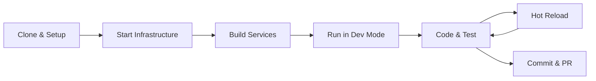

# Local Development Guide

This guide covers everything you need to know for effective local development with OpenFrame. Learn how to run services locally, enable hot reload, debug applications, and optimize your development workflow.

## Prerequisites

Before starting, ensure you have completed the [Environment Setup](environment.md) guide and have:

- ✅ Java 21 installed and configured
- ✅ Node.js 18+ with npm
- ✅ Docker and Docker Compose
- ✅ IDE configured (IntelliJ IDEA and/or VS Code)
- ✅ Development environment variables set

## Development Workflow Overview



## Step 1: Clone and Initial Setup

### Clone Repository with Development Branch

```bash
# Clone the repository
git clone https://github.com/flamingo-stack/openframe-oss-tenant.git
cd openframe-oss-tenant

# Switch to development branch (if available)
git checkout develop || git checkout main

# Initialize development environment
./dev/init-dev-environment.sh
```

### Install Dependencies

```bash
# Install Java dependencies
mvn clean install -DskipTests

# Install frontend dependencies
cd openframe/services/openframe-frontend
npm install
cd ../../../

# Install chat UI dependencies  
cd clients/openframe-chat
npm install
cd ../../

# Install Rust dependencies (for client agent)
cd clients/openframe-client
cargo build
cd ../../
```

## Step 2: Start Infrastructure Services

### Development Infrastructure Stack

Use the development Docker Compose configuration:

```bash
# Start all infrastructure services
docker compose -f dev/docker-compose.dev.yml up -d

# Verify services are running
docker compose -f dev/docker-compose.dev.yml ps
```

Expected services:
- **MongoDB** (port 27017) - Development database
- **Cassandra** (port 9042) - Time-series data  
- **Redis** (port 6379) - Cache and sessions
- **Kafka** (port 9092) - Event streaming
- **Pinot** (port 8000/9000) - Analytics
- **NATS** (port 4222) - Tool messaging

### Wait for Services to Initialize

```bash
# Check service health
./dev/wait-for-services.sh

# Or manually check each service:
# MongoDB
mongosh --eval "db.runCommand({ping: 1})"

# Redis
redis-cli ping

# Cassandra (may take 2-3 minutes)
until cqlsh -e "DESCRIBE KEYSPACES" > /dev/null 2>&1; do
  echo "Waiting for Cassandra..."
  sleep 5
done
```

## Step 3: Running Services Locally

### Backend Services Development Mode

#### Option 1: Run All Services (Automated)

```bash
# Run development startup script
./dev/run-all-services.sh

# This starts all services with:
# - Hot reload enabled
# - Debug ports exposed
# - Development profiles active
# - Comprehensive logging
```

#### Option 2: Run Services Individually

For focused development on specific services:

```bash
# Terminal 1: Config Service (starts first)
cd openframe/services/openframe-config
mvn spring-boot:run -Dspring-boot.run.profiles=dev

# Terminal 2: Authorization Server  
cd openframe/services/openframe-authorization-server
mvn spring-boot:run -Dspring-boot.run.profiles=dev

# Terminal 3: API Service
cd openframe/services/openframe-api
mvn spring-boot:run -Dspring-boot.run.profiles=dev

# Terminal 4: Gateway Service
cd openframe/services/openframe-gateway  
mvn spring-boot:run -Dspring-boot.run.profiles=dev

# Continue for other services as needed...
```

### Service Startup Order

Services should start in this order for proper dependency resolution:

1. **Config Service** (8085) - Provides configuration to other services
2. **Authorization Server** (8082) - Handles authentication
3. **API Service** (8081) - Core GraphQL API
4. **Gateway Service** (8080) - Routes requests
5. **Management Service** (8083) - Platform management
6. **Stream Service** (8084) - Event processing  
7. **Client Service** (8086) - Agent communication

### Service Health Verification

```bash
# Check all service health endpoints
for port in 8080 8081 8082 8083 8084 8085 8086; do
  echo "Checking service on port $port..."
  curl -f http://localhost:$port/actuator/health || echo "Port $port not ready"
done
```

## Step 4: Frontend Development

### Vue.js Frontend (Primary UI)

```bash
cd openframe/services/openframe-frontend

# Install dependencies (if not done)
npm install

# Start development server with hot reload
npm run dev

# The UI will be available at http://localhost:3000
```

### React Chat UI (Desktop App)

```bash
cd clients/openframe-chat

# Install dependencies
npm install

# Start development server  
npm run dev

# For Tauri desktop app development
npm run tauri dev
```

### Frontend Development Features

| Feature | Vue.js Frontend | React Chat UI |
|---------|----------------|---------------|
| **Hot Reload** | ✅ Vite HMR | ✅ Vite HMR |
| **TypeScript** | ✅ Full support | ✅ Full support |
| **Component Library** | PrimeVue | Custom components |
| **State Management** | Pinia | Zustand |
| **GraphQL** | Apollo Client | Custom client |

## Step 5: Hot Reload and Development Features

### Backend Hot Reload

#### Spring Boot DevTools

Add to your service's `pom.xml`:

```xml
<dependency>
    <groupId>org.springframework.boot</groupId>
    <artifactId>spring-boot-devtools</artifactId>
    <scope>runtime</scope>
    <optional>true</optional>
</dependency>
```

#### IDE Configuration for Hot Reload

**IntelliJ IDEA**:
```
File > Settings > Build, Execution, Deployment > Compiler
✅ Build project automatically

Advanced Settings > Compiler  
✅ Allow auto-make to start even if developed application is currently running
```

**VS Code**: Use Spring Boot Dashboard extension for automatic restart.

### Frontend Hot Reload

Both frontend applications use Vite for instant hot module replacement:

```javascript
// vite.config.ts
export default defineConfig({
  server: {
    hmr: true,           // Hot module replacement
    port: 3000,          // Development port
    proxy: {             // Proxy API calls to backend
      '/api': 'http://localhost:8080',
      '/graphql': 'http://localhost:8080'
    }
  }
})
```

### Database Changes and Migrations

For development database changes:

```bash
# MongoDB: Drop and recreate for schema changes
mongosh openframe_dev --eval "db.dropDatabase()"

# Cassandra: Apply schema changes
cqlsh -f dev/cassandra-schema.cql

# Restart services to apply changes
./dev/restart-services.sh
```

## Step 6: Debug Configuration

### Java Services Debugging

#### Enable Debug Mode

```bash
# Set debug environment variable
export DEBUG_MODE=true

# Or run with debug flags
mvn spring-boot:run -Dspring-boot.run.jvmArguments="-Xdebug -Xrunjdwp:transport=dt_socket,server=y,suspend=n,address=5005"
```

#### IDE Debug Configuration

**IntelliJ IDEA Remote Debug**:
```
Run > Edit Configurations > Add New > Remote JVM Debug
Host: localhost
Port: 5005 (or service-specific port)
```

Debug ports by service:
- API Service: 5005
- Gateway Service: 5006  
- Auth Server: 5007
- Management Service: 5008

### Frontend Debugging

#### Browser DevTools

Both frontends support Vue.js and React DevTools:

```bash
# Install browser extensions:
# - Vue.js devtools (for Vue frontend)
# - React Developer Tools (for Chat UI)
```

#### VS Code Debugging

Create `.vscode/launch.json`:

```json
{
  "configurations": [
    {
      "name": "Debug Frontend",
      "type": "node",
      "request": "attach", 
      "port": 9229,
      "restart": true,
      "localRoot": "${workspaceFolder}/openframe/services/openframe-frontend",
      "remoteRoot": "${workspaceFolder}/openframe/services/openframe-frontend"
    }
  ]
}
```

### Database Debugging

#### MongoDB Queries

```bash
# Connect to development database
mongosh openframe_dev

# Useful development queries
db.users.find().pretty()
db.organizations.find().pretty()
db.devices.find().pretty()

# Enable MongoDB profiling
db.setProfilingLevel(2)
```

#### Cassandra Debugging

```bash
# Connect to Cassandra
cqlsh localhost

# Check keyspaces and tables
DESCRIBE KEYSPACES;
USE openframe_dev;
DESCRIBE TABLES;

# Query time-series data
SELECT * FROM logs WHERE tenant_id = 'your-tenant-id' LIMIT 10;
```

## Development Scripts and Utilities

### Useful Development Scripts

Create these scripts in `dev/` directory:

#### `dev/reset-dev-environment.sh`
```bash
#!/bin/bash
echo "🔄 Resetting development environment..."

# Stop all services
docker compose -f dev/docker-compose.dev.yml down -v

# Clean Java build artifacts
mvn clean

# Clean node modules
find . -name "node_modules" -type d -exec rm -rf {} +
find . -name "package-lock.json" -delete

# Restart infrastructure
docker compose -f dev/docker-compose.dev.yml up -d

echo "✅ Development environment reset complete!"
```

#### `dev/logs.sh`
```bash
#!/bin/bash
# View logs from all OpenFrame services

case "$1" in
  "api")     tail -f logs/openframe-api.log ;;
  "gateway") tail -f logs/openframe-gateway.log ;;
  "auth")    tail -f logs/openframe-auth.log ;;
  "all")     tail -f logs/*.log ;;
  *)         echo "Usage: $0 {api|gateway|auth|all}" ;;
esac
```

#### `dev/quick-build.sh`
```bash
#!/bin/bash
echo "🚀 Quick development build..."

# Build only modified modules
mvn compile -pl $(git diff --name-only | grep "\.java$" | cut -d'/' -f1-3 | sort -u | tr '\n' ',')

# Restart affected services
./dev/restart-affected-services.sh

echo "✅ Quick build complete!"
```

### Development Database Seeding

#### Seed Development Data

Create `dev/seed-data.js` for MongoDB:

```javascript
// MongoDB seed data for development
use openframe_dev;

// Insert test organization
db.organizations.insertOne({
  _id: "dev-org-001",
  name: "Development MSP",
  domain: "dev.local", 
  createdAt: new Date(),
  status: "ACTIVE"
});

// Insert test user
db.users.insertOne({
  _id: "dev-user-001",
  email: "dev@openframe.local",
  firstName: "Developer",
  lastName: "User",
  organizationId: "dev-org-001",
  roles: ["ADMIN"],
  createdAt: new Date()
});

print("✅ Development data seeded successfully!");
```

Run seeding:
```bash
mongosh openframe_dev < dev/seed-data.js
```

## Performance Optimization for Development

### JVM Tuning for Development

```bash
# Set in dev environment
export JAVA_OPTS="-Xmx4g -Xms2g -XX:+UseG1GC -XX:+UseStringDeduplication"

# For faster startup (development only)
export JAVA_OPTS="$JAVA_OPTS -XX:TieredStopAtLevel=1 -noverify"
```

### Maven Build Optimization

```xml
<!-- Add to ~/.m2/settings.xml for faster builds -->
<profile>
  <id>dev-fast</id>
  <properties>
    <maven.test.skip>true</maven.test.skip>
    <maven.javadoc.skip>true</maven.javadoc.skip>
    <maven.source.skip>true</maven.source.skip>
  </properties>
</profile>
```

### Node.js Development Optimization

```bash
# Use faster package manager
npm install -g pnpm
# Then use: pnpm install instead of npm install

# Enable npm cache
npm config set cache ~/.npm-cache
```

## Common Development Issues

### Port Conflicts

```bash
# Find processes using OpenFrame ports
lsof -ti:3000,8080,8081,8082,8083,8084,8085,8086

# Kill conflicting processes
sudo fuser -k 3000/tcp 8080/tcp
```

### Memory Issues

```bash
# Monitor memory usage
htop
# Or
docker stats

# Increase Docker memory limit
# Docker Desktop: Settings > Resources > Memory (increase to 8GB+)
```

### Database Connection Issues

```bash
# Restart infrastructure services
docker compose -f dev/docker-compose.dev.yml restart

# Check database logs
docker compose -f dev/docker-compose.dev.yml logs mongodb
docker compose -f dev/docker-compose.dev.yml logs cassandra
```

## Next Steps

With local development configured:

1. **Review**: [Architecture Overview](../architecture/overview.md)
2. **Run Tests**: [Testing Overview](../testing/overview.md)  
3. **Start Contributing**: [Contributing Guidelines](../contributing/guidelines.md)

---

You're now ready for productive OpenFrame development! Your local environment supports hot reload, debugging, and all the tools needed for efficient development workflow.