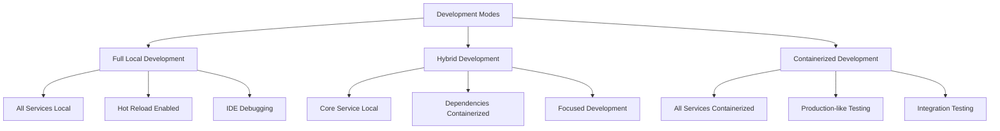

# Local Development Guide

This guide covers advanced local development workflows for OpenFrame, including debugging, hot reload setup, watch modes, and efficient development patterns.

> **Prerequisites**: Complete [Environment Setup](environment.md) and have your IDE configured.

## Development Workflow Overview

OpenFrame supports multiple development approaches depending on your focus area and performance preferences.



## Full Local Development Setup

### Clone and Initial Setup

```bash
# Clone the repository
git clone https://github.com/flamingo-stack/openframe-oss-tenant.git
cd openframe-oss-tenant

# Verify project structure
ls -la
# Expected: openframe/, clients/, manifests/, scripts/, docs/
```

### Database and Infrastructure Services

Start the required infrastructure services with Docker Compose:

```bash
# Start all infrastructure services
docker compose up -d

# Verify services are running
docker compose ps

# View logs for troubleshooting
docker compose logs -f mongodb kafka redis cassandra pinot
```

**Service Health Checks:**
```bash
# MongoDB
mongosh mongodb://localhost:27017 --eval "db.runCommand({ping: 1})"

# Redis  
redis-cli ping

# Kafka (requires kafka tools)
docker exec openframe-kafka kafka-topics.sh --bootstrap-server localhost:9092 --list

# Cassandra
docker exec openframe-cassandra cqlsh -e "DESCRIBE KEYSPACES;"
```

### Building OpenFrame Services

#### Complete Build

```bash
# Build all Java services and libraries (first time)
mvn clean install

# Skip tests for faster builds during development
mvn clean install -DskipTests

# Parallel builds (if you have sufficient CPU cores)
mvn clean install -DskipTests -T 4
```

#### Selective Building

Build only specific components during development:

```bash
# Build shared libraries only
cd openframe/libs
mvn clean install -DskipTests

# Build specific service
cd openframe/services/openframe-api
mvn clean install -DskipTests

# Build frontend dependencies
cd openframe/services/openframe-frontend
npm install
```

### Hot Reload and Watch Modes

#### Java Services with Spring Boot DevTools

Spring Boot DevTools provides automatic restarts when code changes:

```bash
# Enable DevTools for API service
cd openframe/services/openframe-api
mvn spring-boot:run -Dspring-boot.run.profiles=development

# DevTools will automatically restart when:
# - Java source files change
# - Resources in src/main/resources change
# - Dependencies are updated
```

**Configure DevTools** in `application-development.yml`:

```yaml
spring:
  devtools:
    restart:
      enabled: true
      additional-paths: src/main/java,src/main/resources
    livereload:
      enabled: true
      port: 35729
```

#### Frontend Hot Module Replacement

The Vue.js frontend supports HMR through Vite:

```bash
cd openframe/services/openframe-frontend

# Start development server with HMR
npm run dev

# Watch mode for type checking
npm run type-check -- --watch
```

**Vite Configuration** (`vite.config.ts`):

```typescript
export default defineConfig({
  server: {
    port: 3000,
    host: true,
    hmr: {
      port: 24678  // Custom HMR port if needed
    }
  },
  plugins: [
    vue(),
    // HMR for Vue components
  ]
})
```

### Advanced Development Scripts

#### Multi-Service Development Script

Create `scripts/dev-mode.sh`:

```bash
#!/bin/bash
# Advanced development mode with parallel service startup

set -e

echo "🚀 Starting OpenFrame Development Environment..."

# Function to start service with logging
start_service() {
    local service_name=$1
    local service_path=$2
    local debug_port=$3
    
    echo "Starting $service_name on debug port $debug_port..."
    cd "$service_path"
    
    if [ -n "$debug_port" ]; then
        mvn spring-boot:run \
            -Dspring-boot.run.profiles=development \
            -Dspring-boot.run.jvmArguments="-Xdebug -Xrunjdwp:transport=dt_socket,server=y,suspend=n,address=$debug_port" \
            > "../../../logs/${service_name}.log" 2>&1 &
    else
        mvn spring-boot:run \
            -Dspring-boot.run.profiles=development \
            > "../../../logs/${service_name}.log" 2>&1 &
    fi
    
    cd - > /dev/null
}

# Create logs directory
mkdir -p logs

# Start services in background
start_service "gateway" "openframe/services/openframe-gateway" "5001"
start_service "auth" "openframe/services/openframe-authorization-server" "5002"
start_service "api" "openframe/services/openframe-api" "5005"
start_service "management" "openframe/services/openframe-management" "5003"
start_service "client" "openframe/services/openframe-client" "5004"

# Start frontend
echo "Starting frontend development server..."
cd openframe/services/openframe-frontend
npm run dev > ../../../logs/frontend.log 2>&1 &

echo "✅ All services started!"
echo "📝 Logs available in logs/ directory"
echo "🌐 Frontend: http://localhost:3000"
echo "🔧 API Gateway: http://localhost:8080"

# Monitor logs
echo "📊 Monitoring logs (Ctrl+C to exit)..."
tail -f logs/*.log
```

Make it executable:
```bash
chmod +x scripts/dev-mode.sh
```

#### Service Management Script

Create `scripts/dev-control.sh`:

```bash
#!/bin/bash
# Control script for development services

SERVICES=("gateway" "auth" "api" "management" "client" "frontend")
PIDS_FILE="./dev-pids.txt"

start_services() {
    echo "Starting all OpenFrame services..."
    ./scripts/dev-mode.sh
}

stop_services() {
    echo "Stopping all OpenFrame services..."
    
    # Kill Java processes
    pkill -f "spring-boot:run"
    pkill -f "mvn.*spring-boot:run"
    
    # Kill Node.js processes  
    pkill -f "vite"
    pkill -f "npm run dev"
    
    echo "All services stopped."
}

restart_services() {
    stop_services
    sleep 3
    start_services
}

status_services() {
    echo "Service Status:"
    echo "=============="
    
    for service in "${SERVICES[@]}"; do
        if pgrep -f "$service" > /dev/null; then
            echo "✅ $service: Running"
        else
            echo "❌ $service: Stopped"
        fi
    done
}

case "$1" in
    start)
        start_services
        ;;
    stop)
        stop_services
        ;;
    restart)
        restart_services
        ;;
    status)
        status_services
        ;;
    *)
        echo "Usage: $0 {start|stop|restart|status}"
        exit 1
        ;;
esac
```

Usage:
```bash
chmod +x scripts/dev-control.sh

# Control services
./scripts/dev-control.sh start    # Start all services
./scripts/dev-control.sh status   # Check service status
./scripts/dev-control.sh restart  # Restart all services
./scripts/dev-control.sh stop     # Stop all services
```

## Debugging Configuration

### Java Service Debugging

#### Remote Debugging Setup

Configure remote debugging for each service:

**API Service Debug Configuration:**
```bash
cd openframe/services/openframe-api

# Start with debug enabled
mvn spring-boot:run \
  -Dspring-boot.run.profiles=development \
  -Dspring-boot.run.jvmArguments="-Xdebug -Xrunjdwp:transport=dt_socket,server=y,suspend=n,address=5005"
```

**IntelliJ IDEA Remote Debug Config:**
1. Run → Edit Configurations
2. Add New → Remote JVM Debug
3. Configure:
   - Name: `Debug API Service`
   - Host: `localhost`
   - Port: `5005`
   - Module: `openframe-api`

#### Debug Port Assignments

| Service | Debug Port | Purpose |
|---------|------------|---------|
| **Gateway** | 5001 | API routing and security |
| **Authorization** | 5002 | OAuth2 and authentication |
| **Management** | 5003 | Platform automation |
| **Client** | 5004 | Agent management |
| **API** | 5005 | GraphQL and REST APIs |

#### Advanced Debugging Tips

**Conditional Breakpoints:**
```java
// Break only when specific conditions are met
if (user.getEmail().contains("debug")) {
    // Breakpoint here - will only trigger for debug emails
}
```

**Logging for Debugging:**
```java
@Slf4j
public class MyService {
    public void processRequest(String request) {
        log.debug("Processing request: {}", request);
        log.trace("Detailed trace information: {}", getDetailedInfo());
    }
}
```

### Frontend Debugging

#### Vue DevTools

1. **Install Browser Extension**
2. **Access DevTools**: F12 → Vue tab
3. **Explore Components**: Component tree, props, data
4. **Monitor Store**: Pinia state changes and actions
5. **Performance**: Component render times

#### TypeScript Debugging

**VS Code Debug Configuration** (`.vscode/launch.json`):

```json
{
  "version": "0.2.0",
  "configurations": [
    {
      "name": "Debug Frontend",
      "type": "node",
      "request": "launch",
      "cwd": "${workspaceFolder}/openframe/services/openframe-frontend",
      "runtimeExecutable": "npm",
      "runtimeArgs": ["run", "dev"],
      "port": 9229,
      "skipFiles": ["<node_internals>/**"],
      "resolveSourceMapLocations": [
        "${workspaceFolder}/**",
        "!**/node_modules/**"
      ]
    }
  ]
}
```

**Browser Debugging:**
- Use **Chrome DevTools** Sources tab
- Set breakpoints in TypeScript source files
- Inspect network requests to GraphQL API
- Monitor console for Vue warnings and errors

## Development Database Management

### Database Reset and Seeding

#### Quick Database Reset

```bash
# Stop services
./scripts/dev-control.sh stop

# Reset databases
docker compose down
docker volume prune -f  # WARNING: This removes ALL Docker volumes
docker compose up -d

# Wait for databases to initialize
sleep 30

# Restart services
./scripts/dev-control.sh start
```

#### Development Data Seeding

Create `scripts/seed-dev-data.sh`:

```bash
#!/bin/bash
# Seed development database with test data

echo "Seeding development database..."

# Wait for MongoDB to be ready
until mongosh mongodb://localhost:27017 --eval "db.runCommand({ping: 1})" > /dev/null 2>&1; do
  echo "Waiting for MongoDB..."
  sleep 2
done

# Seed basic data
mongosh mongodb://localhost:27017/openframe_development << EOF
// Create test organization
db.organizations.insertOne({
  _id: ObjectId(),
  name: "Acme Corporation", 
  slug: "acme-corp",
  industry: "Technology",
  website: "https://acme-corp.com",
  createdAt: new Date(),
  updatedAt: new Date()
});

// Create test user
db.users.insertOne({
  _id: ObjectId(),
  email: "admin@acme-corp.com",
  name: "Admin User",
  role: "ADMIN",
  organizationId: db.organizations.findOne({slug: "acme-corp"})._id,
  createdAt: new Date(),
  updatedAt: new Date()
});

print("Development data seeded successfully!");
EOF

echo "✅ Development database seeded!"
```

### Database Backup and Restore

#### Development Database Backup

```bash
#!/bin/bash
# Backup development database

BACKUP_DIR="./backups/$(date +%Y%m%d_%H%M%S)"
mkdir -p "$BACKUP_DIR"

echo "Creating backup in $BACKUP_DIR..."

# MongoDB backup
mongodump --host localhost:27017 --db openframe_development --out "$BACKUP_DIR/mongodb"

# Redis backup  
redis-cli --rdb "$BACKUP_DIR/redis_dump.rdb"

echo "✅ Backup completed: $BACKUP_DIR"
```

#### Restore Development Database

```bash
#!/bin/bash
# Restore development database from backup

BACKUP_DIR=$1

if [ -z "$BACKUP_DIR" ]; then
    echo "Usage: $0 <backup_directory>"
    exit 1
fi

echo "Restoring from backup: $BACKUP_DIR"

# Restore MongoDB
mongorestore --host localhost:27017 --db openframe_development --drop "$BACKUP_DIR/mongodb/openframe_development"

# Restore Redis
redis-cli FLUSHALL
cat "$BACKUP_DIR/redis_dump.rdb" | redis-cli --pipe

echo "✅ Database restored from backup"
```

## Configuration Management

### Environment-Specific Configuration

#### Development Profile Configuration

**API Service** (`application-development.yml`):

```yaml
server:
  port: 8082
  
spring:
  profiles:
    active: development
  datasource:
    url: mongodb://localhost:27017/openframe_development
  redis:
    host: localhost
    port: 6379
    password: # No password in development
  kafka:
    bootstrap-servers: localhost:9092
    
logging:
  level:
    com.openframe: DEBUG
    org.springframework.security: DEBUG
  pattern:
    console: "%d{HH:mm:ss.SSS} [%thread] %-5level %logger{36} - %msg%n"

management:
  endpoints:
    web:
      exposure:
        include: health,info,metrics,prometheus
        
# Development-specific features
openframe:
  development:
    cors:
      enabled: true
      allowed-origins: "http://localhost:3000"
    security:
      csrf-disabled: true
    database:
      show-sql: true
```

#### Environment Variable Override

Create `.env.local` (gitignored):

```bash
# Local development overrides
LOG_LEVEL=TRACE
DEBUG_MODE=true

# Database overrides
MONGO_DATABASE=openframe_dev_${USER}
REDIS_DATABASE=1

# Feature flags
ENABLE_METRICS=true
ENABLE_TRACING=false

# External service mocks
FLEET_MDM_MOCK=true
TACTICAL_RMM_MOCK=true
```

### Configuration Hot Reload

#### Spring Cloud Config Client

Enable configuration refresh:

```yaml
# application.yml
management:
  endpoints:
    web:
      exposure:
        include: refresh
        
spring:
  cloud:
    config:
      uri: http://localhost:8888
      fail-fast: false
      retry:
        max-attempts: 3
```

Refresh configuration at runtime:
```bash
curl -X POST http://localhost:8082/actuator/refresh
```

## Testing in Development

### Integration Testing with TestContainers

Run integration tests with real databases:

```bash
# Run integration tests
cd openframe/services/openframe-api
mvn test -Dtest=*IntegrationTest

# Run with specific database version
mvn test -Dtest=*IntegrationTest -Dtestcontainers.mongodb.version=7.0
```

### Frontend Testing

```bash
cd openframe/services/openframe-frontend

# Unit tests with watch mode
npm run test:watch

# Type checking with watch mode
npm run type-check -- --watch

# E2E tests (requires services running)
npm run e2e
```

## Performance Optimization for Development

### JVM Tuning for Development

Add to your shell profile:

```bash
# JVM options for development
export MAVEN_OPTS="-Xmx4g -XX:MaxMetaspaceSize=512m -XX:+UseG1GC"

# Faster Maven builds
export MAVEN_ARGS="-T 4 -DskipTests"
```

### Frontend Build Optimization

**Vite Development Configuration**:

```typescript
// vite.config.ts
export default defineConfig({
  server: {
    port: 3000,
    hmr: true,
  },
  optimizeDeps: {
    // Pre-bundle heavy dependencies
    include: ['vue', 'pinia', '@apollo/client']
  },
  build: {
    sourcemap: true, // Enable for debugging
    rollupOptions: {
      output: {
        manualChunks: {
          vendor: ['vue', 'pinia'],
          apollo: ['@apollo/client']
        }
      }
    }
  }
})
```

### Database Performance for Development

**MongoDB Development Indexes**:

```javascript
// Run in mongosh for better development performance
use openframe_development

// User queries
db.users.createIndex({ email: 1 })
db.users.createIndex({ organizationId: 1 })

// Device queries  
db.devices.createIndex({ organizationId: 1, status: 1 })
db.devices.createIndex({ lastSeen: -1 })

// Log queries
db.logs.createIndex({ deviceId: 1, timestamp: -1 })
db.logs.createIndex({ organizationId: 1, level: 1 })
```

## Troubleshooting Development Issues

### Common Development Problems

#### Port Conflicts

```bash
# Find what's using a port
lsof -i :8080                          # macOS/Linux
netstat -ano | findstr :8080           # Windows

# Kill process using port
sudo kill -9 $(lsof -ti:8080)         # macOS/Linux
```

#### Memory Issues

```bash
# Monitor Java memory usage
jps -v | grep openframe

# Heap dump analysis
jcmd <pid> GC.run_finalization
jcmd <pid> VM.system_properties
```

#### Database Connection Issues

```bash
# Test database connections
mongosh mongodb://localhost:27017 --eval "db.runCommand({ping: 1})"
redis-cli ping
docker exec openframe-kafka kafka-topics.sh --bootstrap-server localhost:9092 --list
```

### Development Log Analysis

#### Centralized Log Monitoring

```bash
# Monitor all service logs
tail -f logs/*.log | grep -E "(ERROR|WARN|DEBUG)"

# Filter specific service
tail -f logs/api.log | grep -E "(GraphQL|Authentication)"

# Search for specific patterns
grep -r "NullPointerException" logs/
```

#### Log Level Adjustment

```yaml
# application-development.yml
logging:
  level:
    com.openframe.api.service: TRACE
    com.openframe.security: DEBUG
    org.springframework.web: INFO
```

## Next Steps

With local development configured, explore:

1. **[Architecture Overview](../architecture/overview.md)** - Understand system design
2. **[Testing Overview](../testing/overview.md)** - Learn testing strategies  
3. **[Contributing Guidelines](../contributing/guidelines.md)** - Contribute to OpenFrame

---

**Need help?** Join our OpenMSP Slack community: https://join.slack.com/t/openmsp/shared_invite/zt-36bl7mx0h-3~U2nFH6nqHqoTPXMaHEHA