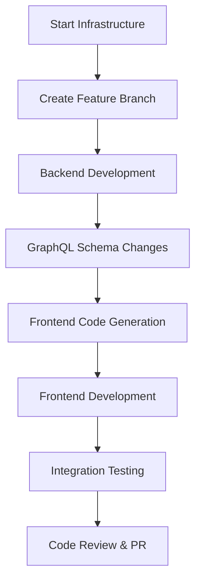

# Local Development Guide

This guide covers running OpenFrame locally for development, including service startup, debugging, hot reload configuration, and development workflows.

> **Prerequisites**: Complete the [Environment Setup](environment.md) guide before proceeding.

## Quick Development Startup

### Option 1: Full Platform Startup (Recommended)

Use the provided scripts for the fastest development setup:

```bash
# Clone and enter the repository
git clone https://github.com/flamingo-stack/openframe-oss-tenant.git
cd openframe-oss-tenant

# Start everything with one command (macOS)
./scripts/run-mac.sh --dev

# Other platforms
./scripts/run-linux.sh --dev      # Linux
./scripts/run-windows.ps1 -Dev    # Windows PowerShell
```

The `--dev` flag enables:
- **Hot reload** for frontend applications  
- **Debug ports** for Java services
- **Verbose logging** for development
- **GraphQL Playground** access
- **Automatic restarts** on code changes

### Option 2: Manual Service Startup

For more control over individual services:

```bash
# 1. Start infrastructure services
docker compose -f integrated-tools/docker-compose.yml up -d

# 2. Build all Java services
mvn clean install -DskipTests

# 3. Start core services in development mode
./scripts/dev-helpers/start-dev-services.sh
```

## Service-by-Service Development

### Infrastructure Services

Start the required backing services first:

```bash
# Start all infrastructure
docker compose -f integrated-tools/docker-compose.yml up -d

# Or start individual services
docker compose -f integrated-tools/docker-compose.yml up -d mongodb redis kafka
```

**Verify infrastructure is running:**
```bash
# Check all containers
docker ps

# Test database connections
docker exec openframe-mongo mongosh --eval "db.stats()"
docker exec openframe-redis redis-cli ping
```

### Java Microservices Development

#### API Service (Core GraphQL API)

```bash
cd openframe/services/openframe-api

# Development mode with hot reload
mvn spring-boot:run -Dspring-boot.run.profiles=local,dev

# With debugging enabled
mvn spring-boot:run -Dspring-boot.run.jvmArguments="-agentlib:jdwp=transport=dt_socket,server=y,suspend=n,address=*:5005"

# Alternative: Run compiled JAR
mvn clean package -DskipTests
java -jar target/openframe-api.jar --spring.profiles.active=local,dev
```

**Development features enabled:**
- GraphQL Playground at `http://localhost:8081/graphql`
- API documentation at `http://localhost:8081/swagger-ui`
- Debug logging enabled
- Hot reload with Spring DevTools

#### Gateway Service (API Gateway)

```bash
cd openframe/services/openframe-gateway

# Development mode
mvn spring-boot:run -Dspring-boot.run.profiles=local,dev

# Access gateway at http://localhost:8080
```

**Gateway development features:**
- CORS enabled for `localhost:3000`
- Request/response logging
- JWT validation bypass for development endpoints
- WebSocket debugging enabled

#### Management Service (System Management)

```bash
cd openframe/services/openframe-management

# Development mode
mvn spring-boot:run -Dspring-boot.run.profiles=local,dev

# Access management API at http://localhost:8082
```

#### Authorization Server (OAuth2/OIDC)

```bash
cd openframe/services/openframe-authorization-server

# Development mode  
mvn spring-boot:run -Dspring-boot.run.profiles=local,dev

# Access at http://localhost:8083
```

### Frontend Development

#### Vue.js Web Application

```bash
cd openframe/services/openframe-frontend

# Install dependencies (first time)
npm install

# Start development server with hot reload
npm run dev

# Alternative: Start with custom port
npm run dev -- --port 3001

# Build for production testing
npm run build
npm run preview
```

**Development server features:**
- **Hot Module Replacement (HMR)**: Instant updates on file changes
- **Vue DevTools**: Browser extension support
- **GraphQL Code Generation**: Automatic type generation from schema
- **Proxy Configuration**: API calls routed to backend services

#### Development Environment Configuration

Create `.env.development` in the frontend directory:

```bash
# API Configuration
VITE_API_URL=http://localhost:8080
VITE_GRAPHQL_URL=http://localhost:8081/graphql
VITE_WS_URL=ws://localhost:8080/ws

# Feature Flags
VITE_ENABLE_MINGO_CHAT=true
VITE_ENABLE_DEBUG_PANEL=true
VITE_ENABLE_GRAPHQL_PLAYGROUND_LINK=true

# Development Tools
VITE_LOG_LEVEL=debug
VITE_ENABLE_MOCK_DATA=false
```

### Rust System Agent Development

#### OpenFrame Client Agent

```bash
cd clients/openframe-client

# Development build
cargo build

# Run with debug logging
RUST_LOG=debug cargo run

# Watch for changes and rebuild
cargo install cargo-watch
cargo watch -x 'run'

# Run tests
cargo test

# Run with specific features
cargo run --features "dev-mode"
```

#### Development Configuration

Create `clients/openframe-client/.env`:

```bash
# OpenFrame server connection
OPENFRAME_SERVER_URL=http://localhost:8080
OPENFRAME_CLIENT_ID=dev-client
OPENFRAME_CLIENT_SECRET=dev-secret

# Logging configuration
RUST_LOG=debug
RUST_BACKTRACE=1

# Development features
ENABLE_MOCK_HARDWARE=true
METRICS_INTERVAL=10s
```

#### Tauri Chat Application

```bash
cd clients/openframe-chat

# Install dependencies
npm install

# Start in development mode (launches Tauri app)
npm run tauri dev

# Build for distribution
npm run tauri build
```

## Hot Reload and Development Features

### Java Services Hot Reload

#### Using Spring DevTools

Add to your `pom.xml` (already included in OpenFrame services):

```xml
<dependency>
    <groupId>org.springframework.boot</groupId>
    <artifactId>spring-boot-devtools</artifactId>
    <scope>runtime</scope>
    <optional>true</optional>
</dependency>
```

**Hot reload triggers:**
- **File changes**: Automatic restart on Java file changes
- **Configuration changes**: Live reload of `application.yml` properties
- **Static resources**: Instant update of web assets

#### IDE Configuration for Hot Reload

**IntelliJ IDEA:**
1. **File** → **Settings** → **Build, Execution, Deployment** → **Compiler**
2. Enable **"Build project automatically"**
3. **Help** → **Find Action** → Search "Registry"
4. Enable **"compiler.automake.allow.when.app.running"**

**VS Code:**
- Spring DevTools works automatically with the Java extension pack
- Save files to trigger recompilation and restart

### Frontend Hot Reload

Vite provides instant hot module replacement:

```bash
# Start with HMR enabled (default)
npm run dev

# HMR will automatically:
# - Update Vue components without losing state
# - Reload CSS changes instantly  
# - Refresh on TypeScript/GraphQL changes
# - Show compilation errors in browser overlay
```

**HMR Configuration (vite.config.ts):**
```typescript
export default defineConfig({
  server: {
    hmr: {
      overlay: true,  // Show errors as overlay
    },
    proxy: {
      '/api': 'http://localhost:8080',  // Proxy API calls
      '/graphql': 'http://localhost:8081',
    },
  },
  // ...
});
```

### Rust Hot Reload

```bash
# Install cargo-watch for file watching
cargo install cargo-watch

# Watch and rebuild on changes
cargo watch -x 'check' -x 'run'

# Watch and run tests
cargo watch -x test

# Watch with clearing terminal
cargo watch -c -x 'run'
```

## Development Workflows

### Full-Stack Feature Development

When developing a new feature across multiple services:



#### Step-by-Step Workflow

1. **Start infrastructure and services:**
   ```bash
   ./scripts/run-mac.sh --dev
   ```

2. **Create feature branch:**
   ```bash
   git checkout -b feature/new-awesome-feature
   ```

3. **Backend changes:**
   ```bash
   # Make changes to Java services
   cd openframe/services/openframe-api
   # Edit GraphQL schema, add DTOs, implement DataFetchers
   
   # Hot reload automatically restarts service
   ```

4. **Frontend type generation:**
   ```bash
   cd openframe/services/openframe-frontend
   
   # Generate new types from GraphQL schema
   npm run codegen
   
   # Start development server
   npm run dev
   ```

5. **Test integration:**
   ```bash
   # Run backend tests
   mvn test -pl openframe-api
   
   # Run frontend tests
   cd openframe/services/openframe-frontend
   npm run test
   ```

### Database Schema Development

#### MongoDB Schema Changes

```bash
# Connect to development database
mongosh mongodb://localhost:27017/openframe

# Create new collection with validation
db.createCollection("newCollection", {
  validator: {
    $jsonSchema: {
      bsonType: "object",
      required: ["name", "email"],
      properties: {
        name: { bsonType: "string" },
        email: { bsonType: "string" }
      }
    }
  }
})

# Test with sample data
db.newCollection.insertOne({name: "Test", email: "test@example.com"})
```

#### Database Migration Scripts

Create migration scripts in `scripts/migrations/`:

```bash
#!/bin/bash
# scripts/migrations/001_add_user_preferences.js

db.users.updateMany(
  {},
  {
    $set: {
      preferences: {
        theme: "light",
        notifications: true,
        language: "en"
      }
    }
  }
)
```

### GraphQL Schema Development

#### Schema Evolution Process

1. **Update schema** in `src/main/resources/schema/`:
   ```graphql
   # schema.graphqls
   type User {
     id: ID!
     email: String!
     preferences: UserPreferences  # New field
   }
   
   type UserPreferences {
     theme: String!
     notifications: Boolean!
     language: String!
   }
   ```

2. **Generate types:**
   ```bash
   mvn dgs:generate
   ```

3. **Implement resolver:**
   ```java
   @DgsComponent
   public class UserDataFetcher {
     @DgsData(parentType = "User", field = "preferences")
     public UserPreferences preferences(DgsDataFetchingEnvironment env) {
       User user = env.getSource();
       return userService.getUserPreferences(user.getId());
     }
   }
   ```

4. **Update frontend types:**
   ```bash
   cd openframe/services/openframe-frontend
   npm run codegen
   ```

## Debugging Configurations

### Java Service Debugging

#### IntelliJ IDEA Remote Debug Setup

1. **Create Remote Debug Configuration:**
   - **Run** → **Edit Configurations** → **Add** → **Remote JVM Debug**
   - **Name**: "Debug OpenFrame API"
   - **Host**: localhost  
   - **Port**: 5005
   - **Use module classpath**: openframe-api

2. **Start service with debug:**
   ```bash
   cd openframe/services/openframe-api
   mvn spring-boot:run -Dspring-boot.run.jvmArguments="-agentlib:jdwp=transport=dt_socket,server=y,suspend=n,address=*:5005"
   ```

3. **Attach debugger** in IntelliJ and set breakpoints

#### VS Code Debug Configuration

Create `.vscode/launch.json`:

```json
{
  "version": "0.2.0",
  "configurations": [
    {
      "type": "java",
      "name": "Debug OpenFrame API",
      "request": "attach",
      "hostName": "localhost",
      "port": 5005,
      "projectName": "openframe-api"
    }
  ]
}
```

### Frontend Debugging

#### Vue DevTools

```bash
# Install Vue DevTools browser extension
# Then access developer tools → Vue tab
```

#### Browser Developer Tools

```javascript
// Access Vue app instance in console
window.__VUE_APP__

// Access Pinia stores
window.__PINIA__
```

#### Debug Configuration

```json
// .vscode/launch.json - Chrome debugging
{
  "name": "Debug Frontend in Chrome",
  "type": "chrome",
  "request": "launch",
  "url": "http://localhost:3000",
  "webRoot": "${workspaceFolder}/openframe/services/openframe-frontend/src",
  "sourceMapPathOverrides": {
    "webpack:///./src/*": "${webRoot}/*"
  }
}
```

## Testing During Development

### Unit Testing

```bash
# Java unit tests
mvn test -pl openframe-api

# Frontend unit tests  
cd openframe/services/openframe-frontend
npm run test:unit

# Rust unit tests
cd clients/openframe-client
cargo test
```

### Integration Testing

```bash
# Java integration tests
mvn test -pl openframe-api -Dtest="*IT"

# Frontend integration tests
npm run test:integration

# E2E tests
npm run test:e2e
```

### Manual Testing with GraphQL Playground

1. **Open GraphQL Playground**: `http://localhost:8081/graphql`

2. **Set authentication headers:**
   ```json
   {
     "Authorization": "Bearer your-jwt-token-here"
   }
   ```

3. **Run queries:**
   ```graphql
   query GetDevices {
     devices(first: 10) {
       edges {
         node {
           id
           name
           status
         }
       }
     }
   }
   ```

## Performance Monitoring During Development

### Java Service Metrics

```bash
# JVM metrics via Actuator
curl http://localhost:8081/actuator/metrics/jvm.memory.used

# Application metrics
curl http://localhost:8081/actuator/health
curl http://localhost:8081/actuator/info
```

### Frontend Performance

```bash
# Bundle analysis
cd openframe/services/openframe-frontend
npm run build
npm run analyze

# Lighthouse CI
npm install -g @lhci/cli
lhci autorun
```

## Common Development Issues

### Issue: Service Won't Start

```bash
# Check if ports are in use
lsof -i :8080  # Gateway
lsof -i :8081  # API
lsof -i :3000  # Frontend

# Kill conflicting processes
kill -9 <PID>

# Or use different ports
export SERVER_PORT=8090
```

### Issue: Database Connection Errors

```bash
# Verify containers are running
docker ps | grep openframe

# Check logs
docker logs openframe-mongo
docker logs openframe-redis

# Reset databases
docker compose -f integrated-tools/docker-compose.yml down -v
docker compose -f integrated-tools/docker-compose.yml up -d
```

### Issue: Hot Reload Not Working

```bash
# Java services - restart with DevTools
mvn clean compile spring-boot:run

# Frontend - clear cache
rm -rf node_modules/.vite
npm run dev

# Rust - check cargo-watch
cargo watch -c -x 'run'
```

### Issue: GraphQL Schema Sync

```bash
# Regenerate types after schema changes
mvn dgs:generate

# Update frontend types  
cd openframe/services/openframe-frontend
npm run codegen

# Restart services if needed
```

## Development Productivity Tips

### Custom Aliases

Add to your shell profile (`.bashrc`, `.zshrc`):

```bash
# OpenFrame development aliases
alias of-start='./scripts/run-mac.sh --dev'
alias of-stop='./scripts/stop.sh'
alias of-logs='./scripts/logs.sh'
alias of-build='mvn clean install -DskipTests'
alias of-test='mvn test'
alias of-frontend='cd openframe/services/openframe-frontend && npm run dev'
alias of-api='cd openframe/services/openframe-api && mvn spring-boot:run'
```

### IDE Tasks and Shortcuts

#### IntelliJ IDEA Live Templates

Create custom live templates for common OpenFrame patterns:

1. **File** → **Settings** → **Editor** → **Live Templates**
2. **Add template group**: "OpenFrame"
3. **Add templates**:

```java
// Template: dgsdata
@DgsData(parentType = "$PARENT$", field = "$FIELD$")
public $RETURN_TYPE$ $METHOD_NAME$(DgsDataFetchingEnvironment env) {
    $END$
}
```

#### VS Code Snippets

Create `.vscode/snippets.json`:

```json
{
  "Vue GraphQL Query": {
    "prefix": "gql-query",
    "body": [
      "const ${1:queryName} = gql`",
      "  query ${2:QueryName}($3) {",
      "    $4",
      "  }",
      "`;",
      "",
      "const { data, loading, error } = useQuery(${1:queryName});"
    ]
  }
}
```

### Development Scripts

Create personal development scripts in `scripts/dev-helpers/`:

#### Quick Service Restart
```bash
#!/bin/bash
# scripts/dev-helpers/restart-service.sh
SERVICE=$1
./scripts/stop.sh $SERVICE
sleep 2
./scripts/start.sh $SERVICE
```

#### Database Reset
```bash
#!/bin/bash  
# scripts/dev-helpers/reset-db.sh
echo "🗑️  Resetting development databases..."
docker compose -f integrated-tools/docker-compose.yml down -v
docker compose -f integrated-tools/docker-compose.yml up -d
echo "✅ Databases reset!"
```

---

You're now ready for productive local development with OpenFrame! Continue with the [Architecture Overview](../architecture/overview.md) to understand the system design, or jump to [Testing Overview](../testing/overview.md) to learn about our testing strategies.