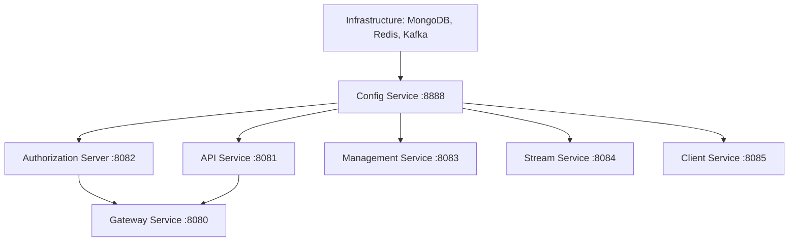
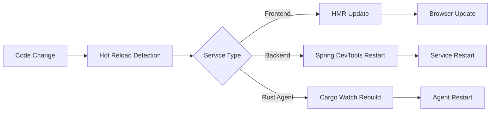

# Local Development Setup

This guide walks you through setting up OpenFrame for local development, including cloning the repository, configuring services, running in development mode, and setting up hot reload for rapid iteration.

## Prerequisites Check

Before starting, ensure you've completed the [Development Environment Setup](environment.md) and have:

- Java 21 JDK installed
- Maven 3.9+ installed 
- Node.js 18+ and npm installed
- Docker and Docker Compose installed
- Git configured with SSH access to GitHub

## Repository Setup

### Clone the Repository

```bash
# Clone the main repository
git clone git@github.com:flamingo-stack/openframe-oss-tenant.git
cd openframe-oss-tenant

# Verify repository structure
ls -la
# Should show: clients/, openframe/, openframe-oss-lib/, docs/, etc.
```

### Initialize Git Hooks (Optional but Recommended)

```bash
# Set up pre-commit hooks for code quality
cp scripts/pre-commit.sh .git/hooks/pre-commit
chmod +x .git/hooks/pre-commit

# Set up commit message template
git config commit.template .gitmessage
```

## Infrastructure Services

Start the required infrastructure services first:

### Start Core Infrastructure

```bash
# Start databases and messaging
docker compose up -d mongo redis kafka

# Verify services are running
docker compose ps

# Check service health
curl -f http://localhost:27017  # MongoDB
redis-cli ping                 # Redis (should return PONG)
```

### Optional Analytics Services

```bash
# Start analytics databases (optional, for full functionality)
docker compose up -d cassandra pinot

# Wait for services to be ready (may take 2-3 minutes)
docker compose logs -f cassandra  # Watch startup logs
```

### Infrastructure Health Check

```bash
# Create a health check script
cat > scripts/check-infrastructure.sh << 'EOF'
#!/bin/bash

echo "Checking infrastructure services..."

# MongoDB
if curl -s localhost:27017 > /dev/null; then
    echo "✅ MongoDB: Running"
else
    echo "❌ MongoDB: Not available"
fi

# Redis  
if redis-cli ping > /dev/null 2>&1; then
    echo "✅ Redis: Running"
else
    echo "❌ Redis: Not available"
fi

# Kafka (check if port is open)
if nc -z localhost 9092; then
    echo "✅ Kafka: Running"
else
    echo "❌ Kafka: Not available"
fi
EOF

chmod +x scripts/check-infrastructure.sh
./scripts/check-infrastructure.sh
```

## Backend Services Development

### Build All Services

```bash
# Build the entire platform (first time)
mvn clean install

# Build without running tests (faster)
mvn clean install -DskipTests

# Build specific service
mvn clean install -pl openframe/services/openframe-api
```

### Run Services in Development Mode

#### Option 1: Run All Services via Script
```bash
# Use the development startup script
./scripts/dev-start.sh

# Or start services manually one by one (see Option 2)
```

#### Option 2: Run Services Manually (Recommended for Development)

**Terminal 1 - Configuration Service:**
```bash
cd openframe/services/openframe-config
mvn spring-boot:run -Dspring-boot.run.profiles=local
```

**Terminal 2 - Authorization Server:**
```bash
cd openframe/services/openframe-authorization-server
mvn spring-boot:run -Dspring-boot.run.profiles=local
```

**Terminal 3 - API Service:**
```bash
cd openframe/services/openframe-api
mvn spring-boot:run -Dspring-boot.run.profiles=local
```

**Terminal 4 - Gateway Service:**
```bash
cd openframe/services/openframe-gateway  
mvn spring-boot:run -Dspring-boot.run.profiles=local
```

**Terminal 5 - Management Service:**
```bash
cd openframe/services/openframe-management
mvn spring-boot:run -Dspring-boot.run.profiles=local
```

### Service Startup Order

Services should be started in this order for proper dependency resolution:



### Verify Backend Services

```bash
# Check service health endpoints
curl http://localhost:8888/actuator/health  # Config Service
curl http://localhost:8082/actuator/health  # Authorization Server  
curl http://localhost:8081/actuator/health  # API Service
curl http://localhost:8080/actuator/health  # Gateway Service

# Test GraphQL API
curl -X POST http://localhost:8081/graphql \
  -H "Content-Type: application/json" \
  -d '{"query": "{ __typename }"}'
```

## Frontend Development

### Install Dependencies

```bash
cd openframe/services/openframe-frontend

# Install npm dependencies
npm install

# Verify installation
npm list --depth=0
```

### Configure Frontend for Local Development

Create `.env.local` file:

```bash
# Create environment configuration for local development
cat > .env.local << 'EOF'
# API Configuration
VITE_API_BASE_URL=http://localhost:8080
VITE_GRAPHQL_URL=http://localhost:8080/graphql
VITE_WS_URL=ws://localhost:8080/ws

# Development Configuration
VITE_NODE_ENV=development
VITE_LOG_LEVEL=debug

# Feature Flags for Development
VITE_ENABLE_DEBUG_TOOLS=true
VITE_ENABLE_MOCK_DATA=false

# Authentication Configuration
VITE_AUTH_COOKIE_NAME=openframe_token
VITE_AUTH_DOMAIN=localhost
EOF
```

### Run Frontend Development Server

```bash
# Start the development server with hot reload
npm run dev

# Or start with specific port
npm run dev -- --port 3001

# The frontend will be available at http://localhost:3000
```

### Frontend Development Features

The development server provides:

- **Hot Module Replacement (HMR)**: Instant updates without page refresh
- **TypeScript compilation**: Real-time type checking
- **ESLint integration**: Code quality checks
- **Source maps**: For debugging
- **Proxy configuration**: Automatic API routing to backend services

### Build Frontend for Production Testing

```bash
# Build optimized production bundle
npm run build

# Preview the production build locally
npm run preview

# Type checking without building
npm run type-check
```

## Client Agent Development (Rust)

### Setup Rust Agent Development

```bash
cd clients/openframe-client

# Install Rust dependencies
cargo build

# Run tests to verify setup
cargo test

# Run agent in development mode
RUST_LOG=debug cargo run
```

### Agent Development Configuration

Create `clients/openframe-client/.env` for development:

```bash
# Agent Configuration
OPENFRAME_API_URL=http://localhost:8080
OPENFRAME_TENANT_ID=dev-tenant
LOG_LEVEL=debug

# Development Features
ENABLE_MOCK_HARDWARE=true
HEARTBEAT_INTERVAL=30s
REGISTRATION_RETRY_DELAY=5s
```

### Watch Mode for Rust Development

```bash
# Install cargo-watch for automatic rebuilds
cargo install cargo-watch

# Run with automatic restart on file changes
cargo watch -x run

# Run tests automatically on changes
cargo watch -x test
```

## Desktop Chat Client Development

### Setup Tauri Development

```bash
cd clients/openframe-chat

# Install Node.js dependencies
npm install

# Install Rust dependencies for Tauri
cargo build

# Start development mode with hot reload
npm run tauri dev
```

### Chat Client Configuration

Create `clients/openframe-chat/.env.local`:

```bash
# API Configuration
VITE_API_BASE_URL=http://localhost:8080
VITE_SOCKET_URL=ws://localhost:8080/ws

# Development Features
VITE_ENABLE_DEV_TOOLS=true
VITE_AUTO_LOGIN=true

# Tauri Configuration
TAURI_DEBUG=true
```

## Development Workflow

### Hot Reload and Live Development

With all services running, you can develop with live reload:



### Backend Hot Reload

Enable Spring Boot DevTools for Java services:

Add to your `application-local.yml`:

```yaml
spring:
  devtools:
    restart:
      enabled: true
    livereload:
      enabled: true
    remote:
      secret: openframe-dev-secret
```

### Database Development

#### MongoDB Development

```bash
# Connect to MongoDB for debugging
mongosh mongodb://localhost:27017/openframe_local

# Common development queries
db.users.find().limit(10)
db.organizations.find().pretty()
db.devices.countDocuments()

# Reset development data
db.dropDatabase()
```

#### Redis Development

```bash
# Connect to Redis for cache inspection
redis-cli

# Common development commands
KEYS *
GET user:session:*
FLUSHALL  # Clear all cache (development only!)
```

### Debugging Integration

#### Java Service Debugging

```bash
# Start service with remote debugging enabled
mvn spring-boot:run -Dspring-boot.run.jvmArguments="-agentlib:jdwp=transport=dt_socket,server=y,suspend=n,address=*:5005"

# Connect debugger to localhost:5005
```

#### Frontend Debugging

```bash
# Start with debugging enabled
npm run dev -- --debug

# Use browser developer tools
# Vue.js DevTools extension provides component debugging
```

#### Full-Stack Debugging

Create a debugging configuration that starts all services with debug ports:

```bash
# Create debug startup script
cat > scripts/debug-start.sh << 'EOF'
#!/bin/bash

# Start services with debug ports
cd openframe/services/openframe-config
mvn spring-boot:run -Dspring-boot.run.jvmArguments="-agentlib:jdwp=transport=dt_socket,server=y,suspend=n,address=*:5001" &

cd ../openframe-authorization-server
mvn spring-boot:run -Dspring-boot.run.jvmArguments="-agentlib:jdwp=transport=dt_socket,server=y,suspend=n,address=*:5002" &

cd ../openframe-api
mvn spring-boot:run -Dspring-boot.run.jvmArguments="-agentlib:jdwp=transport=dt_socket,server=y,suspend=n,address=*:5003" &

cd ../openframe-gateway
mvn spring-boot:run -Dspring-boot.run.jvmArguments="-agentlib:jdwp=transport=dt_socket,server=y,suspend=n,address=*:5004" &

wait
EOF

chmod +x scripts/debug-start.sh
```

## Configuration Management

### Local Configuration Files

OpenFrame uses Spring Cloud Config for configuration management. For local development, you can override configurations:

#### Create Local Config Repository

```bash
# Create local config directory
mkdir -p config-repo

# Create application-local.yml for all services
cat > config-repo/application-local.yml << 'EOF'
spring:
  datasource:
    mongodb:
      host: localhost
      port: 27017
      database: openframe_local
  redis:
    host: localhost
    port: 6379
  kafka:
    bootstrap-servers: localhost:9092

logging:
  level:
    com.openframe: DEBUG
    org.springframework.security: DEBUG

management:
  endpoints:
    web:
      exposure:
        include: "*"
  endpoint:
    health:
      show-details: always
EOF

# Create service-specific configurations
cat > config-repo/openframe-api-local.yml << 'EOF'
server:
  port: 8081

openframe:
  features:
    graphql:
      playground: true
    security:
      cors:
        allowed-origins: 
          - "http://localhost:3000"
          - "http://localhost:8080"
EOF
```

#### Environment-Specific Variables

Create `.env` file in the project root:

```bash
# Development Environment Configuration
SPRING_PROFILES_ACTIVE=local
CONFIG_SERVER_URI=http://localhost:8888
EUREKA_ENABLED=false

# Database Configuration
MONGO_URI=mongodb://localhost:27017/openframe_local
REDIS_URI=redis://localhost:6379

# Security Configuration
JWT_SECRET=dev-secret-key-change-in-production
OAUTH_CLIENT_SECRET=dev-oauth-secret

# Feature Flags
ENABLE_ANALYTICS=true
ENABLE_MONITORING=true
INIT_SAMPLE_DATA=true
```

## Testing During Development

### Running Tests Locally

```bash
# Run all tests
mvn test

# Run tests for specific service
mvn test -pl openframe/services/openframe-api

# Run tests with coverage
mvn test jacoco:report

# Frontend tests
cd openframe/services/openframe-frontend
npm run test:unit

# Rust tests
cd clients/openframe-client
cargo test
```

### Integration Testing

```bash
# Run integration tests against local services
cd openframe-e2e-tests
mvn test -Dtest.env=local

# Run specific test suite
mvn test -Dtest=AuthenticationTest
```

## Common Development Tasks

### Adding a New REST Endpoint

1. Create the controller class:
```java
@RestController
@RequestMapping("/api/devices")
public class DeviceController {
    
    @GetMapping("/{id}")
    public ResponseEntity<Device> getDevice(@PathVariable String id) {
        // Implementation
    }
}
```

2. Test locally:
```bash
curl http://localhost:8081/api/devices/123
```

### Adding a New GraphQL Query

1. Add to schema (`openframe/services/openframe-api/src/main/resources/schema/device.graphqls`):
```graphql
extend type Query {
    device(id: ID!): Device
}
```

2. Create DataFetcher:
```java
@DgsComponent
public class DeviceDataFetcher {
    
    @DgsQuery
    public Device device(@InputArgument String id) {
        // Implementation
    }
}
```

3. Test in GraphQL Playground:
```graphql
query {
  device(id: "123") {
    id
    name
    status
  }
}
```

### Adding a New Frontend Component

1. Create Vue component (`openframe/services/openframe-frontend/src/components/DeviceCard.vue`):
```vue
<template>
  <div class="device-card">
    <h3>{{ device.name }}</h3>
    <p>Status: {{ device.status }}</p>
  </div>
</template>

<script setup lang="ts">
interface Props {
  device: Device
}

defineProps<Props>()
</script>
```

2. Use in parent component and test with hot reload

## Troubleshooting Development Issues

### Service Startup Issues

```bash
# Check if ports are in use
lsof -i :8080
lsof -i :8081

# Kill processes on ports
kill -9 $(lsof -t -i:8080)

# Check service logs
cd openframe/services/openframe-api
mvn spring-boot:run | tee service.log
```

### Database Connection Issues

```bash
# Test MongoDB connection
mongosh "mongodb://localhost:27017/openframe_local" --eval "db.runCommand({ping: 1})"

# Test Redis connection
redis-cli ping

# Reset databases for clean state
docker compose down
docker volume prune -f
docker compose up -d mongo redis
```

### Frontend Build Issues

```bash
# Clear npm cache
npm cache clean --force

# Delete node_modules and reinstall
rm -rf node_modules package-lock.json
npm install

# Check for TypeScript errors
npm run type-check
```

### Memory Issues

```bash
# Increase Maven memory
export MAVEN_OPTS="-Xmx6g -XX:MaxMetaspaceSize=2g"

# Increase Node.js memory
export NODE_OPTIONS="--max-old-space-size=8192"

# Monitor memory usage
top -pid $(pgrep java)
```

## Next Steps

After setting up local development:

1. **Explore [Architecture Overview](../architecture/overview.md)** to understand the codebase
2. **Review [Testing Overview](../testing/overview.md)** for testing strategies
3. **Check [Contributing Guidelines](../contributing/guidelines.md)** for development workflow
4. **Join the community** on [OpenMSP Slack](https://join.slack.com/t/openmsp/shared_invite/zt-36bl7mx0h-3~U2nFH6nqHqoTPXMaHEHA)

---

You now have a complete local development environment for OpenFrame! You can modify any component and see changes immediately with hot reload enabled.