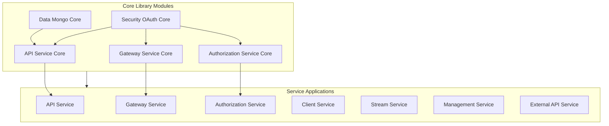

# Local Development Guide

This guide covers cloning, building, and running OpenFrame OSS Tenant locally with hot reload capabilities. By the end, you'll have a fully functional local development environment with fast feedback cycles.

> **Prerequisites**: Complete [Environment Setup](environment.md) before proceeding.

## Project Structure Overview

Understanding the OpenFrame project structure helps with efficient development:

```text
openframe-oss-tenant/
├── 📁 deps/openframe-oss-lib/          # Core libraries (business logic)
│   ├── openframe-api-service-core/     # Internal API logic
│   ├── openframe-authorization-service-core/  # OAuth2/OIDC implementation
│   ├── openframe-gateway-service-core/ # Edge gateway functionality  
│   ├── openframe-data-mongo/           # MongoDB persistence layer
│   ├── openframe-security-oauth/       # Security primitives
│   └── ...other core modules
├── 📁 openframe/services/              # Deployable applications
│   ├── openframe-api/                  # API service entry point
│   ├── openframe-gateway/              # Gateway service entry point
│   ├── openframe-authorization-server/ # Auth service entry point
│   └── ...other services
├── 📁 clients/                         # Client applications
│   ├── openframe-client/              # Rust-based agent client
│   └── openframe-chat/                # Tauri-based chat client
├── 📁 integrated-tools/                # Tool-specific configurations
├── 📁 manifests/                       # Deployment manifests
├── 📄 pom.xml                          # Root Maven project
├── 📄 package.json                     # Node.js tooling dependencies
└── 📄 docker-compose.yml               # Infrastructure services
```

## Step 1: Clone and Initial Setup

### Clone the Repository

```bash
# Clone OpenFrame OSS Tenant
git clone https://github.com/flamingo-stack/openframe-oss-tenant.git
cd openframe-oss-tenant

# Verify project structure
ls -la
```

### Initialize Git Hooks (Optional)

Set up pre-commit hooks for code quality:

```bash
# Create pre-commit hook for formatting
cat > .git/hooks/pre-commit << 'EOF'
#!/bin/bash
echo "Running pre-commit checks..."

# Format Java code
mvn spotless:check -q

if [ $? -ne 0 ]; then
    echo "❌ Code formatting issues found. Run: mvn spotless:apply"
    exit 1
fi

# Check Node.js formatting
if [ -f package.json ]; then
    npm run lint:check 2>/dev/null || true
fi

echo "✅ Pre-commit checks passed"
EOF

chmod +x .git/hooks/pre-commit
```

## Step 2: Infrastructure Services Setup

OpenFrame requires several infrastructure services. Start them before building the application services.

### Start Infrastructure with Docker Compose

```bash
# Start all infrastructure services
docker-compose up -d

# Or start services individually based on needs
docker-compose up -d mongodb      # Primary database
docker-compose up -d redis        # Cache and sessions
docker-compose up -d kafka        # Event streaming
docker-compose up -d zookeeper    # Kafka coordination
docker-compose up -d cassandra    # Log storage (optional)
docker-compose up -d nats         # Real-time messaging (optional)
```

### Verify Infrastructure Health

```bash
# Check all services are running
docker-compose ps

# Expected output should show all services as "Up"
```

**Verify individual services:**

```bash
# MongoDB
docker exec mongodb mongosh --eval "db.adminCommand('ismaster')"

# Redis
docker exec redis redis-cli ping

# Kafka
docker exec kafka kafka-topics --bootstrap-server localhost:9092 --list

# Check logs if services fail
docker-compose logs mongodb
docker-compose logs kafka
```

### Initialize Development Data

**MongoDB Initialization:**

```bash
# Create development database and sample data
cat > init-dev-data.js << 'EOF'
// Switch to development database
db = db.getSiblingDB('openframe-dev');

// Create sample tenant
db.tenants.insertOne({
  _id: "dev-tenant-001",
  domain: "dev.openframe.local",
  name: "Development Tenant",
  status: "ACTIVE",
  plan: "ENTERPRISE",
  createdAt: new Date(),
  updatedAt: new Date()
});

// Create sample user
db.users.insertOne({
  _id: ObjectId(),
  tenantId: "dev-tenant-001",
  email: "developer@openframe.local",
  firstName: "Dev",
  lastName: "User",
  status: "ACTIVE",
  roles: ["ADMIN"],
  emailVerified: true,
  createdAt: new Date(),
  updatedAt: new Date()
});

// Create sample organization
db.organizations.insertOne({
  _id: ObjectId(),
  tenantId: "dev-tenant-001", 
  name: "Development Organization",
  contactInformation: {
    email: "contact@dev-org.local",
    phone: "+1-555-0123"
  },
  address: {
    street: "123 Dev Street",
    city: "Developer City", 
    state: "DC",
    zipCode: "12345",
    country: "US"
  },
  createdAt: new Date(),
  updatedAt: new Date()
});

print("Development data initialized successfully!");
EOF

# Execute the initialization script
docker exec -i mongodb mongosh < init-dev-data.js

# Clean up
rm init-dev-data.js
```

## Step 3: Build the Application

### Maven Build Process

OpenFrame uses a multi-module Maven build. Build order matters due to dependencies.

**Full Clean Build:**

```bash
# Clean and install all modules (first time or after major changes)
mvn clean install -DskipTests

# This will:
# 1. Build all core library modules in deps/openframe-oss-lib/
# 2. Build all application services in openframe/services/
# 3. Install artifacts to local Maven repository
```

**Development Build (Faster):**

```bash
# Build only changed modules
mvn compile -DskipTests

# Or build specific service and its dependencies
mvn clean install -pl openframe/services/openframe-api -am -DskipTests
```

### Understanding the Build Process

The build follows this dependency hierarchy:



**Build Verification:**

```bash
# Verify all JARs were created
find . -name "*.jar" -path "*/target/*" | grep -v test

# Expected output should show JARs for all services:
# ./openframe/services/openframe-api/target/openframe-api-1.0.0-SNAPSHOT.jar
# ./openframe/services/openframe-gateway/target/openframe-gateway-1.0.0-SNAPSHOT.jar
# ... etc
```

### Node.js Dependencies

Install Node.js dependencies for the tooling layer:

```bash
# Install root dependencies (AI SDK, VoltAgent, etc.)
npm install

# Install chat client dependencies
cd clients/openframe-chat && npm install && cd ../..

# Verify installation
npm list --depth=0
```

## Step 4: Running Services Locally

### Service Startup Order

Services must start in a specific order due to dependencies:

1. **Configuration Server** (if using Spring Cloud Config)
2. **Authorization Server** (OAuth2 provider)
3. **Gateway Service** (Edge routing)
4. **Core Services** (API, Client, Management, Stream, External API)

### Manual Service Startup

**Option 1: Individual Service Startup (Recommended for Development)**

```bash
# 1. Start Configuration Server (if available)
cd openframe/services/openframe-config
mvn spring-boot:run -Dspring-boot.run.profiles=dev &
cd ../../..
sleep 30  # Wait for config server to be ready

# 2. Start Authorization Server
cd openframe/services/openframe-authorization-server
mvn spring-boot:run -Dspring-boot.run.profiles=dev -Dserver.port=9000 &
cd ../../..
sleep 20

# 3. Start Gateway Service  
cd openframe/services/openframe-gateway
mvn spring-boot:run -Dspring-boot.run.profiles=dev -Dserver.port=8761 &
cd ../../..
sleep 20

# 4. Start API Service
cd openframe/services/openframe-api
mvn spring-boot:run -Dspring-boot.run.profiles=dev -Dserver.port=8080 &
cd ../../..

# 5. Start remaining services
cd openframe/services/openframe-client
mvn spring-boot:run -Dspring-boot.run.profiles=dev -Dserver.port=8084 &
cd ../../..

cd openframe/services/openframe-management  
mvn spring-boot:run -Dspring-boot.run.profiles=dev -Dserver.port=8082 &
cd ../../..

cd openframe/services/openframe-stream
mvn spring-boot:run -Dspring-boot.run.profiles=dev -Dserver.port=8083 &
cd ../../..

cd openframe/services/openframe-external-api
mvn spring-boot:run -Dspring-boot.run.profiles=dev -Dserver.port=8081 &
cd ../../..
```

**Option 2: JAR-based Startup (Faster)**

```bash
# Start services using pre-built JARs
java -jar -Dspring.profiles.active=dev -Dserver.port=9000 \
    openframe/services/openframe-authorization-server/target/openframe-authorization-server-1.0.0-SNAPSHOT.jar &

java -jar -Dspring.profiles.active=dev -Dserver.port=8761 \
    openframe/services/openframe-gateway/target/openframe-gateway-1.0.0-SNAPSHOT.jar &

java -jar -Dspring.profiles.active=dev -Dserver.port=8080 \
    openframe/services/openframe-api/target/openframe-api-1.0.0-SNAPSHOT.jar &

java -jar -Dspring.profiles.active=dev -Dserver.port=8081 \
    openframe/services/openframe-external-api/target/openframe-external-api-1.0.0-SNAPSHOT.jar &

java -jar -Dspring.profiles.active=dev -Dserver.port=8082 \
    openframe/services/openframe-management/target/openframe-management-1.0.0-SNAPSHOT.jar &

java -jar -Dspring.profiles.active=dev -Dserver.port=8083 \
    openframe/services/openframe-stream/target/openframe-stream-1.0.0-SNAPSHOT.jar &

java -jar -Dspring.profiles.active=dev -Dserver.port=8084 \
    openframe/services/openframe-client/target/openframe-client-1.0.0-SNAPSHOT.jar &
```

### Automated Startup Script

Create `scripts/start-dev-services.sh` for easier management:

```bash
#!/bin/bash
# OpenFrame Development Services Startup Script

set -euo pipefail

# Colors
RED='\033[0;31m'
GREEN='\033[0;32m'
YELLOW='\033[1;33m'
BLUE='\033[0;34m'
NC='\033[0m'

# Service configurations
declare -A SERVICES
SERVICES=(
    ["authorization-server"]="9000"
    ["gateway"]="8761"
    ["api"]="8080"
    ["external-api"]="8081" 
    ["management"]="8082"
    ["stream"]="8083"
    ["client"]="8084"
)

# JVM settings
JAVA_OPTS="-Xms512m -Xmx2g -Dspring.profiles.active=dev"
JAR_DIR="openframe/services"

# Function to check if service is running
check_service() {
    local port=$1
    timeout 3 bash -c "</dev/tcp/localhost/$port" 2>/dev/null
}

# Function to wait for service
wait_for_service() {
    local service=$1
    local port=$2
    local max_attempts=30
    local attempt=1
    
    echo -e "${YELLOW}Waiting for $service to start on port $port...${NC}"
    
    while [ $attempt -le $max_attempts ]; do
        if check_service "$port"; then
            echo -e "${GREEN}✅ $service is ready on port $port${NC}"
            return 0
        fi
        
        echo -n "."
        sleep 2
        ((attempt++))
    done
    
    echo -e "${RED}❌ $service failed to start within $((max_attempts * 2)) seconds${NC}"
    return 1
}

# Function to start a service
start_service() {
    local service=$1
    local port=$2
    local jar_file="$JAR_DIR/openframe-$service/target/openframe-$service-1.0.0-SNAPSHOT.jar"
    
    if [ ! -f "$jar_file" ]; then
        echo -e "${RED}❌ JAR file not found: $jar_file${NC}"
        echo -e "${YELLOW}   Run: mvn clean install -DskipTests${NC}"
        return 1
    fi
    
    echo -e "${BLUE}🚀 Starting $service on port $port...${NC}"
    
    # Start service in background
    java $JAVA_OPTS -Dserver.port="$port" -jar "$jar_file" > "logs/$service.log" 2>&1 &
    local pid=$!
    echo $pid > "logs/$service.pid"
    
    # Wait for service to be ready
    if wait_for_service "$service" "$port"; then
        echo -e "${GREEN}✅ $service started successfully (PID: $pid)${NC}"
        return 0
    else
        echo -e "${RED}❌ $service failed to start${NC}"
        kill $pid 2>/dev/null || true
        return 1
    fi
}

# Function to stop all services
stop_services() {
    echo -e "${YELLOW}Stopping all OpenFrame services...${NC}"
    
    # Kill by PID files
    for service in "${!SERVICES[@]}"; do
        local pid_file="logs/$service.pid"
        if [ -f "$pid_file" ]; then
            local pid=$(cat "$pid_file")
            if kill "$pid" 2>/dev/null; then
                echo -e "${GREEN}✅ Stopped $service (PID: $pid)${NC}"
            fi
            rm -f "$pid_file"
        fi
    done
    
    # Fallback: kill by process name
    pkill -f "openframe.*jar" || true
    
    echo -e "${GREEN}All services stopped.${NC}"
}

# Function to check service status
status_services() {
    echo -e "${BLUE}OpenFrame Service Status${NC}"
    echo "======================"
    
    for service in "${!SERVICES[@]}"; do
        local port=${SERVICES[$service]}
        if check_service "$port"; then
            echo -e "✅ $service: Running on port $port"
        else
            echo -e "❌ $service: Not running (port $port)"
        fi
    done
}

# Create logs directory
mkdir -p logs

# Main script logic
case "${1:-start}" in
    start)
        echo -e "${BLUE}🚀 Starting OpenFrame Development Services${NC}"
        echo "======================================="
        
        # Check if infrastructure is running
        if ! docker-compose ps | grep -q "Up"; then
            echo -e "${YELLOW}⚠️ Infrastructure services don't appear to be running.${NC}"
            echo -e "${YELLOW}   Run: docker-compose up -d${NC}"
            read -p "Continue anyway? (y/N): " -n 1 -r
            echo
            [[ ! $REPLY =~ ^[Yy]$ ]] && exit 1
        fi
        
        # Start services in order
        for service in authorization-server gateway api external-api management stream client; do
            local port=${SERVICES[$service]}
            if ! start_service "$service" "$port"; then
                echo -e "${RED}Failed to start $service. Check logs/$service.log${NC}"
                exit 1
            fi
            sleep 5  # Small delay between services
        done
        
        echo -e "${GREEN}🎉 All services started successfully!${NC}"
        echo -e "${BLUE}Access points:${NC}"
        echo "  - API Service: http://localhost:8080"
        echo "  - Gateway: http://localhost:8761"
        echo "  - Authorization Server: http://localhost:9000"
        echo "  - External API: http://localhost:8081"
        ;;
        
    stop)
        stop_services
        ;;
        
    status)
        status_services
        ;;
        
    restart)
        stop_services
        sleep 5
        "$0" start
        ;;
        
    logs)
        service=${2:-api}
        if [ -f "logs/$service.log" ]; then
            tail -f "logs/$service.log"
        else
            echo "Log file not found: logs/$service.log"
            echo "Available logs:"
            ls -la logs/*.log 2>/dev/null || echo "No log files found"
        fi
        ;;
        
    *)
        echo "Usage: $0 {start|stop|status|restart|logs [service]}"
        echo ""
        echo "Commands:"
        echo "  start   - Start all OpenFrame services"
        echo "  stop    - Stop all OpenFrame services"
        echo "  status  - Check service status"
        echo "  restart - Restart all services"  
        echo "  logs    - Tail logs for a service (default: api)"
        echo ""
        echo "Available services: ${!SERVICES[*]}"
        exit 1
        ;;
esac
```

Make the script executable and use it:

```bash
chmod +x scripts/start-dev-services.sh

# Start all services
./scripts/start-dev-services.sh start

# Check status
./scripts/start-dev-services.sh status

# View logs
./scripts/start-dev-services.sh logs api

# Stop services
./scripts/start-dev-services.sh stop
```

## Step 5: Verification and Testing

### Health Check Verification

Once services are running, verify they're healthy:

```bash
# Check all service health endpoints
services=("8080:api" "8761:gateway" "9000:authorization-server" "8081:external-api" "8082:management" "8083:stream" "8084:client")

for service in "${services[@]}"; do
    port="${service%%:*}"
    name="${service##*:}"
    
    echo "Checking $name on port $port..."
    if curl -s "http://localhost:$port/actuator/health" | grep -q "UP"; then
        echo "✅ $name is healthy"
    else
        echo "❌ $name is unhealthy"
    fi
done
```

### API Functionality Testing

**Test GraphQL API:**

```bash
# GraphQL introspection query
curl -X POST "http://localhost:8080/graphql" \
     -H "Content-Type: application/json" \
     -d '{"query": "query { __schema { queryType { name } } }"}'
```

**Test REST endpoints:**

```bash
# API service health
curl http://localhost:8080/actuator/health

# Platform version
curl http://localhost:8080/api/release-version

# Gateway routing
curl http://localhost:8761/actuator/health
```

## Step 6: Hot Reload Development Workflow

### Java Hot Reload with Spring Boot DevTools

Spring Boot DevTools enables automatic restarts when classpath changes.

**Enable DevTools (already included in dependencies):**

Add to your IDE run configuration or `application-dev.yml`:

```yaml
spring:
  devtools:
    restart:
      enabled: true
      additional-paths: src/main/java,src/main/resources
      exclude: static/**,public/**,templates/**
      poll-interval: 1s
      quiet-period: 400ms
    livereload:
      enabled: true
      port: 35729
```

**Development Workflow with Hot Reload:**

1. **Make Java changes** in your IDE
2. **Save files** - DevTools detects changes
3. **Application restarts automatically** (5-10 seconds)
4. **Test changes** in browser/API client

**For faster feedback, use JRebel (optional):**

```bash
# Add JRebel agent to JVM args
-agentpath:/path/to/jrebel/lib/libjrebel64.so
```

### IDE-Specific Hot Reload

**IntelliJ IDEA:**

```text
Settings → Build, Execution, Deployment → Compiler
✅ Build project automatically

Settings → Advanced Settings  
✅ Allow auto-make to start even if developed application is currently running
```

**VS Code:**

Use the Java debugger attach mode for hot reload:

```json
{
  "type": "java",
  "name": "Debug API Service",
  "request": "attach", 
  "hostName": "localhost",
  "port": 5005,
  "hotCodeReplace": true
}
```

### Node.js Hot Reload

For Node.js components, use nodemon or similar:

```bash
# Install nodemon globally
npm install -g nodemon

# Create nodemon configuration
cat > nodemon.json << 'EOF'
{
  "watch": ["src", "lib"],
  "ext": "js,ts,json",
  "ignore": ["node_modules", "dist"],
  "exec": "node"
}
EOF

# Use nodemon for development
nodemon your-script.js
```

## Step 7: Development Workflow and Tips

### Efficient Development Patterns

**1. Service-Focused Development:**

When working on a specific service, you can run only the services you need:

```bash
# For API development, you might only need:
docker-compose up -d mongodb redis
./scripts/start-dev-services.sh authorization-server
./scripts/start-dev-services.sh gateway  
./scripts/start-dev-services.sh api
```

**2. Test-Driven Development:**

```bash
# Run tests in watch mode
mvn test -pl openframe/services/openframe-api -Dtest=ApiControllerTest

# Run specific test class
mvn test -Dtest=DeviceServiceTest

# Run tests with coverage  
mvn test jacoco:report
```

**3. Database Development:**

Connect directly to development databases for data inspection:

```bash
# MongoDB
docker exec -it mongodb mongosh openframe-dev

# Redis
docker exec -it redis redis-cli
```

### Common Development Tasks

**Rebuild Specific Service:**

```bash
# Rebuild API service and dependencies
mvn clean install -pl openframe/services/openframe-api -am -DskipTests

# Restart just that service
pkill -f "openframe-api"
java -jar -Dspring.profiles.active=dev openframe/services/openframe-api/target/openframe-api-1.0.0-SNAPSHOT.jar &
```

**Update Dependencies:**

```bash
# Update Maven dependencies
mvn versions:update-properties

# Update Node.js dependencies  
npm update
```

**Clean Development Environment:**

```bash
# Stop all services
./scripts/start-dev-services.sh stop

# Clean Maven build
mvn clean

# Reset infrastructure
docker-compose down -v
docker-compose up -d

# Restart services
./scripts/start-dev-services.sh start
```

### Performance Monitoring

Monitor application performance during development:

```bash
# JVM memory usage
jstat -gc $(pgrep -f "openframe-api") 5s

# Application metrics
curl http://localhost:8080/actuator/metrics/jvm.memory.used

# Thread dump for debugging
jstack $(pgrep -f "openframe-api") > thread-dump.txt
```

### Troubleshooting Common Issues

**Port Conflicts:**

```bash
# Find what's using a port
lsof -i :8080

# Kill process using port
kill -9 $(lsof -t -i:8080)
```

**OutOfMemory Errors:**

```bash
# Increase heap size
export JAVA_OPTS="-Xms1g -Xmx4g"

# Or add to service startup
java -Xmx4g -jar service.jar
```

**Database Connection Issues:**

```bash
# Check MongoDB connectivity
docker exec mongodb mongosh --eval "db.adminCommand('ismaster')"

# Check service logs
./scripts/start-dev-services.sh logs api
```

## Summary

You now have a complete local development setup for OpenFrame OSS Tenant! This environment provides:

- ✅ **Complete local infrastructure** - MongoDB, Kafka, Redis running in containers
- ✅ **All application services** - API, Gateway, Authorization, etc.  
- ✅ **Hot reload capabilities** - Fast feedback cycles for development
- ✅ **Development tooling** - Scripts for management and monitoring
- ✅ **Testing infrastructure** - Ready for unit and integration tests

### What You Can Do Now:

1. **Develop new features** - Modify code and see changes immediately
2. **Add integrations** - Connect new MSP tools to OpenFrame
3. **Customize APIs** - Extend GraphQL schema or REST endpoints
4. **Test thoroughly** - Use the comprehensive test suite
5. **Debug effectively** - Use IDE debugging and logging

### Development Workflow Summary:

1. **Make changes** to Java or Node.js code
2. **Services restart automatically** (or manually rebuild specific services)
3. **Test changes** using GraphQL playground or REST clients
4. **Iterate quickly** with hot reload capabilities
5. **Commit and push** when ready

### Next Steps:

- **Explore the codebase** - Understand the architecture and patterns
- **Build your first feature** - Start with a simple API endpoint or integration
- **Learn about testing** - Check out [Testing Guide](../testing/README.md)
- **Understand security** - Review [Security Guide](../security/README.md)

**Need Help?** Join the [OpenMSP Slack community](https://join.slack.com/t/openmsp/shared_invite/zt-36bl7mx0h-3~U2nFH6nqHqoTPXMaHEHA) for development support and discussions!