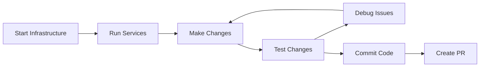

# Local Development Guide

This guide covers day-to-day development workflows for OpenFrame. It assumes you've completed the [Environment Setup](environment.md) and have a working development environment.

## Development Workflow Overview

OpenFrame follows a microservices architecture with hot reload capabilities for efficient development. Here's your typical development workflow:



## Daily Development Commands

### Quick Start Development Environment

Use the convenience scripts for rapid environment setup:

```bash
# Start everything (infrastructure + services)
./scripts/dev-start.sh

# Reset environment (clean restart)
./scripts/dev-reset.sh

# Stop everything
./scripts/dev-stop.sh
```

### Manual Service Management

For more control over individual services:

```bash
# Start only infrastructure
docker-compose up -d mongodb redis kafka mailhog

# Start specific services
cd openframe/services/openframe-api
mvn spring-boot:run -Dspring-boot.run.profiles=development

# Start with debugging
mvn spring-boot:run -Dspring-boot.run.profiles=development \
  -Dspring-boot.run.jvmArguments="-Xdebug -Xrunjdwp:transport=dt_socket,server=y,suspend=n,address=5005"
```

## Hot Reload and Live Development

### Backend Hot Reload (Spring Boot DevTools)

OpenFrame services are configured with Spring Boot DevTools for automatic restarts:

```xml
<!-- Already included in pom.xml -->
<dependency>
    <groupId>org.springframework.boot</groupId>
    <artifactId>spring-boot-devtools</artifactId>
    <scope>runtime</scope>
    <optional>true</optional>
</dependency>
```

**Triggers for restart:**
- Java class changes
- Configuration file changes (`application*.yml`)
- Static resource changes

**Manual restart:**
```bash
# Trigger restart by touching a file
touch src/main/resources/application.yml
```

### Frontend Hot Reload (Vite)

The Vue.js frontend supports hot module replacement (HMR):

```bash
cd openframe/services/openframe-frontend
npm run dev  # Starts with HMR enabled

# Changes to these files trigger hot reload:
# - Vue components (.vue files)
# - TypeScript files (.ts files)
# - CSS/SCSS files
# - Configuration files
```

### Configuration Hot Reload

Environment variables and configuration can be reloaded without restart:

```bash
# Update .env file, then restart specific service
export NEW_CONFIG_VALUE="updated-value"
pkill -f "openframe-api" && cd openframe/services/openframe-api && mvn spring-boot:run &
```

## Common Development Tasks

### 1. Adding New API Endpoints

#### GraphQL Endpoint Development

**Step 1: Update Schema**
```graphql
# Add to src/main/resources/schema/devices.graphqls
extend type Query {
    deviceMetrics(deviceId: ID!, timeRange: TimeRange): DeviceMetrics
}

type DeviceMetrics {
    cpuUsage: Float
    memoryUsage: Float
    diskUsage: Float
    networkTraffic: NetworkTraffic
}
```

**Step 2: Generate Types**
```bash
cd openframe/services/openframe-api
mvn compile  # Generates Java types from GraphQL schema
```

**Step 3: Implement Data Fetcher**
```java
@DgsComponent
public class DeviceDataFetcher {
    
    @Autowired
    private DeviceMetricsService metricsService;
    
    @DgsQuery
    public DeviceMetrics deviceMetrics(@InputArgument String deviceId, 
                                     @InputArgument TimeRange timeRange) {
        return metricsService.getMetrics(deviceId, timeRange);
    }
}
```

**Step 4: Test in GraphQL Playground**

Navigate to http://localhost:8081/graphql and test:
```graphql
query GetDeviceMetrics {
  deviceMetrics(deviceId: "device-123", timeRange: LAST_24_HOURS) {
    cpuUsage
    memoryUsage
    diskUsage
  }
}
```

#### REST Endpoint Development

**Step 1: Create Controller**
```java
@RestController
@RequestMapping("/api/v1/devices")
@CrossOrigin(origins = "http://localhost:3000")  // For development
public class DeviceController {
    
    @GetMapping("/{id}/metrics")
    public ResponseEntity<DeviceMetrics> getDeviceMetrics(
            @PathVariable String id,
            @RequestParam(defaultValue = "LAST_24_HOURS") TimeRange timeRange) {
        
        DeviceMetrics metrics = metricsService.getMetrics(id, timeRange);
        return ResponseEntity.ok(metrics);
    }
}
```

**Step 2: Test with curl**
```bash
curl -X GET "http://localhost:8080/api/v1/devices/device-123/metrics?timeRange=LAST_24_HOURS" \
  -H "Accept: application/json"
```

### 2. Frontend Component Development

#### Create New Vue Component

**Step 1: Create Component File**
```vue
<!-- src/components/DeviceMetrics.vue -->
<template>
  <div class="device-metrics">
    <Card>
      <template #title>Device Metrics</template>
      <template #content>
        <div class="grid">
          <div class="col-12 md:col-4">
            <div class="metric-card">
              <i class="pi pi-desktop"></i>
              <div class="metric-value">{{ metrics.cpuUsage }}%</div>
              <div class="metric-label">CPU Usage</div>
            </div>
          </div>
          <!-- More metrics... -->
        </div>
      </template>
    </Card>
  </div>
</template>

<script setup lang="ts">
import { ref, onMounted, watch } from 'vue'
import { useDeviceMetricsApi } from '@/api/deviceMetrics'
import type { DeviceMetrics, TimeRange } from '@/types/device'

interface Props {
  deviceId: string
  timeRange?: TimeRange
}

const props = withDefaults(defineProps<Props>(), {
  timeRange: 'LAST_24_HOURS'
})

const { fetchDeviceMetrics } = useDeviceMetricsApi()
const metrics = ref<DeviceMetrics>()
const loading = ref(false)

const loadMetrics = async () => {
  loading.value = true
  try {
    metrics.value = await fetchDeviceMetrics(props.deviceId, props.timeRange)
  } catch (error) {
    console.error('Failed to load metrics:', error)
  } finally {
    loading.value = false
  }
}

onMounted(loadMetrics)
watch([() => props.deviceId, () => props.timeRange], loadMetrics)
</script>

<style scoped>
.device-metrics {
  margin: 1rem 0;
}

.metric-card {
  text-align: center;
  padding: 1rem;
  border: 1px solid var(--surface-border);
  border-radius: 6px;
}

.metric-value {
  font-size: 2rem;
  font-weight: bold;
  color: var(--primary-color);
}
</style>
```

**Step 2: Create API Hook**
```typescript
// src/api/deviceMetrics.ts
import { gql } from '@apollo/client/core'
import { useQuery } from '@vue/apollo-composable'
import type { DeviceMetrics, TimeRange } from '@/types/device'

const GET_DEVICE_METRICS = gql`
  query GetDeviceMetrics($deviceId: ID!, $timeRange: TimeRange!) {
    deviceMetrics(deviceId: $deviceId, timeRange: $timeRange) {
      cpuUsage
      memoryUsage
      diskUsage
      networkTraffic {
        bytesIn
        bytesOut
      }
    }
  }
`

export const useDeviceMetricsApi = () => {
  const fetchDeviceMetrics = async (deviceId: string, timeRange: TimeRange): Promise<DeviceMetrics> => {
    const { result } = await useQuery(GET_DEVICE_METRICS, {
      deviceId,
      timeRange
    })
    
    return result.value?.deviceMetrics
  }
  
  return { fetchDeviceMetrics }
}
```

**Step 3: Add to Router**
```typescript
// src/router/index.ts
import DeviceMetrics from '@/components/DeviceMetrics.vue'

const routes = [
  {
    path: '/devices/:id/metrics',
    name: 'DeviceMetrics',
    component: DeviceMetrics,
    props: true
  }
]
```

### 3. Database Development

#### MongoDB Operations

**Connect to Development Database**
```bash
# Connect via CLI
mongo mongodb://localhost:27017/openframe

# Or use MongoDB Compass
# URI: mongodb://localhost:27017/openframe
```

**Common Development Queries**
```javascript
// Find all organizations
db.organizations.find({}).pretty()

// Find devices by status
db.devices.find({status: "ONLINE"})

// Create test data
db.organizations.insertOne({
  name: "Test Organization",
  website: "https://test.com",
  createdAt: new Date(),
  updatedAt: new Date()
})

// Update device status
db.devices.updateOne(
  {id: "device-123"}, 
  {$set: {status: "OFFLINE", lastSeen: new Date()}}
)

// Aggregation for device counts by organization
db.devices.aggregate([
  {$group: {_id: "$organizationId", count: {$sum: 1}}},
  {$sort: {count: -1}}
])
```

#### Repository Development

```java
@Repository
public interface DeviceRepository extends MongoRepository<Device, String> {
    
    List<Device> findByOrganizationIdAndStatus(String organizationId, DeviceStatus status);
    
    @Query("{'lastSeen': {$lt: ?0}}")
    List<Device> findStaleDevices(Instant before);
    
    @Aggregation(pipeline = {
        "{ '$group': { '_id': '$organizationId', 'count': { '$sum': 1 } } }",
        "{ '$sort': { 'count': -1 } }"
    })
    List<DeviceCountByOrganization> getDeviceCountsByOrganization();
}
```

### 4. Testing During Development

#### Unit Testing

Run tests for specific components:
```bash
# Test specific class
mvn test -Dtest=DeviceServiceTest

# Test specific method
mvn test -Dtest=DeviceServiceTest#testGetDeviceMetrics

# Run tests with coverage
mvn test jacoco:report

# View coverage report
open target/site/jacoco/index.html
```

#### Integration Testing

```bash
# Run integration tests
mvn test -Dgroups=integration

# Run with test profile
mvn test -Dspring.profiles.active=test

# Run specific integration test
mvn test -Dtest=DeviceControllerIntegrationTest
```

#### Frontend Testing

```bash
cd openframe/services/openframe-frontend

# Run unit tests
npm run test:unit

# Run component tests
npm run test:component

# Run e2e tests
npm run test:e2e

# Run with coverage
npm run test:coverage
```

## Debugging

### Backend Debugging

#### IDE Debugging (IntelliJ IDEA)

1. **Create Debug Configuration**:
   ```text
   Run → Edit Configurations → Add New → Remote
   Host: localhost
   Port: 5005 (or service-specific port)
   ```

2. **Start Service in Debug Mode**:
   ```bash
   cd openframe/services/openframe-api
   mvn spring-boot:run -Dspring-boot.run.jvmArguments="-Xdebug -Xrunjdwp:transport=dt_socket,server=y,suspend=n,address=5005"
   ```

3. **Attach Debugger**: Run → Debug → Select your remote configuration

#### Log-based Debugging

```java
// Use SLF4J for structured logging
@Slf4j
@Service
public class DeviceService {
    
    public DeviceMetrics getMetrics(String deviceId, TimeRange timeRange) {
        log.debug("Getting metrics for device: {}, timeRange: {}", deviceId, timeRange);
        
        try {
            DeviceMetrics metrics = calculateMetrics(deviceId, timeRange);
            log.info("Successfully retrieved metrics for device: {}", deviceId);
            return metrics;
        } catch (Exception e) {
            log.error("Failed to get metrics for device: {}", deviceId, e);
            throw e;
        }
    }
}
```

**View Logs in Real-time**:
```bash
# Tail application logs
tail -f openframe/services/openframe-api/logs/application.log

# Filter specific log level
grep "ERROR" openframe/services/*/logs/application.log

# Follow logs from multiple services
multitail openframe/services/*/logs/application.log
```

### Frontend Debugging

#### Browser DevTools

1. **Vue DevTools**: Install browser extension for Vue.js debugging
2. **Network Tab**: Monitor GraphQL queries and responses
3. **Console**: Use `console.log()` for quick debugging

#### Component Debugging

```typescript
// Add debugging to Vue components
<script setup lang="ts">
import { watch } from 'vue'

// Debug reactive data
watch(metrics, (newValue, oldValue) => {
  console.log('Metrics changed:', { newValue, oldValue })
}, { deep: true })

// Debug computed properties
const debugInfo = computed(() => {
  console.log('Computing debug info...')
  return {
    deviceId: props.deviceId,
    metricsLoaded: !!metrics.value,
    timestamp: new Date().toISOString()
  }
})
</script>
```

## Performance Optimization

### Backend Performance

#### Database Query Optimization

```javascript
// Create indexes for common queries
db.devices.createIndex({organizationId: 1, status: 1})
db.devices.createIndex({lastSeen: 1})
db.events.createIndex({timestamp: 1, deviceId: 1})

// Explain query performance
db.devices.find({organizationId: "org-123"}).explain("executionStats")
```

#### JVM Performance Monitoring

```bash
# Monitor garbage collection
jstat -gc $(jps | grep ApiApplication | cut -d' ' -f1) 1s

# Monitor memory usage
jmap -histo $(jps | grep ApiApplication | cut -d' ' -f1) | head -20

# Profile CPU usage
jcmd $(jps | grep ApiApplication | cut -d' ' -f1) VM.classloader_stats
```

### Frontend Performance

#### Bundle Analysis

```bash
cd openframe/services/openframe-frontend

# Analyze bundle size
npm run build:analyze

# Check for unused dependencies
npx depcheck

# Optimize images
npm run optimize:images
```

#### Performance Monitoring

```typescript
// Monitor component performance
import { performance } from 'perf_hooks'

const startTime = performance.now()
// ... component operations
const endTime = performance.now()
console.log(`Operation took ${endTime - startTime} milliseconds`)
```

## Environment Management

### Multiple Environment Support

Create environment-specific configurations:

```bash
# Development
cp .env.example .env.development

# Testing
cp .env.example .env.test

# Staging
cp .env.example .env.staging
```

**Switch environments**:
```bash
# Set environment
export NODE_ENV=development
export SPRING_PROFILES_ACTIVE=development

# Or use environment file
source .env.development
```

### Configuration Hot Reload

```bash
# Update configuration without restart
# 1. Modify application-development.yml
# 2. Spring Boot DevTools will restart automatically

# Or manually trigger refresh
curl -X POST http://localhost:8081/actuator/refresh
```

## Common Issues and Solutions

### Port Conflicts

```bash
# Find process using port
lsof -i :8080

# Kill process
sudo kill -9 $(lsof -t -i :8080)

# Use alternative ports
export SERVER_PORT=8090
mvn spring-boot:run
```

### Database Connection Issues

```bash
# Reset database containers
docker-compose down
docker-compose up -d mongodb redis

# Check database connectivity
mongo --eval "db.adminCommand('ismaster')"
redis-cli ping
```

### Memory Issues

```bash
# Increase JVM heap size
export MAVEN_OPTS="-Xmx2g -XX:MaxMetaspaceSize=512m"

# Clear Maven cache
rm -rf ~/.m2/repository

# Clean and rebuild
mvn clean install -DskipTests
```

### Frontend Issues

```bash
# Clear node modules and reinstall
rm -rf node_modules package-lock.json
npm install

# Clear Vite cache
npm run dev -- --force

# Reset to clean state
git clean -fdx
npm install
```

## Best Practices

### Code Quality

1. **Use EditorConfig**: Consistent formatting across IDEs
2. **Follow Naming Conventions**: 
   - Java: `camelCase` for variables, `PascalCase` for classes
   - Vue: `kebab-case` for components, `camelCase` for props
3. **Write Tests**: Aim for 80%+ test coverage
4. **Document APIs**: Use JSDoc for TypeScript, Javadoc for Java

### Git Workflow

```bash
# Feature development
git checkout main
git pull origin main
git checkout -b feature/device-metrics
# ... make changes ...
git add .
git commit -m "feat: add device metrics API endpoint"
git push origin feature/device-metrics
# Create PR via GitHub
```

### Performance Best Practices

1. **Lazy Loading**: Load components and data on demand
2. **Caching**: Use Redis for expensive operations
3. **Database Indexing**: Index frequently queried fields
4. **Connection Pooling**: Configure appropriate pool sizes
5. **Bundle Splitting**: Split frontend bundles by route

## Next Steps

Continue your development journey:

1. **[Testing Overview](../testing/overview.md)** - Learn about testing strategies
2. **[Architecture Overview](../architecture/overview.md)** - Understand the system design
3. **[Contributing Guidelines](../contributing/guidelines.md)** - Contribute to OpenFrame

## Getting Help

- **Documentation**: Check API docs and architecture guides
- **Community**: Join [OpenMSP Slack](https://join.slack.com/t/openmsp/shared_invite/zt-36bl7mx0h-3~U2nFH6nqHqoTPXMaHEHA) #development channel
- **Issues**: Create GitHub issues for bugs or questions

---

**Happy coding!** 🎯 You now have everything needed for productive OpenFrame development.