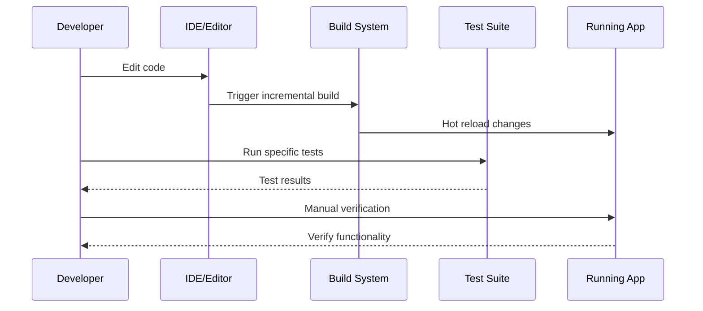

# Local Development Guide

This guide covers setting up and running OpenFrame locally for development, including hot reloading, debugging, and testing workflows.

## Quick Start for Developers

### One-Command Development Setup

```bash
# Clone and start development environment
git clone https://github.com/flamingo-stack/openframe-oss-tenant.git
cd openframe-oss-tenant

# Platform-specific development startup
./scripts/run-mac.sh --dev        # macOS
./scripts/run-linux.sh --dev      # Linux  
./scripts/run-windows.ps1 -Dev    # Windows PowerShell
```

This development mode includes:
- ✅ Hot reloading for frontend changes
- ✅ Automatic service restart on Java changes
- ✅ Debug ports exposed for all services
- ✅ Development database with sample data
- ✅ Relaxed security for faster iteration

## Manual Development Setup

For more control over the development process:

### 1. Clone and Initialize

```bash
# Clone the repository
git clone https://github.com/flamingo-stack/openframe-oss-tenant.git
cd openframe-oss-tenant

# Initialize development environment
./scripts/init-dev-env.sh
```

### 2. Start Infrastructure Services

Start the required infrastructure services first:

```bash
# Using Docker Compose (recommended)
docker-compose -f docker-compose.dev.yml up -d mongodb redis kafka

# Or start manually if you have them installed
# MongoDB
mongod --dbpath ./data/mongodb --port 27017

# Redis  
redis-server --port 6379

# Kafka (optional for basic development)
# Follow Apache Kafka quickstart guide
```

### 3. Build the Project

```bash
# Build all Java modules
mvn clean install -DskipTests

# Or build specific modules
mvn clean install -pl openframe-oss-lib -am -DskipTests  # Core libraries only
mvn clean install -pl openframe/services -am -DskipTests # Services only
```

### 4. Start Services in Development Mode

#### Terminal 1: API Gateway (with debug)

```bash
# Start Gateway with debug port 5005
java -agentlib:jdwp=transport=dt_socket,server=y,suspend=n,address=*:5005 \
  -Dspring.profiles.active=dev \
  -jar openframe/services/openframe-gateway/target/openframe-gateway-*.jar

# Or using Maven for hot reload
mvn spring-boot:run -pl openframe/services/openframe-gateway \
  -Dspring-boot.run.jvmArguments="-agentlib:jdwp=transport=dt_socket,server=y,suspend=n,address=*:5005" \
  -Dspring-boot.run.profiles=dev
```

#### Terminal 2: Authorization Server (with debug)

```bash
# Start Auth Server with debug port 5006
java -agentlib:jdwp=transport=dt_socket,server=y,suspend=n,address=*:5006 \
  -Dspring.profiles.active=dev \
  -jar openframe/services/openframe-authorization-server/target/openframe-authorization-server-*.jar

# Or using Maven
mvn spring-boot:run -pl openframe/services/openframe-authorization-server \
  -Dspring-boot.run.jvmArguments="-agentlib:jdwp=transport=dt_socket,server=y,suspend=n,address=*:5006" \
  -Dspring-boot.run.profiles=dev
```

#### Terminal 3: API Service (with debug)

```bash
# Start API Service with debug port 5007  
java -agentlib:jdwp=transport=dt_socket,server=y,suspend=n,address=*:5007 \
  -Dspring.profiles.active=dev \
  -jar openframe/services/openframe-api/target/openframe-api-*.jar

# Or using Maven
mvn spring-boot:run -pl openframe/services/openframe-api \
  -Dspring-boot.run.jvmArguments="-agentlib:jdwp=transport=dt_socket,server=y,suspend=n,address=*:5007" \
  -Dspring-boot.run.profiles=dev
```

#### Terminal 4: Frontend (with hot reload)

```bash
cd openframe/services/openframe-frontend

# Install dependencies if not already done
npm install

# Start development server with hot reload
npm run dev

# Frontend will be available at http://localhost:3000
# Hot reload will automatically refresh on file changes
```

## Development Configuration

### Environment Variables for Development

Create a `.env.dev` file in the project root:

```bash
# Development Database Configuration
MONGODB_URI=mongodb://localhost:27017/openframe_dev
MONGODB_DATABASE=openframe_dev
REDIS_URL=redis://localhost:6379/0

# Development Security (use weak secrets for dev only)
JWT_SECRET=dev-jwt-secret-not-for-production
JWT_EXPIRATION=7200
OAUTH2_CLIENT_ID=openframe-dev
OAUTH2_CLIENT_SECRET=dev-oauth-secret

# Development Logging
LOGGING_LEVEL_ROOT=INFO  
LOGGING_LEVEL_COM_OPENFRAME=DEBUG
LOGGING_LEVEL_MONGODB_DRIVER=INFO

# Development Server Configuration
API_SERVICE_PORT=8080
GATEWAY_SERVICE_PORT=8081
AUTH_SERVICE_PORT=8082
FRONTEND_PORT=3000

# Development Feature Flags
ENABLE_DEV_ENDPOINTS=true
ENABLE_CORS=true
ENABLE_H2_CONSOLE=false
SKIP_SSL_VERIFICATION=true

# External Tool Integration (development instances)
TACTICAL_RMM_BASE_URL=http://localhost:8000
TACTICAL_RMM_API_KEY=dev-trmm-key
FLEET_MDM_BASE_URL=http://localhost:9000
MESH_CENTRAL_BASE_URL=http://localhost:4430

# AI Development Configuration
OPENAI_API_KEY=sk-dev-placeholder
ANTHROPIC_API_KEY=sk-ant-dev-placeholder
AI_MODEL_FALLBACK=mock
```

### Application Configuration for Development

Each service uses `application-dev.yml` for development-specific settings:

**Gateway Service (`openframe/services/openframe-gateway/src/main/resources/application-dev.yml`)**:

```yaml
server:
  port: 8081

spring:
  security:
    oauth2:
      resourceserver:
        jwt:
          issuer-uri: http://localhost:8082
  
  cloud:
    gateway:
      routes:
        - id: api-service  
          uri: http://localhost:8080
          predicates:
            - Path=/api/**,/graphql/**
        - id: auth-service
          uri: http://localhost:8082  
          predicates:
            - Path=/auth/**,/.well-known/**

management:
  endpoints:
    web:
      exposure:
        include: health,info,metrics,loggers
      cors:
        allowed-origins: "http://localhost:3000"
        allowed-methods: GET,POST,PUT,DELETE,OPTIONS
        allowed-headers: "*"

logging:
  level:
    com.openframe: DEBUG
    org.springframework.cloud.gateway: DEBUG
```

**API Service (`openframe/services/openframe-api/src/main/resources/application-dev.yml`)**:

```yaml
server:
  port: 8080

spring:
  data:
    mongodb:
      uri: ${MONGODB_URI:mongodb://localhost:27017/openframe_dev}
      auto-index-creation: true
  
  redis:
    url: ${REDIS_URL:redis://localhost:6379/0}
    timeout: 2000ms

  security:
    oauth2:
      resourceserver:
        jwt:
          issuer-uri: http://localhost:8082

dgs:
  graphql:
    schema-locations: classpath*:schema/**/*.graphqls
    introspection:
      enabled: true
    graphiql:
      enabled: true
      path: /graphiql

management:
  endpoints:
    web:
      exposure:
        include: health,info,metrics,beans,env
        
logging:
  level:
    com.openframe: DEBUG
    com.netflix.graphql.dgs: DEBUG
```

## Hot Reload and Live Development

### Java Hot Reload with Spring Boot DevTools

Enable Spring Boot DevTools for automatic restarts:

1. **Add DevTools Dependency** (already included in OpenFrame):
   ```xml
   <dependency>
       <groupId>org.springframework.boot</groupId>
       <artifactId>spring-boot-devtools</artifactId>
       <scope>runtime</scope>
       <optional>true</optional>
   </dependency>
   ```

2. **Configure IDE for Automatic Compilation**:
   
   **IntelliJ IDEA:**
   - Go to **Preferences** → **Build** → **Compiler**
   - Check ✅ **Build project automatically**
   - Press `Cmd+Shift+A` (macOS) or `Ctrl+Shift+A` (Windows/Linux)
   - Search for "Registry" and enable `compiler.automake.allow.when.app.running`

   **VS Code:**
   - DevTools will automatically detect file changes when using the Java Extension Pack

3. **Verify Hot Reload**:
   ```bash
   # Make a change to a controller or service class
   # Save the file  
   # Check console for restart message:
   # "Restarting due to 1 class path change (0 additions, 0 deletions, 1 modification)"
   ```

### Frontend Hot Reload

Next.js provides built-in hot reload:

```bash
cd openframe/services/openframe-frontend
npm run dev

# Hot Module Replacement (HMR) is enabled by default
# Changes to React components, styles, and pages reload automatically
# State is preserved where possible
```

**Optimizing Frontend Development:**

1. **Fast Refresh Configuration** (already enabled):
   ```javascript
   // next.config.js
   module.exports = {
     experimental: {
       fastRefresh: true,
     },
     // Other config...
   }
   ```

2. **TypeScript Configuration for Fast Compilation**:
   ```json
   // tsconfig.json
   {
     "compilerOptions": {
       "incremental": true,
       "tsBuildInfoFile": ".next/cache/tsconfig.tsbuildinfo"
     }
   }
   ```

## Debugging Configuration

### Java Service Debugging

Each service exposes debug ports for IDE attachment:

| Service | Debug Port | Connection String |
|---------|------------|-------------------|
| Gateway | 5005 | `localhost:5005` |
| Authorization | 5006 | `localhost:5006` |
| API Service | 5007 | `localhost:5007` |
| Management | 5008 | `localhost:5008` |

**IntelliJ IDEA Debug Configuration:**

1. **Create Remote Debug Configuration**:
   - **Run** → **Edit Configurations**
   - Click **+** → **Remote JVM Debug**
   - **Name**: `OpenFrame API Service Debug`
   - **Host**: `localhost`
   - **Port**: `5007` (for API service)
   - **Command line args**: `-agentlib:jdwp=transport=dt_socket,server=y,suspend=n,address=*:5007`

2. **Start Debugging**:
   - Set breakpoints in your code
   - Start the service with debug enabled
   - Run the debug configuration in IntelliJ
   - Trigger requests to hit your breakpoints

**VS Code Debug Configuration** (`.vscode/launch.json`):

```json
{
  "version": "0.2.0",
  "configurations": [
    {
      "type": "java",
      "name": "Debug API Service",
      "request": "attach",
      "hostName": "localhost", 
      "port": 5007,
      "projectName": "openframe-api"
    },
    {
      "type": "java",
      "name": "Debug Gateway",
      "request": "attach",
      "hostName": "localhost",
      "port": 5005,
      "projectName": "openframe-gateway" 
    }
  ]
}
```

### Frontend Debugging

**Browser DevTools Integration:**

1. **Start frontend with source maps**:
   ```bash
   npm run dev  # Source maps enabled by default in dev mode
   ```

2. **VS Code Frontend Debugging**:
   ```json
   // .vscode/launch.json
   {
     "type": "node",
     "request": "launch", 
     "name": "Debug Next.js",
     "program": "${workspaceFolder}/openframe/services/openframe-frontend/node_modules/next/dist/bin/next",
     "args": ["dev"],
     "cwd": "${workspaceFolder}/openframe/services/openframe-frontend",
     "runtimeExecutable": "node",
     "skipFiles": ["<node_internals>/**"],
     "env": {
       "NODE_OPTIONS": "--inspect"
     }
   }
   ```

## Testing During Development

### Running Tests

```bash
# Run all tests
mvn test

# Run tests for specific module
mvn test -pl openframe-oss-lib/openframe-api-service-core

# Run specific test class
mvn test -Dtest=UserServiceTest

# Run specific test method
mvn test -Dtest=UserServiceTest#testCreateUser

# Run tests with detailed output
mvn test -Dspring.profiles.active=test -Dtest.detailed=true

# Frontend tests
cd openframe/services/openframe-frontend
npm test          # Run Jest tests
npm run test:e2e  # Run Playwright e2e tests
```

### Test-Driven Development Workflow

1. **Write failing test**:
   ```java
   @Test
   void shouldCreateOrganization() {
       // Given
       CreateOrganizationRequest request = CreateOrganizationRequest.builder()
           .name("Test MSP")
           .build();
       
       // When & Then
       assertThat(organizationService.createOrganization(request))
           .isNotNull()
           .extracting(OrganizationResponse::getName)
           .isEqualTo("Test MSP");
   }
   ```

2. **Run test to confirm failure**:
   ```bash
   mvn test -Dtest=OrganizationServiceTest#shouldCreateOrganization
   ```

3. **Implement functionality**:
   ```java
   @Service
   public class OrganizationService {
       public OrganizationResponse createOrganization(CreateOrganizationRequest request) {
           // Implementation here
       }
   }
   ```

4. **Run test to confirm success**:
   ```bash
   mvn test -Dtest=OrganizationServiceTest#shouldCreateOrganization
   ```

### Integration Testing with Testcontainers

OpenFrame uses Testcontainers for integration tests:

```java
@SpringBootTest
@Testcontainers
class OrganizationIntegrationTest {
    
    @Container
    static MongoDBContainer mongodb = new MongoDBContainer("mongo:7.0")
            .withExposedPorts(27017);
    
    @DynamicPropertySource
    static void configureProperties(DynamicPropertyRegistry registry) {
        registry.add("spring.data.mongodb.uri", mongodb::getReplicaSetUrl);
    }
    
    @Test
    void shouldPersistOrganization() {
        // Test with real MongoDB container
    }
}
```

## Monitoring and Observability

### Health Checks

Monitor service health during development:

```bash
# Check all services
curl -s http://localhost:8081/actuator/health | jq
curl -s http://localhost:8080/actuator/health | jq  
curl -s http://localhost:8082/actuator/health | jq

# Detailed health information
curl -s http://localhost:8080/actuator/health/mongo | jq
curl -s http://localhost:8080/actuator/health/redis | jq
```

### Metrics and Monitoring

Access development metrics:

```bash
# Application metrics
curl -s http://localhost:8080/actuator/metrics | jq
curl -s http://localhost:8080/actuator/metrics/http.server.requests | jq

# JVM metrics  
curl -s http://localhost:8080/actuator/metrics/jvm.memory.used | jq

# Custom business metrics
curl -s http://localhost:8080/actuator/metrics/openframe.devices.registered | jq
```

### Logging Configuration

**Development Logging** (`logback-spring.xml`):

```xml
<configuration>
    <springProfile name="dev">
        <appender name="CONSOLE" class="ch.qos.logback.core.ConsoleAppender">
            <encoder>
                <pattern>%d{HH:mm:ss.SSS} [%thread] %-5level %logger{36} - %msg%n</pattern>
            </encoder>
        </appender>
        
        <logger name="com.openframe" level="DEBUG"/>
        <logger name="org.springframework.data.mongodb" level="DEBUG"/>
        <logger name="org.springframework.security" level="DEBUG"/>
        
        <root level="INFO">
            <appender-ref ref="CONSOLE"/>
        </root>
    </springProfile>
</configuration>
```

## Performance Optimization for Development

### JVM Tuning for Development

```bash
# Faster startup with smaller heap
export JAVA_OPTS="-Xmx512m -Xms256m -XX:+UseG1GC -XX:MaxGCPauseMillis=100"

# Enable JVM hot compilation for faster restarts
export JAVA_OPTS="$JAVA_OPTS -XX:+UnlockExperimentalVMOptions -XX:+UseJVMCICompiler"

# Faster class loading
export JAVA_OPTS="$JAVA_OPTS -Djava.security.egd=file:/dev/urandom"
```

### Maven Build Optimization

```bash
# Parallel builds  
mvn clean install -T 4 -DskipTests

# Skip unnecessary plugins in dev
mvn install -Dcheckstyle.skip=true -Dpmd.skip=true -DskipTests

# Build only changed modules
mvn install -pl $(git diff --name-only HEAD~1 | grep pom.xml | xargs dirname | tr '\n' ',')
```

### Database Performance for Development

**MongoDB Development Tuning**:

```javascript
// Connect to local MongoDB
use openframe_dev;

// Create development indexes
db.devices.createIndex({ "tenantId": 1, "status": 1 });
db.organizations.createIndex({ "tenantId": 1, "name": 1 });
db.users.createIndex({ "tenantId": 1, "email": 1 });

// Configure for development (less durability, more speed)
db.adminCommand({
    setParameter: 1,
    syncdelay: 60,        // Sync every 60 seconds instead of default
    wiredTigerEngineRuntimeConfig: "cache_size=256MB"
});
```

## Development Workflow Best Practices

### Daily Development Routine

```bash
#!/bin/bash
# scripts/daily-dev-setup.sh

echo "🌅 Starting daily OpenFrame development session"

# Pull latest changes
git pull origin main

# Clean and rebuild
mvn clean install -DskipTests -T 4

# Start infrastructure  
docker-compose -f docker-compose.dev.yml up -d

# Start services with hot reload
./scripts/start-dev-services.sh

echo "✅ Development environment ready!"
echo "🌐 Frontend: http://localhost:3000"
echo "📊 GraphiQL: http://localhost:8080/graphiql"
echo "💚 Health: http://localhost:8081/actuator/health"
```

### Code-Build-Test Cycle



### Git Workflow for Development

```bash
# Start working on a feature
git checkout main
git pull origin main
git checkout -b feature/device-status-alerts

# Make changes and commit frequently
git add -A
git commit -m "feat: add device status monitoring"

# Push feature branch
git push -u origin feature/device-status-alerts

# Create pull request through GitHub/GitLab
# After review and approval, merge to main
```

## Troubleshooting Development Issues

### Common Development Problems

**Services Won't Start:**

```bash
# Check port availability
lsof -i :8080  # API Service
lsof -i :8081  # Gateway  
lsof -i :3000  # Frontend

# Kill conflicting processes
kill -9 $(lsof -ti :8080)

# Check service logs
tail -f logs/openframe-api.log
```

**Build Failures:**

```bash
# Clear Maven caches
mvn dependency:purge-local-repository
rm -rf ~/.m2/repository/com/openframe

# Reimport in IDE
# IntelliJ: File -> Invalidate Caches and Restart
# VS Code: Reload window
```

**Database Connection Issues:**

```bash
# Test MongoDB connection
mongosh "mongodb://localhost:27017/openframe_dev"

# Check MongoDB process
ps aux | grep mongod
brew services list | grep mongodb  # macOS

# Test Redis connection  
redis-cli -h localhost -p 6379 ping
```

**Frontend Issues:**

```bash
# Clear Node.js cache
cd openframe/services/openframe-frontend
rm -rf node_modules package-lock.json .next
npm cache clean --force
npm install

# Check Node.js/npm versions
node --version  # Should be 20.x
npm --version   # Should be 10.x
```

## Next Steps

With your local development environment running:

1. **Explore the Architecture**: Review [Architecture Overview](../architecture/overview.md)
2. **Write Your First Test**: See [Testing Overview](../testing/overview.md)  
3. **Make Your First Contribution**: Follow [Contributing Guidelines](../contributing/guidelines.md)

Your local development environment is now fully configured for productive OpenFrame development! 🚀