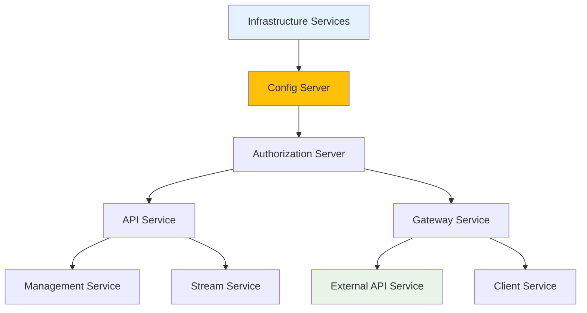

# Local Development Guide

This guide walks you through cloning, building, running, and debugging OpenFrame locally. Whether you're contributing to core development or building custom features, this will get you productive quickly.

> **Prerequisites**  
> ✅ Completed [Environment Setup](environment.md) with IDE and tools configured

## Repository Structure Overview

Understanding the repository layout helps navigate the codebase effectively:

```
openframe-oss-tenant/
├── openframe/                          # Java services and libraries
│   ├── services/                       # Microservices applications
│   │   ├── openframe-gateway/          # API Gateway service
│   │   ├── openframe-api/              # GraphQL API service
│   │   ├── openframe-management/       # Management service
│   │   ├── openframe-stream/           # Stream processing
│   │   ├── openframe-config/           # Configuration server
│   │   ├── openframe-client/           # Agent management
│   │   ├── openframe-external-api/     # External REST API
│   │   ├── openframe-authorization-server/ # OAuth server
│   │   └── openframe-frontend/         # Vue.js frontend
│   └── libs/                           # Shared libraries
├── clients/                            # Client applications
│   ├── openframe-client/               # Rust system agent
│   └── openframe-chat/                 # Tauri chat client
├── integrated-tools/                   # External tool configurations
├── manifests/                          # Kubernetes deployment files
├── scripts/                            # Development scripts
└── docs/                               # Documentation
```

## Clone and Setup

### Repository Cloning

```bash
# Clone the main repository
git clone https://github.com/flamingo-stack/openframe-oss-tenant.git
cd openframe-oss-tenant

# Verify structure
ls -la
# Expected: openframe/, clients/, scripts/, manifests/, docs/, etc.
```

### Environment Configuration

Create your local environment file:

```bash
# Copy example environment file
cp .env.example .env

# Edit with your configuration
nano .env  # or use your preferred editor
```

**Essential environment variables:**

```bash
# GitHub token for private repository access
GITHUB_TOKEN=ghp_your_github_personal_access_token

# Database URLs (will be set by Docker Compose)
MONGODB_URI=mongodb://localhost:27017/openframe
REDIS_URL=redis://localhost:6379
KAFKA_BOOTSTRAP_SERVERS=localhost:9092

# Development security settings
JWT_SECRET=development-jwt-secret-minimum-32-characters
ENCRYPTION_KEY=development-encryption-key-32-chars

# Spring profiles
SPRING_PROFILES_ACTIVE=development,local
```

### Git Configuration

Set up Git hooks and branch configuration:

```bash
# Configure Git for the project
git config core.autocrlf false  # Preserve line endings
git config pull.rebase true     # Use rebase for pulls

# Set up development branch (optional)
git checkout -b development
git push -u origin development
```

## Building OpenFrame

### Complete Build Process

The fastest way to build everything:

```bash
# Build all Java services and libraries
mvn clean install

# Expected output: BUILD SUCCESS for all modules
```

### Module-Specific Builds

For faster development cycles, build only what you're working on:

```bash
# Build specific service
mvn clean install -pl openframe-api

# Build with dependencies
mvn clean install -pl openframe-api -am

# Skip tests for faster builds
mvn clean install -DskipTests

# Parallel builds (use number of CPU cores)
mvn clean install -T 1C
```

### Frontend Build

```bash
# Navigate to frontend directory
cd openframe/services/openframe-frontend

# Install dependencies
npm install

# Build for development
npm run build

# Type checking
npm run type-check
```

### Rust Client Build

```bash
# Navigate to client directory
cd clients/openframe-client

# Build the Rust client
cargo build

# Build with optimizations (slower but faster runtime)
cargo build --release

# Run tests
cargo test
```

## Running OpenFrame Locally

### Automated Startup (Recommended)

Use the platform-specific startup scripts for complete automation:

```bash
# macOS
./scripts/run-mac.sh

# Linux  
./scripts/run-linux.sh

# Windows PowerShell
./scripts/run-windows.ps1

# Silent mode (no prompts)
./scripts/run-mac.sh --silent
```

#### What the Startup Script Does

1. **Validates prerequisites** (Java, Maven, Node.js, Docker)
2. **Starts infrastructure services** (MongoDB, Redis, Kafka)
3. **Builds all services** (Java backend, Vue frontend)
4. **Starts services in correct order**
5. **Provides status updates** and URLs

### Manual Startup (For Development)

For development work, you may want to start services individually:

#### Step 1: Start Infrastructure Services

```bash
# Start databases and messaging
docker compose up -d mongodb redis kafka zookeeper

# Verify services are running
docker compose ps
```

#### Step 2: Start Core Services

```bash
# Terminal 1: Configuration Server
cd openframe/services/openframe-config
mvn spring-boot:run

# Terminal 2: Gateway Service
cd openframe/services/openframe-gateway
mvn spring-boot:run

# Terminal 3: API Service
cd openframe/services/openframe-api
mvn spring-boot:run
```

#### Step 3: Start Frontend

```bash
# Terminal 4: Frontend Development Server
cd openframe/services/openframe-frontend
npm run dev
```

### Service Startup Order

Services have dependencies. Start them in this order:



## Development Server Configuration

### Service Ports

| Service | Port | URL | Purpose |
|---------|------|-----|---------|
| **Frontend** | 8080 | http://localhost:8080 | Main UI |
| **Gateway** | 8080 | http://localhost:8080/api | API Gateway |
| **API Service** | 8081 | http://localhost:8081 | Internal GraphQL |
| **Config Server** | 8888 | http://localhost:8888 | Configuration |
| **Authorization** | 9000 | http://localhost:9000 | OAuth server |
| **Management** | 8082 | http://localhost:8082 | Management API |
| **Stream Service** | 8083 | http://localhost:8083 | Stream processing |
| **MongoDB** | 27017 | mongodb://localhost:27017 | Database |
| **Redis** | 6379 | redis://localhost:6379 | Cache |
| **Kafka** | 9092 | localhost:9092 | Message broker |

### Hot Reload Configuration

#### Java Services Hot Reload

Enable Spring Boot DevTools for automatic restart:

```xml
<!-- Add to pom.xml of services you're developing -->
<dependency>
    <groupId>org.springframework.boot</groupId>
    <artifactId>spring-boot-devtools</artifactId>
    <scope>runtime</scope>
    <optional>true</optional>
</dependency>
```

#### Frontend Hot Reload

The frontend automatically reloads when files change:

```bash
cd openframe/services/openframe-frontend
npm run dev

# Custom configuration
npm run dev -- --port 3000 --host 0.0.0.0
```

#### Live Reload Configuration

Configure your IDE to automatically compile and restart:

**IntelliJ IDEA:**
1. **File** → **Settings** → **Build, Execution, Deployment** → **Compiler**
2. Check ✅ **"Build project automatically"**
3. **Registry** (Ctrl+Shift+Alt+/) → Enable `compiler.automake.allow.when.app.running`

**VS Code:**
- TypeScript files automatically trigger rebuilds
- Use **TypeScript: Restart TS Server** command if needed

## Debug Configuration

### Java Service Debugging

#### Remote Debugging Setup

Start Java services with debugging enabled:

```bash
# API Service with remote debugging
export JAVA_OPTS="-agentlib:jdwp=transport=dt_socket,server=y,suspend=n,address=*:8000"
cd openframe/services/openframe-api
mvn spring-boot:run

# Gateway Service debugging
export JAVA_OPTS="-agentlib:jdwp=transport=dt_socket,server=y,suspend=n,address=*:8001"  
cd openframe/services/openframe-gateway
mvn spring-boot:run
```

#### IDE Debug Configuration

**IntelliJ IDEA:**
1. **Run** → **Edit Configurations** → **Add New** → **Remote JVM Debug**
2. **Host**: localhost, **Port**: 8000
3. **Search for sources**: Automatically

**VS Code:**
Add to `.vscode/launch.json`:

```json
{
  "name": "Debug API Service",
  "type": "java",
  "request": "attach",
  "hostName": "localhost",
  "port": 8000
}
```

### Frontend Debugging

#### Browser DevTools

The Vue frontend includes full source maps for debugging:

1. **Open browser DevTools** (F12)
2. **Sources tab** → Navigate to your TypeScript files
3. **Set breakpoints** directly in original source code

#### VS Code Vue Debugging

Install Vue.js extension and add launch configuration:

```json
{
  "name": "Debug Vue Frontend",
  "type": "node",
  "request": "launch",
  "program": "${workspaceFolder}/node_modules/@vue/cli-service/bin/vue-cli-service.js",
  "args": ["serve"],
  "cwd": "${workspaceFolder}/openframe/services/openframe-frontend"
}
```

### Rust Client Debugging

#### Command Line Debugging

```bash
cd clients/openframe-client

# Debug build with symbols
cargo build

# Run with logging
RUST_LOG=debug cargo run

# Run with backtrace
RUST_BACKTRACE=1 cargo run
```

#### VS Code Rust Debugging

Ensure you have the CodeLLDB extension installed:

```json
{
  "name": "Debug Rust Client",
  "type": "lldb",
  "request": "launch", 
  "program": "${workspaceFolder}/clients/openframe-client/target/debug/openframe-client",
  "args": [],
  "cwd": "${workspaceFolder}/clients/openframe-client"
}
```

## Database Management

### MongoDB Development

#### Connect to Local MongoDB

```bash
# Using MongoDB shell
mongo mongodb://localhost:27017/openframe

# Using MongoDB Compass GUI
# URL: mongodb://localhost:27017
```

#### Common Development Queries

```javascript
// List collections
show collections

// Find users
db.users.find().pretty()

// Find organizations
db.organizations.find().pretty()

// Clear test data (development only)
db.users.deleteMany({})
db.organizations.deleteMany({})
```

### Redis Development

#### Connect to Local Redis

```bash
# Redis CLI
redis-cli

# Monitor commands
redis-cli monitor

# Check memory usage
redis-cli info memory
```

#### Common Redis Operations

```bash
# List all keys
KEYS *

# Get specific value
GET user:session:123

# Clear all data (development only)
FLUSHDB
```

## Testing During Development

### Running Tests

```bash
# Run all tests
mvn test

# Run specific test class
mvn test -Dtest=UserServiceTest

# Run specific test method
mvn test -Dtest=UserServiceTest#testCreateUser

# Run tests for specific module
mvn test -pl openframe-api

# Frontend tests
cd openframe/services/openframe-frontend
npm run test:unit
```

### Integration Testing

```bash
# Run integration tests (requires running services)
mvn verify

# Run specific integration test
mvn test -Dtest=DeviceIntegrationTest
```

### Test Database

Tests use a separate test database configuration:

```yaml
# test profile in application-test.yml
spring:
  data:
    mongodb:
      uri: mongodb://localhost:27017/openframe_test
```

## Monitoring Development Services

### Health Checks

Check service health during development:

```bash
# API Service health
curl http://localhost:8081/actuator/health

# Gateway health (proxied)
curl http://localhost:8080/actuator/health

# Frontend health
curl http://localhost:3000/health
```

### Logs Monitoring

```bash
# Follow service logs
docker compose logs -f mongodb redis kafka

# Java service logs (if running in containers)
docker logs -f openframe-api

# Frontend dev server logs
# Visible in terminal where npm run dev was started
```

### Performance Monitoring

#### JVM Monitoring

```bash
# Java process monitoring
jps -l  # List Java processes
jstat -gc [PID]  # Garbage collection stats
jstack [PID]  # Thread dumps
```

#### Application Metrics

Access Spring Boot Actuator endpoints:

```bash
# Metrics
curl http://localhost:8081/actuator/metrics

# Specific metric
curl http://localhost:8081/actuator/metrics/jvm.memory.used

# Thread dump
curl http://localhost:8081/actuator/threaddump
```

## Troubleshooting Common Issues

### Build Issues

#### Maven Dependency Problems

```bash
# Clear local repository
rm -rf ~/.m2/repository

# Force update dependencies
mvn clean install -U

# Check dependency tree
mvn dependency:tree
```

#### Frontend Build Problems

```bash
# Clear npm cache
npm cache clean --force

# Delete and reinstall modules
rm -rf node_modules package-lock.json
npm install

# Check for version conflicts
npm ls
```

### Runtime Issues

#### Port Conflicts

```bash
# Find process using port
lsof -i :8080

# Kill process using port  
kill -9 [PID]

# Use different port
export SERVER_PORT=8081
mvn spring-boot:run
```

#### Database Connection Issues

```bash
# Check if MongoDB is running
docker ps | grep mongo

# Restart database containers
docker compose down
docker compose up -d mongodb redis kafka
```

#### Memory Issues

```bash
# Increase Java heap size
export MAVEN_OPTS="-Xmx4g"

# Monitor memory usage
docker stats

# Check JVM memory
jstat -gc [java-pid]
```

### Network Issues

```bash
# Test connectivity between services
curl http://localhost:8081/actuator/health
curl http://localhost:8888/actuator/health

# Check Docker network
docker network ls
docker network inspect openframe_default
```

## Development Workflow

### Typical Development Session

1. **Start Infrastructure**: `docker compose up -d`
2. **Start Core Services**: Config → Authorization → API → Gateway
3. **Start Frontend**: `npm run dev`
4. **Make Changes**: Edit code with hot reload
5. **Test Changes**: Automated or manual testing
6. **Debug Issues**: Use IDE debugging tools
7. **Commit Changes**: Follow git workflow

### Git Workflow

```bash
# Create feature branch
git checkout -b feature/new-feature

# Make changes and commit frequently
git add .
git commit -m "Add new feature component"

# Rebase and push
git rebase main
git push origin feature/new-feature

# Create pull request (via GitHub UI)
```

### Code Review Process

1. **Self-review**: Check your own code before submitting
2. **Automated checks**: Ensure tests pass and code quality meets standards
3. **Peer review**: Address feedback from team members
4. **Final approval**: Merge after approval

## Next Steps

🎉 **Local Development Setup Complete!** You now have a fully functional development environment.

### Continue Your Development Journey

> **What's Next?**
> 
> 1. **[Architecture Overview](../architecture/overview.md)** - Deep dive into system design
> 2. **[Testing Guide](../testing/overview.md)** - Learn comprehensive testing approaches
> 3. **[Contributing Guidelines](../contributing/guidelines.md)** - Code standards and PR process

### Advanced Development Topics

- **Custom Integrations**: Build integrations with external tools
- **Performance Optimization**: Profile and optimize services
- **Security Enhancement**: Implement additional security features  
- **Monitoring Integration**: Add custom metrics and dashboards

---

**Development environment ready!** Start building amazing features with OpenFrame.