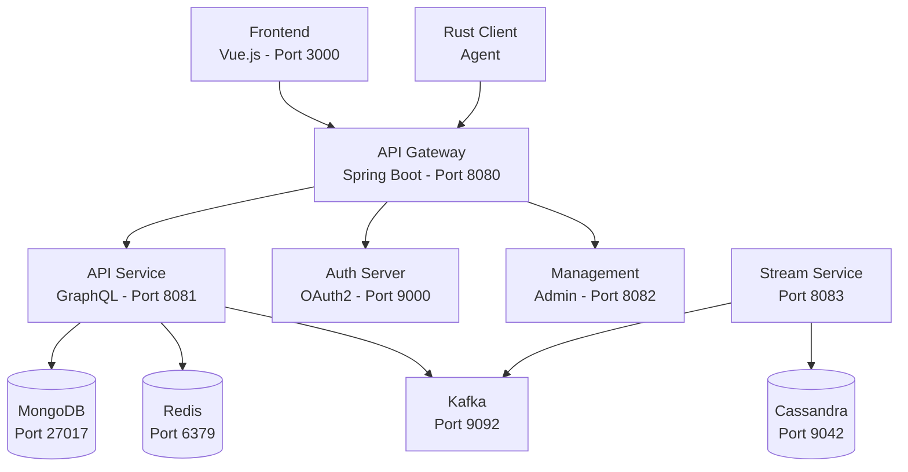

# Local Development Guide

This guide covers running OpenFrame services locally for development, debugging, and testing. Learn how to start services individually, enable hot reload, and debug effectively.

> 📋 **Prerequisites**: Complete [Environment Setup](./environment.md) before proceeding.

## Quick Start

### Start All Services

Use the provided platform scripts for fastest startup:

```bash
# macOS
./scripts/run-mac.sh --development

# Linux  
./scripts/run-linux.sh --development

# Windows PowerShell
./scripts/run-windows.ps1 -Development
```

The `--development` flag enables:
- Hot reload for frontend changes
- Debug logging for all services
- Automatic service restart on code changes
- Source maps for easier debugging

### Start Individual Services

For focused development, start only the services you need:

```bash
# 1. Start databases first
docker compose -f integrated-tools/docker-compose.base.yml up -d

# 2. Start backend services
mvn spring-boot:run -pl openframe-gateway
mvn spring-boot:run -pl openframe-api  
mvn spring-boot:run -pl openframe-authorization-server

# 3. Start frontend with hot reload
cd openframe/services/openframe-frontend
npm run dev
```

## Service Architecture & Dependencies

Understanding service dependencies helps with local development:



### Service Start Order

For proper startup, follow this order:

1. **Databases** (MongoDB, Redis, Kafka, Cassandra)
2. **Authorization Server** (OAuth2/OIDC provider)
3. **Core API Service** (GraphQL and business logic)
4. **API Gateway** (Routing and authentication)
5. **Management Service** (Admin tasks)
6. **Stream Service** (Event processing)
7. **Frontend** (User interface)

## Backend Development

### Running Individual Backend Services

#### API Service (Core Business Logic)

```bash
# Basic startup
mvn spring-boot:run -pl openframe-api

# With debug port (5005)
mvn spring-boot:run -pl openframe-api -Dspring-boot.run.jvmArguments="-Xdebug -Xrunjdwp:transport=dt_socket,server=y,suspend=n,address=5005"

# With development profile
mvn spring-boot:run -pl openframe-api -Dspring-boot.run.profiles=development

# With custom properties
mvn spring-boot:run -pl openframe-api -Dspring-boot.run.arguments="--server.port=8081 --logging.level.com.openframe=DEBUG"
```

**Service will be available at**: `http://localhost:8081`

**Health check**: `curl http://localhost:8081/actuator/health`

#### API Gateway (Request Routing)

```bash
# Basic startup
mvn spring-boot:run -pl openframe-gateway

# With debug and custom memory
mvn spring-boot:run -pl openframe-gateway \
  -Dspring-boot.run.jvmArguments="-Xmx1g -Xdebug -Xrunjdwp:transport=dt_socket,server=y,suspend=n,address=5006"

# With specific configuration
mvn spring-boot:run -pl openframe-gateway \
  -Dspring-boot.run.arguments="--server.port=8080 --openframe.api.url=http://localhost:8081"
```

**Service will be available at**: `http://localhost:8080`

#### Authorization Server (OAuth2/OIDC)

```bash
# Basic startup
mvn spring-boot:run -pl openframe-authorization-server

# With debug
mvn spring-boot:run -pl openframe-authorization-server \
  -Dspring-boot.run.jvmArguments="-Xdebug -Xrunjdwp:transport=dt_socket,server=y,suspend=n,address=5007"
```

**Service will be available at**: `http://localhost:9000`

### Development Configuration

Create service-specific development configurations:

#### API Service Development Config

```yaml
# openframe/services/openframe-api/src/main/resources/application-development.yml
spring:
  profiles: development
  
  # Database configuration
  data:
    mongodb:
      uri: mongodb://localhost:27017/openframe_dev
      auto-index-creation: true
      
  # Redis configuration  
  redis:
    host: localhost
    port: 6379
    database: 1
    
  # Kafka configuration
  kafka:
    bootstrap-servers: localhost:9092
    consumer:
      group-id: openframe-api-dev
      auto-offset-reset: earliest
    producer:
      value-serializer: org.springframework.kafka.support.serializer.JsonSerializer

# Logging configuration
logging:
  level:
    com.openframe: DEBUG
    org.springframework.web: DEBUG
    org.springframework.security: DEBUG
    org.springframework.data.mongodb: DEBUG
  pattern:
    console: "%d{HH:mm:ss.SSS} [%thread] %-5level %logger{36} - %msg%n"

# GraphQL configuration
dgs:
  graphql:
    introspection:
      enabled: true
    graphiql:
      enabled: true
      path: /graphiql

# Management endpoints
management:
  endpoints:
    web:
      exposure:
        include: health,info,metrics,prometheus
  endpoint:
    health:
      show-details: always
```

#### Gateway Development Config

```yaml
# openframe/services/openframe-gateway/src/main/resources/application-development.yml
server:
  port: 8080

# Service discovery
openframe:
  services:
    api:
      url: http://localhost:8081
    auth:
      url: http://localhost:9000
    management:
      url: http://localhost:8082

# CORS configuration for development
cors:
  allowed-origins: 
    - http://localhost:3000
    - http://localhost:5173  # Vite dev server
  allowed-methods: GET,POST,PUT,DELETE,OPTIONS
  allowed-headers: "*"
  allow-credentials: true

# JWT configuration
jwt:
  secret: dev-super-secure-jwt-secret-change-in-production
  expiration: 86400 # 24 hours
  
logging:
  level:
    com.openframe.gateway: DEBUG
    org.springframework.cloud.gateway: DEBUG
```

## Frontend Development

### Hot Reload Development

The frontend supports hot module replacement for rapid development:

```bash
cd openframe/services/openframe-frontend

# Start development server with hot reload
npm run dev

# Start with specific host/port
npm run dev -- --host 0.0.0.0 --port 3000

# Start with HTTPS (if needed for OAuth)
npm run dev -- --https
```

**Development server**: `http://localhost:3000`

### Frontend Development Configuration

```typescript
// openframe/services/openframe-frontend/vite.config.ts
import { defineConfig } from 'vite'
import vue from '@vitejs/plugin-vue'

export default defineConfig({
  plugins: [vue()],
  
  server: {
    port: 3000,
    host: true, // Allow external connections
    proxy: {
      // Proxy API requests to backend
      '/api': {
        target: 'http://localhost:8080',
        changeOrigin: true,
        secure: false
      },
      '/graphql': {
        target: 'http://localhost:8080',
        changeOrigin: true,
        secure: false
      },
      '/oauth2': {
        target: 'http://localhost:8080', 
        changeOrigin: true,
        secure: false
      }
    }
  },
  
  build: {
    sourcemap: true, // Enable source maps for development
    outDir: 'dist'
  },
  
  define: {
    // Make environment variables available
    __DEV__: JSON.stringify(true)
  }
})
```

### Environment Configuration

```bash
# openframe/services/openframe-frontend/.env.development
VITE_API_BASE_URL=http://localhost:8080
VITE_GRAPHQL_ENDPOINT=http://localhost:8080/graphql
VITE_WEBSOCKET_URL=ws://localhost:8080/ws
VITE_AUTH_URL=http://localhost:9000

# Feature flags
VITE_ENABLE_MINGO_AI=true
VITE_ENABLE_FAE_AI=false
VITE_ENABLE_DEV_TOOLS=true

# Logging
VITE_LOG_LEVEL=debug
VITE_ENABLE_CONSOLE_LOGS=true
```

## Rust Client Development

### Running the Client Agent Locally

```bash
cd clients/openframe-client

# Development build with debug symbols
cargo build

# Run with debug logging
RUST_LOG=openframe=debug cargo run

# Run with specific configuration
cargo run -- --config ./config/development.toml

# Run tests
cargo test

# Run tests with output
cargo test -- --nocapture

# Watch for changes (requires cargo-watch)
cargo watch -x run
```

### Client Development Configuration

```toml
# clients/openframe-client/config/development.toml
[server]
url = "http://localhost:8080"
api_key = "dev-api-key"
timeout_seconds = 30

[logging]
level = "debug"
target = "console"

[agent]
heartbeat_interval_seconds = 30
data_collection_interval_seconds = 60
max_retries = 3

[features]
enable_file_monitoring = true
enable_process_monitoring = true
enable_network_monitoring = false
```

## Hot Reload & Auto-Restart

### Backend Hot Reload (Spring Boot DevTools)

Add DevTools dependency for automatic restarts:

```xml
<!-- pom.xml in each service -->
<dependencies>
  <dependency>
    <groupId>org.springframework.boot</groupId>
    <artifactId>spring-boot-devtools</artifactId>
    <scope>runtime</scope>
    <optional>true</optional>
  </dependency>
</dependencies>
```

Then run with IDE or:
```bash
mvn spring-boot:run -pl openframe-api
```

Changes to Java files will automatically trigger service restart.

### Frontend Hot Reload

Vue 3 with Vite provides built-in hot module replacement:

```bash
npm run dev  # Automatically watches for changes
```

Changes to `.vue`, `.ts`, or `.css` files will be immediately reflected in the browser.

### Rust Development Watch

```bash
# Install cargo-watch if not already installed
cargo install cargo-watch

# Watch for changes and recompile
cargo watch -x build

# Watch and run
cargo watch -x run

# Watch and test
cargo watch -x test
```

## Debugging

### Java Service Debugging

#### IntelliJ IDEA

1. **Create Remote Debug Configuration**:
   - Run → Edit Configurations → Add New → Remote JVM Debug
   - Host: `localhost`
   - Port: `5005` (or service-specific port)
   - Module: Select the service module

2. **Start Service with Debug**:
   ```bash
   mvn spring-boot:run -pl openframe-api \
     -Dspring-boot.run.jvmArguments="-Xdebug -Xrunjdwp:transport=dt_socket,server=y,suspend=n,address=5005"
   ```

3. **Attach Debugger**: Run the remote debug configuration

#### VSCode

1. **Create Launch Configuration** (`.vscode/launch.json`):
   ```json
   {
     "version": "0.2.0",
     "configurations": [
       {
         "type": "java",
         "name": "Debug API Service",
         "request": "attach",
         "hostName": "localhost",
         "port": 5005
       }
     ]
   }
   ```

2. **Start with Debug** and attach

### Frontend Debugging

#### Browser DevTools

- **Vue DevTools**: Install the browser extension for Vue 3 debugging
- **Network Tab**: Monitor API requests and responses
- **Console**: Check for JavaScript errors and logs

#### VSCode Debugging

```json
// .vscode/launch.json
{
  "type": "chrome",
  "request": "launch", 
  "name": "Debug Frontend",
  "url": "http://localhost:3000",
  "webRoot": "${workspaceFolder}/openframe/services/openframe-frontend/src",
  "sourceMapPathOverrides": {
    "webpack:///src/*": "${webRoot}/*"
  }
}
```

### Rust Client Debugging

#### Command Line

```bash
# Debug build
cargo build

# Run with debugger-friendly settings
RUST_BACKTRACE=1 RUST_LOG=openframe=debug cargo run

# Use GDB (Linux/macOS)
gdb target/debug/openframe-client

# Use LLDB (macOS preferred)
lldb target/debug/openframe-client
```

#### VSCode Debugging

```json
// .vscode/launch.json
{
  "type": "lldb",
  "request": "launch",
  "name": "Debug Rust Client",
  "program": "${workspaceFolder}/clients/openframe-client/target/debug/openframe-client",
  "cwd": "${workspaceFolder}/clients/openframe-client",
  "args": [],
  "env": {
    "RUST_LOG": "openframe=debug"
  }
}
```

## Database Management

### Development Databases

#### MongoDB

```bash
# Connect to development database
mongosh mongodb://localhost:27017/openframe_dev

# Common operations
use openframe_dev
db.users.find()  # View users
db.devices.find() # View devices
db.organizations.find() # View organizations

# Reset database
db.dropDatabase()
```

#### Redis

```bash
# Connect to Redis
redis-cli -n 1  # Development database 1

# View keys
KEYS *

# Clear database
FLUSHDB
```

#### Reset All Databases

```bash
# Script to reset all development databases
#!/bin/bash
# scripts/reset-dev-db.sh

echo "🗑️  Resetting development databases..."

# Stop services
docker compose -f integrated-tools/docker-compose.base.yml down

# Remove volumes
docker volume rm $(docker volume ls -q | grep -E "(mongo|redis|kafka|cassandra)") 2>/dev/null || true

# Start fresh
docker compose -f integrated-tools/docker-compose.base.yml up -d

# Wait for startup
sleep 30

echo "✅ Development databases reset complete!"
```

### Test Data Generation

Create development test data:

```bash
# Java test data generator
mvn exec:java -Dexec.mainClass="com.openframe.TestDataGenerator" -pl openframe-api

# Or run specific data generators
curl -X POST http://localhost:8081/dev/generate-test-data
```

## Performance Profiling

### Java Service Profiling

```bash
# Start with JProfiler agent
mvn spring-boot:run -pl openframe-api \
  -Dspring-boot.run.jvmArguments="-agentpath:/path/to/jprofiler/bin/linux-x64/libjprofilerti.so=port=8849"

# Start with YourKit agent  
mvn spring-boot:run -pl openframe-api \
  -Dspring-boot.run.jvmArguments="-agentpath:/path/to/yourkit/bin/linux-x86-64/libyjpagent.so"

# Enable JFR (Java Flight Recorder)
mvn spring-boot:run -pl openframe-api \
  -Dspring-boot.run.jvmArguments="-XX:+FlightRecorder -XX:StartFlightRecording=duration=60s,filename=profile.jfr"
```

### Frontend Performance

```bash
# Build with bundle analysis
npm run build -- --analyze

# Lighthouse performance testing
npx lighthouse http://localhost:3000 --output html --output-path ./lighthouse-report.html
```

## Common Development Tasks

### Adding a New API Endpoint

1. **Create GraphQL Schema** (`src/main/resources/schema/`):
   ```graphql
   type Query {
     getMyNewData(input: MyInput!): MyResponse
   }
   ```

2. **Implement DataFetcher**:
   ```java
   @DgsComponent
   public class MyDataFetcher {
     @DgsQuery
     public MyResponse getMyNewData(@InputArgument MyInput input) {
       // Implementation
     }
   }
   ```

3. **Test the Endpoint**:
   ```bash
   curl -X POST http://localhost:8080/graphql \
     -H "Content-Type: application/json" \
     -d '{"query": "query { getMyNewData(input: {}) { id } }"}'
   ```

### Adding a New Frontend Component

1. **Create Vue Component**:
   ```vue
   <!-- src/components/MyNewComponent.vue -->
   <template>
     <div class="my-component">
       <h2>{{ title }}</h2>
     </div>
   </template>
   
   <script setup lang="ts">
   interface Props {
     title: string
   }
   
   defineProps<Props>()
   </script>
   ```

2. **Add Route** (if needed):
   ```typescript
   // src/router/index.ts  
   {
     path: '/my-feature',
     component: () => import('@/views/MyFeatureView.vue')
   }
   ```

3. **Use Component**:
   ```vue
   <template>
     <MyNewComponent title="Hello World" />
   </template>
   ```

## Troubleshooting

### Common Issues

| Problem | Solution |
|---------|----------|
| **Port already in use** | `lsof -ti:8080 \| xargs kill -9` |
| **Database connection failed** | Check if containers are running: `docker ps` |
| **Frontend proxy errors** | Verify backend services are running |
| **Maven build fails** | Clear cache: `mvn clean` |
| **npm install fails** | Delete `node_modules` and `package-lock.json` |

### Service Health Checks

```bash
# Check all services
curl http://localhost:8080/actuator/health  # Gateway
curl http://localhost:8081/actuator/health  # API  
curl http://localhost:9000/actuator/health  # Auth
curl http://localhost:3000                  # Frontend
```

### Log Locations

```bash
# Spring Boot logs (if file logging enabled)
tail -f logs/openframe-api.log
tail -f logs/openframe-gateway.log

# Docker container logs
docker logs openframe-mongodb
docker logs openframe-redis

# Frontend dev server logs
# Console output from npm run dev
```

## Next Steps

With local development running smoothly:

1. **[Understand the Architecture](../architecture/overview.md)** - Deep dive into system design
2. **[Run Tests](../testing/overview.md)** - Verify your changes work
3. **[Contributing Guidelines](../contributing/guidelines.md)** - Submit your improvements

---

🚀 **Pro Tip**: Use the provided scripts in `/scripts/` directory for common development tasks. They handle service dependencies and proper startup order automatically!