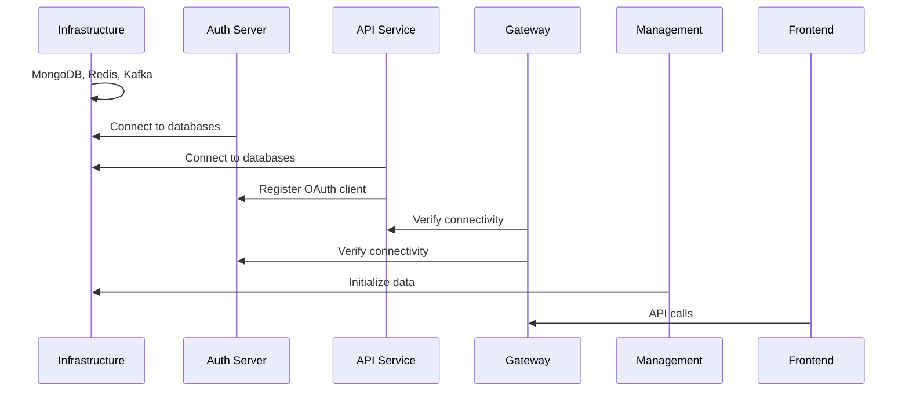

# Local Development Guide

This guide walks you through running OpenFrame locally for development, including service management, debugging, and common development workflows.

## Quick Local Development Setup

### Clone and Initial Setup

```bash
# Clone the repository
git clone https://github.com/flamingo-stack/openframe-oss-tenant.git
cd openframe-oss-tenant

# Create development environment file
cp .env.example .env
# Edit .env with your local configuration

# Build all Java services (first time only)
mvn clean install -DskipTests
```

### Start Infrastructure Services

```bash
# Start required services using Docker Compose
cd integrated-tools
docker-compose up -d mongodb redis kafka nats

# Verify services are running
docker-compose ps
```

### Start OpenFrame Services

Choose your preferred method:

**Option A: Using Startup Scripts (Recommended)**

```bash
# macOS
./scripts/run-mac.sh --dev

# Linux
./scripts/run-linux.sh --dev

# Windows PowerShell
./scripts/run-windows.ps1 -Development
```

**Option B: Manual Service Startup**

```bash
# Terminal 1: Gateway Service
cd openframe/services/openframe-gateway
mvn spring-boot:run

# Terminal 2: API Service
cd openframe/services/openframe-api
mvn spring-boot:run

# Terminal 3: Authorization Server
cd openframe/services/openframe-authorization-server
mvn spring-boot:run

# Terminal 4: Management Service
cd openframe/services/openframe-management
mvn spring-boot:run

# Terminal 5: Frontend
cd openframe/services/openframe-frontend
npm install
npm run dev
```

## Service Architecture for Development

### Service Startup Order

Start services in this order to avoid dependency issues:



### Service Ports & URLs

| Service | Development Port | URL | Purpose |
|---------|------------------|-----|---------|
| **Frontend** | 3000 | http://localhost:3000 | Main UI application |
| **Gateway** | 8080 | http://localhost:8080 | API Gateway & routing |
| **API Service** | 8081 | http://localhost:8081 | GraphQL & REST APIs |
| **Auth Server** | 8082 | http://localhost:8082 | OAuth2/OIDC authentication |
| **Client Service** | 8083 | http://localhost:8083 | Agent management |
| **Management** | 8084 | http://localhost:8084 | Admin & lifecycle management |
| **Stream Service** | 8085 | http://localhost:8085 | Event stream processing |
| **External API** | 8086 | http://localhost:8086 | External API facade |

### Infrastructure Services

| Service | Port | URL | Credentials |
|---------|------|-----|-------------|
| **MongoDB** | 27017 | mongodb://localhost:27017 | No auth in development |
| **Redis** | 6379 | redis://localhost:6379 | No auth in development |
| **Kafka** | 9092 | localhost:9092 | No auth in development |
| **NATS** | 4222 | nats://localhost:4222 | No auth in development |
| **Zookeeper** | 2181 | localhost:2181 | For Kafka coordination |

## Development Modes & Profiles

### Spring Boot Profiles

OpenFrame uses Spring profiles for different development scenarios:

```bash
# Development profile (default)
SPRING_PROFILES_ACTIVE=dev

# Development with debug logging
SPRING_PROFILES_ACTIVE=dev,debug

# Development with sample data
SPRING_PROFILES_ACTIVE=dev,sample-data

# Development with external tool integration
SPRING_PROFILES_ACTIVE=dev,integration

# Local testing profile
SPRING_PROFILES_ACTIVE=test,local
```

### Environment-Specific Configuration

**Development (.env)**:
```bash
OPENFRAME_ENV=development
LOG_LEVEL=DEBUG
ENABLE_CORS=true
DISABLE_CSRF=true
ENABLE_DEV_TOOLS=true
```

**Testing (.env.test)**:
```bash
OPENFRAME_ENV=test
LOG_LEVEL=INFO
MONGODB_URI=mongodb://localhost:27017/openframe_test
REDIS_URL=redis://localhost:6379/1
```

## Hot Reload & Live Development

### Backend Hot Reload (Spring Boot DevTools)

Spring Boot DevTools is configured for automatic restart:

```xml
<!-- Already included in OpenFrame services -->
<dependency>
    <groupId>org.springframework.boot</groupId>
    <artifactId>spring-boot-devtools</artifactId>
    <scope>runtime</scope>
    <optional>true</optional>
</dependency>
```

**How it works:**
- **Code changes**: Automatic restart when Java files change
- **Resource changes**: Live reload for templates, static files
- **Configuration changes**: Restart when properties change

**Trigger restart manually:**
```bash
# Touch a file to trigger restart
touch src/main/resources/application.yml
```

### Frontend Hot Module Replacement (HMR)

Vue.js frontend with Vite HMR:

```typescript
// vite.config.ts - already configured
export default defineConfig({
  server: {
    hmr: {
      overlay: true,    // Show errors in browser overlay
      clientPort: 3000  // HMR websocket port
    }
  }
})
```

**Features:**
- **Component changes**: Instant updates without page refresh
- **Style changes**: CSS updates in real-time
- **State preservation**: Component state maintained during updates

### Database Changes

For schema or data changes during development:

```bash
# Reset development database
./scripts/reset-dev-db.sh

# Load sample data
./scripts/load-sample-data.sh

# Manual database operations
docker-compose exec mongodb mongosh openframe
```

## Debugging Setup

### Backend Debugging

**IntelliJ IDEA Debug Configuration:**

1. **Create Debug Configuration**:
   - Run → Edit Configurations → + → Spring Boot
   - Name: "Debug OpenFrame API"
   - Main class: `com.openframe.api.ApiApplication`
   - Program arguments: `--spring.profiles.active=dev,debug`

2. **Set Breakpoints**: Click on line numbers to set breakpoints

3. **Debug Mode**: Click the bug icon instead of run icon

**VS Code Java Debugging:**

```json
// .vscode/launch.json
{
  "version": "0.2.0",
  "configurations": [
    {
      "name": "Debug API Service",
      "type": "java",
      "request": "launch",
      "mainClass": "com.openframe.api.ApiApplication",
      "vmArgs": "-Dspring.profiles.active=dev,debug",
      "console": "integratedTerminal"
    }
  ]
}
```

### Frontend Debugging

**Browser DevTools:**
- Vue.js DevTools extension for Chrome/Firefox
- Network tab for API call inspection
- Console for JavaScript debugging

**VS Code Debugging:**
```json
// .vscode/launch.json
{
  "name": "Debug Frontend",
  "type": "node",
  "request": "launch",
  "program": "${workspaceFolder}/openframe/services/openframe-frontend/node_modules/.bin/vite",
  "args": ["--mode", "development"],
  "console": "integratedTerminal",
  "cwd": "${workspaceFolder}/openframe/services/openframe-frontend"
}
```

### Remote Debugging

For debugging services running in containers:

```bash
# Run service with debug port exposed
JAVA_OPTS="-agentlib:jdwp=transport=dt_socket,server=y,suspend=n,address=*:5005" \
mvn spring-boot:run

# Connect IDE to localhost:5005
```

## Log Monitoring & Analysis

### Service Logs

**View logs in real-time:**

```bash
# All service logs
tail -f openframe/services/*/logs/*.log

# Specific service
tail -f openframe/services/openframe-api/logs/application.log

# Docker service logs
docker-compose logs -f mongodb redis kafka
```

**Log Configuration:**

```yaml
# application-dev.yml
logging:
  level:
    com.openframe: DEBUG
    org.springframework.security: DEBUG
    org.springframework.web: DEBUG
  pattern:
    file: "%d{yyyy-MM-dd HH:mm:ss} [%thread] %-5level %logger{36} - %msg%n"
    console: "%d{HH:mm:ss.SSS} [%thread] %-5level %logger{36} - %msg%n"
```

### Structured Logging

OpenFrame uses structured JSON logging in production-like profiles:

```json
{
  "timestamp": "2024-01-15T10:30:00.000Z",
  "level": "INFO",
  "service": "openframe-api",
  "logger": "com.openframe.api.controller.DeviceController",
  "message": "Device query executed",
  "context": {
    "userId": "user123",
    "tenantId": "tenant456",
    "deviceCount": 42
  }
}
```

## Database Management

### MongoDB Development Operations

```bash
# Connect to MongoDB
docker-compose exec mongodb mongosh openframe

# Useful queries for development
db.users.find().pretty()
db.devices.find({status: "ONLINE"}).count()
db.logs.find().sort({timestamp: -1}).limit(10)

# Reset collections
db.devices.drop()
db.organizations.drop()

# Create indexes for development
db.logs.createIndex({timestamp: -1})
db.devices.createIndex({organizationId: 1, status: 1})
```

### Redis Development Operations

```bash
# Connect to Redis
docker-compose exec redis redis-cli

# View cached data
KEYS *
GET user:session:12345
HGETALL device:cache:device123

# Clear cache
FLUSHDB
```

### Sample Data Loading

Load realistic development data:

```bash
# Load comprehensive sample data
./scripts/load-sample-data.sh --comprehensive

# Load specific data types
./scripts/load-sample-data.sh --users --organizations
./scripts/load-sample-data.sh --devices --logs
```

## Testing During Development

### Running Tests

```bash
# Run all tests
mvn test

# Run specific test class
mvn test -Dtest=DeviceServiceTest

# Run tests for specific service
cd openframe/services/openframe-api
mvn test

# Run frontend tests
cd openframe/services/openframe-frontend
npm run test

# Run E2E tests
cd openframe-e2e-tests
mvn test -Dtest=DevicesTest
```

### Test Profiles

Different test configurations:

```bash
# Unit tests only (fast)
mvn test -Dspring.profiles.active=test,unit

# Integration tests with embedded databases
mvn test -Dspring.profiles.active=test,integration

# E2E tests against local services
mvn test -Dspring.profiles.active=test,e2e
```

### Test Data Management

```bash
# Create test data
./scripts/create-test-data.sh

# Clean test data
./scripts/clean-test-data.sh

# Reset test databases
./scripts/reset-test-db.sh
```

## Performance Monitoring

### JVM Monitoring

**Using JConsole:**
```bash
# Enable JMX (add to JVM args)
-Dcom.sun.management.jmxremote.port=1099
-Dcom.sun.management.jmxremote.authenticate=false
-Dcom.sun.management.jmxremote.ssl=false

# Connect JConsole to localhost:1099
jconsole
```

**Using Application Metrics:**

```bash
# Service health and metrics endpoints
curl http://localhost:8081/actuator/health
curl http://localhost:8081/actuator/metrics
curl http://localhost:8081/actuator/info

# Custom business metrics
curl http://localhost:8081/actuator/metrics/openframe.devices.count
curl http://localhost:8081/actuator/metrics/openframe.api.requests
```

### Database Performance

```bash
# MongoDB slow query profiler
docker-compose exec mongodb mongosh openframe
db.setProfilingLevel(2, { slowms: 100 })
db.system.profile.find().sort({ts: -1}).limit(5)

# Check database statistics
db.stats()
db.devices.stats()
```

## Common Development Workflows

### Adding a New Feature

1. **Create Feature Branch**:
```bash
git checkout -b feature/new-device-management
```

2. **Backend Changes**:
```bash
# Add service methods
# Update DTOs and mappers
# Add tests
mvn test -Dtest=*DeviceService*
```

3. **Frontend Changes**:
```bash
cd openframe/services/openframe-frontend
# Add Vue components
# Update router
# Add API calls
npm run test:unit
```

4. **Integration Testing**:
```bash
# Start all services
./scripts/run-mac.sh --dev
# Test in browser
# Run E2E tests
```

### Debugging Issues

1. **Check Service Status**:
```bash
curl http://localhost:8080/actuator/health
curl http://localhost:8081/actuator/health
```

2. **Review Logs**:
```bash
# Check for errors
grep ERROR openframe/services/*/logs/*.log
# Check specific service
tail -f openframe/services/openframe-api/logs/application.log
```

3. **Verify Database State**:
```bash
docker-compose exec mongodb mongosh openframe
db.users.findOne()
db.devices.find({status: "ERROR"})
```

4. **Network Debugging**:
```bash
# Check service connectivity
curl -v http://localhost:8081/actuator/health
# Check frontend API calls in browser devtools
```

## Troubleshooting Common Issues

### Service Won't Start

```bash
# Check if port is in use
lsof -i :8081
netstat -tulpn | grep :8081

# Kill process using port
kill -9 $(lsof -ti:8081)

# Check Java version
java -version  # Should be 21+

# Verify dependencies
mvn dependency:tree -Dverbose
```

### Build Issues

```bash
# Clean and rebuild
mvn clean install -DskipTests

# Clear Maven cache
rm -rf ~/.m2/repository/com/openframe

# Check Maven settings
mvn help:effective-settings
```

### Database Connection Issues

```bash
# Verify MongoDB is running
docker-compose ps mongodb
docker-compose logs mongodb

# Test connection
mongosh "mongodb://localhost:27017/openframe"

# Restart database
docker-compose restart mongodb
```

### Frontend Issues

```bash
# Clear node modules
rm -rf node_modules package-lock.json
npm install

# Check Node version
node -v  # Should be 18+

# Verify Vite config
npm run build --verbose
```

---

*🚀 **Local development environment is ready!** Continue to [Architecture Overview](../architecture/overview.md) to understand the system design and components.*