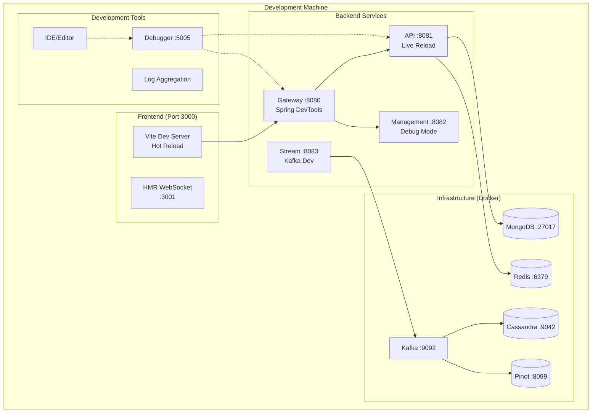

# Local Development Guide

This comprehensive guide covers running OpenFrame locally for development purposes, including hot reload configuration, debugging setup, and development workflow optimization.

## Quick Development Start

For experienced developers, here's the fastest path to a running development environment:

```bash
# Clone and setup
git clone https://github.com/flamingo-run/openframe.git
cd openframe
export GITHUB_TOKEN="your_token_here"

# Start infrastructure
docker compose -f docker-compose.infrastructure.yml up -d

# Build and start services
mvn clean install -DskipTests
./scripts/dev-start-all.sh

# Start frontend with hot reload
cd openframe/services/openframe-frontend
npm install && npm run dev
```

Expected result: All services running with hot reload capabilities within 5-10 minutes.

## Development Architecture

### Local Development Stack



### Hot Reload Configuration

OpenFrame supports comprehensive hot reload for rapid development:

| Component | Reload Type | Configuration |
|-----------|-------------|---------------|
| **Vue Frontend** | ✅ Full HMR | Vite dev server with instant updates |
| **Java Services** | ✅ Spring DevTools | Class and configuration auto-reload |
| **GraphQL Schema** | ✅ Live reload | DGS schema monitoring |
| **Configuration** | ✅ Spring Cloud | Property refresh without restart |
| **Static Assets** | ✅ Instant | Vite asset pipeline |
| **Rust Client** | ❌ Full rebuild | Cargo watch for auto-rebuild |

## Infrastructure Setup

### Docker Infrastructure Stack

Start the required infrastructure services:

```bash
# Create infrastructure-only compose file
cat > docker-compose.infrastructure.yml << 'EOF'
version: '3.8'

services:
  mongodb:
    image: mongo:7-jammy
    ports:
      - "27017:27017"
    environment:
      - MONGO_INITDB_DATABASE=openframe
    volumes:
      - mongodb_data:/data/db
      - ./scripts/docker/mongodb/init.js:/docker-entrypoint-initdb.d/init.js
    command: mongod --replSet rs0 --bind_ip_all
    healthcheck:
      test: ["CMD", "mongosh", "--eval", "db.admin.command('ismaster')"]
      interval: 30s
      timeout: 10s
      retries: 5
      
  redis:
    image: redis:7-alpine
    ports:
      - "6379:6379"
    volumes:
      - redis_data:/data
    command: redis-server --appendonly yes --maxmemory 1gb --maxmemory-policy allkeys-lru
    healthcheck:
      test: ["CMD", "redis-cli", "ping"]
      interval: 30s
      timeout: 10s
      retries: 3

  kafka:
    image: confluentinc/cp-kafka:7.4.0
    ports:
      - "9092:9092"
      - "9101:9101"
    environment:
      KAFKA_BROKER_ID: 1
      KAFKA_LISTENER_SECURITY_PROTOCOL_MAP: PLAINTEXT:PLAINTEXT,PLAINTEXT_HOST:PLAINTEXT
      KAFKA_ADVERTISED_LISTENERS: PLAINTEXT://localhost:9092,PLAINTEXT_HOST://localhost:9092
      KAFKA_OFFSETS_TOPIC_REPLICATION_FACTOR: 1
      KAFKA_TRANSACTION_STATE_LOG_MIN_ISR: 1
      KAFKA_TRANSACTION_STATE_LOG_REPLICATION_FACTOR: 1
      KAFKA_GROUP_INITIAL_REBALANCE_DELAY_MS: 0
      KAFKA_AUTO_CREATE_TOPICS_ENABLE: 'true'
      KAFKA_LOG_RETENTION_HOURS: 24
      KAFKA_LOG_SEGMENT_BYTES: 1073741824
      KAFKA_ZOOKEEPER_CONNECT: zookeeper:2181
    volumes:
      - kafka_data:/var/lib/kafka/data
    depends_on:
      - zookeeper
      
  zookeeper:
    image: confluentinc/cp-zookeeper:7.4.0
    ports:
      - "2181:2181"
    environment:
      ZOOKEEPER_CLIENT_PORT: 2181
      ZOOKEEPER_TICK_TIME: 2000
    volumes:
      - zookeeper_data:/var/lib/zookeeper/data

  cassandra:
    image: cassandra:4.1
    ports:
      - "9042:9042"
    environment:
      - CASSANDRA_CLUSTER_NAME=openframe-cluster
      - CASSANDRA_ENDPOINT_SNITCH=GossipingPropertyFileSnitch
      - MAX_HEAP_SIZE=2G
      - HEAP_NEWSIZE=400M
    volumes:
      - cassandra_data:/var/lib/cassandra
      - ./scripts/docker/cassandra/init.cql:/docker-entrypoint-initdb.d/init.cql
    healthcheck:
      test: ["CMD-SHELL", "[ $$(nodetool statusgossip) = running ]"]
      interval: 30s
      timeout: 10s
      retries: 5

  pinot-controller:
    image: apachepinot/pinot:1.2.0
    ports:
      - "9000:9000"
    command: StartController -zkAddress zookeeper:2181
    environment:
      JAVA_OPTS: "-Dplugins.dir=/opt/pinot/plugins -Xmx1G -XX:+UseG1GC"
    depends_on:
      - zookeeper

  pinot-broker:
    image: apachepinot/pinot:1.2.0
    ports:
      - "8099:8099"
    command: StartBroker -zkAddress zookeeper:2181
    environment:
      JAVA_OPTS: "-Dplugins.dir=/opt/pinot/plugins -Xmx1G -XX:+UseG1GC"
    depends_on:
      - pinot-controller

volumes:
  mongodb_data:
  redis_data:
  kafka_data:
  zookeeper_data:
  cassandra_data:
EOF

# Start infrastructure
docker compose -f docker-compose.infrastructure.yml up -d

# Wait for services to be healthy (2-3 minutes)
echo "Waiting for infrastructure services to start..."
sleep 30

# Verify services are running
docker compose -f docker-compose.infrastructure.yml ps
```

### Database Initialization

Initialize development data:

```bash
# MongoDB setup script
cat > scripts/docker/mongodb/init.js << 'EOF'
// Initialize replica set
rs.initiate({
  _id: "rs0",
  members: [{ _id: 0, host: "localhost:27017" }]
});

// Create development user
use openframe;
db.createUser({
  user: "openframe",
  pwd: "development",
  roles: ["readWrite"]
});

// Create sample data collections
db.organizations.insertMany([
  {
    name: "Demo MSP",
    domain: "demo.msp",
    createdAt: new Date(),
    status: "ACTIVE"
  }
]);

db.users.insertMany([
  {
    email: "admin@demo.msp",
    password: "$2a$10$encrypted_password_here",
    role: "ADMIN",
    organizationId: ObjectId(),
    createdAt: new Date()
  }
]);
EOF

# Cassandra keyspace setup
cat > scripts/docker/cassandra/init.cql << 'EOF'
CREATE KEYSPACE IF NOT EXISTS openframe
WITH REPLICATION = {
  'class': 'SimpleStrategy',
  'replication_factor': 1
};

USE openframe;

CREATE TABLE IF NOT EXISTS device_metrics (
  device_id UUID,
  timestamp TIMESTAMP,
  metric_name TEXT,
  metric_value DOUBLE,
  PRIMARY KEY (device_id, timestamp, metric_name)
) WITH CLUSTERING ORDER BY (timestamp DESC);

CREATE TABLE IF NOT EXISTS log_events (
  event_id UUID PRIMARY KEY,
  device_id UUID,
  timestamp TIMESTAMP,
  level TEXT,
  message TEXT,
  source TEXT
);
EOF
```

## Service Development

### Backend Services Configuration

#### Development Application Properties

Create `application-development.yml` for each service:

```yaml
# openframe-api/src/main/resources/application-development.yml
server:
  port: 8081
  
spring:
  devtools:
    restart:
      enabled: true
      additional-paths:
        - src/main/graphql
    livereload:
      enabled: true
  data:
    mongodb:
      uri: mongodb://localhost:27017/openframe
  redis:
    host: localhost
    port: 6379
    database: 0
  kafka:
    bootstrap-servers: localhost:9092
    consumer:
      group-id: openframe-api-dev
      auto-offset-reset: earliest
    producer:
      key-serializer: org.apache.kafka.common.serialization.StringSerializer
      value-serializer: org.springframework.kafka.support.serializer.JsonSerializer

logging:
  level:
    com.openframe: DEBUG
    org.springframework.web: DEBUG
    org.springframework.security: DEBUG
  pattern:
    console: "%clr(%d{yyyy-MM-dd HH:mm:ss.SSS}){faint} %clr(%5p) %clr(${PID:- }){magenta} %clr(---){faint} %clr([%15.15t]){faint} %clr(%-40.40logger{39}){cyan} %clr(:){faint} %m%n%wEx"

management:
  endpoints:
    web:
      exposure:
        include: health,metrics,info,refresh,env
  endpoint:
    health:
      show-details: always
    refresh:
      enabled: true

jwt:
  secret: development-jwt-secret-key
  expiration: 86400000  # 24 hours for development

graphql:
  dgs:
    reload:
      enabled: true
    introspection:
      enabled: true
```

#### Service Startup Scripts

Create individual service startup scripts:

```bash
# scripts/dev-start-api.sh
#!/bin/bash
echo "🚀 Starting OpenFrame API Service (Development Mode)"

cd "$(dirname "$0")/../openframe/services/openframe-api"

export SPRING_PROFILES_ACTIVE=development
export JAVA_OPTS="-Xmx2g -Xms1g -agentlib:jdwp=transport=dt_socket,server=y,suspend=n,address=5005"

mvn spring-boot:run \
  -Dspring-boot.run.arguments="--spring.profiles.active=development" \
  -Dspring-boot.run.jvmArguments="$JAVA_OPTS"
```

```bash
# scripts/dev-start-gateway.sh  
#!/bin/bash
echo "🌐 Starting OpenFrame Gateway Service (Development Mode)"

cd "$(dirname "$0")/../openframe/services/openframe-gateway"

export SPRING_PROFILES_ACTIVE=development
export JAVA_OPTS="-Xmx1g -Xms512m -agentlib:jdwp=transport=dt_socket,server=y,suspend=n,address=5006"

mvn spring-boot:run \
  -Dspring-boot.run.arguments="--spring.profiles.active=development" \
  -Dspring-boot.run.jvmArguments="$JAVA_OPTS"
```

```bash
# scripts/dev-start-all.sh
#!/bin/bash
echo "🎯 Starting All OpenFrame Services for Development"

# Function to start service in background
start_service() {
    local service_name=$1
    local script_path=$2
    local log_file="logs/${service_name}.log"
    
    echo "Starting $service_name..."
    mkdir -p logs
    bash "$script_path" > "$log_file" 2>&1 &
    local pid=$!
    echo "$pid" > "logs/${service_name}.pid"
    echo "✅ $service_name started (PID: $pid, Log: $log_file)"
}

# Start services in dependency order
start_service "api" "./scripts/dev-start-api.sh"
sleep 10  # Wait for API to start before starting gateway

start_service "gateway" "./scripts/dev-start-gateway.sh"
sleep 5

start_service "management" "./scripts/dev-start-management.sh"
start_service "stream" "./scripts/dev-start-stream.sh"

echo "🎉 All services started! Check logs/ directory for individual service logs"
echo "📊 API: http://localhost:8081/graphql"
echo "🌐 Gateway: http://localhost:8080"

# Make scripts executable
chmod +x scripts/dev-start-*.sh
```

### Frontend Development

#### Hot Module Replacement Setup

Configure Vite for optimal development experience:

```typescript
// openframe/services/openframe-frontend/vite.config.ts
import { defineConfig } from 'vite'
import vue from '@vitejs/plugin-vue'
import { resolve } from 'path'

export default defineConfig({
  plugins: [
    vue({
      template: {
        compilerOptions: {
          isCustomElement: (tag) => tag.startsWith('ion-')
        }
      }
    })
  ],
  
  server: {
    port: 3000,
    host: true,
    hmr: {
      port: 3001,
      host: 'localhost'
    },
    proxy: {
      '/api': {
        target: 'http://localhost:8080',
        changeOrigin: true,
        secure: false
      },
      '/graphql': {
        target: 'http://localhost:8080',
        changeOrigin: true,
        secure: false,
        ws: true  // Enable WebSocket proxy for GraphQL subscriptions
      }
    }
  },
  
  resolve: {
    alias: {
      '@': resolve(__dirname, 'src'),
      '@components': resolve(__dirname, 'src/components'),
      '@views': resolve(__dirname, 'src/views'),
      '@stores': resolve(__dirname, 'src/stores'),
      '@services': resolve(__dirname, 'src/services'),
      '@types': resolve(__dirname, 'src/types')
    }
  },
  
  build: {
    sourcemap: true,
    rollupOptions: {
      output: {
        manualChunks: {
          vendor: ['vue', 'vue-router', 'pinia'],
          ui: ['primevue', '@primevue/themes']
        }
      }
    }
  },
  
  optimizeDeps: {
    include: [
      'vue',
      'vue-router',
      'pinia',
      '@vue/apollo-composable',
      'graphql'
    ]
  }
})
```

#### Development Environment Configuration

```typescript
// openframe/services/openframe-frontend/src/config/environment.ts
export const environment = {
  production: false,
  development: true,
  
  api: {
    baseUrl: 'http://localhost:8080',
    graphql: 'http://localhost:8080/graphql',
    websocket: 'ws://localhost:8080/graphql'
  },
  
  features: {
    devTools: true,
    mockData: false,
    debugMode: true,
    hotReload: true
  },
  
  logging: {
    level: 'DEBUG',
    console: true,
    remote: false
  }
}

// Auto-detect development mode
if (import.meta.env.DEV) {
  console.log('🔧 OpenFrame Development Mode Active')
  console.log('📊 GraphQL Playground:', environment.api.graphql)
  console.log('🔄 Hot Reload: Enabled')
}
```

#### Package Scripts for Development

```json
{
  "name": "openframe-frontend",
  "scripts": {
    "dev": "vite --host --port 3000",
    "dev:debug": "vite --host --port 3000 --debug",
    "build": "vite build",
    "build:dev": "vite build --mode development",
    "preview": "vite preview",
    "type-check": "vue-tsc --noEmit",
    "test:unit": "vitest run",
    "test:watch": "vitest",
    "lint": "eslint src --ext .vue,.ts,.tsx",
    "lint:fix": "eslint src --ext .vue,.ts,.tsx --fix",
    "format": "prettier --write src/",
    "generate:types": "graphql-codegen --config codegen.yml"
  },
  "dependencies": {
    "vue": "^3.4.0",
    "vue-router": "^4.2.5",
    "pinia": "^2.1.7",
    "@vue/apollo-composable": "^4.0.0",
    "primevue": "^3.45.0",
    "graphql": "^16.8.1"
  },
  "devDependencies": {
    "@vitejs/plugin-vue": "^5.0.0",
    "vite": "^5.0.10",
    "typescript": "^5.3.0",
    "vue-tsc": "^1.8.25",
    "vitest": "^1.0.0",
    "@graphql-codegen/cli": "^5.0.0"
  }
}
```

### Rust Client Development

#### Cargo Watch for Auto-Rebuild

```bash
# Install cargo-watch
cargo install cargo-watch

# Start auto-rebuild development
cd clients/openframe-client
cargo watch -x 'run -- --dev-mode'
```

#### Development Configuration

```toml
# clients/openframe-client/Cargo.toml
[dependencies]
tokio = { version = "1.35", features = ["full"] }
serde = { version = "1.0", features = ["derive"] }
reqwest = { version = "0.11", features = ["json"] }
tracing = "0.1"
tracing-subscriber = { version = "0.3", features = ["env-filter"] }
anyhow = "1.0"

[dev-dependencies]
tokio-test = "0.4"

[features]
default = []
debug-logging = ["tracing-subscriber/fmt"]
dev-mode = ["debug-logging"]
```

## Debugging Configuration

### Java Services Debugging

#### Remote Debug Setup

Each service should expose a unique debug port:

| Service | Debug Port | JVM Args |
|---------|------------|----------|
| **API** | 5005 | `-agentlib:jdwp=transport=dt_socket,server=y,suspend=n,address=5005` |
| **Gateway** | 5006 | `-agentlib:jdwp=transport=dt_socket,server=y,suspend=n,address=5006` |
| **Management** | 5007 | `-agentlib:jdwp=transport=dt_socket,server=y,suspend=n,address=5007` |
| **Stream** | 5008 | `-agentlib:jdwp=transport=dt_socket,server=y,suspend=n,address=5008` |

#### IDE Debug Configuration

**IntelliJ IDEA**:
1. **Run** → **Edit Configurations** → **Add** → **Remote JVM Debug**
2. **Host**: `localhost`
3. **Port**: `5005` (for API service)
4. **Module**: Select appropriate service module

**VS Code**:
```json
{
  "version": "0.2.0",
  "configurations": [
    {
      "type": "java",
      "name": "Debug OpenFrame API",
      "request": "attach",
      "hostName": "localhost",
      "port": 5005,
      "projectName": "openframe-api"
    }
  ]
}
```

### Frontend Debugging

#### Vue DevTools Setup

```bash
# Install Vue DevTools browser extension
# Chrome: https://chrome.google.com/webstore/detail/vuejs-devtools/
# Firefox: https://addons.mozilla.org/en-US/firefox/addon/vue-js-devtools/
```

#### Browser Debug Configuration

```typescript
// Enable development tools in development
if (import.meta.env.DEV) {
  const app = createApp(App)
  
  // Enable Vue DevTools
  app.config.devtools = true
  
  // Global error handling for development
  app.config.errorHandler = (err, instance, info) => {
    console.error('Vue Error:', err)
    console.error('Component:', instance)
    console.error('Info:', info)
  }
  
  // Performance tracking
  app.config.performance = true
}
```

## Development Workflow

### Daily Development Process

#### Morning Setup (5 minutes)
```bash
# Pull latest changes
git pull origin main

# Start infrastructure if not running
docker compose -f docker-compose.infrastructure.yml up -d

# Check service status
curl -s http://localhost:27017 && echo "✅ MongoDB" || echo "❌ MongoDB"
curl -s http://localhost:6379 && echo "✅ Redis" || echo "❌ Redis"

# Start development servers
./scripts/dev-start-all.sh
cd openframe/services/openframe-frontend && npm run dev
```

#### Code-Commit Cycle (Continuous)
```bash
# Make changes to any service
# Changes automatically reload via:
# - Spring DevTools (Java)
# - Vite HMR (Frontend)
# - cargo-watch (Rust)

# Verify changes
curl http://localhost:8080/actuator/health
open http://localhost:3000

# Commit when ready
git add .
git commit -m "feat: add new feature"
git push origin feature/branch-name
```

#### Evening Cleanup (1 minute)
```bash
# Stop development processes
pkill -f "spring-boot:run"
pkill -f "vite"
pkill -f "cargo run"

# Keep infrastructure running for next day
# docker compose -f docker-compose.infrastructure.yml down  # Only if needed
```

### Performance Monitoring

#### Development Metrics Dashboard

Create a simple monitoring script:

```bash
#!/bin/bash
# scripts/dev-monitor.sh

echo "📊 OpenFrame Development Status"
echo "================================"

# Check service health
services=("API:8081" "Gateway:8080" "Frontend:3000")
for service in "${services[@]}"; do
    name=${service%%:*}
    port=${service##*:}
    if curl -s -f http://localhost:$port/actuator/health >/dev/null 2>&1 || 
       curl -s -f http://localhost:$port >/dev/null 2>&1; then
        echo "✅ $name (port $port) - Running"
    else
        echo "❌ $name (port $port) - Down"
    fi
done

# Check database connections
echo ""
echo "💾 Database Status"
echo "-----------------"
mongosh --eval "db.admin.ping()" --quiet openframe 2>/dev/null && echo "✅ MongoDB" || echo "❌ MongoDB"
redis-cli ping >/dev/null 2>&1 && echo "✅ Redis" || echo "❌ Redis"

# Show memory usage
echo ""
echo "🧠 Memory Usage"
echo "---------------"
ps aux | grep -E "(java|node|vite)" | grep -v grep | awk '{print $11 " - " $4 "% CPU, " $6/1024 "MB RAM"}' | sort -k3 -nr | head -5
```

### Troubleshooting Development Issues

#### Service Won't Start

```bash
# Check port conflicts
netstat -tulpn | grep -E ":(8080|8081|3000)"

# Kill conflicting processes  
sudo lsof -ti:8080 | xargs kill -9

# Clear target directories
find . -name "target" -type d -exec rm -rf {} +
mvn clean install -DskipTests
```

#### Hot Reload Not Working

```bash
# For Java services - restart with clean cache
mvn clean compile
./scripts/dev-start-api.sh

# For frontend - clear cache and reinstall
rm -rf node_modules .vite
npm install
npm run dev

# For Rust - force rebuild
cd clients/openframe-client
cargo clean
cargo build
```

#### Database Connection Issues

```bash
# Reset development databases
docker compose -f docker-compose.infrastructure.yml down -v
docker compose -f docker-compose.infrastructure.yml up -d

# Wait for initialization
sleep 60

# Verify connections
mongosh mongodb://localhost:27017/openframe --eval "db.stats()"
redis-cli -h localhost -p 6379 ping
```

## Advanced Development Features

### Live Configuration Reload

Using Spring Cloud Config for dynamic configuration updates:

```bash
# Update configuration file
echo "app.feature.new-feature=true" >> openframe-api/src/main/resources/application-development.yml

# Trigger configuration refresh
curl -X POST http://localhost:8081/actuator/refresh

# Verify change applied
curl http://localhost:8081/actuator/configprops | jq '.app.feature'
```

### GraphQL Schema Hot Reload

```bash
# Modify schema file
vim openframe-api/src/main/resources/schema/schema.graphqls

# Schema automatically reloads via DGS
# Verify in GraphQL Playground: http://localhost:8080/graphql
```

### Integration Testing

```bash
# Run integration tests against local services
mvn test -Dtest="**/*IntegrationTest" -Dspring.profiles.active=development

# Run frontend tests
cd openframe/services/openframe-frontend
npm run test:unit

# Run E2E tests
npm run test:e2e:dev
```

## Next Steps

Your local development environment is now fully configured with:

- ✅ Hot reload for all components
- ✅ Debug configuration for IDEs
- ✅ Infrastructure services in Docker
- ✅ Development monitoring and troubleshooting

Continue with:

1. **[Architecture Overview](../architecture/overview.md)** - Understand the system design
2. **[Testing Overview](../testing/overview.md)** - Learn testing strategies
3. **[Contributing Guidelines](../contributing/guidelines.md)** - Follow development standards

Happy coding! 🚀