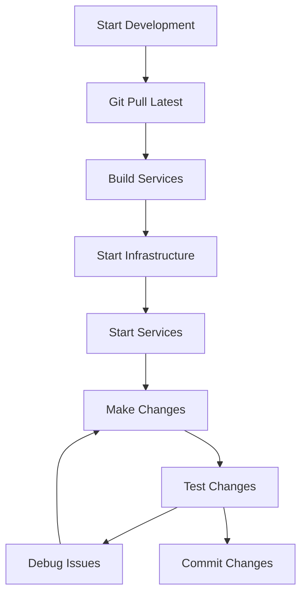

# Local Development Guide

This guide covers running OpenFrame locally for development, including hot reload, debugging, and iterative development workflows. Perfect for developers who want to contribute to OpenFrame or customize it for their needs.

> **Prerequisites**: Complete [Development Environment Setup](environment.md) first

## Quick Start for Development

### One-Command Development Setup

```bash
# Clone repository
git clone https://github.com/flamingo-stack/openframe-oss-tenant.git
cd openframe-oss-tenant

# Start development environment with hot reload
./scripts/dev-mode.sh
```

This script starts all services with development-optimized configurations:
- Hot reload enabled for all services
- Debug ports exposed
- Development database connections
- Relaxed security for local development

## Step-by-Step Development Setup

### Step 1: Start Infrastructure Services

Start required data services in development mode:

```bash
cd integrated-tools

# Start core data services
docker-compose -f docker-compose.dev.yml up -d \
  mongodb \
  cassandra \
  redis \
  kafka \
  zookeeper
```

Wait for services to be ready:
```bash
# Check service health
docker-compose -f docker-compose.dev.yml ps

# Verify connectivity
docker exec -it mongodb mongo --eval "db.adminCommand('ismaster')"
docker exec -it redis redis-cli ping
```

### Step 2: Build OpenFrame Services

Build all services for development:

```bash
# Quick build without tests for development
mvn clean install -DskipTests -T 4

# Or build specific modules
mvn clean install -DskipTests -pl openframe/services/openframe-api
```

### Step 3: Start Services with Hot Reload

#### Backend Services (Java)

Start each service in development mode with hot reload:

```bash
# Terminal 1 - Configuration Server (start first)
cd openframe/services/openframe-config
mvn spring-boot:run -Dspring-boot.run.profiles=dev

# Wait for config server to be ready, then start others

# Terminal 2 - Authorization Server
cd openframe/services/openframe-authorization-server
mvn spring-boot:run -Dspring-boot.run.profiles=dev

# Terminal 3 - API Gateway
cd openframe/services/openframe-gateway  
mvn spring-boot:run -Dspring-boot.run.profiles=dev

# Terminal 4 - Main API Service
cd openframe/services/openframe-api
mvn spring-boot:run -Dspring-boot.run.profiles=dev

# Terminal 5 - Management Service
cd openframe/services/openframe-management
mvn spring-boot:run -Dspring-boot.run.profiles=dev
```

#### Frontend Service (Vue.js)

```bash
# Terminal 6 - Frontend with hot reload
cd openframe/services/openframe-frontend
npm install
npm run dev
```

### Step 4: Start Client Applications (Optional)

#### OpenFrame Chat Client (Tauri + Vue)

```bash
# Terminal 7 - Chat client
cd clients/openframe-chat
npm install
npm run tauri dev
```

#### Rust System Agent

```bash
# Terminal 8 - System agent
cd clients/openframe-client
cargo build
cargo run -- --config dev-config.toml
```

## Development Configuration

### Application Properties for Development

Each service uses development-specific configurations:

#### `application-dev.yml` (Common Configuration)

```yaml
# Development profile configuration
spring:
  profiles:
    active: dev
  devtools:
    restart:
      enabled: true
    livereload:
      enabled: true
  
# Database connections
mongodb:
  host: localhost
  port: 27017
  database: openframe_dev
  
cassandra:
  contact-points: localhost
  port: 9042
  keyspace: openframe_dev
  
redis:
  host: localhost
  port: 6379
  database: 1  # Use database 1 for dev
  
# Kafka
kafka:
  bootstrap-servers: localhost:9092
  consumer:
    group-id: openframe-dev
    
# Logging
logging:
  level:
    com.openframe: DEBUG
    org.springframework.security: DEBUG
    org.springframework.web: DEBUG
    
# Security (relaxed for development)
openframe:
  security:
    jwt:
      secret: dev-jwt-secret-key
      expiration: 86400000  # 24 hours
    cors:
      allowed-origins: "http://localhost:3000,http://localhost:5173"
      allow-credentials: true
```

### Frontend Development Configuration

#### `vite.config.ts` for Development

```typescript
import { defineConfig } from 'vite'
import vue from '@vitejs/plugin-vue'

export default defineConfig({
  plugins: [vue()],
  server: {
    port: 3000,
    host: true,
    proxy: {
      '/api': {
        target: 'http://localhost:8080',
        changeOrigin: true,
        secure: false
      },
      '/graphql': {
        target: 'http://localhost:8080',
        changeOrigin: true,
        secure: false
      },
      '/auth': {
        target: 'http://localhost:8082',
        changeOrigin: true,
        secure: false
      }
    }
  },
  define: {
    'process.env': {
      NODE_ENV: 'development',
      VITE_API_URL: 'http://localhost:8080',
      VITE_WS_URL: 'ws://localhost:8080/ws'
    }
  }
})
```

## Hot Reload Configuration

### Java Services Hot Reload

Enable automatic restart on code changes:

```xml
<!-- Add to pom.xml for development -->
<plugin>
  <groupId>org.springframework.boot</groupId>
  <artifactId>spring-boot-maven-plugin</artifactId>
  <configuration>
    <addResources>true</addResources>
  </configuration>
  <dependencies>
    <dependency>
      <groupId>org.springframework</groupId>
      <artifactId>springloaded</artifactId>
      <version>1.2.8.RELEASE</version>
    </dependency>
  </dependencies>
</plugin>
```

### Frontend Hot Reload

Vue.js hot reload is enabled by default with Vite. Configuration in `package.json`:

```json
{
  "scripts": {
    "dev": "vite --host 0.0.0.0 --port 3000",
    "dev:debug": "vite --host 0.0.0.0 --port 3000 --debug",
    "build": "vue-tsc && vite build",
    "preview": "vite preview"
  }
}
```

## Debugging Configuration

### Java Services Debugging

#### Enable Remote Debugging

Add JVM debug options:

```bash
# Start with debug enabled
mvn spring-boot:run \
  -Dspring-boot.run.jvmArguments="-Xdebug -Xrunjdwp:transport=dt_socket,server=y,suspend=n,address=5005" \
  -Dspring-boot.run.profiles=dev
```

#### IntelliJ IDEA Debug Configuration

1. **Create Remote Debug Configuration**:
   ```
   Run/Debug Configurations → Add New → Remote JVM Debug
   Name: OpenFrame API Debug
   Host: localhost
   Port: 5005
   Module: openframe-api
   ```

2. **Set breakpoints** in your code
3. **Start debugging** with the remote configuration

#### Debug Port Assignments

| Service | Debug Port | Command |
|---------|------------|---------|
| **Config Server** | 5001 | `address=5001` |
| **Authorization** | 5002 | `address=5002` |
| **Gateway** | 5003 | `address=5003` |
| **API Service** | 5005 | `address=5005` |
| **Management** | 5006 | `address=5006` |

### Frontend Debugging

#### Browser DevTools

Vue.js development build includes source maps:

```bash
# Start frontend with source maps
npm run dev -- --sourcemap
```

#### VS Code Debugging

Create `.vscode/launch.json`:

```json
{
  "version": "0.2.0",
  "configurations": [
    {
      "name": "Debug OpenFrame Frontend",
      "type": "node",
      "request": "launch",
      "program": "${workspaceFolder}/node_modules/.bin/vite",
      "args": ["--mode", "development"],
      "cwd": "${workspaceFolder}",
      "console": "integratedTerminal",
      "sourceMaps": true,
      "outFiles": ["${workspaceFolder}/dist/**/*.js"]
    }
  ]
}
```

## Database Development Setup

### Development Data

#### Load Test Data

```bash
# Load development seed data
cd openframe/scripts
./load-dev-data.sh

# Or manually via MongoDB
mongo openframe_dev --eval "load('dev-seed-data.js')"
```

#### Development Database Schema

Create development-specific collections and indexes:

```javascript
// MongoDB development setup
use openframe_dev;

// Create collections with development data
db.organizations.insertMany([
  {
    _id: ObjectId(),
    name: "Development MSP",
    slug: "dev-msp",
    contactPerson: {
      firstName: "Dev",
      lastName: "User",
      email: "dev@localhost.com"
    }
  }
]);

db.users.insertMany([
  {
    _id: ObjectId(),
    email: "admin@localhost.com",
    firstName: "Admin",
    lastName: "User",
    role: "ADMIN",
    organizationId: "dev-msp"
  }
]);
```

### Database Migrations in Development

```bash
# Run database migrations
cd openframe/services/openframe-management
mvn spring-boot:run -Dspring-boot.run.arguments="--migrate-database"
```

## Live Reload Features

### Configuration Changes

Edit properties and see changes immediately:

```yaml
# Edit application-dev.yml
logging:
  level:
    com.openframe: TRACE  # Change from DEBUG to TRACE
```

Changes are picked up without restart when using Spring DevTools.

### Code Changes

#### Java Hot Swap

Supported changes without restart:
- Method body changes
- Adding new methods
- Field modifications
- Annotation changes

Not supported (requires restart):
- Class signature changes
- Adding/removing fields
- Interface changes

#### Frontend Changes

All frontend changes trigger immediate hot reload:
- Vue component templates
- TypeScript/JavaScript code  
- CSS/SCSS styles
- Route configurations

## Development Workflow

### Typical Development Session



### Development Best Practices

1. **Start Infrastructure First**: Always start databases before services
2. **Use Profile-Specific Configs**: Keep dev/prod configurations separate
3. **Enable Debug Logging**: Set appropriate log levels for debugging
4. **Use Hot Reload**: Leverage automatic restart capabilities
5. **Test Incrementally**: Test changes as you develop
6. **Keep Data Clean**: Reset development data regularly

### Common Development Commands

```bash
# Restart specific service quickly
cd openframe/services/openframe-api
mvn spring-boot:stop
mvn spring-boot:run -Dspring-boot.run.profiles=dev

# Rebuild and restart frontend
cd openframe/services/openframe-frontend
npm run build:dev && npm run dev

# Check service logs
tail -f logs/openframe-api.log
docker logs -f mongodb

# Reset development database
mongo openframe_dev --eval "db.dropDatabase()"
./scripts/load-dev-data.sh
```

## Troubleshooting Development Issues

### Service Won't Start

```bash
# Check if port is in use
lsof -ti:8080 | xargs kill -9

# Verify Java version
java -version

# Check application logs
tail -f openframe/services/openframe-api/logs/application.log
```

### Database Connection Issues

```bash
# Test MongoDB connection
mongo --host localhost:27017 --eval "db.adminCommand('ismaster')"

# Test Redis connection
redis-cli -h localhost -p 6379 ping

# Check Cassandra
docker exec -it cassandra cqlsh -e "DESCRIBE KEYSPACES;"
```

### Frontend Build Issues

```bash
# Clear npm cache
npm cache clean --force

# Remove and reinstall dependencies
rm -rf node_modules package-lock.json
npm install

# Check for TypeScript errors
npm run type-check
```

### Hot Reload Not Working

```bash
# Restart Spring DevTools
# Add to application-dev.yml:
spring:
  devtools:
    restart:
      trigger-file: .reloadtrigger

# Touch trigger file to force reload
touch .reloadtrigger
```

## Performance Optimization for Development

### Java Services

```bash
# Allocate more memory for Maven
export MAVEN_OPTS="-Xmx2g -XX:MaxPermSize=512m"

# Use parallel compilation
mvn clean install -T 4  # Use 4 threads
```

### Frontend Development

```bash
# Use faster package manager
npm install -g pnpm
pnpm install
pnpm run dev

# Enable cache for faster builds
npm run dev -- --force
```

## Next Steps

With local development set up:

1. **Make Your First Change**: Edit a component and see hot reload in action
2. **Learn the Architecture**: Review [Architecture Overview](../architecture/overview.md)
3. **Write Tests**: Follow [Testing Guidelines](../testing/overview.md)
4. **Contribute**: Read [Contributing Guidelines](../contributing/guidelines.md)

---

Happy developing! 🚀 Your local OpenFrame development environment is ready for productive coding.