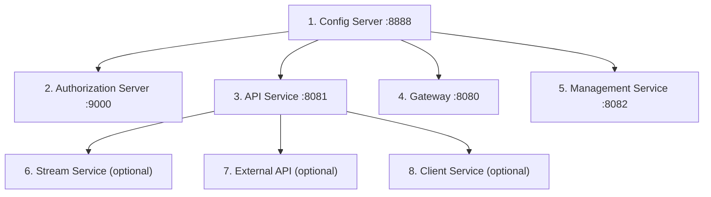

# Local Development Guide

This guide covers running OpenFrame OSS Tenant locally for active development, including hot reload, debugging, and working with multiple services simultaneously.

---

## Clone and Initial Setup

```bash
# Clone the repository
git clone https://github.com/openframeai/openframe-oss-tenant.git
cd openframe-oss-tenant

# Build all Java services (initial build — takes ~5 minutes)
mvn clean install -DskipTests

# Install frontend dependencies
cd openframe/services/openframe-frontend
npm install
cd ../../..
```

---

## Running Services Locally

### Starting Infrastructure First

Before starting any OpenFrame service, ensure your infrastructure is running:

```bash
# Quick infrastructure health check
mongosh --eval "db.adminCommand('ping')" --quiet
redis-cli ping
nats-server --version  # should return version, not error
```

### Service Startup Order

Always follow this startup sequence:



---

## Running Individual Services

### Config Server

```bash
cd openframe/services/openframe-config
mvn spring-boot:run
```

### Authorization Server

```bash
cd openframe/services/openframe-authorization-server
mvn spring-boot:run
```

### API Service

```bash
cd openframe/services/openframe-api
mvn spring-boot:run

# With custom port
mvn spring-boot:run -Dspring-boot.run.arguments=--server.port=8081
```

### Gateway Service

```bash
cd openframe/services/openframe-gateway
mvn spring-boot:run
```

### Management Service

```bash
cd openframe/services/openframe-management
mvn spring-boot:run
```

### Frontend (Next.js)

```bash
cd openframe/services/openframe-frontend
npm run dev
```

The Next.js dev server starts at `http://localhost:3000` with **hot reload** enabled. Changes to frontend files are reflected immediately.

---

## Hot Reload / Watch Mode

### Backend — Spring Boot DevTools

Add `spring-boot-devtools` to your service's `pom.xml` for automatic class reloading during development (not present by default in production builds):

```xml
<dependency>
    <groupId>org.springframework.boot</groupId>
    <artifactId>spring-boot-devtools</artifactId>
    <scope>runtime</scope>
    <optional>true</optional>
</dependency>
```

Then run with:
```bash
mvn spring-boot:run
```

IntelliJ IDEA with "Build project automatically" enabled + "Compiler → Make project automatically" will trigger class reload on file save.

### Frontend — Next.js Fast Refresh

The Next.js frontend has **fast refresh** built in — no additional configuration required. Edit any `.tsx` or `.ts` file and the browser updates instantly without losing component state.

```bash
cd openframe/services/openframe-frontend
npm run dev
# Fast Refresh active at http://localhost:3000
```

---

## Debug Configuration

### Backend — Remote Debug (IntelliJ)

Run a Spring Boot service in debug mode:

```bash
# Start service with debug port 5005
cd openframe/services/openframe-api
mvn spring-boot:run -Dspring-boot.run.jvmArguments="-Xdebug -Xrunjdwp:transport=dt_socket,server=y,suspend=n,address=5005"
```

In IntelliJ IDEA:
```text
Run → Edit Configurations → + → Remote JVM Debug
Host: localhost
Port: 5005
```

### Frontend — Browser DevTools

The Next.js frontend supports standard browser debugging. For VS Code debugging:

Create `.vscode/launch.json`:
```json
{
  "version": "0.2.0",
  "configurations": [
    {
      "name": "Next.js: debug client-side",
      "type": "chrome",
      "request": "launch",
      "url": "http://localhost:3000"
    },
    {
      "name": "Next.js: debug server-side",
      "type": "node",
      "request": "attach",
      "port": 9229,
      "restart": true,
      "name": "Debug Next.js",
      "cwd": "${workspaceFolder}/openframe/services/openframe-frontend"
    }
  ]
}
```

---

## Working with the GraphQL API

The API service exposes a **GraphQL playground** in development mode:

```text
http://localhost:8081/graphiql
```

### Example Query

```graphql
query GetDevices {
  devices(first: 10) {
    edges {
      node {
        id
        name
        status
        organization {
          name
        }
      }
    }
    pageInfo {
      hasNextPage
      endCursor
    }
  }
}
```

### Authentication

Include the Bearer token in the HTTP headers panel:
```json
{
  "Authorization": "Bearer <your-access-token>"
}
```

---

## Development Init Script

For initial client service development setup, use the provided script:

```bash
bash clients/openframe-client/scripts/setup_dev_init_config.sh
```

This script configures default development settings for the OpenFrame client agent.

---

## Useful Maven Commands

```bash
# Build without tests (fast)
mvn clean install -DskipTests

# Build a specific module
mvn clean install -DskipTests -pl openframe/services/openframe-api

# Run tests for a module
mvn test -pl openframe/services/openframe-api

# Run a specific test class
mvn test -pl openframe/services/openframe-api -Dtest=ApiKeyServiceTest

# Check for dependency updates
mvn versions:display-dependency-updates

# Generate site documentation
mvn site -DskipTests
```

---

## Useful npm Commands

```bash
# Install dependencies
npm install

# Start dev server (hot reload)
npm run dev

# Build for production
npm run build

# Type checking
npx tsc --noEmit

# Linting
npm run lint
```

---

## Environment-Specific Profiles

Spring Boot services support profiles for environment-specific configuration:

```bash
# Run with 'dev' profile
mvn spring-boot:run -Dspring-boot.run.profiles=dev

# Run with multiple profiles
mvn spring-boot:run -Dspring-boot.run.profiles=dev,local-mongo
```

Create `application-dev.yml` in each service's `src/main/resources/` for development overrides.

---

## Logging

Services use **Logback** with **Logstash JSON encoder** for structured logging.

For readable local development logs, set logging level in your Config Server configuration:

```yaml
logging:
  level:
    com.openframe: DEBUG
    org.springframework.security: DEBUG
    org.springframework.data.mongodb: DEBUG
```

---

## Common Issues

### Port Already in Use

```bash
# Find what's using port 8081
lsof -ti:8081

# Kill the process
kill -9 $(lsof -ti:8081)
```

### MongoDB Connection Refused

```bash
# Check if MongoDB is running
pgrep mongod

# Start MongoDB (macOS/Homebrew)
brew services start mongodb-community

# Start MongoDB (Linux)
sudo systemctl start mongod
```

### NATS Connection Failed

```bash
# Start NATS with JetStream enabled
nats-server -js -p 4222
```

### Config Server Not Reachable

Ensure the Config Server is running before starting other services. All services will fail to start if they cannot reach the Config Server.
