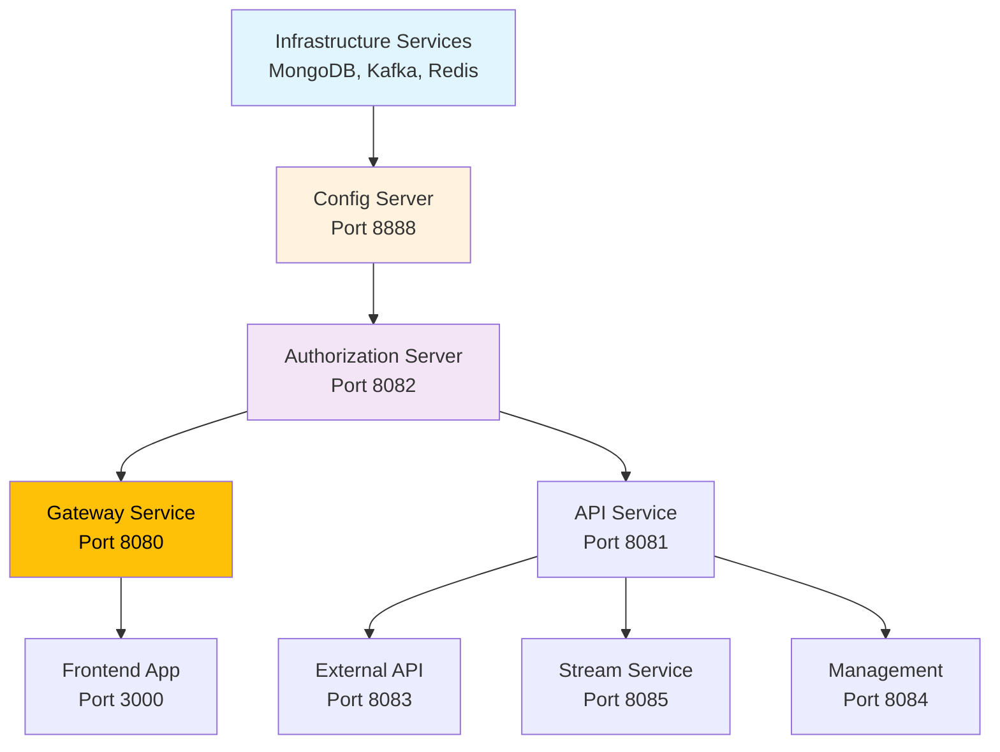

# Local Development Guide

This guide walks you through setting up and running OpenFrame locally for development. You'll learn how to clone the repository, build the platform, run services, and make your first code changes.

## Prerequisites

Before starting, ensure you've completed the [Environment Setup](environment.md) guide and have all required tools installed:

- ✅ Java 21+
- ✅ Maven 3.9+
- ✅ Node.js 18+
- ✅ Docker and Docker Compose
- ✅ Git
- ✅ mkcert (for local HTTPS)

## Repository Structure Overview

Understanding the OpenFrame repository structure is crucial for effective development:

```text
openframe-oss-tenant/
├── clients/                        # Client Applications
│   ├── openframe-chat/            # Desktop chat client (Tauri + React)
│   └── openframe-client/          # System agent (Rust)
├── openframe/                      # Main Platform
│   └── services/                   # Spring Boot microservices
│       ├── openframe-api/         # Business logic API
│       ├── openframe-gateway/     # API Gateway
│       ├── openframe-authorization-server/  # OAuth2 server
│       ├── openframe-frontend/    # Next.js web application
│       └── ...
├── deps/                           # External Dependencies
│   └── openframe-oss-lib/         # Shared libraries
├── integrated-tools/               # Tool Integrations
│   └── tactical-rmm/              # Tactical RMM integration
├── manifests/                      # Kubernetes manifests
├── pom.xml                         # Root Maven configuration
└── docker-compose.yml             # Development infrastructure
```

## Clone and Initial Setup

### Step 1: Clone the Repository

```bash
# Clone the main repository
git clone https://github.com/flamingo-stack/openframe-oss-tenant.git

# Navigate to the project directory
cd openframe-oss-tenant

# Verify the clone
ls -la
# You should see: clients/, openframe/, pom.xml, docker-compose.yml
```

### Step 2: Initialize Submodules

OpenFrame includes shared libraries as dependencies:

```bash
# Initialize and update submodules
git submodule update --init --recursive

# Verify submodules
ls deps/
# You should see: openframe-oss-lib/
```

### Step 3: Set Up Local Certificates

For local HTTPS development, set up mkcert certificates:

```bash
# Install local CA (if not already done)
mkcert -install

# Generate certificates for localhost
mkcert localhost 127.0.0.1 ::1

# Move certificates to expected location
mkdir -p ~/.mkcert
mv localhost+2.pem ~/.mkcert/localhost.pem
mv localhost+2-key.pem ~/.mkcert/localhost-key.pem
```

## Development Infrastructure Setup

### Start Infrastructure Services

Use Docker Compose to run required infrastructure services:

```bash
# Start all infrastructure services
docker-compose up -d

# Verify services are running
docker-compose ps
```

**Expected Services:**
```text
SERVICE     STATUS        PORTS
mongodb     Up            0.0.0.0:27017->27017/tcp
kafka       Up            0.0.0.0:9092->9092/tcp
zookeeper   Up            0.0.0.0:2181->2181/tcp
redis       Up            0.0.0.0:6379->6379/tcp
```

### Initialize Development Data

Set up initial database schemas and test data:

```bash
# Run development configuration script
./clients/openframe-client/scripts/setup_dev_init_config.sh

# You'll need an access token for the API
# Follow the prompts to configure local development
```

## Build the Platform

### Maven Build Process

Build all modules in the correct order:

```bash
# Clean and install all modules (skip tests for faster initial build)
mvn clean install -DskipTests

# This builds:
# 1. Shared libraries (deps/openframe-oss-lib)
# 2. Backend services (openframe/services)
# 3. Client applications (clients/)
```

**Build Output:**
```text
[INFO] Reactor Summary:
[INFO] OpenFrame Platform ........................... SUCCESS
[INFO] OpenFrame Core Libraries ..................... SUCCESS
[INFO] OpenFrame API Service ........................ SUCCESS
[INFO] OpenFrame Gateway Service .................... SUCCESS
[INFO] OpenFrame Authorization Server ............... SUCCESS
[INFO] Total time: 3:45 min
```

### Frontend Dependencies

Install Node.js dependencies for the web application:

```bash
# Navigate to frontend directory
cd openframe/services/openframe-frontend

# Install dependencies
npm install

# Return to project root
cd ../../../
```

## Running Services for Development

### Option 1: Automated Service Startup

Create a development startup script:

**`scripts/start-dev-services.sh`:**
```bash
#!/bin/bash
set -e

echo "Starting OpenFrame development services..."

# Function to start a service in background
start_service() {
    local service_path=$1
    local service_name=$2
    local port=$3
    
    echo "Starting $service_name on port $port..."
    mvn spring-boot:run -pl "$service_path" > "logs/${service_name}.log" 2>&1 &
    echo $! > "logs/${service_name}.pid"
}

# Create logs directory
mkdir -p logs

# Start services in dependency order
start_service "openframe/services/openframe-config" "config-server" 8888
sleep 10  # Wait for config server

start_service "openframe/services/openframe-authorization-server" "auth-server" 8082
sleep 15  # Wait for auth server

start_service "openframe/services/openframe-gateway" "gateway" 8080
start_service "openframe/services/openframe-api" "api-service" 8081
start_service "openframe/services/openframe-external-api" "external-api" 8083
start_service "openframe/services/openframe-management" "management" 8084
start_service "openframe/services/openframe-stream" "stream-service" 8085

echo "All services started. Check logs/ directory for service logs."
echo "Gateway available at: https://localhost:8080"
```

**Run the script:**
```bash
chmod +x scripts/start-dev-services.sh
./scripts/start-dev-services.sh
```

### Option 2: Manual Service Startup

Start each service individually for better control:

**Terminal 1: Config Server**
```bash
mvn spring-boot:run -pl openframe/services/openframe-config
```

**Terminal 2: Authorization Server**
```bash
mvn spring-boot:run -pl openframe/services/openframe-authorization-server
```

**Terminal 3: Gateway Service**
```bash
mvn spring-boot:run -pl openframe/services/openframe-gateway
```

**Terminal 4: API Service**
```bash
mvn spring-boot:run -pl openframe/services/openframe-api
```

**Terminal 5: Frontend (Next.js)**
```bash
cd openframe/services/openframe-frontend
npm run dev
```

### Service Startup Order

**Critical Dependencies:**


## Hot Reload and Development Features

### Backend Hot Reload

Spring Boot DevTools enables automatic restarts:

**Add to each service's `pom.xml`:**
```xml
<dependency>
    <groupId>org.springframework.boot</groupId>
    <artifactId>spring-boot-devtools</artifactId>
    <scope>runtime</scope>
    <optional>true</optional>
</dependency>
```

**Enable in IntelliJ IDEA:**
1. Go to **Settings** → **Build, Execution, Deployment** → **Compiler**
2. Check **"Build project automatically"**
3. Go to **Advanced Settings**
4. Check **"Allow auto-make to start even if developed application is currently running"**

### Frontend Hot Reload

Next.js provides built-in hot reload:

```bash
cd openframe/services/openframe-frontend
npm run dev
```

**Features:**
- Automatic page refresh on file changes
- Component state preservation
- Error overlay for debugging
- Fast refresh for React components

### Debug Configuration

**IntelliJ IDEA Debug Configuration:**
1. **Run/Debug Configurations** → **Add New** → **Spring Boot**
2. **Name**: OpenFrame API Service
3. **Main class**: `com.openframe.api.ApiApplication`
4. **Module**: `openframe-api`
5. **JRE**: Java 21
6. **VM options**: `-Xmx2g -Dspring.profiles.active=development`

**VS Code Debug Configuration (`.vscode/launch.json`):**
```json
{
  "version": "0.2.0",
  "configurations": [
    {
      "name": "Debug OpenFrame API",
      "type": "java",
      "request": "launch",
      "mainClass": "com.openframe.api.ApiApplication",
      "projectName": "openframe-api",
      "env": {
        "SPRING_PROFILES_ACTIVE": "development"
      }
    },
    {
      "name": "Debug Frontend",
      "type": "node",
      "request": "launch",
      "program": "${workspaceFolder}/openframe/services/openframe-frontend/node_modules/.bin/next",
      "args": ["dev"],
      "cwd": "${workspaceFolder}/openframe/services/openframe-frontend"
    }
  ]
}
```

## Development Workflow

### Making Your First Code Change

Let's make a simple change to see the development workflow:

**1. Modify a REST Controller:**
```java
// File: openframe/services/openframe-api/src/main/java/com/openframe/api/controller/HealthController.java

@RestController
@RequestMapping("/api")
public class HealthController {
    
    @GetMapping("/health")
    public ResponseEntity<Map<String, Object>> health() {
        Map<String, Object> response = new HashMap<>();
        response.put("status", "UP");
        response.put("timestamp", Instant.now());
        response.put("message", "OpenFrame API is running!"); // Add this line
        return ResponseEntity.ok(response);
    }
}
```

**2. Test the Change:**
```bash
# The service should auto-restart (if DevTools is enabled)
curl -k https://localhost:8081/api/health

# Expected response:
{
  "status": "UP",
  "timestamp": "2024-01-15T10:30:00Z",
  "message": "OpenFrame API is running!"
}
```

**3. Make a Frontend Change:**
```tsx
// File: openframe/services/openframe-frontend/src/app/page.tsx

export default function HomePage() {
  return (
    <div>
      <h1>Welcome to OpenFrame!</h1>
      <p>Your AI-powered MSP platform is ready.</p> // Add this line
    </div>
  );
}
```

The frontend should automatically refresh and show your changes.

### Running Tests

**Backend Tests:**
```bash
# Run all tests
mvn test

# Run tests for specific service
mvn test -pl openframe/services/openframe-api

# Run with coverage
mvn test jacoco:report
```

**Frontend Tests:**
```bash
cd openframe/services/openframe-frontend

# Run unit tests
npm test

# Run with coverage
npm run test:coverage

# Run end-to-end tests
npm run test:e2e
```

### Working with the Database

**MongoDB Development:**
```bash
# Connect to development database
mongosh openframe_dev

# View collections
db.getCollectionNames()

# Query organizations
db.organizations.find().pretty()

# Reset development data
db.dropDatabase()
```

**Redis Development:**
```bash
# Connect to Redis
redis-cli

# View all keys
keys *

# Clear cache
flushall
```

## Debugging Common Development Issues

### Port Conflicts

**Check what's using a port:**
```bash
lsof -i :8080
# Kill the process if needed
kill -9 <PID>
```

### Service Startup Failures

**Check application logs:**
```bash
# Service-specific logs
tail -f logs/gateway.log

# Or use Maven output
mvn spring-boot:run -pl openframe/services/openframe-gateway -X
```

**Common issues:**
- Database connection failures
- Missing environment variables
- Port already in use
- Dependency resolution errors

### Frontend Build Issues

**Common fixes:**
```bash
# Clear npm cache
npm cache clean --force

# Remove node_modules and reinstall
rm -rf node_modules package-lock.json
npm install

# Check Node.js version
node --version  # Should be 18+
```

### Database Connection Issues

**MongoDB troubleshooting:**
```bash
# Check MongoDB status
docker-compose logs mongodb

# Restart MongoDB
docker-compose restart mongodb

# Test connection
mongosh --eval "db.adminCommand('ping')"
```

## Performance Optimization for Development

### JVM Performance Tuning

**Set JVM options:**
```bash
export JAVA_OPTS="-Xmx2g -Xms512m -XX:+UseZGC -XX:+UnlockExperimentalVMOptions"
```

### Build Performance

**Parallel builds:**
```bash
# Use multiple threads for Maven builds
mvn clean install -T 4  # 4 threads

# Skip non-essential phases
mvn compile -DskipTests -Dmaven.javadoc.skip=true
```

### Docker Performance

**Optimize Docker for development:**
```bash
# Allocate more resources to Docker
# Docker Desktop: Preferences → Resources
# - CPUs: 4+
# - Memory: 8GB+
# - Swap: 2GB
```

## Development Scripts and Automation

### Create Helpful Scripts

**`scripts/reset-dev-environment.sh`:**
```bash
#!/bin/bash
echo "Resetting OpenFrame development environment..."

# Stop all services
./scripts/stop-dev-services.sh

# Reset databases
docker-compose down -v
docker-compose up -d

# Clear logs
rm -rf logs/*

# Rebuild with fresh dependencies
mvn clean install -DskipTests

echo "Development environment reset complete!"
```

**`scripts/tail-logs.sh`:**
```bash
#!/bin/bash
# Tail all service logs
tail -f logs/*.log
```

**`scripts/health-check.sh`:**
```bash
#!/bin/bash
echo "Checking service health..."

services=(
  "https://localhost:8080/health:Gateway"
  "https://localhost:8081/api/health:API"
  "https://localhost:8082/actuator/health:Auth"
)

for service in "${services[@]}"; do
  url=$(echo $service | cut -d: -f1)
  name=$(echo $service | cut -d: -f2)
  
  if curl -k -s "$url" > /dev/null; then
    echo "✅ $name is healthy"
  else
    echo "❌ $name is down"
  fi
done
```

## Next Steps

With your local development environment running:

1. **Explore the codebase**: Start with the API service and understand the patterns
2. **Make meaningful changes**: Implement a new feature or fix a bug
3. **Write tests**: Add unit and integration tests for your changes
4. **Submit contributions**: Follow the [Contributing Guidelines](../contributing/guidelines.md)

### Recommended Learning Path

1. **Backend Development**: Start with simple REST endpoints and service layer changes
2. **Frontend Development**: Modify UI components and learn the React/Next.js patterns
3. **Integration Development**: Work with Kafka events and external tool integrations
4. **AI Development**: Enhance Mingo AI capabilities and autonomous agents

---

**Your local development environment is now fully functional!** 🎉

> **💡 Pro Tip**: Keep the infrastructure services running in Docker and restart only the specific application services you're working on. This saves time and resources during development.

## Troubleshooting Resources

- **Community Support**: [OpenMSP Slack](https://join.slack.com/t/openmsp/shared_invite/zt-36bl7mx0h-3~U2nFH6nqHqoTPXMaHEHA)
- **Development Scripts**: Check the `scripts/` directory for automation tools
- **Service Logs**: Always check `logs/` directory for detailed error information
- **Database State**: Use MongoDB and Redis CLI tools to inspect data state