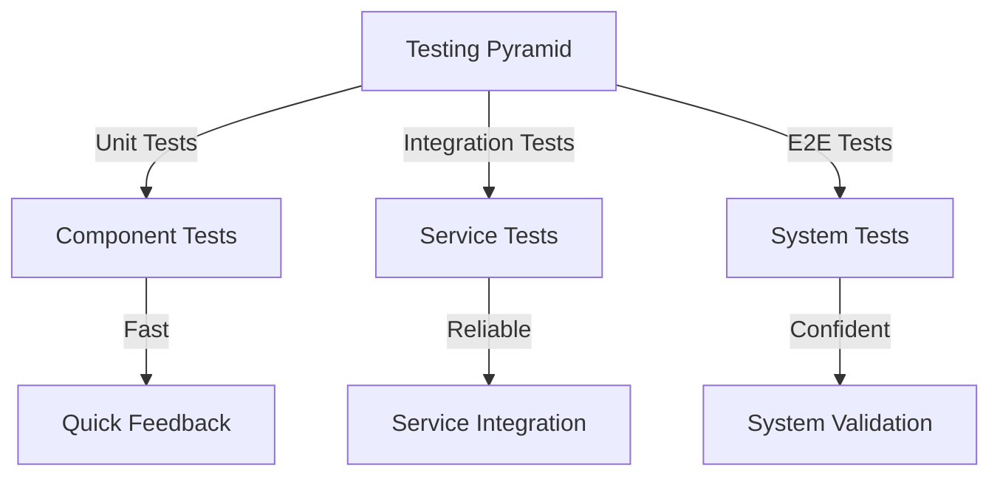

# Testing Guidelines

This document outlines testing practices and procedures for OpenFrame's Java Spring Boot backend and Vue.js frontend.

## Testing Strategy



## Test Types

### 1. Unit Tests (Backend)

```java
// src/test/java/com/openframe/service/DeviceServiceTest.java
@SpringBootTest
class DeviceServiceTest {
    
    @Autowired
    private DeviceService deviceService;
    
    @MockBean
    private DeviceRepository deviceRepository;
    
    @Test
    void shouldGetDeviceById() {
        // Arrange
        String deviceId = "test-device-1";
        Device expectedDevice = new Device(deviceId, "Test Device", "ACTIVE");
        when(deviceRepository.findByDeviceId(deviceId))
            .thenReturn(Optional.of(expectedDevice));
        
        // Act
        Device device = deviceService.getDevice(deviceId);
        
        // Assert
        assertThat(device).isNotNull();
        assertThat(device.getId()).isEqualTo(deviceId);
        assertThat(device.getStatus()).isEqualTo("ACTIVE");
    }
}
```

### 2. Integration Tests (Backend)

```java
// src/test/java/com/openframe/controller/DeviceControllerIntegrationTest.java
@SpringBootTest(webEnvironment = SpringBootTest.WebEnvironment.RANDOM_PORT)
class DeviceControllerIntegrationTest {
    
    @Autowired
    private TestRestTemplate restTemplate;
    
    @Test
    void shouldCreateDevice() {
        // Arrange
        DeviceRequest request = new DeviceRequest("Test Device", "workstation");
        
        // Act
        ResponseEntity<Device> response = restTemplate.postForEntity(
            "/api/devices",
            request,
            Device.class
        );
        
        // Assert
        assertThat(response.getStatusCode()).isEqualTo(HttpStatus.CREATED);
        assertThat(response.getBody()).isNotNull();
        assertThat(response.getBody().getName()).isEqualTo("Test Device");
    }
}
```

### 3. Unit Tests (Frontend)

```typescript
// src/components/DeviceList.spec.ts
import { mount } from '@vue/test-utils'
import DeviceList from './DeviceList.vue'

describe('DeviceList', () => {
  it('should display devices', () => {
    // Arrange
    const devices = [
      { id: '1', name: 'Device 1', status: 'active' },
      { id: '2', name: 'Device 2', status: 'inactive' }
    ]
    
    // Act
    const wrapper = mount(DeviceList, {
      props: { devices }
    })
    
    // Assert
    expect(wrapper.findAll('.device-item')).toHaveLength(2)
    expect(wrapper.text()).toContain('Device 1')
    expect(wrapper.text()).toContain('Device 2')
  })
})
```

### 4. End-to-End Tests (Frontend)

```typescript
// tests/e2e/device-management.spec.ts
import { test, expect } from '@playwright/test'

test('device management workflow', async ({ page }) => {
  // Arrange
  await page.goto('http://localhost:3000/devices')
  
  // Act
  await page.click('#add-device')
  await page.fill('#device-name', 'Test Device')
  await page.click('#submit-device')
  
  // Assert
  await expect(page.locator('#device-list')).toContainText('Test Device')
})
```

## Test Organization

### 1. Backend Structure

```
src/
├── main/
│   └── java/
│       └── com/openframe/
│           ├── controller/
│           ├── service/
│           └── repository/
└── test/
    └── java/
        └── com/openframe/
            ├── controller/
            │   └── DeviceControllerTest.java
            ├── service/
            │   └── DeviceServiceTest.java
            └── repository/
                └── DeviceRepositoryTest.java
```

### 2. Frontend Structure

```
src/
├── components/
│   └── DeviceList.vue
├── views/
│   └── DeviceManagement.vue
└── tests/
    ├── unit/
    │   └── components/
    │       └── DeviceList.spec.ts
    └── e2e/
        └── device-management.spec.ts
```

## Testing Tools

### 1. Backend Testing

```xml
<!-- pom.xml -->
<dependencies>
    <dependency>
        <groupId>org.springframework.boot</groupId>
        <artifactId>spring-boot-starter-test</artifactId>
        <scope>test</scope>
    </dependency>
    <dependency>
        <groupId>org.testcontainers</groupId>
        <artifactId>testcontainers</artifactId>
        <scope>test</scope>
    </dependency>
</dependencies>
```

### 2. Frontend Testing

```json
// package.json
{
  "devDependencies": {
    "@vue/test-utils": "^2.4.0",
    "@playwright/test": "^1.40.0",
    "vitest": "^1.0.0"
  }
}
```

## Test Coverage

### 1. Backend Coverage

```xml
<!-- pom.xml -->
<plugin>
    <groupId>org.jacoco</groupId>
    <artifactId>jacoco-maven-plugin</artifactId>
    <version>0.8.11</version>
    <executions>
        <execution>
            <goals>
                <goal>prepare-agent</goal>
            </goals>
        </execution>
    </executions>
</plugin>
```

### 2. Frontend Coverage

```typescript
// vitest.config.ts
import { defineConfig } from 'vitest/config'

export default defineConfig({
  test: {
    coverage: {
      reporter: ['text', 'json', 'html'],
      exclude: ['node_modules/', 'tests/']
    }
  }
})
```

## Performance Testing

### 1. Backend Load Testing

```java
// src/test/java/com/openframe/performance/DeviceApiLoadTest.java
@SpringBootTest(webEnvironment = SpringBootTest.WebEnvironment.RANDOM_PORT)
class DeviceApiLoadTest {
    
    @Autowired
    private TestRestTemplate restTemplate;
    
    @Test
    void shouldHandleConcurrentRequests() throws InterruptedException {
        int numberOfThreads = 100;
        CountDownLatch latch = new CountDownLatch(numberOfThreads);
        
        ExecutorService executor = Executors.newFixedThreadPool(numberOfThreads);
        for (int i = 0; i < numberOfThreads; i++) {
            executor.submit(() -> {
                try {
                    ResponseEntity<Device> response = restTemplate.getForEntity(
                        "/api/devices/1",
                        Device.class
                    );
                    assertThat(response.getStatusCode()).isEqualTo(HttpStatus.OK);
                } finally {
                    latch.countDown();
                }
            });
        }
        
        latch.await(30, TimeUnit.SECONDS);
        executor.shutdown();
    }
}
```

### 2. Frontend Performance Testing

```typescript
// tests/performance/device-list.spec.ts
import { test, expect } from '@playwright/test'

test('device list performance', async ({ page }) => {
  // Measure initial load time
  const startTime = performance.now()
  await page.goto('http://localhost:3000/devices')
  const loadTime = performance.now() - startTime
  
  // Assert performance metrics
  expect(loadTime).toBeLessThan(2000) // Should load within 2 seconds
  
  // Test scrolling performance
  await page.evaluate(() => {
    const list = document.querySelector('.device-list')
    list.scrollTop = list.scrollHeight
  })
  
  // Verify smooth scrolling
  await expect(page.locator('.device-list')).toBeVisible()
})
```

## Continuous Integration

### 1. GitHub Actions

```yaml
# .github/workflows/test.yml
name: Tests

on: [push, pull_request]

jobs:
  backend-test:
    runs-on: ubuntu-latest
    steps:
    - uses: actions/checkout@v3
    - uses: actions/setup-java@v3
      with:
        java-version: '21'
        distribution: 'temurin'
    - name: Run Backend Tests
      run: mvn test
      
  frontend-test:
    runs-on: ubuntu-latest
    steps:
    - uses: actions/checkout@v3
    - uses: actions/setup-node@v3
      with:
        node-version: '18'
    - name: Install Dependencies
      run: npm ci
    - name: Run Frontend Tests
      run: npm test
```

## Best Practices

### 1. Test Design

- Follow AAA pattern (Arrange, Act, Assert)
- Keep tests independent
- Use meaningful test names
- Test edge cases
- Avoid test interdependence

### 2. Test Maintenance

- Regular test updates
- Remove obsolete tests
- Update test data
- Monitor test performance
- Review test coverage

### 3. Test Documentation

- Document test setup
- Explain test scenarios
- Document test data
- Keep test documentation updated
- Include examples

## Next Steps

- [Development Setup](setup.md) - Set up your environment
- [Architecture](architecture.md) - Understand the codebase
- [Contributing](contributing.md) - Learn how to contribute
- [Code Style](code-style.md) - Follow coding standards 