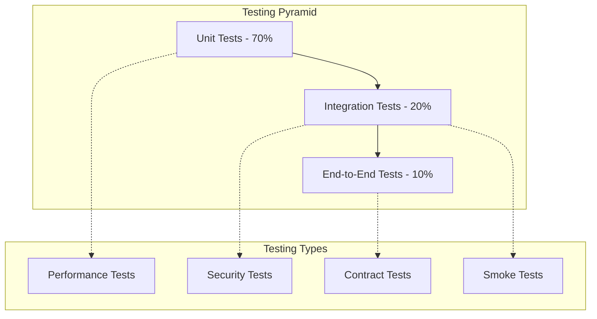

# Testing Overview

Testing is a crucial aspect of OpenFrame development. This guide covers the testing strategy, tools, and best practices for ensuring code quality and system reliability across the platform.

## 🎯 Testing Philosophy

OpenFrame follows a comprehensive testing approach based on the **Testing Pyramid**:



## 🧪 Testing Strategy by Layer

### Unit Tests (70%)

**Purpose:** Test individual components in isolation  
**Characteristics:** Fast, reliable, focused  
**Tools:** JUnit 5, Mockito, Jest, Vitest

**Java Unit Test Example:**
```java
@ExtendWith(MockitoExtension.class)
class DeviceServiceTest {
    
    @Mock
    private DeviceRepository deviceRepository;
    
    @Mock
    private DeviceEventPublisher eventPublisher;
    
    @InjectMocks
    private DeviceService deviceService;
    
    @Test
    @DisplayName("Should create device and publish event")
    void shouldCreateDeviceAndPublishEvent() {
        // Given
        CreateDeviceRequest request = CreateDeviceRequest.builder()
            .hostname("test-device")
            .operatingSystem("Windows 11")
            .build();
            
        Device savedDevice = Device.builder()
            .id("device-123")
            .hostname("test-device")
            .operatingSystem("Windows 11")
            .tenantId("tenant-123")
            .build();
        
        when(deviceRepository.save(any(Device.class))).thenReturn(savedDevice);
        
        // When
        Device result = deviceService.createDevice(request);
        
        // Then
        assertThat(result.getHostname()).isEqualTo("test-device");
        verify(deviceRepository).save(any(Device.class));
        verify(eventPublisher).publishDeviceCreated(savedDevice);
    }
    
    @Test
    @DisplayName("Should throw exception when device not found")
    void shouldThrowExceptionWhenDeviceNotFound() {
        // Given
        String deviceId = "non-existent";
        when(deviceRepository.findById(deviceId)).thenReturn(Optional.empty());
        
        // When & Then
        assertThatThrownBy(() -> deviceService.findById(deviceId))
            .isInstanceOf(DeviceNotFoundException.class)
            .hasMessage("Device not found: " + deviceId);
    }
}
```

**Frontend Unit Test Example:**
```typescript
import { render, screen, fireEvent, waitFor } from '@testing-library/react';
import { vi } from 'vitest';
import { DeviceCard } from './DeviceCard';
import { Device, DeviceStatus } from '../types/device.types';

describe('DeviceCard', () => {
  const mockDevice: Device = {
    id: '1',
    hostname: 'test-laptop',
    status: DeviceStatus.ONLINE,
    operatingSystem: 'Windows 11',
    lastSeen: new Date().toISOString(),
  };

  const mockOnClick = vi.fn();

  beforeEach(() => {
    mockOnClick.mockClear();
  });

  it('should render device information correctly', () => {
    render(<DeviceCard device={mockDevice} onClick={mockOnClick} />);
    
    expect(screen.getByText('test-laptop')).toBeInTheDocument();
    expect(screen.getByText('Windows 11')).toBeInTheDocument();
    expect(screen.getByTestId('status-badge')).toHaveClass('status-online');
  });

  it('should call onClick when card is clicked', async () => {
    render(<DeviceCard device={mockDevice} onClick={mockOnClick} />);
    
    fireEvent.click(screen.getByRole('button'));
    
    await waitFor(() => {
      expect(mockOnClick).toHaveBeenCalledWith(mockDevice.id);
    });
  });

  it('should show offline status when device is offline', () => {
    const offlineDevice = { ...mockDevice, status: DeviceStatus.OFFLINE };
    render(<DeviceCard device={offlineDevice} onClick={mockOnClick} />);
    
    expect(screen.getByTestId('status-badge')).toHaveClass('status-offline');
  });
});
```

### Integration Tests (20%)

**Purpose:** Test component interactions and external dependencies  
**Characteristics:** Medium speed, realistic scenarios  
**Tools:** Spring Boot Test, Testcontainers, Cypress Components

**Java Integration Test Example:**
```java
@SpringBootTest(webEnvironment = SpringBootTest.WebEnvironment.RANDOM_PORT)
@Testcontainers
class DeviceControllerIntegrationTest {
    
    @Container
    static MongoDBContainer mongodb = new MongoDBContainer("mongo:6.0")
        .withExposedPorts(27017);
    
    @Container 
    static KafkaContainer kafka = new KafkaContainer(DockerImageName.parse("confluentinc/cp-kafka:7.4.0"));
    
    @Autowired
    private TestRestTemplate restTemplate;
    
    @Autowired
    private DeviceRepository deviceRepository;
    
    @DynamicPropertySource
    static void setProperties(DynamicPropertyRegistry registry) {
        registry.add("spring.data.mongodb.uri", mongodb::getReplicaSetUrl);
        registry.add("spring.kafka.bootstrap-servers", kafka::getBootstrapServers);
    }
    
    @Test
    @WithMockUser(authorities = {"devices:read"})
    void shouldCreateDeviceSuccessfully() {
        // Given
        CreateDeviceRequest request = CreateDeviceRequest.builder()
            .hostname("integration-test-device")
            .operatingSystem("Ubuntu 22.04")
            .ipAddress("192.168.1.100")
            .build();
        
        // When
        ResponseEntity<DeviceResponse> response = restTemplate.postForEntity(
            "/api/v1/devices", 
            request, 
            DeviceResponse.class
        );
        
        // Then
        assertThat(response.getStatusCode()).isEqualTo(HttpStatus.CREATED);
        assertThat(response.getBody()).isNotNull();
        assertThat(response.getBody().getHostname()).isEqualTo("integration-test-device");
        
        // Verify in database
        Optional<Device> savedDevice = deviceRepository.findById(response.getBody().getId());
        assertThat(savedDevice).isPresent();
        assertThat(savedDevice.get().getHostname()).isEqualTo("integration-test-device");
    }
    
    @Test
    void shouldReturnUnauthorizedWithoutValidToken() {
        // Given
        CreateDeviceRequest request = new CreateDeviceRequest("test", "Windows");
        
        // When
        ResponseEntity<String> response = restTemplate.postForEntity(
            "/api/v1/devices", 
            request, 
            String.class
        );
        
        // Then
        assertThat(response.getStatusCode()).isEqualTo(HttpStatus.UNAUTHORIZED);
    }
}
```

**GraphQL Integration Test:**
```java
@SpringBootTest
@AutoConfigureTestDatabase(replace = AutoConfigureTestDatabase.Replace.NONE)
@Testcontainers
class DeviceGraphQLIntegrationTest {
    
    @Autowired
    private DgsQueryExecutor queryExecutor;
    
    @Test
    @WithMockUser(authorities = {"devices:read"})
    void shouldQueryDevicesWithFiltering() {
        // Given
        String query = """
            query GetDevices($filter: DeviceFilterInput) {
                devices(filter: $filter, first: 10) {
                    edges {
                        node {
                            id
                            hostname
                            status
                            operatingSystem
                        }
                    }
                    pageInfo {
                        hasNextPage
                        endCursor
                    }
                }
            }
        """;
        
        Map<String, Object> variables = Map.of(
            "filter", Map.of(
                "status", "ONLINE",
                "operatingSystem", "Windows"
            )
        );
        
        // When
        ExecutionResult result = queryExecutor.execute(query, variables);
        
        // Then
        assertThat(result.getErrors()).isEmpty();
        
        Map<String, Object> data = result.getData();
        assertThat(data).containsKey("devices");
        
        Map<String, Object> devices = (Map<String, Object>) data.get("devices");
        List<Map<String, Object>> edges = (List<Map<String, Object>>) devices.get("edges");
        
        assertThat(edges).isNotEmpty();
        edges.forEach(edge -> {
            Map<String, Object> node = (Map<String, Object>) edge.get("node");
            assertThat(node.get("status")).isEqualTo("ONLINE");
        });
    }
}
```

### End-to-End Tests (10%)

**Purpose:** Test complete user workflows  
**Characteristics:** Slow, brittle, high confidence  
**Tools:** Playwright, Cypress

**E2E Test Example:**
```typescript
import { test, expect, Page } from '@playwright/test';

test.describe('Device Management Workflow', () => {
  let page: Page;

  test.beforeEach(async ({ browser }) => {
    page = await browser.newPage();
    
    // Login before each test
    await page.goto('/auth/login');
    await page.fill('[data-testid="email-input"]', 'admin@test.com');
    await page.fill('[data-testid="password-input"]', 'password123');
    await page.click('[data-testid="login-button"]');
    await expect(page).toHaveURL('/dashboard');
  });

  test('should complete device registration workflow', async () => {
    // Navigate to devices page
    await page.click('[data-testid="nav-devices"]');
    await expect(page).toHaveURL('/devices');

    // Click add device button
    await page.click('[data-testid="add-device-button"]');
    await expect(page).toHaveURL('/devices/new');

    // Fill device form
    await page.fill('[data-testid="hostname-input"]', 'e2e-test-device');
    await page.selectOption('[data-testid="os-select"]', 'Windows 11');
    await page.fill('[data-testid="ip-address-input"]', '192.168.1.100');
    await page.fill('[data-testid="description-input"]', 'End-to-end test device');

    // Submit form
    await page.click('[data-testid="create-device-button"]');

    // Verify success
    await expect(page.locator('[data-testid="success-message"]')).toBeVisible();
    await expect(page).toHaveURL(/\/devices\/[a-zA-Z0-9-]+/);

    // Verify device appears in list
    await page.goto('/devices');
    await expect(page.locator('[data-testid="device-list"]')).toContainText('e2e-test-device');
  });

  test('should handle device status updates', async () => {
    await page.goto('/devices');
    
    // Find first device and click on it
    const firstDevice = page.locator('[data-testid="device-card"]').first();
    await firstDevice.click();

    // Wait for device details page
    await expect(page.locator('[data-testid="device-details"]')).toBeVisible();

    // Click status update button
    await page.click('[data-testid="update-status-button"]');
    await page.selectOption('[data-testid="status-select"]', 'MAINTENANCE');
    await page.click('[data-testid="confirm-update-button"]');

    // Verify status change
    await expect(page.locator('[data-testid="device-status"]')).toContainText('MAINTENANCE');
  });
});
```

## 🔧 Testing Tools and Frameworks

### Backend Testing Stack

#### JUnit 5 Configuration
```xml
<dependency>
    <groupId>org.junit.jupiter</groupId>
    <artifactId>junit-jupiter</artifactId>
    <scope>test</scope>
</dependency>
<dependency>
    <groupId>org.mockito</groupId>
    <artifactId>mockito-junit-jupiter</artifactId>
    <scope>test</scope>
</dependency>
<dependency>
    <groupId>org.assertj</groupId>
    <artifactId>assertj-core</artifactId>
    <scope>test</scope>
</dependency>
<dependency>
    <groupId>org.testcontainers</groupId>
    <artifactId>junit-jupiter</artifactId>
    <scope>test</scope>
</dependency>
```

#### Test Configuration
```java
@TestConfiguration
public class TestConfig {
    
    @Bean
    @Primary
    public Clock testClock() {
        return Clock.fixed(Instant.parse("2024-01-01T00:00:00Z"), ZoneOffset.UTC);
    }
    
    @Bean
    @Primary
    public IdGenerator testIdGenerator() {
        return () -> "test-id-123";
    }
    
    @EventListener
    public void handleTestEvent(TestEvent event) {
        // Capture events for verification
        TestEventCapture.capture(event);
    }
}
```

### Frontend Testing Stack

#### Vitest Configuration
```typescript
// vitest.config.ts
import { defineConfig } from 'vitest/config';
import react from '@vitejs/plugin-react';

export default defineConfig({
  plugins: [react()],
  test: {
    environment: 'jsdom',
    setupFiles: ['./src/test/setup.ts'],
    coverage: {
      reporter: ['text', 'json', 'html'],
      exclude: [
        'node_modules/',
        'src/test/',
        '**/*.d.ts',
        '**/*.config.ts'
      ]
    },
    globals: true,
  },
});
```

#### Test Setup
```typescript
// src/test/setup.ts
import '@testing-library/jest-dom';
import { vi } from 'vitest';

// Mock GraphQL client
vi.mock('@apollo/client', () => ({
  useQuery: vi.fn(),
  useMutation: vi.fn(),
  useSubscription: vi.fn(),
}));

// Mock WebSocket
global.WebSocket = vi.fn() as any;

// Setup test utilities
global.ResizeObserver = vi.fn().mockImplementation(() => ({
  observe: vi.fn(),
  unobserve: vi.fn(),
  disconnect: vi.fn(),
}));
```

## 🧩 Test Data Management

### Test Data Builders

**Java Test Data Builder:**
```java
public class DeviceTestDataBuilder {
    
    private String id = "test-device-id";
    private String hostname = "test-hostname";
    private String operatingSystem = "Windows 11";
    private DeviceStatus status = DeviceStatus.ONLINE;
    private String tenantId = "test-tenant";
    private Instant lastSeen = Instant.now();
    
    public static DeviceTestDataBuilder aDevice() {
        return new DeviceTestDataBuilder();
    }
    
    public DeviceTestDataBuilder withId(String id) {
        this.id = id;
        return this;
    }
    
    public DeviceTestDataBuilder withHostname(String hostname) {
        this.hostname = hostname;
        return this;
    }
    
    public DeviceTestDataBuilder offline() {
        this.status = DeviceStatus.OFFLINE;
        this.lastSeen = Instant.now().minus(Duration.ofHours(1));
        return this;
    }
    
    public DeviceTestDataBuilder forTenant(String tenantId) {
        this.tenantId = tenantId;
        return this;
    }
    
    public Device build() {
        return Device.builder()
            .id(id)
            .hostname(hostname)
            .operatingSystem(operatingSystem)
            .status(status)
            .tenantId(tenantId)
            .lastSeen(lastSeen)
            .build();
    }
}

// Usage
Device testDevice = aDevice()
    .withHostname("test-laptop")
    .offline()
    .forTenant("acme-corp")
    .build();
```

**Frontend Test Fixtures:**
```typescript
// src/test/fixtures/device.fixtures.ts
import { Device, DeviceStatus } from '../types/device.types';

export const createMockDevice = (overrides: Partial<Device> = {}): Device => ({
  id: 'device-123',
  hostname: 'test-device',
  operatingSystem: 'Windows 11',
  status: DeviceStatus.ONLINE,
  ipAddress: '192.168.1.100',
  lastSeen: new Date().toISOString(),
  tenantId: 'test-tenant',
  ...overrides,
});

export const createMockDeviceList = (count: number = 3): Device[] => 
  Array.from({ length: count }, (_, i) => 
    createMockDevice({
      id: `device-${i}`,
      hostname: `device-${i}`,
    })
  );

// Usage in tests
const device = createMockDevice({ status: DeviceStatus.OFFLINE });
const devices = createMockDeviceList(5);
```

### Database Test Data

**Test Data Scripts:**
```sql
-- test-data.sql
INSERT INTO organizations (id, name, domain, created_at) VALUES
('org-1', 'Test Corporation', 'test.com', NOW()),
('org-2', 'Demo Company', 'demo.com', NOW());

INSERT INTO users (id, email, organization_id, role, created_at) VALUES
('user-1', 'admin@test.com', 'org-1', 'ADMIN', NOW()),
('user-2', 'user@demo.com', 'org-2', 'USER', NOW());

INSERT INTO devices (id, hostname, os, tenant_id, status, created_at) VALUES
('device-1', 'test-laptop', 'Windows 11', 'org-1', 'ONLINE', NOW()),
('device-2', 'demo-server', 'Ubuntu 22.04', 'org-2', 'OFFLINE', NOW());
```

**Test Data Cleanup:**
```java
@TestExecutionListeners({
    DependencyInjectionTestExecutionListener.class,
    TransactionalTestExecutionListener.class,
    TestDataCleanupListener.class
})
public class TestDataCleanupListener implements TestExecutionListener {
    
    @Override
    public void afterTestMethod(TestContext testContext) {
        ApplicationContext context = testContext.getApplicationContext();
        MongoTemplate mongoTemplate = context.getBean(MongoTemplate.class);
        
        // Clean up test data
        mongoTemplate.remove(Query.query(Criteria.where("tenantId").is("test-tenant")), Device.class);
        mongoTemplate.remove(Query.query(Criteria.where("domain").regex("test\\.")), Organization.class);
    }
}
```

## 📊 Test Coverage and Quality

### Coverage Requirements

**Maven Configuration:**
```xml
<plugin>
    <groupId>org.jacoco</groupId>
    <artifactId>jacoco-maven-plugin</artifactId>
    <executions>
        <execution>
            <goals>
                <goal>prepare-agent</goal>
            </goals>
        </execution>
        <execution>
            <id>report</id>
            <phase>test</phase>
            <goals>
                <goal>report</goal>
            </goals>
        </execution>
        <execution>
            <id>check</id>
            <goals>
                <goal>check</goal>
            </goals>
            <configuration>
                <rules>
                    <rule>
                        <element>BUNDLE</element>
                        <limits>
                            <limit>
                                <counter>LINE</counter>
                                <value>COVEREDRATIO</value>
                                <minimum>0.80</minimum>
                            </limit>
                        </limits>
                    </rule>
                </rules>
            </configuration>
        </execution>
    </executions>
</plugin>
```

**Frontend Coverage:**
```json
{
  "scripts": {
    "test:coverage": "vitest run --coverage",
    "test:coverage:threshold": "vitest run --coverage --reporter=verbose"
  },
  "vitest": {
    "coverage": {
      "thresholds": {
        "global": {
          "branches": 80,
          "functions": 80,
          "lines": 80,
          "statements": 80
        }
      }
    }
  }
}
```

### Quality Gates

**SonarQube Configuration:**
```properties
# sonar-project.properties
sonar.projectKey=openframe-oss-tenant
sonar.projectName=OpenFrame OSS Tenant
sonar.projectVersion=1.0

# Coverage reports
sonar.java.coveragePlugin=jacoco
sonar.jacoco.reportPaths=target/jacoco.exec
sonar.typescript.lcov.reportPaths=coverage/lcov.info

# Quality gates
sonar.qualitygate.wait=true
sonar.coverage.exclusions=**/*Test.java,**/*.test.ts,**/test/**
```

## 🔬 Specialized Testing

### Performance Testing

**Load Testing with K6:**
```javascript
// load-test.js
import http from 'k6/http';
import { check, sleep } from 'k6';

export let options = {
  stages: [
    { duration: '30s', target: 20 },
    { duration: '1m', target: 20 },
    { duration: '30s', target: 0 },
  ],
  thresholds: {
    http_req_duration: ['p(95)<500'],
    http_req_failed: ['rate<0.1'],
  },
};

export default function() {
  const response = http.get('http://localhost:8080/api/v1/devices', {
    headers: {
      'Authorization': 'Bearer ' + __ENV.ACCESS_TOKEN,
    },
  });
  
  check(response, {
    'status is 200': (r) => r.status === 200,
    'response time < 500ms': (r) => r.timings.duration < 500,
  });
  
  sleep(1);
}
```

**Database Performance Testing:**
```java
@Test
@Timeout(value = 2, unit = TimeUnit.SECONDS)
void shouldQueryDevicesWithinTimeLimit() {
    // Given - create 1000 test devices
    List<Device> devices = IntStream.range(0, 1000)
        .mapToObj(i -> aDevice().withHostname("device-" + i).build())
        .collect(toList());
    deviceRepository.saveAll(devices);
    
    // When - query devices
    StopWatch stopWatch = new StopWatch();
    stopWatch.start();
    
    List<Device> results = deviceRepository.findByTenantId("test-tenant");
    
    stopWatch.stop();
    
    // Then - verify performance
    assertThat(results).hasSize(1000);
    assertThat(stopWatch.getLastTaskTimeMillis()).isLessThan(1000);
}
```

### Security Testing

**Security Test Examples:**
```java
@Test
void shouldPreventUnauthorizedAccess() {
    given()
        .when()
        .get("/api/v1/devices")
        .then()
        .statusCode(401);
}

@Test
void shouldPreventTenantDataLeakage() {
    String tenantAToken = createTokenForTenant("tenant-a");
    String tenantBDeviceId = createDeviceForTenant("tenant-b").getId();
    
    given()
        .header("Authorization", "Bearer " + tenantAToken)
        .when()
        .get("/api/v1/devices/" + tenantBDeviceId)
        .then()
        .statusCode(404);
}

@Test
void shouldValidateInputToPreventInjection() {
    String maliciousInput = "'; DROP TABLE devices; --";
    
    given()
        .contentType(ContentType.JSON)
        .body("""
            {
                "hostname": "%s",
                "operatingSystem": "Windows"
            }
        """.formatted(maliciousInput))
        .when()
        .post("/api/v1/devices")
        .then()
        .statusCode(400);
}
```

### Contract Testing

**Provider Contract Testing:**
```java
@SpringBootTest(webEnvironment = SpringBootTest.WebEnvironment.RANDOM_PORT)
@Provider("device-service")
@PactBroker
class DeviceServiceContractTest {
    
    @MockBean
    private DeviceRepository deviceRepository;
    
    @TestTemplate
    @ExtendWith(PactVerificationInvocationContextProvider.class)
    void pactVerificationTestTemplate(PactVerificationContext context) {
        context.verifyInteraction();
    }
    
    @BeforeEach
    void setUp(PactVerificationContext context) {
        context.setTarget(new HttpTestTarget("localhost", port));
    }
    
    @State("device exists")
    void deviceExists() {
        Device device = aDevice()
            .withId("device-123")
            .withHostname("test-laptop")
            .build();
        when(deviceRepository.findById("device-123")).thenReturn(Optional.of(device));
    }
}
```

## 🚀 Continuous Integration Testing

### GitHub Actions Pipeline

```yaml
# .github/workflows/test.yml
name: Test Pipeline

on:
  push:
    branches: [ main, develop ]
  pull_request:
    branches: [ main ]

jobs:
  unit-tests:
    runs-on: ubuntu-latest
    steps:
      - uses: actions/checkout@v3
      
      - name: Set up Java 21
        uses: actions/setup-java@v3
        with:
          java-version: '21'
          distribution: 'temurin'
          
      - name: Cache Maven dependencies
        uses: actions/cache@v3
        with:
          path: ~/.m2
          key: ${{ runner.os }}-m2-${{ hashFiles('**/pom.xml') }}
          
      - name: Run unit tests
        run: mvn test -B
        
      - name: Generate coverage report
        run: mvn jacoco:report
        
      - name: Upload coverage to Codecov
        uses: codecov/codecov-action@v3

  integration-tests:
    runs-on: ubuntu-latest
    services:
      mongodb:
        image: mongo:6.0
        ports:
          - 27017:27017
      kafka:
        image: confluentinc/cp-kafka:7.4.0
        ports:
          - 9092:9092
        env:
          KAFKA_ZOOKEEPER_CONNECT: zookeeper:2181
          KAFKA_ADVERTISED_LISTENERS: PLAINTEXT://localhost:9092
          
    steps:
      - uses: actions/checkout@v3
      - name: Set up Java 21
        uses: actions/setup-java@v3
        with:
          java-version: '21'
          distribution: 'temurin'
          
      - name: Run integration tests
        run: mvn verify -P integration-tests

  frontend-tests:
    runs-on: ubuntu-latest
    steps:
      - uses: actions/checkout@v3
      
      - name: Set up Node.js
        uses: actions/setup-node@v3
        with:
          node-version: '18'
          cache: 'npm'
          cache-dependency-path: 'openframe/services/openframe-frontend/package-lock.json'
          
      - name: Install dependencies
        run: npm ci
        working-directory: openframe/services/openframe-frontend
        
      - name: Run tests
        run: npm run test:coverage
        working-directory: openframe/services/openframe-frontend

  e2e-tests:
    runs-on: ubuntu-latest
    needs: [unit-tests, integration-tests]
    steps:
      - uses: actions/checkout@v3
      
      - name: Set up Node.js
        uses: actions/setup-node@v3
        with:
          node-version: '18'
          
      - name: Install dependencies
        run: npm ci
        working-directory: e2e-tests
        
      - name: Install Playwright
        run: npx playwright install --with-deps
        working-directory: e2e-tests
        
      - name: Start application
        run: docker-compose -f docker-compose.test.yml up -d
        
      - name: Wait for services
        run: ./scripts/wait-for-services.sh
        
      - name: Run E2E tests
        run: npm run test:e2e
        working-directory: e2e-tests
        
      - name: Upload test results
        uses: actions/upload-artifact@v3
        if: failure()
        with:
          name: playwright-report
          path: e2e-tests/playwright-report/
```

## 🔧 Testing Best Practices

### Test Organization

**Test Structure:**
```text
src/test/java/
├── unit/                           # Unit tests
│   ├── service/                    # Service layer tests
│   ├── mapper/                     # Mapper tests
│   └── util/                       # Utility tests
├── integration/                    # Integration tests
│   ├── controller/                 # Controller tests
│   ├── repository/                 # Repository tests
│   └── graphql/                    # GraphQL tests
└── e2e/                           # End-to-end tests
    ├── workflow/                   # User workflow tests
    └── api/                        # API journey tests
```

### Test Naming Conventions

**Test Method Naming:**
```java
// Bad
@Test
void test1() { }

// Good - BDD Style
@Test
@DisplayName("Should create device when valid request is provided")
void shouldCreateDevice_WhenValidRequestProvided() { }

// Good - Given-When-Then
@Test
void givenValidDeviceRequest_whenCreatingDevice_thenDeviceShouldBePersisted() { }
```

**Test Class Naming:**
```java
// Unit tests
DeviceServiceTest
DeviceMapperTest

// Integration tests  
DeviceControllerIntegrationTest
DeviceRepositoryIntegrationTest

// E2E tests
DeviceManagementWorkflowTest
```

### Test Documentation

**Test Documentation Standards:**
```java
/**
 * Test class for DeviceService business logic.
 * 
 * Tests cover:
 * - Device creation and validation
 * - Device status updates
 * - Tenant isolation
 * - Error handling scenarios
 * 
 * @author Development Team
 * @since 1.0.0
 */
@DisplayName("Device Service Tests")
class DeviceServiceTest {
    
    /**
     * Verifies that a device is successfully created when provided
     * with valid input data. This test ensures:
     * 
     * 1. Device is saved to repository
     * 2. Device creation event is published
     * 3. Returned device contains generated ID
     * 4. Tenant context is properly applied
     */
    @Test
    @DisplayName("Should create device successfully with valid input")
    void shouldCreateDeviceSuccessfully() {
        // Test implementation
    }
}
```

## 📈 Test Metrics and Monitoring

### Test Reporting

**Custom Test Reporter:**
```java
@TestExecutionListener
public class CustomTestReporter implements TestExecutionListener {
    
    private final TestMetrics metrics = new TestMetrics();
    
    @Override
    public void testPlanExecutionStarted(TestPlan testPlan) {
        metrics.startTestSuite();
    }
    
    @Override
    public void executionFinished(TestIdentifier testIdentifier, TestExecutionResult testExecutionResult) {
        if (testExecutionResult.getStatus() == Status.SUCCESSFUL) {
            metrics.recordSuccess(testIdentifier);
        } else {
            metrics.recordFailure(testIdentifier, testExecutionResult.getThrowable());
        }
    }
    
    @Override
    public void testPlanExecutionFinished(TestPlan testPlan) {
        metrics.publishResults();
    }
}
```

### Test Analytics

**Test Execution Tracking:**
```java
@Component
public class TestAnalytics {
    
    private final MeterRegistry meterRegistry;
    
    public void recordTestExecution(String testClass, String testMethod, Duration duration, boolean success) {
        Timer.Sample sample = Timer.start(meterRegistry);
        sample.stop(Timer.builder("test.execution.time")
            .tag("class", testClass)
            .tag("method", testMethod)
            .tag("success", String.valueOf(success))
            .register(meterRegistry));
    }
    
    public void recordFlakiness(String testClass, String testMethod) {
        Counter.builder("test.flakiness")
            .tag("class", testClass)
            .tag("method", testMethod)
            .register(meterRegistry)
            .increment();
    }
}
```

## 🎯 Testing Guidelines

### Do's and Don'ts

**✅ Do:**
- Write tests first (TDD approach)
- Use descriptive test names
- Follow the AAA pattern (Arrange, Act, Assert)
- Test both happy path and edge cases
- Mock external dependencies
- Use test data builders for complex objects
- Keep tests independent and isolated
- Clean up test data after execution

**❌ Don't:**
- Write tests that depend on external services
- Use hardcoded values without explanation
- Test framework functionality
- Write overly complex tests
- Share mutable state between tests
- Ignore flaky tests
- Test implementation details instead of behavior
- Write tests without clear assertions

### Code Review Checklist

**Test Code Review Items:**
- [ ] Tests cover both positive and negative scenarios
- [ ] Test names clearly describe what is being tested
- [ ] Tests are independent and can run in any order
- [ ] Appropriate test doubles (mocks, stubs) are used
- [ ] Test data is meaningful and realistic
- [ ] Assertions are specific and descriptive
- [ ] Tests follow the established patterns
- [ ] Performance tests are included for critical paths
- [ ] Security tests cover authentication and authorization

## 🚀 Next Steps

After understanding the testing strategy:

1. **[Local Development](../setup/local-development.md)**: Set up your testing environment
2. **[Contributing Guidelines](../contributing/guidelines.md)**: Learn how to contribute tests
3. **[Architecture Overview](../architecture/README.md)**: Understand what to test

## 📚 Testing Resources

### Documentation
- **JUnit 5 User Guide**: Comprehensive testing framework documentation
- **Spring Boot Testing**: Spring Boot testing best practices
- **React Testing Library**: Frontend testing philosophy and tools
- **Playwright Documentation**: End-to-end testing framework

### Tools and Libraries
- **Testcontainers**: Integration testing with Docker
- **WireMock**: Mock external HTTP services
- **Awaitility**: Asynchronous testing utilities
- **AssertJ**: Fluent assertion library

Quality testing ensures a reliable and maintainable OpenFrame platform! 🧪

Remember: **Good tests are not just about coverage, but about confidence in your code.** 🎯