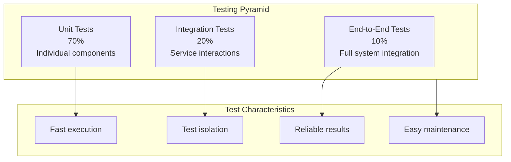

# Testing Overview

This guide covers the comprehensive testing strategy for OpenFrame OSS Tenant, including test organization, execution, and best practices for writing effective tests. OpenFrame uses a multi-layered testing approach to ensure reliability, performance, and security.

## Testing Philosophy

OpenFrame follows a testing pyramid approach that emphasizes:

### 1. Test Pyramid Structure



### 2. Testing Principles

**Fast Feedback**: Tests run quickly to enable rapid development cycles
**Isolation**: Tests don't interfere with each other or depend on external state
**Repeatability**: Tests produce consistent results across environments
**Comprehensive Coverage**: Tests cover functionality, edge cases, and error conditions
**Maintainable**: Tests are easy to understand, update, and extend

## Test Structure and Organization

### Project Test Organization

```text
src/test/java/
├── 📁 unit/                          # Unit tests
│   ├── service/                      # Service layer tests
│   ├── controller/                   # Controller tests  
│   ├── repository/                   # Repository tests
│   ├── mapper/                       # Mapper tests
│   └── util/                         # Utility tests
├── 📁 integration/                   # Integration tests
│   ├── api/                          # API integration tests
│   ├── database/                     # Database integration tests
│   ├── messaging/                    # Kafka/NATS integration tests
│   └── external/                     # External service integration tests
├── 📁 e2e/                           # End-to-end tests
│   ├── scenarios/                    # User journey tests
│   ├── api/                          # Full API workflow tests
│   └── security/                     # Security testing
└── 📁 fixtures/                      # Test data and utilities
    ├── data/                         # Test data files
    ├── builders/                     # Test data builders
    └── containers/                   # Testcontainer configurations
```

## Unit Testing

### Service Layer Testing

Unit tests focus on individual service methods with mocked dependencies:

**Example: DeviceService Unit Test**

```java
@ExtendWith(MockitoExtension.class)
class DeviceServiceTest {

    @Mock
    private DeviceRepository deviceRepository;
    
    @Mock
    private OrganizationService organizationService;
    
    @Mock
    private EventPublisher eventPublisher;
    
    @InjectMocks
    private DeviceService deviceService;
    
    private TestDataBuilder testData;
    
    @BeforeEach
    void setUp() {
        testData = new TestDataBuilder();
    }

    @Test
    @DisplayName("Should create device with valid input")
    void shouldCreateDeviceWithValidInput() {
        // Given
        String tenantId = "test-tenant";
        CreateDeviceRequest request = testData.createDeviceRequest()
            .withName("Test Device")
            .withHostname("test.device.local")
            .withDeviceType(DeviceType.DESKTOP)
            .build();
            
        Organization organization = testData.organization()
            .withTenantId(tenantId)
            .build();
            
        Device expectedDevice = testData.device()
            .withTenantId(tenantId)
            .withName(request.getName())
            .withStatus(DeviceStatus.PENDING)
            .build();

        // When
        when(organizationService.getDefaultOrganization(tenantId))
            .thenReturn(organization);
        when(deviceRepository.save(any(Device.class)))
            .thenReturn(expectedDevice);

        Device result = deviceService.createDevice(request, tenantId);

        // Then
        assertThat(result).isNotNull();
        assertThat(result.getName()).isEqualTo(request.getName());
        assertThat(result.getTenantId()).isEqualTo(tenantId);
        assertThat(result.getStatus()).isEqualTo(DeviceStatus.PENDING);
        
        // Verify repository interactions
        verify(deviceRepository).save(argThat(device -> {
            assertThat(device.getName()).isEqualTo(request.getName());
            assertThat(device.getTenantId()).isEqualTo(tenantId);
            assertThat(device.getCreatedAt()).isNotNull();
            return true;
        }));
        
        // Verify event publishing
        verify(eventPublisher).publishEvent(argThat(event -> {
            assertThat(event).isInstanceOf(DeviceCreatedEvent.class);
            DeviceCreatedEvent deviceEvent = (DeviceCreatedEvent) event;
            assertThat(deviceEvent.getDeviceId()).isEqualTo(expectedDevice.getId());
            assertThat(deviceEvent.getTenantId()).isEqualTo(tenantId);
            return true;
        }));
    }

    @Test
    @DisplayName("Should throw exception when organization not found")
    void shouldThrowExceptionWhenOrganizationNotFound() {
        // Given
        String tenantId = "test-tenant";
        CreateDeviceRequest request = testData.createDeviceRequest().build();

        // When
        when(organizationService.getDefaultOrganization(tenantId))
            .thenThrow(new OrganizationNotFoundException("No default organization found"));

        // Then
        assertThatThrownBy(() -> deviceService.createDevice(request, tenantId))
            .isInstanceOf(OrganizationNotFoundException.class)
            .hasMessage("No default organization found");
            
        // Verify no device was saved
        verify(deviceRepository, never()).save(any(Device.class));
        verify(eventPublisher, never()).publishEvent(any());
    }

    @Test
    @DisplayName("Should handle duplicate device name gracefully")
    void shouldHandleDuplicateDeviceName() {
        // Given
        String tenantId = "test-tenant";
        CreateDeviceRequest request = testData.createDeviceRequest()
            .withName("Existing Device")
            .build();

        Organization organization = testData.organization()
            .withTenantId(tenantId)
            .build();

        // When
        when(organizationService.getDefaultOrganization(tenantId))
            .thenReturn(organization);
        when(deviceRepository.save(any(Device.class)))
            .thenThrow(new DuplicateKeyException("Device name already exists"));

        // Then
        assertThatThrownBy(() -> deviceService.createDevice(request, tenantId))
            .isInstanceOf(DuplicateDeviceNameException.class)
            .hasMessage("Device with name 'Existing Device' already exists in tenant")
            .hasCauseInstanceOf(DuplicateKeyException.class);
    }

    @ParameterizedTest
    @DisplayName("Should validate device names correctly")
    @ValueSource(strings = {"", " ", "a", "name-with-invalid-chars!", "very-long-name-that-exceeds-maximum-allowed-length-for-device-names"})
    void shouldValidateDeviceNames(String invalidName) {
        // Given
        String tenantId = "test-tenant";
        CreateDeviceRequest request = testData.createDeviceRequest()
            .withName(invalidName)
            .build();

        // Then
        assertThatThrownBy(() -> deviceService.createDevice(request, tenantId))
            .isInstanceOf(InvalidDeviceNameException.class);
    }
}
```

### Controller Layer Testing

**Example: DeviceController Test with MockMVC**

```java
@WebMvcTest(DeviceController.class)
@Import({SecurityConfig.class, TestSecurityConfig.class})
class DeviceControllerTest {

    @Autowired
    private MockMvc mockMvc;

    @MockBean
    private DeviceService deviceService;

    @MockBean
    private JwtDecoder jwtDecoder;

    private TestDataBuilder testData;
    private MockedJwtToken mockJwtToken;

    @BeforeEach
    void setUp() {
        testData = new TestDataBuilder();
        mockJwtToken = new MockedJwtToken()
            .withTenantId("test-tenant")
            .withUserId("test-user")
            .withRoles("ROLE_USER")
            .withPermissions("device:read", "device:create");
    }

    @Test
    @DisplayName("Should create device successfully")
    @WithMockJwt(tenantId = "test-tenant", roles = {"USER"}, permissions = {"device:create"})
    void shouldCreateDeviceSuccessfully() throws Exception {
        // Given
        CreateDeviceRequest request = testData.createDeviceRequest()
            .withName("Test Device")
            .withHostname("test.device.local")
            .withDeviceType(DeviceType.DESKTOP)
            .build();
            
        Device createdDevice = testData.device()
            .withId("device-123")
            .withName(request.getName())
            .withTenantId("test-tenant")
            .withStatus(DeviceStatus.PENDING)
            .build();

        // When
        when(deviceService.createDevice(any(CreateDeviceRequest.class), eq("test-tenant")))
            .thenReturn(createdDevice);

        // Then
        mockMvc.perform(post("/api/devices")
                .contentType(MediaType.APPLICATION_JSON)
                .content(objectMapper.writeValueAsString(request)))
            .andExpect(status().isCreated())
            .andExpect(jsonPath("$.id").value("device-123"))
            .andExpect(jsonPath("$.name").value("Test Device"))
            .andExpect(jsonPath("$.status").value("PENDING"))
            .andExpect(jsonPath("$.tenantId").doesNotExist()) // Should not be exposed
            .andExpect(header().string("Location", "/api/devices/device-123"));

        verify(deviceService).createDevice(
            argThat(req -> req.getName().equals("Test Device")), 
            eq("test-tenant")
        );
    }

    @Test
    @DisplayName("Should return 400 for invalid device request")
    @WithMockJwt(tenantId = "test-tenant", roles = {"USER"}, permissions = {"device:create"})
    void shouldReturn400ForInvalidDeviceRequest() throws Exception {
        // Given
        CreateDeviceRequest invalidRequest = new CreateDeviceRequest();
        // Missing required fields

        // Then
        mockMvc.perform(post("/api/devices")
                .contentType(MediaType.APPLICATION_JSON)
                .content(objectMapper.writeValueAsString(invalidRequest)))
            .andExpect(status().isBadRequest())
            .andExpect(jsonPath("$.error").value("Validation failed"))
            .andExpect(jsonPath("$.violations").isArray())
            .andExpect(jsonPath("$.violations[*].field").value(
                containsInAnyOrder("name", "hostname", "deviceType")
            ));

        verify(deviceService, never()).createDevice(any(), any());
    }

    @Test
    @DisplayName("Should return 403 when user lacks create permission")
    @WithMockJwt(tenantId = "test-tenant", roles = {"USER"}, permissions = {"device:read"})
    void shouldReturn403WhenUserLacksCreatePermission() throws Exception {
        // Given
        CreateDeviceRequest request = testData.createDeviceRequest().build();

        // Then
        mockMvc.perform(post("/api/devices")
                .contentType(MediaType.APPLICATION_JSON)
                .content(objectMapper.writeValueAsString(request)))
            .andExpect(status().isForbidden())
            .andExpect(jsonPath("$.error").value("Access denied"))
            .andExpect(jsonPath("$.message").value("Insufficient permissions"));

        verify(deviceService, never()).createDevice(any(), any());
    }

    @Test
    @DisplayName("Should get devices with tenant filtering")
    @WithMockJwt(tenantId = "test-tenant", roles = {"USER"}, permissions = {"device:read"})
    void shouldGetDevicesWithTenantFiltering() throws Exception {
        // Given
        List<Device> devices = Arrays.asList(
            testData.device().withId("device-1").withName("Device 1").build(),
            testData.device().withId("device-2").withName("Device 2").build()
        );

        // When
        when(deviceService.getDevicesForTenant("test-tenant", any(Pageable.class)))
            .thenReturn(new PageImpl<>(devices));

        // Then
        mockMvc.perform(get("/api/devices")
                .param("page", "0")
                .param("size", "10")
                .param("sort", "name,asc"))
            .andExpect(status().isOk())
            .andExpect(jsonPath("$.content").isArray())
            .andExpect(jsonPath("$.content", hasSize(2)))
            .andExpect(jsonPath("$.content[0].id").value("device-1"))
            .andExpect(jsonPath("$.content[1].id").value("device-2"))
            .andExpect(jsonPath("$.totalElements").value(2));

        verify(deviceService).getDevicesForTenant(
            eq("test-tenant"),
            argThat(pageable -> {
                assertThat(pageable.getPageNumber()).isEqualTo(0);
                assertThat(pageable.getPageSize()).isEqualTo(10);
                assertThat(pageable.getSort().toString()).contains("name: ASC");
                return true;
            })
        );
    }
}
```

### Repository Layer Testing

**Example: Custom Repository Test with Testcontainers**

```java
@DataMongoTest
@Testcontainers
class CustomDeviceRepositoryTest {

    @Container
    static MongoDBContainer mongoDBContainer = new MongoDBContainer("mongo:6.0")
        .withReuse(true);

    @Autowired
    private TestEntityManager entityManager;

    @Autowired
    private DeviceRepository deviceRepository;

    private TestDataBuilder testData;

    @DynamicPropertySource
    static void configureProperties(DynamicPropertyRegistry registry) {
        registry.add("spring.data.mongodb.uri", mongoDBContainer::getReplicaSetUrl);
    }

    @BeforeEach
    void setUp() {
        testData = new TestDataBuilder();
        // Clean database before each test
        deviceRepository.deleteAll();
    }

    @Test
    @DisplayName("Should find devices by tenant and status")
    void shouldFindDevicesByTenantAndStatus() {
        // Given
        String tenantId = "test-tenant";
        String otherTenantId = "other-tenant";

        List<Device> tenantDevices = Arrays.asList(
            testData.device()
                .withTenantId(tenantId)
                .withStatus(DeviceStatus.ACTIVE)
                .withName("Active Device 1")
                .build(),
            testData.device()
                .withTenantId(tenantId)
                .withStatus(DeviceStatus.ACTIVE)
                .withName("Active Device 2")
                .build(),
            testData.device()
                .withTenantId(tenantId)
                .withStatus(DeviceStatus.INACTIVE)
                .withName("Inactive Device")
                .build()
        );

        List<Device> otherTenantDevices = Arrays.asList(
            testData.device()
                .withTenantId(otherTenantId)
                .withStatus(DeviceStatus.ACTIVE)
                .withName("Other Tenant Device")
                .build()
        );

        // Save test data
        deviceRepository.saveAll(tenantDevices);
        deviceRepository.saveAll(otherTenantDevices);

        // When
        List<Device> activeDevices = deviceRepository
            .findByTenantIdAndStatus(tenantId, DeviceStatus.ACTIVE);

        // Then
        assertThat(activeDevices)
            .hasSize(2)
            .extracting(Device::getName)
            .containsExactlyInAnyOrder("Active Device 1", "Active Device 2");

        assertThat(activeDevices)
            .allMatch(device -> device.getTenantId().equals(tenantId))
            .allMatch(device -> device.getStatus() == DeviceStatus.ACTIVE);
    }

    @Test
    @DisplayName("Should search devices with complex filters")
    void shouldSearchDevicesWithComplexFilters() {
        // Given
        String tenantId = "test-tenant";
        Instant now = Instant.now();
        Instant oneHourAgo = now.minus(1, ChronoUnit.HOURS);
        Instant twoHoursAgo = now.minus(2, ChronoUnit.HOURS);

        List<Device> devices = Arrays.asList(
            testData.device()
                .withTenantId(tenantId)
                .withName("Web Server")
                .withDeviceType(DeviceType.SERVER)
                .withLastSeen(now)
                .build(),
            testData.device()
                .withTenantId(tenantId)
                .withName("Database Server")
                .withDeviceType(DeviceType.SERVER)
                .withLastSeen(oneHourAgo)
                .build(),
            testData.device()
                .withTenantId(tenantId)
                .withName("User Desktop")
                .withDeviceType(DeviceType.DESKTOP)
                .withLastSeen(twoHoursAgo)
                .build()
        );

        deviceRepository.saveAll(devices);

        // Create search criteria
        DeviceSearchCriteria criteria = DeviceSearchCriteria.builder()
            .deviceType(DeviceType.SERVER)
            .nameContains("Server")
            .lastSeenAfter(oneHourAgo.minus(5, ChronoUnit.MINUTES))
            .build();

        // When
        List<Device> results = deviceRepository.searchDevices(criteria, tenantId);

        // Then
        assertThat(results)
            .hasSize(2)
            .extracting(Device::getName)
            .containsExactlyInAnyOrder("Web Server", "Database Server");

        assertThat(results)
            .allMatch(device -> device.getDeviceType() == DeviceType.SERVER)
            .allMatch(device -> device.getName().contains("Server"))
            .allMatch(device -> device.getLastSeen().isAfter(
                oneHourAgo.minus(5, ChronoUnit.MINUTES)
            ));
    }

    @Test
    @DisplayName("Should handle pagination correctly")
    void shouldHandlePaginationCorrectly() {
        // Given
        String tenantId = "test-tenant";
        List<Device> devices = IntStream.range(1, 26) // 25 devices
            .mapToObj(i -> testData.device()
                .withTenantId(tenantId)
                .withName("Device " + String.format("%02d", i))
                .build())
            .collect(Collectors.toList());

        deviceRepository.saveAll(devices);

        // When - Get first page
        Pageable firstPage = PageRequest.of(0, 10, Sort.by("name"));
        Page<Device> firstResult = deviceRepository.findByTenantId(tenantId, firstPage);

        // Then - First page
        assertThat(firstResult.getContent()).hasSize(10);
        assertThat(firstResult.getTotalElements()).isEqualTo(25);
        assertThat(firstResult.getTotalPages()).isEqualTo(3);
        assertThat(firstResult.isFirst()).isTrue();
        assertThat(firstResult.hasNext()).isTrue();

        // When - Get last page
        Pageable lastPage = PageRequest.of(2, 10, Sort.by("name"));
        Page<Device> lastResult = deviceRepository.findByTenantId(tenantId, lastPage);

        // Then - Last page
        assertThat(lastResult.getContent()).hasSize(5); // Remaining devices
        assertThat(lastResult.isLast()).isTrue();
        assertThat(lastResult.hasPrevious()).isTrue();
    }
}
```

## Integration Testing

### API Integration Testing

**Example: Full API Integration Test**

```java
@SpringBootTest(webEnvironment = SpringBootTest.WebEnvironment.RANDOM_PORT)
@Testcontainers
@TestPropertySource(properties = {
    "spring.profiles.active=test",
    "logging.level.com.openframe=DEBUG"
})
class DeviceApiIntegrationTest {

    @Container
    static MongoDBContainer mongoDBContainer = new MongoDBContainer("mongo:6.0")
        .withReuse(true);

    @Container  
    static KafkaContainer kafkaContainer = new KafkaContainer(
        DockerImageName.parse("confluentinc/cp-kafka:7.4.0")
    ).withReuse(true);

    @Autowired
    private TestRestTemplate restTemplate;

    @Autowired
    private TestEntityManager entityManager;

    @Autowired
    private JwtTokenGenerator tokenGenerator;

    @Autowired
    private KafkaTemplate<String, Object> kafkaTemplate;

    @EventListener
    @TestEventListener
    private List<DeviceCreatedEvent> capturedEvents = new ArrayList<>();

    private String validAccessToken;
    private TestDataBuilder testData;

    @DynamicPropertySource
    static void configureProperties(DynamicPropertyRegistry registry) {
        registry.add("spring.data.mongodb.uri", mongoDBContainer::getReplicaSetUrl);
        registry.add("spring.kafka.bootstrap-servers", kafkaContainer::getBootstrapServers);
    }

    @BeforeEach
    void setUp() {
        testData = new TestDataBuilder();
        capturedEvents.clear();
        
        // Generate valid JWT token for testing
        validAccessToken = tokenGenerator.generateToken(
            "test-user",
            "test-tenant", 
            List.of("ROLE_USER"),
            List.of("device:read", "device:create", "device:update", "device:delete")
        );
    }

    @Test
    @DisplayName("Should create, read, update, and delete device")
    void shouldPerformDeviceCRUDOperations() {
        // CREATE
        CreateDeviceRequest createRequest = testData.createDeviceRequest()
            .withName("Integration Test Device")
            .withHostname("integration.test.local")
            .withDeviceType(DeviceType.SERVER)
            .build();

        HttpHeaders headers = createAuthHeaders(validAccessToken);
        HttpEntity<CreateDeviceRequest> createEntity = new HttpEntity<>(createRequest, headers);

        ResponseEntity<DeviceResponse> createResponse = restTemplate.exchange(
            "/api/devices",
            HttpMethod.POST,
            createEntity,
            DeviceResponse.class
        );

        // Verify creation
        assertThat(createResponse.getStatusCode()).isEqualTo(HttpStatus.CREATED);
        assertThat(createResponse.getHeaders().getLocation()).isNotNull();
        
        DeviceResponse createdDevice = createResponse.getBody();
        assertThat(createdDevice).isNotNull();
        assertThat(createdDevice.getId()).isNotNull();
        assertThat(createdDevice.getName()).isEqualTo("Integration Test Device");
        assertThat(createdDevice.getStatus()).isEqualTo(DeviceStatus.PENDING);

        // Verify event was published
        await().atMost(5, SECONDS).untilAsserted(() -> {
            assertThat(capturedEvents)
                .hasSize(1)
                .first()
                .satisfies(event -> {
                    assertThat(event.getDeviceId()).isEqualTo(createdDevice.getId());
                    assertThat(event.getTenantId()).isEqualTo("test-tenant");
                });
        });

        String deviceId = createdDevice.getId();

        // READ
        HttpEntity<Void> getEntity = new HttpEntity<>(headers);
        ResponseEntity<DeviceResponse> getResponse = restTemplate.exchange(
            "/api/devices/{deviceId}",
            HttpMethod.GET,
            getEntity,
            DeviceResponse.class,
            deviceId
        );

        assertThat(getResponse.getStatusCode()).isEqualTo(HttpStatus.OK);
        DeviceResponse retrievedDevice = getResponse.getBody();
        assertThat(retrievedDevice).isNotNull();
        assertThat(retrievedDevice.getId()).isEqualTo(deviceId);
        assertThat(retrievedDevice.getName()).isEqualTo("Integration Test Device");

        // UPDATE
        UpdateDeviceRequest updateRequest = UpdateDeviceRequest.builder()
            .name("Updated Device Name")
            .description("Updated description")
            .build();

        HttpEntity<UpdateDeviceRequest> updateEntity = new HttpEntity<>(updateRequest, headers);
        ResponseEntity<DeviceResponse> updateResponse = restTemplate.exchange(
            "/api/devices/{deviceId}",
            HttpMethod.PUT,
            updateEntity,
            DeviceResponse.class,
            deviceId
        );

        assertThat(updateResponse.getStatusCode()).isEqualTo(HttpStatus.OK);
        DeviceResponse updatedDevice = updateResponse.getBody();
        assertThat(updatedDevice).isNotNull();
        assertThat(updatedDevice.getName()).isEqualTo("Updated Device Name");
        assertThat(updatedDevice.getDescription()).isEqualTo("Updated description");

        // DELETE
        HttpEntity<Void> deleteEntity = new HttpEntity<>(headers);
        ResponseEntity<Void> deleteResponse = restTemplate.exchange(
            "/api/devices/{deviceId}",
            HttpMethod.DELETE,
            deleteEntity,
            Void.class,
            deviceId
        );

        assertThat(deleteResponse.getStatusCode()).isEqualTo(HttpStatus.NO_CONTENT);

        // Verify deletion
        ResponseEntity<DeviceResponse> getDeletedResponse = restTemplate.exchange(
            "/api/devices/{deviceId}",
            HttpMethod.GET,
            getEntity,
            DeviceResponse.class,
            deviceId
        );

        assertThat(getDeletedResponse.getStatusCode()).isEqualTo(HttpStatus.NOT_FOUND);
    }

    @Test
    @DisplayName("Should enforce tenant isolation")
    void shouldEnforceTenantIsolation() {
        // Create device for first tenant
        String tenant1Token = tokenGenerator.generateToken(
            "user1", "tenant-1", List.of("ROLE_USER"), List.of("device:create", "device:read")
        );
        
        CreateDeviceRequest request = testData.createDeviceRequest()
            .withName("Tenant 1 Device")
            .build();

        HttpEntity<CreateDeviceRequest> createEntity = new HttpEntity<>(
            request, 
            createAuthHeaders(tenant1Token)
        );

        ResponseEntity<DeviceResponse> createResponse = restTemplate.exchange(
            "/api/devices",
            HttpMethod.POST,
            createEntity,
            DeviceResponse.class
        );

        assertThat(createResponse.getStatusCode()).isEqualTo(HttpStatus.CREATED);
        String deviceId = createResponse.getBody().getId();

        // Try to access device from second tenant
        String tenant2Token = tokenGenerator.generateToken(
            "user2", "tenant-2", List.of("ROLE_USER"), List.of("device:read")
        );

        HttpEntity<Void> getEntity = new HttpEntity<>(createAuthHeaders(tenant2Token));
        ResponseEntity<DeviceResponse> getResponse = restTemplate.exchange(
            "/api/devices/{deviceId}",
            HttpMethod.GET,
            getEntity,
            DeviceResponse.class,
            deviceId
        );

        // Should not be able to access other tenant's device
        assertThat(getResponse.getStatusCode()).isEqualTo(HttpStatus.NOT_FOUND);
    }

    @TestEventListener
    public void handleDeviceCreatedEvent(DeviceCreatedEvent event) {
        capturedEvents.add(event);
    }

    private HttpHeaders createAuthHeaders(String accessToken) {
        HttpHeaders headers = new HttpHeaders();
        headers.setContentType(MediaType.APPLICATION_JSON);
        headers.setBearerAuth(accessToken);
        return headers;
    }
}
```

### Database Integration Testing

**Example: MongoDB Integration Test with Transactions**

```java
@DataMongoTest
@Testcontainers
class DeviceRepositoryIntegrationTest {

    @Container
    static MongoDBContainer mongoDBContainer = new MongoDBContainer("mongo:6.0")
        .withReuse(true);

    @Autowired
    private MongoTemplate mongoTemplate;

    @Autowired
    private DeviceRepository deviceRepository;

    @Autowired
    private OrganizationRepository organizationRepository;

    private TestDataBuilder testData;

    @DynamicPropertySource
    static void configureProperties(DynamicPropertyRegistry registry) {
        registry.add("spring.data.mongodb.uri", mongoDBContainer::getReplicaSetUrl);
    }

    @BeforeEach
    void setUp() {
        testData = new TestDataBuilder();
        
        // Clean all collections
        mongoTemplate.getCollectionNames()
            .forEach(mongoTemplate::dropCollection);
    }

    @Test
    @DisplayName("Should maintain referential integrity")
    @Transactional
    void shouldMaintainReferentialIntegrity() {
        // Given
        String tenantId = "test-tenant";
        
        Organization organization = testData.organization()
            .withTenantId(tenantId)
            .withName("Test Organization")
            .build();
        
        organization = organizationRepository.save(organization);

        Device device = testData.device()
            .withTenantId(tenantId)
            .withOrganizationId(organization.getId())
            .withName("Test Device")
            .build();

        // When
        Device savedDevice = deviceRepository.save(device);

        // Then
        assertThat(savedDevice.getId()).isNotNull();
        assertThat(savedDevice.getOrganizationId()).isEqualTo(organization.getId());

        // Verify we can query by organization
        List<Device> orgDevices = deviceRepository
            .findByTenantIdAndOrganizationId(tenantId, organization.getId());
        
        assertThat(orgDevices)
            .hasSize(1)
            .first()
            .satisfies(d -> {
                assertThat(d.getId()).isEqualTo(savedDevice.getId());
                assertThat(d.getName()).isEqualTo("Test Device");
            });
    }

    @Test
    @DisplayName("Should handle concurrent device creation")
    void shouldHandleConcurrentDeviceCreation() throws Exception {
        // Given
        String tenantId = "test-tenant";
        int concurrentThreads = 10;
        int devicesPerThread = 5;
        
        ExecutorService executor = Executors.newFixedThreadPool(concurrentThreads);
        CountDownLatch latch = new CountDownLatch(concurrentThreads);
        AtomicInteger successCount = new AtomicInteger(0);
        AtomicInteger errorCount = new AtomicInteger(0);

        // When
        for (int i = 0; i < concurrentThreads; i++) {
            final int threadId = i;
            executor.submit(() -> {
                try {
                    for (int j = 0; j < devicesPerThread; j++) {
                        Device device = testData.device()
                            .withTenantId(tenantId)
                            .withName(String.format("Device-%d-%d", threadId, j))
                            .withHostname(String.format("device-%d-%d.test.local", threadId, j))
                            .build();
                        
                        deviceRepository.save(device);
                        successCount.incrementAndGet();
                    }
                } catch (Exception e) {
                    errorCount.incrementAndGet();
                    e.printStackTrace();
                } finally {
                    latch.countDown();
                }
            });
        }

        // Wait for all threads to complete
        latch.await(30, TimeUnit.SECONDS);
        executor.shutdown();

        // Then
        assertThat(successCount.get()).isEqualTo(concurrentThreads * devicesPerThread);
        assertThat(errorCount.get()).isEqualTo(0);

        // Verify all devices were saved
        List<Device> allDevices = deviceRepository.findByTenantId(tenantId);
        assertThat(allDevices).hasSize(concurrentThreads * devicesPerThread);
        
        // Verify no duplicate names
        Set<String> uniqueNames = allDevices.stream()
            .map(Device::getName)
            .collect(Collectors.toSet());
        assertThat(uniqueNames).hasSize(concurrentThreads * devicesPerThread);
    }
}
```

## Running Tests

### Maven Test Execution

**Run All Tests:**
```bash
# Run all test types
mvn test

# Run tests with coverage
mvn test jacoco:report

# Run tests in specific module
mvn test -pl openframe/services/openframe-api

# Run tests with specific profile
mvn test -Dspring.profiles.active=test
```

**Run Specific Test Types:**
```bash
# Unit tests only
mvn test -Dtest="*Test"

# Integration tests only  
mvn test -Dtest="*IntegrationTest"

# End-to-end tests
mvn test -Dtest="*E2ETest"

# Run specific test class
mvn test -Dtest=DeviceServiceTest

# Run specific test method
mvn test -Dtest=DeviceServiceTest#shouldCreateDeviceWithValidInput
```

### IDE Test Execution

**IntelliJ IDEA:**
- Right-click on test class/method → "Run Test"
- Use keyboard shortcut: `Ctrl+Shift+F10` (Windows/Linux) or `Cmd+Shift+R` (Mac)
- Run with coverage: `Ctrl+Shift+F10` with coverage option

**VS Code:**
- Use Java Test Runner extension
- Click "Run Test" code lens above test methods
- Use Command Palette: `Java: Run Tests`

### Continuous Integration

**GitHub Actions Test Pipeline:**
```yaml
name: Test Suite
on: [push, pull_request]

jobs:
  test:
    runs-on: ubuntu-latest
    
    services:
      mongodb:
        image: mongo:6.0
        ports:
          - 27017:27017
      kafka:
        image: confluentinc/cp-kafka:7.4.0
        ports:
          - 9092:9092
        env:
          KAFKA_ZOOKEEPER_CONNECT: zookeeper:2181
          KAFKA_ADVERTISED_LISTENERS: PLAINTEXT://localhost:9092
      
    steps:
    - uses: actions/checkout@v3
    
    - name: Set up JDK 21
      uses: actions/setup-java@v3
      with:
        java-version: '21'
        distribution: 'temurin'
        
    - name: Cache Maven dependencies
      uses: actions/cache@v3
      with:
        path: ~/.m2
        key: ${{ runner.os }}-m2-${{ hashFiles('**/pom.xml') }}
        
    - name: Run tests
      run: |
        mvn clean test -B \
          -Dspring.profiles.active=test \
          -Dtestcontainers.reuse.enable=false
          
    - name: Generate test report
      run: mvn jacoco:report
      
    - name: Upload coverage to Codecov
      uses: codecov/codecov-action@v3
      with:
        file: ./target/site/jacoco/jacoco.xml
```

## Writing New Tests

### Test Data Builders

**Example: TestDataBuilder Pattern**

```java
public class TestDataBuilder {

    // Device Builder
    public DeviceBuilder device() {
        return new DeviceBuilder();
    }

    // Organization Builder  
    public OrganizationBuilder organization() {
        return new OrganizationBuilder();
    }

    // Request Builders
    public CreateDeviceRequestBuilder createDeviceRequest() {
        return new CreateDeviceRequestBuilder();
    }

    // Device Builder Implementation
    public static class DeviceBuilder {
        private Device device;

        public DeviceBuilder() {
            this.device = new Device();
            // Set sensible defaults
            this.device.setId(UUID.randomUUID().toString());
            this.device.setName("Test Device");
            this.device.setHostname("test.device.local");
            this.device.setDeviceType(DeviceType.DESKTOP);
            this.device.setStatus(DeviceStatus.ACTIVE);
            this.device.setTenantId("default-tenant");
            this.device.setCreatedAt(Instant.now());
            this.device.setUpdatedAt(Instant.now());
        }

        public DeviceBuilder withId(String id) {
            this.device.setId(id);
            return this;
        }

        public DeviceBuilder withName(String name) {
            this.device.setName(name);
            return this;
        }

        public DeviceBuilder withTenantId(String tenantId) {
            this.device.setTenantId(tenantId);
            return this;
        }

        public DeviceBuilder withStatus(DeviceStatus status) {
            this.device.setStatus(status);
            return this;
        }

        public DeviceBuilder withDeviceType(DeviceType deviceType) {
            this.device.setDeviceType(deviceType);
            return this;
        }

        public DeviceBuilder withLastSeen(Instant lastSeen) {
            this.device.setLastSeen(lastSeen);
            return this;
        }

        public Device build() {
            return this.device;
        }
    }

    // Similar builders for other entities...
}
```

### Custom Test Annotations

**Example: Security Test Annotations**

```java
@Target({ElementType.METHOD, ElementType.TYPE})
@Retention(RetentionPolicy.RUNTIME)
@WithSecurityContext(factory = WithMockJwtSecurityContextFactory.class)
public @interface WithMockJwt {
    String userId() default "test-user";
    String tenantId() default "test-tenant";
    String[] roles() default {"USER"};
    String[] permissions() default {};
}

public class WithMockJwtSecurityContextFactory 
    implements WithSecurityContextFactory<WithMockJwt> {

    @Override
    public SecurityContext createSecurityContext(WithMockJwt annotation) {
        SecurityContext context = SecurityContextHolder.createEmptyContext();
        
        TenantAuthenticationPrincipal principal = new TenantAuthenticationPrincipal(
            annotation.userId(),
            annotation.tenantId(),
            "test.tenant.local",
            Arrays.asList(annotation.roles()),
            Arrays.asList(annotation.permissions())
        );
        
        Collection<GrantedAuthority> authorities = Arrays.stream(annotation.roles())
            .map(role -> new SimpleGrantedAuthority("ROLE_" + role))
            .collect(Collectors.toList());
            
        JwtAuthenticationToken auth = new JwtAuthenticationToken(
            createMockJwt(annotation), authorities, principal
        );
        
        context.setAuthentication(auth);
        return context;
    }

    private Jwt createMockJwt(WithMockJwt annotation) {
        return Jwt.withTokenValue("mock.jwt.token")
            .header("alg", "RS256")
            .claim("sub", annotation.userId())
            .claim("tenant_id", annotation.tenantId())
            .claim("user_roles", Arrays.asList(annotation.roles()))
            .claim("permissions", Arrays.asList(annotation.permissions()))
            .build();
    }
}
```

## Test Coverage Requirements

### Coverage Targets

| Layer | Minimum Coverage | Target Coverage |
|-------|-----------------|-----------------|
| **Service Layer** | 85% | 90%+ |
| **Controller Layer** | 80% | 85%+ |
| **Repository Layer** | 75% | 80%+ |
| **Utility Classes** | 90% | 95%+ |
| **Overall Project** | 80% | 85%+ |

### Coverage Exclusions

**Exclude from coverage:**
- Configuration classes
- Entity/DTO classes (data holders)
- Application main methods
- Generated code
- Test utilities and fixtures

**Maven Configuration:**
```xml
<plugin>
    <groupId>org.jacoco</groupId>
    <artifactId>jacoco-maven-plugin</artifactId>
    <version>0.8.8</version>
    <configuration>
        <excludes>
            <!-- Configuration classes -->
            <exclude>**/config/**/*</exclude>
            <!-- DTOs and entities -->
            <exclude>**/dto/**/*</exclude>
            <exclude>**/entity/**/*</exclude>
            <!-- Application main classes -->
            <exclude>**/*Application.*</exclude>
            <!-- Generated code -->
            <exclude>**/generated/**/*</exclude>
        </excludes>
    </configuration>
    <executions>
        <execution>
            <goals>
                <goal>prepare-agent</goal>
            </goals>
        </execution>
        <execution>
            <id>report</id>
            <phase>test</phase>
            <goals>
                <goal>report</goal>
            </goals>
        </execution>
    </executions>
</plugin>
```

## Best Practices Summary

### Unit Testing Best Practices
1. **Follow AAA Pattern**: Arrange, Act, Assert
2. **Test One Thing**: Each test should verify one specific behavior
3. **Use Descriptive Names**: Test names should explain what is being tested
4. **Mock External Dependencies**: Unit tests should be isolated
5. **Use Test Data Builders**: Create reusable test data factories
6. **Test Edge Cases**: Include boundary conditions and error scenarios

### Integration Testing Best Practices
1. **Use Testcontainers**: Ensure consistent test environments
2. **Test Service Interactions**: Verify services work together correctly
3. **Verify Data Persistence**: Ensure data is saved and retrieved correctly
4. **Test Security**: Verify authentication and authorization
5. **Use Real Data**: Test with realistic data volumes and scenarios

### General Testing Best Practices
1. **Keep Tests Fast**: Optimize for quick feedback cycles
2. **Make Tests Deterministic**: Tests should produce consistent results
3. **Maintain Test Independence**: Tests shouldn't depend on each other
4. **Clean Up Resources**: Properly clean up after tests
5. **Document Complex Tests**: Add comments for complex test scenarios
6. **Regular Test Maintenance**: Keep tests updated with code changes

### Performance Testing Considerations
1. **Database Query Performance**: Test slow queries and optimization
2. **Concurrent Access**: Test multi-threaded scenarios
3. **Memory Usage**: Monitor memory consumption during tests
4. **Network Latency**: Consider network delays in integration tests

## Troubleshooting Common Issues

### Test Container Issues
```bash
# Restart Docker daemon
sudo systemctl restart docker

# Clean up test containers
docker container prune -f
docker volume prune -f

# Check container logs
docker logs <container_id>
```

### MongoDB Test Issues
```bash
# Verify MongoDB container
docker exec -it <mongodb_container> mongosh

# Check database connections
docker exec <mongodb_container> netstat -tlnp
```

### Memory Issues
```bash
# Increase test JVM memory
export MAVEN_OPTS="-Xmx4g -XX:MaxPermSize=512m"

# Run tests with memory profiling
mvn test -Dspring.profiles.active=test -Dmaven.surefire.debug
```

## Summary

OpenFrame OSS Tenant uses a comprehensive testing strategy that includes:

- **Unit tests** for individual component verification
- **Integration tests** for service interaction validation
- **End-to-end tests** for complete user journey verification
- **Security tests** for authentication and authorization validation
- **Performance tests** for scalability and reliability assurance

The testing framework provides:
- **Fast feedback** through parallel test execution
- **Reliable results** using Testcontainers for consistent environments
- **Comprehensive coverage** across all application layers
- **Security validation** through specialized security testing
- **Performance monitoring** through load and stress testing

**Key Testing Tools:**
- **JUnit 5** for test framework
- **Mockito** for mocking and verification
- **Testcontainers** for integration testing
- **Spring Boot Test** for application context testing
- **AssertJ** for fluent assertions
- **JaCoCo** for test coverage reporting

For testing support and questions, join the [OpenMSP Slack community](https://join.slack.com/t/openmsp/shared_invite/zt-36bl7mx0h-3~U2nFH6nqHqoTPXMaHEHA).