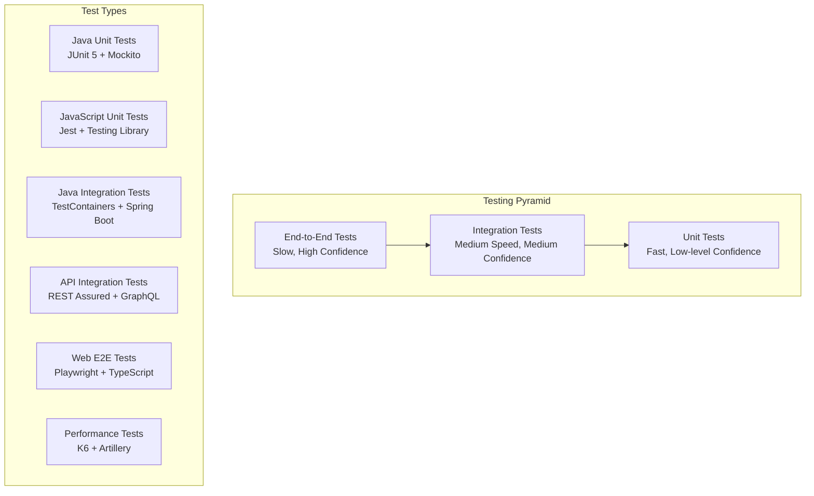

# Testing Overview

OpenFrame employs a comprehensive testing strategy covering unit tests, integration tests, end-to-end tests, and performance testing. This guide explains the testing architecture, tools, patterns, and best practices.

## Testing Strategy

OpenFrame uses a multi-layered testing approach aligned with the testing pyramid:



### Testing Principles

1. **Fast Feedback**: Unit tests run in under 30 seconds
2. **Reliable**: Tests are deterministic and don't flake
3. **Maintainable**: Tests are easy to understand and update
4. **Comprehensive**: Critical paths have high test coverage
5. **Realistic**: Integration tests use real dependencies when possible

## Test Structure & Organization

### Backend Test Structure

```text
openframe/services/openframe-api/src/test/java/
├── com/openframe/api/
│   ├── controller/          # Controller unit tests
│   │   ├── OrganizationControllerTest.java
│   │   ├── DeviceControllerTest.java
│   │   └── UserControllerTest.java
│   ├── service/            # Service layer unit tests  
│   │   ├── OrganizationServiceTest.java
│   │   ├── DeviceServiceTest.java
│   │   └── UserServiceTest.java
│   ├── repository/         # Repository integration tests
│   │   ├── OrganizationRepositoryTest.java
│   │   └── DeviceRepositoryTest.java
│   ├── integration/        # Full integration tests
│   │   ├── OrganizationIntegrationTest.java
│   │   ├── DeviceIntegrationTest.java
│   │   └── AuthenticationIntegrationTest.java
│   ├── util/               # Test utilities
│   │   ├── TestDataBuilder.java
│   │   └── MockAuthenticationManager.java
│   └── config/             # Test configuration
│       └── TestConfig.java
└── resources/
    ├── application-test.yml
    └── test-data/
```

### Frontend Test Structure

```text
openframe/services/openframe-frontend/src/
├── __tests__/              # Global test setup
│   ├── setup.ts
│   └── test-utils.tsx
├── app/
│   ├── devices/
│   │   ├── __tests__/      # Page-level tests
│   │   │   ├── DevicesPage.test.tsx
│   │   │   └── DeviceDetails.test.tsx
│   │   ├── components/
│   │   │   ├── __tests__/  # Component tests
│   │   │   │   ├── DeviceCard.test.tsx
│   │   │   │   └── DeviceTable.test.tsx
│   │   └── hooks/
│   │       └── __tests__/  # Hook tests
│   │           └── useDevices.test.ts
└── e2e/                    # End-to-end tests
    ├── devices.spec.ts
    ├── authentication.spec.ts
    └── organizations.spec.ts
```

## Unit Testing

### Backend Unit Tests (Java)

**Controller Testing with MockMvc:**

```java
@WebMvcTest(OrganizationController.class)
@Import(TestConfig.class)
class OrganizationControllerTest {
    
    @Autowired
    private MockMvc mockMvc;
    
    @MockBean
    private OrganizationService organizationService;
    
    @Test
    @WithMockUser(authorities = "organization:write")
    void shouldCreateOrganization() throws Exception {
        // Given
        CreateOrganizationRequest request = TestDataBuilder.createOrganizationRequest();
        Organization expectedOrg = TestDataBuilder.organization().build();
        
        when(organizationService.createOrganization(any(), any()))
            .thenReturn(expectedOrg);
        
        // When & Then
        mockMvc.perform(post("/api/organizations")
                .contentType(MediaType.APPLICATION_JSON)
                .content(objectMapper.writeValueAsString(request)))
                .andExpect(status().isOk())
                .andExpect(jsonPath("$.id").value(expectedOrg.getId()))
                .andExpect(jsonPath("$.name").value(expectedOrg.getName()));
        
        verify(organizationService).createOrganization(eq(request), any());
    }
    
    @Test
    void shouldRequireAuthentication() throws Exception {
        CreateOrganizationRequest request = TestDataBuilder.createOrganizationRequest();
        
        mockMvc.perform(post("/api/organizations")
                .contentType(MediaType.APPLICATION_JSON)
                .content(objectMapper.writeValueAsString(request)))
                .andExpect(status().isUnauthorized());
    }
    
    @Test
    @WithMockUser(authorities = "organization:read")
    void shouldForbidCreateWithoutWritePermission() throws Exception {
        CreateOrganizationRequest request = TestDataBuilder.createOrganizationRequest();
        
        mockMvc.perform(post("/api/organizations")
                .contentType(MediaType.APPLICATION_JSON)
                .content(objectMapper.writeValueAsString(request)))
                .andExpected(status().isForbidden());
    }
}
```

**Service Layer Testing:**

```java
@ExtendWith(MockitoExtension.class)
class OrganizationServiceTest {
    
    @Mock
    private OrganizationRepository organizationRepository;
    
    @Mock
    private OrganizationProcessor organizationProcessor;
    
    @InjectMocks
    private OrganizationService organizationService;
    
    @Test
    void shouldCreateOrganization() {
        // Given
        String tenantId = "tenant-123";
        CreateOrganizationRequest request = TestDataBuilder.createOrganizationRequest();
        Organization savedOrganization = TestDataBuilder.organization()
            .tenantId(tenantId)
            .name(request.getName())
            .build();
        
        when(organizationRepository.save(any(Organization.class)))
            .thenReturn(savedOrganization);
        
        // When
        Organization result = organizationService.createOrganization(request, tenantId);
        
        // Then
        assertThat(result.getName()).isEqualTo(request.getName());
        assertThat(result.getTenantId()).isEqualTo(tenantId);
        
        verify(organizationProcessor).processCreation(savedOrganization);
        verify(organizationRepository).save(argThat(org -> 
            org.getName().equals(request.getName()) &&
            org.getTenantId().equals(tenantId)
        ));
    }
    
    @Test
    void shouldThrowExceptionWhenOrganizationNotFound() {
        // Given
        String orgId = "non-existent-id";
        String tenantId = "tenant-123";
        
        when(organizationRepository.findByIdAndTenantId(orgId, tenantId))
            .thenReturn(null);
        
        // When & Then
        assertThatThrownBy(() -> organizationService.getOrganization(orgId, tenantId))
            .isInstanceOf(OrganizationNotFoundException.class)
            .hasMessage("Organization not found: " + orgId);
    }
}
```

### Frontend Unit Tests (TypeScript/React)

**Component Testing:**

```typescript
// DeviceCard.test.tsx
import { render, screen, fireEvent } from '@testing-library/react';
import { DeviceCard } from '../DeviceCard';
import { Device } from '@/types/device';

const mockDevice: Device = {
  id: 'device-123',
  name: 'Test Device',
  status: 'online',
  lastSeen: new Date('2024-01-15T10:00:00Z'),
  organization: {
    id: 'org-123',
    name: 'Test Organization'
  }
};

describe('DeviceCard', () => {
  it('should display device information', () => {
    const onSelect = jest.fn();
    
    render(<DeviceCard device={mockDevice} onSelect={onSelect} />);
    
    expect(screen.getByText('Test Device')).toBeInTheDocument();
    expect(screen.getByText('Test Organization')).toBeInTheDocument();
    expect(screen.getByText('online')).toBeInTheDocument();
  });
  
  it('should call onSelect when clicked', () => {
    const onSelect = jest.fn();
    
    render(<DeviceCard device={mockDevice} onSelect={onSelect} />);
    
    fireEvent.click(screen.getByRole('button'));
    
    expect(onSelect).toHaveBeenCalledWith(mockDevice);
  });
  
  it('should show offline status with warning style', () => {
    const offlineDevice = { ...mockDevice, status: 'offline' };
    
    render(<DeviceCard device={offlineDevice} onSelect={jest.fn()} />);
    
    const statusElement = screen.getByText('offline');
    expect(statusElement).toHaveClass('text-red-600');
  });
});
```

**Hook Testing:**

```typescript
// useDevices.test.ts
import { renderHook, waitFor } from '@testing-library/react';
import { QueryClient, QueryClientProvider } from '@tanstack/react-query';
import { useDevices } from '../useDevices';
import { apiClient } from '@/lib/api-client';

jest.mock('@/lib/api-client');

const createWrapper = () => {
  const queryClient = new QueryClient({
    defaultOptions: {
      queries: { retry: false },
    },
  });
  
  return ({ children }: { children: React.ReactNode }) => (
    <QueryClientProvider client={queryClient}>
      {children}
    </QueryClientProvider>
  );
};

describe('useDevices', () => {
  beforeEach(() => {
    jest.clearAllMocks();
  });
  
  it('should fetch devices successfully', async () => {
    const mockDevices = [
      { id: 'device-1', name: 'Device 1', status: 'online' },
      { id: 'device-2', name: 'Device 2', status: 'offline' }
    ];
    
    (apiClient.get as jest.Mock).mockResolvedValue({ data: mockDevices });
    
    const { result } = renderHook(() => useDevices({ organizationId: 'org-123' }), {
      wrapper: createWrapper(),
    });
    
    await waitFor(() => {
      expect(result.current.isSuccess).toBe(true);
    });
    
    expect(result.current.data).toEqual(mockDevices);
    expect(apiClient.get).toHaveBeenCalledWith('/api/devices', {
      params: { organizationId: 'org-123' }
    });
  });
  
  it('should handle errors gracefully', async () => {
    (apiClient.get as jest.Mock).mockRejectedValue(new Error('API Error'));
    
    const { result } = renderHook(() => useDevices({ organizationId: 'org-123' }), {
      wrapper: createWrapper(),
    });
    
    await waitFor(() => {
      expect(result.current.isError).toBe(true);
    });
    
    expect(result.current.error).toEqual(new Error('API Error'));
  });
});
```

## Integration Testing

### Backend Integration Tests

**Repository Integration Tests with TestContainers:**

```java
@DataMongoTest
@Testcontainers
class OrganizationRepositoryTest {
    
    @Container
    static MongoDBContainer mongodb = new MongoDBContainer("mongo:6.0")
            .withReuse(true);
    
    @DynamicPropertySource
    static void configureProperties(DynamicPropertyRegistry registry) {
        registry.add("spring.data.mongodb.uri", mongodb::getReplicaSetUrl);
    }
    
    @Autowired
    private OrganizationRepository organizationRepository;
    
    @Test
    void shouldFindOrganizationsByTenantId() {
        // Given
        String tenantId = "tenant-123";
        Organization org1 = TestDataBuilder.organization()
            .tenantId(tenantId)
            .name("Organization 1")
            .build();
        Organization org2 = TestDataBuilder.organization()
            .tenantId(tenantId) 
            .name("Organization 2")
            .build();
        Organization otherTenantOrg = TestDataBuilder.organization()
            .tenantId("other-tenant")
            .name("Other Organization")
            .build();
        
        organizationRepository.saveAll(Arrays.asList(org1, org2, otherTenantOrg));
        
        // When
        List<Organization> result = organizationRepository.findByTenantId(tenantId);
        
        // Then
        assertThat(result).hasSize(2);
        assertThat(result).extracting(Organization::getName)
            .containsExactlyInAnyOrder("Organization 1", "Organization 2");
        assertThat(result).allMatch(org -> org.getTenantId().equals(tenantId));
    }
    
    @Test
    void shouldImplementCursorPagination() {
        // Given
        String tenantId = "tenant-123";
        List<Organization> organizations = IntStream.range(1, 11)
            .mapToObj(i -> TestDataBuilder.organization()
                .tenantId(tenantId)
                .name("Organization " + i)
                .build())
            .collect(Collectors.toList());
        
        organizationRepository.saveAll(organizations);
        
        // When - First page
        CursorPageResult<Organization> firstPage = 
            organizationRepository.findWithCursor(new OrganizationQueryFilter(), null, 5);
        
        // Then
        assertThat(firstPage.getData()).hasSize(5);
        assertThat(firstPage.hasNextPage()).isTrue();
        assertThat(firstPage.getEndCursor()).isNotNull();
        
        // When - Second page
        CursorPageResult<Organization> secondPage = 
            organizationRepository.findWithCursor(
                new OrganizationQueryFilter(), firstPage.getEndCursor(), 5);
        
        // Then
        assertThat(secondPage.getData()).hasSize(5);
        assertThat(secondPage.hasNextPage()).isFalse();
        
        // Verify no overlap between pages
        Set<String> firstPageIds = firstPage.getData().stream()
            .map(Organization::getId)
            .collect(Collectors.toSet());
        Set<String> secondPageIds = secondPage.getData().stream()
            .map(Organization::getId)
            .collect(Collectors.toSet());
        
        assertThat(Sets.intersection(firstPageIds, secondPageIds)).isEmpty();
    }
}
```

**Full Application Integration Tests:**

```java
@SpringBootTest(webEnvironment = SpringBootTest.WebEnvironment.RANDOM_PORT)
@Testcontainers
@TestPropertySource(properties = {
    "spring.profiles.active=test",
    "logging.level.com.openframe=DEBUG"
})
class OrganizationIntegrationTest {
    
    @Container
    static MongoDBContainer mongodb = new MongoDBContainer("mongo:6.0");
    
    @Container
    static RedisContainer redis = new RedisContainer("redis:7-alpine");
    
    @DynamicPropertySource
    static void configureProperties(DynamicPropertyRegistry registry) {
        registry.add("spring.data.mongodb.uri", mongodb::getReplicaSetUrl);
        registry.add("spring.redis.url", redis::getRedisURI);
    }
    
    @Autowired
    private TestRestTemplate restTemplate;
    
    @Autowired
    private OrganizationRepository organizationRepository;
    
    private String authToken;
    
    @BeforeEach
    void setUp() {
        authToken = generateTestJWT();
        organizationRepository.deleteAll();
    }
    
    @Test
    void shouldCreateAndRetrieveOrganization() {
        // Given
        CreateOrganizationRequest request = TestDataBuilder.createOrganizationRequest()
            .name("Test Organization")
            .contactEmail("contact@test.com")
            .build();
        
        HttpHeaders headers = new HttpHeaders();
        headers.setBearerAuth(authToken);
        HttpEntity<CreateOrganizationRequest> entity = new HttpEntity<>(request, headers);
        
        // When - Create organization
        ResponseEntity<Organization> createResponse = restTemplate.postForEntity(
            "/api/organizations", entity, Organization.class);
        
        // Then
        assertThat(createResponse.getStatusCode()).isEqualTo(HttpStatus.OK);
        assertThat(createResponse.getBody().getName()).isEqualTo("Test Organization");
        
        String organizationId = createResponse.getBody().getId();
        
        // When - Retrieve organization
        HttpEntity<String> getEntity = new HttpEntity<>(headers);
        ResponseEntity<Organization> getResponse = restTemplate.exchange(
            "/api/organizations/" + organizationId, HttpMethod.GET, getEntity, Organization.class);
        
        // Then
        assertThat(getResponse.getStatusCode()).isEqualTo(HttpStatus.OK);
        assertThat(getResponse.getBody().getId()).isEqualTo(organizationId);
        assertThat(getResponse.getBody().getName()).isEqualTo("Test Organization");
    }
    
    @Test
    void shouldEnforceTenantIsolation() {
        // Given - Create organization for one tenant
        String tenant1Token = generateTestJWT("tenant-1");
        CreateOrganizationRequest request = TestDataBuilder.createOrganizationRequest().build();
        
        HttpHeaders tenant1Headers = new HttpHeaders();
        tenant1Headers.setBearerAuth(tenant1Token);
        HttpEntity<CreateOrganizationRequest> entity1 = new HttpEntity<>(request, tenant1Headers);
        
        ResponseEntity<Organization> createResponse = restTemplate.postForEntity(
            "/api/organizations", entity1, Organization.class);
        String organizationId = createResponse.getBody().getId();
        
        // When - Try to access from different tenant
        String tenant2Token = generateTestJWT("tenant-2");
        HttpHeaders tenant2Headers = new HttpHeaders();
        tenant2Headers.setBearerAuth(tenant2Token);
        HttpEntity<String> entity2 = new HttpEntity<>(tenant2Headers);
        
        ResponseEntity<String> getResponse = restTemplate.exchange(
            "/api/organizations/" + organizationId, HttpMethod.GET, entity2, String.class);
        
        // Then - Should not find organization (tenant isolation)
        assertThat(getResponse.getStatusCode()).isEqualTo(HttpStatus.NOT_FOUND);
    }
}
```

### GraphQL Integration Testing

```java
@GraphQLTest(OrganizationDataFetcher.class)
class OrganizationGraphQLTest {
    
    @Autowired
    private GraphQlTester graphQlTester;
    
    @MockBean
    private OrganizationService organizationService;
    
    @Test
    @WithMockUser(authorities = "organization:read")
    void shouldQueryOrganizations() {
        // Given
        List<Organization> organizations = Arrays.asList(
            TestDataBuilder.organization().name("Org 1").build(),
            TestDataBuilder.organization().name("Org 2").build()
        );
        
        when(organizationService.getOrganizations(any(), any()))
            .thenReturn(CursorPageResult.of(organizations, 10));
        
        // When & Then
        graphQlTester
            .document("""
                query {
                    organizations(first: 10) {
                        edges {
                            node {
                                id
                                name
                            }
                        }
                        pageInfo {
                            hasNextPage
                            endCursor
                        }
                    }
                }
                """)
            .execute()
            .path("organizations.edges")
            .entityList(Organization.class)
            .hasSize(2)
            .path("organizations.edges[0].node.name")
            .entity(String.class)
            .isEqualTo("Org 1");
    }
}
```

## End-to-End Testing

### Frontend E2E Tests with Playwright

```typescript
// e2e/organizations.spec.ts
import { test, expect } from '@playwright/test';

test.describe('Organizations Management', () => {
  test.beforeEach(async ({ page }) => {
    await page.goto('/auth/login');
    await page.fill('input[name="email"]', 'test@example.com');
    await page.fill('input[name="password"]', 'password123');
    await page.click('button[type="submit"]');
    await expect(page).toHaveURL('/dashboard');
  });
  
  test('should create new organization', async ({ page }) => {
    // Navigate to organizations page
    await page.click('nav >> text=Organizations');
    await expect(page).toHaveURL('/organizations');
    
    // Click new organization button
    await page.click('button >> text=New Organization');
    await expect(page.locator('h2 >> text=Create Organization')).toBeVisible();
    
    // Fill organization form
    await page.fill('input[name="name"]', 'Test Organization E2E');
    await page.fill('input[name="contactEmail"]', 'contact@testorg.com');
    await page.fill('input[name="phoneNumber"]', '+1 (555) 123-4567');
    
    // Fill address
    await page.fill('input[name="address.street"]', '123 Test Street');
    await page.fill('input[name="address.city"]', 'Test City');
    await page.fill('input[name="address.state"]', 'CA');
    await page.fill('input[name="address.zipCode"]', '12345');
    await page.selectOption('select[name="address.country"]', 'US');
    
    // Submit form
    await page.click('button >> text=Create Organization');
    
    // Verify success
    await expect(page.locator('text=Organization created successfully')).toBeVisible();
    await expect(page).toHaveURL('/organizations');
    await expect(page.locator('text=Test Organization E2E')).toBeVisible();
  });
  
  test('should validate required fields', async ({ page }) => {
    await page.click('nav >> text=Organizations');
    await page.click('button >> text=New Organization');
    
    // Try to submit empty form
    await page.click('button >> text=Create Organization');
    
    // Check validation errors
    await expect(page.locator('text=Organization name is required')).toBeVisible();
    await expect(page.locator('text=Email is required')).toBeVisible();
  });
  
  test('should edit existing organization', async ({ page }) => {
    await page.click('nav >> text=Organizations');
    
    // Click on first organization
    await page.click('tbody tr:first-child');
    await expect(page.locator('h1 >> text=Organization Details')).toBeVisible();
    
    // Click edit button
    await page.click('button >> text=Edit');
    
    // Update name
    await page.fill('input[name="name"]', 'Updated Organization Name');
    await page.click('button >> text=Save Changes');
    
    // Verify update
    await expect(page.locator('text=Organization updated successfully')).toBeVisible();
    await expect(page.locator('h1 >> text=Updated Organization Name')).toBeVisible();
  });
  
  test('should delete organization', async ({ page }) => {
    await page.click('nav >> text=Organizations');
    
    // Click on organization row menu
    await page.click('tbody tr:first-child [data-testid="organization-menu"]');
    await page.click('text=Delete');
    
    // Confirm deletion
    await expect(page.locator('text=Are you sure you want to delete this organization?')).toBeVisible();
    await page.click('button >> text=Delete Organization');
    
    // Verify deletion
    await expect(page.locator('text=Organization deleted successfully')).toBeVisible();
  });
  
  test('should handle network errors gracefully', async ({ page }) => {
    // Intercept API calls and simulate network error
    await page.route('/api/organizations', route => {
      route.abort('networkfailure');
    });
    
    await page.click('nav >> text=Organizations');
    
    // Check error handling
    await expect(page.locator('text=Failed to load organizations')).toBeVisible();
    await expect(page.locator('button >> text=Retry')).toBeVisible();
  });
});
```

### API E2E Tests

```java
@SpringBootTest(webEnvironment = SpringBootTest.WebEnvironment.RANDOM_PORT)
@TestMethodOrder(OrderAnnotation.class)
class OrganizationE2ETest {
    
    @Autowired
    private TestRestTemplate restTemplate;
    
    private static String organizationId;
    private static String authToken;
    
    @BeforeAll
    static void setUp() {
        authToken = generateTestJWT();
    }
    
    @Test
    @Order(1)
    void shouldCreateOrganization() {
        CreateOrganizationRequest request = TestDataBuilder.createOrganizationRequest();
        
        HttpHeaders headers = new HttpHeaders();
        headers.setBearerAuth(authToken);
        HttpEntity<CreateOrganizationRequest> entity = new HttpEntity<>(request, headers);
        
        ResponseEntity<Organization> response = restTemplate.postForEntity(
            "/api/organizations", entity, Organization.class);
        
        assertThat(response.getStatusCode()).isEqualTo(HttpStatus.OK);
        organizationId = response.getBody().getId();
    }
    
    @Test
    @Order(2)
    void shouldRetrieveOrganization() {
        HttpHeaders headers = new HttpHeaders();
        headers.setBearerAuth(authToken);
        HttpEntity<String> entity = new HttpEntity<>(headers);
        
        ResponseEntity<Organization> response = restTemplate.exchange(
            "/api/organizations/" + organizationId, HttpMethod.GET, entity, Organization.class);
        
        assertThat(response.getStatusCode()).isEqualTo(HttpStatus.OK);
        assertThat(response.getBody().getId()).isEqualTo(organizationId);
    }
    
    @Test
    @Order(3)
    void shouldUpdateOrganization() {
        UpdateOrganizationRequest request = TestDataBuilder.updateOrganizationRequest()
            .name("Updated Organization Name")
            .build();
        
        HttpHeaders headers = new HttpHeaders();
        headers.setBearerAuth(authToken);
        HttpEntity<UpdateOrganizationRequest> entity = new HttpEntity<>(request, headers);
        
        ResponseEntity<Organization> response = restTemplate.exchange(
            "/api/organizations/" + organizationId, HttpMethod.PUT, entity, Organization.class);
        
        assertThat(response.getStatusCode()).isEqualTo(HttpStatus.OK);
        assertThat(response.getBody().getName()).isEqualTo("Updated Organization Name");
    }
    
    @Test
    @Order(4)
    void shouldDeleteOrganization() {
        HttpHeaders headers = new HttpHeaders();
        headers.setBearerAuth(authToken);
        HttpEntity<String> entity = new HttpEntity<>(headers);
        
        ResponseEntity<Void> response = restTemplate.exchange(
            "/api/organizations/" + organizationId, HttpMethod.DELETE, entity, Void.class);
        
        assertThat(response.getStatusCode()).isEqualTo(HttpStatus.NO_CONTENT);
    }
}
```

## Performance Testing

### Load Testing with K6

```javascript
// performance/load-test.js
import http from 'k6/http';
import { check, sleep } from 'k6';
import { Rate } from 'k6/metrics';

const errorRate = new Rate('errors');

export let options = {
  stages: [
    { duration: '2m', target: 10 },   // Ramp up to 10 users
    { duration: '5m', target: 10 },   // Stay at 10 users
    { duration: '2m', target: 20 },   // Ramp up to 20 users
    { duration: '5m', target: 20 },   // Stay at 20 users
    { duration: '2m', target: 0 },    // Ramp down to 0 users
  ],
  thresholds: {
    http_req_duration: ['p(95)<2000'], // 95% of requests must be below 2s
    errors: ['rate<0.1'],              // Error rate must be below 10%
  },
};

const BASE_URL = 'https://localhost:8080';
const AUTH_TOKEN = 'your-test-jwt-token';

export function setup() {
  // Setup test data
  return {
    authHeaders: {
      'Authorization': `Bearer ${AUTH_TOKEN}`,
      'Content-Type': 'application/json',
    },
  };
}

export default function (data) {
  // Test organization listing
  let response = http.get(`${BASE_URL}/api/organizations`, {
    headers: data.authHeaders,
  });
  
  let success = check(response, {
    'status is 200': (r) => r.status === 200,
    'response time < 2000ms': (r) => r.timings.duration < 2000,
    'has organizations': (r) => JSON.parse(r.body).length > 0,
  });
  
  errorRate.add(!success);
  
  // Test device listing
  response = http.get(`${BASE_URL}/api/devices`, {
    headers: data.authHeaders,
  });
  
  success = check(response, {
    'devices status is 200': (r) => r.status === 200,
    'devices response time < 3000ms': (r) => r.timings.duration < 3000,
  });
  
  errorRate.add(!success);
  
  sleep(1);
}

export function teardown(data) {
  // Cleanup test data if needed
}
```

### Stress Testing

```javascript
// performance/stress-test.js  
import http from 'k6/http';
import { check } from 'k6';

export let options = {
  stages: [
    { duration: '1m', target: 50 },
    { duration: '2m', target: 100 },
    { duration: '5m', target: 200 },  // Stress level
    { duration: '2m', target: 300 },  // Peak stress
    { duration: '1m', target: 0 },
  ],
  thresholds: {
    http_req_failed: ['rate<0.5'], // Allow higher error rate during stress
  },
};

export default function () {
  const response = http.get('https://localhost:8080/api/devices', {
    headers: { 'Authorization': 'Bearer your-token' },
  });
  
  check(response, {
    'status is not 500': (r) => r.status !== 500,
    'response time < 10s': (r) => r.timings.duration < 10000,
  });
}
```

## Running Tests

### Backend Tests

```bash
# Run all tests
mvn test

# Run specific test class
mvn test -Dtest=OrganizationServiceTest

# Run integration tests only
mvn test -Dtest="**/*IntegrationTest"

# Run tests with coverage
mvn test jacoco:report

# Run tests in specific profile
mvn test -Dspring.profiles.active=test

# Skip tests during build
mvn clean install -DskipTests
```

### Frontend Tests

```bash
# Run all tests
npm test

# Run tests in watch mode
npm run test:watch

# Run tests with coverage
npm run test:coverage

# Run specific test file
npm test DeviceCard.test.tsx

# Run E2E tests
npm run test:e2e

# Run E2E tests in headed mode (visible browser)
npm run test:e2e:headed

# Generate test report
npm run test:report
```

### Performance Tests

```bash
# Install k6
sudo apt install k6

# Run load test
k6 run performance/load-test.js

# Run stress test
k6 run performance/stress-test.js

# Run with custom options
k6 run --vus 10 --duration 30s performance/load-test.js

# Generate report
k6 run --out json=results.json performance/load-test.js
```

## Test Coverage Requirements

### Coverage Targets

| Layer | Coverage Target | Measurement |
|-------|----------------|-------------|
| **Unit Tests** | 80% line coverage | Lines executed |
| **Integration Tests** | 70% feature coverage | Critical paths tested |
| **E2E Tests** | 100% user journey coverage | Key user flows tested |

### Coverage Configuration

**Backend (Jacoco):**

```xml
<plugin>
    <groupId>org.jacoco</groupId>
    <artifactId>jacoco-maven-plugin</artifactId>
    <version>0.8.8</version>
    <executions>
        <execution>
            <id>check</id>
            <goals>
                <goal>check</goal>
            </goals>
            <configuration>
                <rules>
                    <rule>
                        <element>CLASS</element>
                        <limits>
                            <limit>
                                <counter>LINE</counter>
                                <value>COVEREDRATIO</value>
                                <minimum>0.80</minimum>
                            </limit>
                        </limits>
                    </rule>
                </rules>
            </configuration>
        </execution>
    </executions>
</plugin>
```

**Frontend (Jest):**

```javascript
// jest.config.js
module.exports = {
  collectCoverage: true,
  coverageDirectory: 'coverage',
  coverageReporters: ['text', 'lcov', 'html'],
  collectCoverageFrom: [
    'src/**/*.{js,jsx,ts,tsx}',
    '!src/**/*.d.ts',
    '!src/**/*.stories.{js,jsx,ts,tsx}',
  ],
  coverageThreshold: {
    global: {
      branches: 70,
      functions: 80,
      lines: 80,
      statements: 80,
    },
  },
};
```

## Test Data Management

### Test Data Builders

```java
public class TestDataBuilder {
    
    public static Organization.OrganizationBuilder organization() {
        return Organization.builder()
            .id(UUID.randomUUID().toString())
            .tenantId("test-tenant")
            .name("Test Organization")
            .contactEmail("test@organization.com")
            .phoneNumber("+1 (555) 123-4567")
            .address(Address.builder()
                .street("123 Test Street")
                .city("Test City")
                .state("CA")
                .zipCode("12345")
                .country("US")
                .build())
            .createdAt(Instant.now())
            .updatedAt(Instant.now());
    }
    
    public static CreateOrganizationRequest.CreateOrganizationRequestBuilder createOrganizationRequest() {
        return CreateOrganizationRequest.builder()
            .name("Test Organization")
            .contactEmail("test@organization.com")
            .phoneNumber("+1 (555) 123-4567")
            .address(AddressDto.builder()
                .street("123 Test Street")
                .city("Test City")
                .state("CA")
                .zipCode("12345")
                .country("US")
                .build());
    }
    
    public static Device.DeviceBuilder device() {
        return Device.builder()
            .id(UUID.randomUUID().toString())
            .tenantId("test-tenant")
            .name("Test Device")
            .status(DeviceStatus.ONLINE)
            .deviceType(DeviceType.DESKTOP)
            .lastSeen(Instant.now())
            .organizationId("test-org-id");
    }
}
```

### Database Test Data

```java
@Component
@Profile("test")
public class TestDataInitializer implements CommandLineRunner {
    
    @Autowired
    private OrganizationRepository organizationRepository;
    
    @Autowired
    private DeviceRepository deviceRepository;
    
    @Override
    public void run(String... args) throws Exception {
        if (organizationRepository.count() == 0) {
            initializeTestData();
        }
    }
    
    private void initializeTestData() {
        // Create test organizations
        Organization org1 = TestDataBuilder.organization()
            .tenantId("tenant-1")
            .name("Test Organization 1")
            .build();
            
        Organization org2 = TestDataBuilder.organization()
            .tenantId("tenant-1") 
            .name("Test Organization 2")
            .build();
            
        organizationRepository.saveAll(Arrays.asList(org1, org2));
        
        // Create test devices
        Device device1 = TestDataBuilder.device()
            .tenantId("tenant-1")
            .organizationId(org1.getId())
            .name("Test Device 1")
            .build();
            
        deviceRepository.save(device1);
    }
}
```

## Continuous Integration Testing

### GitHub Actions Test Pipeline

```yaml
# .github/workflows/test.yml
name: Test Suite

on:
  push:
    branches: [ main, develop ]
  pull_request:
    branches: [ main ]

jobs:
  backend-tests:
    runs-on: ubuntu-latest
    
    services:
      mongodb:
        image: mongo:6.0
        ports:
          - 27017:27017
      redis:
        image: redis:7-alpine
        ports:
          - 6379:6379
    
    steps:
    - uses: actions/checkout@v3
    
    - name: Set up JDK 21
      uses: actions/setup-java@v3
      with:
        java-version: '21'
        distribution: 'temurin'
    
    - name: Cache Maven dependencies
      uses: actions/cache@v3
      with:
        path: ~/.m2
        key: ${{ runner.os }}-m2-${{ hashFiles('**/pom.xml') }}
    
    - name: Run unit tests
      run: mvn test
    
    - name: Run integration tests
      run: mvn verify -Dtest.profile=integration
    
    - name: Generate test report
      run: mvn jacoco:report
    
    - name: Upload coverage to Codecov
      uses: codecov/codecov-action@v3
  
  frontend-tests:
    runs-on: ubuntu-latest
    
    steps:
    - uses: actions/checkout@v3
    
    - name: Set up Node.js
      uses: actions/setup-node@v3
      with:
        node-version: '18'
        cache: 'npm'
    
    - name: Install dependencies
      run: npm ci
      working-directory: ./openframe/services/openframe-frontend
    
    - name: Run unit tests
      run: npm test -- --coverage
      working-directory: ./openframe/services/openframe-frontend
    
    - name: Run E2E tests
      run: npm run test:e2e
      working-directory: ./openframe/services/openframe-frontend
  
  performance-tests:
    runs-on: ubuntu-latest
    needs: [backend-tests, frontend-tests]
    if: github.ref == 'refs/heads/main'
    
    steps:
    - uses: actions/checkout@v3
    
    - name: Run performance tests
      uses: grafana/k6-action@v0.3.0
      with:
        filename: performance/load-test.js
```

## Best Practices Summary

### Testing Best Practices

1. **Write Tests First**: Use TDD approach where appropriate
2. **Keep Tests Fast**: Unit tests should run in milliseconds
3. **Make Tests Deterministic**: Avoid flaky tests with random data
4. **Test Behavior, Not Implementation**: Focus on what, not how
5. **Use Descriptive Names**: Test names should explain the scenario
6. **Follow AAA Pattern**: Arrange, Act, Assert
7. **Mock External Dependencies**: Control external service responses
8. **Test Edge Cases**: Include boundary conditions and error scenarios

### Common Testing Anti-Patterns to Avoid

- **Testing Implementation Details**: Don't test private methods directly
- **Excessive Mocking**: Don't mock everything; use real objects when possible  
- **Giant Test Cases**: Keep tests focused on single behaviors
- **Ignored Tests**: Fix or delete broken tests, don't ignore them
- **Shared Test State**: Ensure test isolation with proper setup/teardown

## Getting Testing Help

- **Testing Questions**: Use `#testing` channel in OpenMSP Slack
- **OpenMSP Slack**: https://www.openmsp.ai/
- **Join Slack**: https://join.slack.com/t/openmsp/shared_invite/zt-36bl7mx0h-3~U2nFH6nqHqoTPXMaHEHA

---

**✅ Testing Strategy Complete!** You now understand OpenFrame's comprehensive testing approach and can write effective tests at all levels of the application.