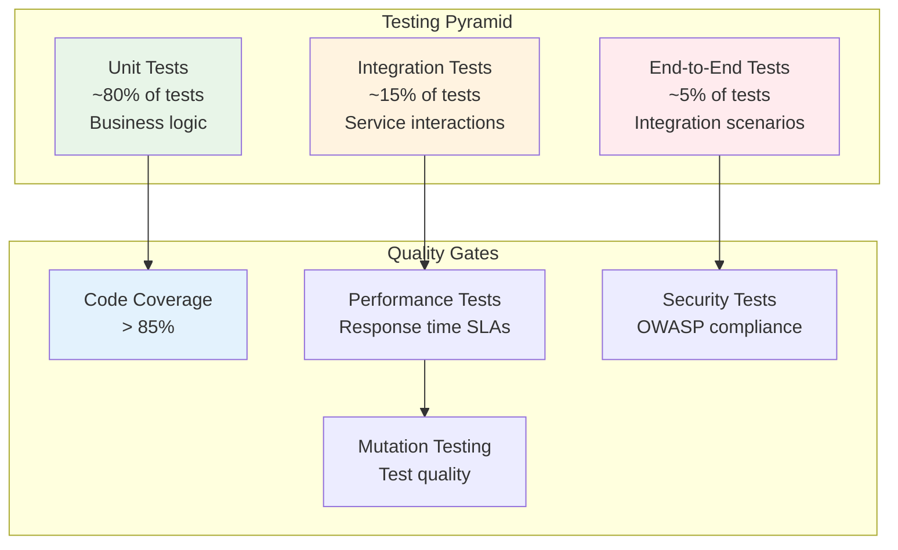

# Testing Overview

OpenFrame employs a comprehensive testing strategy to ensure reliability, performance, and security across all components. This guide covers our testing philosophy, frameworks, and best practices for writing and running tests.

## Testing Philosophy

Our testing approach follows the **Testing Pyramid** principle with emphasis on fast feedback loops and comprehensive coverage:



### Core Testing Principles

1. **Fast Feedback**: Unit tests run in milliseconds, integration tests in seconds
2. **Deterministic**: Tests produce consistent results across environments
3. **Independent**: Tests can run in any order without dependencies
4. **Comprehensive**: Critical paths have multiple test layers
5. **Maintainable**: Tests are easy to read, write, and modify

## Test Structure and Organization

### Backend Testing Structure

```text
src/
├── main/java/
│   └── com/openframe/api/
│       ├── controller/
│       ├── service/
│       └── repository/
└── test/java/
    └── com/openframe/api/
        ├── controller/          # Controller unit tests
        ├── service/             # Service unit tests
        ├── repository/          # Repository unit tests
        ├── integration/         # Integration tests
        │   ├── api/            # API integration tests
        │   ├── database/       # Database integration tests
        │   └── security/       # Security integration tests
        └── testcontainers/     # Container-based tests
```

### Frontend Testing Structure

```text
src/
├── components/
│   ├── DeviceCard.tsx
│   └── __tests__/
│       └── DeviceCard.test.tsx
├── pages/
│   ├── devices.tsx
│   └── __tests__/
│       └── devices.test.tsx
├── services/
│   ├── apiClient.ts
│   └── __tests__/
│       └── apiClient.test.ts
└── __tests__/
    ├── integration/         # Integration tests
    ├── e2e/                # End-to-end tests
    └── utils/              # Test utilities
```

## Testing Frameworks and Tools

### Backend Testing Stack

| Layer | Framework | Purpose | Version |
|-------|-----------|---------|---------|
| **Unit Testing** | JUnit 5 | Test framework | 5.9+ |
| **Mocking** | Mockito | Mock objects | 5.0+ |
| **Integration** | Spring Boot Test | Spring context tests | 3.3+ |
| **Containers** | Testcontainers | Database integration | 1.19+ |
| **Performance** | JMeter | Load testing | 5.5+ |
| **Security** | Spring Security Test | Security testing | 6.1+ |

### Frontend Testing Stack

| Layer | Framework | Purpose | Version |
|-------|-----------|---------|---------|
| **Unit Testing** | Jest | Test runner and assertions | 29+ |
| **Component Testing** | React Testing Library | React component tests | 14+ |
| **E2E Testing** | Playwright | Browser automation | 1.40+ |
| **API Testing** | MSW (Mock Service Worker) | API mocking | 2.0+ |
| **Visual Testing** | Chromatic | Visual regression | Latest |

## Unit Testing

### Backend Unit Tests

**Service Layer Testing:**
```java
@ExtendWith(MockitoExtension.class)
class DeviceServiceTest {
    
    @Mock
    private DeviceRepository deviceRepository;
    
    @Mock
    private EventPublisher eventPublisher;
    
    @InjectMocks
    private DeviceService deviceService;
    
    @Test
    @DisplayName("Should create device successfully")
    void shouldCreateDeviceSuccessfully() {
        // Given
        CreateDeviceRequest request = CreateDeviceRequest.builder()
            .name("Test Device")
            .ipAddress("192.168.1.100")
            .organizationId("org-123")
            .build();
            
        Device expectedDevice = Device.builder()
            .id("device-456")
            .name("Test Device")
            .ipAddress("192.168.1.100")
            .status(DeviceStatus.ACTIVE)
            .build();
            
        when(deviceRepository.save(any(Device.class)))
            .thenReturn(expectedDevice);
        
        // When
        DeviceDto result = deviceService.createDevice(request);
        
        // Then
        assertThat(result).isNotNull();
        assertThat(result.getName()).isEqualTo("Test Device");
        assertThat(result.getStatus()).isEqualTo(DeviceStatus.ACTIVE);
        
        verify(deviceRepository).save(argThat(device -> 
            device.getName().equals("Test Device") &&
            device.getOrganizationId().equals("org-123")
        ));
        
        verify(eventPublisher).publishEvent(any(DeviceCreatedEvent.class));
    }
    
    @Test
    @DisplayName("Should throw exception when device name is duplicate")
    void shouldThrowExceptionWhenDeviceNameIsDuplicate() {
        // Given
        CreateDeviceRequest request = CreateDeviceRequest.builder()
            .name("Existing Device")
            .organizationId("org-123")
            .build();
            
        when(deviceRepository.existsByNameAndOrganizationId(
            "Existing Device", "org-123"))
            .thenReturn(true);
        
        // When & Then
        assertThatThrownBy(() -> deviceService.createDevice(request))
            .isInstanceOf(DuplicateDeviceNameException.class)
            .hasMessage("Device with name 'Existing Device' already exists");
            
        verify(deviceRepository, never()).save(any(Device.class));
    }
}
```

**Controller Layer Testing:**
```java
@WebMvcTest(DeviceController.class)
@WithMockUser(roles = "TECHNICIAN")
class DeviceControllerTest {
    
    @Autowired
    private MockMvc mockMvc;
    
    @MockBean
    private DeviceService deviceService;
    
    @Test
    @DisplayName("Should return devices for organization")
    void shouldReturnDevicesForOrganization() throws Exception {
        // Given
        List<DeviceDto> devices = Arrays.asList(
            DeviceDto.builder().id("device-1").name("Device 1").build(),
            DeviceDto.builder().id("device-2").name("Device 2").build()
        );
        
        when(deviceService.findByOrganizationId("org-123"))
            .thenReturn(devices);
        
        // When & Then
        mockMvc.perform(get("/api/devices")
            .param("organizationId", "org-123")
            .contentType(MediaType.APPLICATION_JSON))
            .andExpect(status().isOk())
            .andExpected(jsonPath("$.length()").value(2))
            .andExpected(jsonPath("$[0].name").value("Device 1"))
            .andExpected(jsonPath("$[1].name").value("Device 2"));
    }
    
    @Test
    @DisplayName("Should validate device creation request")
    void shouldValidateDeviceCreationRequest() throws Exception {
        // Given
        String invalidRequest = """
            {
                "name": "",
                "ipAddress": "invalid-ip"
            }
            """;
        
        // When & Then
        mockMvc.perform(post("/api/devices")
            .content(invalidRequest)
            .contentType(MediaType.APPLICATION_JSON))
            .andExpect(status().isBadRequest())
            .andExpected(jsonPath("$.errors.name").value("Device name is required"))
            .andExpected(jsonPath("$.errors.ipAddress").value("Invalid IP address format"));
    }
}
```

### Frontend Unit Tests

**Component Testing:**
```typescript
// DeviceCard.test.tsx
import { render, screen, fireEvent, waitFor } from '@testing-library/react';
import { DeviceCard } from '../DeviceCard';
import { Device, DeviceStatus } from '@/types/device';

const mockDevice: Device = {
  id: 'device-123',
  name: 'Test Device',
  status: DeviceStatus.ONLINE,
  ipAddress: '192.168.1.100',
  lastSeen: new Date('2024-01-15T10:00:00Z'),
  organizationId: 'org-123'
};

describe('DeviceCard', () => {
  test('renders device information correctly', () => {
    render(<DeviceCard device={mockDevice} />);
    
    expect(screen.getByText('Test Device')).toBeInTheDocument();
    expect(screen.getByText('192.168.1.100')).toBeInTheDocument();
    expect(screen.getByText('Online')).toBeInTheDocument();
  });
  
  test('displays correct status badge color', () => {
    render(<DeviceCard device={mockDevice} />);
    
    const statusBadge = screen.getByTestId('device-status');
    expect(statusBadge).toHaveClass('bg-green-100', 'text-green-800');
  });
  
  test('calls onDeviceClick when card is clicked', async () => {
    const mockOnClick = jest.fn();
    render(<DeviceCard device={mockDevice} onDeviceClick={mockOnClick} />);
    
    fireEvent.click(screen.getByRole('button'));
    
    await waitFor(() => {
      expect(mockOnClick).toHaveBeenCalledWith(mockDevice);
    });
  });
  
  test('shows loading state when device is being updated', () => {
    render(<DeviceCard device={mockDevice} isLoading={true} />);
    
    expect(screen.getByTestId('loading-spinner')).toBeInTheDocument();
    expect(screen.getByRole('button')).toBeDisabled();
  });
});
```

**Service Testing:**
```typescript
// apiClient.test.ts
import { ApiClient } from '../apiClient';
import { setupServer } from 'msw/node';
import { rest } from 'msw';

const server = setupServer(
  rest.get('/api/devices', (req, res, ctx) => {
    return res(
      ctx.json([
        { id: '1', name: 'Device 1', status: 'online' },
        { id: '2', name: 'Device 2', status: 'offline' }
      ])
    );
  }),
  
  rest.post('/api/devices', (req, res, ctx) => {
    return res(
      ctx.status(201),
      ctx.json({ id: '3', name: 'New Device', status: 'active' })
    );
  })
);

beforeAll(() => server.listen());
afterEach(() => server.resetHandlers());
afterAll(() => server.close());

describe('ApiClient', () => {
  test('fetches devices successfully', async () => {
    const apiClient = new ApiClient();
    
    const devices = await apiClient.getDevices();
    
    expect(devices).toHaveLength(2);
    expect(devices[0].name).toBe('Device 1');
    expect(devices[1].status).toBe('offline');
  });
  
  test('handles API errors gracefully', async () => {
    server.use(
      rest.get('/api/devices', (req, res, ctx) => {
        return res(
          ctx.status(500),
          ctx.json({ error: 'Internal server error' })
        );
      })
    );
    
    const apiClient = new ApiClient();
    
    await expect(apiClient.getDevices()).rejects.toThrow('Failed to fetch devices');
  });
  
  test('includes authentication headers', async () => {
    const apiClient = new ApiClient();
    
    await apiClient.createDevice({
      name: 'New Device',
      ipAddress: '192.168.1.200'
    });
    
    // Verify the request included proper authentication
    // This would be verified through MSW request inspection
  });
});
```

## Integration Testing

### Database Integration Tests

```java
@DataJpaTest
@Testcontainers
class DeviceRepositoryIntegrationTest {
    
    @Container
    static MongoDBContainer mongoDBContainer = new MongoDBContainer("mongo:6.0")
            .withExposedPorts(27017);
    
    @Autowired
    private TestEntityManager entityManager;
    
    @Autowired
    private DeviceRepository deviceRepository;
    
    @DynamicPropertySource
    static void configureProperties(DynamicPropertyRegistry registry) {
        registry.add("spring.data.mongodb.uri", mongoDBContainer::getReplicaSetUrl);
    }
    
    @Test
    @DisplayName("Should find devices by organization with proper tenant isolation")
    void shouldFindDevicesByOrganizationWithTenantIsolation() {
        // Given - devices for different organizations
        Organization org1 = createOrganization("org-1", "Organization 1");
        Organization org2 = createOrganization("org-2", "Organization 2");
        
        Device device1 = createDevice("device-1", "Device 1", org1);
        Device device2 = createDevice("device-2", "Device 2", org1);
        Device device3 = createDevice("device-3", "Device 3", org2);
        
        entityManager.persistAndFlush(org1);
        entityManager.persistAndFlush(org2);
        entityManager.persistAndFlush(device1);
        entityManager.persistAndFlush(device2);
        entityManager.persistAndFlush(device3);
        
        // When
        List<Device> org1Devices = deviceRepository.findByOrganizationId("org-1");
        List<Device> org2Devices = deviceRepository.findByOrganizationId("org-2");
        
        // Then
        assertThat(org1Devices).hasSize(2);
        assertThat(org1Devices).extracting(Device::getName)
            .containsExactly("Device 1", "Device 2");
            
        assertThat(org2Devices).hasSize(1);
        assertThat(org2Devices.get(0).getName()).isEqualTo("Device 3");
    }
    
    @Test
    @DisplayName("Should handle complex queries with pagination")
    void shouldHandleComplexQueriesWithPagination() {
        // Given - multiple devices with various statuses
        Organization org = createOrganization("org-test", "Test Organization");
        
        List<Device> devices = IntStream.range(1, 21)  // 20 devices
            .mapToObj(i -> createDevice(
                "device-" + i, 
                "Device " + i, 
                org,
                i % 2 == 0 ? DeviceStatus.ONLINE : DeviceStatus.OFFLINE
            ))
            .collect(Collectors.toList());
        
        entityManager.persistAndFlush(org);
        devices.forEach(entityManager::persistAndFlush);
        
        // When
        Pageable pageable = PageRequest.of(0, 5, Sort.by("name"));
        Page<Device> onlineDevices = deviceRepository.findByOrganizationIdAndStatus(
            "org-test", DeviceStatus.ONLINE, pageable
        );
        
        // Then
        assertThat(onlineDevices.getTotalElements()).isEqualTo(10);
        assertThat(onlineDevices.getContent()).hasSize(5);
        assertThat(onlineDevices.isFirst()).isTrue();
        assertThat(onlineDevices.hasNext()).isTrue();
    }
}
```

### API Integration Tests

```java
@SpringBootTest(webEnvironment = SpringBootTest.WebEnvironment.RANDOM_PORT)
@TestPropertySource(properties = {
    "spring.profiles.active=integration-test"
})
class DeviceControllerIntegrationTest {
    
    @Autowired
    private TestRestTemplate restTemplate;
    
    @Autowired
    private DeviceRepository deviceRepository;
    
    @LocalServerPort
    private int port;
    
    private String baseUrl;
    private String validJwtToken;
    
    @BeforeEach
    void setUp() {
        baseUrl = "http://localhost:" + port;
        validJwtToken = generateValidJwtToken();
        deviceRepository.deleteAll();
    }
    
    @Test
    @DisplayName("Should create device via API")
    void shouldCreateDeviceViaApi() {
        // Given
        CreateDeviceRequest request = CreateDeviceRequest.builder()
            .name("Integration Test Device")
            .ipAddress("192.168.1.150")
            .organizationId("org-integration-test")
            .build();
        
        HttpHeaders headers = new HttpHeaders();
        headers.setBearerAuth(validJwtToken);
        HttpEntity<CreateDeviceRequest> entity = new HttpEntity<>(request, headers);
        
        // When
        ResponseEntity<DeviceDto> response = restTemplate.exchange(
            baseUrl + "/api/devices",
            HttpMethod.POST,
            entity,
            DeviceDto.class
        );
        
        // Then
        assertThat(response.getStatusCode()).isEqualTo(HttpStatus.CREATED);
        assertThat(response.getBody()).isNotNull();
        assertThat(response.getBody().getName()).isEqualTo("Integration Test Device");
        
        // Verify in database
        Optional<Device> savedDevice = deviceRepository.findById(response.getBody().getId());
        assertThat(savedDevice).isPresent();
        assertThat(savedDevice.get().getIpAddress()).isEqualTo("192.168.1.150");
    }
    
    @Test
    @DisplayName("Should handle authentication failure")
    void shouldHandleAuthenticationFailure() {
        // Given
        CreateDeviceRequest request = CreateDeviceRequest.builder()
            .name("Unauthorized Device")
            .build();
        
        HttpEntity<CreateDeviceRequest> entity = new HttpEntity<>(request);
        
        // When
        ResponseEntity<String> response = restTemplate.exchange(
            baseUrl + "/api/devices",
            HttpMethod.POST,
            entity,
            String.class
        );
        
        // Then
        assertThat(response.getStatusCode()).isEqualTo(HttpStatus.UNAUTHORIZED);
    }
}
```

### Frontend Integration Tests

```typescript
// devices.integration.test.tsx
import { render, screen, waitFor, fireEvent } from '@testing-library/react';
import { BrowserRouter } from 'react-router-dom';
import { QueryClient, QueryClientProvider } from '@tanstack/react-query';
import { DevicesPage } from '../devices';
import { server, handlers } from '@/tests/mocks/server';

const createWrapper = () => {
  const queryClient = new QueryClient({
    defaultOptions: {
      queries: { retry: false },
      mutations: { retry: false }
    }
  });
  
  return ({ children }) => (
    <BrowserRouter>
      <QueryClientProvider client={queryClient}>
        {children}
      </QueryClientProvider>
    </BrowserRouter>
  );
};

describe('DevicesPage Integration', () => {
  test('loads and displays devices from API', async () => {
    render(<DevicesPage />, { wrapper: createWrapper() });
    
    // Show loading state initially
    expect(screen.getByText('Loading devices...')).toBeInTheDocument();
    
    // Wait for devices to load
    await waitFor(() => {
      expect(screen.getByText('Test Device 1')).toBeInTheDocument();
      expect(screen.getByText('Test Device 2')).toBeInTheDocument();
    });
    
    // Verify device details are shown
    expect(screen.getByText('192.168.1.100')).toBeInTheDocument();
    expect(screen.getByText('Online')).toBeInTheDocument();
  });
  
  test('handles API errors gracefully', async () => {
    // Override default handlers to return error
    server.use(...handlers.devicesError);
    
    render(<DevicesPage />, { wrapper: createWrapper() });
    
    await waitFor(() => {
      expect(screen.getByText('Failed to load devices')).toBeInTheDocument();
      expect(screen.getByRole('button', { name: 'Retry' })).toBeInTheDocument();
    });
  });
  
  test('creates new device through form', async () => {
    render(<DevicesPage />, { wrapper: createWrapper() });
    
    // Wait for page to load
    await waitFor(() => {
      expect(screen.getByText('Test Device 1')).toBeInTheDocument();
    });
    
    // Open create device modal
    fireEvent.click(screen.getByRole('button', { name: 'Add Device' }));
    
    // Fill form
    fireEvent.change(screen.getByLabelText('Device Name'), {
      target: { value: 'New Integration Device' }
    });
    fireEvent.change(screen.getByLabelText('IP Address'), {
      target: { value: '192.168.1.200' }
    });
    
    // Submit form
    fireEvent.click(screen.getByRole('button', { name: 'Create Device' }));
    
    // Verify success
    await waitFor(() => {
      expect(screen.getByText('Device created successfully')).toBeInTheDocument();
      expect(screen.getByText('New Integration Device')).toBeInTheDocument();
    });
  });
});
```

## End-to-End Testing

### E2E Test Setup with Playwright

```typescript
// playwright.config.ts
import { defineConfig, devices } from '@playwright/test';

export default defineConfig({
  testDir: './tests/e2e',
  fullyParallel: true,
  forbidOnly: !!process.env.CI,
  retries: process.env.CI ? 2 : 0,
  workers: process.env.CI ? 1 : undefined,
  reporter: 'html',
  
  use: {
    baseURL: 'http://localhost:3000',
    trace: 'on-first-retry',
    screenshot: 'only-on-failure',
  },
  
  projects: [
    {
      name: 'chromium',
      use: { ...devices['Desktop Chrome'] },
    },
    {
      name: 'firefox',
      use: { ...devices['Desktop Firefox'] },
    },
    {
      name: 'webkit',
      use: { ...devices['Desktop Safari'] },
    },
  ],
  
  webServer: {
    command: 'npm run dev',
    port: 3000,
    reuseExistingServer: !process.env.CI,
  },
});
```

### E2E Test Examples

```typescript
// device-management.e2e.test.ts
import { test, expect } from '@playwright/test';

test.describe('Device Management Flow', () => {
  test.beforeEach(async ({ page }) => {
    // Login before each test
    await page.goto('/login');
    await page.fill('[data-testid="email"]', 'test@openframe.dev');
    await page.fill('[data-testid="password"]', 'testpassword');
    await page.click('[data-testid="login-button"]');
    
    // Wait for redirect to dashboard
    await expect(page).toHaveURL('/dashboard');
  });
  
  test('should complete device onboarding flow', async ({ page }) => {
    // Navigate to devices page
    await page.click('[data-testid="nav-devices"]');
    await expect(page).toHaveURL('/devices');
    
    // Start device creation
    await page.click('[data-testid="add-device-button"]');
    
    // Fill device form
    await page.fill('[data-testid="device-name"]', 'E2E Test Device');
    await page.fill('[data-testid="device-ip"]', '192.168.1.100');
    await page.selectOption('[data-testid="device-type"]', 'desktop');
    
    // Submit form
    await page.click('[data-testid="create-device-button"]');
    
    // Verify device was created
    await expect(page.locator('[data-testid="success-message"]'))
      .toContainText('Device created successfully');
    
    // Verify device appears in list
    await expect(page.locator('[data-testid="device-card"]')
      .filter({ hasText: 'E2E Test Device' }))
      .toBeVisible();
    
    // Test device details view
    await page.click('[data-testid="device-card"]');
    await expect(page).toHaveURL(/\/devices\/[\w-]+/);
    await expect(page.locator('[data-testid="device-name"]'))
      .toContainText('E2E Test Device');
  });
  
  test('should handle device actions workflow', async ({ page }) => {
    await page.goto('/devices');
    
    // Assume device exists from previous test or setup
    const deviceCard = page.locator('[data-testid="device-card"]').first();
    await deviceCard.click();
    
    // Test remote desktop connection
    await page.click('[data-testid="remote-desktop-button"]');
    await expect(page.locator('[data-testid="remote-desktop-viewer"]'))
      .toBeVisible();
    
    // Test file manager
    await page.click('[data-testid="file-manager-button"]');
    await expect(page.locator('[data-testid="file-browser"]'))
      .toBeVisible();
    
    // Test running a script
    await page.click('[data-testid="run-script-button"]');
    await page.selectOption('[data-testid="script-selector"]', 'system-info');
    await page.click('[data-testid="execute-script-button"]');
    
    // Verify script execution
    await expect(page.locator('[data-testid="script-output"]'))
      .toBeVisible({ timeout: 10000 });
  });
});
```

## Running Tests

### Backend Test Execution

**Run all tests:**
```bash
# Run all tests with coverage
mvn clean test jacoco:report

# Run specific test class
mvn test -Dtest=DeviceServiceTest

# Run tests for specific service
mvn test -pl openframe/services/openframe-api

# Run integration tests only
mvn test -Dgroups=integration
```

**Performance testing:**
```bash
# Run JMeter performance tests
mvn jmeter:jmeter

# Run with custom load profile
mvn jmeter:jmeter -Dthreads=50 -Drampup=60 -Dduration=300
```

### Frontend Test Execution

**Run all frontend tests:**
```bash
cd openframe/services/openframe-frontend

# Run unit tests
npm test

# Run with coverage
npm run test:coverage

# Run in watch mode
npm run test:watch

# Run integration tests
npm run test:integration

# Run E2E tests
npm run test:e2e

# Run E2E tests in CI mode
npm run test:e2e:ci
```

### Coverage Requirements

**Minimum Coverage Thresholds:**
- **Line Coverage**: 85%
- **Branch Coverage**: 80%  
- **Function Coverage**: 90%
- **Statement Coverage**: 85%

**Coverage Configuration:**
```xml
<!-- jacoco-maven-plugin configuration -->
<plugin>
    <groupId>org.jacoco</groupId>
    <artifactId>jacoco-maven-plugin</artifactId>
    <executions>
        <execution>
            <id>check</id>
            <goals>
                <goal>check</goal>
            </goals>
            <configuration>
                <rules>
                    <rule>
                        <element>CLASS</element>
                        <limits>
                            <limit>
                                <counter>LINE</counter>
                                <value>COVEREDRATIO</value>
                                <minimum>0.85</minimum>
                            </limit>
                        </limits>
                    </rule>
                </rules>
            </configuration>
        </execution>
    </executions>
</plugin>
```

## Writing New Tests

### Test Writing Guidelines

**Unit Test Best Practices:**
1. **AAA Pattern**: Arrange, Act, Assert
2. **Descriptive Names**: Test names should describe behavior
3. **Single Responsibility**: One test, one behavior
4. **Independent**: Tests don't depend on each other
5. **Fast**: Unit tests should run quickly

**Test Data Management:**
```java
// Use test builders for complex objects
@Builder
public class DeviceTestDataBuilder {
    private String id = "test-device-id";
    private String name = "Test Device";
    private DeviceStatus status = DeviceStatus.ACTIVE;
    private String organizationId = "test-org-id";
    
    public static DeviceTestDataBuilder aDevice() {
        return new DeviceTestDataBuilder();
    }
    
    public Device build() {
        return Device.builder()
            .id(id)
            .name(name)
            .status(status)
            .organizationId(organizationId)
            .build();
    }
}

// Usage in tests
@Test
void shouldHandleDeviceWithCustomStatus() {
    Device device = aDevice()
        .withStatus(DeviceStatus.MAINTENANCE)
        .withName("Maintenance Device")
        .build();
        
    // Test logic here
}
```

### Test Automation in CI/CD

**GitHub Actions Workflow:**
```yaml
name: Test Suite

on:
  push:
    branches: [ main, develop ]
  pull_request:
    branches: [ main ]

jobs:
  backend-tests:
    runs-on: ubuntu-latest
    
    services:
      mongodb:
        image: mongo:6.0
        env:
          MONGO_INITDB_ROOT_USERNAME: root
          MONGO_INITDB_ROOT_PASSWORD: password
        ports:
          - 27017:27017
          
    steps:
    - uses: actions/checkout@v3
    
    - name: Set up JDK 21
      uses: actions/setup-java@v3
      with:
        java-version: '21'
        distribution: 'temurin'
        
    - name: Cache Maven dependencies
      uses: actions/cache@v3
      with:
        path: ~/.m2
        key: ${{ runner.os }}-m2-${{ hashFiles('**/pom.xml') }}
        
    - name: Run backend tests
      run: mvn clean test jacoco:report
      
    - name: Upload coverage to Codecov
      uses: codecov/codecov-action@v3
      
  frontend-tests:
    runs-on: ubuntu-latest
    
    steps:
    - uses: actions/checkout@v3
    
    - name: Set up Node.js
      uses: actions/setup-node@v3
      with:
        node-version: '18'
        cache: 'npm'
        cache-dependency-path: openframe/services/openframe-frontend/package-lock.json
        
    - name: Install dependencies
      run: |
        cd openframe/services/openframe-frontend
        npm ci
        
    - name: Run frontend tests
      run: |
        cd openframe/services/openframe-frontend
        npm run test:coverage
        
    - name: Run E2E tests
      run: |
        cd openframe/services/openframe-frontend
        npm run test:e2e:ci
        
  performance-tests:
    runs-on: ubuntu-latest
    if: github.event_name == 'push' && github.ref == 'refs/heads/main'
    
    steps:
    - uses: actions/checkout@v3
    
    - name: Run performance tests
      run: |
        # Start services
        docker-compose up -d
        
        # Wait for services to be ready
        ./scripts/wait-for-services.sh
        
        # Run JMeter tests
        mvn jmeter:jmeter
        
        # Analyze results
        ./scripts/analyze-performance.sh
```

---

This comprehensive testing guide ensures OpenFrame maintains high quality and reliability. Testing is integrated into the development workflow and automated through CI/CD pipelines.

**Next Steps:**
- [Contributing Guidelines](../contributing/guidelines.md) - Learn about contributing code and tests
- [Architecture Overview](../architecture/README.md) - Understand the system design for better testing
- [Security Best Practices](../security/README.md) - Learn about security testing approaches

> **🧪 Testing Tip**: Start with unit tests for new features, add integration tests for service interactions, and use E2E tests sparingly for critical user journeys. This approach provides fast feedback while ensuring comprehensive coverage.