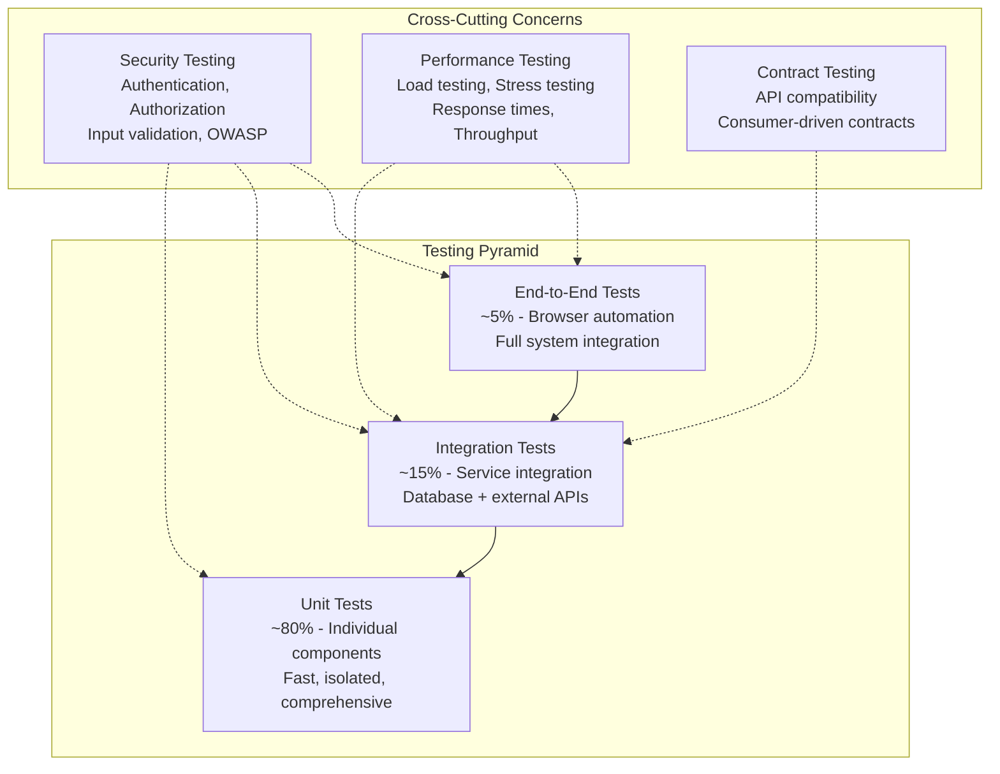

# Testing Overview

OpenFrame follows a comprehensive testing strategy with multiple layers of automated testing to ensure code quality, security, and reliability. This guide covers the testing architecture, methodologies, and best practices for all components.

## 🎯 Testing Philosophy

OpenFrame's testing approach is built on these principles:

1. **Test Pyramid**: Emphasis on unit tests, complemented by integration and E2E tests
2. **Shift-Left Testing**: Catch issues early in the development cycle
3. **Test-Driven Development**: Write tests first, then implement features
4. **Continuous Testing**: Automated testing in CI/CD pipelines
5. **Security Testing**: Security considerations at all testing levels

## 🏗️ Testing Architecture

### Test Structure Overview

```text
openframe-oss-tenant/
├── Backend Testing (Java)
│   ├── Unit Tests (JUnit 5 + Mockito)
│   ├── Integration Tests (Spring Boot Test)
│   ├── Contract Tests (Spring Cloud Contract)
│   └── Security Tests (Spring Security Test)
├── Frontend Testing (TypeScript/Vue)
│   ├── Unit Tests (Vitest + Vue Test Utils)
│   ├── Component Tests (Testing Library)
│   └── E2E Tests (Playwright)
├── Client Agent Testing (Rust)
│   ├── Unit Tests (Built-in Rust testing)
│   ├── Integration Tests (Testcontainers)
│   └── Performance Tests (Criterion)
└── Infrastructure Testing
    ├── API Tests (REST Assured)
    ├── Database Tests (Testcontainers)
    └── Security Tests (OWASP ZAP)
```

### Testing Layers Pyramid



## ☕ Backend Testing (Java)

### Unit Testing Framework

#### JUnit 5 + Mockito Configuration

**Base Test Class:**
```java
@ExtendWith(MockitoExtension.class)
abstract class BaseUnitTest {
    
    @Mock
    protected ApplicationEventPublisher eventPublisher;
    
    @BeforeEach
    void setUp() {
        // Common setup for all tests
        TenantSecurityContext.setTenantId("test-tenant-id");
    }
    
    @AfterEach
    void tearDown() {
        TenantSecurityContext.clear();
    }
}
```

#### Service Layer Testing

```java
class OrganizationServiceTest extends BaseUnitTest {
    
    @Mock
    private OrganizationRepository repository;
    
    @Mock
    private OrganizationMapper mapper;
    
    @InjectMocks
    private OrganizationService organizationService;
    
    @Test
    @DisplayName("Should create organization with valid input")
    void shouldCreateOrganization() {
        // Given
        CreateOrganizationRequest request = CreateOrganizationRequest.builder()
            .name("Test Organization")
            .domain("test-org.com")
            .contactEmail("admin@test-org.com")
            .build();
            
        Organization entity = Organization.builder()
            .id("org-123")
            .name(request.getName())
            .domain(request.getDomain())
            .tenantId("test-tenant-id")
            .build();
            
        OrganizationResponse expectedResponse = OrganizationResponse.builder()
            .id("org-123")
            .name("Test Organization")
            .domain("test-org.com")
            .build();
        
        when(mapper.toEntity(request)).thenReturn(entity);
        when(repository.save(entity)).thenReturn(entity);
        when(mapper.toResponse(entity)).thenReturn(expectedResponse);
        
        // When
        OrganizationResponse result = organizationService.create(request);
        
        // Then
        assertThat(result).isNotNull();
        assertThat(result.getId()).isEqualTo("org-123");
        assertThat(result.getName()).isEqualTo("Test Organization");
        
        verify(repository).save(argThat(org -> 
            org.getTenantId().equals("test-tenant-id")));
        verify(eventPublisher).publishEvent(any(OrganizationCreatedEvent.class));
    }
    
    @Test
    @DisplayName("Should throw exception for duplicate domain")
    void shouldThrowExceptionForDuplicateDomain() {
        // Given
        CreateOrganizationRequest request = CreateOrganizationRequest.builder()
            .name("Test Organization")
            .domain("existing-domain.com")
            .build();
            
        when(repository.existsByDomainAndTenantId("existing-domain.com", "test-tenant-id"))
            .thenReturn(true);
        
        // When & Then
        assertThatThrownBy(() -> organizationService.create(request))
            .isInstanceOf(DuplicateDomainException.class)
            .hasMessage("Domain 'existing-domain.com' already exists");
        
        verify(repository, never()).save(any());
    }
}
```

#### Repository Testing with @DataMongoTest

```java
@DataMongoTest
@TestPropertySource(properties = {
    "spring.data.mongodb.database=openframe_test"
})
class OrganizationRepositoryTest {
    
    @Autowired
    private TestEntityManager entityManager;
    
    @Autowired
    private OrganizationRepository repository;
    
    @Test
    @DisplayName("Should find organizations by tenant ID")
    void shouldFindByTenantId() {
        // Given
        String tenantId = "test-tenant";
        Organization org1 = createOrganization("Org 1", tenantId);
        Organization org2 = createOrganization("Org 2", tenantId);
        Organization org3 = createOrganization("Org 3", "other-tenant");
        
        entityManager.persistAndFlush(org1);
        entityManager.persistAndFlush(org2);
        entityManager.persistAndFlush(org3);
        
        // When
        List<Organization> result = repository.findByTenantId(tenantId);
        
        // Then
        assertThat(result).hasSize(2);
        assertThat(result).extracting(Organization::getName)
            .containsExactlyInAnyOrder("Org 1", "Org 2");
    }
    
    @Test
    @DisplayName("Should support cursor-based pagination")
    void shouldSupportCursorPagination() {
        // Given
        String tenantId = "test-tenant";
        List<Organization> organizations = IntStream.range(1, 11)
            .mapToObj(i -> createOrganization("Org " + i, tenantId))
            .map(entityManager::persistAndFlush)
            .collect(Collectors.toList());
        
        // When
        CursorPageRequest pageRequest = CursorPageRequest.builder()
            .limit(5)
            .build();
            
        CursorPage<Organization> firstPage = repository.findByTenantIdWithCursor(
            tenantId, pageRequest);
        
        CursorPageRequest secondPageRequest = CursorPageRequest.builder()
            .limit(5)
            .cursor(firstPage.getPageInfo().getEndCursor())
            .build();
            
        CursorPage<Organization> secondPage = repository.findByTenantIdWithCursor(
            tenantId, secondPageRequest);
        
        // Then
        assertThat(firstPage.getContent()).hasSize(5);
        assertThat(secondPage.getContent()).hasSize(5);
        assertThat(firstPage.getPageInfo().isHasNextPage()).isTrue();
        assertThat(secondPage.getPageInfo().isHasNextPage()).isFalse();
    }
}
```

### Integration Testing

#### Spring Boot Integration Tests

```java
@SpringBootTest(webEnvironment = SpringBootTest.WebEnvironment.RANDOM_PORT)
@Testcontainers
@TestPropertySource(properties = {
    "spring.data.mongodb.uri=mongodb://localhost:27017/openframe_integration_test",
    "spring.data.redis.url=redis://localhost:6379/1"
})
class OrganizationIntegrationTest {
    
    @Container
    static MongoDBContainer mongodb = new MongoDBContainer("mongo:7.0")
        .withExposedPorts(27017);
        
    @Container
    static GenericContainer<?> redis = new GenericContainer<>("redis:7.0")
        .withExposedPorts(6379);
    
    @Autowired
    private TestRestTemplate restTemplate;
    
    @Autowired
    private OrganizationRepository repository;
    
    @MockBean
    private EventPublisher eventPublisher;
    
    private String jwtToken;
    
    @BeforeEach
    void setUp() {
        jwtToken = generateTestJwtToken("test-user", "test-tenant");
    }
    
    @Test
    @DisplayName("Should create organization via API")
    void shouldCreateOrganizationViaApi() {
        // Given
        CreateOrganizationRequest request = CreateOrganizationRequest.builder()
            .name("Integration Test Org")
            .domain("integration-test.com")
            .contactEmail("test@integration.com")
            .build();
            
        HttpHeaders headers = new HttpHeaders();
        headers.setBearerAuth(jwtToken);
        headers.setContentType(MediaType.APPLICATION_JSON);
        
        HttpEntity<CreateOrganizationRequest> entity = new HttpEntity<>(request, headers);
        
        // When
        ResponseEntity<OrganizationResponse> response = restTemplate.postForEntity(
            "/api/v1/organizations", entity, OrganizationResponse.class);
        
        // Then
        assertThat(response.getStatusCode()).isEqualTo(HttpStatus.CREATED);
        assertThat(response.getBody()).isNotNull();
        assertThat(response.getBody().getName()).isEqualTo("Integration Test Org");
        
        // Verify database persistence
        Optional<Organization> savedOrg = repository.findById(response.getBody().getId());
        assertThat(savedOrg).isPresent();
        assertThat(savedOrg.get().getTenantId()).isEqualTo("test-tenant");
        
        // Verify event publication
        verify(eventPublisher).publishEvent(any(OrganizationCreatedEvent.class));
    }
    
    @Test
    @DisplayName("Should handle validation errors")
    void shouldHandleValidationErrors() {
        // Given
        CreateOrganizationRequest invalidRequest = CreateOrganizationRequest.builder()
            .name("") // Invalid: empty name
            .domain("invalid-domain") // Invalid: not a valid domain
            .build();
            
        HttpHeaders headers = new HttpHeaders();
        headers.setBearerAuth(jwtToken);
        headers.setContentType(MediaType.APPLICATION_JSON);
        
        HttpEntity<CreateOrganizationRequest> entity = new HttpEntity<>(invalidRequest, headers);
        
        // When
        ResponseEntity<ErrorResponse> response = restTemplate.postForEntity(
            "/api/v1/organizations", entity, ErrorResponse.class);
        
        // Then
        assertThat(response.getStatusCode()).isEqualTo(HttpStatus.BAD_REQUEST);
        assertThat(response.getBody()).isNotNull();
        assertThat(response.getBody().getErrors()).hasSize(2);
        assertThat(response.getBody().getErrors())
            .anyMatch(error -> error.contains("name"))
            .anyMatch(error -> error.contains("domain"));
    }
}
```

#### GraphQL Integration Testing

```java
@SpringBootTest
@AutoConfigureGraphQlTester
class OrganizationGraphQLIntegrationTest {
    
    @Autowired
    private GraphQlTester graphQlTester;
    
    @MockBean
    private OrganizationService organizationService;
    
    @Test
    @DisplayName("Should query organizations via GraphQL")
    void shouldQueryOrganizations() {
        // Given
        List<OrganizationResponse> organizations = List.of(
            OrganizationResponse.builder().id("1").name("Org 1").build(),
            OrganizationResponse.builder().id("2").name("Org 2").build()
        );
        
        CursorConnection<OrganizationResponse> connection = CursorConnection.<OrganizationResponse>builder()
            .edges(organizations.stream()
                .map(org -> CursorEdge.<OrganizationResponse>builder()
                    .node(org)
                    .cursor(CursorUtil.encode(org.getId()))
                    .build())
                .collect(Collectors.toList()))
            .pageInfo(CursorPageInfo.builder()
                .hasNextPage(false)
                .hasPreviousPage(false)
                .build())
            .build();
            
        when(organizationService.findAll(any(), any())).thenReturn(connection);
        
        // When & Then
        graphQlTester.document("""
            query {
                organizations(first: 10) {
                    edges {
                        node {
                            id
                            name
                            domain
                        }
                        cursor
                    }
                    pageInfo {
                        hasNextPage
                        hasPreviousPage
                        startCursor
                        endCursor
                    }
                }
            }
            """)
            .execute()
            .path("organizations.edges")
            .entityList(Object.class)
            .hasSize(2)
            .path("organizations.edges[0].node.name")
            .entity(String.class)
            .isEqualTo("Org 1");
    }
}
```

## 🎨 Frontend Testing (Vue/TypeScript)

### Unit Testing with Vitest

#### Component Testing Setup

```typescript
// vitest.config.ts
import { defineConfig } from 'vitest/config'
import vue from '@vitejs/plugin-vue'
import { resolve } from 'path'

export default defineConfig({
  plugins: [vue()],
  test: {
    globals: true,
    environment: 'jsdom',
    setupFiles: ['./src/test/setup.ts']
  },
  resolve: {
    alias: {
      '@': resolve(__dirname, 'src')
    }
  }
})
```

```typescript
// src/test/setup.ts
import { expect, afterEach } from 'vitest'
import { cleanup } from '@testing-library/vue'
import * as matchers from '@testing-library/jest-dom/matchers'

expect.extend(matchers)

afterEach(() => {
  cleanup()
})
```

#### Vue Component Testing

```typescript
// src/app/organizations/components/__tests__/OrganizationCard.test.ts
import { render, screen, fireEvent } from '@testing-library/vue'
import { describe, it, expect, vi } from 'vitest'
import OrganizationCard from '../OrganizationCard.vue'
import type { Organization } from '@/types/organization'

describe('OrganizationCard', () => {
  const mockOrganization: Organization = {
    id: 'org-1',
    name: 'Test Organization',
    domain: 'test.com',
    deviceCount: 5,
    status: 'active',
    createdAt: '2024-01-15T10:00:00Z'
  }

  it('should render organization information', () => {
    // Given
    render(OrganizationCard, {
      props: {
        organization: mockOrganization
      }
    })

    // Then
    expect(screen.getByText('Test Organization')).toBeInTheDocument()
    expect(screen.getByText('test.com')).toBeInTheDocument()
    expect(screen.getByText('5 devices')).toBeInTheDocument()
    expect(screen.getByText('Active')).toBeInTheDocument()
  })

  it('should emit edit event when edit button is clicked', async () => {
    // Given
    const { emitted } = render(OrganizationCard, {
      props: {
        organization: mockOrganization
      }
    })

    // When
    const editButton = screen.getByRole('button', { name: /edit/i })
    await fireEvent.click(editButton)

    // Then
    expect(emitted().edit).toBeTruthy()
    expect(emitted().edit[0]).toEqual([mockOrganization])
  })

  it('should show confirmation dialog when delete is clicked', async () => {
    // Given
    render(OrganizationCard, {
      props: {
        organization: mockOrganization
      }
    })

    // When
    const deleteButton = screen.getByRole('button', { name: /delete/i })
    await fireEvent.click(deleteButton)

    // Then
    expect(screen.getByText('Are you sure?')).toBeInTheDocument()
    expect(screen.getByText(/this action cannot be undone/i)).toBeInTheDocument()
  })
})
```

#### Pinia Store Testing

```typescript
// src/stores/__tests__/organizationStore.test.ts
import { setActivePinia, createPinia } from 'pinia'
import { describe, beforeEach, it, expect, vi } from 'vitest'
import { useOrganizationStore } from '../organizationStore'
import * as organizationApi from '@/lib/api/organizations'

vi.mock('@/lib/api/organizations')

describe('Organization Store', () => {
  beforeEach(() => {
    setActivePinia(createPinia())
  })

  it('should fetch organizations successfully', async () => {
    // Given
    const mockOrganizations = [
      { id: '1', name: 'Org 1' },
      { id: '2', name: 'Org 2' }
    ]
    
    vi.mocked(organizationApi.getOrganizations).mockResolvedValue({
      data: mockOrganizations,
      meta: { total: 2 }
    })

    const store = useOrganizationStore()

    // When
    await store.fetchOrganizations()

    // Then
    expect(store.organizations).toEqual(mockOrganizations)
    expect(store.loading).toBe(false)
    expect(store.error).toBeNull()
  })

  it('should handle fetch errors', async () => {
    // Given
    const error = new Error('Network error')
    vi.mocked(organizationApi.getOrganizations).mockRejectedValue(error)

    const store = useOrganizationStore()

    // When
    await store.fetchOrganizations()

    // Then
    expect(store.organizations).toEqual([])
    expect(store.loading).toBe(false)
    expect(store.error).toBe('Failed to fetch organizations')
  })
})
```

### End-to-End Testing with Playwright

#### E2E Test Configuration

```typescript
// playwright.config.ts
import { defineConfig, devices } from '@playwright/test'

export default defineConfig({
  testDir: './tests/e2e',
  fullyParallel: true,
  forbidOnly: !!process.env.CI,
  retries: process.env.CI ? 2 : 0,
  workers: process.env.CI ? 1 : undefined,
  reporter: 'html',
  use: {
    baseURL: 'http://localhost:3000',
    trace: 'on-first-retry',
  },
  projects: [
    {
      name: 'chromium',
      use: { ...devices['Desktop Chrome'] },
    },
    {
      name: 'firefox',
      use: { ...devices['Desktop Firefox'] },
    },
  ],
  webServer: {
    command: 'npm run dev',
    url: 'http://localhost:3000',
    reuseExistingServer: !process.env.CI,
  },
})
```

#### E2E Test Examples

```typescript
// tests/e2e/organization-management.spec.ts
import { test, expect } from '@playwright/test'
import { loginAsAdmin, createTestOrganization } from './helpers/auth-helpers'

test.describe('Organization Management', () => {
  test.beforeEach(async ({ page }) => {
    await loginAsAdmin(page)
  })

  test('should create new organization', async ({ page }) => {
    // Given
    await page.goto('/organizations')
    await page.click('[data-testid="create-organization-button"]')

    // When
    await page.fill('[data-testid="organization-name"]', 'E2E Test Organization')
    await page.fill('[data-testid="organization-domain"]', 'e2e-test.com')
    await page.fill('[data-testid="contact-email"]', 'admin@e2e-test.com')
    await page.click('[data-testid="submit-button"]')

    // Then
    await expect(page.locator('[data-testid="success-message"]')).toBeVisible()
    await expect(page.locator('text=E2E Test Organization')).toBeVisible()
  })

  test('should edit existing organization', async ({ page }) => {
    // Given
    const org = await createTestOrganization('Test Org', 'test.com')
    await page.goto(`/organizations/${org.id}`)
    
    // When
    await page.click('[data-testid="edit-button"]')
    await page.fill('[data-testid="organization-name"]', 'Updated Organization Name')
    await page.click('[data-testid="save-button"]')

    // Then
    await expect(page.locator('text=Updated Organization Name')).toBeVisible()
    await expect(page.locator('[data-testid="success-message"]')).toBeVisible()
  })

  test('should validate form inputs', async ({ page }) => {
    // Given
    await page.goto('/organizations')
    await page.click('[data-testid="create-organization-button"]')

    // When
    await page.click('[data-testid="submit-button"]') // Submit without filling fields

    // Then
    await expect(page.locator('[data-testid="name-error"]')).toContainText('Name is required')
    await expect(page.locator('[data-testid="domain-error"]')).toContainText('Domain is required')
    await expect(page.locator('[data-testid="email-error"]')).toContainText('Email is required')
  })
})
```

## 🦀 Client Agent Testing (Rust)

### Unit Testing in Rust

```rust
// src/services/device_data_fetcher.rs
#[cfg(test)]
mod tests {
    use super::*;
    use tokio_test;

    #[tokio::test]
    async fn test_fetch_system_info() {
        // Given
        let fetcher = DeviceDataFetcher::new();
        
        // When
        let result = fetcher.fetch_system_info().await;
        
        // Then
        assert!(result.is_ok());
        let system_info = result.unwrap();
        assert!(!system_info.hostname.is_empty());
        assert!(system_info.total_memory > 0);
        assert!(system_info.available_memory >= 0);
    }

    #[test]
    fn test_format_memory_size() {
        // Given
        let fetcher = DeviceDataFetcher::new();
        
        // When & Then
        assert_eq!(fetcher.format_memory_size(1024), "1.00 KB");
        assert_eq!(fetcher.format_memory_size(1048576), "1.00 MB");
        assert_eq!(fetcher.format_memory_size(1073741824), "1.00 GB");
    }

    #[test]
    fn test_calculate_cpu_percentage() {
        // Given
        let prev_idle = 1000;
        let prev_total = 2000;
        let curr_idle = 1100;
        let curr_total = 2200;
        
        // When
        let cpu_usage = calculate_cpu_percentage(
            prev_idle, prev_total, curr_idle, curr_total
        );
        
        // Then
        assert!((cpu_usage - 50.0).abs() < 0.1); // ~50% CPU usage
    }
}
```

### Integration Testing with Testcontainers

```rust
// tests/integration_tests.rs
#[cfg(test)]
mod integration_tests {
    use testcontainers::{clients, images, Docker};
    use openframe_client::services::*;

    #[tokio::test]
    async fn test_agent_registration_flow() {
        // Given
        let docker = clients::Cli::default();
        let mongodb = docker.run(images::mongo::Mongo::default());
        let redis = docker.run(images::redis::Redis::default());
        
        let config = TestConfig {
            server_url: "http://localhost:8080".to_string(),
            mongodb_port: mongodb.get_host_port_ipv4(27017),
            redis_port: redis.get_host_port_ipv4(6379),
        };
        
        let agent = OpenFrameAgent::new(config).await?;
        
        // When
        let registration_result = agent
            .register("test-registration-token".to_string())
            .await;
        
        // Then
        assert!(registration_result.is_ok());
        let agent_info = registration_result.unwrap();
        assert!(!agent_info.agent_id.is_empty());
        assert!(!agent_info.access_token.is_empty());
    }

    #[tokio::test]
    async fn test_heartbeat_publishing() {
        // Given
        let agent = setup_test_agent().await?;
        
        // When
        let heartbeat_result = agent.send_heartbeat().await;
        
        // Then
        assert!(heartbeat_result.is_ok());
        
        // Verify heartbeat was received by server
        let heartbeat_status = agent.check_last_heartbeat().await?;
        assert!(heartbeat_status.received_at > Instant::now() - Duration::from_secs(30));
    }
}
```

## 🧪 Test Data Management

### Test Data Builders

```java
// Java Test Data Builder
public class OrganizationTestDataBuilder {
    private String name = "Test Organization";
    private String domain = "test.com";
    private String contactEmail = "admin@test.com";
    private String tenantId = "test-tenant";
    
    public static OrganizationTestDataBuilder anOrganization() {
        return new OrganizationTestDataBuilder();
    }
    
    public OrganizationTestDataBuilder withName(String name) {
        this.name = name;
        return this;
    }
    
    public OrganizationTestDataBuilder withDomain(String domain) {
        this.domain = domain;
        return this;
    }
    
    public OrganizationTestDataBuilder withTenantId(String tenantId) {
        this.tenantId = tenantId;
        return this;
    }
    
    public CreateOrganizationRequest buildRequest() {
        return CreateOrganizationRequest.builder()
            .name(name)
            .domain(domain)
            .contactEmail(contactEmail)
            .build();
    }
    
    public Organization buildEntity() {
        return Organization.builder()
            .id(UUID.randomUUID().toString())
            .name(name)
            .domain(domain)
            .contactEmail(contactEmail)
            .tenantId(tenantId)
            .createdAt(Instant.now())
            .build();
    }
}

// Usage in tests
@Test
void shouldCreateOrganization() {
    CreateOrganizationRequest request = anOrganization()
        .withName("Custom Organization")
        .withDomain("custom.com")
        .buildRequest();
        
    Organization entity = anOrganization()
        .withName("Custom Organization")
        .withDomain("custom.com")
        .withTenantId("tenant-123")
        .buildEntity();
        
    // ... rest of test
}
```

### Database Test Fixtures

```typescript
// TypeScript Test Fixtures
export class TestFixtures {
  static createOrganization(overrides?: Partial<Organization>): Organization {
    return {
      id: faker.string.uuid(),
      name: faker.company.name(),
      domain: faker.internet.domainName(),
      contactEmail: faker.internet.email(),
      status: 'active',
      deviceCount: faker.number.int({ min: 0, max: 100 }),
      createdAt: faker.date.recent().toISOString(),
      ...overrides
    }
  }

  static createDevice(organizationId?: string, overrides?: Partial<Device>): Device {
    return {
      id: faker.string.uuid(),
      name: faker.internet.domainWord(),
      organizationId: organizationId || faker.string.uuid(),
      status: faker.helpers.arrayElement(['online', 'offline', 'maintenance']),
      operatingSystem: faker.helpers.arrayElement(['Windows', 'macOS', 'Linux']),
      lastSeen: faker.date.recent().toISOString(),
      ...overrides
    }
  }
}
```

## 🔒 Security Testing

### Authentication Testing

```java
@Test
@WithMockUser(roles = "ADMIN")
void shouldAllowAdminAccess() {
    // Given
    CreateOrganizationRequest request = anOrganization().buildRequest();
    
    // When & Then
    mockMvc.perform(post("/api/v1/organizations")
        .contentType(MediaType.APPLICATION_JSON)
        .content(objectMapper.writeValueAsString(request)))
        .andExpect(status().isCreated());
}

@Test
@WithMockUser(roles = "VIEWER")
void shouldDenyViewerWrite() {
    // Given
    CreateOrganizationRequest request = anOrganization().buildRequest();
    
    // When & Then
    mockMvc.perform(post("/api/v1/organizations")
        .contentType(MediaType.APPLICATION_JSON)
        .content(objectMapper.writeValueAsString(request)))
        .andExpect(status().isForbidden());
}
```

### Input Validation Testing

```java
@ParameterizedTest
@ValueSource(strings = {"", " ", "a", "a".repeat(101)})
@DisplayName("Should reject invalid organization names")
void shouldRejectInvalidNames(String invalidName) {
    // Given
    CreateOrganizationRequest request = anOrganization()
        .withName(invalidName)
        .buildRequest();
    
    // When & Then
    mockMvc.perform(post("/api/v1/organizations")
        .contentType(MediaType.APPLICATION_JSON)
        .content(objectMapper.writeValueAsString(request)))
        .andExpect(status().isBadRequest())
        .andExpect(jsonPath("$.errors[?(@.field == 'name')]").exists());
}
```

## 🚀 Performance Testing

### Load Testing with JMeter

```xml
<!-- organization-load-test.jmx -->
<jmeterTestPlan version="1.2">
  <hashTree>
    <TestPlan testname="Organization API Load Test">
      <ThreadGroup testname="Organization CRUD Operations">
        <elementProp name="ThreadGroup.arguments" elementType="Arguments"/>
        <stringProp name="ThreadGroup.num_threads">50</stringProp>
        <stringProp name="ThreadGroup.ramp_time">30</stringProp>
        <stringProp name="ThreadGroup.duration">300</stringProp>
        
        <!-- Test steps -->
        <HTTPSamplerProxy testname="Create Organization">
          <stringProp name="HTTPSampler.domain">localhost</stringProp>
          <stringProp name="HTTPSampler.port">8080</stringProp>
          <stringProp name="HTTPSampler.path">/api/v1/organizations</stringProp>
          <stringProp name="HTTPSampler.method">POST</stringProp>
        </HTTPSamplerProxy>
      </ThreadGroup>
    </TestPlan>
  </hashTree>
</jmeterTestPlan>
```

### Backend Performance Tests

```java
@Test
@Timeout(value = 2, unit = TimeUnit.SECONDS)
void shouldCreateOrganizationWithinTimeLimit() {
    // Given
    CreateOrganizationRequest request = anOrganization().buildRequest();
    
    // When
    Instant start = Instant.now();
    OrganizationResponse result = organizationService.create(request);
    Duration duration = Duration.between(start, Instant.now());
    
    // Then
    assertThat(result).isNotNull();
    assertThat(duration.toMillis()).isLessThan(1000); // Should complete within 1 second
}
```

## 🔧 CI/CD Integration

### GitHub Actions Test Configuration

```yaml
# .github/workflows/test.yml
name: Test Suite

on:
  push:
    branches: [ main, develop ]
  pull_request:
    branches: [ main ]

jobs:
  backend-tests:
    runs-on: ubuntu-latest
    services:
      mongodb:
        image: mongo:7.0
        ports:
          - 27017:27017
      redis:
        image: redis:7.0
        ports:
          - 6379:6379
    
    steps:
      - uses: actions/checkout@v4
      
      - name: Set up JDK 21
        uses: actions/setup-java@v3
        with:
          java-version: '21'
          distribution: 'corretto'
          
      - name: Cache Maven dependencies
        uses: actions/cache@v3
        with:
          path: ~/.m2
          key: ${{ runner.os }}-m2-${{ hashFiles('**/pom.xml') }}
          
      - name: Run unit tests
        run: mvn test -DskipIntegrationTests=true
        
      - name: Run integration tests
        run: mvn test -Dtest=**/*IntegrationTest
        
      - name: Upload test reports
        uses: actions/upload-artifact@v3
        if: always()
        with:
          name: test-reports
          path: target/surefire-reports/
          
  frontend-tests:
    runs-on: ubuntu-latest
    steps:
      - uses: actions/checkout@v4
      
      - name: Set up Node.js
        uses: actions/setup-node@v3
        with:
          node-version: '18'
          cache: 'npm'
          cache-dependency-path: openframe/services/openframe-frontend/package-lock.json
          
      - name: Install dependencies
        working-directory: openframe/services/openframe-frontend
        run: npm ci
        
      - name: Run unit tests
        working-directory: openframe/services/openframe-frontend
        run: npm run test:unit
        
      - name: Run E2E tests
        working-directory: openframe/services/openframe-frontend
        run: npm run test:e2e
        
  client-tests:
    runs-on: ubuntu-latest
    steps:
      - uses: actions/checkout@v4
      
      - name: Set up Rust
        uses: actions-rs/toolchain@v1
        with:
          toolchain: stable
          
      - name: Cache Cargo dependencies
        uses: actions/cache@v3
        with:
          path: |
            ~/.cargo/registry
            ~/.cargo/git
            target/
          key: ${{ runner.os }}-cargo-${{ hashFiles('**/Cargo.lock') }}
          
      - name: Run Rust tests
        working-directory: clients/openframe-client
        run: cargo test
```

## 📊 Test Coverage

### Coverage Requirements

| Component | Minimum Coverage | Target Coverage |
|-----------|------------------|-----------------|
| **Backend Services** | 80% | 90% |
| **Frontend Components** | 70% | 85% |
| **Client Agent** | 75% | 85% |
| **API Endpoints** | 90% | 95% |

### Coverage Tools Configuration

```xml
<!-- Maven Jacoco Plugin -->
<plugin>
  <groupId>org.jacoco</groupId>
  <artifactId>jacoco-maven-plugin</artifactId>
  <version>0.8.8</version>
  <configuration>
    <rules>
      <rule>
        <element>BUNDLE</element>
        <limits>
          <limit>
            <counter>LINE</counter>
            <value>COVEREDRATIO</value>
            <minimum>0.80</minimum>
          </limit>
        </limits>
      </rule>
    </rules>
  </configuration>
</plugin>
```

## 📚 Testing Best Practices

### General Principles

1. **Test Structure**: Follow AAA pattern (Arrange, Act, Assert)
2. **Test Naming**: Use descriptive names that explain the scenario
3. **Test Independence**: Each test should be able to run in isolation
4. **Data Management**: Use test data builders and fixtures
5. **Mocking Strategy**: Mock external dependencies, test real business logic

### Common Anti-Patterns to Avoid

❌ **Don't:**
- Test implementation details instead of behavior
- Create tests that depend on other tests
- Use real external services in unit tests
- Write tests without clear assertions
- Ignore flaky tests

✅ **Do:**
- Test business requirements and user scenarios
- Keep tests fast and reliable
- Use appropriate test doubles (mocks, stubs, fakes)
- Maintain test code with the same quality as production code
- Run tests frequently during development

## 📋 Testing Checklist

### Before Committing Code
- [ ] All unit tests pass
- [ ] Integration tests pass for affected services
- [ ] Code coverage meets minimum requirements
- [ ] No flaky or ignored tests
- [ ] Test data is properly cleaned up

### Before Releasing
- [ ] Full test suite passes
- [ ] Performance tests within acceptable limits
- [ ] Security tests pass
- [ ] E2E tests cover critical user journeys
- [ ] Load testing completed for new features

---

**Ready to write great tests?** Continue to [Contributing Guidelines](../contributing/guidelines.md) to learn how to contribute your tested code to OpenFrame!