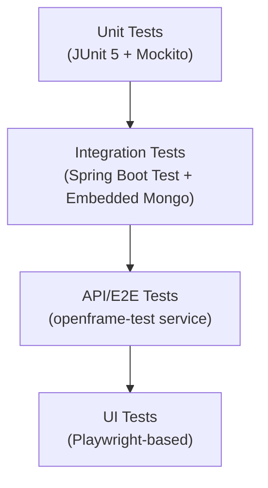

# Testing Overview

OpenFrame OSS Tenant uses a comprehensive testing strategy covering unit tests, integration tests, and end-to-end API tests.

---

## Test Structure and Organization

The project uses the following testing layers:



| Layer | Location | Scope |
|-------|----------|-------|
| **Unit Tests** | `src/test/java/**/*Test.java` | Individual classes and methods |
| **Integration Tests** | `src/test/java/**/*IT.java` | Spring context + Embedded MongoDB |
| **API / E2E Tests** | `openframe/services/openframe-test/` | Full platform API flows |
| **UI Tests** | `openframe-test` pages | Browser-based Playwright tests |

---

## Test Dependencies

The parent POM configures these test dependencies for all services:

```xml
<!-- Spring Boot Test (includes JUnit 5, AssertJ, Mockito) -->
<dependency>
    <groupId>org.springframework.boot</groupId>
    <artifactId>spring-boot-starter-test</artifactId>
    <scope>test</scope>
</dependency>

<!-- Spring Security Test -->
<dependency>
    <groupId>org.springframework.security</groupId>
    <artifactId>spring-security-test</artifactId>
    <scope>test</scope>
</dependency>

<!-- Mockito -->
<dependency>
    <groupId>org.mockito</groupId>
    <artifactId>mockito-core</artifactId>
    <scope>test</scope>
</dependency>

<!-- Mockito JUnit 5 Integration -->
<dependency>
    <groupId>org.mockito</groupId>
    <artifactId>mockito-junit-jupiter</artifactId>
    <scope>test</scope>
</dependency>
```

---

## Running Tests

### Run All Tests

```bash
# Run all tests across all modules
mvn test

# Run tests for a specific service
mvn test -pl openframe/services/openframe-api

# Run tests in parallel (faster)
mvn test -T 4
```

### Run a Specific Test Class

```bash
mvn test -pl openframe/services/openframe-api \
  -Dtest=AgentRegistrationServiceTest
```

### Run a Specific Test Method

```bash
mvn test -pl openframe/services/openframe-api \
  -Dtest="AgentRegistrationServiceTest#shouldRegisterAgent"
```

### Skip Tests (for fast builds)

```bash
mvn clean install -DskipTests
# or
mvn clean install -Dmaven.test.skip=true
```

### Integration Tests Only

Integration tests follow the `*IT.java` naming convention:

```bash
mvn verify -pl openframe/services/openframe-api \
  -Dtest="*IT"
```

---

## Unit Test Patterns

### Spring Service Unit Test

```java
@ExtendWith(MockitoExtension.class)
class AgentRegistrationServiceTest {

    @Mock
    private MachineRepository machineRepository;

    @Mock
    private AgentRegistrationSecretRepository secretRepository;

    @InjectMocks
    private AgentRegistrationService agentRegistrationService;

    @Test
    void shouldRegisterNewAgent() {
        // Arrange
        AgentRegistrationRequest request = new AgentRegistrationRequest(/* ... */);
        when(machineRepository.save(any())).thenReturn(new Machine());

        // Act
        AgentRegistrationResponse response = agentRegistrationService.register(request);

        // Assert
        assertThat(response).isNotNull();
        verify(machineRepository).save(any(Machine.class));
    }
}
```

### Controller Unit Test (MockMvc)

```java
@WebMvcTest(DeviceController.class)
@AutoConfigureMockMvc(addFilters = false)
class DeviceControllerTest {

    @Autowired
    private MockMvc mockMvc;

    @MockBean
    private DeviceService deviceService;

    @Test
    @WithMockUser(roles = "ADMIN")
    void shouldReturnDevices() throws Exception {
        mockMvc.perform(get("/api/devices"))
            .andExpect(status().isOk())
            .andExpect(content().contentType(MediaType.APPLICATION_JSON));
    }
}
```

---

## Integration Test Patterns

Integration tests use `BaseMongoIntegrationTest` as the base class, which sets up an embedded MongoDB (Flapdoodle) context.

```java
class NotificationServiceIT extends BaseMongoIntegrationTest {

    @Autowired
    private NotificationService notificationService;

    @Autowired
    private NotificationRepository notificationRepository;

    @Test
    void shouldCreateAndRetrieveNotification() {
        // Arrange
        Notification notification = NotificationFixtures.createNotification();

        // Act
        notificationService.create(notification);

        // Assert
        List<Notification> found = notificationRepository.findByTenantId("test-tenant");
        assertThat(found).hasSize(1);
    }
}
```

---

## API / End-to-End Test Suite

The `openframe-test` module provides a full end-to-end test framework using REST Assured and the `openframe-test-service-core` library.

### Test Categories

| Test | What it tests |
|------|--------------|
| `OwnerRegistrationTest` | Tenant registration flow |
| `AuthTokensTest` | OAuth2 token issuance and validation |
| `DevicesTest` | Device CRUD and filtering |
| `OrganizationsTest` | Customer/org management |
| `TicketsTest` | Help desk ticket lifecycle |
| `KnowledgeBaseTest` | Article and folder management |
| `LogsTest` | Audit log queries |
| `UserInvitationsTest` | Invitation flow |
| `ScriptsTest` | Script management and execution |
| `RunScriptTest` | Remote script execution |

### Running API Tests

The API tests require a running OpenFrame environment. Configure via environment variables:

```bash
# Target environment URL
OPENFRAME_API_URL=https://localhost

# Test user credentials  
OPENFRAME_TEST_EMAIL=test@yourtenant.com
OPENFRAME_TEST_PASSWORD=<test-password>

# Run the test suite
mvn test -pl openframe/services/openframe-test
```

### Test Helpers

The `openframe-test-service-core` library provides:

- `AuthFlow` — OAuth2 login and token management
- `AuthHelper` — Test authentication utilities
- `*Generator` classes — Test data factories (`DeviceGenerator`, `TicketGenerator`, etc.)
- `*Api` classes — Typed REST client wrappers (`DeviceApi`, `TicketApi`, etc.)
- `*Queries` classes — GraphQL query helpers (`DeviceQueries`, `TicketQueries`, etc.)

---

## Notification Integration Tests

MongoDB-backed notification tests extend `BaseMongoIntegrationTest`:

```java
class NotificationContextDispatchIT extends BaseMongoIntegrationTest {

    @Test
    void shouldDispatchNotificationWithContext() {
        // Uses NotificationFixtures for test data
        Notification n = NotificationFixtures.createApprovalNotification();
        // ... test assertions
    }
}
```

Performance-focused tests (load tests, index verification) are also available:

- `NotificationLoadTestIT`
- `NotificationReadStateIndexUsageIT`

---

## Writing New Tests

### Naming Conventions

| Convention | Example |
|------------|---------|
| Unit test | `AgentRegistrationServiceTest` |
| Controller test | `DeviceControllerTest` |
| Integration test (MongoDB) | `NotificationServiceIT` |
| Integration test (full context) | `NotificationDataFetcherIT` |
| E2E test | `DevicesTest`, `TicketsTest` |

### Test Data Patterns

Use fixture/factory patterns for consistent test data:

```java
// Create test data via generators
Machine testMachine = DeviceGenerator.createMachine("test-tenant");
Organization testOrg = OrganizationGenerator.createOrganization("test-tenant");

// Or use builder patterns
Notification notification = Notification.builder()
    .tenantId("test-tenant")
    .category(NotificationCategory.DEVICE)
    .severity(NotificationSeverity.WARNING)
    .build();
```

### GraphQL Test Patterns

For GraphQL endpoint testing, use the DGS test utilities:

```java
@SpringBootTest
class DeviceDataFetcherTest {

    @Autowired
    private DgsQueryExecutor dgsQueryExecutor;

    @Test
    void shouldQueryDevicesWithFilter() {
        String query = "{ devices(filter: { status: ONLINE }) { edges { node { id hostname } } } }";
        
        ExecutionResult result = dgsQueryExecutor.execute(query);
        
        assertThat(result.getErrors()).isEmpty();
    }
}
```

---

## Coverage Requirements

> Coverage targets are enforced during the CI/CD pipeline. While specific thresholds are defined per module, aim for:
>
> - **Service layer:** > 80% line coverage
> - **Controller layer:** > 70% line coverage
> - **Critical paths** (auth, billing, data access): > 90% line coverage

### Generate Coverage Reports

```bash
# Generate JaCoCo coverage report
mvn verify -pl openframe/services/openframe-api \
  -Djacoco.enabled=true

# Report location
open openframe/services/openframe-api/target/site/jacoco/index.html
```
