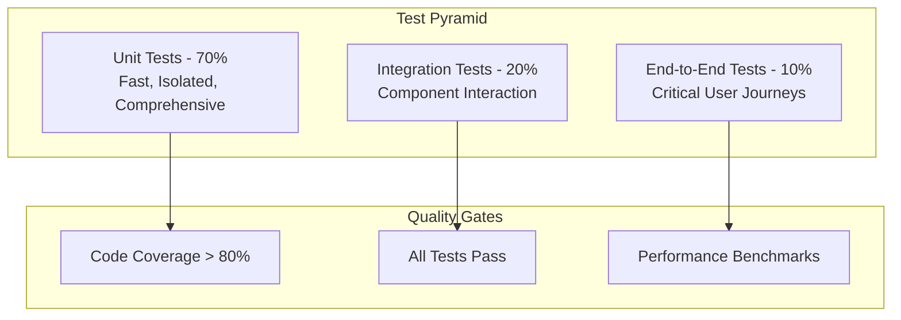

# Testing Overview

OpenFrame follows a comprehensive testing strategy that ensures code quality, reliability, and maintainability across all components. This guide covers our testing philosophy, frameworks, patterns, and best practices.

## Testing Philosophy

### Test Pyramid Strategy

OpenFrame follows the standard test pyramid with emphasis on fast, reliable unit tests:



### Testing Principles

1. **Fast Feedback**: Tests should run quickly to enable rapid development
2. **Reliable**: Tests should be deterministic and not flaky
3. **Maintainable**: Tests should be easy to understand and modify
4. **Comprehensive**: Critical paths and business logic must be covered
5. **Independent**: Tests should not depend on external services in CI/CD

## Backend Testing (Java/Spring Boot)

### Testing Framework Stack

| Component | Technology | Purpose |
|-----------|------------|---------|
| **Testing Framework** | JUnit 5 | Core testing framework |
| **Mocking** | Mockito | Mock objects and behavior |
| **Test Data** | TestContainers | Real database testing |
| **Web Testing** | MockMvc | REST API testing |
| **GraphQL Testing** | DGS Test Framework | GraphQL endpoint testing |
| **Security Testing** | Spring Security Test | Authentication/authorization |

### Unit Testing Patterns

#### Service Layer Testing
```java
@ExtendWith(MockitoExtension.class)
class UserServiceTest {
    
    @Mock
    private UserRepository userRepository;
    
    @Mock
    private PasswordEncoder passwordEncoder;
    
    @InjectMocks
    private UserService userService;
    
    @Test
    @DisplayName("Should create user with encoded password")
    void shouldCreateUserWithEncodedPassword() {
        // Given
        CreateUserRequest request = new CreateUserRequest("john.doe@test.com", "password123");
        User expectedUser = User.builder()
            .email("john.doe@test.com")
            .password("encoded-password")
            .build();
        
        when(passwordEncoder.encode("password123")).thenReturn("encoded-password");
        when(userRepository.save(any(User.class))).thenReturn(expectedUser);
        
        // When
        User result = userService.createUser(request);
        
        // Then
        assertThat(result.getEmail()).isEqualTo("john.doe@test.com");
        assertThat(result.getPassword()).isEqualTo("encoded-password");
        verify(userRepository).save(any(User.class));
    }
}
```

#### Repository Layer Testing
```java
@DataMongoTest
class UserRepositoryTest {
    
    @Autowired
    private TestEntityManager entityManager;
    
    @Autowired
    private UserRepository userRepository;
    
    @Test
    @DisplayName("Should find users by organization")
    void shouldFindUsersByOrganization() {
        // Given
        Organization org = Organization.builder()
            .name("Test Org")
            .domain("test.com")
            .build();
        entityManager.persistAndFlush(org);
        
        User user1 = User.builder()
            .email("user1@test.com")
            .organization(org)
            .build();
        User user2 = User.builder()
            .email("user2@test.com") 
            .organization(org)
            .build();
        entityManager.persistAndFlush(user1);
        entityManager.persistAndFlush(user2);
        
        // When
        List<User> result = userRepository.findByOrganization(org);
        
        // Then
        assertThat(result).hasSize(2);
        assertThat(result).extracting(User::getEmail)
            .containsExactlyInAnyOrder("user1@test.com", "user2@test.com");
    }
}
```

### Integration Testing

#### GraphQL Integration Tests
```java
@SpringBootTest(webEnvironment = SpringBootTest.WebEnvironment.RANDOM_PORT)
@DgsAutoConfiguration
class OrganizationDataFetcherIntegrationTest {
    
    @Autowired
    private DgsQueryExecutor dgsQueryExecutor;
    
    @Autowired
    private TestEntityManager entityManager;
    
    @Test
    @DisplayName("Should fetch organizations with pagination")
    void shouldFetchOrganizationsWithPagination() {
        // Given
        createTestOrganizations(5);
        
        String query = """
            query {
                organizations(first: 3) {
                    edges {
                        node {
                            id
                            name
                            domain
                        }
                    }
                    pageInfo {
                        hasNextPage
                        hasPreviousPage
                    }
                }
            }
            """;
        
        // When
        ExecutionResult executionResult = dgsQueryExecutor.execute(query);
        
        // Then
        assertThat(executionResult.getErrors()).isEmpty();
        
        Map<String, Object> data = executionResult.getData();
        Map<String, Object> organizations = (Map<String, Object>) data.get("organizations");
        List<Map<String, Object>> edges = (List<Map<String, Object>>) organizations.get("edges");
        
        assertThat(edges).hasSize(3);
        
        Map<String, Object> pageInfo = (Map<String, Object>) organizations.get("pageInfo");
        assertThat(pageInfo.get("hasNextPage")).isEqualTo(true);
        assertThat(pageInfo.get("hasPreviousPage")).isEqualTo(false);
    }
}
```

#### REST API Integration Tests
```java
@SpringBootTest(webEnvironment = SpringBootTest.WebEnvironment.RANDOM_PORT)
@AutoConfigureTestDatabase(replace = AutoConfigureTestDatabase.Replace.NONE)
@Testcontainers
class DeviceControllerIntegrationTest {
    
    @Container
    static MongoDBContainer mongoDBContainer = new MongoDBContainer("mongo:7.0")
            .withExposedPorts(27017);
    
    @Autowired
    private TestRestTemplate restTemplate;
    
    @Autowired
    private DeviceRepository deviceRepository;
    
    @Test
    @DisplayName("Should create device and return created status")
    void shouldCreateDeviceAndReturnCreatedStatus() {
        // Given
        CreateDeviceRequest request = CreateDeviceRequest.builder()
            .name("Test Device")
            .type(DeviceType.DESKTOP)
            .operatingSystem("Windows 11")
            .build();
        
        HttpHeaders headers = new HttpHeaders();
        headers.setContentType(MediaType.APPLICATION_JSON);
        headers.setBearerAuth(getValidJwtToken());
        
        HttpEntity<CreateDeviceRequest> entity = new HttpEntity<>(request, headers);
        
        // When
        ResponseEntity<DeviceResponse> response = restTemplate.postForEntity(
            "/api/devices", entity, DeviceResponse.class);
        
        // Then
        assertThat(response.getStatusCode()).isEqualTo(HttpStatus.CREATED);
        assertThat(response.getBody()).isNotNull();
        assertThat(response.getBody().getName()).isEqualTo("Test Device");
        
        // Verify database
        Optional<Device> savedDevice = deviceRepository.findById(response.getBody().getId());
        assertThat(savedDevice).isPresent();
    }
}
```

### Security Testing

#### Authentication Tests
```java
@SpringBootTest
@AutoConfigureTestDatabase
@WithMockUser(roles = "ADMIN")
class SecurityConfigTest {
    
    @Autowired
    private MockMvc mockMvc;
    
    @Test
    @DisplayName("Should require authentication for protected endpoints")
    void shouldRequireAuthenticationForProtectedEndpoints() throws Exception {
        mockMvc.perform(get("/api/organizations"))
            .andExpect(status().isUnauthorized());
    }
    
    @Test
    @WithMockUser(roles = "USER")
    @DisplayName("Should allow access with valid role")
    void shouldAllowAccessWithValidRole() throws Exception {
        mockMvc.perform(get("/api/organizations"))
            .andExpect(status().isOk());
    }
    
    @Test
    @WithMockUser(roles = "GUEST") 
    @DisplayName("Should deny access with insufficient role")
    void shouldDenyAccessWithInsufficientRole() throws Exception {
        mockMvc.perform(delete("/api/organizations/1"))
            .andExpect(status().isForbidden());
    }
}
```

### Test Configuration

#### Test Application Properties
```yaml
# application-test.yml
spring:
  profiles:
    active: test
  datasource:
    url: jdbc:h2:mem:testdb
    driver-class-name: org.h2.Driver
  jpa:
    hibernate:
      ddl-auto: create-drop
  mongodb:
    embedded:
      version: 7.0.2
  kafka:
    consumer:
      bootstrap-servers: ${spring.embedded.kafka.brokers}
    producer:
      bootstrap-servers: ${spring.embedded.kafka.brokers}

logging:
  level:
    com.openframe: DEBUG
    org.springframework.security: TRACE

jwt:
  secret: test-secret-key-for-unit-tests-only
  expiration: 3600
```

## Frontend Testing (Vue.js/TypeScript)

### Frontend Testing Stack

| Component | Technology | Purpose |
|-----------|------------|---------|
| **Test Runner** | Vitest | Fast unit test execution |
| **Testing Library** | Vue Testing Library | Component testing |
| **Mocking** | vi (Vitest) | Mock functions and modules |
| **E2E Testing** | Playwright | End-to-end browser testing |
| **Type Checking** | TypeScript | Compile-time type safety |

### Component Testing

#### Vue Component Tests
```typescript
import { describe, it, expect, vi } from 'vitest'
import { render, screen, fireEvent } from '@testing-library/vue'
import { createPinia } from 'pinia'
import OrganizationCard from '@/components/OrganizationCard.vue'
import type { Organization } from '@/types/organization'

describe('OrganizationCard', () => {
  const mockOrganization: Organization = {
    id: '1',
    name: 'Test Organization',
    domain: 'test.com',
    contactEmail: 'admin@test.com',
    status: 'ACTIVE'
  }

  it('should display organization information', () => {
    // Given
    render(OrganizationCard, {
      props: {
        organization: mockOrganization
      },
      global: {
        plugins: [createPinia()]
      }
    })

    // Then
    expect(screen.getByText('Test Organization')).toBeInTheDocument()
    expect(screen.getByText('test.com')).toBeInTheDocument()
    expect(screen.getByText('admin@test.com')).toBeInTheDocument()
  })

  it('should emit edit event when edit button is clicked', async () => {
    // Given
    const { emitted } = render(OrganizationCard, {
      props: {
        organization: mockOrganization,
        editable: true
      }
    })

    // When
    await fireEvent.click(screen.getByRole('button', { name: /edit/i }))

    // Then
    expect(emitted().edit).toBeTruthy()
    expect(emitted().edit[0]).toEqual([mockOrganization])
  })
})
```

#### Store Testing (Pinia)
```typescript
import { describe, it, expect, beforeEach, vi } from 'vitest'
import { setActivePinia, createPinia } from 'pinia'
import { useOrganizationStore } from '@/stores/organization'
import { apiClient } from '@/lib/api-client'

// Mock API client
vi.mock('@/lib/api-client', () => ({
  apiClient: {
    organizations: {
      list: vi.fn(),
      create: vi.fn(),
      update: vi.fn(),
      delete: vi.fn()
    }
  }
}))

describe('Organization Store', () => {
  beforeEach(() => {
    setActivePinia(createPinia())
    vi.clearAllMocks()
  })

  it('should fetch organizations successfully', async () => {
    // Given
    const mockOrganizations = [
      { id: '1', name: 'Org 1', domain: 'org1.com' },
      { id: '2', name: 'Org 2', domain: 'org2.com' }
    ]
    
    vi.mocked(apiClient.organizations.list).mockResolvedValue({
      data: { organizations: { edges: mockOrganizations } }
    })

    const store = useOrganizationStore()

    // When
    await store.fetchOrganizations()

    // Then
    expect(store.organizations).toHaveLength(2)
    expect(store.loading).toBe(false)
    expect(store.error).toBeNull()
  })

  it('should handle fetch error gracefully', async () => {
    // Given
    const errorMessage = 'Failed to fetch organizations'
    vi.mocked(apiClient.organizations.list).mockRejectedValue(
      new Error(errorMessage)
    )

    const store = useOrganizationStore()

    // When
    await store.fetchOrganizations()

    // Then
    expect(store.organizations).toHaveLength(0)
    expect(store.loading).toBe(false)
    expect(store.error).toBe(errorMessage)
  })
})
```

### GraphQL Client Testing

#### Apollo Client Mock
```typescript
import { describe, it, expect, vi } from 'vitest'
import { MockedProvider } from '@apollo/client/testing'
import { render, screen, waitFor } from '@testing-library/vue'
import OrganizationList from '@/components/OrganizationList.vue'
import { GET_ORGANIZATIONS } from '@/queries/organizations'

const mocks = [
  {
    request: {
      query: GET_ORGANIZATIONS,
      variables: { first: 10 }
    },
    result: {
      data: {
        organizations: {
          edges: [
            { node: { id: '1', name: 'Test Org', domain: 'test.com' } }
          ],
          pageInfo: { hasNextPage: false, hasPreviousPage: false }
        }
      }
    }
  }
]

describe('OrganizationList with GraphQL', () => {
  it('should display organizations from GraphQL query', async () => {
    // Given
    render(OrganizationList, {
      global: {
        plugins: [MockedProvider as any]
      },
      props: {
        apolloProvider: new MockedProvider({ mocks, addTypename: false })
      }
    })

    // When
    await waitFor(() => {
      expect(screen.getByText('Test Org')).toBeInTheDocument()
    })

    // Then
    expect(screen.getByText('test.com')).toBeInTheDocument()
  })
})
```

## End-to-End Testing

### Playwright E2E Tests

#### User Journey Tests
```typescript
import { test, expect } from '@playwright/test'

test.describe('User Authentication Flow', () => {
  test('should login and access dashboard', async ({ page }) => {
    // Given
    await page.goto('/auth/login')

    // When - Login
    await page.fill('[data-testid="email-input"]', 'admin@openframe.local')
    await page.fill('[data-testid="password-input"]', 'admin123!')
    await page.click('[data-testid="login-button"]')

    // Then - Should redirect to dashboard
    await expect(page).toHaveURL('/dashboard')
    await expect(page.locator('[data-testid="dashboard-title"]')).toContainText('Dashboard')
  })

  test('should create new organization', async ({ page }) => {
    // Given - User is logged in
    await loginAsAdmin(page)
    await page.goto('/organizations')

    // When - Create organization
    await page.click('[data-testid="new-organization-button"]')
    await page.fill('[data-testid="org-name-input"]', 'Test Organization')
    await page.fill('[data-testid="org-domain-input"]', 'test-org.com')
    await page.fill('[data-testid="org-email-input"]', 'admin@test-org.com')
    await page.click('[data-testid="save-organization-button"]')

    // Then - Should show in list
    await expect(page.locator('[data-testid="organization-list"]')).toContainText('Test Organization')
  })
})

// Test utilities
async function loginAsAdmin(page: Page) {
  await page.goto('/auth/login')
  await page.fill('[data-testid="email-input"]', 'admin@openframe.local')
  await page.fill('[data-testid="password-input"]', 'admin123!')
  await page.click('[data-testid="login-button"]')
  await page.waitForURL('/dashboard')
}
```

### Performance Testing

#### Load Testing with Playwright
```typescript
import { test, expect } from '@playwright/test'

test.describe('Performance Tests', () => {
  test('dashboard should load within 2 seconds', async ({ page }) => {
    // Given
    await loginAsAdmin(page)
    
    // When
    const startTime = Date.now()
    await page.goto('/dashboard')
    await page.waitForSelector('[data-testid="dashboard-content"]')
    const loadTime = Date.now() - startTime

    // Then
    expect(loadTime).toBeLessThan(2000)
  })

  test('organization list should handle 100+ items', async ({ page }) => {
    // Given - Seed database with 100 organizations
    await seedOrganizations(100)
    await loginAsAdmin(page)

    // When
    const startTime = Date.now()
    await page.goto('/organizations')
    await page.waitForSelector('[data-testid="organization-list"]')
    const loadTime = Date.now() - startTime

    // Then
    expect(loadTime).toBeLessThan(3000)
    
    const orgCount = await page.locator('[data-testid="organization-item"]').count()
    expect(orgCount).toBeGreaterThanOrEqual(20) // Assuming pagination
  })
})
```

## Rust Testing (System Agent)

### Unit Testing in Rust
```rust
#[cfg(test)]
mod tests {
    use super::*;
    use tokio_test;
    use mockall::predicate::*;

    #[tokio::test]
    async fn test_device_registration() {
        // Given
        let mut mock_client = MockApiClient::new();
        mock_client
            .expect_register_device()
            .with(eq(DeviceRegistrationRequest {
                name: "test-device".to_string(),
                device_type: DeviceType::Desktop,
                os_info: OsInfo {
                    name: "Windows".to_string(),
                    version: "11".to_string(),
                },
            }))
            .times(1)
            .returning(|_| {
                Ok(DeviceRegistrationResponse {
                    device_id: "device-123".to_string(),
                    agent_token: "token-456".to_string(),
                })
            });

        let agent = Agent::new(mock_client);

        // When
        let result = agent.register_device().await;

        // Then
        assert!(result.is_ok());
        let response = result.unwrap();
        assert_eq!(response.device_id, "device-123");
    }

    #[test]
    fn test_device_info_collection() {
        // Given
        let collector = DeviceInfoCollector::new();

        // When
        let info = collector.collect_system_info();

        // Then
        assert!(!info.hostname.is_empty());
        assert!(info.total_memory > 0);
        assert!(!info.cpu_info.is_empty());
    }
}
```

## Test Data Management

### Test Data Builders

#### Java Test Data Builders
```java
public class TestDataBuilder {
    
    public static class UserBuilder {
        private String email = "test@example.com";
        private String firstName = "John";
        private String lastName = "Doe";
        private UserRole role = UserRole.USER;
        private Organization organization;
        
        public UserBuilder email(String email) {
            this.email = email;
            return this;
        }
        
        public UserBuilder admin() {
            this.role = UserRole.ADMIN;
            return this;
        }
        
        public UserBuilder organization(Organization organization) {
            this.organization = organization;
            return this;
        }
        
        public User build() {
            return User.builder()
                .email(email)
                .firstName(firstName)
                .lastName(lastName)
                .role(role)
                .organization(organization)
                .build();
        }
    }
    
    public static UserBuilder user() {
        return new UserBuilder();
    }
    
    public static class OrganizationBuilder {
        private String name = "Test Organization";
        private String domain = "test.com";
        private String contactEmail = "admin@test.com";
        
        public OrganizationBuilder name(String name) {
            this.name = name;
            return this;
        }
        
        public Organization build() {
            return Organization.builder()
                .name(name)
                .domain(domain)
                .contactEmail(contactEmail)
                .build();
        }
    }
    
    public static OrganizationBuilder organization() {
        return new OrganizationBuilder();
    }
}
```

### Database Test Utilities

#### MongoDB Test Setup
```java
@TestConfiguration
public class MongoTestConfig {
    
    @Bean
    @Primary
    public MongoTemplate mongoTemplate() {
        return new MongoTemplate(mongoClient(), "openframe_test");
    }
    
    @Bean
    public MongoClient mongoClient() {
        return MongoClients.create("mongodb://localhost:27017");
    }
    
    @EventListener
    public void handleContextRefresh(ContextRefreshedEvent event) {
        // Clean database before tests
        mongoTemplate().getDb().drop();
    }
}
```

## Continuous Integration

### GitHub Actions Test Pipeline
```yaml
# .github/workflows/test.yml
name: Test Pipeline

on:
  push:
    branches: [ main, develop ]
  pull_request:
    branches: [ main ]

jobs:
  backend-tests:
    runs-on: ubuntu-latest
    services:
      mongodb:
        image: mongo:7.0
        ports:
          - 27017:27017
      redis:
        image: redis:7
        ports:
          - 6379:6379

    steps:
    - uses: actions/checkout@v3
    
    - name: Set up JDK 21
      uses: actions/setup-java@v3
      with:
        java-version: '21'
        distribution: 'temurin'
        
    - name: Cache Maven dependencies
      uses: actions/cache@v3
      with:
        path: ~/.m2
        key: ${{ runner.os }}-m2-${{ hashFiles('**/pom.xml') }}
        
    - name: Run backend tests
      run: |
        mvn clean test
        mvn jacoco:report
        
    - name: Upload coverage to Codecov
      uses: codecov/codecov-action@v3

  frontend-tests:
    runs-on: ubuntu-latest
    steps:
    - uses: actions/checkout@v3
    
    - name: Set up Node.js
      uses: actions/setup-node@v3
      with:
        node-version: '18'
        cache: 'npm'
        cache-dependency-path: 'openframe/services/openframe-frontend/package-lock.json'
        
    - name: Install dependencies
      working-directory: openframe/services/openframe-frontend
      run: npm ci
      
    - name: Run frontend tests
      working-directory: openframe/services/openframe-frontend
      run: |
        npm run test:unit
        npm run type-check
        
    - name: Run E2E tests
      working-directory: openframe/services/openframe-frontend
      run: |
        npx playwright install
        npm run test:e2e

  rust-tests:
    runs-on: ubuntu-latest
    steps:
    - uses: actions/checkout@v3
    
    - name: Set up Rust
      uses: actions-rs/toolchain@v1
      with:
        toolchain: stable
        
    - name: Run Rust tests
      working-directory: clients/openframe-client
      run: |
        cargo test
        cargo clippy -- -D warnings
        cargo fmt -- --check
```

## Test Coverage and Quality Gates

### Coverage Requirements

| Component | Minimum Coverage | Target Coverage |
|-----------|-----------------|-----------------|
| **Service Layer** | 85% | 90% |
| **Controller Layer** | 80% | 85% |
| **Repository Layer** | 75% | 80% |
| **Frontend Components** | 70% | 80% |
| **Frontend Stores** | 85% | 90% |
| **Rust Code** | 80% | 85% |

### Quality Checks
```bash
# Java code coverage
mvn jacoco:report jacoco:check

# Frontend coverage
npm run test:coverage

# Rust coverage
cargo install cargo-tarpaulin
cargo tarpaulin --out Html

# Code quality analysis
mvn sonar:sonar
npm run lint
cargo clippy
```

## Testing Best Practices

### Do's ✅

1. **Write Tests First**: Use TDD when possible
2. **Test Behavior**: Focus on what the code does, not how
3. **Use Descriptive Names**: Test names should explain the scenario
4. **Arrange-Act-Assert**: Structure tests clearly
5. **Mock External Dependencies**: Keep tests isolated
6. **Test Edge Cases**: Include boundary conditions and error scenarios

### Don'ts ❌

1. **Don't Test Implementation Details**: Avoid testing private methods directly
2. **Don't Write Brittle Tests**: Tests shouldn't break on minor refactoring
3. **Don't Ignore Flaky Tests**: Fix or remove unreliable tests
4. **Don't Test Everything**: Focus on critical business logic
5. **Don't Skip Performance Tests**: Include load testing for critical paths

## Testing Commands Reference

### Backend Testing Commands
```bash
# Run all tests
mvn test

# Run specific test class
mvn test -Dtest=UserServiceTest

# Run tests with coverage
mvn test jacoco:report

# Run integration tests only
mvn verify -DskipUnitTests

# Run tests with specific profile
mvn test -Dspring.profiles.active=test
```

### Frontend Testing Commands
```bash
cd openframe/services/openframe-frontend

# Unit tests
npm run test:unit

# Watch mode
npm run test:watch

# Coverage report
npm run test:coverage

# E2E tests
npm run test:e2e

# Type checking
npm run type-check

# Lint tests
npm run lint
```

### Rust Testing Commands
```bash
cd clients/openframe-client

# Unit tests
cargo test

# Integration tests
cargo test --test integration

# With output
cargo test -- --nocapture

# Specific test
cargo test test_device_registration

# Coverage
cargo tarpaulin
```

---

This testing strategy ensures OpenFrame maintains high code quality while enabling rapid, confident development. Follow these patterns and practices to contribute robust, well-tested code to the platform.