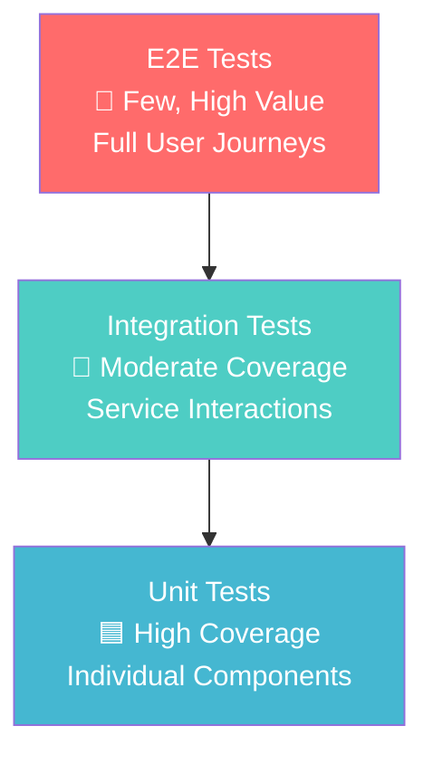

# Testing Overview

OpenFrame employs a comprehensive testing strategy to ensure reliability, performance, and maintainability. This guide covers our testing philosophy, tools, and best practices across the entire platform.

## Testing Philosophy

### Testing Pyramid

We follow the testing pyramid principle with emphasis on fast, reliable automated tests:



### Coverage Goals

| Test Type | Target Coverage | Purpose | Speed |
|-----------|----------------|---------|-------|
| **Unit Tests** | 80%+ new code | Component logic validation | <1s per test |
| **Integration Tests** | 60%+ critical paths | Service interaction verification | <10s per test |
| **E2E Tests** | Key user workflows | End-to-end validation | <2min per test |
| **Performance Tests** | Critical APIs | Load and stress testing | Variable |

### Quality Gates

All code must pass these quality gates before merging:

✅ **Unit tests pass** with coverage ≥80%  
✅ **Integration tests pass** for modified services  
✅ **Code quality checks** (SonarQube, ESLint, Clippy)  
✅ **Security scans** (SAST, dependency checks)  
✅ **E2E tests pass** for affected user flows  

## Test Organization

### Directory Structure

```
openframe/
├── services/
│   ├── openframe-api/
│   │   ├── src/test/java/           # Java unit & integration tests
│   │   └── src/test/resources/      # Test configurations
│   ├── openframe-gateway/
│   │   └── src/test/java/
│   └── openframe-frontend/
│       ├── src/__tests__/           # Unit tests (Vitest)
│       ├── tests/e2e/              # E2E tests (Playwright)
│       └── tests/integration/      # Frontend integration tests
├── clients/openframe-client/
│   ├── src/                        # Rust source
│   ├── tests/                      # Rust integration tests
│   └── benches/                    # Performance benchmarks
├── openframe-e2e-tests/           # Cross-service E2E tests
└── scripts/
    ├── test-all.sh                # Run all tests
    ├── test-backend.sh            # Backend tests only
    └── test-frontend.sh           # Frontend tests only
```

### Test Categories

**Unit Tests:**
- Individual functions and methods
- Component behavior in isolation
- Mocked external dependencies
- Fast execution (<1 second per test)

**Integration Tests:**
- Service-to-service communication
- Database interactions
- External API integrations
- Real dependency interactions

**End-to-End Tests:**
- Complete user workflows
- Browser automation
- Real production-like environment
- Full stack validation

## Backend Testing (Java/Spring Boot)

### Unit Testing Framework

We use **JUnit 5** with **Mockito** for mocking and **AssertJ** for fluent assertions.

#### Test Structure Example

```java
@ExtendWith(MockitoExtension.class)
class OrganizationServiceTest {
    
    @Mock
    private OrganizationRepository organizationRepository;
    
    @Mock
    private UserService userService;
    
    @InjectMocks
    private OrganizationService organizationService;
    
    @Test
    @DisplayName("Should create organization with valid data")
    void shouldCreateOrganization() {
        // Given
        CreateOrganizationRequest request = CreateOrganizationRequest.builder()
            .name("Test Organization")
            .contactEmail("test@example.com")
            .build();
            
        Organization expectedOrg = Organization.builder()
            .id("org-123")
            .name("Test Organization")
            .build();
            
        when(organizationRepository.save(any(Organization.class)))
            .thenReturn(expectedOrg);
        
        // When
        Organization result = organizationService.createOrganization(request);
        
        // Then
        assertThat(result)
            .isNotNull()
            .satisfies(org -> {
                assertThat(org.getName()).isEqualTo("Test Organization");
                assertThat(org.getId()).isNotBlank();
            });
            
        verify(organizationRepository).save(any(Organization.class));
    }
}
```

#### Test Configuration

```java
// Test configuration class
@TestConfiguration
@EnableConfigurationProperties
public class TestConfig {
    
    @Bean
    @Primary
    public Clock testClock() {
        return Clock.fixed(Instant.parse("2024-01-15T10:00:00Z"), ZoneOffset.UTC);
    }
    
    @Bean
    @Primary
    public IdGenerator testIdGenerator() {
        return () -> "test-uuid-123";
    }
}
```

### Integration Testing

Integration tests use **@SpringBootTest** with **Testcontainers** for real database testing.

#### Database Integration Test

```java
@SpringBootTest
@Testcontainers
@ActiveProfiles("integration-test")
class OrganizationRepositoryIntegrationTest {
    
    @Container
    static MongoDBContainer mongoDBContainer = new MongoDBContainer("mongo:7.0")
            .withExposedPorts(27017);
    
    @Autowired
    private OrganizationRepository organizationRepository;
    
    @BeforeEach
    void setUp() {
        organizationRepository.deleteAll();
    }
    
    @Test
    void shouldFindOrganizationsByTenantId() {
        // Given
        String tenantId = "tenant-123";
        Organization org1 = createOrganization("Org 1", tenantId);
        Organization org2 = createOrganization("Org 2", tenantId);
        Organization org3 = createOrganization("Org 3", "different-tenant");
        
        organizationRepository.saveAll(List.of(org1, org2, org3));
        
        // When
        List<Organization> result = organizationRepository.findByTenantId(tenantId);
        
        // Then
        assertThat(result)
            .hasSize(2)
            .extracting(Organization::getName)
            .containsExactlyInAnyOrder("Org 1", "Org 2");
    }
}
```

#### GraphQL API Testing

```java
@SpringBootTest(webEnvironment = SpringBootTest.WebEnvironment.RANDOM_PORT)
@AutoConfigureTestDatabase(replace = AutoConfigureTestDatabase.Replace.NONE)
class OrganizationGraphQLTest {
    
    @Autowired
    private TestRestTemplate restTemplate;
    
    @Autowired
    private OrganizationRepository organizationRepository;
    
    @Test
    void shouldQueryOrganizations() {
        // Given
        organizationRepository.save(createTestOrganization());
        
        String query = """
            query {
                organizations(first: 10) {
                    edges {
                        node {
                            id
                            name
                            type
                        }
                    }
                }
            }
            """;
            
        GraphQLRequest request = new GraphQLRequest(query);
        
        // When
        ResponseEntity<GraphQLResponse> response = restTemplate.postForEntity(
            "/graphql", request, GraphQLResponse.class);
        
        // Then
        assertThat(response.getStatusCode()).isEqualTo(HttpStatus.OK);
        assertThat(response.getBody().getData())
            .isNotNull()
            .extracting("organizations.edges")
            .asList()
            .hasSize(1);
    }
}
```

### Running Backend Tests

```bash
# Run all backend tests
mvn test

# Run specific test class
mvn test -Dtest=OrganizationServiceTest

# Run with coverage
mvn test jacoco:report

# Run integration tests only
mvn test -Dgroups=integration

# Run tests with specific profile
mvn test -Dspring.profiles.active=integration-test

# Parallel test execution
mvn test -Dparallel=all -DthreadCount=4
```

## Frontend Testing (Vue.js/TypeScript)

### Unit Testing with Vitest

We use **Vitest** for fast unit testing with **Vue Test Utils** for component testing.

#### Component Test Example

```typescript
// tests/unit/OrganizationCard.test.ts
import { describe, it, expect, vi } from 'vitest'
import { mount } from '@vue/test-utils'
import { createTestingPinia } from '@pinia/testing'
import OrganizationCard from '@/components/OrganizationCard.vue'
import type { Organization } from '@/types/organization'

describe('OrganizationCard', () => {
  const mockOrganization: Organization = {
    id: 'org-123',
    name: 'Test Organization',
    type: 'client',
    deviceCount: 5,
    userCount: 3,
    lastActivity: '2024-01-15T10:00:00Z'
  }

  it('displays organization information correctly', () => {
    const wrapper = mount(OrganizationCard, {
      props: {
        organization: mockOrganization
      },
      global: {
        plugins: [createTestingPinia({ createSpy: vi.fn })]
      }
    })

    expect(wrapper.find('[data-testid="org-name"]').text())
      .toBe('Test Organization')
    expect(wrapper.find('[data-testid="device-count"]').text())
      .toBe('5 devices')
    expect(wrapper.find('[data-testid="user-count"]').text())
      .toBe('3 users')
  })

  it('emits edit event when edit button is clicked', async () => {
    const wrapper = mount(OrganizationCard, {
      props: { organization: mockOrganization },
      global: {
        plugins: [createTestingPinia({ createSpy: vi.fn })]
      }
    })

    await wrapper.find('[data-testid="edit-button"]').trigger('click')

    expect(wrapper.emitted('edit')).toHaveLength(1)
    expect(wrapper.emitted('edit')?.[0]).toEqual([mockOrganization])
  })
})
```

#### Store Testing

```typescript
// tests/unit/stores/organizations.test.ts
import { describe, it, expect, beforeEach, vi } from 'vitest'
import { setActivePinia, createPinia } from 'pinia'
import { useOrganizationsStore } from '@/stores/organizations'
import { organizationApi } from '@/api/organizations'

vi.mock('@/api/organizations')

describe('Organizations Store', () => {
  beforeEach(() => {
    setActivePinia(createPinia())
    vi.clearAllMocks()
  })

  it('fetches organizations successfully', async () => {
    const mockOrganizations = [
      { id: '1', name: 'Org 1' },
      { id: '2', name: 'Org 2' }
    ]
    
    vi.mocked(organizationApi.getOrganizations).mockResolvedValue(mockOrganizations)

    const store = useOrganizationsStore()
    await store.fetchOrganizations()

    expect(store.organizations).toEqual(mockOrganizations)
    expect(store.loading).toBe(false)
    expect(store.error).toBeNull()
  })

  it('handles fetch error correctly', async () => {
    const error = new Error('API Error')
    vi.mocked(organizationApi.getOrganizations).mockRejectedValue(error)

    const store = useOrganizationsStore()
    await store.fetchOrganizations()

    expect(store.organizations).toEqual([])
    expect(store.loading).toBe(false)
    expect(store.error).toBe('API Error')
  })
})
```

### E2E Testing with Playwright

**Playwright** provides cross-browser E2E testing capabilities.

#### E2E Test Example

```typescript
// tests/e2e/organizations.spec.ts
import { test, expect } from '@playwright/test'

test.describe('Organization Management', () => {
  test.beforeEach(async ({ page }) => {
    // Login before each test
    await page.goto('/auth/login')
    await page.fill('[data-testid="email-input"]', 'admin@example.com')
    await page.fill('[data-testid="password-input"]', 'password123')
    await page.click('[data-testid="login-button"]')
    await expect(page).toHaveURL('/dashboard')
  })

  test('should create a new organization', async ({ page }) => {
    // Navigate to organizations page
    await page.click('[data-testid="nav-organizations"]')
    await expect(page).toHaveURL('/organizations')

    // Click create organization
    await page.click('[data-testid="create-org-button"]')
    
    // Fill form
    await page.fill('[data-testid="org-name-input"]', 'Test Organization')
    await page.selectOption('[data-testid="org-type-select"]', 'client')
    await page.fill('[data-testid="contact-email-input"]', 'contact@testorg.com')
    
    // Submit form
    await page.click('[data-testid="save-org-button"]')
    
    // Verify success
    await expect(page.locator('.success-message')).toBeVisible()
    await expect(page.locator('[data-testid="org-name"]').first())
      .toHaveText('Test Organization')
  })

  test('should display organization details', async ({ page }) => {
    await page.goto('/organizations')
    
    // Click on first organization
    await page.click('[data-testid="org-card"]')
    
    // Verify details page
    await expect(page).toHaveURL(/\/organizations\/[a-zA-Z0-9-]+/)
    await expect(page.locator('h1')).toBeVisible()
    await expect(page.locator('[data-testid="device-count"]')).toBeVisible()
    await expect(page.locator('[data-testid="user-count"]')).toBeVisible()
  })
})
```

#### Playwright Configuration

```typescript
// playwright.config.ts
import { defineConfig, devices } from '@playwright/test'

export default defineConfig({
  testDir: './tests/e2e',
  fullyParallel: true,
  forbidOnly: !!process.env.CI,
  retries: process.env.CI ? 2 : 0,
  workers: process.env.CI ? 1 : undefined,
  reporter: 'html',
  
  use: {
    baseURL: 'http://localhost:3000',
    trace: 'on-first-retry',
    screenshot: 'only-on-failure',
  },

  projects: [
    {
      name: 'chromium',
      use: { ...devices['Desktop Chrome'] },
    },
    {
      name: 'firefox',
      use: { ...devices['Desktop Firefox'] },
    },
    {
      name: 'webkit',
      use: { ...devices['Desktop Safari'] },
    },
  ],

  webServer: {
    command: 'npm run dev',
    url: 'http://localhost:3000',
    reuseExistingServer: !process.env.CI,
  },
})
```

### Running Frontend Tests

```bash
# Unit tests with Vitest
npm run test

# Unit tests in watch mode
npm run test:watch

# Run with coverage
npm run test:coverage

# E2E tests with Playwright
npm run test:e2e

# E2E tests in headed mode (visible browser)
npm run test:e2e:headed

# E2E tests in specific browser
npm run test:e2e -- --project=chromium

# Component tests (Cypress component testing)
npm run test:component
```

## Rust Client Testing

### Unit Testing in Rust

Rust has excellent built-in testing support with `cargo test`.

#### Test Example

```rust
// src/services/device_monitor.rs
pub struct DeviceMonitor {
    interval: Duration,
}

impl DeviceMonitor {
    pub fn new(interval: Duration) -> Self {
        Self { interval }
    }
    
    pub fn get_cpu_usage(&self) -> Result<f32, MonitorError> {
        // Implementation here
        Ok(45.2)
    }
    
    pub fn get_memory_usage(&self) -> Result<MemoryInfo, MonitorError> {
        // Implementation here
        Ok(MemoryInfo {
            total: 8_000_000_000,
            used: 4_000_000_000,
            available: 4_000_000_000,
        })
    }
}

#[cfg(test)]
mod tests {
    use super::*;
    use std::time::Duration;

    #[test]
    fn test_device_monitor_creation() {
        let monitor = DeviceMonitor::new(Duration::from_secs(60));
        assert_eq!(monitor.interval, Duration::from_secs(60));
    }

    #[test]
    fn test_cpu_usage_returns_valid_percentage() {
        let monitor = DeviceMonitor::new(Duration::from_secs(30));
        let cpu_usage = monitor.get_cpu_usage().unwrap();
        assert!(cpu_usage >= 0.0 && cpu_usage <= 100.0);
    }

    #[test]
    fn test_memory_usage_calculation() {
        let monitor = DeviceMonitor::new(Duration::from_secs(30));
        let memory = monitor.get_memory_usage().unwrap();
        
        assert!(memory.total > 0);
        assert!(memory.used <= memory.total);
        assert!(memory.available <= memory.total);
        assert_eq!(memory.used + memory.available, memory.total);
    }

    #[test]
    #[should_panic(expected = "Invalid interval")]
    fn test_invalid_interval_panics() {
        DeviceMonitor::new(Duration::from_secs(0));
    }
}
```

#### Integration Tests

```rust
// tests/integration_test.rs
use openframe_client::{Client, Config};
use tokio::time::{timeout, Duration};

#[tokio::test]
async fn test_client_registration_flow() {
    let config = Config {
        server_url: "http://localhost:8080".to_string(),
        org_id: "test-org".to_string(),
        ..Default::default()
    };
    
    let mut client = Client::new(config).await.unwrap();
    
    // Test registration
    let result = timeout(
        Duration::from_secs(10),
        client.register_with_server()
    ).await;
    
    assert!(result.is_ok());
    assert!(client.is_registered());
}

#[tokio::test]
async fn test_heartbeat_mechanism() {
    let config = Config::test_config();
    let mut client = Client::new(config).await.unwrap();
    
    // Start heartbeat
    client.start_heartbeat().await.unwrap();
    
    // Wait for at least one heartbeat
    tokio::time::sleep(Duration::from_secs(2)).await;
    
    // Verify heartbeat was sent
    assert!(client.last_heartbeat().is_some());
}
```

#### Benchmark Tests

```rust
// benches/performance.rs
use criterion::{black_box, criterion_group, criterion_main, Criterion};
use openframe_client::services::DeviceMonitor;

fn benchmark_cpu_monitoring(c: &mut Criterion) {
    let monitor = DeviceMonitor::new(Duration::from_secs(1));
    
    c.bench_function("cpu_usage", |b| {
        b.iter(|| {
            let usage = monitor.get_cpu_usage();
            black_box(usage)
        })
    });
}

fn benchmark_memory_monitoring(c: &mut Criterion) {
    let monitor = DeviceMonitor::new(Duration::from_secs(1));
    
    c.bench_function("memory_usage", |b| {
        b.iter(|| {
            let memory = monitor.get_memory_usage();
            black_box(memory)
        })
    });
}

criterion_group!(benches, benchmark_cpu_monitoring, benchmark_memory_monitoring);
criterion_main!(benches);
```

### Running Rust Tests

```bash
# Run all tests
cargo test

# Run tests with output
cargo test -- --nocapture

# Run specific test
cargo test test_cpu_usage

# Run tests in specific module
cargo test services::device_monitor

# Run integration tests only
cargo test --test integration_test

# Run benchmarks
cargo bench

# Run tests with coverage (requires cargo-tarpaulin)
cargo tarpaulin --out html
```

## Test Data Management

### Test Data Builders

Use the builder pattern for creating test data:

```java
// Java test data builder
public class OrganizationTestDataBuilder {
    private String id = "test-org-" + UUID.randomUUID();
    private String name = "Test Organization";
    private String tenantId = "test-tenant-123";
    private OrganizationType type = OrganizationType.CLIENT;
    
    public static OrganizationTestDataBuilder anOrganization() {
        return new OrganizationTestDataBuilder();
    }
    
    public OrganizationTestDataBuilder withId(String id) {
        this.id = id;
        return this;
    }
    
    public OrganizationTestDataBuilder withName(String name) {
        this.name = name;
        return this;
    }
    
    public Organization build() {
        return Organization.builder()
            .id(id)
            .name(name)
            .tenantId(tenantId)
            .type(type)
            .build();
    }
}
```

```typescript
// TypeScript test data factory
export const createMockOrganization = (overrides: Partial<Organization> = {}): Organization => {
  return {
    id: 'org-123',
    name: 'Test Organization',
    type: 'client',
    deviceCount: 5,
    userCount: 3,
    lastActivity: '2024-01-15T10:00:00Z',
    ...overrides
  }
}

export const createMockDevice = (overrides: Partial<Device> = {}): Device => {
  return {
    id: 'device-123',
    name: 'Test Device',
    type: 'desktop',
    status: 'online',
    organizationId: 'org-123',
    ...overrides
  }
}
```

### Database Test Fixtures

```sql
-- test-data.sql for integration tests
INSERT INTO tenants (id, name, domain) VALUES 
  ('tenant-1', 'Test Tenant', 'test.example.com');

INSERT INTO organizations (id, tenant_id, name, type) VALUES 
  ('org-1', 'tenant-1', 'Test Organization', 'CLIENT'),
  ('org-2', 'tenant-1', 'Another Organization', 'INTERNAL');

INSERT INTO users (id, tenant_id, email, password_hash) VALUES 
  ('user-1', 'tenant-1', 'admin@test.com', '$2a$10$encrypted'),
  ('user-2', 'tenant-1', 'user@test.com', '$2a$10$encrypted');
```

## Performance Testing

### Load Testing with JMeter

Create JMeter test plans for API load testing:

```xml
<!-- load-test-plan.jmx -->
<?xml version="1.0" encoding="UTF-8"?>
<jmeterTestPlan version="1.2">
  <hashTree>
    <TestPlan guiclass="TestPlanGui" testclass="TestPlan">
      <elementProp name="TestPlan.arguments" elementType="Arguments" guiclass="ArgumentsPanel">
        <collectionProp name="Arguments.arguments"/>
      </elementProp>
      <stringProp name="TestPlan.user_define_classpath"></stringProp>
      <boolProp name="TestPlan.serialize_threadgroups">false</boolProp>
    </TestPlan>
    
    <hashTree>
      <ThreadGroup guiclass="ThreadGroupGui" testclass="ThreadGroup">
        <stringProp name="ThreadGroup.on_sample_error">continue</stringProp>
        <elementProp name="ThreadGroup.main_controller" elementType="LoopController">
          <boolProp name="LoopController.continue_forever">false</boolProp>
          <stringProp name="LoopController.loops">100</stringProp>
        </elementProp>
        <stringProp name="ThreadGroup.num_threads">50</stringProp>
        <stringProp name="ThreadGroup.ramp_time">10</stringProp>
      </ThreadGroup>
      
      <hashTree>
        <HTTPSamplerProxy guiclass="HttpTestSampleGui" testclass="HTTPSamplerProxy">
          <elementProp name="HTTPsampler.Arguments" elementType="Arguments">
            <collectionProp name="Arguments.arguments">
              <elementProp name="" elementType="HTTPArgument">
                <boolProp name="HTTPArgument.always_encode">false</boolProp>
                <stringProp name="Argument.value">{"query":"query { organizations { id name } }"}</stringProp>
                <stringProp name="Argument.metadata">=</stringProp>
                <boolProp name="HTTPArgument.use_equals">true</boolProp>
                <stringProp name="Argument.name"></stringProp>
              </elementProp>
            </collectionProp>
          </elementProp>
          <stringProp name="HTTPSampler.domain">localhost</stringProp>
          <stringProp name="HTTPSampler.port">8080</stringProp>
          <stringProp name="HTTPSampler.path">/graphql</stringProp>
          <stringProp name="HTTPSampler.method">POST</stringProp>
        </HTTPSamplerProxy>
      </hashTree>
    </hashTree>
  </hashTree>
</jmeterTestPlan>
```

### Frontend Performance Testing

```typescript
// performance.test.ts
import { test, expect } from '@playwright/test'

test.describe('Performance Tests', () => {
  test('dashboard should load within 2 seconds', async ({ page }) => {
    const startTime = Date.now()
    
    await page.goto('/dashboard')
    await page.waitForSelector('[data-testid="dashboard-content"]')
    
    const loadTime = Date.now() - startTime
    expect(loadTime).toBeLessThan(2000)
  })
  
  test('organizations list should handle 1000+ items', async ({ page }) => {
    // Navigate to organizations page
    await page.goto('/organizations')
    
    // Measure performance with large dataset
    const startTime = performance.now()
    await page.locator('[data-testid="org-list"]').waitFor()
    const renderTime = performance.now() - startTime
    
    expect(renderTime).toBeLessThan(500) // 500ms max render time
  })
})
```

## Continuous Integration Testing

### GitHub Actions Workflow

```yaml
# .github/workflows/test.yml
name: Test Suite

on:
  push:
    branches: [ main, develop ]
  pull_request:
    branches: [ main ]

jobs:
  backend-tests:
    runs-on: ubuntu-latest
    services:
      mongodb:
        image: mongo:7.0
        ports:
          - 27017:27017
      redis:
        image: redis:6-alpine
        ports:
          - 6379:6379
    
    steps:
    - uses: actions/checkout@v4
    
    - name: Set up Java 21
      uses: actions/setup-java@v3
      with:
        java-version: '21'
        distribution: 'temurin'
    
    - name: Cache Maven dependencies
      uses: actions/cache@v3
      with:
        path: ~/.m2
        key: ${{ runner.os }}-m2-${{ hashFiles('**/pom.xml') }}
    
    - name: Run backend tests
      run: mvn test -Dspring.profiles.active=ci
    
    - name: Generate test report
      run: mvn jacoco:report
    
    - name: Upload coverage to Codecov
      uses: codecov/codecov-action@v3

  frontend-tests:
    runs-on: ubuntu-latest
    steps:
    - uses: actions/checkout@v4
    
    - name: Set up Node.js
      uses: actions/setup-node@v3
      with:
        node-version: '18'
        cache: 'npm'
        cache-dependency-path: 'openframe/services/openframe-frontend/package-lock.json'
    
    - name: Install dependencies
      working-directory: openframe/services/openframe-frontend
      run: npm ci
    
    - name: Run unit tests
      working-directory: openframe/services/openframe-frontend
      run: npm run test:coverage
    
    - name: Install Playwright browsers
      working-directory: openframe/services/openframe-frontend
      run: npx playwright install
    
    - name: Run E2E tests
      working-directory: openframe/services/openframe-frontend
      run: npm run test:e2e

  rust-tests:
    runs-on: ubuntu-latest
    steps:
    - uses: actions/checkout@v4
    
    - name: Set up Rust
      uses: actions-rs/toolchain@v1
      with:
        toolchain: stable
        override: true
    
    - name: Cache Cargo dependencies
      uses: actions/cache@v3
      with:
        path: |
          ~/.cargo/registry
          ~/.cargo/git
          clients/openframe-client/target
        key: ${{ runner.os }}-cargo-${{ hashFiles('**/Cargo.lock') }}
    
    - name: Run tests
      working-directory: clients/openframe-client
      run: cargo test
    
    - name: Run integration tests
      working-directory: clients/openframe-client
      run: cargo test --test integration_test
```

## Test Execution Scripts

### Master Test Script

```bash
#!/bin/bash
# scripts/test-all.sh

set -e

echo "🧪 Running OpenFrame Test Suite"

# Colors for output
RED='\033[0;31m'
GREEN='\033[0;32m'
YELLOW='\033[1;33m'
NC='\033[0m' # No Color

# Start test databases
echo -e "${YELLOW}Starting test databases...${NC}"
docker compose -f integrated-tools/docker-compose.base.yml up -d mongodb redis

# Wait for databases
sleep 10

# Backend tests
echo -e "${YELLOW}Running backend tests...${NC}"
mvn clean test -Dspring.profiles.active=test
backend_result=$?

# Frontend tests
echo -e "${YELLOW}Running frontend unit tests...${NC}"
cd openframe/services/openframe-frontend
npm run test:coverage
frontend_unit_result=$?

# E2E tests
echo -e "${YELLOW}Running E2E tests...${NC}"
npm run test:e2e:ci
e2e_result=$?
cd ../../..

# Rust tests
echo -e "${YELLOW}Running Rust client tests...${NC}"
cd clients/openframe-client
cargo test
rust_result=$?
cd ../..

# Cleanup
echo -e "${YELLOW}Cleaning up test environment...${NC}"
docker compose -f integrated-tools/docker-compose.base.yml down

# Results summary
echo -e "\n📊 Test Results Summary:"
if [ $backend_result -eq 0 ]; then
  echo -e "${GREEN}✅ Backend tests: PASSED${NC}"
else
  echo -e "${RED}❌ Backend tests: FAILED${NC}"
fi

if [ $frontend_unit_result -eq 0 ]; then
  echo -e "${GREEN}✅ Frontend unit tests: PASSED${NC}"
else
  echo -e "${RED}❌ Frontend unit tests: FAILED${NC}"
fi

if [ $e2e_result -eq 0 ]; then
  echo -e "${GREEN}✅ E2E tests: PASSED${NC}"
else
  echo -e "${RED}❌ E2E tests: FAILED${NC}"
fi

if [ $rust_result -eq 0 ]; then
  echo -e "${GREEN}✅ Rust tests: PASSED${NC}"
else
  echo -e "${RED}❌ Rust tests: FAILED${NC}"
fi

# Exit with error if any tests failed
if [ $backend_result -ne 0 ] || [ $frontend_unit_result -ne 0 ] || [ $e2e_result -ne 0 ] || [ $rust_result -ne 0 ]; then
  echo -e "\n${RED}❌ Some tests failed. Please check the output above.${NC}"
  exit 1
else
  echo -e "\n${GREEN}🎉 All tests passed!${NC}"
fi
```

## Best Practices

### Writing Effective Tests

**DO:**
- Write descriptive test names that explain the scenario
- Follow the Arrange-Act-Assert (AAA) pattern
- Test both positive and negative cases
- Mock external dependencies in unit tests
- Use test data builders for complex objects
- Clean up test data after each test

**DON'T:**
- Write tests that depend on external services
- Create tests that are flaky or non-deterministic
- Test implementation details instead of behavior
- Share test data between tests
- Ignore failing tests or skip them without good reason

### Test Organization Tips

1. **Group related tests** in describe blocks or test classes
2. **Use consistent naming conventions** across all test files  
3. **Keep tests focused** - one test per behavior
4. **Maintain test independence** - tests should not depend on each other
5. **Regular test cleanup** - remove obsolete tests when code changes

## Troubleshooting Common Issues

### Flaky Tests

**Problem**: Tests pass sometimes but fail randomly

**Solutions**:
- Add explicit waits instead of fixed sleeps
- Mock time-dependent behavior
- Use test containers for consistent database state
- Isolate tests properly (no shared state)

### Slow Test Execution

**Problem**: Test suite takes too long to run

**Solutions**:
- Parallelize test execution
- Use in-memory databases for unit tests
- Mock heavy operations
- Profile tests to find bottlenecks

### Test Environment Issues

**Problem**: Tests pass locally but fail in CI

**Solutions**:
- Use consistent environments (Docker)
- Set explicit timeouts
- Check for environment-specific configurations
- Ensure proper test cleanup

## Next Steps

With comprehensive testing in place:

1. **[Learn contributing guidelines](../contributing/guidelines.md)** - Submit quality code changes
2. **[Review architecture](../architecture/overview.md)** - Understand what you're testing
3. **[Set up local development](../setup/local-development.md)** - Run tests in your environment

## Additional Resources

- **[JUnit 5 User Guide](https://junit.org/junit5/docs/current/user-guide/)**
- **[Mockito Documentation](https://javadoc.io/doc/org.mockito/mockito-core/latest/org/mockito/Mockito.html)**
- **[Vitest Guide](https://vitest.dev/guide/)**
- **[Playwright Documentation](https://playwright.dev/)**
- **[Rust Testing Guide](https://doc.rust-lang.org/rust-by-example/testing.html)**

---

🔬 **Testing Questions?** Join our [OpenMSP Slack community](https://join.slack.com/t/openmsp/shared_invite/zt-36bl7mx0h-3~U2nFH6nqHqoTPXMaHEHA) to discuss testing strategies and get help with test implementation!