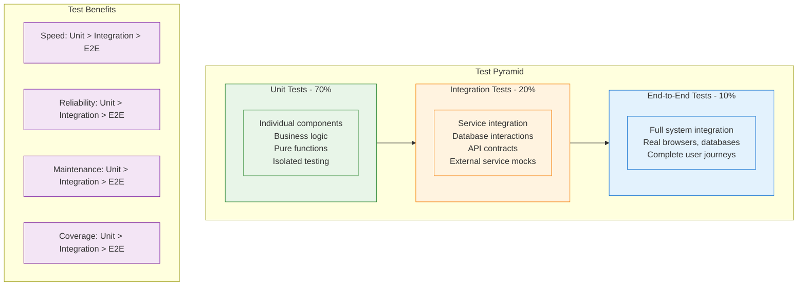

# Testing Overview

OpenFrame maintains high code quality through comprehensive testing strategies across all layers of the application. This guide covers testing frameworks, patterns, and best practices used throughout the platform.

## Testing Philosophy

OpenFrame follows a **test-driven development (TDD)** approach with emphasis on:

- **Quality over Quantity**: Meaningful tests that provide confidence in system behavior
- **Fast Feedback**: Quick test execution for rapid development cycles
- **Comprehensive Coverage**: Testing at unit, integration, and end-to-end levels
- **Maintainable Tests**: Clean, readable test code that's easy to maintain
- **Realistic Scenarios**: Tests that reflect real-world usage patterns

## Testing Strategy

### Test Pyramid

OpenFrame implements the classic test pyramid strategy:



### Testing Scope by Component

| Component | Unit Tests | Integration Tests | E2E Tests | Tools |
|-----------|------------|-------------------|-----------|-------|
| **Java Services** | Business logic, utilities | Database, HTTP clients | API workflows | JUnit 5, Mockito, Testcontainers |
| **Frontend (Vue.js)** | Components, composables | Component integration | User journeys | Vitest, Vue Testing Library, Playwright |
| **Rust Clients** | Core logic, utilities | File system, network | Agent functionality | Built-in test framework, cargo-tarpaulin |
| **GraphQL API** | Resolvers, data fetchers | Schema validation | Query scenarios | GraphQL Testing Library |
| **Database Layer** | Repository methods | Query performance | Data consistency | @DataMongoTest, Embedded databases |

## Java Service Testing

### Unit Testing Framework

OpenFrame Java services use **JUnit 5** with **Mockito** for comprehensive unit testing.

#### Basic Test Structure

```java
@ExtendWith(MockitoExtension.class)
class DeviceServiceTest {

    @Mock
    private DeviceRepository deviceRepository;
    
    @Mock
    private TenantContext tenantContext;
    
    @InjectMocks
    private DeviceService deviceService;
    
    @Test
    @DisplayName("Should retrieve devices for current tenant")
    void shouldRetrieveDevicesForCurrentTenant() {
        // Given
        String tenantId = "tenant-123";
        when(tenantContext.getCurrentTenantId()).thenReturn(tenantId);
        
        Device device1 = createTestDevice("device-1", DeviceStatus.ONLINE);
        Device device2 = createTestDevice("device-2", DeviceStatus.OFFLINE);
        when(deviceRepository.findByTenantId(tenantId))
            .thenReturn(Arrays.asList(device1, device2));
        
        // When
        List<Device> devices = deviceService.getAllDevicesForCurrentTenant();
        
        // Then
        assertThat(devices)
            .hasSize(2)
            .extracting(Device::getId)
            .containsExactlyInAnyOrder("device-1", "device-2");
        
        verify(deviceRepository).findByTenantId(tenantId);
    }
    
    private Device createTestDevice(String id, DeviceStatus status) {
        return Device.builder()
            .id(id)
            .name("Test Device " + id)
            .status(status)
            .tenantId("tenant-123")
            .build();
    }
}
```

#### Testing Best Practices

1. **Use Descriptive Test Names**:
   ```java
   @Test
   @DisplayName("Should throw DeviceNotFoundException when device does not exist")
   void shouldThrowDeviceNotFoundExceptionWhenDeviceDoesNotExist() {
       // Test implementation
   }
   ```

2. **Follow Given-When-Then Pattern**:
   ```java
   @Test
   void shouldCalculateDeviceUptime() {
       // Given - Setup test data
       Device device = createDeviceWithUptime(Duration.ofHours(24));
       
       // When - Execute the behavior
       Duration uptime = deviceService.calculateUptime(device);
       
       // Then - Verify the outcome
       assertThat(uptime).isEqualTo(Duration.ofHours(24));
   }
   ```

3. **Use Parameterized Tests for Multiple Scenarios**:
   ```java
   @ParameterizedTest
   @CsvSource({
       "ONLINE, true",
       "OFFLINE, false",
       "MAINTENANCE, false",
       "UNKNOWN, false"
   })
   void shouldDetermineIfDeviceIsAvailable(DeviceStatus status, boolean expectedAvailable) {
       Device device = createTestDevice("device-1", status);
       
       boolean isAvailable = deviceService.isDeviceAvailable(device);
       
       assertThat(isAvailable).isEqualTo(expectedAvailable);
   }
   ```

### Integration Testing

Integration tests verify component interactions and external dependencies.

#### Database Integration Tests

```java
@DataMongoTest
@ExtendWith(SpringExtension.class)
class DeviceRepositoryIntegrationTest {

    @Autowired
    private TestEntityManager entityManager;
    
    @Autowired
    private DeviceRepository deviceRepository;
    
    @Test
    void shouldFindDevicesByTenantAndStatus() {
        // Given
        String tenantId = "tenant-123";
        Device onlineDevice = createAndSaveDevice("device-1", DeviceStatus.ONLINE, tenantId);
        Device offlineDevice = createAndSaveDevice("device-2", DeviceStatus.OFFLINE, tenantId);
        Device otherTenantDevice = createAndSaveDevice("device-3", DeviceStatus.ONLINE, "other-tenant");
        
        // When
        List<Device> onlineDevices = deviceRepository.findByTenantIdAndStatus(tenantId, DeviceStatus.ONLINE);
        
        // Then
        assertThat(onlineDevices)
            .hasSize(1)
            .containsExactly(onlineDevice);
    }
    
    @Test
    void shouldSupportCursorBasedPagination() {
        // Given
        String tenantId = "tenant-123";
        List<Device> devices = IntStream.range(0, 10)
            .mapToObj(i -> createAndSaveDevice("device-" + i, DeviceStatus.ONLINE, tenantId))
            .collect(Collectors.toList());
        
        // When - First page
        Page<Device> firstPage = deviceRepository.findByTenantId(
            tenantId, 
            PageRequest.of(0, 5, Sort.by("name"))
        );
        
        // Then
        assertThat(firstPage.getContent()).hasSize(5);
        assertThat(firstPage.hasNext()).isTrue();
        
        // When - Second page
        Page<Device> secondPage = deviceRepository.findByTenantId(
            tenantId, 
            PageRequest.of(1, 5, Sort.by("name"))
        );
        
        // Then
        assertThat(secondPage.getContent()).hasSize(5);
        assertThat(secondPage.hasNext()).isFalse();
    }
    
    private Device createAndSaveDevice(String id, DeviceStatus status, String tenantId) {
        Device device = Device.builder()
            .id(id)
            .name("Test Device " + id)
            .status(status)
            .tenantId(tenantId)
            .createdAt(Instant.now())
            .build();
        return deviceRepository.save(device);
    }
}
```

#### Service Integration Tests

```java
@SpringBootTest
@AutoConfigureTestDatabase(replace = AutoConfigureTestDatabase.Replace.NONE)
@Testcontainers
class DeviceServiceIntegrationTest {

    @Container
    static MongoDBContainer mongoDBContainer = new MongoDBContainer("mongo:7.0")
            .withReuse(true);
    
    @Container
    static KafkaContainer kafkaContainer = new KafkaContainer(DockerImageName.parse("confluentinc/cp-kafka:7.4.0"))
            .withReuse(true);
    
    @Autowired
    private DeviceService deviceService;
    
    @Autowired
    private DeviceRepository deviceRepository;
    
    @DynamicPropertySource
    static void setProperties(DynamicPropertyRegistry registry) {
        registry.add("spring.data.mongodb.uri", mongoDBContainer::getReplicaSetUrl);
        registry.add("spring.kafka.bootstrap-servers", kafkaContainer::getBootstrapServers);
    }
    
    @Test
    @WithMockUser(authorities = "DEVICE_MANAGE")
    void shouldCreateDeviceAndPublishEvent() {
        // Given
        CreateDeviceRequest request = CreateDeviceRequest.builder()
            .name("Integration Test Device")
            .type(DeviceType.WORKSTATION)
            .organizationId("org-123")
            .build();
        
        // When
        Device createdDevice = deviceService.createDevice(request);
        
        // Then
        assertThat(createdDevice).isNotNull();
        assertThat(createdDevice.getId()).isNotNull();
        assertThat(createdDevice.getName()).isEqualTo("Integration Test Device");
        
        // Verify persistence
        Optional<Device> savedDevice = deviceRepository.findById(createdDevice.getId());
        assertThat(savedDevice).isPresent();
        
        // Verify event publication (would need Kafka test consumer)
        // This could be verified using @KafkaListener test consumer
    }
}
```

### GraphQL Testing

GraphQL endpoints require specialized testing approaches:

```java
@GraphQlTest(DeviceDataFetcher.class)
class DeviceGraphQLTest {

    @Autowired
    private GraphQlTester graphQlTester;
    
    @MockBean
    private DeviceService deviceService;
    
    @Test
    void shouldFetchDevicesWithFilters() {
        // Given
        Device device1 = createTestDevice("device-1", DeviceStatus.ONLINE);
        Device device2 = createTestDevice("device-2", DeviceStatus.OFFLINE);
        
        when(deviceService.getDevicesWithFilters(any(DeviceFilters.class)))
            .thenReturn(Arrays.asList(device1, device2));
        
        // When & Then
        this.graphQlTester
            .documentName("devices-query")
            .variable("filters", Map.of("status", "ONLINE"))
            .execute()
            .path("devices.edges[*].node.id")
            .entityList(String.class)
            .hasSize(2);
    }
    
    @Test
    void shouldHandleDeviceNotFoundError() {
        // Given
        when(deviceService.getDeviceById("non-existent"))
            .thenThrow(new DeviceNotFoundException("Device not found"));
        
        // When & Then
        this.graphQlTester
            .documentName("device-by-id")
            .variable("id", "non-existent")
            .execute()
            .errors()
            .satisfy(errors -> {
                assertThat(errors).hasSize(1);
                assertThat(errors.get(0).getMessage()).contains("Device not found");
            });
    }
}
```

## Frontend Testing (Vue.js)

### Unit Testing with Vitest

OpenFrame frontend uses **Vitest** and **Vue Test Utils** for component testing:

```typescript
// DeviceCard.test.ts
import { describe, it, expect, vi } from 'vitest'
import { mount } from '@vue/test-utils'
import DeviceCard from '@/components/DeviceCard.vue'
import type { Device } from '@/types/device'

describe('DeviceCard', () => {
  const mockDevice: Device = {
    id: 'device-1',
    name: 'Test Device',
    status: 'ONLINE',
    lastSeen: new Date('2024-01-01T10:00:00Z'),
    type: 'WORKSTATION',
    organizationId: 'org-1'
  }

  it('should render device information correctly', () => {
    // Given
    const wrapper = mount(DeviceCard, {
      props: { device: mockDevice }
    })

    // Then
    expect(wrapper.find('[data-testid="device-name"]').text()).toBe('Test Device')
    expect(wrapper.find('[data-testid="device-status"]').text()).toBe('Online')
    expect(wrapper.find('[data-testid="device-type"]').text()).toBe('Workstation')
  })

  it('should emit device-selected event when clicked', async () => {
    // Given
    const wrapper = mount(DeviceCard, {
      props: { device: mockDevice }
    })

    // When
    await wrapper.find('[data-testid="device-card"]').trigger('click')

    // Then
    expect(wrapper.emitted('device-selected')).toBeTruthy()
    expect(wrapper.emitted('device-selected')?.[0]).toEqual([mockDevice])
  })

  it('should show offline status with appropriate styling', () => {
    // Given
    const offlineDevice = { ...mockDevice, status: 'OFFLINE' as const }
    const wrapper = mount(DeviceCard, {
      props: { device: offlineDevice }
    })

    // Then
    expect(wrapper.find('[data-testid="device-status"]').text()).toBe('Offline')
    expect(wrapper.find('[data-testid="device-status"]').classes()).toContain('text-red-500')
  })
})
```

### Composable Testing

Test Vue composables in isolation:

```typescript
// useDevices.test.ts
import { describe, it, expect, vi, beforeEach } from 'vitest'
import { useDevices } from '@/composables/useDevices'
import { mockGraphQLClient } from '@/test-utils/mocks'

vi.mock('@/lib/graphql-client', () => ({
  graphQLClient: mockGraphQLClient
}))

describe('useDevices', () => {
  beforeEach(() => {
    vi.clearAllMocks()
  })

  it('should fetch devices successfully', async () => {
    // Given
    const mockDevices = [
      { id: 'device-1', name: 'Device 1', status: 'ONLINE' },
      { id: 'device-2', name: 'Device 2', status: 'OFFLINE' }
    ]
    
    mockGraphQLClient.query.mockResolvedValue({
      data: { devices: { edges: mockDevices.map(device => ({ node: device })) } }
    })

    // When
    const { devices, loading, error, fetchDevices } = useDevices()
    await fetchDevices()

    // Then
    expect(loading.value).toBe(false)
    expect(error.value).toBeNull()
    expect(devices.value).toEqual(mockDevices)
  })

  it('should handle fetch errors gracefully', async () => {
    // Given
    const mockError = new Error('Network error')
    mockGraphQLClient.query.mockRejectedValue(mockError)

    // When
    const { devices, loading, error, fetchDevices } = useDevices()
    await fetchDevices()

    // Then
    expect(loading.value).toBe(false)
    expect(error.value).toEqual(mockError)
    expect(devices.value).toEqual([])
  })
})
```

### Integration Testing

Test component integration and user interactions:

```typescript
// DeviceManagement.integration.test.ts
import { describe, it, expect, beforeEach } from 'vitest'
import { mount } from '@vue/test-utils'
import { createTestingPinia } from '@pinia/testing'
import DeviceManagement from '@/pages/DeviceManagement.vue'
import { useDeviceStore } from '@/stores/deviceStore'

describe('DeviceManagement Integration', () => {
  let wrapper: any
  let deviceStore: any

  beforeEach(() => {
    wrapper = mount(DeviceManagement, {
      global: {
        plugins: [createTestingPinia({ createSpy: vi.fn })]
      }
    })
    deviceStore = useDeviceStore()
  })

  it('should load and display devices on mount', async () => {
    // Given
    const mockDevices = [
      { id: 'device-1', name: 'Device 1', status: 'ONLINE' },
      { id: 'device-2', name: 'Device 2', status: 'OFFLINE' }
    ]
    deviceStore.devices = mockDevices

    // When
    await wrapper.vm.$nextTick()

    // Then
    expect(wrapper.findAll('[data-testid="device-card"]')).toHaveLength(2)
    expect(deviceStore.fetchDevices).toHaveBeenCalled()
  })

  it('should filter devices when search is applied', async () => {
    // Given
    const mockDevices = [
      { id: 'device-1', name: 'Laptop 1', status: 'ONLINE' },
      { id: 'device-2', name: 'Server 1', status: 'OFFLINE' }
    ]
    deviceStore.devices = mockDevices

    // When
    await wrapper.find('[data-testid="search-input"]').setValue('Laptop')
    await wrapper.vm.$nextTick()

    // Then
    expect(wrapper.findAll('[data-testid="device-card"]')).toHaveLength(1)
    expect(wrapper.find('[data-testid="device-card"]').text()).toContain('Laptop 1')
  })
})
```

## Rust Client Testing

### Unit Testing

Rust clients use the built-in test framework:

```rust
// src/services/device_service.rs
#[cfg(test)]
mod tests {
    use super::*;
    use mockall::predicate::*;
    use tokio_test;

    #[tokio::test]
    async fn test_collect_device_metrics() {
        // Given
        let mut mock_system = MockSystemInfoProvider::new();
        mock_system
            .expect_get_cpu_usage()
            .returning(|| 45.5);
        mock_system
            .expect_get_memory_usage()
            .returning(|| MemoryInfo {
                total: 16_000_000_000,
                used: 8_000_000_000,
                available: 8_000_000_000,
            });

        let device_service = DeviceService::new(Box::new(mock_system));

        // When
        let metrics = device_service.collect_metrics().await.unwrap();

        // Then
        assert_eq!(metrics.cpu_usage, 45.5);
        assert_eq!(metrics.memory_usage_percent, 50.0);
        assert!(metrics.timestamp > 0);
    }

    #[test]
    fn test_device_status_determination() {
        // Test various device status scenarios
        let test_cases = vec![
            (true, 0, DeviceStatus::Online),
            (false, 300, DeviceStatus::Offline),
            (true, 600, DeviceStatus::Warning),
        ];

        for (is_responsive, last_heartbeat_seconds_ago, expected_status) in test_cases {
            let status = determine_device_status(is_responsive, last_heartbeat_seconds_ago);
            assert_eq!(status, expected_status);
        }
    }
}
```

### Integration Testing

Test external integrations and file system operations:

```rust
// tests/integration_test.rs
use openframe_client::*;
use std::fs;
use tempfile::TempDir;
use tokio_test;

#[tokio::test]
async fn test_config_file_management() {
    // Given
    let temp_dir = TempDir::new().unwrap();
    let config_path = temp_dir.path().join("config.json");
    
    let config = ClientConfig {
        server_url: "https://test.openframe.ai".to_string(),
        tenant_id: "test-tenant".to_string(),
        device_id: "test-device".to_string(),
        auth_token: Some("test-token".to_string()),
    };

    // When
    save_config(&config, &config_path).await.unwrap();
    let loaded_config = load_config(&config_path).await.unwrap();

    // Then
    assert_eq!(loaded_config.server_url, config.server_url);
    assert_eq!(loaded_config.tenant_id, config.tenant_id);
    assert_eq!(loaded_config.device_id, config.device_id);
}

#[tokio::test]
async fn test_heartbeat_service() {
    // Given
    let mut mock_client = MockApiClient::new();
    mock_client
        .expect_send_heartbeat()
        .with(eq("test-device"))
        .returning(|_| Ok(HeartbeatResponse { success: true }));

    let heartbeat_service = HeartbeatService::new(Box::new(mock_client));

    // When
    let result = heartbeat_service.send_heartbeat("test-device").await;

    // Then
    assert!(result.is_ok());
}
```

## End-to-End Testing

### Test Environment Setup

E2E tests use **Playwright** for browser automation and **Testcontainers** for backend services:

```typescript
// e2e/setup/test-environment.ts
import { test as base, expect } from '@playwright/test'
import { MongoDBContainer } from '@testcontainers/mongodb'
import { KafkaContainer } from '@testcontainers/kafka'

// Extend base test with custom fixtures
export const test = base.extend<{
  mongoContainer: MongoDBContainer
  kafkaContainer: KafkaContainer
}>({
  mongoContainer: async ({}, use) => {
    const container = new MongoDBContainer('mongo:7.0')
    await container.start()
    await use(container)
    await container.stop()
  },

  kafkaContainer: async ({}, use) => {
    const container = new KafkaContainer('confluentinc/cp-kafka:7.4.0')
    await container.start()
    await use(container)
    await container.stop()
  }
})

export { expect }
```

### User Journey Tests

```typescript
// e2e/device-management.spec.ts
import { test, expect } from './setup/test-environment'

test.describe('Device Management', () => {
  test.beforeEach(async ({ page }) => {
    // Login and navigate to devices page
    await page.goto('/login')
    await page.fill('[data-testid="email"]', 'admin@example.com')
    await page.fill('[data-testid="password"]', 'admin123')
    await page.click('[data-testid="login-button"]')
    
    await expect(page).toHaveURL('/dashboard')
    await page.click('[data-testid="nav-devices"]')
    await expect(page).toHaveURL('/devices')
  })

  test('should display device list and allow filtering', async ({ page }) => {
    // Wait for devices to load
    await expect(page.locator('[data-testid="device-card"]').first()).toBeVisible()
    
    // Verify initial device count
    const deviceCards = page.locator('[data-testid="device-card"]')
    const initialCount = await deviceCards.count()
    expect(initialCount).toBeGreaterThan(0)
    
    // Apply status filter
    await page.selectOption('[data-testid="status-filter"]', 'ONLINE')
    await page.waitForTimeout(500) // Wait for filter to apply
    
    // Verify filtered results
    const filteredCards = page.locator('[data-testid="device-card"]')
    const filteredCount = await filteredCards.count()
    expect(filteredCount).toBeLessThanOrEqual(initialCount)
    
    // Verify all visible devices have ONLINE status
    const statusElements = page.locator('[data-testid="device-status"]:visible')
    const statusTexts = await statusElements.allTextContents()
    expect(statusTexts.every(status => status === 'Online')).toBe(true)
  })

  test('should allow device details viewing and remote access', async ({ page }) => {
    // Click on first device
    await page.click('[data-testid="device-card"]')
    
    // Verify device details modal opens
    await expect(page.locator('[data-testid="device-details-modal"]')).toBeVisible()
    
    // Verify device information is displayed
    await expect(page.locator('[data-testid="device-name"]')).toBeVisible()
    await expect(page.locator('[data-testid="device-status"]')).toBeVisible()
    await expect(page.locator('[data-testid="device-metrics"]')).toBeVisible()
    
    // Test remote access functionality
    await page.click('[data-testid="remote-access-button"]')
    await expect(page.locator('[data-testid="remote-access-iframe"]')).toBeVisible()
  })

  test('should handle device search functionality', async ({ page }) => {
    // Wait for devices to load
    await expect(page.locator('[data-testid="device-card"]').first()).toBeVisible()
    
    // Perform search
    await page.fill('[data-testid="search-input"]', 'DESKTOP')
    await page.waitForTimeout(500) // Wait for search to apply
    
    // Verify search results
    const deviceNames = page.locator('[data-testid="device-name"]:visible')
    const nameTexts = await deviceNames.allTextContents()
    expect(nameTexts.every(name => name.toUpperCase().includes('DESKTOP'))).toBe(true)
    
    // Clear search
    await page.fill('[data-testid="search-input"]', '')
    await page.waitForTimeout(500)
    
    // Verify all devices are shown again
    const allCards = page.locator('[data-testid="device-card"]')
    expect(await allCards.count()).toBeGreaterThan(0)
  })
})
```

### API Contract Tests

```typescript
// e2e/api-contracts.spec.ts
import { test, expect } from '@playwright/test'

test.describe('GraphQL API Contracts', () => {
  test('should return valid device data structure', async ({ request }) => {
    // Execute GraphQL query
    const response = await request.post('/graphql', {
      data: {
        query: `
          query GetDevices($filters: DeviceFilters) {
            devices(filters: $filters) {
              edges {
                node {
                  id
                  name
                  status
                  type
                  lastSeen
                  organization {
                    id
                    name
                  }
                }
              }
              pageInfo {
                hasNextPage
                hasPreviousPage
                startCursor
                endCursor
              }
            }
          }
        `,
        variables: {
          filters: { status: 'ONLINE' }
        }
      }
    })

    // Verify response structure
    expect(response.ok()).toBeTruthy()
    const data = await response.json()
    
    expect(data).toHaveProperty('data')
    expect(data.data).toHaveProperty('devices')
    expect(data.data.devices).toHaveProperty('edges')
    expect(data.data.devices).toHaveProperty('pageInfo')
    
    // Verify device node structure
    if (data.data.devices.edges.length > 0) {
      const device = data.data.devices.edges[0].node
      expect(device).toHaveProperty('id')
      expect(device).toHaveProperty('name')
      expect(device).toHaveProperty('status')
      expect(device.status).toMatch(/^(ONLINE|OFFLINE|MAINTENANCE|UNKNOWN)$/)
    }
  })
})
```

## Test Execution and CI/CD

### Running Tests Locally

#### Java Service Tests

```bash
# Run all tests
mvn test

# Run specific test class
mvn test -Dtest=DeviceServiceTest

# Run tests with coverage
mvn test jacoco:report

# Run integration tests only
mvn test -Dtest="*IntegrationTest"

# Run tests in parallel
mvn test -T 4
```

#### Frontend Tests

```bash
cd openframe/services/openframe-frontend

# Run unit tests
npm run test:unit

# Run tests in watch mode
npm run test:watch

# Run tests with coverage
npm run test:coverage

# Run E2E tests
npm run test:e2e

# Run specific test file
npm run test -- DeviceCard.test.ts
```

#### Rust Client Tests

```bash
cd clients/openframe-client

# Run all tests
cargo test

# Run tests with output
cargo test -- --nocapture

# Run specific test
cargo test test_collect_device_metrics

# Run tests with coverage
cargo tarpaulin --out Html
```

### Continuous Integration

OpenFrame uses GitHub Actions for automated testing:

```yaml
# .github/workflows/test.yml
name: Test Suite

on:
  push:
    branches: [main, develop]
  pull_request:
    branches: [main]

jobs:
  java-tests:
    runs-on: ubuntu-latest
    services:
      mongodb:
        image: mongo:7.0
        ports:
          - 27017:27017
      kafka:
        image: confluentinc/cp-kafka:7.4.0
        ports:
          - 9092:9092
        env:
          KAFKA_ZOOKEEPER_CONNECT: zookeeper:2181
          
    steps:
      - uses: actions/checkout@v4
      - uses: actions/setup-java@v4
        with:
          java-version: '21'
          distribution: 'temurin'
          
      - name: Cache Maven dependencies
        uses: actions/cache@v3
        with:
          path: ~/.m2
          key: ${{ runner.os }}-m2-${{ hashFiles('**/pom.xml') }}
          
      - name: Run tests
        run: mvn test
        
      - name: Generate coverage report
        run: mvn jacoco:report
        
      - name: Upload coverage to Codecov
        uses: codecov/codecov-action@v3

  frontend-tests:
    runs-on: ubuntu-latest
    steps:
      - uses: actions/checkout@v4
      - uses: actions/setup-node@v4
        with:
          node-version: '18'
          cache: 'npm'
          cache-dependency-path: 'openframe/services/openframe-frontend/package-lock.json'
          
      - name: Install dependencies
        working-directory: openframe/services/openframe-frontend
        run: npm ci
        
      - name: Run unit tests
        working-directory: openframe/services/openframe-frontend
        run: npm run test:unit
        
      - name: Run E2E tests
        working-directory: openframe/services/openframe-frontend
        run: npm run test:e2e

  rust-tests:
    runs-on: ubuntu-latest
    steps:
      - uses: actions/checkout@v4
      - uses: actions-rs/toolchain@v1
        with:
          toolchain: stable
          
      - name: Cache cargo registry
        uses: actions/cache@v3
        with:
          path: ~/.cargo/registry
          key: ${{ runner.os }}-cargo-registry-${{ hashFiles('**/Cargo.lock') }}
          
      - name: Run tests
        working-directory: clients/openframe-client
        run: cargo test
```

## Test Data Management

### Test Fixtures

Create reusable test data factories:

```java
// DeviceTestFixtures.java
public class DeviceTestFixtures {
    
    public static Device createOnlineDevice() {
        return Device.builder()
            .id("device-online-1")
            .name("Online Test Device")
            .status(DeviceStatus.ONLINE)
            .type(DeviceType.WORKSTATION)
            .lastSeen(Instant.now())
            .tenantId("test-tenant")
            .build();
    }
    
    public static Device createOfflineDevice() {
        return Device.builder()
            .id("device-offline-1")
            .name("Offline Test Device")
            .status(DeviceStatus.OFFLINE)
            .type(DeviceType.SERVER)
            .lastSeen(Instant.now().minus(Duration.ofMinutes(10)))
            .tenantId("test-tenant")
            .build();
    }
    
    public static List<Device> createDeviceList(int count, DeviceStatus status) {
        return IntStream.range(0, count)
            .mapToObj(i -> Device.builder()
                .id("device-" + i)
                .name("Test Device " + i)
                .status(status)
                .type(DeviceType.WORKSTATION)
                .tenantId("test-tenant")
                .build())
            .collect(Collectors.toList());
    }
}
```

### Database Seeding

```java
// TestDataSeeder.java
@Component
@Profile("test")
public class TestDataSeeder {
    
    @Autowired
    private DeviceRepository deviceRepository;
    
    @Autowired
    private OrganizationRepository organizationRepository;
    
    @EventListener(ApplicationReadyEvent.class)
    public void seedTestData() {
        if (deviceRepository.count() == 0) {
            seedDevices();
            seedOrganizations();
        }
    }
    
    private void seedDevices() {
        List<Device> devices = Arrays.asList(
            DeviceTestFixtures.createOnlineDevice(),
            DeviceTestFixtures.createOfflineDevice()
        );
        deviceRepository.saveAll(devices);
    }
    
    private void seedOrganizations() {
        Organization org = Organization.builder()
            .id("test-org-1")
            .name("Test Organization")
            .tenantId("test-tenant")
            .build();
        organizationRepository.save(org);
    }
}
```

## Performance Testing

### Load Testing Strategy

Use **JMeter** or **k6** for performance testing:

```javascript
// k6-load-test.js
import http from 'k6/http'
import { check, sleep } from 'k6'

export let options = {
  stages: [
    { duration: '2m', target: 10 }, // Ramp up
    { duration: '5m', target: 100 }, // Stay at 100 users
    { duration: '2m', target: 0 }, // Ramp down
  ],
  thresholds: {
    http_req_duration: ['p(95)<500'], // 95% of requests under 500ms
    http_req_failed: ['rate<0.1'], // Less than 10% errors
  }
}

export default function() {
  // GraphQL device query
  let query = {
    query: `
      query GetDevices {
        devices {
          edges {
            node {
              id
              name
              status
            }
          }
        }
      }
    `
  }
  
  let response = http.post('http://localhost:8080/graphql', 
    JSON.stringify(query),
    {
      headers: {
        'Content-Type': 'application/json',
        'Authorization': 'Bearer ' + __ENV.AUTH_TOKEN
      }
    }
  )
  
  check(response, {
    'GraphQL query successful': (r) => r.status === 200,
    'Response time < 500ms': (r) => r.timings.duration < 500,
    'Has device data': (r) => JSON.parse(r.body).data.devices.edges.length > 0
  })
  
  sleep(1)
}
```

## Best Practices Summary

### ✅ Do's

1. **Write Tests First**: Follow TDD approach where possible
2. **Test Behavior, Not Implementation**: Focus on what the code should do
3. **Use Descriptive Names**: Test names should describe the scenario
4. **Keep Tests Independent**: Each test should run in isolation
5. **Use Appropriate Test Types**: Unit tests for logic, integration for interactions
6. **Mock External Dependencies**: Isolate the code under test
7. **Test Edge Cases**: Include boundary conditions and error scenarios
8. **Maintain Test Data**: Keep test fixtures clean and relevant

### ❌ Don'ts

1. **Don't Test Private Methods**: Test through public interfaces
2. **Don't Create Interdependent Tests**: Avoid test order dependencies
3. **Don't Ignore Flaky Tests**: Fix or remove unreliable tests
4. **Don't Over-Mock**: Mock only what you need to isolate
5. **Don't Test Framework Code**: Focus on your business logic
6. **Don't Skip Cleanup**: Clean up resources after tests
7. **Don't Test Everything**: Focus on critical and complex code paths

## Testing Resources

### 🗨️ **Community & Support**
- **[OpenMSP Slack](https://join.slack.com/t/openmsp/shared_invite/zt-36bl7mx0h-3~U2nFH6nqHqoTPXMaHEHA)** - Testing discussions in `#testing` channel
- **[OpenMSP.ai](https://www.openmsp.ai/)** - Community resources and best practices

### 📚 **Documentation & Tools**
- **[JUnit 5 User Guide](https://junit.org/junit5/docs/current/user-guide/)** - Java unit testing framework
- **[Vitest Documentation](https://vitest.dev/)** - Frontend testing framework
- **[Playwright Documentation](https://playwright.dev/)** - End-to-end testing
- **[Rust Testing Guide](https://doc.rust-lang.org/book/ch11-00-testing.html)** - Rust testing fundamentals

### 🛠️ **Testing Tools**
- **Code Coverage**: JaCoCo (Java), c8 (JavaScript), tarpaulin (Rust)
- **Test Containers**: Docker containers for integration testing
- **Performance Testing**: k6, JMeter, Apache Bench
- **API Testing**: Postman, Insomnia, GraphQL Playground

---

**Ready to Test?** Start with unit tests for the component you're working on, then add integration tests for external dependencies, and finally E2E tests for critical user journeys. Join our [testing discussions](https://join.slack.com/t/openmsp/shared_invite/zt-36bl7mx0h-3~U2nFH6nqHqoTPXMaHEHA) for best practices and help! 🧪