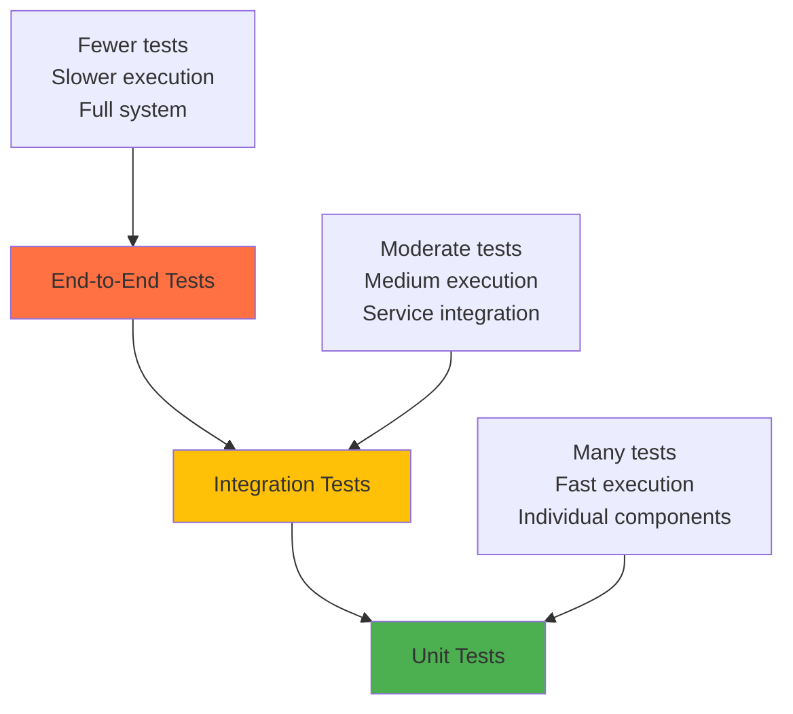

# Testing Overview

OpenFrame maintains high code quality through comprehensive testing across all layers of the application. This guide covers our testing strategy, structure, tools, and best practices for developers contributing to the platform.

## Testing Strategy

### Testing Pyramid

OpenFrame follows the standard testing pyramid with emphasis on fast, reliable automated tests:



### Test Categories

| Test Type | Purpose | Tools | Coverage Goal |
|-----------|---------|--------|---------------|
| **Unit Tests** | Test individual components in isolation | JUnit 5, Mockito, Vitest | 80%+ |
| **Integration Tests** | Test service interactions | Spring Boot Test, TestContainers | Key workflows |
| **Contract Tests** | Test API contracts | Spring Cloud Contract | All APIs |
| **End-to-End Tests** | Test complete user workflows | REST Assured, Playwright | Critical paths |
| **Performance Tests** | Test system under load | JMeter, K6 | Key scenarios |

## Test Structure Organization

### Java Backend Tests

```
src/
├── main/java/                          # Production code
└── test/java/                          # Test code
    ├── unit/                           # Unit tests
    │   ├── service/                    # Service layer tests
    │   ├── repository/                 # Repository tests
    │   └── util/                       # Utility tests
    ├── integration/                    # Integration tests
    │   ├── api/                        # API integration tests
    │   ├── database/                   # Database integration
    │   └── messaging/                  # Kafka integration
    └── e2e/                           # End-to-end tests
        ├── scenarios/                  # Test scenarios
        └── fixtures/                   # Test data
```

### Frontend Tests

```
src/
├── components/                         # Vue components
├── composables/                        # Composition functions
├── stores/                            # Pinia stores
└── __tests__/                         # Test files
    ├── unit/                          # Unit tests
    │   ├── components/                # Component tests
    │   ├── composables/               # Composable tests
    │   └── stores/                    # Store tests
    ├── integration/                   # Integration tests
    └── e2e/                          # End-to-end tests
```

## Unit Testing

### Java Unit Tests

#### Service Layer Testing

```java
@ExtendWith(MockitoExtension.class)
class DeviceServiceTest {
    
    @Mock
    private DeviceRepository deviceRepository;
    
    @Mock
    private EventPublisher eventPublisher;
    
    @InjectMocks
    private DeviceService deviceService;
    
    @Test
    @DisplayName("Should create device successfully")
    void shouldCreateDeviceSuccessfully() {
        // Given
        CreateDeviceRequest request = CreateDeviceRequest.builder()
            .name("Test Device")
            .organizationId("org-123")
            .build();
        
        Device expectedDevice = Device.builder()
            .id("device-123")
            .name("Test Device")
            .organizationId("org-123")
            .status(DeviceStatus.ONLINE)
            .build();
        
        when(deviceRepository.save(any(Device.class)))
            .thenReturn(expectedDevice);
        
        // When
        Device result = deviceService.createDevice(request);
        
        // Then
        assertThat(result)
            .isNotNull()
            .hasFieldOrPropertyWithValue("name", "Test Device")
            .hasFieldOrPropertyWithValue("organizationId", "org-123");
        
        verify(deviceRepository).save(any(Device.class));
        verify(eventPublisher).publish(any(DeviceCreatedEvent.class));
    }
    
    @Test
    @DisplayName("Should throw exception when device not found")
    void shouldThrowExceptionWhenDeviceNotFound() {
        // Given
        String deviceId = "non-existent-device";
        when(deviceRepository.findById(deviceId))
            .thenReturn(Optional.empty());
        
        // When & Then
        assertThatThrownBy(() -> deviceService.getDevice(deviceId))
            .isInstanceOf(DeviceNotFoundException.class)
            .hasMessage("Device not found: non-existent-device");
    }
}
```

#### Repository Testing

```java
@DataMongoTest
@TestPropertySource(properties = {
    "spring.data.mongodb.database=openframe_test"
})
class DeviceRepositoryTest {
    
    @Autowired
    private TestEntityManager entityManager;
    
    @Autowired
    private DeviceRepository deviceRepository;
    
    @Test
    @DisplayName("Should find devices by organization")
    void shouldFindDevicesByOrganization() {
        // Given
        Device device1 = Device.builder()
            .name("Device 1")
            .organizationId("org-123")
            .status(DeviceStatus.ONLINE)
            .build();
        
        Device device2 = Device.builder()
            .name("Device 2")
            .organizationId("org-123")
            .status(DeviceStatus.OFFLINE)
            .build();
        
        Device device3 = Device.builder()
            .name("Device 3")
            .organizationId("org-456")
            .status(DeviceStatus.ONLINE)
            .build();
        
        deviceRepository.saveAll(List.of(device1, device2, device3));
        
        // When
        List<Device> result = deviceRepository.findByOrganizationId("org-123");
        
        // Then
        assertThat(result)
            .hasSize(2)
            .extracting(Device::getOrganizationId)
            .containsOnly("org-123");
    }
    
    @Test
    @DisplayName("Should find devices by status")
    void shouldFindDevicesByStatus() {
        // Given
        Device onlineDevice = Device.builder()
            .name("Online Device")
            .organizationId("org-123")
            .status(DeviceStatus.ONLINE)
            .build();
        
        Device offlineDevice = Device.builder()
            .name("Offline Device")
            .organizationId("org-123")
            .status(DeviceStatus.OFFLINE)
            .build();
        
        deviceRepository.saveAll(List.of(onlineDevice, offlineDevice));
        
        // When
        Page<Device> result = deviceRepository.findByStatus(
            DeviceStatus.ONLINE, 
            PageRequest.of(0, 10)
        );
        
        // Then
        assertThat(result.getContent())
            .hasSize(1)
            .extracting(Device::getStatus)
            .containsOnly(DeviceStatus.ONLINE);
    }
}
```

### Frontend Unit Tests

#### Vue Component Testing

```typescript
import { describe, it, expect, vi } from 'vitest'
import { mount } from '@vue/test-utils'
import { createPinia, setActivePinia } from 'pinia'
import DeviceCard from '@/components/DeviceCard.vue'
import { useDevicesStore } from '@/stores/devices'

describe('DeviceCard.vue', () => {
  beforeEach(() => {
    setActivePinia(createPinia())
  })

  it('renders device information correctly', () => {
    const device = {
      id: 'device-123',
      name: 'Test Device',
      status: 'ONLINE',
      organizationId: 'org-123',
      lastSeen: new Date().toISOString()
    }

    const wrapper = mount(DeviceCard, {
      props: { device }
    })

    expect(wrapper.find('[data-testid="device-name"]').text()).toBe('Test Device')
    expect(wrapper.find('[data-testid="device-status"]').text()).toBe('ONLINE')
    expect(wrapper.find('.status-indicator.online')).toBeTruthy()
  })

  it('emits update event when status changes', async () => {
    const device = {
      id: 'device-123',
      name: 'Test Device',
      status: 'OFFLINE',
      organizationId: 'org-123'
    }

    const wrapper = mount(DeviceCard, {
      props: { device }
    })

    await wrapper.find('[data-testid="status-toggle"]').trigger('click')

    expect(wrapper.emitted()).toHaveProperty('update')
    expect(wrapper.emitted().update[0]).toEqual([{
      ...device,
      status: 'ONLINE'
    }])
  })
})
```

#### Composable Testing

```typescript
import { describe, it, expect, vi } from 'vitest'
import { useDeviceActions } from '@/composables/useDeviceActions'
import { useDevicesStore } from '@/stores/devices'

vi.mock('@/stores/devices')

describe('useDeviceActions', () => {
  it('should update device status successfully', async () => {
    const mockStore = {
      updateDevice: vi.fn().mockResolvedValue({ success: true })
    }
    
    vi.mocked(useDevicesStore).mockReturnValue(mockStore)

    const { updateDeviceStatus } = useDeviceActions()

    const result = await updateDeviceStatus('device-123', 'ONLINE')

    expect(result.success).toBe(true)
    expect(mockStore.updateDevice).toHaveBeenCalledWith('device-123', {
      status: 'ONLINE'
    })
  })

  it('should handle update errors gracefully', async () => {
    const mockStore = {
      updateDevice: vi.fn().mockRejectedValue(new Error('Network error'))
    }
    
    vi.mocked(useDevicesStore).mockReturnValue(mockStore)

    const { updateDeviceStatus } = useDeviceActions()

    const result = await updateDeviceStatus('device-123', 'ONLINE')

    expect(result.success).toBe(false)
    expect(result.error).toBe('Network error')
  })
})
```

## Integration Testing

### API Integration Tests

```java
@SpringBootTest(webEnvironment = SpringBootTest.WebEnvironment.RANDOM_PORT)
@TestPropertySource(properties = {
    "spring.datasource.url=jdbc:h2:mem:testdb",
    "spring.data.mongodb.database=openframe_integration_test"
})
class DeviceControllerIntegrationTest {
    
    @Autowired
    private TestRestTemplate restTemplate;
    
    @Autowired
    private DeviceRepository deviceRepository;
    
    @MockBean
    private EventPublisher eventPublisher;
    
    @Test
    @DisplayName("Should create device via REST API")
    void shouldCreateDeviceViaRestApi() {
        // Given
        CreateDeviceRequest request = CreateDeviceRequest.builder()
            .name("Integration Test Device")
            .organizationId("org-123")
            .build();
        
        // When
        ResponseEntity<DeviceResponse> response = restTemplate.postForEntity(
            "/api/v1/devices",
            request,
            DeviceResponse.class
        );
        
        // Then
        assertThat(response.getStatusCode()).isEqualTo(HttpStatus.CREATED);
        assertThat(response.getBody())
            .isNotNull()
            .hasFieldOrPropertyWithValue("name", "Integration Test Device");
        
        // Verify in database
        List<Device> devices = deviceRepository.findByOrganizationId("org-123");
        assertThat(devices)
            .hasSize(1)
            .extracting(Device::getName)
            .containsExactly("Integration Test Device");
    }
    
    @Test
    @DisplayName("Should return 404 when device not found")
    void shouldReturn404WhenDeviceNotFound() {
        // When
        ResponseEntity<String> response = restTemplate.getForEntity(
            "/api/v1/devices/non-existent-device",
            String.class
        );
        
        // Then
        assertThat(response.getStatusCode()).isEqualTo(HttpStatus.NOT_FOUND);
    }
}
```

### GraphQL Integration Tests

```java
@SpringBootTest
@GraphQLTest
class DeviceGraphQLIntegrationTest {
    
    @Autowired
    private GraphQLTester graphQLTester;
    
    @Autowired
    private DeviceRepository deviceRepository;
    
    @Test
    @DisplayName("Should query devices with filters")
    void shouldQueryDevicesWithFilters() {
        // Given
        Device device1 = Device.builder()
            .name("Device 1")
            .organizationId("org-123")
            .status(DeviceStatus.ONLINE)
            .build();
        
        Device device2 = Device.builder()
            .name("Device 2")
            .organizationId("org-123")
            .status(DeviceStatus.OFFLINE)
            .build();
        
        deviceRepository.saveAll(List.of(device1, device2));
        
        String query = """
            query GetDevices($filter: DeviceFilter) {
                devices(filter: $filter) {
                    edges {
                        node {
                            id
                            name
                            status
                        }
                    }
                    totalCount
                }
            }
        """;
        
        // When & Then
        graphQLTester
            .document(query)
            .variable("filter", Map.of("status", "ONLINE"))
            .execute()
            .path("devices.edges")
            .entityList(DeviceNode.class)
            .hasSize(1)
            .path("devices.totalCount")
            .entity(Integer.class)
            .isEqualTo(1);
    }
    
    @Test
    @DisplayName("Should create device via mutation")
    void shouldCreateDeviceViaMutation() {
        String mutation = """
            mutation CreateDevice($input: CreateDeviceInput!) {
                createDevice(input: $input) {
                    id
                    name
                    organizationId
                    status
                }
            }
        """;
        
        Map<String, Object> input = Map.of(
            "name", "GraphQL Device",
            "organizationId", "org-123"
        );
        
        // When & Then
        graphQLTester
            .document(mutation)
            .variable("input", input)
            .execute()
            .path("createDevice")
            .entity(DeviceResponse.class)
            .satisfies(device -> {
                assertThat(device.getName()).isEqualTo("GraphQL Device");
                assertThat(device.getOrganizationId()).isEqualTo("org-123");
                assertThat(device.getStatus()).isEqualTo(DeviceStatus.ONLINE);
            });
    }
}
```

### Database Integration Tests

```java
@Testcontainers
@SpringBootTest
class MongoDBIntegrationTest {
    
    @Container
    static MongoDBContainer mongoDBContainer = new MongoDBContainer("mongo:7.0")
            .withExposedPorts(27017);
    
    @DynamicPropertySource
    static void configureProperties(DynamicPropertyRegistry registry) {
        registry.add("spring.data.mongodb.uri", mongoDBContainer::getReplicaSetUrl);
    }
    
    @Autowired
    private DeviceRepository deviceRepository;
    
    @Test
    @DisplayName("Should perform complex aggregation query")
    void shouldPerformComplexAggregationQuery() {
        // Given
        List<Device> devices = IntStream.range(1, 11)
            .mapToObj(i -> Device.builder()
                .name("Device " + i)
                .organizationId(i % 2 == 0 ? "org-1" : "org-2")
                .status(i % 3 == 0 ? DeviceStatus.OFFLINE : DeviceStatus.ONLINE)
                .build())
            .collect(Collectors.toList());
        
        deviceRepository.saveAll(devices);
        
        // When
        List<DeviceStatusSummary> result = deviceRepository.getStatusSummaryByOrganization();
        
        // Then
        assertThat(result)
            .hasSize(2)
            .anySatisfy(summary -> {
                assertThat(summary.getOrganizationId()).isEqualTo("org-1");
                assertThat(summary.getTotalDevices()).isEqualTo(5);
            })
            .anySatisfy(summary -> {
                assertThat(summary.getOrganizationId()).isEqualTo("org-2");
                assertThat(summary.getTotalDevices()).isEqualTo(5);
            });
    }
}
```

## End-to-End Testing

### Backend E2E Tests

```java
@SpringBootTest(webEnvironment = SpringBootTest.WebEnvironment.RANDOM_PORT)
@Testcontainers
class DeviceManagementE2ETest {
    
    @Container
    static MongoDBContainer mongodb = new MongoDBContainer("mongo:7.0");
    
    @Container
    static GenericContainer<?> redis = new GenericContainer<>("redis:7-alpine")
            .withExposedPorts(6379);
    
    @Autowired
    private TestRestTemplate restTemplate;
    
    @Test
    @DisplayName("Complete device lifecycle workflow")
    void completeDeviceLifecycleWorkflow() {
        // Step 1: Create organization
        CreateOrganizationRequest orgRequest = CreateOrganizationRequest.builder()
            .name("Test Organization")
            .domain("test.com")
            .build();
        
        ResponseEntity<OrganizationResponse> orgResponse = restTemplate.postForEntity(
            "/api/v1/organizations",
            orgRequest,
            OrganizationResponse.class
        );
        
        String organizationId = orgResponse.getBody().getId();
        
        // Step 2: Create device
        CreateDeviceRequest deviceRequest = CreateDeviceRequest.builder()
            .name("Test Device")
            .organizationId(organizationId)
            .build();
        
        ResponseEntity<DeviceResponse> deviceResponse = restTemplate.postForEntity(
            "/api/v1/devices",
            deviceRequest,
            DeviceResponse.class
        );
        
        String deviceId = deviceResponse.getBody().getId();
        
        // Step 3: Update device status
        UpdateDeviceRequest updateRequest = UpdateDeviceRequest.builder()
            .status(DeviceStatus.MAINTENANCE)
            .build();
        
        restTemplate.put("/api/v1/devices/" + deviceId, updateRequest);
        
        // Step 4: Verify device status
        ResponseEntity<DeviceResponse> updatedDevice = restTemplate.getForEntity(
            "/api/v1/devices/" + deviceId,
            DeviceResponse.class
        );
        
        assertThat(updatedDevice.getBody().getStatus()).isEqualTo(DeviceStatus.MAINTENANCE);
        
        // Step 5: Delete device
        restTemplate.delete("/api/v1/devices/" + deviceId);
        
        // Step 6: Verify device is deleted
        ResponseEntity<String> deletedDevice = restTemplate.getForEntity(
            "/api/v1/devices/" + deviceId,
            String.class
        );
        
        assertThat(deletedDevice.getStatusCode()).isEqualTo(HttpStatus.NOT_FOUND);
    }
}
```

### Frontend E2E Tests

```typescript
import { test, expect } from '@playwright/test'

test.describe('Device Management', () => {
  test.beforeEach(async ({ page }) => {
    await page.goto('/login')
    
    // Login as test user
    await page.fill('[data-testid="email"]', 'test@example.com')
    await page.fill('[data-testid="password"]', 'password')
    await page.click('[data-testid="login-button"]')
    
    await page.waitForURL('/dashboard')
  })

  test('should create and manage device', async ({ page }) => {
    // Navigate to devices page
    await page.click('[data-testid="nav-devices"]')
    await page.waitForURL('/devices')

    // Create new device
    await page.click('[data-testid="add-device-button"]')
    await page.fill('[data-testid="device-name"]', 'E2E Test Device')
    await page.selectOption('[data-testid="device-type"]', 'DESKTOP')
    await page.click('[data-testid="create-device-button"]')

    // Verify device appears in list
    await page.waitForSelector('[data-testid="device-list"]')
    await expect(page.locator('[data-testid="device-name"]')).toContainText('E2E Test Device')

    // Update device status
    await page.click('[data-testid="device-actions-menu"]')
    await page.click('[data-testid="set-maintenance-mode"]')
    await page.click('[data-testid="confirm-maintenance"]')

    // Verify status updated
    await expect(page.locator('[data-testid="device-status"]')).toContainText('MAINTENANCE')

    // Delete device
    await page.click('[data-testid="device-actions-menu"]')
    await page.click('[data-testid="delete-device"]')
    await page.click('[data-testid="confirm-delete"]')

    // Verify device is removed
    await expect(page.locator('[data-testid="device-name"]')).not.toBeVisible()
  })

  test('should handle device filtering', async ({ page }) => {
    await page.goto('/devices')

    // Apply status filter
    await page.click('[data-testid="status-filter"]')
    await page.click('[data-testid="filter-online"]')

    // Verify filtered results
    const deviceCards = page.locator('[data-testid="device-card"]')
    const count = await deviceCards.count()
    
    for (let i = 0; i < count; i++) {
      await expect(deviceCards.nth(i).locator('[data-testid="device-status"]'))
        .toContainText('ONLINE')
    }

    // Clear filters
    await page.click('[data-testid="clear-filters"]')
    
    // Verify all devices shown
    const allDevices = page.locator('[data-testid="device-card"]')
    expect(await allDevices.count()).toBeGreaterThan(count)
  })
})
```

## Test Configuration

### Test Profiles

#### application-test.yml

```yaml
spring:
  profiles:
    active: test
  
  datasource:
    url: jdbc:h2:mem:testdb
    driver-class-name: org.h2.Driver
    username: sa
    password: password
  
  data:
    mongodb:
      database: openframe_test
      uri: mongodb://localhost:27017/openframe_test
  
  redis:
    url: redis://localhost:6379
    database: 1  # Use different database for tests
  
  kafka:
    bootstrap-servers: localhost:9092
    consumer:
      group-id: test-consumer-group
    producer:
      client-id: test-producer

logging:
  level:
    org.springframework: WARN
    com.openframe: DEBUG
```

### Test Utilities

#### Test Data Builders

```java
public class DeviceTestDataBuilder {
    private String id = "device-" + UUID.randomUUID();
    private String name = "Test Device";
    private String organizationId = "org-123";
    private DeviceStatus status = DeviceStatus.ONLINE;
    private LocalDateTime createdAt = LocalDateTime.now();
    
    public static DeviceTestDataBuilder aDevice() {
        return new DeviceTestDataBuilder();
    }
    
    public DeviceTestDataBuilder withId(String id) {
        this.id = id;
        return this;
    }
    
    public DeviceTestDataBuilder withName(String name) {
        this.name = name;
        return this;
    }
    
    public DeviceTestDataBuilder withOrganization(String organizationId) {
        this.organizationId = organizationId;
        return this;
    }
    
    public DeviceTestDataBuilder offline() {
        this.status = DeviceStatus.OFFLINE;
        return this;
    }
    
    public Device build() {
        return Device.builder()
            .id(id)
            .name(name)
            .organizationId(organizationId)
            .status(status)
            .createdAt(createdAt)
            .build();
    }
}
```

## Running Tests

### Command Line Execution

```bash
# Run all tests
mvn test

# Run specific test class
mvn test -Dtest=DeviceServiceTest

# Run specific test method
mvn test -Dtest=DeviceServiceTest#shouldCreateDeviceSuccessfully

# Run tests for specific module
mvn test -pl openframe-api

# Run integration tests only
mvn test -Dgroups=integration

# Run tests with coverage
mvn test jacoco:report

# Frontend tests
cd openframe/services/openframe-frontend
npm run test:unit
npm run test:e2e
```

### IDE Integration

#### IntelliJ IDEA

1. **Right-click test class/method** → **Run**
2. **Use test runner window** for detailed results
3. **Coverage analysis** → **Run with Coverage**
4. **Debug tests** with breakpoints

#### VS Code

1. **Install Test Explorer extension**
2. **Use testing sidebar** to run/debug tests
3. **Configure test runner** in settings.json

## Coverage Requirements

### Coverage Goals

| Component | Line Coverage | Branch Coverage | Minimum |
|-----------|---------------|----------------|---------|
| **Service Layer** | 85% | 80% | Required |
| **Repository Layer** | 70% | 65% | Required |
| **Controller Layer** | 80% | 75% | Required |
| **Utility Classes** | 90% | 85% | Required |
| **Overall Project** | 80% | 75% | Target |

### Coverage Reporting

```bash
# Generate coverage report
mvn clean test jacoco:report

# View report
open target/site/jacoco/index.html

# Coverage enforcement
mvn jacoco:check
```

## Best Practices

### Test Naming

```java
// Good: Describes what should happen
@Test
@DisplayName("Should create device when valid input provided")
void shouldCreateDeviceWhenValidInputProvided() { }

// Bad: Doesn't describe expected behavior  
@Test
void testCreateDevice() { }
```

### Test Structure (AAA Pattern)

```java
@Test
void shouldCalculateDeviceUptime() {
    // Arrange (Given)
    Device device = aDevice()
        .withLastSeen(LocalDateTime.now().minusHours(2))
        .build();
    
    // Act (When)
    Duration uptime = uptimeCalculator.calculate(device);
    
    // Assert (Then)
    assertThat(uptime).isEqualTo(Duration.ofHours(2));
}
```

### Mock Guidelines

```java
// Mock external dependencies, not internal logic
@Mock
private ExternalApiClient externalApiClient;  // ✅ Good

@Mock  
private DeviceService deviceService;  // ❌ Bad - internal service
```

### Test Independence

```java
// Each test should be independent
@Test
void test1() {
    // Don't rely on state from other tests
    Device device = createTestDevice();
    // ...
}

@Test  
void test2() {
    // Create own test data
    Device device = createTestDevice();
    // ...
}
```

## Continuous Integration

### GitHub Actions Configuration

```yaml
name: Test Suite
on: [push, pull_request]

jobs:
  test:
    runs-on: ubuntu-latest
    services:
      mongodb:
        image: mongo:7.0
        ports:
          - 27017:27017
      redis:
        image: redis:7-alpine
        ports:
          - 6379:6379
    
    steps:
      - uses: actions/checkout@v3
      
      - name: Set up JDK 21
        uses: actions/setup-java@v3
        with:
          java-version: '21'
          distribution: 'temurin'
      
      - name: Cache Maven dependencies
        uses: actions/cache@v3
        with:
          path: ~/.m2
          key: ${{ runner.os }}-m2-${{ hashFiles('**/pom.xml') }}
      
      - name: Run tests
        run: mvn clean verify
      
      - name: Upload coverage reports
        uses: codecov/codecov-action@v3
        with:
          file: ./target/site/jacoco/jacoco.xml
```

## Next Steps

Understanding OpenFrame's testing approach prepares you for effective contribution:

### For New Contributors

1. **Run existing tests** to verify your setup
2. **Study test examples** to understand patterns
3. **Write tests first** for new features (TDD)
4. **Follow coverage requirements** for all contributions

### For Code Reviews

1. **Verify test coverage** meets requirements
2. **Check test quality** and naming
3. **Ensure integration tests** cover workflows
4. **Review test performance** and reliability

### Advanced Testing Topics

- **Performance testing** with load scenarios
- **Contract testing** for API compatibility
- **Mutation testing** for test quality assessment
- **Property-based testing** for edge cases

---

**Testing Overview Complete!** You're now equipped to write comprehensive tests for OpenFrame contributions. Next, review [Contributing Guidelines](../contributing/guidelines.md) for the complete development workflow.