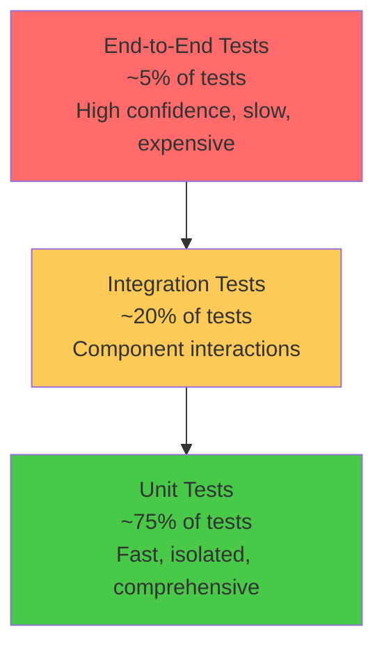

# Testing Overview

OpenFrame follows a comprehensive testing strategy that ensures code quality, reliability, and maintainability across the entire platform. This guide covers our testing philosophy, frameworks, patterns, and best practices.

## Testing Philosophy

### Quality Gates

Every code change must pass through these quality gates:

| Gate | Requirement | Tools | Automation |
|------|-------------|-------|------------|
| **Unit Tests** | 80%+ coverage | JUnit 5, Vitest | CI pipeline |
| **Integration Tests** | Critical paths covered | TestContainers, Playwright | CI pipeline |
| **Contract Tests** | API compatibility | Pact, GraphQL schema validation | CI pipeline |
| **End-to-End Tests** | User journeys | Playwright, Cypress | Nightly builds |
| **Performance Tests** | No regression | JMeter, K6 | Weekly builds |
| **Security Tests** | OWASP compliance | SAST, DAST tools | CI pipeline |

### Testing Pyramid



## Testing Stack

### Backend Testing (Java)

| Framework | Purpose | Usage |
|-----------|---------|-------|
| **JUnit 5** | Unit testing framework | Core testing foundation |
| **Mockito** | Mocking framework | Mock dependencies and external services |
| **TestContainers** | Integration testing | Real database/service instances |
| **WireMock** | HTTP service mocking | Mock external APIs |
| **Spring Boot Test** | Spring context testing | Application context integration |
| **Testcontainers** | Database testing | Real MongoDB, Redis, Kafka instances |

### Frontend Testing (TypeScript/Vue)

| Framework | Purpose | Usage |
|-----------|---------|-------|
| **Vitest** | Unit testing framework | Vue components and utilities |
| **Vue Test Utils** | Vue component testing | Component mounting and interaction |
| **Testing Library** | User-centric testing | DOM interaction patterns |
| **Playwright** | E2E testing | Cross-browser automation |
| **MSW (Mock Service Worker)** | API mocking | Mock GraphQL and REST APIs |

### API and Contract Testing

| Tool | Purpose | Usage |
|------|---------|-------|
| **GraphQL Schema Testing** | Schema validation | Ensure API compatibility |
| **Pact** | Consumer-driven contracts | Service integration contracts |
| **Postman/Newman** | API testing | REST endpoint validation |
| **Artillery** | Load testing | API performance validation |

## Unit Testing Patterns

### Backend Unit Tests (Java)

#### Service Layer Testing
```java
@ExtendWith(MockitoExtension.class)
class DeviceServiceTest {

    @Mock
    private DeviceRepository deviceRepository;
    
    @Mock
    private KafkaProducer kafkaProducer;
    
    @InjectMocks
    private DeviceService deviceService;

    @Test
    @DisplayName("Should create device and publish event")
    void shouldCreateDeviceAndPublishEvent() {
        // Given
        String organizationId = "org-123";
        CreateDeviceRequest request = CreateDeviceRequest.builder()
            .hostname("test-device")
            .organizationId(organizationId)
            .build();
        
        Device savedDevice = Device.builder()
            .id("device-123")
            .hostname("test-device")
            .organizationId(organizationId)
            .status(DeviceStatus.ACTIVE)
            .build();
            
        when(deviceRepository.save(any(Device.class))).thenReturn(savedDevice);

        // When
        Device result = deviceService.createDevice(request);

        // Then
        assertThat(result.getId()).isEqualTo("device-123");
        assertThat(result.getHostname()).isEqualTo("test-device");
        
        verify(deviceRepository).save(any(Device.class));
        verify(kafkaProducer).send(any(DeviceCreatedEvent.class));
    }

    @Test
    @DisplayName("Should throw exception when organization not found")
    void shouldThrowExceptionWhenOrganizationNotFound() {
        // Given
        CreateDeviceRequest request = CreateDeviceRequest.builder()
            .hostname("test-device")
            .organizationId("non-existent-org")
            .build();
            
        when(deviceRepository.save(any(Device.class)))
            .thenThrow(new OrganizationNotFoundException("non-existent-org"));

        // When & Then
        assertThrows(OrganizationNotFoundException.class, 
            () -> deviceService.createDevice(request));
        
        verify(kafkaProducer, never()).send(any());
    }
}
```

#### Repository Testing with TestContainers
```java
@Testcontainers
@SpringBootTest
class DeviceRepositoryTest {

    @Container
    static MongoDBContainer mongoDBContainer = new MongoDBContainer("mongo:7.0")
            .withExposedPorts(27017);

    @Autowired
    private DeviceRepository deviceRepository;

    @DynamicPropertySource
    static void configureProperties(DynamicPropertyRegistry registry) {
        registry.add("spring.data.mongodb.uri", mongoDBContainer::getReplicaSetUrl);
    }

    @Test
    @DisplayName("Should find active devices by organization")
    void shouldFindActiveDevicesByOrganization() {
        // Given
        String organizationId = "org-123";
        
        Device activeDevice = Device.builder()
            .hostname("active-device")
            .organizationId(organizationId)
            .status(DeviceStatus.ACTIVE)
            .build();
            
        Device inactiveDevice = Device.builder()
            .hostname("inactive-device")
            .organizationId(organizationId)
            .status(DeviceStatus.INACTIVE)
            .build();
            
        deviceRepository.saveAll(List.of(activeDevice, inactiveDevice));

        // When
        List<Device> activeDevices = deviceRepository.findByOrganizationIdAndStatus(
            organizationId, DeviceStatus.ACTIVE);

        // Then
        assertThat(activeDevices).hasSize(1);
        assertThat(activeDevices.get(0).getHostname()).isEqualTo("active-device");
    }
}
```

#### GraphQL DataFetcher Testing
```java
@ExtendWith(MockitoExtension.class)
class DeviceDataFetcherTest {

    @Mock
    private DeviceService deviceService;
    
    @InjectMocks
    private DeviceDataFetcher deviceDataFetcher;

    @Test
    @DisplayName("Should return device by ID")
    void shouldReturnDeviceById() {
        // Given
        String deviceId = "device-123";
        Device expectedDevice = Device.builder()
            .id(deviceId)
            .hostname("test-device")
            .build();
            
        when(deviceService.findById(deviceId)).thenReturn(expectedDevice);

        // When
        Device result = deviceDataFetcher.getDevice(deviceId);

        // Then
        assertThat(result).isEqualTo(expectedDevice);
        verify(deviceService).findById(deviceId);
    }
}
```

### Frontend Unit Tests (Vue/TypeScript)

#### Component Testing
```typescript
import { describe, it, expect, vi } from 'vitest'
import { mount } from '@vue/test-utils'
import DeviceCard from '@/components/DeviceCard.vue'
import { Device, DeviceStatus } from '@/types/device'

describe('DeviceCard', () => {
  const mockDevice: Device = {
    id: 'device-123',
    hostname: 'test-device',
    status: DeviceStatus.ONLINE,
    lastSeen: new Date('2024-01-01T10:00:00Z'),
    organization: {
      id: 'org-123',
      name: 'Test Org'
    }
  }

  it('should display device information correctly', () => {
    // Given
    const wrapper = mount(DeviceCard, {
      props: {
        device: mockDevice
      }
    })

    // Then
    expect(wrapper.find('[data-testid="device-hostname"]').text()).toBe('test-device')
    expect(wrapper.find('[data-testid="device-status"]').classes()).toContain('online')
    expect(wrapper.find('[data-testid="organization-name"]').text()).toBe('Test Org')
  })

  it('should emit device-click event when clicked', async () => {
    // Given
    const wrapper = mount(DeviceCard, {
      props: { device: mockDevice }
    })

    // When
    await wrapper.find('[data-testid="device-card"]').trigger('click')

    // Then
    expect(wrapper.emitted('device-click')).toBeTruthy()
    expect(wrapper.emitted('device-click')?.[0]).toEqual([mockDevice])
  })

  it('should show offline status with warning styling', () => {
    // Given
    const offlineDevice = { ...mockDevice, status: DeviceStatus.OFFLINE }
    const wrapper = mount(DeviceCard, {
      props: { device: offlineDevice }
    })

    // Then
    expect(wrapper.find('[data-testid="device-status"]').classes()).toContain('offline')
    expect(wrapper.find('[data-testid="status-warning"]').exists()).toBe(true)
  })
})
```

#### Composable Testing
```typescript
import { describe, it, expect, vi } from 'vitest'
import { useDevices } from '@/composables/useDevices'
import { createPinia, setActivePinia } from 'pinia'

// Mock Apollo Client
vi.mock('@vue/apollo-composable', () => ({
  useQuery: vi.fn(),
  useMutation: vi.fn()
}))

describe('useDevices', () => {
  beforeEach(() => {
    setActivePinia(createPinia())
  })

  it('should fetch devices successfully', async () => {
    // Given
    const mockDevices = [
      { id: 'device-1', hostname: 'device-1' },
      { id: 'device-2', hostname: 'device-2' }
    ]
    
    const mockUseQuery = vi.mocked(useQuery)
    mockUseQuery.mockReturnValue({
      result: ref({ devices: { edges: mockDevices.map(d => ({ node: d })) } }),
      loading: ref(false),
      error: ref(null),
      refetch: vi.fn()
    })

    // When
    const { devices, loading, error } = useDevices()

    // Then
    expect(devices.value).toHaveLength(2)
    expect(devices.value[0].hostname).toBe('device-1')
    expect(loading.value).toBe(false)
    expect(error.value).toBe(null)
  })
})
```

#### Store Testing (Pinia)
```typescript
import { describe, it, expect, beforeEach } from 'vitest'
import { setActivePinia, createPinia } from 'pinia'
import { useDevicesStore } from '@/stores/devices'

describe('Devices Store', () => {
  beforeEach(() => {
    setActivePinia(createPinia())
  })

  it('should add device to store', () => {
    // Given
    const store = useDevicesStore()
    const device = {
      id: 'device-123',
      hostname: 'new-device',
      status: DeviceStatus.ONLINE
    }

    // When
    store.addDevice(device)

    // Then
    expect(store.devices).toHaveLength(1)
    expect(store.devices[0].hostname).toBe('new-device')
  })

  it('should filter online devices', () => {
    // Given
    const store = useDevicesStore()
    store.devices = [
      { id: '1', hostname: 'online-1', status: DeviceStatus.ONLINE },
      { id: '2', hostname: 'offline-1', status: DeviceStatus.OFFLINE },
      { id: '3', hostname: 'online-2', status: DeviceStatus.ONLINE }
    ]

    // When
    const onlineDevices = store.onlineDevices

    // Then
    expect(onlineDevices).toHaveLength(2)
    expect(onlineDevices.every(d => d.status === DeviceStatus.ONLINE)).toBe(true)
  })
})
```

## Integration Testing

### Backend Integration Tests

#### Spring Boot Integration Test
```java
@SpringBootTest(webEnvironment = SpringBootTest.WebEnvironment.RANDOM_PORT)
@Testcontainers
@AutoConfigureTestDatabase(replace = AutoConfigureTestDatabase.Replace.NONE)
class DeviceControllerIntegrationTest {

    @Container
    static MongoDBContainer mongoDBContainer = new MongoDBContainer("mongo:7.0");
    
    @Container
    static RedisContainer redisContainer = new RedisContainer("redis:7-alpine");

    @Autowired
    private TestRestTemplate restTemplate;

    @Autowired
    private DeviceRepository deviceRepository;

    @DynamicPropertySource
    static void configureProperties(DynamicPropertyRegistry registry) {
        registry.add("spring.data.mongodb.uri", mongoDBContainer::getReplicaSetUrl);
        registry.add("spring.redis.host", redisContainer::getHost);
        registry.add("spring.redis.port", redisContainer::getFirstMappedPort);
    }

    @Test
    @DisplayName("Should create device via REST API")
    void shouldCreateDeviceViaRestApi() {
        // Given
        CreateDeviceRequest request = CreateDeviceRequest.builder()
            .hostname("integration-test-device")
            .organizationId("test-org")
            .build();

        HttpHeaders headers = new HttpHeaders();
        headers.setContentType(MediaType.APPLICATION_JSON);
        headers.setBearerAuth("test-jwt-token");
        
        HttpEntity<CreateDeviceRequest> httpEntity = new HttpEntity<>(request, headers);

        // When
        ResponseEntity<Device> response = restTemplate.postForEntity(
            "/api/devices", httpEntity, Device.class);

        // Then
        assertThat(response.getStatusCode()).isEqualTo(HttpStatus.CREATED);
        assertThat(response.getBody().getHostname()).isEqualTo("integration-test-device");
        
        // Verify device was saved to database
        Optional<Device> savedDevice = deviceRepository.findByHostname("integration-test-device");
        assertThat(savedDevice).isPresent();
    }
}
```

#### GraphQL Integration Test
```java
@SpringBootTest
@AutoConfigureTestDatabase
@Testcontainers
class GraphQLIntegrationTest {

    @Autowired
    private DgsQueryExecutor queryExecutor;

    @Container
    static MongoDBContainer mongoDBContainer = new MongoDBContainer("mongo:7.0");

    @Test
    @DisplayName("Should execute GraphQL device query")
    void shouldExecuteGraphQLDeviceQuery() {
        // Given
        String query = """
            query GetDevices($organizationId: ID!) {
                devices(organizationId: $organizationId, first: 10) {
                    edges {
                        node {
                            id
                            hostname
                            status
                            organization {
                                name
                            }
                        }
                    }
                }
            }
            """;

        Map<String, Object> variables = Map.of("organizationId", "test-org-123");

        // When
        ExecutionResult result = queryExecutor.execute(query, variables);

        // Then
        assertThat(result.getErrors()).isEmpty();
        
        Map<String, Object> data = result.getData();
        assertThat(data).containsKey("devices");
        
        Map<String, Object> devices = (Map<String, Object>) data.get("devices");
        List<Object> edges = (List<Object>) devices.get("edges");
        assertThat(edges).isNotNull();
    }
}
```

### Frontend Integration Tests

#### API Integration with MSW
```typescript
import { describe, it, expect, beforeAll, afterEach } from 'vitest'
import { setupServer } from 'msw/node'
import { graphql, rest } from 'msw'
import { render, screen, waitFor } from '@testing-library/vue'
import DevicesList from '@/pages/DevicesList.vue'

const mockDevices = [
  { id: '1', hostname: 'device-1', status: 'ONLINE' },
  { id: '2', hostname: 'device-2', status: 'OFFLINE' }
]

const server = setupServer(
  graphql.query('GetDevices', (req, res, ctx) => {
    return res(
      ctx.data({
        devices: {
          edges: mockDevices.map(device => ({ node: device }))
        }
      })
    )
  })
)

describe('DevicesList Integration', () => {
  beforeAll(() => server.listen())
  afterEach(() => server.resetHandlers())
  afterAll(() => server.close())

  it('should load and display devices from API', async () => {
    // When
    render(DevicesList, {
      global: {
        plugins: [apolloClient, pinia]
      }
    })

    // Then
    await waitFor(() => {
      expect(screen.getByText('device-1')).toBeInTheDocument()
      expect(screen.getByText('device-2')).toBeInTheDocument()
    })

    expect(screen.getByTestId('online-status')).toBeInTheDocument()
    expect(screen.getByTestId('offline-status')).toBeInTheDocument()
  })
})
```

## End-to-End Testing

### Playwright E2E Tests

#### User Journey Testing
```typescript
import { test, expect } from '@playwright/test'

test.describe('Device Management Journey', () => {
  test.beforeEach(async ({ page }) => {
    // Login as admin user
    await page.goto('/auth/login')
    await page.fill('[data-testid="email-input"]', 'admin@test.com')
    await page.fill('[data-testid="password-input"]', 'password123')
    await page.click('[data-testid="login-button"]')
    
    // Wait for dashboard to load
    await expect(page.locator('[data-testid="dashboard"]')).toBeVisible()
  })

  test('should create and manage device lifecycle', async ({ page }) => {
    // Navigate to devices page
    await page.click('[data-testid="nav-devices"]')
    await expect(page).toHaveURL('/devices')

    // Create new device
    await page.click('[data-testid="add-device-button"]')
    await page.fill('[data-testid="hostname-input"]', 'test-device-e2e')
    await page.selectOption('[data-testid="organization-select"]', 'test-org')
    await page.click('[data-testid="create-device-button"]')

    // Verify device appears in list
    await expect(page.locator('[data-testid="device-list"]')).toContainText('test-device-e2e')

    // View device details
    await page.click(`[data-testid="device-row-test-device-e2e"]`)
    await expect(page.locator('[data-testid="device-details"]')).toBeVisible()
    await expect(page.locator('[data-testid="device-hostname"]')).toContainText('test-device-e2e')

    // Update device status
    await page.click('[data-testid="edit-device-button"]')
    await page.selectOption('[data-testid="status-select"]', 'MAINTENANCE')
    await page.click('[data-testid="save-device-button"]')

    // Verify status updated
    await expect(page.locator('[data-testid="device-status"]')).toContainText('MAINTENANCE')

    // Delete device
    await page.click('[data-testid="device-actions-menu"]')
    await page.click('[data-testid="delete-device-action"]')
    await page.click('[data-testid="confirm-delete-button"]')

    // Verify device removed from list
    await expect(page.locator('[data-testid="device-list"]')).not.toContainText('test-device-e2e')
  })

  test('should handle device search and filtering', async ({ page }) => {
    await page.goto('/devices')

    // Test search functionality
    await page.fill('[data-testid="search-input"]', 'server')
    await expect(page.locator('[data-testid="device-row"]')).toHaveCount(3) // Assuming 3 servers

    // Test status filter
    await page.selectOption('[data-testid="status-filter"]', 'ONLINE')
    await expect(page.locator('[data-testid="offline-device"]')).not.toBeVisible()

    // Clear filters
    await page.click('[data-testid="clear-filters-button"]')
    await expect(page.locator('[data-testid="device-row"]').first()).toBeVisible()
  })
})
```

#### Cross-Browser Testing Configuration
```typescript
// playwright.config.ts
import { defineConfig, devices } from '@playwright/test'

export default defineConfig({
  testDir: './tests/e2e',
  fullyParallel: true,
  forbidOnly: !!process.env.CI,
  retries: process.env.CI ? 2 : 0,
  workers: process.env.CI ? 1 : undefined,
  reporter: [['html'], ['junit', { outputFile: 'test-results/junit.xml' }]],
  
  use: {
    baseURL: 'http://localhost:3000',
    trace: 'on-first-retry',
    video: 'retain-on-failure',
    screenshot: 'only-on-failure'
  },

  projects: [
    {
      name: 'chromium',
      use: { ...devices['Desktop Chrome'] },
    },
    {
      name: 'firefox',
      use: { ...devices['Desktop Firefox'] },
    },
    {
      name: 'webkit',
      use: { ...devices['Desktop Safari'] },
    },
    {
      name: 'Mobile Chrome',
      use: { ...devices['Pixel 5'] },
    },
  ],

  webServer: {
    command: 'npm run dev',
    url: 'http://localhost:3000',
    reuseExistingServer: !process.env.CI,
  },
})
```

## Performance Testing

### Backend Performance Tests

#### JMeter Test Plan
```xml
<!-- Device API Load Test -->
<jmeterTestPlan version="1.2">
  <hashTree>
    <TestPlan>
      <stringProp name="TestPlan.arguments"></stringProp>
      <boolProp name="TestPlan.functional_mode">false</boolProp>
      <boolProp name="TestPlan.serialize_threadgroups">false</boolProp>
      <elementProp name="TestPlan.arguments" elementType="Arguments" guiclass="ArgumentsPanel">
        <collectionProp name="Arguments.arguments"/>
      </elementProp>
      <stringProp name="TestPlan.user_define_classpath"></stringProp>
    </TestPlan>
    
    <hashTree>
      <ThreadGroup>
        <stringProp name="ThreadGroup.on_sample_error">continue</stringProp>
        <elementProp name="ThreadGroup.main_controller" elementType="LoopController">
          <boolProp name="LoopController.continue_forever">false</boolProp>
          <intProp name="LoopController.loops">100</intProp>
        </elementProp>
        <stringProp name="ThreadGroup.num_threads">50</stringProp>
        <stringProp name="ThreadGroup.ramp_time">30</stringProp>
        <longProp name="ThreadGroup.start_time">1640995200000</longProp>
        <longProp name="ThreadGroup.end_time">1640995200000</longProp>
        <boolProp name="ThreadGroup.scheduler">false</boolProp>
        <stringProp name="ThreadGroup.duration"></stringProp>
        <stringProp name="ThreadGroup.delay"></stringProp>
      </ThreadGroup>
    </hashTree>
  </hashTree>
</jmeterTestPlan>
```

#### K6 Performance Script
```javascript
import http from 'k6/http';
import { check, sleep } from 'k6';
import { Rate } from 'k6/metrics';

export let errorRate = new Rate('errors');

export let options = {
  stages: [
    { duration: '2m', target: 100 }, // Ramp up to 100 users
    { duration: '5m', target: 100 }, // Stay at 100 users
    { duration: '2m', target: 200 }, // Ramp up to 200 users
    { duration: '5m', target: 200 }, // Stay at 200 users
    { duration: '2m', target: 0 },   // Ramp down
  ],
  thresholds: {
    http_req_duration: ['p(99)<1500'], // 99% of requests must complete below 1.5s
    errors: ['rate<0.1'],             // Error rate should be less than 10%
  },
};

export default function () {
  const params = {
    headers: {
      'Authorization': 'Bearer jwt-token-here',
      'Content-Type': 'application/json',
    },
  };

  // Test GraphQL device query
  const graphqlQuery = {
    query: `
      query GetDevices($first: Int!) {
        devices(first: $first) {
          edges {
            node {
              id
              hostname
              status
              lastSeen
            }
          }
        }
      }
    `,
    variables: { first: 20 }
  };

  let response = http.post('http://localhost:8080/graphql', JSON.stringify(graphqlQuery), params);
  
  check(response, {
    'status is 200': (r) => r.status === 200,
    'response time < 500ms': (r) => r.timings.duration < 500,
    'has devices data': (r) => {
      const body = JSON.parse(r.body);
      return body.data && body.data.devices;
    },
  }) || errorRate.add(1);

  sleep(1);
}
```

### Frontend Performance Tests

#### Lighthouse CI Configuration
```javascript
// lighthouserc.js
module.exports = {
  ci: {
    collect: {
      url: [
        'http://localhost:3000/',
        'http://localhost:3000/devices',
        'http://localhost:3000/organizations',
        'http://localhost:3000/settings',
      ],
      startServerCommand: 'npm run dev',
      numberOfRuns: 3,
    },
    assert: {
      assertions: {
        'categories:performance': ['error', { minScore: 0.8 }],
        'categories:accessibility': ['error', { minScore: 0.9 }],
        'categories:best-practices': ['error', { minScore: 0.8 }],
        'categories:seo': ['error', { minScore: 0.8 }],
      },
    },
    upload: {
      target: 'filesystem',
      outputDir: './lighthouse-results',
    },
  },
};
```

## Testing Best Practices

### Test Naming Conventions

#### Java Tests
```java
// Pattern: Should_[ExpectedBehavior]_When_[StateUnderTest]
@Test
@DisplayName("Should return device when device exists")
void shouldReturnDevice_whenDeviceExists() { ... }

@Test  
@DisplayName("Should throw exception when device not found")
void shouldThrowException_whenDeviceNotFound() { ... }
```

#### TypeScript Tests
```typescript
// Pattern: should [expected behavior] when/given [condition]
describe('DeviceService', () => {
  it('should return device when ID is valid', () => { ... })
  
  it('should throw error when device is not found', () => { ... })
  
  it('should filter active devices correctly', () => { ... })
})
```

### Test Data Management

#### Test Data Builders (Java)
```java
public class DeviceTestDataBuilder {
    private String id = "default-device-id";
    private String hostname = "default-hostname";
    private DeviceStatus status = DeviceStatus.ACTIVE;
    private String organizationId = "default-org-id";

    public static DeviceTestDataBuilder aDevice() {
        return new DeviceTestDataBuilder();
    }

    public DeviceTestDataBuilder withId(String id) {
        this.id = id;
        return this;
    }

    public DeviceTestDataBuilder withHostname(String hostname) {
        this.hostname = hostname;
        return this;
    }

    public DeviceTestDataBuilder withStatus(DeviceStatus status) {
        this.status = status;
        return this;
    }

    public DeviceTestDataBuilder withOrganizationId(String organizationId) {
        this.organizationId = organizationId;
        return this;
    }

    public Device build() {
        return Device.builder()
            .id(id)
            .hostname(hostname)
            .status(status)
            .organizationId(organizationId)
            .createdAt(Instant.now())
            .build();
    }
}

// Usage in tests
Device testDevice = aDevice()
    .withHostname("test-device")
    .withStatus(DeviceStatus.ONLINE)
    .build();
```

#### Test Fixtures (TypeScript)
```typescript
// fixtures/deviceFixtures.ts
export const createMockDevice = (overrides: Partial<Device> = {}): Device => ({
  id: 'device-123',
  hostname: 'test-device',
  status: DeviceStatus.ONLINE,
  lastSeen: new Date(),
  organizationId: 'org-123',
  createdAt: new Date(),
  ...overrides
});

export const createMockDevices = (count: number): Device[] => 
  Array.from({ length: count }, (_, index) => 
    createMockDevice({ 
      id: `device-${index + 1}`,
      hostname: `device-${index + 1}`
    })
  );

// Usage in tests
const device = createMockDevice({ status: DeviceStatus.OFFLINE });
const devices = createMockDevices(5);
```

### Async Testing Patterns

#### Java Async Testing
```java
@Test
@DisplayName("Should process device event asynchronously")
void shouldProcessDeviceEventAsynchronously() throws Exception {
    // Given
    DeviceEvent event = new DeviceEvent("device-123", "status-change");
    CompletableFuture<Void> future = new CompletableFuture<>();
    
    doAnswer(invocation -> {
        future.complete(null);
        return null;
    }).when(eventProcessor).processAsync(event);

    // When
    eventService.handleDeviceEvent(event);

    // Then
    assertThat(future).succeedsWithin(Duration.ofSeconds(5));
    verify(eventProcessor).processAsync(event);
}
```

#### TypeScript Async Testing
```typescript
it('should load devices asynchronously', async () => {
  // Given
  const mockDevices = [createMockDevice()];
  vi.mocked(deviceApi.getDevices).mockResolvedValue(mockDevices);

  // When
  const { result } = renderHook(() => useDevices());

  // Wait for async operation to complete
  await waitFor(() => {
    expect(result.current.loading).toBe(false);
  });

  // Then
  expect(result.current.devices).toEqual(mockDevices);
  expect(result.current.error).toBe(null);
});
```

## Continuous Integration

### GitHub Actions Workflow
```yaml
name: Test Suite

on:
  push:
    branches: [ main, develop ]
  pull_request:
    branches: [ main ]

jobs:
  backend-tests:
    runs-on: ubuntu-latest
    
    services:
      mongodb:
        image: mongo:7.0
        ports:
          - 27017:27017
      redis:
        image: redis:7-alpine
        ports:
          - 6379:6379

    steps:
    - uses: actions/checkout@v4
    
    - name: Set up JDK 21
      uses: actions/setup-java@v3
      with:
        java-version: '21'
        distribution: 'temurin'
        
    - name: Cache Maven dependencies
      uses: actions/cache@v3
      with:
        path: ~/.m2
        key: ${{ runner.os }}-m2-${{ hashFiles('**/pom.xml') }}
        
    - name: Run unit tests
      run: mvn test
      
    - name: Run integration tests
      run: mvn integration-test
      
    - name: Upload test results
      uses: actions/upload-artifact@v3
      if: always()
      with:
        name: test-results
        path: target/surefire-reports/

  frontend-tests:
    runs-on: ubuntu-latest
    
    steps:
    - uses: actions/checkout@v4
    
    - name: Setup Node.js
      uses: actions/setup-node@v3
      with:
        node-version: '18'
        cache: 'npm'
        cache-dependency-path: openframe/services/openframe-frontend/package-lock.json
        
    - name: Install dependencies
      run: |
        cd openframe/services/openframe-frontend
        npm ci
        
    - name: Run unit tests
      run: |
        cd openframe/services/openframe-frontend
        npm run test:coverage
        
    - name: Run E2E tests
      run: |
        cd openframe/services/openframe-frontend
        npm run build
        npm run test:e2e
        
    - name: Upload coverage to Codecov
      uses: codecov/codecov-action@v3
      with:
        file: openframe/services/openframe-frontend/coverage/lcov.info

  performance-tests:
    runs-on: ubuntu-latest
    if: github.event_name == 'push' && github.ref == 'refs/heads/main'
    
    steps:
    - uses: actions/checkout@v4
    
    - name: Run K6 performance tests
      uses: grafana/k6-action@v0.3.0
      with:
        filename: tests/performance/api-load-test.js
        
    - name: Run Lighthouse CI
      run: |
        cd openframe/services/openframe-frontend
        npm install -g @lhci/cli
        lhci autorun
```

## Test Coverage and Reporting

### Coverage Requirements

| Component | Unit Test Coverage | Integration Coverage |
|-----------|-------------------|---------------------|
| **Service Layer** | 90%+ | Critical paths |
| **Repository Layer** | 80%+ | Database operations |
| **Controller Layer** | 85%+ | All endpoints |
| **Frontend Components** | 80%+ | User interactions |
| **Business Logic** | 95%+ | All scenarios |

### Coverage Configuration

#### Maven Jacoco (Java)
```xml
<plugin>
    <groupId>org.jacoco</groupId>
    <artifactId>jacoco-maven-plugin</artifactId>
    <version>0.8.8</version>
    <executions>
        <execution>
            <goals>
                <goal>prepare-agent</goal>
            </goals>
        </execution>
        <execution>
            <id>report</id>
            <phase>test</phase>
            <goals>
                <goal>report</goal>
            </goals>
        </execution>
    </executions>
    <configuration>
        <rules>
            <rule>
                <element>PACKAGE</element>
                <limits>
                    <limit>
                        <counter>LINE</counter>
                        <value>COVEREDRATIO</value>
                        <minimum>0.80</minimum>
                    </limit>
                </limits>
            </rule>
        </rules>
    </configuration>
</plugin>
```

#### Vitest Coverage (TypeScript)
```typescript
// vitest.config.ts
export default defineConfig({
  test: {
    coverage: {
      provider: 'v8',
      reporter: ['text', 'html', 'lcov'],
      thresholds: {
        global: {
          branches: 80,
          functions: 80,
          lines: 80,
          statements: 80
        }
      },
      exclude: [
        'node_modules/',
        'dist/',
        '**/*.d.ts',
        '**/*.config.*',
        '**/test/**'
      ]
    }
  }
})
```

## Next Steps

With testing fundamentals covered:

1. **[Contributing Guidelines](../contributing/guidelines.md)** - Learn the development workflow
2. **[Local Development](../setup/local-development.md)** - Set up your testing environment
3. **[Architecture Overview](../architecture/overview.md)** - Understand what you're testing

For testing questions and best practices, join the #testing channel in our [OpenMSP Slack community](https://join.slack.com/t/openmsp/shared_invite/zt-36bl7mx0h-3~U2nFH6nqHqoTPXMaHEHA)!