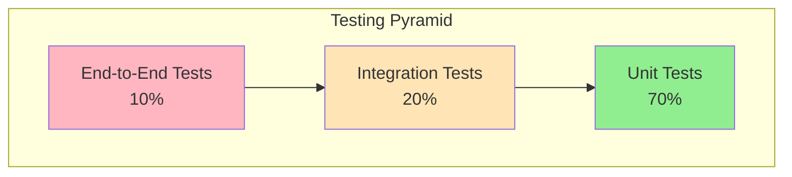

# Testing Overview

OpenFrame employs a comprehensive testing strategy that ensures code quality, system reliability, and regression prevention across all components. This guide covers the testing philosophy, frameworks, patterns, and practices used throughout the platform.

## Testing Philosophy

### Testing Pyramid

OpenFrame follows the testing pyramid approach, emphasizing different types of tests at appropriate levels:



### Testing Principles

| Principle | Implementation | Benefit |
|-----------|---------------|---------|
| **Test First** | Write tests before implementation | Better design, comprehensive coverage |
| **Fast Feedback** | Unit tests run in milliseconds | Quick development cycles |
| **Isolated Tests** | Each test is independent | Reliable, repeatable results |
| **Readable Tests** | Clear test names and structure | Easy maintenance, documentation |
| **Automated Testing** | All tests run in CI/CD | Consistent quality checks |

## Test Organization by Component

### Backend Services (Java)

#### Unit Tests
- **Location**: `src/test/java/`
- **Framework**: JUnit 5, Mockito, TestContainers
- **Coverage**: Services, repositories, utilities
- **Execution**: `mvn test`

#### Integration Tests  
- **Location**: `src/test/java/` (marked with `@SpringBootTest`)
- **Framework**: Spring Boot Test, TestContainers
- **Coverage**: API endpoints, database integration
- **Execution**: `mvn verify`

### Frontend (TypeScript/Vue)

#### Unit Tests
- **Location**: `src/**/*.test.ts`
- **Framework**: Vitest, Vue Test Utils
- **Coverage**: Components, composables, utilities
- **Execution**: `npm test`

#### E2E Tests
- **Location**: `e2e/`
- **Framework**: Playwright
- **Coverage**: User workflows, critical paths
- **Execution**: `npm run test:e2e`

### Rust Client

#### Unit Tests
- **Location**: `src/` (inline with code)
- **Framework**: Built-in Rust testing
- **Coverage**: Core logic, utilities
- **Execution**: `cargo test`

#### Integration Tests
- **Location**: `tests/`
- **Framework**: Built-in Rust testing
- **Coverage**: External interactions, workflows
- **Execution**: `cargo test --test integration_tests`

## Testing Frameworks and Tools

### Java Testing Stack

#### JUnit 5
**Core testing framework with modern features:**

```java
@Test
@DisplayName("Should create user with valid data")
void shouldCreateUserWithValidData() {
    // Given
    CreateUserRequest request = CreateUserRequest.builder()
        .email("test@example.com")
        .firstName("John")
        .lastName("Doe")
        .build();
    
    // When
    UserResponse response = userService.createUser(request);
    
    // Then
    assertThat(response.getEmail()).isEqualTo("test@example.com");
    assertThat(response.getId()).isNotNull();
}
```

#### Mockito
**Mocking framework for isolating dependencies:**

```java
@ExtendWith(MockitoExtension.class)
class UserServiceTest {
    
    @Mock
    private UserRepository userRepository;
    
    @Mock
    private EmailService emailService;
    
    @InjectMocks
    private UserService userService;
    
    @Test
    void shouldSendWelcomeEmail() {
        // Given
        User user = new User("test@example.com", "John", "Doe");
        when(userRepository.save(any(User.class))).thenReturn(user);
        
        // When
        userService.createUser(createUserRequest);
        
        // Then
        verify(emailService).sendWelcomeEmail(user.getEmail());
    }
}
```

#### TestContainers
**Real databases for integration tests:**

```java
@SpringBootTest
@Testcontainers
class DeviceRepositoryIntegrationTest {
    
    @Container
    static MongoDBContainer mongoContainer = new MongoDBContainer("mongo:7.0")
            .withReuse(true);
    
    @DynamicPropertySource
    static void configureProperties(DynamicPropertyRegistry registry) {
        registry.add("spring.data.mongodb.uri", mongoContainer::getReplicaSetUrl);
    }
    
    @Test
    void shouldFindDevicesByOrganization() {
        // Test with real MongoDB instance
    }
}
```

### Frontend Testing Stack

#### Vitest
**Fast unit test runner for Vue components:**

```typescript
// UserProfile.test.ts
import { describe, it, expect } from 'vitest'
import { mount } from '@vue/test-utils'
import UserProfile from '@/components/UserProfile.vue'

describe('UserProfile', () => {
  it('displays user information correctly', () => {
    const wrapper = mount(UserProfile, {
      props: {
        user: {
          id: '1',
          email: 'test@example.com',
          firstName: 'John',
          lastName: 'Doe'
        }
      }
    })
    
    expect(wrapper.text()).toContain('John Doe')
    expect(wrapper.text()).toContain('test@example.com')
  })
})
```

#### Vue Test Utils
**Vue-specific testing utilities:**

```typescript
import { shallowMount } from '@vue/test-utils'
import { createTestingPinia } from '@pinia/testing'

describe('DeviceList', () => {
  it('loads devices on mount', async () => {
    const wrapper = shallowMount(DeviceList, {
      global: {
        plugins: [createTestingPinia()]
      }
    })
    
    await wrapper.vm.$nextTick()
    
    expect(wrapper.vm.devices).toBeDefined()
  })
})
```

#### Playwright
**End-to-end testing framework:**

```typescript
// e2e/device-management.spec.ts
import { test, expect } from '@playwright/test'

test('user can view and filter devices', async ({ page }) => {
  // Login
  await page.goto('/auth/login')
  await page.fill('[data-testid="email"]', 'admin@test.com')
  await page.fill('[data-testid="password"]', 'password')
  await page.click('[data-testid="login-button"]')
  
  // Navigate to devices
  await page.click('[data-testid="devices-nav"]')
  
  // Verify device list loads
  await expect(page.locator('[data-testid="device-list"]')).toBeVisible()
  
  // Test filtering
  await page.fill('[data-testid="device-filter"]', 'server')
  await expect(page.locator('[data-testid="device-item"]')).toContainText('server')
})
```

### Rust Testing

#### Built-in Testing Framework
**Comprehensive testing with minimal setup:**

```rust
// src/services/device_service.rs
#[cfg(test)]
mod tests {
    use super::*;
    use tokio_test;
    
    #[tokio::test]
    async fn test_device_registration() {
        // Given
        let service = DeviceService::new();
        let request = DeviceRegistrationRequest {
            hostname: "test-device".to_string(),
            platform: "linux".to_string(),
        };
        
        // When
        let result = service.register_device(request).await;
        
        // Then
        assert!(result.is_ok());
        assert_eq!(result.unwrap().hostname, "test-device");
    }
}
```

#### Integration Tests
**Testing external integrations:**

```rust
// tests/integration_test.rs
use openframe_client::config::Config;
use openframe_client::service::DeviceService;

#[tokio::test]
async fn test_full_device_workflow() {
    // Setup test environment
    let config = Config::test_config();
    let service = DeviceService::with_config(config);
    
    // Test complete workflow
    let registration = service.register().await.expect("Registration failed");
    let heartbeat = service.send_heartbeat().await.expect("Heartbeat failed");
    
    assert!(registration.success);
    assert!(heartbeat.acknowledged);
}
```

## Test Patterns and Best Practices

### Unit Test Patterns

#### AAA Pattern (Arrange, Act, Assert)
```java
@Test
void shouldCalculateDeviceUptime() {
    // Arrange
    Device device = new Device("server01");
    device.setLastSeen(Instant.now().minus(Duration.ofHours(2)));
    device.setFirstSeen(Instant.now().minus(Duration.ofDays(30)));
    
    // Act
    Duration uptime = deviceService.calculateUptime(device);
    
    // Assert
    assertThat(uptime).isGreaterThan(Duration.ofDays(29));
}
```

#### Builder Pattern for Test Data
```java
public class DeviceTestDataBuilder {
    private String hostname = "default-device";
    private DeviceType type = DeviceType.SERVER;
    private DeviceStatus status = DeviceStatus.ONLINE;
    
    public DeviceTestDataBuilder withHostname(String hostname) {
        this.hostname = hostname;
        return this;
    }
    
    public DeviceTestDataBuilder withStatus(DeviceStatus status) {
        this.status = status;
        return this;
    }
    
    public Device build() {
        return Device.builder()
            .hostname(hostname)
            .type(type)
            .status(status)
            .build();
    }
}

// Usage in tests
@Test
void shouldFilterOnlineDevices() {
    // Given
    Device onlineDevice = new DeviceTestDataBuilder()
        .withHostname("server01")
        .withStatus(DeviceStatus.ONLINE)
        .build();
        
    Device offlineDevice = new DeviceTestDataBuilder()
        .withHostname("server02")
        .withStatus(DeviceStatus.OFFLINE)
        .build();
}
```

### Integration Test Patterns

#### Database Test Slice
```java
@DataJpaTest  // Only loads JPA components
@TestPropertySource(properties = {
    "spring.jpa.hibernate.ddl-auto=create-drop"
})
class DeviceRepositoryTest {
    
    @Autowired
    private TestEntityManager entityManager;
    
    @Autowired
    private DeviceRepository deviceRepository;
    
    @Test
    void shouldFindDevicesByOrganization() {
        // Given
        Organization org = new Organization("Test Org");
        entityManager.persistAndFlush(org);
        
        Device device = new Device("test-device", org);
        entityManager.persistAndFlush(device);
        
        // When
        List<Device> devices = deviceRepository.findByOrganizationId(org.getId());
        
        // Then
        assertThat(devices).hasSize(1);
        assertThat(devices.get(0).getHostname()).isEqualTo("test-device");
    }
}
```

#### Web Test Slice
```java
@WebMvcTest(DeviceController.class)
class DeviceControllerTest {
    
    @Autowired
    private MockMvc mockMvc;
    
    @MockBean
    private DeviceService deviceService;
    
    @Test
    void shouldReturnDeviceList() throws Exception {
        // Given
        List<Device> devices = List.of(
            new Device("server01"),
            new Device("server02")
        );
        when(deviceService.findAll()).thenReturn(devices);
        
        // When & Then
        mockMvc.perform(get("/api/devices"))
            .andExpect(status().isOk())
            .andExpect(jsonPath("$.length()").value(2))
            .andExpect(jsonPath("$[0].hostname").value("server01"));
    }
}
```

### Frontend Test Patterns

#### Component Testing
```typescript
import { describe, it, expect, vi } from 'vitest'
import { mount } from '@vue/test-utils'
import DeviceStatus from '@/components/DeviceStatus.vue'

describe('DeviceStatus', () => {
  it('shows online status with green indicator', () => {
    const wrapper = mount(DeviceStatus, {
      props: {
        status: 'online',
        lastSeen: new Date().toISOString()
      }
    })
    
    expect(wrapper.find('[data-testid="status-indicator"]').classes()).toContain('bg-green-500')
    expect(wrapper.text()).toContain('Online')
  })
  
  it('emits refresh event when button clicked', async () => {
    const wrapper = mount(DeviceStatus, {
      props: { status: 'offline' }
    })
    
    await wrapper.find('[data-testid="refresh-button"]').trigger('click')
    
    expect(wrapper.emitted('refresh')).toBeTruthy()
  })
})
```

#### Store Testing
```typescript
import { setActivePinia, createPinia } from 'pinia'
import { useDevicesStore } from '@/stores/devices'

describe('Devices Store', () => {
  beforeEach(() => {
    setActivePinia(createPinia())
  })
  
  it('loads devices successfully', async () => {
    const store = useDevicesStore()
    
    // Mock API response
    vi.mocked(api.getDevices).mockResolvedValue([
      { id: '1', hostname: 'server01' },
      { id: '2', hostname: 'server02' }
    ])
    
    await store.loadDevices()
    
    expect(store.devices).toHaveLength(2)
    expect(store.loading).toBe(false)
  })
})
```

## Test Data Management

### Test Fixtures

#### Java Test Data
```java
@TestConfiguration
public class TestDataConfig {
    
    @Bean
    @Primary
    public DeviceService mockDeviceService() {
        DeviceService mock = Mockito.mock(DeviceService.class);
        
        // Setup default behavior
        when(mock.findById(any())).thenReturn(createTestDevice());
        
        return mock;
    }
    
    private Device createTestDevice() {
        return Device.builder()
            .id("test-device-id")
            .hostname("test-server")
            .type(DeviceType.SERVER)
            .status(DeviceStatus.ONLINE)
            .build();
    }
}
```

#### Frontend Test Data
```typescript
// tests/fixtures/devices.ts
export const mockDevices = [
  {
    id: '1',
    hostname: 'web-server-01',
    type: 'server',
    status: 'online',
    lastSeen: '2024-01-01T10:00:00Z'
  },
  {
    id: '2', 
    hostname: 'db-server-01',
    type: 'server',
    status: 'offline',
    lastSeen: '2024-01-01T09:30:00Z'
  }
]

// Usage in tests
import { mockDevices } from '../fixtures/devices'
```

### Database Seeding

#### Test Database Setup
```java
@TestProfile
@Component
public class TestDataSeeder {
    
    @Autowired
    private DeviceRepository deviceRepository;
    
    @EventListener
    public void onApplicationReady(ApplicationReadyEvent event) {
        if (Arrays.asList(environment.getActiveProfiles()).contains("test")) {
            seedTestData();
        }
    }
    
    private void seedTestData() {
        // Create test organizations
        Organization testOrg = new Organization("Test Organization");
        organizationRepository.save(testOrg);
        
        // Create test devices
        Device server1 = new Device("test-server-01", testOrg);
        Device server2 = new Device("test-server-02", testOrg);
        deviceRepository.saveAll(List.of(server1, server2));
    }
}
```

## Test Coverage and Quality

### Coverage Requirements

| Component | Target Coverage | Current Coverage | Tool |
|-----------|----------------|------------------|------|
| **Backend Services** | 80%+ | 85% | JaCoCo |
| **Frontend Components** | 70%+ | 78% | c8 (via Vitest) |
| **Rust Client** | 80%+ | 82% | cargo-tarpaulin |

### Coverage Configuration

#### Java (JaCoCo)
```xml
<plugin>
    <groupId>org.jacoco</groupId>
    <artifactId>jacoco-maven-plugin</artifactId>
    <executions>
        <execution>
            <id>prepare-agent</id>
            <goals>
                <goal>prepare-agent</goal>
            </goals>
        </execution>
        <execution>
            <id>report</id>
            <phase>test</phase>
            <goals>
                <goal>report</goal>
            </goals>
        </execution>
        <execution>
            <id>check</id>
            <goals>
                <goal>check</goal>
            </goals>
            <configuration>
                <rules>
                    <rule>
                        <element>CLASS</element>
                        <limits>
                            <limit>
                                <counter>LINE</counter>
                                <value>COVEREDRATIO</value>
                                <minimum>0.80</minimum>
                            </limit>
                        </limits>
                    </rule>
                </rules>
            </configuration>
        </execution>
    </executions>
</plugin>
```

#### Frontend (Vitest)
```typescript
// vitest.config.ts
export default defineConfig({
  test: {
    coverage: {
      provider: 'c8',
      reporter: ['text', 'json', 'html'],
      thresholds: {
        lines: 70,
        functions: 70,
        branches: 70,
        statements: 70
      },
      exclude: [
        'src/types/**',
        'src/**/*.d.ts',
        'src/main.ts'
      ]
    }
  }
})
```

#### Rust (cargo-tarpaulin)
```toml
# Cargo.toml
[package.metadata.tarpaulin]
timeout = "120s"
exclude = [
    "src/bin/*",
    "examples/*"
]
```

## Running Tests

### Command Reference

#### Backend Tests
```bash
# Unit tests only
mvn test

# All tests including integration
mvn verify

# Specific test class
mvn test -Dtest=DeviceServiceTest

# Specific test method
mvn test -Dtest=DeviceServiceTest#shouldCreateDevice

# With coverage report
mvn clean test jacoco:report

# Skip tests (for quick builds)
mvn install -DskipTests
```

#### Frontend Tests
```bash
# Unit tests
npm test

# Watch mode for development
npm run test:watch

# Coverage report
npm run test:coverage

# E2E tests
npm run test:e2e

# E2E tests in headed mode (see browser)
npm run test:e2e:headed

# Run specific test file
npm test -- DeviceList.test.ts
```

#### Rust Tests
```bash
# All tests
cargo test

# Unit tests only
cargo test --lib

# Integration tests only
cargo test --test integration_tests

# With output
cargo test -- --nocapture

# Coverage report
cargo tarpaulin --out Html
```

### Continuous Integration

#### GitHub Actions Workflow
```yaml
name: Test Suite

on: [push, pull_request]

jobs:
  backend-tests:
    runs-on: ubuntu-latest
    services:
      mongodb:
        image: mongo:7.0
        ports:
          - 27017:27017
      redis:
        image: redis:7.0
        ports:
          - 6379:6379
    
    steps:
    - uses: actions/checkout@v3
    - uses: actions/setup-java@v3
      with:
        java-version: '21'
    
    - name: Run backend tests
      run: mvn clean verify
    
    - name: Upload coverage
      uses: codecov/codecov-action@v3
      with:
        file: ./target/site/jacoco/jacoco.xml

  frontend-tests:
    runs-on: ubuntu-latest
    steps:
    - uses: actions/checkout@v3
    - uses: actions/setup-node@v3
      with:
        node-version: '18'
    
    - name: Install dependencies
      run: cd openframe/services/openframe-frontend && npm ci
    
    - name: Run frontend tests
      run: cd openframe/services/openframe-frontend && npm test
    
    - name: Run E2E tests
      run: cd openframe/services/openframe-frontend && npm run test:e2e:ci

  rust-tests:
    runs-on: ubuntu-latest
    steps:
    - uses: actions/checkout@v3
    - uses: actions-rs/toolchain@v1
      with:
        toolchain: stable
    
    - name: Run Rust tests
      run: cd clients/openframe-client && cargo test
```

## Performance Testing

### Load Testing with K6

```javascript
// performance/api-load-test.js
import http from 'k6/http'
import { check } from 'k6'

export let options = {
  vus: 10,  // 10 virtual users
  duration: '30s'
}

export default function() {
  let response = http.get('http://localhost:8080/api/v1/devices')
  
  check(response, {
    'status is 200': (r) => r.status === 200,
    'response time < 500ms': (r) => r.timings.duration < 500,
  })
}
```

### Database Performance Tests

```java
@Test
@Timeout(value = 5, unit = TimeUnit.SECONDS)  // Fail if takes > 5s
void shouldQueryDevicesWithinTimeLimit() {
    // Create 10,000 test devices
    List<Device> devices = createTestDevices(10_000);
    deviceRepository.saveAll(devices);
    
    // Query should complete quickly even with large dataset
    long startTime = System.currentTimeMillis();
    List<Device> results = deviceRepository.findByStatus(DeviceStatus.ONLINE);
    long duration = System.currentTimeMillis() - startTime;
    
    assertThat(duration).isLessThan(1000);  // < 1 second
    assertThat(results).hasSizeGreaterThan(0);
}
```

## Testing Best Practices

### Do's and Don'ts

#### ✅ Do's
- **Write descriptive test names** that explain what is being tested
- **Use AAA pattern** for clear test structure
- **Mock external dependencies** to isolate units under test
- **Test edge cases** including null values, empty collections, boundary conditions
- **Keep tests fast** - unit tests should run in milliseconds
- **Make tests independent** - each test should be able to run in isolation
- **Use test data builders** for complex object creation
- **Clean up resources** in test teardown methods

#### ❌ Don'ts
- **Don't test implementation details** - test behavior, not internal structure
- **Don't write tests that depend on external systems** in unit tests
- **Don't ignore failing tests** - fix them immediately or remove them
- **Don't test framework code** - focus on your business logic
- **Don't create overly complex test setups** - simplify where possible
- **Don't duplicate production logic in tests** - keep test logic simple

### Test Naming Conventions

#### Java Test Methods
```java
// Pattern: should[ExpectedBehavior]When[StateOrCondition]
@Test
void shouldReturnUserWhenValidIdProvided() { }

@Test 
void shouldThrowExceptionWhenUserNotFound() { }

@Test
void shouldCreateDeviceWhenValidDataProvided() { }
```

#### Frontend Test Cases
```typescript
// Pattern: describes what it does in plain English
describe('DeviceList component', () => {
  it('displays loading spinner while fetching devices', () => {})
  
  it('shows device list when data is loaded', () => {})
  
  it('handles empty state when no devices exist', () => {})
})
```

### Common Testing Anti-Patterns

#### ❌ Testing Implementation Details
```java
// BAD: Testing internal method calls
@Test
void shouldCallRepository() {
    userService.createUser(request);
    verify(userRepository).save(any(User.class));  // Testing implementation
}
```

```java
// GOOD: Testing behavior
@Test
void shouldCreateUserWithValidData() {
    UserResponse response = userService.createUser(request);
    assertThat(response.getEmail()).isEqualTo("test@example.com");  // Testing outcome
}
```

#### ❌ Overly Complex Test Setup
```java
// BAD: Complex setup that's hard to understand
@BeforeEach
void setup() {
    // 50 lines of setup code...
}
```

```java
// GOOD: Simple, focused setup
@Test
void shouldValidateUser() {
    // Given - setup specific to this test
    User user = createValidUser();
    
    // When
    boolean isValid = userValidator.validate(user);
    
    // Then
    assertThat(isValid).isTrue();
}
```

## Troubleshooting Test Issues

### Common Problems and Solutions

#### Test Database Issues
```bash
# Clean test database
docker compose down
docker compose up -d

# Reset test data
mvn clean test -Dspring.profiles.active=test
```

#### Frontend Test Timeouts
```typescript
// Increase timeout for slow components
it('loads large dataset', async () => {
  // Increase default timeout
  vi.setTimeout(10000)  // 10 seconds
  
  const wrapper = mount(LargeDataTable)
  await wrapper.vm.loadData()
  
  expect(wrapper.vm.items).toBeDefined()
}, 10000)
```

#### Mock Issues
```java
// Reset mocks between tests
@BeforeEach
void resetMocks() {
    Mockito.reset(userRepository, emailService);
}

// Verify mock interactions
@Test
void shouldSendEmail() {
    userService.createUser(request);
    
    // Verify exactly one interaction
    verify(emailService, times(1)).sendWelcomeEmail(anyString());
}
```

This comprehensive testing overview ensures OpenFrame maintains high code quality and reliability across all components. The testing strategy provides confidence in deployments while enabling rapid development cycles.