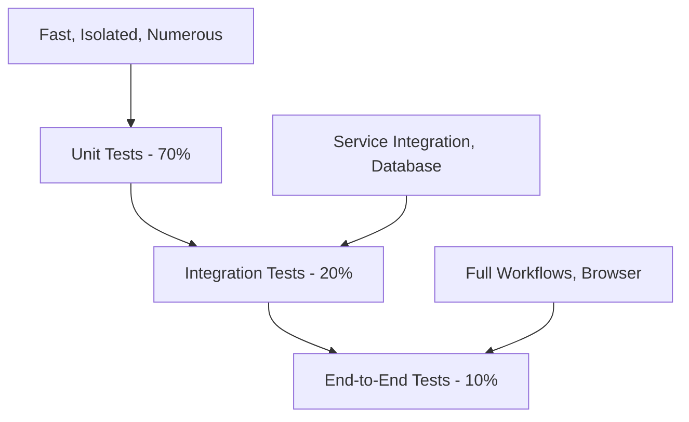

# Testing Overview

This document provides a comprehensive overview of OpenFrame's testing strategy, including test organization, running tests, writing new tests, and coverage requirements.

## Testing Philosophy

OpenFrame follows a multi-layered testing approach ensuring reliability, maintainability, and confidence in deployments:

### Testing Pyramid



**Test Distribution**:
- **Unit Tests (70%)**: Fast, isolated tests for individual components
- **Integration Tests (20%)**: Database and service integration tests
- **End-to-End Tests (10%)**: Complete user workflows and API contracts

## Test Organization

### Project Structure

```text
openframe-oss-tenant/
├── openframe/services/
│   ├── openframe-api/
│   │   └── src/test/java/               # Unit & Integration tests
│   ├── openframe-frontend/
│   │   └── src/test/                    # Frontend tests
│   └── */src/test/                      # Service-specific tests
├── openframe-e2e-tests/                 # End-to-end test suite
│   ├── src/test/java/                   # E2E test implementation
│   └── docker-compose.test.yml          # Test environment
└── scripts/test/                        # Test automation scripts
```

### Test Categories

**Backend Tests**:
- **Unit Tests**: `*Test.java` - JUnit 5 with Mockito
- **Integration Tests**: `*IT.java` - Spring Boot Test with TestContainers
- **Repository Tests**: `*RepositoryTest.java` - MongoDB integration
- **Controller Tests**: `*ControllerTest.java` - MockMvc web layer tests

**Frontend Tests**:
- **Unit Tests**: `*.test.ts` - Vitest with Vue Test Utils
- **Component Tests**: `*.spec.ts` - Vue component testing
- **E2E Tests**: `*.e2e.ts` - Playwright browser automation

## Backend Testing

### Unit Testing Framework

**Technology Stack**:
- **JUnit 5**: Test framework
- **Mockito**: Mocking framework  
- **AssertJ**: Fluent assertions
- **TestContainers**: Database integration
- **WireMock**: HTTP service mocking

### Unit Test Example

```java
@ExtendWith(MockitoExtension.class)
class DeviceServiceTest {
    
    @Mock
    private DeviceRepository deviceRepository;
    
    @Mock
    private EventPublisher eventPublisher;
    
    @InjectMocks
    private DeviceService deviceService;
    
    @Test
    @DisplayName("Should create device with valid data")
    void shouldCreateDeviceWithValidData() {
        // Given
        CreateDeviceRequest request = CreateDeviceRequest.builder()
            .name("Test Device")
            .organizationId("org-123")
            .deviceType(DeviceType.DESKTOP)
            .build();
            
        Device savedDevice = Device.builder()
            .id("device-123")
            .name("Test Device")
            .organizationId("org-123")
            .status(DeviceStatus.ACTIVE)
            .build();
            
        when(deviceRepository.save(any(Device.class))).thenReturn(savedDevice);
        
        // When
        Device result = deviceService.createDevice(request);
        
        // Then
        assertThat(result)
            .isNotNull()
            .extracting(Device::getName, Device::getOrganizationId, Device::getStatus)
            .containsExactly("Test Device", "org-123", DeviceStatus.ACTIVE);
            
        verify(eventPublisher).publishEvent(any(DeviceCreatedEvent.class));
    }
    
    @Test
    @DisplayName("Should throw exception for duplicate device name")
    void shouldThrowExceptionForDuplicateDeviceName() {
        // Given
        CreateDeviceRequest request = CreateDeviceRequest.builder()
            .name("Existing Device")
            .organizationId("org-123")
            .build();
            
        when(deviceRepository.existsByNameAndOrganizationId("Existing Device", "org-123"))
            .thenReturn(true);
        
        // When & Then
        assertThatThrownBy(() -> deviceService.createDevice(request))
            .isInstanceOf(DuplicateDeviceException.class)
            .hasMessage("Device with name 'Existing Device' already exists");
    }
}
```

### Integration Testing

**Spring Boot Test Configuration**:

```java
@SpringBootTest(webEnvironment = SpringBootTest.WebEnvironment.RANDOM_PORT)
@Testcontainers
class DeviceControllerIT {
    
    @Container
    static MongoDBContainer mongodb = new MongoDBContainer("mongo:7")
            .withReuse(true);
            
    @Container 
    static RedisContainer redis = new RedisContainer("redis:7")
            .withReuse(true);
    
    @Autowired
    private TestRestTemplate restTemplate;
    
    @Autowired
    private DeviceRepository deviceRepository;
    
    @DynamicPropertySource
    static void configureProperties(DynamicPropertyRegistry registry) {
        registry.add("spring.data.mongodb.uri", mongodb::getReplicaSetUrl);
        registry.add("spring.redis.url", redis::getRedisUrl);
    }
    
    @Test
    void shouldCreateAndRetrieveDevice() {
        // Given
        CreateDeviceRequest request = CreateDeviceRequest.builder()
            .name("Integration Test Device")
            .organizationId("test-org")
            .deviceType(DeviceType.SERVER)
            .build();
            
        // When - Create device
        ResponseEntity<DeviceResponse> createResponse = restTemplate
            .withBasicAuth("test-user", "password")
            .postForEntity("/api/devices", request, DeviceResponse.class);
            
        // Then - Verify creation
        assertThat(createResponse.getStatusCode()).isEqualTo(HttpStatus.CREATED);
        DeviceResponse created = createResponse.getBody();
        assertThat(created.getName()).isEqualTo("Integration Test Device");
        
        // When - Retrieve device
        ResponseEntity<DeviceResponse> getResponse = restTemplate
            .withBasicAuth("test-user", "password")
            .getForEntity("/api/devices/" + created.getId(), DeviceResponse.class);
            
        // Then - Verify retrieval
        assertThat(getResponse.getStatusCode()).isEqualTo(HttpStatus.OK);
        assertThat(getResponse.getBody()).isEqualTo(created);
        
        // Verify database state
        Optional<Device> deviceInDb = deviceRepository.findById(created.getId());
        assertThat(deviceInDb).isPresent();
        assertThat(deviceInDb.get().getName()).isEqualTo("Integration Test Device");
    }
}
```

### GraphQL Testing

**GraphQL Test Configuration**:

```java
@GraphQlTest(DeviceDataFetcher.class)
class DeviceDataFetcherTest {
    
    @Autowired
    private GraphQlTester graphQlTester;
    
    @MockBean
    private DeviceService deviceService;
    
    @Test
    void shouldFetchDevicesWithFiltering() {
        // Given
        List<Device> devices = List.of(
            Device.builder().id("device-1").name("Server-01").status(DeviceStatus.ACTIVE).build(),
            Device.builder().id("device-2").name("Server-02").status(DeviceStatus.ACTIVE).build()
        );
        
        DeviceConnection connection = DeviceConnection.builder()
            .edges(devices.stream()
                .map(device -> DeviceEdge.builder()
                    .node(device)
                    .cursor(CursorUtil.encode(device.getId()))
                    .build())
                .toList())
            .pageInfo(PageInfo.builder()
                .hasNextPage(false)
                .hasPreviousPage(false)
                .build())
            .build();
            
        when(deviceService.getDevices(any(DeviceFilterInput.class), any(CursorPaginationInput.class)))
            .thenReturn(connection);
        
        // When & Then
        graphQlTester
            .document("""
                query GetDevices($filter: DeviceFilterInput, $pagination: CursorPaginationInput) {
                    devices(filter: $filter, pagination: $pagination) {
                        edges {
                            node {
                                id
                                name
                                status
                            }
                            cursor
                        }
                        pageInfo {
                            hasNextPage
                            hasPreviousPage
                        }
                    }
                }
                """)
            .variable("filter", Map.of("status", "ACTIVE"))
            .variable("pagination", Map.of("first", 10))
            .execute()
            .path("devices.edges")
            .entityList(Object.class)
            .hasSize(2)
            .path("devices.edges[0].node.name")
            .entity(String.class)
            .isEqualTo("Server-01");
    }
}
```

## Frontend Testing

### Vue Component Testing

**Technology Stack**:
- **Vitest**: Test runner
- **Vue Test Utils**: Vue component utilities
- **@testing-library/vue**: DOM testing utilities
- **MSW**: API mocking
- **Playwright**: E2E browser testing

### Component Test Example

```typescript
// DeviceCard.spec.ts
import { describe, it, expect, beforeEach } from 'vitest'
import { mount, VueWrapper } from '@vue/test-utils'
import { createPinia } from 'pinia'
import DeviceCard from '@/components/devices/DeviceCard.vue'
import type { Device } from '@/types/device'

describe('DeviceCard', () => {
  let wrapper: VueWrapper<any>
  const mockDevice: Device = {
    id: 'device-123',
    name: 'Test Server',
    status: 'ACTIVE',
    deviceType: 'SERVER',
    lastSeen: new Date('2024-01-15T10:30:00Z'),
    organizationId: 'org-123'
  }

  beforeEach(() => {
    wrapper = mount(DeviceCard, {
      props: {
        device: mockDevice
      },
      global: {
        plugins: [createPinia()]
      }
    })
  })

  it('renders device information correctly', () => {
    expect(wrapper.find('[data-testid="device-name"]').text()).toBe('Test Server')
    expect(wrapper.find('[data-testid="device-status"]').text()).toBe('Active')
    expect(wrapper.find('[data-testid="device-type"]').text()).toBe('Server')
  })

  it('shows correct status badge color', () => {
    const statusBadge = wrapper.find('[data-testid="status-badge"]')
    expect(statusBadge.classes()).toContain('bg-green-100')
    expect(statusBadge.classes()).toContain('text-green-800')
  })

  it('emits device-selected event when clicked', async () => {
    await wrapper.find('[data-testid="device-card"]').trigger('click')
    
    expect(wrapper.emitted('device-selected')).toBeTruthy()
    expect(wrapper.emitted('device-selected')![0]).toEqual([mockDevice])
  })

  it('shows offline status for inactive device', async () => {
    await wrapper.setProps({
      device: { ...mockDevice, status: 'OFFLINE' }
    })

    expect(wrapper.find('[data-testid="device-status"]').text()).toBe('Offline')
    const statusBadge = wrapper.find('[data-testid="status-badge"]')
    expect(statusBadge.classes()).toContain('bg-red-100')
  })
})
```

### Store Testing

```typescript
// devicesStore.spec.ts
import { describe, it, expect, beforeEach, vi } from 'vitest'
import { setActivePinia, createPinia } from 'pinia'
import { useDevicesStore } from '@/stores/devices'
import * as devicesApi from '@/api/devices'

vi.mock('@/api/devices')

describe('Devices Store', () => {
  beforeEach(() => {
    setActivePinia(createPinia())
    vi.clearAllMocks()
  })

  it('loads devices successfully', async () => {
    const mockDevices = [
      { id: '1', name: 'Device 1', status: 'ACTIVE' },
      { id: '2', name: 'Device 2', status: 'OFFLINE' }
    ]
    
    vi.mocked(devicesApi.getDevices).mockResolvedValue({
      devices: mockDevices,
      totalCount: 2
    })

    const store = useDevicesStore()
    await store.loadDevices()

    expect(store.devices).toEqual(mockDevices)
    expect(store.totalCount).toBe(2)
    expect(store.loading).toBe(false)
  })

  it('handles loading error', async () => {
    vi.mocked(devicesApi.getDevices).mockRejectedValue(
      new Error('Network error')
    )

    const store = useDevicesStore()
    await store.loadDevices()

    expect(store.devices).toEqual([])
    expect(store.error).toBe('Failed to load devices')
    expect(store.loading).toBe(false)
  })
})
```

## End-to-End Testing

### E2E Test Structure

```text
openframe-e2e-tests/
├── src/test/java/
│   ├── com/openframe/
│   │   ├── api/                    # API test helpers
│   │   ├── tests/                  # Test implementations
│   │   ├── config/                 # Test configuration
│   │   └── helpers/                # Test utilities
│   └── resources/
│       ├── test-data/              # Test data files
│       └── application-test.yml    # Test configuration
└── docker-compose.test.yml         # Test environment
```

### API Contract Testing

```java
@TestMethodOrder(OrderAnnotation.class)
class DeviceApiContractTest extends AuthorizedTest {
    
    private String createdDeviceId;
    
    @Test
    @Order(1)
    @DisplayName("POST /api/devices - Create device")
    void shouldCreateDevice() {
        CreateDeviceRequest request = CreateDeviceRequest.builder()
            .name("E2E Test Device")
            .deviceType("SERVER")
            .organizationId(getCurrentOrganizationId())
            .build();
            
        DeviceResponse response = given()
            .spec(getAuthenticatedRequestSpec())
            .body(request)
        .when()
            .post("/api/devices")
        .then()
            .statusCode(201)
            .body("name", equalTo("E2E Test Device"))
            .body("deviceType", equalTo("SERVER"))
            .body("status", equalTo("ACTIVE"))
            .body("id", notNullValue())
            .extract()
            .as(DeviceResponse.class);
            
        this.createdDeviceId = response.getId();
        assertThat(createdDeviceId).isNotNull();
    }
    
    @Test
    @Order(2)
    @DisplayName("GET /api/devices/{id} - Retrieve device")
    void shouldRetrieveDevice() {
        given()
            .spec(getAuthenticatedRequestSpec())
        .when()
            .get("/api/devices/{id}", createdDeviceId)
        .then()
            .statusCode(200)
            .body("id", equalTo(createdDeviceId))
            .body("name", equalTo("E2E Test Device"))
            .body("deviceType", equalTo("SERVER"));
    }
    
    @Test
    @Order(3) 
    @DisplayName("GraphQL devices query")
    void shouldQueryDevicesViaGraphQL() {
        String query = """
            query GetDevices($filter: DeviceFilterInput) {
                devices(filter: $filter, first: 10) {
                    edges {
                        node {
                            id
                            name
                            status
                            deviceType
                        }
                    }
                    pageInfo {
                        hasNextPage
                        totalCount
                    }
                }
            }
            """;
            
        Map<String, Object> variables = Map.of(
            "filter", Map.of("organizationId", getCurrentOrganizationId())
        );
        
        GraphQLRequest graphQLRequest = GraphQLRequest.builder()
            .query(query)
            .variables(variables)
            .build();
            
        given()
            .spec(getAuthenticatedRequestSpec())
            .body(graphQLRequest)
        .when()
            .post("/graphql")
        .then()
            .statusCode(200)
            .body("data.devices.edges", hasSize(greaterThanOrEqualTo(1)))
            .body("data.devices.edges[0].node.id", equalTo(createdDeviceId));
    }
    
    @Test
    @Order(4)
    @DisplayName("DELETE /api/devices/{id} - Delete device")
    void shouldDeleteDevice() {
        given()
            .spec(getAuthenticatedRequestSpec())
        .when()
            .delete("/api/devices/{id}", createdDeviceId)
        .then()
            .statusCode(204);
            
        // Verify deletion
        given()
            .spec(getAuthenticatedRequestSpec())
        .when()
            .get("/api/devices/{id}", createdDeviceId)
        .then()
            .statusCode(404);
    }
}
```

### Browser Testing (Playwright)

```typescript
// devices.e2e.ts
import { test, expect } from '@playwright/test'

test.describe('Device Management', () => {
  test.beforeEach(async ({ page }) => {
    // Login before each test
    await page.goto('/auth/login')
    await page.fill('[data-testid="email-input"]', 'test@example.com')
    await page.fill('[data-testid="password-input"]', 'password123')
    await page.click('[data-testid="login-button"]')
    await page.waitForURL('/dashboard')
  })

  test('should display devices list', async ({ page }) => {
    // Navigate to devices page
    await page.goto('/devices')
    
    // Wait for devices to load
    await expect(page.locator('[data-testid="devices-table"]')).toBeVisible()
    
    // Check if at least one device is displayed
    const deviceRows = page.locator('[data-testid="device-row"]')
    await expect(deviceRows).toHaveCountGreaterThan(0)
  })

  test('should create new device', async ({ page }) => {
    await page.goto('/devices')
    
    // Click add device button
    await page.click('[data-testid="add-device-button"]')
    await expect(page.locator('[data-testid="device-form"]')).toBeVisible()
    
    // Fill device form
    await page.fill('[data-testid="device-name-input"]', 'E2E Test Device')
    await page.selectOption('[data-testid="device-type-select"]', 'SERVER')
    
    // Submit form
    await page.click('[data-testid="save-device-button"]')
    
    // Verify device was created
    await expect(page.locator('text=Device created successfully')).toBeVisible()
    await expect(page.locator('text=E2E Test Device')).toBeVisible()
  })

  test('should filter devices by status', async ({ page }) => {
    await page.goto('/devices')
    
    // Apply status filter
    await page.click('[data-testid="status-filter"]')
    await page.click('[data-testid="filter-active"]')
    
    // Verify filtered results
    const deviceRows = page.locator('[data-testid="device-row"]')
    await expect(deviceRows).toHaveCountGreaterThan(0)
    
    // Verify all displayed devices are active
    const statusBadges = page.locator('[data-testid="device-status"]')
    const statusTexts = await statusBadges.allTextContents()
    expect(statusTexts.every(status => status.includes('Active'))).toBeTruthy()
  })
})
```

## Running Tests

### Local Testing

**Backend Unit Tests**:
```bash
# Run all unit tests
mvn test

# Run tests for specific module
mvn test -pl openframe/services/openframe-api

# Run specific test class
mvn test -Dtest=DeviceServiceTest

# Run tests with coverage
mvn test jacoco:report
```

**Backend Integration Tests**:
```bash
# Start test databases
docker compose -f integrated-tools/docker-compose.test.yml up -d

# Run integration tests
mvn test -Dtest="*IT"

# Clean up test databases
docker compose -f integrated-tools/docker-compose.test.yml down -v
```

**Frontend Tests**:
```bash
cd openframe/services/openframe-frontend

# Run unit tests
npm test

# Run tests in watch mode
npm run test:watch

# Run tests with coverage
npm run test:coverage

# Run component tests
npm run test:unit

# Run E2E tests
npm run test:e2e
```

**Full E2E Tests**:
```bash
cd openframe-e2e-tests

# Start full test environment
mvn test -Dtest.env=e2e

# Run specific test suite
mvn test -Dtest=DeviceApiContractTest
```

### CI/CD Testing

**GitHub Actions Workflow**:
```yaml
name: Test Suite

on:
  push:
    branches: [ main, develop ]
  pull_request:
    branches: [ main ]

jobs:
  unit-tests:
    runs-on: ubuntu-latest
    steps:
      - uses: actions/checkout@v4
      - uses: actions/setup-java@v4
        with:
          java-version: '21'
          distribution: 'temurin'
      
      - name: Cache Maven dependencies
        uses: actions/cache@v3
        with:
          path: ~/.m2
          key: ${{ runner.os }}-maven-${{ hashFiles('**/pom.xml') }}
      
      - name: Run unit tests
        run: mvn test
      
      - name: Upload coverage reports
        uses: codecov/codecov-action@v3

  integration-tests:
    runs-on: ubuntu-latest
    services:
      mongodb:
        image: mongo:7
        ports:
          - 27017:27017
      redis:
        image: redis:7
        ports:
          - 6379:6379
    
    steps:
      - uses: actions/checkout@v4
      - uses: actions/setup-java@v4
        with:
          java-version: '21'
          distribution: 'temurin'
      
      - name: Run integration tests
        run: mvn test -Dtest="*IT"

  frontend-tests:
    runs-on: ubuntu-latest
    steps:
      - uses: actions/checkout@v4
      - uses: actions/setup-node@v4
        with:
          node-version: '18'
          cache: 'npm'
          cache-dependency-path: 'openframe/services/openframe-frontend/package-lock.json'
      
      - name: Install dependencies
        run: |
          cd openframe/services/openframe-frontend
          npm ci
      
      - name: Run frontend tests
        run: |
          cd openframe/services/openframe-frontend
          npm test
          npm run test:e2e

  e2e-tests:
    runs-on: ubuntu-latest
    needs: [unit-tests, integration-tests]
    steps:
      - uses: actions/checkout@v4
      - name: Start OpenFrame
        run: ./scripts/run-linux.sh --silent --test
      
      - name: Run E2E tests
        run: |
          cd openframe-e2e-tests
          mvn test
```

## Coverage Requirements

### Coverage Targets

| Test Type | Minimum Coverage | Target Coverage |
|-----------|------------------|-----------------|
| **Unit Tests** | 80% line coverage | 90% line coverage |
| **Integration Tests** | 70% path coverage | 80% path coverage |
| **API Contracts** | 100% endpoint coverage | 100% endpoint coverage |

### Coverage Reports

**Java Coverage (JaCoCo)**:
```xml
<plugin>
    <groupId>org.jacoco</groupId>
    <artifactId>jacoco-maven-plugin</artifactId>
    <configuration>
        <rules>
            <rule>
                <element>CLASS</element>
                <limits>
                    <limit>
                        <counter>LINE</counter>
                        <value>COVEREDRATIO</value>
                        <minimum>0.80</minimum>
                    </limit>
                </limits>
            </rule>
        </rules>
    </configuration>
</plugin>
```

**TypeScript Coverage (Vitest)**:
```typescript
// vitest.config.ts
export default defineConfig({
  test: {
    coverage: {
      provider: 'v8',
      reporter: ['text', 'json', 'html'],
      thresholds: {
        lines: 80,
        functions: 80,
        branches: 80,
        statements: 80
      },
      exclude: [
        'src/**/*.d.ts',
        'src/**/*.spec.ts',
        'src/**/*.test.ts'
      ]
    }
  }
})
```

### Quality Gates

**SonarQube Integration**:
- Minimum 80% test coverage
- No critical security vulnerabilities  
- No code smells rated 'A'
- Duplicated lines < 3%
- Maintainability rating 'A'

## Best Practices

### Writing Effective Tests

**Test Naming**:
- Use descriptive test names: `shouldCreateDeviceWithValidData()`
- Follow Given-When-Then structure
- Test one behavior per test method

**Test Organization**:
- Group related tests in nested classes
- Use `@DisplayName` for readable test reports
- Order tests logically with `@TestMethodOrder`

**Test Data Management**:
- Use test builders for complex objects
- Create realistic test data
- Clean up after tests (especially integration tests)

**Mocking Guidelines**:
- Mock external dependencies
- Don't mock the class under test
- Use real objects when possible (especially for DTOs)

### Performance Testing

**Load Testing Configuration**:
```java
@Test
@Timeout(value = 30, unit = TimeUnit.SECONDS)
void shouldHandleHighDeviceLoad() {
    // Simulate 1000 concurrent device registrations
    CompletableFuture<?>[] futures = IntStream.range(0, 1000)
        .mapToObj(i -> CompletableFuture.runAsync(() -> {
            CreateDeviceRequest request = CreateDeviceRequest.builder()
                .name("Load-Test-Device-" + i)
                .organizationId("load-test-org")
                .build();
            deviceService.createDevice(request);
        }))
        .toArray(CompletableFuture[]::new);
        
    CompletableFuture.allOf(futures).join();
    
    // Verify all devices were created
    long deviceCount = deviceRepository.countByOrganizationId("load-test-org");
    assertThat(deviceCount).isEqualTo(1000);
}
```

## Troubleshooting Tests

### Common Test Issues

**Database Connection Problems**:
```bash
# Check TestContainers logs
docker logs $(docker ps -q --filter ancestor=mongo:7)

# Verify container network
docker network ls
docker network inspect testcontainers_default
```

**Frontend Test Failures**:
```bash
# Clear test cache
cd openframe/services/openframe-frontend
rm -rf node_modules/.vite
npm run test:clean

# Debug failing tests
npm run test -- --reporter=verbose
```

**E2E Test Debugging**:
```bash
# Run tests in headed mode (Playwright)
npm run test:e2e -- --headed

# Enable test debugging
export DEBUG=pw:test
npm run test:e2e
```

---

This testing overview provides the foundation for maintaining high quality in OpenFrame. For specific testing scenarios, refer to existing test examples in the codebase and the [contributing guidelines](../contributing/guidelines.md).