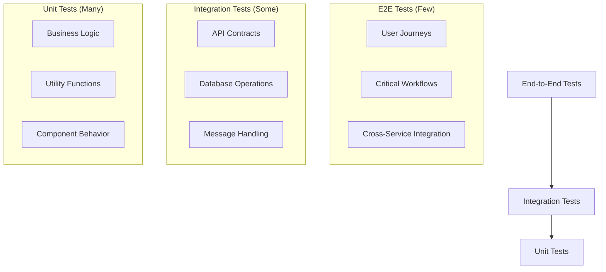

# Testing Overview

OpenFrame follows a comprehensive testing strategy with multiple layers of testing to ensure reliability, maintainability, and quality across the entire platform.

## Testing Philosophy

OpenFrame's testing approach is based on the **Test Pyramid** with emphasis on:

- **Fast Feedback**: Quick unit tests for rapid development cycles
- **Confidence**: Integration tests for service boundaries and data consistency
- **User Experience**: End-to-end tests for critical user journeys
- **Quality Gates**: Automated testing in CI/CD pipelines
- **Test-Driven Development**: Write tests before implementation when possible



## Testing Layers

### 1. Unit Tests

**Purpose**: Test individual components, classes, and functions in isolation.

**Scope**: 
- Business logic validation
- Utility function correctness
- Component behavior verification
- Edge case handling

**Technology Stack**:
- **Java**: JUnit 5, Mockito, AssertJ
- **Frontend**: Vitest, Vue Test Utils, Testing Library
- **Rust**: Built-in test framework

#### Java Unit Testing Example

```java
@ExtendWith(MockitoExtension.class)
class OrganizationServiceTest {
    
    @Mock
    private OrganizationRepository organizationRepository;
    
    @Mock
    private EventPublisher eventPublisher;
    
    @InjectMocks
    private OrganizationService organizationService;
    
    @Test
    @DisplayName("Should create organization with valid input")
    void shouldCreateOrganizationWithValidInput() {
        // Given
        CreateOrganizationInput input = CreateOrganizationInput.builder()
            .name("Test MSP")
            .domain("test.com")
            .build();
        
        Organization expectedOrg = Organization.builder()
            .name("Test MSP")
            .domain("test.com")
            .status(OrganizationStatus.ACTIVE)
            .build();
        
        when(organizationRepository.save(any(Organization.class)))
            .thenReturn(expectedOrg);
        
        // When
        Organization result = organizationService.create(input);
        
        // Then
        assertThat(result).isNotNull();
        assertThat(result.getName()).isEqualTo("Test MSP");
        assertThat(result.getDomain()).isEqualTo("test.com");
        assertThat(result.getStatus()).isEqualTo(OrganizationStatus.ACTIVE);
        
        verify(eventPublisher).publish(any(OrganizationCreatedEvent.class));
        verify(organizationRepository).save(any(Organization.class));
    }
    
    @Test
    @DisplayName("Should throw exception when organization not found")
    void shouldThrowExceptionWhenOrganizationNotFound() {
        // Given
        String nonExistentId = "non-existent-id";
        when(organizationRepository.findById(nonExistentId))
            .thenReturn(Optional.empty());
        
        // When & Then
        assertThatThrownBy(() -> organizationService.findById(nonExistentId))
            .isInstanceOf(OrganizationNotFoundException.class)
            .hasMessage("Organization not found with id: " + nonExistentId);
    }
}
```

#### Frontend Unit Testing Example

```typescript
// OrganizationService.test.ts
import { describe, it, expect, vi, beforeEach } from 'vitest'
import { createPinia, setActivePinia } from 'pinia'
import { useOrganizationStore } from '@/stores/organizationStore'
import { OrganizationService } from '@/services/OrganizationService'

// Mock the API client
vi.mock('@/lib/api-client', () => ({
  apiClient: {
    query: vi.fn(),
    mutate: vi.fn()
  }
}))

describe('OrganizationService', () => {
  beforeEach(() => {
    setActivePinia(createPinia())
  })

  it('should fetch organizations successfully', async () => {
    // Given
    const mockOrganizations = [
      { id: '1', name: 'Test MSP', domain: 'test.com' },
      { id: '2', name: 'Another MSP', domain: 'another.com' }
    ]
    
    const store = useOrganizationStore()
    vi.spyOn(store, 'fetchOrganizations').mockResolvedValue(mockOrganizations)

    // When
    const result = await store.fetchOrganizations()

    // Then
    expect(result).toEqual(mockOrganizations)
    expect(store.organizations).toEqual(mockOrganizations)
    expect(store.loading).toBe(false)
  })

  it('should handle fetch error gracefully', async () => {
    // Given
    const store = useOrganizationStore()
    const errorMessage = 'Failed to fetch organizations'
    vi.spyOn(store, 'fetchOrganizations').mockRejectedValue(new Error(errorMessage))

    // When & Then
    await expect(store.fetchOrganizations()).rejects.toThrow(errorMessage)
    expect(store.error).toBe(errorMessage)
    expect(store.loading).toBe(false)
  })
})
```

### 2. Integration Tests

**Purpose**: Test interactions between components, services, and external systems.

**Scope**:
- Database operations and transactions
- Message queue interactions
- Service-to-service communication
- External API integrations

**Technology Stack**:
- **Java**: Spring Boot Test, TestContainers, WireMock
- **Databases**: Embedded MongoDB, TestContainers
- **Message Queues**: Embedded Kafka, TestContainers

#### Database Integration Test

```java
@DataMongoTest
@TestMethodOrder(OrderAnnotation.class)
class OrganizationRepositoryIntegrationTest {
    
    @Autowired
    private TestEntityManager entityManager;
    
    @Autowired
    private OrganizationRepository organizationRepository;
    
    @Test
    @Order(1)
    @DisplayName("Should save organization to database")
    void shouldSaveOrganizationToDatabase() {
        // Given
        Organization organization = Organization.builder()
            .name("Integration Test MSP")
            .domain("integration.test")
            .tenantId("tenant-123")
            .status(OrganizationStatus.ACTIVE)
            .build();
        
        // When
        Organization saved = organizationRepository.save(organization);
        
        // Then
        assertThat(saved).isNotNull();
        assertThat(saved.getId()).isNotNull();
        assertThat(saved.getName()).isEqualTo("Integration Test MSP");
        
        // Verify in database
        Optional<Organization> found = organizationRepository.findById(saved.getId());
        assertThat(found).isPresent();
        assertThat(found.get().getName()).isEqualTo("Integration Test MSP");
    }
    
    @Test
    @Order(2)
    @DisplayName("Should find organizations by tenant")
    void shouldFindOrganizationsByTenant() {
        // Given
        String tenantId = "tenant-123";
        
        // When
        List<Organization> organizations = organizationRepository.findByTenantId(tenantId);
        
        // Then
        assertThat(organizations).isNotEmpty();
        assertThat(organizations).allMatch(org -> org.getTenantId().equals(tenantId));
    }
}
```

#### Message Queue Integration Test

```java
@SpringBootTest
@TestPropertySource(properties = {
    "spring.kafka.bootstrap-servers=${spring.embedded.kafka.brokers}",
    "spring.kafka.consumer.auto-offset-reset=earliest"
})
@EmbeddedKafka(partitions = 1, topics = {"test.organization.events"})
class OrganizationEventIntegrationTest {
    
    @Autowired
    private OrganizationEventPublisher eventPublisher;
    
    @Autowired
    private KafkaTemplate<String, Object> kafkaTemplate;
    
    @Test
    @DisplayName("Should publish organization created event")
    void shouldPublishOrganizationCreatedEvent() throws InterruptedException {
        // Given
        Organization organization = Organization.builder()
            .id("org-123")
            .name("Test Organization")
            .tenantId("tenant-123")
            .build();
        
        OrganizationCreatedEvent event = new OrganizationCreatedEvent(organization);
        CountDownLatch latch = new CountDownLatch(1);
        
        // Set up consumer to verify message
        @KafkaListener(topics = "test.organization.events")
        void handleEvent(OrganizationCreatedEvent receivedEvent) {
            assertThat(receivedEvent.getOrganization().getId()).isEqualTo("org-123");
            assertThat(receivedEvent.getOrganization().getName()).isEqualTo("Test Organization");
            latch.countDown();
        }
        
        // When
        eventPublisher.publish(event);
        
        // Then
        boolean messageReceived = latch.await(10, TimeUnit.SECONDS);
        assertThat(messageReceived).isTrue();
    }
}
```

### 3. API Contract Tests

**Purpose**: Ensure API contracts are maintained across service boundaries.

**Scope**:
- GraphQL schema validation
- REST API contract compliance
- Request/response validation
- Error handling verification

#### GraphQL Schema Testing

```java
@SpringBootTest(webEnvironment = SpringBootTest.WebEnvironment.RANDOM_PORT)
@ActiveProfiles("test")
class OrganizationGraphQLIntegrationTest {
    
    @Autowired
    private TestRestTemplate restTemplate;
    
    @LocalServerPort
    private int port;
    
    @Test
    @DisplayName("Should execute organizations query successfully")
    void shouldExecuteOrganizationsQuery() {
        // Given
        String query = """
            query {
                organizations {
                    edges {
                        node {
                            id
                            name
                            domain
                            status
                        }
                    }
                }
            }
        """;
        
        GraphQLRequest request = GraphQLRequest.builder()
            .query(query)
            .build();
        
        // When
        ResponseEntity<GraphQLResponse> response = restTemplate.postForEntity(
            "http://localhost:" + port + "/graphql",
            request,
            GraphQLResponse.class
        );
        
        // Then
        assertThat(response.getStatusCode()).isEqualTo(HttpStatus.OK);
        assertThat(response.getBody()).isNotNull();
        assertThat(response.getBody().getData()).containsKey("organizations");
        assertThat(response.getBody().getErrors()).isNullOrEmpty();
    }
    
    @Test
    @DisplayName("Should handle invalid query with proper error response")
    void shouldHandleInvalidQuery() {
        // Given
        String invalidQuery = """
            query {
                invalidField {
                    nonExistentProperty
                }
            }
        """;
        
        GraphQLRequest request = GraphQLRequest.builder()
            .query(invalidQuery)
            .build();
        
        // When
        ResponseEntity<GraphQLResponse> response = restTemplate.postForEntity(
            "http://localhost:" + port + "/graphql",
            request,
            GraphQLResponse.class
        );
        
        // Then
        assertThat(response.getStatusCode()).isEqualTo(HttpStatus.OK);
        assertThat(response.getBody()).isNotNull();
        assertThat(response.getBody().getErrors()).isNotEmpty();
        assertThat(response.getBody().getErrors().get(0).getMessage())
            .contains("Validation error");
    }
}
```

### 4. End-to-End Tests

**Purpose**: Test complete user workflows from UI to database.

**Scope**:
- Critical user journeys
- Cross-service functionality
- Real browser testing
- Performance validation

**Location**: `openframe-e2e-tests/` module

#### E2E Test Example

```java
@SpringBootTest(webEnvironment = SpringBootTest.WebEnvironment.DEFINED_PORT)
@TestMethodOrder(OrderAnnotation.class)
class UserJourneyE2ETest extends BaseE2ETest {
    
    @Test
    @Order(1)
    @DisplayName("User should be able to register and login")
    void userShouldBeAbleToRegisterAndLogin() {
        // Given
        UserRegistrationRequest registrationRequest = UserRegistrationRequest.builder()
            .email("test@example.com")
            .password("SecurePassword123!")
            .organizationName("Test MSP")
            .domain("test.local")
            .build();
        
        // When - Register user
        ResponseEntity<UserRegistrationResponse> registerResponse = 
            restTemplate.postForEntity("/api/auth/register", registrationRequest, UserRegistrationResponse.class);
        
        // Then - Registration successful
        assertThat(registerResponse.getStatusCode()).isEqualTo(HttpStatus.CREATED);
        assertThat(registerResponse.getBody().getUser().getEmail()).isEqualTo("test@example.com");
        
        // When - Login with registered credentials
        LoginRequest loginRequest = LoginRequest.builder()
            .email("test@example.com")
            .password("SecurePassword123!")
            .build();
        
        ResponseEntity<LoginResponse> loginResponse = 
            restTemplate.postForEntity("/api/auth/login", loginRequest, LoginResponse.class);
        
        // Then - Login successful
        assertThat(loginResponse.getStatusCode()).isEqualTo(HttpStatus.OK);
        assertThat(loginResponse.getBody().getAccessToken()).isNotNull();
    }
    
    @Test
    @Order(2)
    @DisplayName("User should be able to create and manage devices")
    void userShouldBeAbleToCreateAndManageDevices() {
        // Given - Authenticated user
        String accessToken = getAccessTokenForTestUser();
        HttpHeaders headers = createAuthHeaders(accessToken);
        
        // When - Create device
        CreateDeviceRequest deviceRequest = CreateDeviceRequest.builder()
            .hostname("test-device-01")
            .platform("linux")
            .organizationId(getTestOrganizationId())
            .build();
        
        HttpEntity<CreateDeviceRequest> request = new HttpEntity<>(deviceRequest, headers);
        ResponseEntity<DeviceResponse> response = restTemplate.postForEntity(
            "/api/devices", request, DeviceResponse.class);
        
        // Then - Device created successfully
        assertThat(response.getStatusCode()).isEqualTo(HttpStatus.CREATED);
        assertThat(response.getBody().getHostname()).isEqualTo("test-device-01");
        
        String deviceId = response.getBody().getId();
        
        // When - Retrieve device
        HttpEntity<?> getRequest = new HttpEntity<>(headers);
        ResponseEntity<DeviceResponse> getResponse = restTemplate.exchange(
            "/api/devices/" + deviceId, HttpMethod.GET, getRequest, DeviceResponse.class);
        
        // Then - Device retrieved successfully
        assertThat(getResponse.getStatusCode()).isEqualTo(HttpStatus.OK);
        assertThat(getResponse.getBody().getId()).isEqualTo(deviceId);
    }
}
```

## Testing Tools and Frameworks

### Java Testing Stack

#### Core Testing Libraries

```xml
<dependencies>
    <!-- JUnit 5 -->
    <dependency>
        <groupId>org.junit.jupiter</groupId>
        <artifactId>junit-jupiter</artifactId>
        <scope>test</scope>
    </dependency>
    
    <!-- Mockito -->
    <dependency>
        <groupId>org.mockito</groupId>
        <artifactId>mockito-core</artifactId>
        <scope>test</scope>
    </dependency>
    
    <!-- AssertJ -->
    <dependency>
        <groupId>org.assertj</groupId>
        <artifactId>assertj-core</artifactId>
        <scope>test</scope>
    </dependency>
    
    <!-- Spring Boot Test -->
    <dependency>
        <groupId>org.springframework.boot</groupId>
        <artifactId>spring-boot-starter-test</artifactId>
        <scope>test</scope>
    </dependency>
    
    <!-- TestContainers -->
    <dependency>
        <groupId>org.testcontainers</groupId>
        <artifactId>testcontainers</artifactId>
        <scope>test</scope>
    </dependency>
    
    <!-- WireMock -->
    <dependency>
        <groupId>com.github.tomakehurst</groupId>
        <artifactId>wiremock</artifactId>
        <scope>test</scope>
    </dependency>
</dependencies>
```

#### TestContainers Configuration

```java
@TestConfiguration
public class TestContainersConfig {
    
    @Bean
    @Primary
    public MongoTemplate mongoTemplate() {
        MongoDBContainer mongoContainer = new MongoDBContainer("mongo:7.0")
            .withExposedPorts(27017);
        mongoContainer.start();
        
        String connectionString = mongoContainer.getConnectionString();
        MongoClient mongoClient = MongoClients.create(connectionString);
        return new MongoTemplate(mongoClient, "openframe_test");
    }
    
    @Bean
    @Primary
    public KafkaTemplate<String, Object> kafkaTemplate() {
        KafkaContainer kafkaContainer = new KafkaContainer(DockerImageName.parse("confluentinc/cp-kafka:7.4.0"));
        kafkaContainer.start();
        
        Map<String, Object> props = new HashMap<>();
        props.put(ProducerConfig.BOOTSTRAP_SERVERS_CONFIG, kafkaContainer.getBootstrapServers());
        props.put(ProducerConfig.KEY_SERIALIZER_CLASS_CONFIG, StringSerializer.class);
        props.put(ProducerConfig.VALUE_SERIALIZER_CLASS_CONFIG, JsonSerializer.class);
        
        return new KafkaTemplate<>(new DefaultKafkaProducerFactory<>(props));
    }
}
```

### Frontend Testing Stack

#### Package Configuration

```json
{
  "devDependencies": {
    "@testing-library/vue": "^8.0.0",
    "@testing-library/jest-dom": "^6.0.0",
    "@vue/test-utils": "^2.4.0",
    "vitest": "^1.0.0",
    "jsdom": "^23.0.0",
    "msw": "^2.0.0"
  }
}
```

#### Vitest Configuration

```typescript
// vitest.config.ts
import { defineConfig } from 'vitest/config'
import vue from '@vitejs/plugin-vue'

export default defineConfig({
  plugins: [vue()],
  test: {
    globals: true,
    environment: 'jsdom',
    setupFiles: ['./src/test/setup.ts'],
    coverage: {
      provider: 'v8',
      reporter: ['text', 'json', 'html'],
      exclude: [
        'node_modules/',
        'src/test/',
        '**/*.d.ts',
        '**/*.test.{ts,tsx}',
        '**/*.spec.{ts,tsx}'
      ]
    }
  },
  resolve: {
    alias: {
      '@': path.resolve(__dirname, './src')
    }
  }
})
```

## Test Data Management

### Test Fixtures and Factories

```java
// OrganizationTestDataFactory.java
public class OrganizationTestDataFactory {
    
    public static Organization createValidOrganization() {
        return Organization.builder()
            .id(ObjectId.get().toString())
            .name("Test Organization")
            .domain("test.local")
            .tenantId("test-tenant")
            .status(OrganizationStatus.ACTIVE)
            .createdAt(Instant.now())
            .updatedAt(Instant.now())
            .build();
    }
    
    public static Organization createOrganizationWithName(String name) {
        return createValidOrganization().toBuilder()
            .name(name)
            .domain(name.toLowerCase().replaceAll("\\s+", "") + ".local")
            .build();
    }
    
    public static CreateOrganizationInput createValidInput() {
        return CreateOrganizationInput.builder()
            .name("Test Organization")
            .domain("test.local")
            .contactPerson(ContactPersonDto.builder()
                .name("John Doe")
                .email("john@test.local")
                .phone("+1234567890")
                .build())
            .address(AddressDto.builder()
                .street("123 Test St")
                .city("Test City")
                .state("TC")
                .postalCode("12345")
                .country("Test Country")
                .build())
            .build();
    }
}
```

### Database Seeding for Tests

```java
@Component
@Profile("test")
public class TestDataSeeder {
    
    @Autowired
    private OrganizationRepository organizationRepository;
    
    @Autowired
    private UserRepository userRepository;
    
    @EventListener
    public void handleApplicationReady(ApplicationReadyEvent event) {
        seedTestData();
    }
    
    private void seedTestData() {
        // Create test organizations
        Organization testOrg = OrganizationTestDataFactory.createValidOrganization();
        organizationRepository.save(testOrg);
        
        // Create test users
        AuthUser testUser = AuthUserTestDataFactory.createValidUser();
        testUser.setOrganizationIds(List.of(testOrg.getId()));
        userRepository.save(testUser);
        
        log.info("Test data seeded successfully");
    }
}
```

## Test Configuration and Profiles

### Application Test Configuration

```yaml
# application-test.yml
spring:
  profiles:
    active: test
  
  mongodb:
    embedded:
      version: 7.0.4
  
  kafka:
    bootstrap-servers: ${spring.embedded.kafka.brokers}
    consumer:
      auto-offset-reset: earliest
      group-id: test-group
    producer:
      retries: 0
  
  security:
    oauth2:
      resourceserver:
        jwt:
          issuer-uri: http://localhost:${wiremock.server.port}
  
  logging:
    level:
      com.openframe: DEBUG
      org.springframework.test: INFO
      org.testcontainers: INFO

# Test-specific configuration
openframe:
  security:
    jwt:
      secret: test-secret-key
  cache:
    enabled: false
  metrics:
    enabled: false
```

### Test-Specific Beans

```java
@TestConfiguration
public class TestSecurityConfig {
    
    @Bean
    @Primary
    @Profile("test")
    public JwtDecoder jwtDecoder() {
        // Mock JWT decoder for testing
        return new MockJwtDecoder();
    }
    
    @Bean
    @Primary
    @Profile("test")
    public SecurityContextService securityContextService() {
        return new MockSecurityContextService();
    }
}

@Component
@Profile("test")
public class MockSecurityContextService implements SecurityContextService {
    
    @Override
    public AuthContext getCurrentContext() {
        return AuthContext.builder()
            .userId("test-user-id")
            .tenantId("test-tenant-id")
            .roles(Set.of("ADMIN"))
            .organizations(Set.of("test-org-id"))
            .build();
    }
}
```

## Running Tests

### Maven Test Execution

```bash
# Run all tests
mvn test

# Run tests for specific module
mvn test -pl openframe-api

# Run specific test class
mvn test -Dtest=OrganizationServiceTest

# Run specific test method
mvn test -Dtest=OrganizationServiceTest#shouldCreateOrganizationWithValidInput

# Run tests with coverage
mvn test jacoco:report

# Run integration tests only
mvn test -Dgroups=integration

# Run tests with specific profile
mvn test -Dspring.profiles.active=test

# Skip tests
mvn install -DskipTests
```

### Frontend Test Execution

```bash
# Run all tests
npm test

# Run tests in watch mode
npm test -- --watch

# Run tests with coverage
npm run test:coverage

# Run specific test file
npm test -- OrganizationService.test.ts

# Run tests matching pattern
npm test -- --grep="should create"

# Run tests in CI mode
npm run test:ci
```

### E2E Test Execution

```bash
# Start services first
./scripts/run-mac.sh

# Run E2E tests
cd openframe-e2e-tests
mvn test

# Run smoke tests only
mvn test -Dtest=SmokeTest

# Run with custom environment
mvn test -Denvironment=staging

# Generate test report
mvn surefire-report:report
```

## Continuous Integration

### GitHub Actions Configuration

```yaml
# .github/workflows/test.yml
name: Test Suite

on:
  push:
    branches: [ main, develop ]
  pull_request:
    branches: [ main ]

jobs:
  unit-tests:
    runs-on: ubuntu-latest
    
    services:
      mongodb:
        image: mongo:7.0
        ports:
          - 27017:27017
        env:
          MONGO_INITDB_ROOT_USERNAME: admin
          MONGO_INITDB_ROOT_PASSWORD: password
      
      redis:
        image: redis:7.0-alpine
        ports:
          - 6379:6379
    
    steps:
      - uses: actions/checkout@v4
      
      - name: Set up JDK 21
        uses: actions/setup-java@v3
        with:
          java-version: '21'
          distribution: 'temurin'
      
      - name: Cache Maven dependencies
        uses: actions/cache@v3
        with:
          path: ~/.m2
          key: ${{ runner.os }}-m2-${{ hashFiles('**/pom.xml') }}
      
      - name: Run unit tests
        run: mvn test
      
      - name: Generate test report
        run: mvn jacoco:report
      
      - name: Upload coverage to Codecov
        uses: codecov/codecov-action@v3

  frontend-tests:
    runs-on: ubuntu-latest
    
    steps:
      - uses: actions/checkout@v4
      
      - name: Set up Node.js
        uses: actions/setup-node@v3
        with:
          node-version: '18'
          cache: 'npm'
          cache-dependency-path: openframe/services/openframe-frontend/package-lock.json
      
      - name: Install dependencies
        run: |
          cd openframe/services/openframe-frontend
          npm ci
      
      - name: Run frontend tests
        run: |
          cd openframe/services/openframe-frontend
          npm run test:ci
      
      - name: Upload coverage
        uses: codecov/codecov-action@v3

  e2e-tests:
    runs-on: ubuntu-latest
    needs: [unit-tests, frontend-tests]
    
    steps:
      - uses: actions/checkout@v4
      
      - name: Set up JDK 21
        uses: actions/setup-java@v3
        with:
          java-version: '21'
          distribution: 'temurin'
      
      - name: Start infrastructure
        run: docker-compose -f integrated-tools/docker-compose.yml up -d
      
      - name: Build and start services
        run: |
          mvn clean install -DskipTests
          ./scripts/run-linux.sh --silent &
          sleep 60
      
      - name: Run E2E tests
        run: |
          cd openframe-e2e-tests
          mvn test -Dtest=SmokeTest
      
      - name: Upload test results
        uses: actions/upload-artifact@v3
        if: always()
        with:
          name: e2e-test-results
          path: openframe-e2e-tests/target/surefire-reports/
```

## Best Practices

### Test Organization

1. **Use descriptive test names**: Clearly state what is being tested
2. **Follow AAA pattern**: Arrange, Act, Assert
3. **One assertion per concept**: Keep tests focused
4. **Use test fixtures**: Create reusable test data
5. **Mock external dependencies**: Isolate units under test

### Performance Testing

```java
@Test
@DisplayName("Should handle concurrent organization creation")
void shouldHandleConcurrentOrganizationCreation() throws InterruptedException {
    // Given
    int numberOfThreads = 10;
    int operationsPerThread = 100;
    ExecutorService executorService = Executors.newFixedThreadPool(numberOfThreads);
    CountDownLatch latch = new CountDownLatch(numberOfThreads * operationsPerThread);
    List<CompletableFuture<Organization>> futures = new ArrayList<>();
    
    // When
    for (int i = 0; i < numberOfThreads; i++) {
        final int threadIndex = i;
        CompletableFuture<Organization> future = CompletableFuture.supplyAsync(() -> {
            for (int j = 0; j < operationsPerThread; j++) {
                CreateOrganizationInput input = CreateOrganizationInput.builder()
                    .name("Test Org " + threadIndex + "-" + j)
                    .domain("test" + threadIndex + j + ".com")
                    .build();
                
                Organization org = organizationService.create(input);
                latch.countDown();
                return org;
            }
            return null;
        }, executorService);
        
        futures.add(future);
    }
    
    // Then
    boolean completed = latch.await(30, TimeUnit.SECONDS);
    assertThat(completed).isTrue();
    
    // Verify all operations completed successfully
    CompletableFuture<Void> allFutures = CompletableFuture.allOf(
        futures.toArray(new CompletableFuture[0]));
    
    assertThatCode(() -> allFutures.get(5, TimeUnit.SECONDS))
        .doesNotThrowAnyException();
}
```

### Test Coverage Goals

| Component | Target Coverage | Rationale |
|-----------|----------------|-----------|
| **Business Logic** | 95%+ | Critical functionality |
| **Controllers** | 80%+ | API contract validation |
| **Repositories** | 70%+ | Data access verification |
| **Utilities** | 90%+ | Reusable components |
| **Configuration** | 60%+ | Setup validation |

## Next Steps

Now that you understand OpenFrame's testing strategy:

1. **Review the [Contributing Guidelines](../contributing/guidelines.md)** to understand the development workflow
2. **Set up your testing environment** using the provided examples
3. **Write tests for new features** following the established patterns
4. **Run the full test suite** to ensure everything works correctly

---

**Testing overview complete!** You now have a comprehensive understanding of how to test OpenFrame components at all levels.