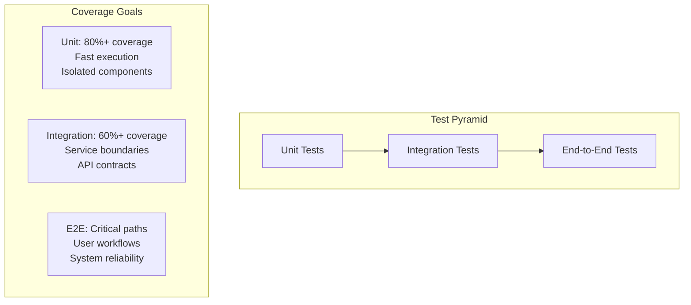

# Testing Overview

OpenFrame follows a comprehensive testing strategy to ensure reliability, performance, and maintainability. This guide covers our testing philosophy, frameworks, and best practices for writing effective tests.

## Testing Philosophy

### Test Pyramid Strategy



### Quality Gates

Every code change must pass:
- ✅ **Unit Tests**: 80%+ code coverage
- ✅ **Integration Tests**: API contracts verified
- ✅ **Code Quality**: SonarLint checks pass
- ✅ **Security Scan**: No critical vulnerabilities
- ✅ **Performance**: No regression in key metrics

## Testing Frameworks and Tools

### Backend Testing (Java/Spring Boot)

| Framework | Purpose | Usage |
|-----------|---------|-------|
| **JUnit 5** | Unit testing framework | Core test runner |
| **Mockito** | Mocking framework | Isolate dependencies |
| **Spring Boot Test** | Integration testing | Service layer tests |
| **TestContainers** | Database integration | Real database testing |
| **WireMock** | HTTP service mocking | External API testing |
| **AssertJ** | Fluent assertions | Readable test assertions |

### Frontend Testing (Vue.js/TypeScript)

| Framework | Purpose | Usage |
|-----------|---------|-------|
| **Vitest** | Unit test runner | Component testing |
| **Vue Test Utils** | Vue component testing | Component isolation |
| **Playwright** | E2E testing | Full browser automation |
| **MSW** | API mocking | HTTP request mocking |
| **Testing Library** | User-centric testing | Accessibility testing |

### API Testing

| Tool | Purpose | Usage |
|------|---------|-------|
| **REST Assured** | REST API testing | Java-based API tests |
| **GraphQL Inspector** | GraphQL schema testing | Schema validation |
| **Newman** | Postman collection runner | CI/CD API testing |
| **K6** | Load testing | Performance testing |

## Unit Testing

### Java Unit Tests

#### Basic Test Structure

```java
@ExtendWith(MockitoExtension.class)
class DeviceServiceTest {
    
    @Mock
    private DeviceRepository deviceRepository;
    
    @Mock
    private EventPublisher eventPublisher;
    
    @InjectMocks
    private DeviceService deviceService;
    
    @Test
    @DisplayName("Should register device successfully")
    void shouldRegisterDeviceSuccessfully() {
        // Given
        String organizationId = "test-org";
        DeviceRegistrationRequest request = DeviceRegistrationRequest.builder()
            .deviceName("test-device")
            .agentVersion("1.0.0")
            .build();
        
        Device savedDevice = Device.builder()
            .id("device-123")
            .name("test-device")
            .organizationId(organizationId)
            .status(DeviceStatus.REGISTERED)
            .build();
            
        when(deviceRepository.save(any(Device.class))).thenReturn(savedDevice);
        
        // When
        DeviceRegistrationResponse response = deviceService.registerDevice(organizationId, request);
        
        // Then
        assertThat(response.getDeviceId()).isEqualTo("device-123");
        assertThat(response.getStatus()).isEqualTo(DeviceStatus.REGISTERED);
        
        verify(deviceRepository).save(argThat(device -> 
            device.getName().equals("test-device") &&
            device.getOrganizationId().equals(organizationId)
        ));
        
        verify(eventPublisher).publishEvent(any(DeviceRegisteredEvent.class));
    }
}
```

#### Testing Spring Components

```java
@SpringBootTest(webEnvironment = SpringBootTest.WebEnvironment.NONE)
@TestPropertySource(locations = "classpath:application-test.properties")
class OrganizationServiceIntegrationTest {
    
    @Autowired
    private OrganizationService organizationService;
    
    @MockBean
    private EmailService emailService;
    
    @Test
    @Transactional
    @Rollback
    void shouldCreateOrganizationWithNotification() {
        // Given
        CreateOrganizationRequest request = CreateOrganizationRequest.builder()
            .name("Test MSP")
            .contactEmail("admin@testmsp.com")
            .build();
        
        // When
        Organization organization = organizationService.createOrganization(request);
        
        // Then
        assertThat(organization.getId()).isNotNull();
        assertThat(organization.getName()).isEqualTo("Test MSP");
        
        verify(emailService).sendWelcomeEmail(eq("admin@testmsp.com"), any());
    }
}
```

### Vue.js Unit Tests

#### Component Testing

```typescript
import { mount } from '@vue/test-utils'
import { describe, it, expect, vi } from 'vitest'
import DeviceCard from '@/components/devices/DeviceCard.vue'
import { Device, DeviceStatus } from '@/types/device'

describe('DeviceCard.vue', () => {
  const mockDevice: Device = {
    id: 'device-123',
    name: 'Test Device',
    status: DeviceStatus.ONLINE,
    lastSeen: new Date('2024-01-01T10:00:00Z'),
    organization: {
      id: 'org-1',
      name: 'Test Org'
    }
  }

  it('should render device information correctly', () => {
    const wrapper = mount(DeviceCard, {
      props: { device: mockDevice }
    })

    expect(wrapper.find('[data-testid="device-name"]').text()).toBe('Test Device')
    expect(wrapper.find('[data-testid="device-status"]').classes()).toContain('status-online')
    expect(wrapper.find('[data-testid="last-seen"]').text()).toContain('Jan 1, 2024')
  })

  it('should emit action event when button clicked', async () => {
    const wrapper = mount(DeviceCard, {
      props: { device: mockDevice }
    })

    await wrapper.find('[data-testid="restart-button"]').trigger('click')

    expect(wrapper.emitted()).toHaveProperty('device-action')
    expect(wrapper.emitted('device-action')?.[0]).toEqual([
      { action: 'restart', deviceId: 'device-123' }
    ])
  })
})
```

#### Composables Testing

```typescript
import { describe, it, expect, vi } from 'vitest'
import { useDevices } from '@/composables/useDevices'
import { ref } from 'vue'

// Mock API client
vi.mock('@/lib/api-client', () => ({
  apiClient: {
    getDevices: vi.fn()
  }
}))

describe('useDevices', () => {
  it('should fetch devices on mount', async () => {
    const mockDevices = [mockDevice]
    const mockApiClient = await import('@/lib/api-client')
    vi.mocked(mockApiClient.apiClient.getDevices).mockResolvedValue({
      data: mockDevices,
      total: 1
    })

    const { devices, loading, fetchDevices } = useDevices()

    await fetchDevices()

    expect(loading.value).toBe(false)
    expect(devices.value).toEqual(mockDevices)
    expect(mockApiClient.apiClient.getDevices).toHaveBeenCalledTimes(1)
  })
})
```

## Integration Testing

### Spring Boot Integration Tests

#### Repository Layer Testing

```java
@DataMongoTest
@TestPropertySource(properties = {
    "spring.data.mongodb.host=localhost",
    "spring.data.mongodb.port=27017",
    "spring.data.mongodb.database=openframe_test"
})
class DeviceRepositoryTest {
    
    @Autowired
    private TestEntityManager entityManager;
    
    @Autowired
    private DeviceRepository deviceRepository;
    
    @Test
    void shouldFindDevicesByOrganization() {
        // Given
        String organizationId = "org-123";
        Device device1 = createTestDevice("device-1", organizationId);
        Device device2 = createTestDevice("device-2", organizationId);
        Device device3 = createTestDevice("device-3", "other-org");
        
        entityManager.persist(device1);
        entityManager.persist(device2);
        entityManager.persist(device3);
        entityManager.flush();
        
        // When
        List<Device> devices = deviceRepository.findByOrganizationId(organizationId);
        
        // Then
        assertThat(devices).hasSize(2);
        assertThat(devices).extracting(Device::getId)
            .containsExactlyInAnyOrder("device-1", "device-2");
    }
}
```

#### Web Layer Testing

```java
@SpringBootTest(webEnvironment = SpringBootTest.WebEnvironment.RANDOM_PORT)
@AutoConfigureTestDatabase(replace = AutoConfigureTestDatabase.Replace.NONE)
@Testcontainers
class DeviceControllerIntegrationTest {
    
    @Container
    static MongoDBContainer mongoContainer = new MongoDBContainer("mongo:7.0")
            .withExposedPorts(27017);
    
    @Autowired
    private TestRestTemplate restTemplate;
    
    @Autowired
    private DeviceRepository deviceRepository;
    
    @Test
    void shouldCreateDeviceSuccessfully() {
        // Given
        CreateDeviceRequest request = CreateDeviceRequest.builder()
            .name("Test Device")
            .type("WORKSTATION")
            .build();
        
        // When
        ResponseEntity<DeviceResponse> response = restTemplate
            .withBasicAuth("admin", "password")
            .postForEntity("/api/devices", request, DeviceResponse.class);
        
        // Then
        assertThat(response.getStatusCode()).isEqualTo(HttpStatus.CREATED);
        assertThat(response.getBody().getName()).isEqualTo("Test Device");
        
        // Verify persistence
        Optional<Device> savedDevice = deviceRepository.findByName("Test Device");
        assertThat(savedDevice).isPresent();
    }
}
```

### GraphQL Integration Tests

```java
@GraphQlTest(DeviceDataFetcher.class)
class DeviceGraphQLTest {
    
    @Autowired
    private GraphQlTester graphQlTester;
    
    @MockBean
    private DeviceService deviceService;
    
    @Test
    void shouldFetchDevicesWithPagination() {
        // Given
        DeviceConnection mockConnection = DeviceConnection.builder()
            .edges(List.of(
                DeviceEdge.builder()
                    .node(mockDevice)
                    .cursor("cursor-1")
                    .build()
            ))
            .pageInfo(PageInfo.builder()
                .hasNextPage(false)
                .hasPreviousPage(false)
                .startCursor("cursor-1")
                .endCursor("cursor-1")
                .build())
            .build();
            
        when(deviceService.getDevices(any(), any())).thenReturn(mockConnection);
        
        // When & Then
        graphQlTester
            .documentName("devices-query")
            .variable("first", 10)
            .execute()
            .path("devices.edges")
            .entityList(DeviceEdge.class)
            .hasSize(1)
            .path("devices.pageInfo.hasNextPage")
            .entity(Boolean.class)
            .isEqualTo(false);
    }
}
```

## End-to-End Testing

### Playwright Tests

```typescript
import { test, expect } from '@playwright/test'
import { login } from './helpers/auth'

test.describe('Device Management', () => {
  test.beforeEach(async ({ page }) => {
    await login(page, 'admin@testmsp.com', 'password123')
  })

  test('should register new device', async ({ page }) => {
    await page.goto('/devices')
    
    // Click "Add Device" button
    await page.click('[data-testid="add-device-button"]')
    
    // Fill device registration form
    await page.fill('[data-testid="device-name-input"]', 'Test Workstation')
    await page.selectOption('[data-testid="device-type-select"]', 'WORKSTATION')
    await page.fill('[data-testid="device-description"]', 'Test device for QA')
    
    // Submit form
    await page.click('[data-testid="submit-device-button"]')
    
    // Verify success message
    await expect(page.locator('[data-testid="success-message"]')).toBeVisible()
    await expect(page.locator('[data-testid="success-message"]')).toContainText('Device registered successfully')
    
    // Verify device appears in list
    await expect(page.locator('[data-testid="device-list"]')).toContainText('Test Workstation')
  })

  test('should show device details', async ({ page }) => {
    await page.goto('/devices')
    
    // Click on first device
    await page.click('[data-testid="device-row"]:first-child')
    
    // Verify device details page
    await expect(page).toHaveURL(/\/devices\/[a-f0-9-]+/)
    await expect(page.locator('h1')).toContainText('Device Details')
    
    // Check tabs are present
    await expect(page.locator('[data-testid="overview-tab"]')).toBeVisible()
    await expect(page.locator('[data-testid="hardware-tab"]')).toBeVisible()
    await expect(page.locator('[data-testid="logs-tab"]')).toBeVisible()
  })
})
```

### API Integration Tests

```java
@ExtendWith(RestAssuredExtension.class)
@TestMethodOrder(OrderAnnotation.class)
class DeviceApiIntegrationTest {
    
    private static String authToken;
    private static String deviceId;
    
    @BeforeAll
    static void authenticate() {
        authToken = given()
            .contentType("application/json")
            .body("""
                {
                    "username": "admin@testmsp.com",
                    "password": "password123"
                }
                """)
        .when()
            .post("/auth/login")
        .then()
            .statusCode(200)
            .extract()
            .path("access_token");
    }
    
    @Test
    @Order(1)
    void shouldCreateDevice() {
        deviceId = given()
            .contentType("application/json")
            .header("Authorization", "Bearer " + authToken)
            .body("""
                {
                    "name": "API Test Device",
                    "type": "SERVER",
                    "organizationId": "test-org-123"
                }
                """)
        .when()
            .post("/api/devices")
        .then()
            .statusCode(201)
            .body("name", equalTo("API Test Device"))
            .body("status", equalTo("REGISTERED"))
            .extract()
            .path("id");
            
        assertThat(deviceId).isNotNull();
    }
    
    @Test
    @Order(2)
    void shouldUpdateDeviceStatus() {
        given()
            .contentType("application/json")
            .header("Authorization", "Bearer " + authToken)
            .body("""
                {
                    "status": "ONLINE",
                    "lastSeen": "2024-01-01T10:00:00Z"
                }
                """)
        .when()
            .patch("/api/devices/" + deviceId + "/status")
        .then()
            .statusCode(200)
            .body("status", equalTo("ONLINE"));
    }
}
```

## Test Data Management

### Test Data Builders

```java
public class DeviceTestDataBuilder {
    
    private String id = UUID.randomUUID().toString();
    private String name = "Test Device";
    private String organizationId = "test-org";
    private DeviceStatus status = DeviceStatus.REGISTERED;
    private DeviceType type = DeviceType.WORKSTATION;
    
    public static DeviceTestDataBuilder aDevice() {
        return new DeviceTestDataBuilder();
    }
    
    public DeviceTestDataBuilder withId(String id) {
        this.id = id;
        return this;
    }
    
    public DeviceTestDataBuilder withName(String name) {
        this.name = name;
        return this;
    }
    
    public DeviceTestDataBuilder withStatus(DeviceStatus status) {
        this.status = status;
        return this;
    }
    
    public Device build() {
        return Device.builder()
            .id(id)
            .name(name)
            .organizationId(organizationId)
            .status(status)
            .type(type)
            .createdAt(Instant.now())
            .updatedAt(Instant.now())
            .build();
    }
}

// Usage in tests
@Test
void shouldProcessOnlineDevices() {
    Device device = aDevice()
        .withName("Online Server")
        .withStatus(DeviceStatus.ONLINE)
        .build();
        
    // Test logic here
}
```

### Database Test Setup

```java
@TestConfiguration
public class TestDataConfig {
    
    @Bean
    @Primary
    public MongoTemplate testMongoTemplate() {
        return new MongoTemplate(mongoClient(), "openframe_test");
    }
    
    @EventListener
    public void handleContextRefresh(ContextRefreshedEvent event) {
        // Clear test data before each test suite
        mongoTemplate.getDb().drop();
        
        // Load essential test data
        loadTestOrganizations();
        loadTestUsers();
    }
    
    private void loadTestOrganizations() {
        Organization testOrg = Organization.builder()
            .id("test-org-123")
            .name("Test MSP Organization")
            .slug("test-msp")
            .build();
            
        mongoTemplate.save(testOrg);
    }
}
```

## Performance Testing

### Load Testing with K6

```javascript
// k6-load-test.js
import http from 'k6/http';
import { check, sleep } from 'k6';
import { Rate } from 'k6/metrics';

export let errorRate = new Rate('errors');

export let options = {
  stages: [
    { duration: '2m', target: 100 }, // Ramp up
    { duration: '5m', target: 100 }, // Stay at 100 users
    { duration: '2m', target: 200 }, // Ramp up to 200
    { duration: '5m', target: 200 }, // Stay at 200
    { duration: '2m', target: 0 },   // Ramp down
  ],
  thresholds: {
    http_req_duration: ['p(95)<500'], // 95% of requests under 500ms
    errors: ['rate<0.1'],             // Error rate under 10%
  },
};

const BASE_URL = 'http://localhost:8080';
let authToken;

export function setup() {
  // Authenticate and get token
  let loginRes = http.post(`${BASE_URL}/auth/login`, {
    username: 'loadtest@example.com',
    password: 'password123'
  });
  
  return { token: loginRes.json('access_token') };
}

export default function(data) {
  let params = {
    headers: {
      'Authorization': `Bearer ${data.token}`,
      'Content-Type': 'application/json',
    },
  };
  
  // Test device listing endpoint
  let response = http.get(`${BASE_URL}/api/devices`, params);
  
  check(response, {
    'status is 200': (r) => r.status === 200,
    'response time < 500ms': (r) => r.timings.duration < 500,
  }) || errorRate.add(1);
  
  sleep(1);
}
```

### Memory and Performance Testing

```java
@Test
@EnabledIf("#{systemProperties['test.profile'] == 'performance'}")
void shouldHandleHighVolumeDeviceRegistration() {
    // Performance test setup
    int deviceCount = 10000;
    List<CompletableFuture<Void>> futures = new ArrayList<>();
    
    StopWatch stopWatch = new StopWatch();
    stopWatch.start();
    
    for (int i = 0; i < deviceCount; i++) {
        CompletableFuture<Void> future = CompletableFuture.runAsync(() -> {
            DeviceRegistrationRequest request = DeviceRegistrationRequest.builder()
                .deviceName("load-test-device-" + UUID.randomUUID())
                .build();
                
            deviceService.registerDevice("test-org", request);
        });
        
        futures.add(future);
    }
    
    // Wait for all registrations to complete
    CompletableFuture.allOf(futures.toArray(new CompletableFuture[0])).join();
    
    stopWatch.stop();
    
    // Assert performance criteria
    assertThat(stopWatch.getTotalTimeMillis()).isLessThan(30000); // Under 30 seconds
    
    // Verify memory usage
    long memoryUsed = Runtime.getRuntime().totalMemory() - Runtime.getRuntime().freeMemory();
    assertThat(memoryUsed).isLessThan(512 * 1024 * 1024); // Under 512MB
}
```

## Running Tests

### Maven Commands

```bash
# Run all tests
mvn test

# Run specific test class
mvn test -Dtest=DeviceServiceTest

# Run tests with coverage
mvn test jacoco:report

# Run integration tests only
mvn test -Dtest="*IntegrationTest"

# Run tests in parallel
mvn test -T 4

# Skip tests
mvn install -DskipTests
```

### Frontend Test Commands

```bash
# Run unit tests
npm run test

# Run tests in watch mode
npm run test:watch

# Run tests with coverage
npm run test:coverage

# Run E2E tests
npm run test:e2e

# Run specific test file
npm run test -- DeviceCard.spec.ts
```

### CI/CD Test Pipeline

```yaml
# .github/workflows/test.yml
name: Test Suite

on: [push, pull_request]

jobs:
  unit-tests:
    runs-on: ubuntu-latest
    steps:
      - uses: actions/checkout@v3
      - uses: actions/setup-java@v3
        with:
          java-version: '21'
      - name: Run unit tests
        run: mvn test
      - name: Upload coverage
        uses: codecov/codecov-action@v3

  integration-tests:
    runs-on: ubuntu-latest
    services:
      mongodb:
        image: mongo:7.0
        ports:
          - 27017:27017
      redis:
        image: redis:7
        ports:
          - 6379:6379
    steps:
      - uses: actions/checkout@v3
      - name: Run integration tests
        run: mvn test -Dtest="*IntegrationTest"

  e2e-tests:
    runs-on: ubuntu-latest
    steps:
      - uses: actions/checkout@v3
      - uses: actions/setup-node@v3
        with:
          node-version: '18'
      - name: Install dependencies
        run: npm ci
      - name: Run E2E tests
        run: npm run test:e2e
```

## Best Practices

### Test Organization

1. **Follow AAA Pattern**: Arrange, Act, Assert
2. **One Assertion Per Test**: Focus on single behavior
3. **Descriptive Test Names**: Use should/when/given naming
4. **Test Data Isolation**: Each test should be independent
5. **Cleanup Resources**: Properly dispose of test resources

### Test Coverage Goals

| Test Type | Coverage Target | Focus |
|-----------|----------------|-------|
| **Unit Tests** | 80%+ | Business logic, edge cases |
| **Integration Tests** | 60%+ | Service boundaries, APIs |
| **E2E Tests** | Critical paths | User workflows |

### Common Testing Patterns

1. **Mocking External Dependencies**: Use WireMock for HTTP services
2. **Test Slices**: Use `@WebMvcTest`, `@DataJpaTest` for focused testing  
3. **Test Profiles**: Separate configurations for different test types
4. **Parallel Execution**: Run tests in parallel for faster feedback
5. **Flaky Test Detection**: Monitor and fix unstable tests

---

This comprehensive testing strategy ensures OpenFrame maintains high quality and reliability as it scales and evolves.