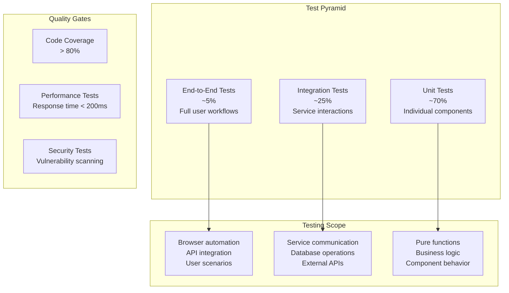

# Testing Overview

OpenFrame employs comprehensive testing strategies across all layers of the application stack. This guide covers testing approaches, frameworks, and best practices for ensuring code quality and system reliability.

## Testing Strategy

### Test Pyramid Architecture

OpenFrame follows the test pyramid model with appropriate distribution of test types:



### Testing Across Services

Each OpenFrame service has tailored testing strategies:

| Service | Primary Test Types | Test Framework | Coverage Target |
|---------|-------------------|----------------|-----------------|
| **API Service** | Unit, Integration, GraphQL | JUnit 5, TestContainers | 85% |
| **Gateway** | Integration, Security | JUnit 5, WebFlux Test | 80% |
| **Auth Server** | Unit, Security, OAuth flows | JUnit 5, Spring Security Test | 90% |
| **Frontend** | Unit, Component, E2E | Vitest, Vue Test Utils | 75% |
| **Client Agent** | Unit, Integration | Cargo Test, Mock frameworks | 80% |
| **Stream Processing** | Unit, Stream topology | JUnit 5, Kafka Test Utils | 85% |

## Backend Testing (Java Services)

### Unit Testing Framework

**JUnit 5 with Mockito and AssertJ**:

```java
@ExtendWith(MockitoExtension.class)
class OrganizationServiceTest {
    
    @Mock
    private OrganizationRepository organizationRepository;
    
    @Mock
    private UserService userService;
    
    @InjectMocks
    private OrganizationService organizationService;
    
    @Test
    @DisplayName("Should create organization successfully")
    void shouldCreateOrganization() {
        // Given
        CreateOrganizationRequest request = CreateOrganizationRequest.builder()
            .name("Test Organization")
            .domain("test.com")
            .contactEmail("admin@test.com")
            .build();
            
        Organization savedOrganization = Organization.builder()
            .id("org-123")
            .name("Test Organization")
            .domain("test.com")
            .build();
            
        when(organizationRepository.save(any(Organization.class)))
            .thenReturn(savedOrganization);
            
        // When
        Organization result = organizationService.create(request);
        
        // Then
        assertThat(result)
            .isNotNull()
            .satisfies(org -> {
                assertThat(org.getName()).isEqualTo("Test Organization");
                assertThat(org.getDomain()).isEqualTo("test.com");
                assertThat(org.getId()).isEqualTo("org-123");
            });
            
        verify(organizationRepository).save(any(Organization.class));
        verify(userService).createOrganizationAdmin(eq("org-123"), any());
    }
    
    @Test
    @DisplayName("Should throw exception for duplicate domain")
    void shouldThrowExceptionForDuplicateDomain() {
        // Given
        CreateOrganizationRequest request = CreateOrganizationRequest.builder()
            .name("Test Organization")
            .domain("existing.com")
            .contactEmail("admin@test.com")
            .build();
            
        when(organizationRepository.existsByDomain("existing.com"))
            .thenReturn(true);
            
        // When & Then
        assertThatThrownBy(() -> organizationService.create(request))
            .isInstanceOf(DuplicateDomainException.class)
            .hasMessage("Domain 'existing.com' is already registered");
            
        verify(organizationRepository).existsByDomain("existing.com");
        verify(organizationRepository, never()).save(any());
    }
}
```

### Integration Testing

**Spring Boot Test with TestContainers**:

```java
@SpringBootTest(webEnvironment = SpringBootTest.WebEnvironment.RANDOM_PORT)
@Testcontainers
class OrganizationIntegrationTest {
    
    @Container
    static MongoDBContainer mongodb = new MongoDBContainer("mongo:7.0")
            .withExposedPorts(27017);
            
    @Container
    static KafkaContainer kafka = new KafkaContainer(DockerImageName.parse("confluentinc/cp-kafka:7.4.0"));
    
    @Autowired
    private TestRestTemplate restTemplate;
    
    @Autowired
    private OrganizationRepository organizationRepository;
    
    @DynamicPropertySource
    static void configureProperties(DynamicPropertyRegistry registry) {
        registry.add("spring.data.mongodb.uri", mongodb::getReplicaSetUrl);
        registry.add("spring.kafka.bootstrap-servers", kafka::getBootstrapServers);
    }
    
    @Test
    void shouldCreateOrganizationEndToEnd() {
        // Given
        CreateOrganizationRequest request = new CreateOrganizationRequest(
            "Integration Test Org",
            "integration.test",
            "admin@integration.test"
        );
        
        // When
        ResponseEntity<OrganizationResponse> response = restTemplate.postForEntity(
            "/api/organizations",
            request,
            OrganizationResponse.class
        );
        
        // Then
        assertThat(response.getStatusCode()).isEqualTo(HttpStatus.CREATED);
        assertThat(response.getBody())
            .satisfies(org -> {
                assertThat(org.getName()).isEqualTo("Integration Test Org");
                assertThat(org.getDomain()).isEqualTo("integration.test");
            });
            
        // Verify data persistence
        List<Organization> savedOrgs = organizationRepository.findAll();
        assertThat(savedOrgs)
            .hasSize(1)
            .first()
            .satisfies(org -> {
                assertThat(org.getName()).isEqualTo("Integration Test Org");
                assertThat(org.getDomain()).isEqualTo("integration.test");
            });
    }
    
    @Test
    void shouldHandleConcurrentOrganizationCreation() throws InterruptedException {
        // Given
        int numberOfThreads = 10;
        ExecutorService executorService = Executors.newFixedThreadPool(numberOfThreads);
        CountDownLatch latch = new CountDownLatch(numberOfThreads);
        List<CompletableFuture<ResponseEntity<OrganizationResponse>>> futures = new ArrayList<>();
        
        // When - Create organizations concurrently
        for (int i = 0; i < numberOfThreads; i++) {
            final int threadId = i;
            CompletableFuture<ResponseEntity<OrganizationResponse>> future = 
                CompletableFuture.supplyAsync(() -> {
                    try {
                        CreateOrganizationRequest request = new CreateOrganizationRequest(
                            "Org " + threadId,
                            "org" + threadId + ".test",
                            "admin" + threadId + "@test.com"
                        );
                        
                        return restTemplate.postForEntity(
                            "/api/organizations",
                            request,
                            OrganizationResponse.class
                        );
                    } finally {
                        latch.countDown();
                    }
                }, executorService);
            
            futures.add(future);
        }
        
        latch.await(30, TimeUnit.SECONDS);
        
        // Then - All should succeed
        List<ResponseEntity<OrganizationResponse>> results = futures.stream()
            .map(CompletableFuture::join)
            .collect(Collectors.toList());
            
        assertThat(results)
            .hasSize(numberOfThreads)
            .allMatch(response -> response.getStatusCode() == HttpStatus.CREATED);
            
        // Verify all organizations were created
        List<Organization> allOrgs = organizationRepository.findAll();
        assertThat(allOrgs).hasSize(numberOfThreads);
        
        executorService.shutdown();
    }
}
```

### GraphQL Testing

**GraphQL Query Testing with DGS Test Framework**:

```java
@SpringBootTest
@DgsTest
class DeviceDataFetcherTest {
    
    @Autowired
    private DgsQueryExecutor queryExecutor;
    
    @MockBean
    private DeviceService deviceService;
    
    @Test
    void shouldFetchDevicesForOrganization() {
        // Given
        List<Device> mockDevices = Arrays.asList(
            Device.builder()
                .id("device-1")
                .name("Test Device 1")
                .status(DeviceStatus.ONLINE)
                .build(),
            Device.builder()
                .id("device-2")
                .name("Test Device 2")
                .status(DeviceStatus.OFFLINE)
                .build()
        );
        
        when(deviceService.findByOrganization("org-123", any()))
            .thenReturn(mockDevices);
            
        // When
        String query = """
            query GetDevices($orgId: ID!) {
              devices(organizationId: $orgId) {
                edges {
                  node {
                    id
                    name
                    status
                  }
                }
                totalCount
              }
            }
            """;
            
        ExecutionResult result = queryExecutor.executeAndExtractJsonPath(
            query,
            Map.of("orgId", "org-123")
        );
        
        // Then
        assertThat(result.getErrors()).isEmpty();
        
        List<Map<String, Object>> devices = result.extractValueAsObject(
            "data.devices.edges[*].node",
            new TypeRef<List<Map<String, Object>>>() {}
        );
        
        assertThat(devices)
            .hasSize(2)
            .satisfies(deviceList -> {
                assertThat(deviceList.get(0))
                    .containsEntry("id", "device-1")
                    .containsEntry("name", "Test Device 1")
                    .containsEntry("status", "ONLINE");
                    
                assertThat(deviceList.get(1))
                    .containsEntry("id", "device-2")
                    .containsEntry("name", "Test Device 2") 
                    .containsEntry("status", "OFFLINE");
            });
    }
    
    @Test
    void shouldHandleGraphQLValidationErrors() {
        // Given
        String invalidQuery = """
            query InvalidQuery {
              devices(organizationId: null) {
                edges {
                  node {
                    nonExistentField
                  }
                }
              }
            }
            """;
            
        // When
        ExecutionResult result = queryExecutor.execute(invalidQuery);
        
        // Then
        assertThat(result.getErrors())
            .isNotEmpty()
            .anyMatch(error -> 
                error.getErrorType() == ErrorType.ValidationError &&
                error.getMessage().contains("nonExistentField"));
    }
}
```

### Security Testing

**Authentication and Authorization Tests**:

```java
@SpringBootTest
@AutoConfigureTestDatabase(replace = AutoConfigureTestDatabase.Replace.NONE)
class SecurityIntegrationTest {
    
    @Autowired
    private TestRestTemplate restTemplate;
    
    @Autowired
    private JwtTokenGenerator jwtTokenGenerator;
    
    @Test
    void shouldDenyAccessWithoutAuthentication() {
        // When
        ResponseEntity<String> response = restTemplate.getForEntity(
            "/api/organizations",
            String.class
        );
        
        // Then
        assertThat(response.getStatusCode()).isEqualTo(HttpStatus.UNAUTHORIZED);
    }
    
    @Test
    void shouldAllowAccessWithValidJWT() {
        // Given
        String jwt = jwtTokenGenerator.generateToken(
            "user-123",
            "tenant-abc",
            List.of("USER"),
            List.of("organization:read")
        );
        
        HttpHeaders headers = new HttpHeaders();
        headers.setBearerAuth(jwt);
        HttpEntity<String> entity = new HttpEntity<>(headers);
        
        // When
        ResponseEntity<String> response = restTemplate.exchange(
            "/api/organizations",
            HttpMethod.GET,
            entity,
            String.class
        );
        
        // Then
        assertThat(response.getStatusCode()).isEqualTo(HttpStatus.OK);
    }
    
    @Test
    void shouldEnforceTenantIsolation() {
        // Given
        String tenantAJwt = jwtTokenGenerator.generateToken(
            "user-123",
            "tenant-a",
            List.of("USER"),
            List.of("organization:read")
        );
        
        // Create organization for tenant-b
        Organization tenantBOrg = createOrganizationForTenant("tenant-b");
        
        HttpHeaders headers = new HttpHeaders();
        headers.setBearerAuth(tenantAJwt);
        HttpEntity<String> entity = new HttpEntity<>(headers);
        
        // When - Try to access tenant-b organization with tenant-a JWT
        ResponseEntity<String> response = restTemplate.exchange(
            "/api/organizations/" + tenantBOrg.getId(),
            HttpMethod.GET,
            entity,
            String.class
        );
        
        // Then
        assertThat(response.getStatusCode()).isEqualTo(HttpStatus.FORBIDDEN);
    }
    
    @ParameterizedTest
    @CsvSource({
        "user@example.com, password123, true",
        "user@example.com, wrongpassword, false",
        "nonexistent@example.com, password123, false",
        ", password123, false",
        "user@example.com, , false"
    })
    void shouldValidateLoginCredentials(String email, String password, boolean shouldSucceed) {
        // Given
        if (email != null && !email.equals("nonexistent@example.com")) {
            createTestUser(email, "password123");
        }
        
        LoginRequest request = new LoginRequest(email, password);
        
        // When
        ResponseEntity<LoginResponse> response = restTemplate.postForEntity(
            "/auth/login",
            request,
            LoginResponse.class
        );
        
        // Then
        if (shouldSucceed) {
            assertThat(response.getStatusCode()).isEqualTo(HttpStatus.OK);
            assertThat(response.getBody().getAccessToken()).isNotBlank();
        } else {
            assertThat(response.getStatusCode()).isIn(
                HttpStatus.UNAUTHORIZED,
                HttpStatus.BAD_REQUEST
            );
        }
    }
}
```

## Frontend Testing (Vue.js)

### Unit Testing with Vitest

**Component Unit Tests**:

```typescript
// tests/components/OrganizationCard.test.ts
import { describe, it, expect, vi } from 'vitest'
import { mount } from '@vue/test-utils'
import { createPinia } from 'pinia'
import OrganizationCard from '@/components/OrganizationCard.vue'
import type { Organization } from '@/types/organization'

describe('OrganizationCard', () => {
  const mockOrganization: Organization = {
    id: 'org-123',
    name: 'Test Organization',
    domain: 'test.com',
    contactEmail: 'admin@test.com',
    deviceCount: 25,
    userCount: 10,
    status: 'active',
    createdAt: '2024-01-01T00:00:00Z'
  }

  const createWrapper = (props = {}) => {
    const pinia = createPinia()
    return mount(OrganizationCard, {
      props: {
        organization: mockOrganization,
        ...props
      },
      global: {
        plugins: [pinia],
        stubs: {
          RouterLink: true
        }
      }
    })
  }

  it('renders organization information correctly', () => {
    const wrapper = createWrapper()

    expect(wrapper.text()).toContain('Test Organization')
    expect(wrapper.text()).toContain('test.com')
    expect(wrapper.text()).toContain('25 devices')
    expect(wrapper.text()).toContain('10 users')
  })

  it('shows active status badge', () => {
    const wrapper = createWrapper()
    const statusBadge = wrapper.find('[data-testid="status-badge"]')
    
    expect(statusBadge.exists()).toBe(true)
    expect(statusBadge.classes()).toContain('status-active')
  })

  it('emits edit event when edit button is clicked', async () => {
    const wrapper = createWrapper()
    const editButton = wrapper.find('[data-testid="edit-button"]')
    
    await editButton.trigger('click')
    
    expect(wrapper.emitted('edit')).toBeTruthy()
    expect(wrapper.emitted('edit')[0]).toEqual([mockOrganization])
  })

  it('emits delete event when delete button is clicked', async () => {
    const wrapper = createWrapper()
    const deleteButton = wrapper.find('[data-testid="delete-button"]')
    
    await deleteButton.trigger('click')
    
    expect(wrapper.emitted('delete')).toBeTruthy()
    expect(wrapper.emitted('delete')[0]).toEqual([mockOrganization.id])
  })

  it('disables actions for inactive organizations', () => {
    const inactiveOrg = { ...mockOrganization, status: 'inactive' }
    const wrapper = createWrapper({ organization: inactiveOrg })
    
    const editButton = wrapper.find('[data-testid="edit-button"]')
    const deleteButton = wrapper.find('[data-testid="delete-button"]')
    
    expect(editButton.attributes('disabled')).toBeDefined()
    expect(deleteButton.attributes('disabled')).toBeDefined()
  })
})
```

### Component Integration Tests

**Testing Component with API Calls**:

```typescript
// tests/views/OrganizationList.test.ts
import { describe, it, expect, vi, beforeEach, afterEach } from 'vitest'
import { mount, flushPromises } from '@vue/test-utils'
import { createPinia, setActivePinia } from 'pinia'
import { server } from '@/tests/mocks/server'
import { graphql, HttpResponse } from 'msw'
import OrganizationList from '@/views/OrganizationList.vue'

describe('OrganizationList', () => {
  beforeEach(() => {
    setActivePinia(createPinia())
    server.listen({ onUnhandledRequest: 'error' })
  })

  afterEach(() => {
    server.resetHandlers()
  })

  it('displays organizations after loading', async () => {
    // Given - Mock GraphQL response
    server.use(
      graphql.query('GetOrganizations', () => {
        return HttpResponse.json({
          data: {
            organizations: {
              edges: [
                {
                  node: {
                    id: 'org-1',
                    name: 'Organization 1',
                    domain: 'org1.com',
                    deviceCount: 10,
                    userCount: 5
                  }
                },
                {
                  node: {
                    id: 'org-2',
                    name: 'Organization 2',
                    domain: 'org2.com',
                    deviceCount: 15,
                    userCount: 8
                  }
                }
              ],
              totalCount: 2
            }
          }
        })
      })
    )

    // When
    const wrapper = mount(OrganizationList, {
      global: {
        stubs: {
          RouterLink: true,
          OrganizationCard: true
        }
      }
    })

    // Wait for async operations
    await flushPromises()

    // Then
    const organizationCards = wrapper.findAllComponents({ name: 'OrganizationCard' })
    expect(organizationCards).toHaveLength(2)
  })

  it('shows loading state initially', () => {
    const wrapper = mount(OrganizationList, {
      global: {
        stubs: {
          LoadingSpinner: true
        }
      }
    })

    expect(wrapper.findComponent({ name: 'LoadingSpinner' }).exists()).toBe(true)
  })

  it('handles API errors gracefully', async () => {
    // Given - Mock error response
    server.use(
      graphql.query('GetOrganizations', () => {
        return HttpResponse.json(
          {
            errors: [
              {
                message: 'Failed to fetch organizations',
                extensions: { code: 'INTERNAL_ERROR' }
              }
            ]
          },
          { status: 500 }
        )
      })
    )

    // When
    const wrapper = mount(OrganizationList)
    await flushPromises()

    // Then
    expect(wrapper.text()).toContain('Failed to load organizations')
  })
})
```

### E2E Testing with Playwright

```typescript
// tests/e2e/organization-management.spec.ts
import { test, expect } from '@playwright/test'

test.describe('Organization Management', () => {
  test.beforeEach(async ({ page }) => {
    // Login before each test
    await page.goto('/auth/login')
    await page.fill('[data-testid="email-input"]', 'admin@openframe.local')
    await page.fill('[data-testid="password-input"]', 'admin123')
    await page.click('[data-testid="login-button"]')
    
    // Wait for redirect to dashboard
    await expect(page).toHaveURL('/dashboard')
  })

  test('should create new organization', async ({ page }) => {
    // Navigate to organizations
    await page.click('[data-testid="nav-organizations"]')
    await expect(page).toHaveURL('/organizations')

    // Click create organization button
    await page.click('[data-testid="create-org-button"]')

    // Fill organization form
    await page.fill('[data-testid="org-name-input"]', 'E2E Test Organization')
    await page.fill('[data-testid="org-domain-input"]', 'e2e-test.com')
    await page.fill('[data-testid="org-email-input"]', 'admin@e2e-test.com')

    // Submit form
    await page.click('[data-testid="submit-button"]')

    // Verify success
    await expect(page.getByText('Organization created successfully')).toBeVisible()
    await expect(page.getByText('E2E Test Organization')).toBeVisible()
  })

  test('should validate organization form', async ({ page }) => {
    await page.goto('/organizations')
    await page.click('[data-testid="create-org-button"]')

    // Submit empty form
    await page.click('[data-testid="submit-button"]')

    // Check validation errors
    await expect(page.getByText('Organization name is required')).toBeVisible()
    await expect(page.getByText('Domain is required')).toBeVisible()
    await expect(page.getByText('Contact email is required')).toBeVisible()
  })

  test('should filter organizations', async ({ page }) => {
    await page.goto('/organizations')

    // Wait for organizations to load
    await expect(page.getByTestId('organization-list')).toBeVisible()

    // Apply filter
    await page.fill('[data-testid="search-input"]', 'Test')
    await page.press('[data-testid="search-input"]', 'Enter')

    // Verify filtered results
    const organizationCards = page.getByTestId('organization-card')
    const count = await organizationCards.count()
    
    for (let i = 0; i < count; i++) {
      await expect(organizationCards.nth(i)).toContainText('Test')
    }
  })
})
```

## Rust Client Testing

### Unit Testing with Cargo Test

```rust
// src/services/agent_registration_service.rs
#[cfg(test)]
mod tests {
    use super::*;
    use mockall::{predicate::*, mock};
    use tokio_test;

    mock! {
        HttpClient {}
        
        #[async_trait]
        impl HttpClientTrait for HttpClient {
            async fn post<T, R>(&self, url: &str, body: T) -> Result<R, HttpError>
            where
                T: Serialize + Send,
                R: DeserializeOwned;
        }
    }

    #[tokio::test]
    async fn test_register_agent_success() {
        // Given
        let mut mock_client = MockHttpClient::new();
        mock_client
            .expect_post()
            .with(
                eq("https://api.openframe.local/api/agents/register"),
                predicate::always()
            )
            .times(1)
            .returning(|_, _| {
                Ok(AgentRegistrationResponse {
                    agent_id: "agent-123".to_string(),
                    token: "jwt-token".to_string(),
                    expires_at: "2024-12-31T23:59:59Z".to_string(),
                })
            });

        let service = AgentRegistrationService::new(Box::new(mock_client));
        let request = AgentRegistrationRequest {
            machine_id: "machine-123".to_string(),
            hostname: "test-machine".to_string(),
            os_info: OsInfo {
                name: "Ubuntu".to_string(),
                version: "22.04".to_string(),
            },
            registration_secret: "secret-123".to_string(),
        };

        // When
        let result = service.register_agent(request).await;

        // Then
        assert!(result.is_ok());
        let response = result.unwrap();
        assert_eq!(response.agent_id, "agent-123");
        assert_eq!(response.token, "jwt-token");
    }

    #[tokio::test]
    async fn test_register_agent_invalid_secret() {
        // Given
        let mut mock_client = MockHttpClient::new();
        mock_client
            .expect_post()
            .times(1)
            .returning(|_, _| {
                Err(HttpError::Unauthorized("Invalid registration secret".to_string()))
            });

        let service = AgentRegistrationService::new(Box::new(mock_client));
        let request = AgentRegistrationRequest {
            machine_id: "machine-123".to_string(),
            hostname: "test-machine".to_string(),
            os_info: OsInfo {
                name: "Ubuntu".to_string(),
                version: "22.04".to_string(),
            },
            registration_secret: "invalid-secret".to_string(),
        };

        // When
        let result = service.register_agent(request).await;

        // Then
        assert!(result.is_err());
        match result.unwrap_err() {
            AgentRegistrationError::Unauthorized(msg) => {
                assert_eq!(msg, "Invalid registration secret");
            }
            _ => panic!("Expected Unauthorized error"),
        }
    }

    #[test]
    fn test_machine_id_generation() {
        // When
        let machine_id = generate_machine_id();

        // Then
        assert!(!machine_id.is_empty());
        assert!(machine_id.len() >= 32); // Should be a UUID or similar
        
        // Should be deterministic for same machine
        let machine_id2 = generate_machine_id();
        assert_eq!(machine_id, machine_id2);
    }
}
```

### Integration Testing

```rust
// tests/integration_tests.rs
use openframe_client::*;
use tokio_test;
use wiremock::{Mock, MockServer, ResponseTemplate, matchers::{method, path, body_json}};
use serde_json::json;

#[tokio::test]
async fn test_full_agent_lifecycle() {
    // Given - Mock OpenFrame API server
    let mock_server = MockServer::start().await;
    
    // Mock agent registration endpoint
    Mock::given(method("POST"))
        .and(path("/api/agents/register"))
        .respond_with(ResponseTemplate::new(200).set_body_json(json!({
            "agent_id": "agent-123",
            "token": "jwt-token-123",
            "expires_at": "2024-12-31T23:59:59Z"
        })))
        .mount(&mock_server)
        .await;

    // Mock heartbeat endpoint
    Mock::given(method("POST"))
        .and(path("/api/agents/heartbeat"))
        .respond_with(ResponseTemplate::new(200).set_body_json(json!({
            "status": "ok",
            "next_heartbeat_in": 60
        })))
        .mount(&mock_server)
        .await;

    let config = ClientConfig {
        api_url: mock_server.uri(),
        registration_secret: "test-secret".to_string(),
        heartbeat_interval: std::time::Duration::from_secs(60),
    };

    // When
    let client = OpenFrameClient::new(config).await.expect("Failed to create client");
    
    // Register agent
    let registration_result = client.register().await;
    assert!(registration_result.is_ok());
    
    // Send heartbeat
    let heartbeat_result = client.send_heartbeat().await;
    assert!(heartbeat_result.is_ok());
    
    // Verify mock interactions
    // This ensures our client made the expected API calls
}

#[tokio::test]
async fn test_agent_handles_network_failures() {
    // Given - Mock server that fails initially
    let mock_server = MockServer::start().await;
    
    // First call fails
    Mock::given(method("POST"))
        .and(path("/api/agents/register"))
        .respond_with(ResponseTemplate::new(500))
        .up_to_n_times(2)
        .mount(&mock_server)
        .await;
        
    // Subsequent calls succeed
    Mock::given(method("POST"))
        .and(path("/api/agents/register"))
        .respond_with(ResponseTemplate::new(200).set_body_json(json!({
            "agent_id": "agent-123",
            "token": "jwt-token-123",
            "expires_at": "2024-12-31T23:59:59Z"
        })))
        .mount(&mock_server)
        .await;

    let config = ClientConfig {
        api_url: mock_server.uri(),
        registration_secret: "test-secret".to_string(),
        heartbeat_interval: std::time::Duration::from_secs(60),
    };

    let client = OpenFrameClient::new(config).await.expect("Failed to create client");
    
    // When - Registration should retry and eventually succeed
    let result = client.register_with_retry(3).await;
    
    // Then
    assert!(result.is_ok());
}
```

## Performance Testing

### Load Testing with JMeter

**API Load Test Plan**:

```xml
<?xml version="1.0" encoding="UTF-8"?>
<jmeterTestPlan version="1.2">
  <hashTree>
    <TestPlan testname="OpenFrame API Load Test">
      <stringProp name="TestPlan.comments">Load test for OpenFrame API endpoints</stringProp>
      <boolProp name="TestPlan.functional_mode">false</boolProp>
      <boolProp name="TestPlan.serialize_threadgroups">false</boolProp>
    </TestPlan>
    <hashTree>
      <ThreadGroup testname="API Users">
        <stringProp name="ThreadGroup.num_threads">100</stringProp>
        <stringProp name="ThreadGroup.ramp_time">60</stringProp>
        <stringProp name="ThreadGroup.duration">300</stringProp>
        <boolProp name="ThreadGroup.scheduler">true</boolProp>
      </ThreadGroup>
      <hashTree>
        <!-- Authentication -->
        <HTTPSamplerProxy testname="Login">
          <elementProp name="HTTPSampler.Arguments" elementType="Arguments">
            <collectionProp name="Arguments.arguments">
              <elementProp name="" elementType="HTTPArgument">
                <boolProp name="HTTPArgument.always_encode">false</boolProp>
                <stringProp name="Argument.value">{"email":"test@example.com","password":"password123"}</stringProp>
                <stringProp name="Argument.metadata">=</stringProp>
              </elementProp>
            </collectionProp>
          </elementProp>
          <stringProp name="HTTPSampler.domain">localhost</stringProp>
          <stringProp name="HTTPSampler.port">8080</stringProp>
          <stringProp name="HTTPSampler.path">/auth/login</stringProp>
          <stringProp name="HTTPSampler.method">POST</stringProp>
        </HTTPSamplerProxy>
        
        <!-- Organizations Query -->
        <HTTPSamplerProxy testname="Get Organizations">
          <stringProp name="HTTPSampler.domain">localhost</stringProp>
          <stringProp name="HTTPSampler.port">8080</stringProp>
          <stringProp name="HTTPSampler.path">/graphql</stringProp>
          <stringProp name="HTTPSampler.method">POST</stringProp>
          <elementProp name="HTTPSampler.Arguments" elementType="Arguments">
            <collectionProp name="Arguments.arguments">
              <elementProp name="" elementType="HTTPArgument">
                <stringProp name="Argument.value">{"query":"query { organizations { edges { node { id name domain } } } }"}</stringProp>
              </elementProp>
            </collectionProp>
          </elementProp>
        </HTTPSamplerProxy>
      </hashTree>
    </hashTree>
  </hashTree>
</jmeterTestPlan>
```

### Performance Test Automation

```java
@Component
public class PerformanceTestRunner {
    
    @Autowired
    private TestRestTemplate restTemplate;
    
    @Test
    void apiResponseTimeShouldBeBelowThreshold() {
        // Given
        int numberOfRequests = 1000;
        int maxResponseTimeMs = 200;
        List<Long> responseTimes = new ArrayList<>();
        
        // When
        for (int i = 0; i < numberOfRequests; i++) {
            long startTime = System.currentTimeMillis();
            
            ResponseEntity<String> response = restTemplate.getForEntity(
                "/api/organizations",
                String.class
            );
            
            long responseTime = System.currentTimeMillis() - startTime;
            responseTimes.add(responseTime);
            
            assertThat(response.getStatusCode()).isEqualTo(HttpStatus.OK);
        }
        
        // Then
        double averageResponseTime = responseTimes.stream()
            .mapToLong(Long::longValue)
            .average()
            .orElse(0.0);
            
        long p95ResponseTime = responseTimes.stream()
            .sorted(Collections.reverseOrder())
            .skip(Math.round(numberOfRequests * 0.05))
            .findFirst()
            .orElse(0L);
            
        assertThat(averageResponseTime)
            .as("Average response time should be below %d ms", maxResponseTimeMs)
            .isLessThan(maxResponseTimeMs);
            
        assertThat(p95ResponseTime)
            .as("95th percentile response time should be below %d ms", maxResponseTimeMs * 2)
            .isLessThan(maxResponseTimeMs * 2);
            
        log.info("Performance test results - Average: {}ms, P95: {}ms", 
                 averageResponseTime, p95ResponseTime);
    }
}
```

## Test Data Management

### Test Data Factory

```java
@Component
public class TestDataFactory {
    
    public static Organization createTestOrganization() {
        return Organization.builder()
            .id(UUID.randomUUID().toString())
            .name("Test Organization " + System.currentTimeMillis())
            .domain("test-" + System.currentTimeMillis() + ".com")
            .contactEmail("admin@test-" + System.currentTimeMillis() + ".com")
            .tenantId("test-tenant")
            .createdAt(Instant.now())
            .build();
    }
    
    public static User createTestUser(String organizationId) {
        return User.builder()
            .id(UUID.randomUUID().toString())
            .email("user-" + System.currentTimeMillis() + "@test.com")
            .firstName("Test")
            .lastName("User")
            .organizationId(organizationId)
            .role(UserRole.USER)
            .tenantId("test-tenant")
            .createdAt(Instant.now())
            .build();
    }
    
    public static Device createTestDevice(String organizationId) {
        return Device.builder()
            .id(UUID.randomUUID().toString())
            .name("Test Device " + System.currentTimeMillis())
            .hostname("test-device-" + System.currentTimeMillis())
            .organizationId(organizationId)
            .status(DeviceStatus.ONLINE)
            .operatingSystem("Ubuntu 22.04")
            .tenantId("test-tenant")
            .lastHeartbeat(Instant.now())
            .createdAt(Instant.now())
            .build();
    }
}
```

## Continuous Integration Testing

### GitHub Actions Test Pipeline

```yaml
# .github/workflows/test.yml
name: Test Suite

on:
  push:
    branches: [ main, develop ]
  pull_request:
    branches: [ main ]

jobs:
  unit-tests:
    runs-on: ubuntu-latest
    
    services:
      mongodb:
        image: mongo:7.0
        env:
          MONGO_INITDB_ROOT_USERNAME: admin
          MONGO_INITDB_ROOT_PASSWORD: password
        ports:
          - 27017:27017
      
      kafka:
        image: confluentinc/cp-kafka:7.4.0
        env:
          KAFKA_BROKER_ID: 1
          KAFKA_ZOOKEEPER_CONNECT: zookeeper:2181
          KAFKA_ADVERTISED_LISTENERS: PLAINTEXT://localhost:9092
        ports:
          - 9092:9092
    
    steps:
    - uses: actions/checkout@v4
    
    - name: Set up JDK 21
      uses: actions/setup-java@v4
      with:
        java-version: '21'
        distribution: 'temurin'
    
    - name: Cache Maven dependencies
      uses: actions/cache@v3
      with:
        path: ~/.m2
        key: ${{ runner.os }}-m2-${{ hashFiles('**/pom.xml') }}
    
    - name: Run unit tests
      run: mvn test -Dspring.profiles.active=test
    
    - name: Generate test report
      uses: dorny/test-reporter@v1
      if: success() || failure()
      with:
        name: Maven Tests
        path: target/surefire-reports/*.xml
        reporter: java-junit
    
    - name: Upload coverage to Codecov
      uses: codecov/codecov-action@v3
      with:
        file: target/site/jacoco/jacoco.xml

  frontend-tests:
    runs-on: ubuntu-latest
    
    steps:
    - uses: actions/checkout@v4
    
    - name: Setup Node.js
      uses: actions/setup-node@v4
      with:
        node-version: '18'
        cache: 'npm'
        cache-dependency-path: openframe/services/openframe-frontend/package-lock.json
    
    - name: Install dependencies
      run: |
        cd openframe/services/openframe-frontend
        npm ci
    
    - name: Run unit tests
      run: |
        cd openframe/services/openframe-frontend
        npm run test:unit
    
    - name: Run E2E tests
      run: |
        cd openframe/services/openframe-frontend
        npm run test:e2e

  integration-tests:
    runs-on: ubuntu-latest
    needs: [unit-tests]
    
    steps:
    - uses: actions/checkout@v4
    
    - name: Set up JDK 21
      uses: actions/setup-java@v4
      with:
        java-version: '21'
        distribution: 'temurin'
    
    - name: Run integration tests
      run: mvn verify -Dspring.profiles.active=integration-test
```

## Test Coverage and Quality Gates

### Coverage Requirements

| Component | Minimum Coverage | Target Coverage |
|-----------|------------------|-----------------|
| **Business Logic** | 90% | 95% |
| **Service Layer** | 85% | 90% |
| **Repository Layer** | 80% | 85% |
| **Controller Layer** | 75% | 80% |
| **Integration Tests** | 70% | 80% |

### Quality Gates Configuration

```xml
<!-- pom.xml - JaCoCo configuration -->
<plugin>
    <groupId>org.jacoco</groupId>
    <artifactId>jacoco-maven-plugin</artifactId>
    <version>0.8.10</version>
    <executions>
        <execution>
            <goals>
                <goal>prepare-agent</goal>
            </goals>
        </execution>
        <execution>
            <id>report</id>
            <phase>test</phase>
            <goals>
                <goal>report</goal>
            </goals>
        </execution>
        <execution>
            <id>check</id>
            <goals>
                <goal>check</goal>
            </goals>
            <configuration>
                <rules>
                    <rule>
                        <element>BUNDLE</element>
                        <limits>
                            <limit>
                                <counter>INSTRUCTION</counter>
                                <value>COVEREDRATIO</value>
                                <minimum>0.80</minimum>
                            </limit>
                        </limits>
                    </rule>
                </rules>
            </configuration>
        </execution>
    </executions>
</plugin>
```

## Next Steps

This testing overview provides comprehensive testing strategies for OpenFrame. Continue with:

1. **[Contributing Guidelines](../contributing/guidelines.md)** - Code review and contribution process
2. **[Security Overview](../security/overview.md)** - Security testing practices
3. **[Local Development](../setup/local-development.md)** - Running tests locally

For testing questions and best practices, join the [OpenMSP community](https://join.slack.com/t/openmsp/shared_invite/zt-36bl7mx0h-3~U2nFH6nqHqoTPXMaHEHA) #dev-testing channel.

Quality is everyone's responsibility at OpenFrame! 🧪