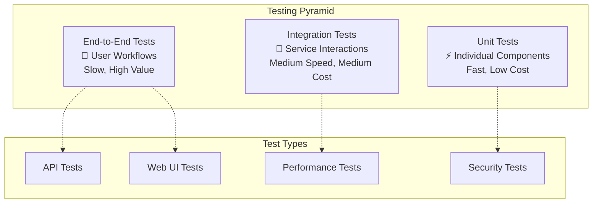

# Testing Overview

OpenFrame follows comprehensive testing practices across all layers of the application stack. This guide covers testing strategies, tools, and best practices for contributing to OpenFrame.

## Testing Philosophy

OpenFrame's testing approach is based on the **Testing Pyramid** principle:



### Testing Principles

1. **Fast Feedback**: Unit tests provide immediate feedback during development
2. **Realistic Testing**: Integration tests use real external dependencies
3. **User-Focused**: E2E tests validate complete user workflows
4. **Tenant Isolation**: All tests validate multi-tenant data separation
5. **Security First**: Security testing is integrated into all levels

## Test Structure and Organization

### Java Backend Testing

```text
src/
├── main/java/com/openframe/
├── test/java/com/openframe/
│   ├── unit/           # Unit tests (fast)
│   ├── integration/    # Integration tests (slower)
│   └── e2e/           # End-to-end tests (slowest)
└── test/resources/
    ├── application-test.yml
    ├── test-data/
    └── fixtures/
```

### Frontend Testing

```text
src/
├── components/
├── pages/
├── __tests__/
│   ├── unit/           # Component unit tests
│   ├── integration/    # Page integration tests
│   └── e2e/           # End-to-end user flows
├── __mocks__/          # Mock implementations
└── test-utils/         # Testing utilities
```

### Test Configuration

#### Backend Test Configuration

**application-test.yml**:
```yaml
spring:
  profiles:
    active: test
  datasource:
    url: jdbc:tc:mongodb:5.0://localhost/test_db
  redis:
    url: redis://localhost:6379/15
  kafka:
    bootstrap-servers: ${spring.embedded.kafka.brokers}

openframe:
  security:
    jwt:
      secret: test-jwt-secret-key
  tenant:
    default: test-tenant-123

logging:
  level:
    com.openframe: DEBUG
    org.testcontainers: INFO
```

#### Frontend Test Configuration

**jest.config.js**:
```javascript
module.exports = {
  testEnvironment: 'jsdom',
  setupFilesAfterEnv: ['<rootDir>/src/test-utils/setup.ts'],
  testMatch: [
    '<rootDir>/src/**/__tests__/**/*.{js,jsx,ts,tsx}',
    '<rootDir>/src/**/*.{test,spec}.{js,jsx,ts,tsx}'
  ],
  moduleNameMapping: {
    '^@/(.*)$': '<rootDir>/src/$1'
  },
  collectCoverageFrom: [
    'src/**/*.{js,jsx,ts,tsx}',
    '!src/**/*.d.ts',
    '!src/test-utils/**'
  ]
};
```

## Unit Testing

### Java Unit Tests

**Example Service Unit Test**:
```java
@ExtendWith(MockitoExtension.class)
class DeviceServiceTest {
    
    @Mock
    private DeviceRepository deviceRepository;
    
    @Mock
    private EventPublisher eventPublisher;
    
    @InjectMocks
    private DeviceService deviceService;
    
    @Test
    @DisplayName("Should create device with valid tenant context")
    void shouldCreateDeviceWithValidTenantContext() {
        // Given
        String tenantId = "tenant-123";
        CreateDeviceRequest request = CreateDeviceRequest.builder()
            .name("Test Device")
            .organizationId("org-456")
            .build();
        
        Device expectedDevice = Device.builder()
            .id("device-789")
            .tenantId(tenantId)
            .name("Test Device")
            .status(DeviceStatus.OFFLINE)
            .build();
        
        when(deviceRepository.save(any(Device.class))).thenReturn(expectedDevice);
        
        // When
        TenantContext.setTenantId(tenantId);
        Device result = deviceService.createDevice(request);
        
        // Then
        assertThat(result.getTenantId()).isEqualTo(tenantId);
        assertThat(result.getName()).isEqualTo("Test Device");
        verify(eventPublisher).publishEvent(any(DeviceCreatedEvent.class));
        
        TenantContext.clear();
    }
    
    @Test
    @DisplayName("Should throw exception when creating device without tenant context")
    void shouldThrowExceptionWhenCreatingDeviceWithoutTenantContext() {
        // Given
        CreateDeviceRequest request = CreateDeviceRequest.builder()
            .name("Test Device")
            .build();
        
        // When & Then
        assertThatThrownBy(() -> deviceService.createDevice(request))
            .isInstanceOf(TenantContextMissingException.class)
            .hasMessage("Tenant context is required for device operations");
    }
}
```

**GraphQL Data Fetcher Test**:
```java
@ExtendWith(MockitoExtension.class)
class DeviceDataFetcherTest {
    
    @Mock
    private DeviceService deviceService;
    
    @InjectMocks
    private DeviceDataFetcher deviceDataFetcher;
    
    @Test
    void shouldReturnDevicesForTenant() {
        // Given
        String tenantId = "tenant-123";
        DataFetchingEnvironment environment = mock(DataFetchingEnvironment.class);
        DgsContext dgsContext = mock(DgsContext.class);
        
        when(environment.getLocalContext()).thenReturn(dgsContext);
        when(dgsContext.<String>get("tenantId")).thenReturn(tenantId);
        
        List<Device> expectedDevices = Arrays.asList(
            Device.builder().id("device-1").tenantId(tenantId).build(),
            Device.builder().id("device-2").tenantId(tenantId).build()
        );
        
        when(deviceService.findDevicesForTenant(tenantId)).thenReturn(expectedDevices);
        
        // When
        List<Device> result = deviceDataFetcher.devices(environment);
        
        // Then
        assertThat(result).hasSize(2);
        assertThat(result).extracting(Device::getTenantId).containsOnly(tenantId);
    }
}
```

### Frontend Unit Tests

**React Component Test**:
```typescript
import React from 'react';
import { render, screen, fireEvent, waitFor } from '@testing-library/react';
import { MockedProvider } from '@apollo/client/testing';
import { DeviceList } from '../DeviceList';
import { GET_DEVICES } from '../queries';

const mocks = [
  {
    request: {
      query: GET_DEVICES,
      variables: { organizationId: 'org-123' }
    },
    result: {
      data: {
        devices: {
          edges: [
            {
              node: {
                id: 'device-1',
                name: 'Test Device 1',
                status: 'ONLINE',
                lastSeen: '2024-01-15T10:00:00Z'
              }
            }
          ]
        }
      }
    }
  }
];

describe('DeviceList', () => {
  it('renders device list with data', async () => {
    render(
      <MockedProvider mocks={mocks} addTypename={false}>
        <DeviceList organizationId="org-123" />
      </MockedProvider>
    );

    // Wait for loading to complete
    await waitFor(() => {
      expect(screen.getByText('Test Device 1')).toBeInTheDocument();
    });

    expect(screen.getByText('ONLINE')).toBeInTheDocument();
  });

  it('handles device status update', async () => {
    const updateMock = {
      request: {
        query: UPDATE_DEVICE_STATUS,
        variables: { id: 'device-1', status: 'MAINTENANCE' }
      },
      result: {
        data: {
          updateDeviceStatus: {
            id: 'device-1',
            status: 'MAINTENANCE'
          }
        }
      }
    };

    render(
      <MockedProvider mocks={[...mocks, updateMock]} addTypename={false}>
        <DeviceList organizationId="org-123" />
      </MockedProvider>
    );

    await waitFor(() => {
      expect(screen.getByText('Test Device 1')).toBeInTheDocument();
    });

    // Click status update button
    fireEvent.click(screen.getByTestId('status-update-button'));
    fireEvent.click(screen.getByText('Maintenance'));

    await waitFor(() => {
      expect(screen.getByText('MAINTENANCE')).toBeInTheDocument();
    });
  });
});
```

**Custom Hook Test**:
```typescript
import { renderHook, act } from '@testing-library/react';
import { useDeviceActions } from '../useDeviceActions';
import { MockedProvider } from '@apollo/client/testing';

describe('useDeviceActions', () => {
  it('executes device restart command', async () => {
    const mockMutation = {
      request: {
        query: EXECUTE_DEVICE_COMMAND,
        variables: {
          deviceId: 'device-1',
          command: 'restart'
        }
      },
      result: {
        data: {
          executeDeviceCommand: {
            success: true,
            output: 'Device restart initiated'
          }
        }
      }
    };

    const wrapper = ({ children }: { children: React.ReactNode }) => (
      <MockedProvider mocks={[mockMutation]}>{children}</MockedProvider>
    );

    const { result } = renderHook(() => useDeviceActions(), { wrapper });

    await act(async () => {
      const response = await result.current.restartDevice('device-1');
      expect(response.success).toBe(true);
    });
  });
});
```

## Integration Testing

### Backend Integration Tests

**Repository Integration Test**:
```java
@DataMongoTest
@Testcontainers
class DeviceRepositoryIntegrationTest {
    
    @Container
    static MongoDBContainer mongoContainer = new MongoDBContainer("mongo:7.0")
        .withExposedPorts(27017);
    
    @Autowired
    private TestEntityManager testEntityManager;
    
    @Autowired
    private DeviceRepository deviceRepository;
    
    @DynamicPropertySource
    static void configureProperties(DynamicPropertyRegistry registry) {
        registry.add("spring.data.mongodb.uri", mongoContainer::getReplicaSetUrl);
    }
    
    @Test
    void shouldFindDevicesByTenantAndStatus() {
        // Given
        String tenantId = "tenant-123";
        Device onlineDevice = Device.builder()
            .tenantId(tenantId)
            .name("Online Device")
            .status(DeviceStatus.ONLINE)
            .build();
            
        Device offlineDevice = Device.builder()
            .tenantId(tenantId)
            .name("Offline Device") 
            .status(DeviceStatus.OFFLINE)
            .build();
            
        Device otherTenantDevice = Device.builder()
            .tenantId("other-tenant")
            .name("Other Tenant Device")
            .status(DeviceStatus.ONLINE)
            .build();
        
        testEntityManager.persistAndFlush(onlineDevice);
        testEntityManager.persistAndFlush(offlineDevice);
        testEntityManager.persistAndFlush(otherTenantDevice);
        
        // When
        List<Device> onlineDevicesForTenant = deviceRepository
            .findByTenantIdAndStatus(tenantId, DeviceStatus.ONLINE);
        
        // Then
        assertThat(onlineDevicesForTenant).hasSize(1);
        assertThat(onlineDevicesForTenant.get(0).getName()).isEqualTo("Online Device");
    }
}
```

**GraphQL Integration Test**:
```java
@SpringBootTest
@Testcontainers
@AutoConfigureTestDatabase(replace = AutoConfigureTestDatabase.Replace.NONE)
class DeviceGraphQLIntegrationTest {
    
    @Autowired
    private GraphQLTestTemplate graphQLTestTemplate;
    
    @Autowired
    private DeviceRepository deviceRepository;
    
    @Container
    static MongoDBContainer mongoContainer = new MongoDBContainer("mongo:7.0");
    
    @Test
    void shouldQueryDevicesWithAuthentication() throws IOException {
        // Given
        String tenantId = "tenant-123";
        Device testDevice = Device.builder()
            .tenantId(tenantId)
            .name("Test Device")
            .status(DeviceStatus.ONLINE)
            .build();
        deviceRepository.save(testDevice);
        
        String query = """
            query GetDevices($filter: DeviceFilterInput) {
                devices(filter: $filter) {
                    edges {
                        node {
                            id
                            name
                            status
                        }
                    }
                }
            }
            """;
        
        ObjectNode variables = JsonNodeFactory.instance.objectNode();
        variables.set("filter", JsonNodeFactory.instance.objectNode()
            .put("status", "ONLINE"));
        
        // When
        GraphQLResponse response = graphQLTestTemplate
            .postForResource(query)
            .withVariable("filter", variables.get("filter"))
            .withHttpHeader("Authorization", "Bearer " + generateTestJWT(tenantId));
        
        // Then
        assertThat(response.isOk()).isTrue();
        assertThat(response.get("$.data.devices.edges", List.class)).hasSize(1);
        assertThat(response.get("$.data.devices.edges[0].node.name", String.class))
            .isEqualTo("Test Device");
    }
}
```

### Frontend Integration Tests

**Page Integration Test**:
```typescript
import React from 'react';
import { render, screen, waitFor } from '@testing-library/react';
import { BrowserRouter } from 'react-router-dom';
import { MockedProvider } from '@apollo/client/testing';
import { DevicesPage } from '../DevicesPage';
import { GET_DEVICES, GET_ORGANIZATIONS } from '../queries';

const mocks = [
  {
    request: {
      query: GET_ORGANIZATIONS
    },
    result: {
      data: {
        organizations: [
          { id: 'org-1', name: 'Test Org 1' },
          { id: 'org-2', name: 'Test Org 2' }
        ]
      }
    }
  },
  {
    request: {
      query: GET_DEVICES,
      variables: { organizationId: 'org-1' }
    },
    result: {
      data: {
        devices: {
          edges: [
            {
              node: {
                id: 'device-1',
                name: 'Device 1',
                status: 'ONLINE'
              }
            }
          ]
        }
      }
    }
  }
];

describe('DevicesPage Integration', () => {
  it('loads organizations and devices correctly', async () => {
    render(
      <BrowserRouter>
        <MockedProvider mocks={mocks} addTypename={false}>
          <DevicesPage />
        </MockedProvider>
      </BrowserRouter>
    );

    // Wait for organizations to load
    await waitFor(() => {
      expect(screen.getByText('Test Org 1')).toBeInTheDocument();
    });

    // Organizations should be available in dropdown
    expect(screen.getByText('Test Org 2')).toBeInTheDocument();

    // Devices should load for default organization
    await waitFor(() => {
      expect(screen.getByText('Device 1')).toBeInTheDocument();
    });
  });
});
```

## End-to-End Testing

### Backend E2E Tests

**API End-to-End Test**:
```java
@SpringBootTest(webEnvironment = SpringBootTest.WebEnvironment.RANDOM_PORT)
@Testcontainers
class DeviceManagementE2ETest {
    
    @Autowired
    private TestRestTemplate restTemplate;
    
    @Autowired
    private UserRepository userRepository;
    
    @LocalServerPort
    private int port;
    
    @Container
    static MongoDBContainer mongoContainer = new MongoDBContainer("mongo:7.0");
    
    @Container
    static RedisContainer redisContainer = new RedisContainer("redis:7.0");
    
    @Test
    void shouldCompleteDeviceRegistrationWorkflow() {
        // Given - Create test user and organization
        User testUser = createTestUser();
        String accessToken = authenticateUser(testUser);
        Organization testOrg = createTestOrganization(testUser, accessToken);
        
        // When - Register new device
        DeviceRegistrationRequest request = DeviceRegistrationRequest.builder()
            .organizationId(testOrg.getId())
            .deviceName("E2E Test Device")
            .agentVersion("1.0.0")
            .build();
        
        HttpHeaders headers = new HttpHeaders();
        headers.setBearerAuth(accessToken);
        HttpEntity<DeviceRegistrationRequest> entity = new HttpEntity<>(request, headers);
        
        ResponseEntity<DeviceRegistrationResponse> response = restTemplate.postForEntity(
            "http://localhost:" + port + "/api/v1/devices/register",
            entity,
            DeviceRegistrationResponse.class
        );
        
        // Then - Verify registration success
        assertThat(response.getStatusCode()).isEqualTo(HttpStatus.CREATED);
        assertThat(response.getBody().getDeviceId()).isNotNull();
        assertThat(response.getBody().getRegistrationSecret()).isNotNull();
        
        // And - Verify device appears in listing
        ResponseEntity<DeviceListResponse> listResponse = restTemplate.exchange(
            "http://localhost:" + port + "/api/v1/devices?organizationId=" + testOrg.getId(),
            HttpMethod.GET,
            new HttpEntity<>(headers),
            DeviceListResponse.class
        );
        
        assertThat(listResponse.getStatusCode()).isEqualTo(HttpStatus.OK);
        assertThat(listResponse.getBody().getDevices()).hasSize(1);
        assertThat(listResponse.getBody().getDevices().get(0).getName())
            .isEqualTo("E2E Test Device");
    }
}
```

### Frontend E2E Tests (Playwright)

```typescript
import { test, expect } from '@playwright/test';

test.describe('Device Management Workflow', () => {
  test.beforeEach(async ({ page }) => {
    // Login as test user
    await page.goto('/auth/login');
    await page.fill('[data-testid="email-input"]', 'test@example.com');
    await page.fill('[data-testid="password-input"]', 'testpassword123');
    await page.click('[data-testid="login-button"]');
    
    // Wait for dashboard to load
    await page.waitForURL('/dashboard');
  });

  test('should register new device successfully', async ({ page }) => {
    // Navigate to devices page
    await page.click('[data-testid="devices-nav-link"]');
    await page.waitForURL('/devices');
    
    // Click new device button
    await page.click('[data-testid="new-device-button"]');
    
    // Fill device registration form
    await page.fill('[data-testid="device-name-input"]', 'E2E Test Device');
    await page.selectOption('[data-testid="organization-select"]', 'test-org-id');
    await page.click('[data-testid="register-device-button"]');
    
    // Verify success message
    await expect(page.locator('[data-testid="success-message"]'))
      .toContainText('Device registered successfully');
    
    // Verify device appears in list
    await page.waitForSelector('[data-testid="device-list"]');
    await expect(page.locator('[data-testid="device-list"]'))
      .toContainText('E2E Test Device');
  });

  test('should update device status', async ({ page }) => {
    // Navigate to device details
    await page.goto('/devices/test-device-id');
    
    // Click status dropdown
    await page.click('[data-testid="device-status-dropdown"]');
    await page.click('[data-testid="maintenance-status-option"]');
    
    // Confirm status change
    await page.click('[data-testid="confirm-status-change"]');
    
    // Verify status updated
    await expect(page.locator('[data-testid="device-status-badge"]'))
      .toContainText('MAINTENANCE');
  });
});
```

## Performance Testing

### Load Testing with JMeter

**Device API Load Test**:
```xml
<?xml version="1.0" encoding="UTF-8"?>
<jmeterTestPlan version="1.2">
  <hashTree>
    <TestPlan testname="OpenFrame Device API Load Test">
      <elementProp name="TestPlan.arguments" elementType="Arguments" guiclass="ArgumentsPanel">
        <collectionProp name="Arguments.arguments">
          <elementProp name="BASE_URL" elementType="Argument">
            <stringProp name="Argument.name">BASE_URL</stringProp>
            <stringProp name="Argument.value">http://localhost:8080</stringProp>
          </elementProp>
        </collectionProp>
      </elementProp>
    </TestPlan>
    <hashTree>
      <ThreadGroup testname="Device List Load Test">
        <elementProp name="ThreadGroup.main_controller" elementType="LoopController">
          <stringProp name="LoopController.loops">100</stringProp>
        </elementProp>
        <stringProp name="ThreadGroup.num_threads">10</stringProp>
        <stringProp name="ThreadGroup.ramp_time">30</stringProp>
      </ThreadGroup>
      <hashTree>
        <HTTPSamplerProxy testname="Get Devices">
          <stringProp name="HTTPSampler.path">/api/v1/devices</stringProp>
          <stringProp name="HTTPSampler.method">GET</stringProp>
          <stringProp name="HTTPSampler.domain">${BASE_URL}</stringProp>
        </HTTPSamplerProxy>
      </hashTree>
    </hashTree>
  </hashTree>
</jmeterTestPlan>
```

### Database Performance Testing

```java
@SpringBootTest
@Testcontainers
class DeviceRepositoryPerformanceTest {
    
    @Test
    void shouldHandleLargeVolumeDeviceQueries() {
        // Given - Create large dataset
        String tenantId = "perf-test-tenant";
        List<Device> devices = IntStream.range(0, 10000)
            .mapToObj(i -> Device.builder()
                .tenantId(tenantId)
                .name("Device-" + i)
                .status(i % 2 == 0 ? DeviceStatus.ONLINE : DeviceStatus.OFFLINE)
                .build())
            .collect(Collectors.toList());
        
        deviceRepository.saveAll(devices);
        
        // When - Execute performance test
        StopWatch stopWatch = new StopWatch();
        stopWatch.start();
        
        List<Device> onlineDevices = deviceRepository
            .findByTenantIdAndStatus(tenantId, DeviceStatus.ONLINE);
        
        stopWatch.stop();
        
        // Then - Verify performance criteria
        assertThat(onlineDevices).hasSize(5000);
        assertThat(stopWatch.getTotalTimeMillis())
            .as("Query should complete within 200ms")
            .isLessThan(200);
    }
}
```

## Security Testing

### Authentication and Authorization Tests

```java
@SpringBootTest
class SecurityIntegrationTest {
    
    @Autowired
    private MockMvc mockMvc;
    
    @Test
    void shouldDenyAccessWithoutAuthentication() throws Exception {
        mockMvc.perform(get("/api/v1/devices"))
            .andExpect(status().isUnauthorized());
    }
    
    @Test
    void shouldDenyAccessWithInvalidTenant() throws Exception {
        String jwtToken = generateJWTForTenant("unauthorized-tenant");
        
        mockMvc.perform(get("/api/v1/devices")
                .header("Authorization", "Bearer " + jwtToken))
            .andExpect(status().isForbidden());
    }
    
    @Test
    void shouldAllowAccessWithValidTenantContext() throws Exception {
        String jwtToken = generateJWTForTenant("valid-tenant");
        
        mockMvc.perform(get("/api/v1/devices")
                .header("Authorization", "Bearer " + jwtToken))
            .andExpected(status().isOk());
    }
}
```

### SQL Injection Prevention Test

```java
@Test
void shouldPreventSQLInjectionInDeviceQueries() {
    // Given
    String maliciousInput = "'; DROP TABLE devices; --";
    
    // When & Then - Should handle malicious input safely
    assertThatCode(() -> {
        deviceRepository.findByNameContaining(maliciousInput);
    }).doesNotThrowAnyException();
    
    // Verify devices table still exists
    assertThat(deviceRepository.count()).isGreaterThan(0);
}
```

## Test Data Management

### Test Data Builders

```java
public class DeviceTestDataBuilder {
    private String id = "default-device-id";
    private String tenantId = "default-tenant";
    private String name = "Test Device";
    private DeviceStatus status = DeviceStatus.ONLINE;
    
    public static DeviceTestDataBuilder aDevice() {
        return new DeviceTestDataBuilder();
    }
    
    public DeviceTestDataBuilder withId(String id) {
        this.id = id;
        return this;
    }
    
    public DeviceTestDataBuilder withTenantId(String tenantId) {
        this.tenantId = tenantId;
        return this;
    }
    
    public DeviceTestDataBuilder withName(String name) {
        this.name = name;
        return this;
    }
    
    public DeviceTestDataBuilder offline() {
        this.status = DeviceStatus.OFFLINE;
        return this;
    }
    
    public Device build() {
        return Device.builder()
            .id(id)
            .tenantId(tenantId)
            .name(name)
            .status(status)
            .createdAt(Instant.now())
            .updatedAt(Instant.now())
            .build();
    }
}

// Usage in tests
@Test
void shouldCreateDevice() {
    Device device = DeviceTestDataBuilder.aDevice()
        .withTenantId("test-tenant")
        .withName("Custom Device")
        .offline()
        .build();
    
    assertThat(device.getStatus()).isEqualTo(DeviceStatus.OFFLINE);
}
```

### Test Fixtures

**JSON Test Fixtures**:
```json
// test/resources/fixtures/devices.json
{
  "validDevice": {
    "id": "device-123",
    "tenantId": "tenant-abc", 
    "name": "Test Device",
    "status": "ONLINE",
    "organizationId": "org-xyz"
  },
  "offlineDevice": {
    "id": "device-456",
    "tenantId": "tenant-abc",
    "name": "Offline Device", 
    "status": "OFFLINE",
    "organizationId": "org-xyz"
  }
}
```

**Fixture Loader**:
```java
@Component
public class TestFixtureLoader {
    
    private final ObjectMapper objectMapper;
    
    public <T> T loadFixture(String fixturePath, Class<T> type) {
        try {
            Resource resource = new ClassPathResource("fixtures/" + fixturePath);
            return objectMapper.readValue(resource.getInputStream(), type);
        } catch (IOException e) {
            throw new RuntimeException("Failed to load fixture: " + fixturePath, e);
        }
    }
    
    public <T> T loadFixture(String fixturePath, String key, Class<T> type) {
        try {
            Resource resource = new ClassPathResource("fixtures/" + fixturePath);
            JsonNode rootNode = objectMapper.readTree(resource.getInputStream());
            JsonNode fixtureNode = rootNode.get(key);
            return objectMapper.treeToValue(fixtureNode, type);
        } catch (IOException e) {
            throw new RuntimeException("Failed to load fixture: " + fixturePath, e);
        }
    }
}
```

## Running Tests

### Backend Tests

```bash
# Run all tests
mvn test

# Run unit tests only
mvn test -Dgroups=unit

# Run integration tests
mvn test -Dgroups=integration

# Run with coverage
mvn test jacoco:report

# Run specific test class
mvn test -Dtest=DeviceServiceTest

# Run with debug output
mvn test -X

# Run performance tests
mvn test -Dgroups=performance
```

### Frontend Tests

```bash
cd openframe/services/openframe-frontend

# Run all tests
npm test

# Run in watch mode
npm test -- --watch

# Run with coverage
npm test -- --coverage

# Run specific test file
npm test DeviceList.test.tsx

# Run E2E tests
npm run test:e2e

# Run E2E tests in headless mode
npm run test:e2e:ci
```

### Coverage Requirements

**Coverage Thresholds**:
```xml
<!-- Maven Jacoco Configuration -->
<plugin>
  <groupId>org.jacoco</groupId>
  <artifactId>jacoco-maven-plugin</artifactId>
  <configuration>
    <rules>
      <rule>
        <element>BUNDLE</element>
        <limits>
          <limit>
            <counter>LINE</counter>
            <value>COVEREDRATIO</value>
            <minimum>0.80</minimum>
          </limit>
          <limit>
            <counter>BRANCH</counter>
            <value>COVEREDRATIO</value>
            <minimum>0.70</minimum>
          </limit>
        </limits>
      </rule>
    </rules>
  </configuration>
</plugin>
```

**Frontend Coverage Configuration**:
```json
// jest.config.js
{
  "coverageThreshold": {
    "global": {
      "lines": 80,
      "functions": 80,
      "branches": 70,
      "statements": 80
    }
  }
}
```

## Continuous Integration Testing

### GitHub Actions Workflow

```yaml
# .github/workflows/test.yml
name: Test Suite

on: [push, pull_request]

jobs:
  backend-tests:
    runs-on: ubuntu-latest
    services:
      mongodb:
        image: mongo:7.0
        ports:
          - 27017:27017
      redis:
        image: redis:7.0
        ports:
          - 6379:6379
    
    steps:
      - uses: actions/checkout@v3
      - uses: actions/setup-java@v3
        with:
          java-version: '21'
          distribution: 'temurin'
      
      - name: Cache Maven dependencies
        uses: actions/cache@v3
        with:
          path: ~/.m2
          key: ${{ runner.os }}-m2-${{ hashFiles('**/pom.xml') }}
      
      - name: Run backend tests
        run: mvn clean test
      
      - name: Generate coverage report
        run: mvn jacoco:report
      
      - name: Upload coverage to Codecov
        uses: codecov/codecov-action@v3

  frontend-tests:
    runs-on: ubuntu-latest
    steps:
      - uses: actions/checkout@v3
      - uses: actions/setup-node@v3
        with:
          node-version: '20'
          cache: 'npm'
          cache-dependency-path: 'openframe/services/openframe-frontend/package-lock.json'
      
      - name: Install dependencies
        run: |
          cd openframe/services/openframe-frontend
          npm ci
      
      - name: Run frontend tests
        run: |
          cd openframe/services/openframe-frontend
          npm test -- --coverage --watchAll=false
      
      - name: Run E2E tests
        run: |
          cd openframe/services/openframe-frontend
          npm run build
          npm run test:e2e:ci

  rust-tests:
    runs-on: ubuntu-latest
    steps:
      - uses: actions/checkout@v3
      - uses: actions-rs/toolchain@v1
        with:
          toolchain: stable
          override: true
      
      - name: Cache cargo dependencies
        uses: actions/cache@v3
        with:
          path: |
            ~/.cargo/registry
            ~/.cargo/git
            clients/openframe-client/target
          key: ${{ runner.os }}-cargo-${{ hashFiles('**/Cargo.lock') }}
      
      - name: Run Rust tests
        run: |
          cd clients/openframe-client
          cargo test
```

## Best Practices

### Test Organization

1. **Arrange-Act-Assert**: Structure tests with clear Given-When-Then sections
2. **One Assertion Per Test**: Focus on testing one behavior per test method
3. **Descriptive Test Names**: Use `@DisplayName` or descriptive method names
4. **Test Data Isolation**: Use test data builders and avoid shared mutable state

### Performance Considerations

1. **Use TestContainers**: For reliable integration testing with real dependencies
2. **Parallel Execution**: Configure JUnit 5 parallel execution for faster feedback
3. **Test Categorization**: Use JUnit 5 tags to categorize and selectively run tests
4. **Resource Cleanup**: Ensure proper cleanup of test resources and containers

### Security Testing

1. **Tenant Isolation**: Always verify multi-tenant data separation
2. **Authentication Testing**: Test both positive and negative auth scenarios
3. **Authorization Testing**: Verify role-based access controls
4. **Input Validation**: Test with malicious inputs and edge cases

## Troubleshooting Tests

### Common Issues

**TestContainer Port Conflicts**:
```java
// Use random ports to avoid conflicts
@Container
static MongoDBContainer mongoContainer = new MongoDBContainer("mongo:7.0")
    .withExposedPorts(27017);

@DynamicPropertySource
static void configureProperties(DynamicPropertyRegistry registry) {
    registry.add("spring.data.mongodb.port", mongoContainer::getFirstMappedPort);
}
```

**Test Data Cleanup**:
```java
@AfterEach
void cleanup() {
    deviceRepository.deleteAll();
    TenantContext.clear();
}
```

**Flaky Tests**:
```java
// Use @RepeatedTest for flaky test detection
@RepeatedTest(10)
void shouldHandleConcurrentRequests() {
    // Test implementation
}

// Use @Timeout for tests that might hang
@Test
@Timeout(value = 5, unit = TimeUnit.SECONDS)
void shouldCompleteWithinTimeout() {
    // Test implementation
}
```

## Next Steps

With a solid understanding of OpenFrame testing practices:

1. **[Contributing Guidelines](../contributing/guidelines.md)** - Learn how to contribute code with tests
2. **Write Your First Test** - Pick a component and add comprehensive test coverage
3. **Join Testing Discussions** - #testing channel in [OpenMSP Slack](https://join.slack.com/t/openmsp/shared_invite/zt-36bl7mx0h-3~U2nFH6nqHqoTPXMaHEHA)

Remember: Good tests are the foundation of maintainable software. They serve as documentation, prevent regressions, and enable confident refactoring.