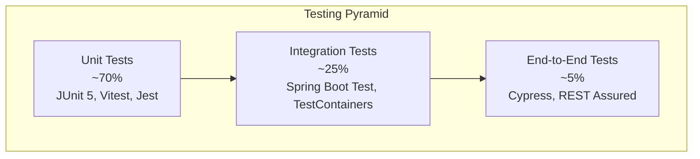

# Testing Overview

OpenFrame maintains high code quality through comprehensive testing at multiple levels. This guide covers our testing strategy, tools, frameworks, and best practices for writing and running tests across the platform.

## Testing Philosophy

Our testing approach follows the **Testing Pyramid** principle:



### Testing Principles

1. **Fast Feedback**: Unit tests provide immediate feedback during development
2. **Comprehensive Coverage**: Aim for >80% code coverage across all modules
3. **Realistic Testing**: Integration tests use real dependencies when possible
4. **Automated Execution**: All tests run in CI/CD pipeline
5. **Test-Driven Development**: Write tests before implementation when appropriate

## Test Structure and Organization

### Java Backend Testing

```
src/
├── main/java/com/openframe/...
└── test/java/com/openframe/
    ├── unit/                    # Unit tests
    │   ├── service/            # Service layer tests
    │   ├── controller/         # Controller tests
    │   └── util/               # Utility class tests
    ├── integration/            # Integration tests
    │   ├── repository/         # Repository integration tests
    │   ├── api/                # API integration tests
    │   └── messaging/          # Kafka integration tests
    └── resources/
        ├── application-test.yml # Test configuration
        └── test-data/          # Test fixtures
```

### Frontend Testing

```
src/
├── components/
│   ├── Component.vue
│   └── Component.test.ts       # Component unit tests
├── services/
│   ├── ApiService.ts
│   └── ApiService.test.ts      # Service unit tests
├── stores/
│   ├── userStore.ts
│   └── userStore.test.ts       # Store unit tests
└── __tests__/
    ├── integration/            # Integration tests
    └── e2e/                    # End-to-end tests
```

## Testing Technologies and Frameworks

### Backend Testing Stack

| Framework | Version | Purpose | Usage |
|-----------|---------|---------|-------|
| **JUnit 5** | 5.10+ | Unit testing framework | Primary test runner |
| **Mockito** | 5.x | Mocking framework | Service/dependency mocking |
| **Spring Boot Test** | 3.3.0 | Integration testing | Application context testing |
| **TestContainers** | 1.19+ | Container testing | Database integration tests |
| **REST Assured** | 5.x | API testing | REST endpoint testing |
| **WireMock** | 3.x | HTTP mocking | External service mocking |

### Frontend Testing Stack

| Framework | Version | Purpose | Usage |
|-----------|---------|---------|-------|
| **Vitest** | 1.x | Unit testing (Vue.js) | Component and service testing |
| **Jest** | 29.x | Unit testing (React) | Chat UI testing |
| **Vue Test Utils** | 2.x | Vue component testing | Component rendering and interaction |
| **React Testing Library** | 14.x | React component testing | Chat UI component testing |
| **Cypress** | 13.x | End-to-end testing | Full application testing |

## Running Tests

### Backend Tests

#### Run All Tests
```bash
# Run all tests with coverage
mvn clean test

# Run tests without coverage (faster)
mvn test -DskipCoverage

# Run tests for specific module
mvn test -pl openframe-api-service-core
```

#### Run Specific Test Categories
```bash
# Unit tests only
mvn test -Dgroups=unit

# Integration tests only  
mvn test -Dgroups=integration

# Fast tests (exclude slow integration tests)
mvn test -Dgroups="unit,fast-integration"

# Specific test class
mvn test -Dtest=DeviceServiceTest

# Specific test method
mvn test -Dtest=DeviceServiceTest#shouldCreateDevice
```

#### Parallel Test Execution
```bash
# Run tests in parallel (faster execution)
mvn test -T 4 -Dparallel=classes -DthreadCount=4
```

### Frontend Tests

#### Vue.js Frontend Tests
```bash
cd openframe/services/openframe-frontend

# Run all tests
npm test

# Run tests in watch mode
npm run test:watch

# Run tests with coverage
npm run test:coverage

# Run specific test file
npm test -- DeviceCard.test.ts

# Run tests matching pattern
npm test -- --grep "device management"
```

#### React Chat UI Tests
```bash
cd clients/openframe-chat

# Run Jest tests
npm test

# Run tests in watch mode
npm run test:watch

# Run tests with coverage
npm run test:coverage
```

### End-to-End Tests
```bash
# Run E2E tests (requires running application)
cd openframe-e2e-tests

# Run all E2E tests
mvn test -Dtest=**/*E2E*

# Run specific test suite
mvn test -Dtest=DevicesE2ETest

# Run with different environment
mvn test -Dtest.environment=staging
```

## Writing Effective Tests

### Unit Tests

#### Java Service Unit Test Example
```java
@ExtendWith(MockitoExtension.class)
class DeviceServiceTest {

    @Mock
    private DeviceRepository deviceRepository;
    
    @Mock
    private EventPublisher eventPublisher;
    
    @InjectMocks
    private DeviceService deviceService;

    @Test
    @DisplayName("Should create device successfully")
    void shouldCreateDevice() {
        // Given
        String organizationId = "org-123";
        Device device = Device.builder()
            .hostname("test-device")
            .platform(Platform.LINUX)
            .organizationId(organizationId)
            .build();
            
        when(deviceRepository.save(any(Device.class)))
            .thenReturn(device);

        // When
        Device result = deviceService.createDevice(organizationId, device);

        // Then
        assertThat(result).isNotNull();
        assertThat(result.getHostname()).isEqualTo("test-device");
        
        verify(deviceRepository).save(device);
        verify(eventPublisher).publishDeviceCreated(device);
    }

    @Test
    @DisplayName("Should throw exception when device already exists")
    void shouldThrowExceptionWhenDeviceExists() {
        // Given
        String organizationId = "org-123";
        Device device = Device.builder().hostname("existing-device").build();
        
        when(deviceRepository.existsByHostnameAndOrganizationId(
            "existing-device", organizationId))
            .thenReturn(true);

        // When & Then
        assertThatThrownBy(() -> deviceService.createDevice(organizationId, device))
            .isInstanceOf(DuplicateDeviceException.class)
            .hasMessage("Device with hostname 'existing-device' already exists");
    }
}
```

#### Vue.js Component Unit Test Example
```typescript
import { describe, it, expect, beforeEach } from 'vitest'
import { mount } from '@vue/test-utils'
import DeviceCard from '@/components/DeviceCard.vue'
import type { Device } from '@/types/device'

describe('DeviceCard', () => {
  const mockDevice: Device = {
    id: 'device-123',
    hostname: 'test-device',
    platform: 'linux',
    status: 'online',
    lastSeen: new Date('2024-01-15T10:00:00Z'),
    organizationId: 'org-123'
  }

  it('should render device information correctly', () => {
    // Given
    const wrapper = mount(DeviceCard, {
      props: {
        device: mockDevice
      }
    })

    // Then
    expect(wrapper.find('[data-testid="device-hostname"]').text())
      .toBe('test-device')
    expect(wrapper.find('[data-testid="device-status"]').text())
      .toBe('online')
  })

  it('should emit device-selected event when clicked', async () => {
    // Given
    const wrapper = mount(DeviceCard, {
      props: {
        device: mockDevice
      }
    })

    // When
    await wrapper.find('[data-testid="device-card"]').trigger('click')

    // Then
    expect(wrapper.emitted('device-selected')).toHaveLength(1)
    expect(wrapper.emitted('device-selected')![0]).toEqual([mockDevice])
  })
})
```

### Integration Tests

#### Spring Boot Integration Test Example
```java
@SpringBootTest
@TestPropertySource(properties = {
    "spring.datasource.url=jdbc:h2:mem:testdb",
    "spring.jpa.hibernate.ddl-auto=create-drop"
})
class DeviceRepositoryIntegrationTest {

    @Autowired
    private TestEntityManager entityManager;
    
    @Autowired
    private DeviceRepository deviceRepository;

    @Test
    void shouldFindDevicesByOrganizationId() {
        // Given
        String organizationId = "org-123";
        Device device1 = createDevice("device1", organizationId);
        Device device2 = createDevice("device2", organizationId);
        Device otherOrgDevice = createDevice("device3", "org-456");
        
        entityManager.persistAndFlush(device1);
        entityManager.persistAndFlush(device2);
        entityManager.persistAndFlush(otherOrgDevice);

        // When
        List<Device> result = deviceRepository
            .findByOrganizationId(organizationId);

        // Then
        assertThat(result).hasSize(2);
        assertThat(result)
            .extracting(Device::getHostname)
            .containsExactlyInAnyOrder("device1", "device2");
    }

    private Device createDevice(String hostname, String organizationId) {
        return Device.builder()
            .hostname(hostname)
            .organizationId(organizationId)
            .platform(Platform.LINUX)
            .status(DeviceStatus.ONLINE)
            .build();
    }
}
```

#### API Integration Test Example
```java
@SpringBootTest(webEnvironment = SpringBootTest.WebEnvironment.RANDOM_PORT)
@TestPropertySource(locations = "classpath:application-integration-test.properties")
class DeviceControllerIntegrationTest {

    @Autowired
    private TestRestTemplate restTemplate;
    
    @Autowired
    private DeviceRepository deviceRepository;
    
    @Test
    void shouldReturnDevicesForOrganization() {
        // Given
        String organizationId = "org-123";
        Device device = createAndSaveDevice("test-device", organizationId);
        
        HttpHeaders headers = new HttpHeaders();
        headers.setBearerAuth(generateTestJwtToken(organizationId));
        HttpEntity<?> entity = new HttpEntity<>(headers);

        // When
        ResponseEntity<DeviceListResponse> response = restTemplate.exchange(
            "/api/v1/devices",
            HttpMethod.GET,
            entity,
            DeviceListResponse.class
        );

        // Then
        assertThat(response.getStatusCode()).isEqualTo(HttpStatus.OK);
        assertThat(response.getBody().getDevices()).hasSize(1);
        assertThat(response.getBody().getDevices().get(0).getHostname())
            .isEqualTo("test-device");
    }
}
```

### TestContainers Integration

For realistic database testing:

```java
@Testcontainers
@SpringBootTest
class DeviceServiceIntegrationTest {

    @Container
    static MongoDBContainer mongoDBContainer = new MongoDBContainer("mongo:7.0")
            .withExposedPorts(27017);

    @Container  
    static GenericContainer<?> redisContainer = new GenericContainer<>("redis:7.0")
            .withExposedPorts(6379);

    @DynamicPropertySource
    static void setProperties(DynamicPropertyRegistry registry) {
        registry.add("spring.data.mongodb.uri", mongoDBContainer::getReplicaSetUrl);
        registry.add("spring.redis.url", 
            () -> "redis://localhost:" + redisContainer.getMappedPort(6379));
    }

    @Test
    void shouldPersistDeviceToMongoDB() {
        // Test with real MongoDB instance
        // ... test implementation
    }
}
```

## Test Configuration and Data

### Test Profiles

#### `application-test.yml`
```yaml
spring:
  profiles: test
  
  # Use in-memory databases for unit tests
  datasource:
    url: jdbc:h2:mem:testdb;MODE=PostgreSQL;DB_CLOSE_DELAY=-1
    driver-class-name: org.h2.Driver
    
  data:
    mongodb:
      uri: mongodb://localhost:27017/test_db
      
  # Disable security for testing
  security:
    enabled: false
    
  # Faster startup for tests
  jpa:
    hibernate:
      ddl-auto: create-drop
      
logging:
  level:
    com.openframe: DEBUG
    org.springframework.web: DEBUG
```

### Test Data Management

#### Test Fixtures
```java
public class TestDataBuilder {
    
    public static Device.DeviceBuilder aDevice() {
        return Device.builder()
            .hostname("test-device-" + UUID.randomUUID().toString().substring(0, 8))
            .platform(Platform.LINUX)
            .status(DeviceStatus.ONLINE)
            .createdAt(Instant.now())
            .lastSeen(Instant.now());
    }
    
    public static Organization.OrganizationBuilder anOrganization() {
        return Organization.builder()
            .name("Test Organization")
            .domain("test-org.com")
            .status(OrganizationStatus.ACTIVE)
            .createdAt(Instant.now());
    }
}
```

#### Database Cleanup
```java
@TestExecutionListeners({
    DependencyInjectionTestExecutionListener.class,
    DirtiesContextTestExecutionListener.class,
    TransactionalTestExecutionListener.class,
    DbUnitTestExecutionListener.class
})
@DatabaseSetup("classpath:test-data/initial-data.xml")
@DatabaseTearDown(type = DatabaseOperation.DELETE_ALL, value = "classpath:test-data/cleanup.xml")
public class DatabaseIntegrationTest {
    // Test methods
}
```

## Code Coverage Requirements

### Coverage Targets

| Module Type | Target Coverage | Enforcement |
|-------------|----------------|-------------|
| **Core Services** | >85% | Build fails below 80% |
| **Shared Libraries** | >90% | Build fails below 85% |
| **Controllers** | >80% | Build fails below 75% |
| **Utilities** | >95% | Build fails below 90% |

### Maven Coverage Configuration

```xml
<plugin>
    <groupId>org.jacoco</groupId>
    <artifactId>jacoco-maven-plugin</artifactId>
    <version>0.8.10</version>
    <executions>
        <execution>
            <goals>
                <goal>prepare-agent</goal>
            </goals>
        </execution>
        <execution>
            <id>report</id>
            <phase>test</phase>
            <goals>
                <goal>report</goal>
            </goals>
        </execution>
        <execution>
            <id>check</id>
            <goals>
                <goal>check</goal>
            </goals>
            <configuration>
                <rules>
                    <rule>
                        <element>CLASS</element>
                        <limits>
                            <limit>
                                <counter>LINE</counter>
                                <value>COVEREDRATIO</value>
                                <minimum>0.80</minimum>
                            </limit>
                        </limits>
                    </rule>
                </rules>
            </configuration>
        </execution>
    </executions>
</plugin>
```

## Performance Testing

### Load Testing with Maven

```xml
<plugin>
    <groupId>com.lazerycode.jmeter</groupId>
    <artifactId>jmeter-maven-plugin</artifactId>
    <version>3.7.0</version>
    <executions>
        <execution>
            <id>performance-test</id>
            <goals>
                <goal>jmeter</goal>
            </goals>
            <phase>integration-test</phase>
        </execution>
    </executions>
</plugin>
```

### API Performance Test Example
```bash
# Run performance tests
mvn clean verify -Pperformance

# With specific parameters
mvn clean verify -Pperformance \
  -Dthreads=50 \
  -Dduration=300 \
  -Dtarget.host=localhost \
  -Dtarget.port=8080
```

## Continuous Integration Testing

### GitHub Actions Test Workflow

```yaml
name: Test Suite

on: [push, pull_request]

jobs:
  test:
    runs-on: ubuntu-latest
    
    services:
      mongodb:
        image: mongo:7.0
        ports:
          - 27017:27017
          
      redis:
        image: redis:7.0
        ports:
          - 6379:6379
    
    steps:
      - uses: actions/checkout@v4
      
      - name: Set up JDK 21
        uses: actions/setup-java@v4
        with:
          java-version: '21'
          distribution: 'temurin'
          
      - name: Cache Maven dependencies
        uses: actions/cache@v3
        with:
          path: ~/.m2
          key: ${{ runner.os }}-m2-${{ hashFiles('**/pom.xml') }}
          
      - name: Run backend tests
        run: mvn clean test
        
      - name: Set up Node.js
        uses: actions/setup-node@v4
        with:
          node-version: '20'
          
      - name: Install frontend dependencies
        run: |
          cd openframe/services/openframe-frontend
          npm ci
          
      - name: Run frontend tests
        run: |
          cd openframe/services/openframe-frontend
          npm test
          
      - name: Upload coverage reports
        uses: codecov/codecov-action@v3
        with:
          files: ./target/site/jacoco/jacoco.xml,./coverage/lcov.info
```

## Testing Best Practices

### 1. Test Naming Convention
```java
// Pattern: should[ExpectedBehavior]When[StateUnderTest]
@Test
void shouldReturnDeviceWhenValidIdProvided() { }

@Test  
void shouldThrowExceptionWhenDeviceNotFound() { }

@Test
void shouldUpdateDeviceStatusWhenHeartbeatReceived() { }
```

### 2. Arrange-Act-Assert Pattern
```java
@Test
void shouldCreateDeviceSuccessfully() {
    // Arrange
    String organizationId = "org-123";
    Device device = TestDataBuilder.aDevice()
        .organizationId(organizationId)
        .build();
    
    // Act
    Device result = deviceService.createDevice(organizationId, device);
    
    // Assert
    assertThat(result).isNotNull();
    assertThat(result.getId()).isNotNull();
    assertThat(result.getOrganizationId()).isEqualTo(organizationId);
}
```

### 3. Test Data Isolation
```java
@BeforeEach
void setUp() {
    // Clean test data before each test
    deviceRepository.deleteAll();
    organizationRepository.deleteAll();
}
```

### 4. Parameterized Tests
```java
@ParameterizedTest
@ValueSource(strings = {"", " ", "  ", "\t", "\n"})
void shouldValidateDeviceHostnameNotBlank(String invalidHostname) {
    Device device = TestDataBuilder.aDevice()
        .hostname(invalidHostname)
        .build();
        
    assertThatThrownBy(() -> deviceValidator.validate(device))
        .isInstanceOf(ValidationException.class);
}
```

## Test Debugging

### Running Tests in Debug Mode

**IntelliJ IDEA:**
1. Right-click on test method/class
2. Select "Debug [TestName]"
3. Set breakpoints in test or implementation code

**Command Line:**
```bash
# Debug Maven tests
mvn test -Dmaven.surefire.debug="-Xdebug -Xrunjdwp:transport=dt_socket,server=y,suspend=y,address=8000"

# Debug specific test
mvn test -Dtest=DeviceServiceTest -Dmaven.surefire.debug
```

### Test Logging Configuration

```xml
<!-- logback-test.xml -->
<configuration>
    <appender name="STDOUT" class="ch.qos.logback.core.ConsoleAppender">
        <encoder>
            <pattern>%d{HH:mm:ss.SSS} [%thread] %-5level %logger{36} - %msg%n</pattern>
        </encoder>
    </appender>
    
    <logger name="com.openframe" level="DEBUG"/>
    <logger name="org.springframework.web" level="DEBUG"/>
    
    <root level="INFO">
        <appender-ref ref="STDOUT" />
    </root>
</configuration>
```

---

This comprehensive testing strategy ensures OpenFrame maintains high quality, reliability, and maintainability as the platform evolves. Follow these guidelines to contribute effective tests that provide confidence in the system's behavior.