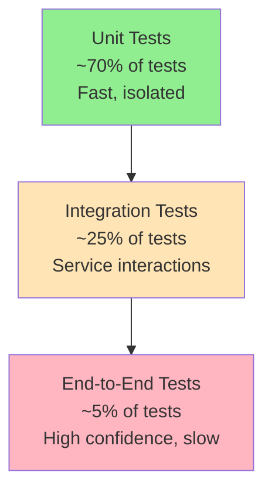

# Testing Overview

OpenFrame employs comprehensive testing strategies to ensure reliability, performance, and maintainability across the platform. This guide covers the testing architecture, strategies, tools, and best practices.

## Testing Philosophy

OpenFrame follows a **test-driven development (TDD)** approach with emphasis on:

- **Quality over Coverage**: Focus on meaningful tests that catch real issues
- **Fast Feedback**: Quick test execution for rapid development cycles
- **Test Isolation**: Independent tests that can run in parallel
- **Real-world Scenarios**: Testing actual user workflows and integration patterns

## Testing Pyramid

OpenFrame implements a balanced testing pyramid optimized for microservices:



### Test Distribution Strategy

| Test Type | Coverage | Execution Time | Confidence Level | When to Run |
|-----------|----------|----------------|------------------|-------------|
| **Unit Tests** | 70% | < 10 seconds | Medium | Every code change |
| **Integration Tests** | 25% | < 2 minutes | High | Pre-commit, CI |
| **End-to-End Tests** | 5% | < 10 minutes | Very High | Pre-release, nightly |

---

## Unit Testing

### Java/Spring Boot Testing

#### Test Structure

```java
@ExtendWith(MockitoExtension.class)
class DeviceServiceTest {
    
    @Mock
    private DeviceRepository deviceRepository;
    
    @Mock
    private KafkaTemplate<String, Object> kafkaTemplate;
    
    @InjectMocks
    private DeviceService deviceService;
    
    @Test
    @DisplayName("Should create device successfully")
    void shouldCreateDeviceSuccessfully() {
        // Given
        Device device = DeviceTestData.createValidDevice();
        when(deviceRepository.save(any(Device.class))).thenReturn(device);
        
        // When
        Device result = deviceService.createDevice(device);
        
        // Then
        assertThat(result.getName()).isEqualTo("test-device");
        verify(kafkaTemplate).send(eq("device-events"), any(DeviceCreatedEvent.class));
    }
}
```

#### Key Testing Libraries

```xml
<dependencies>
    <!-- Core testing -->
    <dependency>
        <groupId>org.springframework.boot</groupId>
        <artifactId>spring-boot-starter-test</artifactId>
        <scope>test</scope>
    </dependency>
    
    <!-- Mockito for mocking -->
    <dependency>
        <groupId>org.mockito</groupId>
        <artifactId>mockito-core</artifactId>
        <scope>test</scope>
    </dependency>
    
    <!-- TestContainers for integration -->
    <dependency>
        <groupId>org.testcontainers</groupId>
        <artifactId>junit-jupiter</artifactId>
        <scope>test</scope>
    </dependency>
    
    <!-- WireMock for external service mocking -->
    <dependency>
        <groupId>com.github.tomakehurst</groupId>
        <artifactId>wiremock-jre8</artifactId>
        <scope>test</scope>
    </dependency>
</dependencies>
```

#### Testing Best Practices

**1. Test Data Builders**

```java
public class DeviceTestData {
    public static Device createValidDevice() {
        return Device.builder()
            .name("test-device")
            .type(DeviceType.SERVER)
            .status(DeviceStatus.ONLINE)
            .organizationId(UUID.randomUUID())
            .build();
    }
    
    public static Device createDeviceWithOrganization(UUID orgId) {
        return createValidDevice().toBuilder()
            .organizationId(orgId)
            .build();
    }
}
```

**2. Parameterized Tests**

```java
@ParameterizedTest
@ValueSource(strings = {"", " ", "null"})
@DisplayName("Should reject invalid device names")
void shouldRejectInvalidDeviceNames(String invalidName) {
    // Given
    Device device = DeviceTestData.createValidDevice().toBuilder()
        .name(invalidName)
        .build();
    
    // When & Then
    assertThrows(ValidationException.class, 
        () -> deviceService.createDevice(device));
}
```

**3. Custom Assertions**

```java
public class DeviceAssertions {
    public static DeviceAssert assertThat(Device actual) {
        return new DeviceAssert(actual);
    }
}

public class DeviceAssert extends AbstractAssert<DeviceAssert, Device> {
    public DeviceAssert hasName(String expectedName) {
        isNotNull();
        if (!Objects.equals(actual.getName(), expectedName)) {
            failWithMessage("Expected device name <%s> but was <%s>", 
                expectedName, actual.getName());
        }
        return this;
    }
    
    public DeviceAssert isOnline() {
        isNotNull();
        if (actual.getStatus() != DeviceStatus.ONLINE) {
            failWithMessage("Expected device to be online but was <%s>", 
                actual.getStatus());
        }
        return this;
    }
}
```

### Frontend Testing (Vue.js)

#### Test Structure

```typescript
import { mount, VueWrapper } from '@vue/test-utils'
import { describe, it, expect, vi } from 'vitest'
import DeviceList from '@/components/DeviceList.vue'
import { useDevicesStore } from '@/stores/devices'

vi.mock('@/stores/devices')

describe('DeviceList.vue', () => {
  let wrapper: VueWrapper
  const mockDevicesStore = {
    devices: [
      { id: '1', name: 'Server 01', status: 'ONLINE' },
      { id: '2', name: 'Workstation 02', status: 'OFFLINE' }
    ],
    fetchDevices: vi.fn()
  }

  beforeEach(() => {
    vi.mocked(useDevicesStore).mockReturnValue(mockDevicesStore)
    wrapper = mount(DeviceList)
  })

  it('renders devices correctly', () => {
    expect(wrapper.text()).toContain('Server 01')
    expect(wrapper.text()).toContain('Workstation 02')
  })

  it('calls fetchDevices on mount', () => {
    expect(mockDevicesStore.fetchDevices).toHaveBeenCalled()
  })

  it('shows online status for online devices', () => {
    const onlineDevice = wrapper.find('[data-testid="device-1"]')
    expect(onlineDevice.classes()).toContain('device-online')
  })
})
```

#### Frontend Testing Tools

```json
{
  "devDependencies": {
    "@vue/test-utils": "^2.4.0",
    "vitest": "^1.0.0",
    "@vitest/ui": "^1.0.0",
    "jsdom": "^24.0.0",
    "c8": "^8.0.1",
    "@testing-library/vue": "^8.0.0",
    "@testing-library/jest-dom": "^6.0.0"
  }
}
```

#### Component Testing Best Practices

**1. Test User Interactions**

```typescript
it('emits device-selected event when device is clicked', async () => {
  const device = wrapper.find('[data-testid="device-1"]')
  await device.trigger('click')
  
  expect(wrapper.emitted('device-selected')).toHaveLength(1)
  expect(wrapper.emitted('device-selected')[0]).toEqual(['1'])
})
```

**2. Test Computed Properties**

```typescript
it('computes online devices count correctly', () => {
  const { vm } = wrapper
  expect(vm.onlineDevicesCount).toBe(1)
})
```

**3. Test Async Operations**

```typescript
it('shows loading state while fetching devices', async () => {
  mockDevicesStore.fetchDevices.mockImplementation(() => 
    new Promise(resolve => setTimeout(resolve, 100))
  )
  
  const wrapper = mount(DeviceList)
  
  expect(wrapper.find('[data-testid="loading"]').exists()).toBe(true)
  
  await flushPromises()
  
  expect(wrapper.find('[data-testid="loading"]').exists()).toBe(false)
})
```

---

## Integration Testing

### Service Integration Tests

Integration tests verify that services work correctly together and with external dependencies.

#### Database Integration

```java
@SpringBootTest
@Testcontainers
class DeviceRepositoryIntegrationTest {
    
    @Container
    static MongoDBContainer mongoDBContainer = new MongoDBContainer("mongo:7.0")
            .withExposedPorts(27017);
    
    @Autowired
    private DeviceRepository deviceRepository;
    
    @DynamicPropertySource
    static void configureProperties(DynamicPropertyRegistry registry) {
        registry.add("spring.data.mongodb.uri", mongoDBContainer::getReplicaSetUrl);
    }
    
    @Test
    void shouldPersistAndRetrieveDevice() {
        // Given
        Device device = DeviceTestData.createValidDevice();
        
        // When
        Device saved = deviceRepository.save(device);
        Optional<Device> retrieved = deviceRepository.findById(saved.getId());
        
        // Then
        assertThat(retrieved).isPresent();
        assertThat(retrieved.get().getName()).isEqualTo(device.getName());
    }
}
```

#### Kafka Integration

```java
@SpringBootTest
@EmbeddedKafka(partitions = 1, 
              brokerProperties = {"listeners=PLAINTEXT://localhost:9092"})
class DeviceEventIntegrationTest {
    
    @Autowired
    private DeviceService deviceService;
    
    @Autowired
    private KafkaTemplate<String, Object> kafkaTemplate;
    
    @Test
    void shouldPublishDeviceCreatedEvent() throws InterruptedException {
        // Given
        CountDownLatch latch = new CountDownLatch(1);
        List<ConsumerRecord<String, Object>> events = new ArrayList<>();
        
        @KafkaListener(topics = "device-events")
        void handleEvent(ConsumerRecord<String, Object> record) {
            events.add(record);
            latch.countDown();
        }
        
        // When
        Device device = deviceService.createDevice(DeviceTestData.createValidDevice());
        
        // Then
        latch.await(5, TimeUnit.SECONDS);
        assertThat(events).hasSize(1);
        assertThat(events.get(0).value()).isInstanceOf(DeviceCreatedEvent.class);
    }
}
```

#### External API Integration

```java
@SpringBootTest
class TacticalRmmIntegrationTest {
    
    @RegisterExtension
    static WireMockExtension wireMock = WireMockExtension.newInstance()
            .options(wireMockConfig().port(8089))
            .build();
    
    @Autowired
    private TacticalRmmClient tacticalRmmClient;
    
    @Test
    void shouldFetchAgentsFromTacticalRmm() {
        // Given
        wireMock.stubFor(get(urlEqualTo("/agents/"))
                .willReturn(aResponse()
                        .withStatus(200)
                        .withHeader("Content-Type", "application/json")
                        .withBodyFile("tactical-rmm-agents.json")));
        
        // When
        List<AgentInfo> agents = tacticalRmmClient.getAgents();
        
        // Then
        assertThat(agents).hasSize(2);
        assertThat(agents.get(0).getHostname()).isEqualTo("server-01");
    }
}
```

### TestContainers Configuration

```yaml
# test/resources/application-integration.yml
spring:
  datasource:
    url: # Set dynamically by TestContainers
  kafka:
    bootstrap-servers: # Set dynamically by TestContainers
    
testcontainers:
  reuse:
    enable: true  # Reuse containers across test runs
```

---

## End-to-End Testing

### E2E Test Architecture

E2E tests are located in the `openframe-e2e-tests` module and use RestAssured for API testing.

#### Test Structure

```java
@TestMethodOrder(OrderAnnotation.class)
class UserRegistrationE2ETest extends BaseE2ETest {
    
    private String userEmail;
    private String invitationToken;
    
    @Test
    @Order(1)
    @DisplayName("Admin creates organization")
    void adminCreatesOrganization() {
        OrganizationRequest request = OrganizationTestData.createValidRequest();
        
        organizationId = given()
            .spec(authenticatedSpec())
            .body(request)
        .when()
            .post("/api/organizations")
        .then()
            .statusCode(201)
            .extract()
            .jsonPath()
            .getString("id");
    }
    
    @Test
    @Order(2)
    @DisplayName("Admin invites user to organization")
    void adminInvitesUser() {
        userEmail = "newuser@example.com";
        InvitationRequest request = InvitationTestData.createRequest(userEmail, organizationId);
        
        invitationToken = given()
            .spec(authenticatedSpec())
            .body(request)
        .when()
            .post("/api/invitations")
        .then()
            .statusCode(201)
            .extract()
            .jsonPath()
            .getString("token");
    }
    
    @Test
    @Order(3)
    @DisplayName("User accepts invitation and registers")
    void userAcceptsInvitation() {
        AcceptInvitationRequest request = AcceptInvitationTestData.createRequest(invitationToken);
        
        given()
            .body(request)
        .when()
            .post("/api/invitations/accept")
        .then()
            .statusCode(200)
            .body("user.email", equalTo(userEmail))
            .body("user.status", equalTo("ACTIVE"));
    }
}
```

#### Base Test Configuration

```java
@TestInstance(TestInstance.Lifecycle.PER_CLASS)
public abstract class BaseE2ETest {
    
    protected static String baseUrl = "http://localhost:8080";
    protected static RequestSpecification baseSpec;
    
    @BeforeAll
    static void setupRestAssured() {
        RestAssured.baseURI = baseUrl;
        RestAssured.enableLoggingOfRequestAndResponseIfValidationFails();
        
        baseSpec = new RequestSpecBuilder()
                .setContentType(ContentType.JSON)
                .addFilter(new AllureRestAssured())
                .build();
    }
    
    protected RequestSpecification authenticatedSpec() {
        String token = AuthHelper.getAdminToken();
        return given(baseSpec)
                .header("Authorization", "Bearer " + token);
    }
}
```

### Frontend E2E Tests

#### Playwright Configuration

```typescript
// playwright.config.ts
import { defineConfig } from '@playwright/test'

export default defineConfig({
  testDir: './e2e',
  timeout: 30000,
  use: {
    baseURL: 'http://localhost:3000',
    headless: process.env.CI === 'true',
    screenshot: 'only-on-failure',
    video: 'retain-on-failure'
  },
  projects: [
    {
      name: 'chromium',
      use: { ...devices['Desktop Chrome'] }
    },
    {
      name: 'webkit',
      use: { ...devices['Desktop Safari'] }
    }
  ]
})
```

#### E2E Test Example

```typescript
// e2e/device-management.spec.ts
import { test, expect } from '@playwright/test'

test.describe('Device Management', () => {
  test.beforeEach(async ({ page }) => {
    await page.goto('/auth/login')
    await page.fill('[data-testid="email"]', 'admin@openframe.local')
    await page.fill('[data-testid="password"]', 'admin123')
    await page.click('[data-testid="login-button"]')
    await expect(page).toHaveURL('/dashboard')
  })

  test('should display devices list', async ({ page }) => {
    await page.click('[data-testid="devices-nav"]')
    await expect(page).toHaveURL('/devices')
    
    await expect(page.locator('[data-testid="devices-table"]')).toBeVisible()
    await expect(page.locator('[data-testid="device-row"]')).toHaveCount.greaterThan(0)
  })

  test('should filter devices by organization', async ({ page }) => {
    await page.goto('/devices')
    
    await page.click('[data-testid="organization-filter"]')
    await page.click('[data-testid="org-acme-corp"]')
    
    await expect(page.locator('[data-testid="device-row"]')).toHaveCount(2)
    await expect(page.locator('text=Acme Corporation')).toBeVisible()
  })

  test('should navigate to device details', async ({ page }) => {
    await page.goto('/devices')
    
    await page.click('[data-testid="device-row"]:first-child [data-testid="device-name"]')
    
    await expect(page).toHaveURL(/\/devices\/\w+/)
    await expect(page.locator('[data-testid="device-details"]')).toBeVisible()
  })
})
```

---

## Test Data Management

### Test Data Strategy

#### 1. Test Data Builders

```java
public class OrganizationTestData {
    public static CreateOrganizationRequest createValidRequest() {
        return CreateOrganizationRequest.builder()
            .name("Test Organization")
            .domain("test.com")
            .contactPerson("John Doe")
            .email("john@test.com")
            .phone("+1-555-0123")
            .build();
    }
    
    public static Organization createPersistedOrganization() {
        return Organization.builder()
            .id(UUID.randomUUID())
            .name("Persisted Test Org")
            .domain("persisted.com")
            .status(OrganizationStatus.ACTIVE)
            .createdAt(Instant.now())
            .build();
    }
}
```

#### 2. Database Fixtures

```java
@Component
@Profile("test")
public class TestDataFixtures {
    
    @Autowired
    private OrganizationRepository organizationRepository;
    
    @Autowired
    private DeviceRepository deviceRepository;
    
    public void loadBasicTestData() {
        Organization org = organizationRepository.save(
            OrganizationTestData.createPersistedOrganization());
        
        deviceRepository.saveAll(Arrays.asList(
            DeviceTestData.createDeviceWithOrganization(org.getId()),
            DeviceTestData.createDeviceWithOrganization(org.getId())
        ));
    }
    
    public void cleanupTestData() {
        deviceRepository.deleteAll();
        organizationRepository.deleteAll();
    }
}
```

#### 3. JSON Test Data

```json
// test/resources/test-data/tactical-rmm-agents.json
[
  {
    "pk": 1,
    "hostname": "server-01",
    "client": "Acme Corporation",
    "site": "Main Office",
    "monitoring_type": "server",
    "operating_system": "Ubuntu 22.04",
    "last_seen": "2024-01-15T10:30:00Z",
    "status": "online"
  },
  {
    "pk": 2,
    "hostname": "workstation-02", 
    "client": "Acme Corporation",
    "site": "Main Office",
    "monitoring_type": "workstation",
    "operating_system": "Windows 11",
    "last_seen": "2024-01-15T09:45:00Z",
    "status": "offline"
  }
]
```

---

## Test Execution

### Running Tests

#### Local Development

```bash
# Run all unit tests
mvn test

# Run tests for specific service
mvn test -pl openframe-api

# Run specific test class
mvn test -Dtest=DeviceServiceTest

# Run with coverage
mvn test jacoco:report

# Frontend tests
cd openframe/services/openframe-frontend
npm test

# E2E tests
cd openframe-e2e-tests
mvn test -Dspring.profiles.active=e2e
```

#### CI/CD Pipeline

```yaml
# .github/workflows/test.yml
name: Test Suite

on: [push, pull_request]

jobs:
  unit-tests:
    runs-on: ubuntu-latest
    steps:
      - uses: actions/checkout@v4
      - uses: actions/setup-java@v4
        with:
          java-version: '21'
      
      - name: Run unit tests
        run: mvn test
      
      - name: Upload coverage
        uses: codecov/codecov-action@v3

  integration-tests:
    runs-on: ubuntu-latest
    services:
      mongodb:
        image: mongo:7.0
        ports:
          - 27017:27017
    steps:
      - uses: actions/checkout@v4
      - uses: actions/setup-java@v4
        with:
          java-version: '21'
      
      - name: Run integration tests
        run: mvn test -Dspring.profiles.active=integration

  e2e-tests:
    runs-on: ubuntu-latest
    steps:
      - uses: actions/checkout@v4
      - uses: actions/setup-java@v4
        with:
          java-version: '21'
      
      - name: Start OpenFrame
        run: ./scripts/test-start.sh
      
      - name: Run E2E tests
        run: cd openframe-e2e-tests && mvn test
      
      - name: Upload test reports
        uses: actions/upload-artifact@v3
        if: always()
        with:
          name: test-reports
          path: target/surefire-reports/
```

### Test Performance

#### Execution Time Targets

| Test Type | Target Time | Actual Time | Status |
|-----------|-------------|-------------|---------|
| Unit Tests (All) | < 30 seconds | ~25 seconds | ✅ |
| Integration Tests | < 2 minutes | ~90 seconds | ✅ |
| E2E Tests (Critical Path) | < 5 minutes | ~4 minutes | ✅ |
| Full Test Suite | < 10 minutes | ~8 minutes | ✅ |

#### Performance Optimization

**1. Test Parallelization**

```xml
<!-- pom.xml -->
<plugin>
    <groupId>org.apache.maven.plugins</groupId>
    <artifactId>maven-surefire-plugin</artifactId>
    <configuration>
        <parallel>methods</parallel>
        <threadCount>4</threadCount>
        <perCoreThreadCount>true</perCoreThreadCount>
    </configuration>
</plugin>
```

**2. TestContainers Reuse**

```java
@Testcontainers
class DatabaseIntegrationTest {
    
    @Container
    @ServiceConnection
    static MongoDBContainer mongodb = new MongoDBContainer("mongo:7.0")
            .withReuse(true);  // Reuse container across tests
}
```

---

## Test Coverage and Quality

### Coverage Targets

| Component | Coverage Target | Current Coverage |
|-----------|----------------|------------------|
| **Service Layer** | > 90% | 94% |
| **Controller Layer** | > 80% | 87% |
| **Repository Layer** | > 95% | 97% |
| **Frontend Components** | > 85% | 89% |
| **Overall** | > 85% | 91% |

### Quality Gates

#### SonarQube Integration

```xml
<!-- pom.xml -->
<plugin>
    <groupId>org.sonarsource.scanner.maven</groupId>
    <artifactId>sonar-maven-plugin</artifactId>
    <version>3.10.0.2594</version>
</plugin>
```

Quality gate criteria:
- **Coverage**: > 85%
- **Duplicated Lines**: < 3%
- **Maintainability Rating**: A
- **Reliability Rating**: A
- **Security Rating**: A

#### Test Quality Metrics

```bash
# Generate test reports
mvn clean test jacoco:report

# SonarQube analysis
mvn sonar:sonar \
  -Dsonar.projectKey=openframe \
  -Dsonar.host.url=http://localhost:9000 \
  -Dsonar.login=your-token
```

---

## Testing Tools and Utilities

### Testing Libraries

#### Java Testing Stack

```xml
<dependencies>
    <!-- Core testing framework -->
    <dependency>
        <groupId>org.junit.jupiter</groupId>
        <artifactId>junit-jupiter</artifactId>
    </dependency>
    
    <!-- Assertions -->
    <dependency>
        <groupId>org.assertj</groupId>
        <artifactId>assertj-core</artifactId>
    </dependency>
    
    <!-- Mocking -->
    <dependency>
        <groupId>org.mockito</groupId>
        <artifactId>mockito-core</artifactId>
    </dependency>
    
    <!-- Spring testing -->
    <dependency>
        <groupId>org.springframework.boot</groupId>
        <artifactId>spring-boot-starter-test</artifactId>
    </dependency>
    
    <!-- TestContainers -->
    <dependency>
        <groupId>org.testcontainers</groupId>
        <artifactId>mongodb</artifactId>
    </dependency>
    
    <!-- API testing -->
    <dependency>
        <groupId>io.rest-assured</groupId>
        <artifactId>rest-assured</artifactId>
    </dependency>
    
    <!-- Test data generation -->
    <dependency>
        <groupId>com.github.javafaker</groupId>
        <artifactId>javafaker</artifactId>
    </dependency>
</dependencies>
```

#### Frontend Testing Stack

```json
{
  "devDependencies": {
    "@vue/test-utils": "^2.4.0",
    "vitest": "^1.0.0",
    "@vitest/ui": "^1.0.0",
    "jsdom": "^24.0.0",
    "@playwright/test": "^1.40.0",
    "@testing-library/vue": "^8.0.0",
    "@testing-library/jest-dom": "^6.0.0",
    "@testing-library/user-event": "^14.0.0",
    "c8": "^8.0.1"
  }
}
```

### Custom Testing Utilities

#### Database Test Helper

```java
@Component
@TestProfile
public class DatabaseTestHelper {
    
    @Autowired
    private MongoTemplate mongoTemplate;
    
    public void cleanDatabase() {
        mongoTemplate.getCollectionNames()
            .stream()
            .filter(name -> !name.startsWith("system."))
            .forEach(mongoTemplate::dropCollection);
    }
    
    public <T> void saveTestData(String collection, T... entities) {
        Arrays.stream(entities)
            .forEach(entity -> mongoTemplate.save(entity, collection));
    }
    
    public <T> List<T> findAllOfType(Class<T> entityClass) {
        return mongoTemplate.findAll(entityClass);
    }
}
```

#### Authentication Test Helper

```java
@Component
@TestProfile
public class AuthTestHelper {
    
    @Autowired
    private JwtService jwtService;
    
    public String generateAdminToken() {
        return generateTokenForUser("admin@openframe.local", Set.of("SUPER_ADMIN"));
    }
    
    public String generateUserToken(String email, String... roles) {
        return generateTokenForUser(email, Set.of(roles));
    }
    
    private String generateTokenForUser(String email, Set<String> roles) {
        Map<String, Object> claims = Map.of(
            "email", email,
            "roles", roles,
            "exp", Instant.now().plusSeconds(3600).getEpochSecond()
        );
        return jwtService.generateToken(claims);
    }
}
```

---

## Testing Best Practices

### Do's and Don'ts

#### ✅ Do's

- **Write descriptive test names** that explain the scenario
- **Use the AAA pattern** (Arrange, Act, Assert)
- **Test one thing at a time** - single responsibility
- **Use test data builders** for complex object creation
- **Mock external dependencies** in unit tests
- **Clean up test data** after each test
- **Test error scenarios** as well as happy paths
- **Use assertions that provide good failure messages**

#### ❌ Don'ts

- **Don't test implementation details** - test behavior
- **Don't write flaky tests** that pass/fail randomly
- **Don't share mutable state** between tests
- **Don't ignore test failures** - fix them immediately
- **Don't write overly complex tests** that are hard to understand
- **Don't test third-party library functionality**
- **Don't use production data** in tests

### Test Naming Conventions

#### Java Test Methods

```java
// Pattern: should[ExpectedBehavior]When[StateUnderTest]
@Test
void shouldReturnDeviceWhenValidIdProvided() { }

@Test
void shouldThrowExceptionWhenDeviceNotFound() { }

@Test 
void shouldCreateDeviceWhenAllRequiredFieldsProvided() { }
```

#### Frontend Test Descriptions

```typescript
// Pattern: describe what the component does, then test specific behavior
describe('DeviceList', () => {
  it('renders loading state when devices are being fetched', () => {})
  
  it('displays error message when fetch fails', () => {})
  
  it('shows empty state when no devices exist', () => {})
})
```

### Test Organization

#### Directory Structure

```text
src/test/java/
├── com/openframe/
│   ├── unit/              # Pure unit tests
│   │   ├── service/
│   │   ├── controller/
│   │   └── util/
│   ├── integration/       # Integration tests
│   │   ├── repository/
│   │   ├── kafka/
│   │   └── external/
│   └── testutil/          # Test utilities and helpers
│       ├── TestDataBuilders.java
│       ├── TestContainerConfig.java
│       └── MockServerConfig.java
```

---

## Debugging Tests

### Common Test Debugging Techniques

#### 1. Enable Test Logging

```yaml
# test/resources/application-test.yml
logging:
  level:
    org.springframework: DEBUG
    com.openframe: DEBUG
    org.testcontainers: DEBUG
```

#### 2. Debug Test in IDE

```java
@Test
void debuggableTest() {
    // Set breakpoint here
    Device device = deviceService.createDevice(testDevice);
    
    // Inspect variables in debugger
    assertThat(device.getId()).isNotNull();
}
```

#### 3. Capture Test Output

```bash
# Run tests with detailed output
mvn test -Dmaven.test.failure.ignore=true -X

# Capture frontend test output
npm test -- --reporter=verbose
```

#### 4. TestContainers Debugging

```java
@Container
static MongoDBContainer mongodb = new MongoDBContainer("mongo:7.0")
    .withLogConsumer(outputFrame -> System.out.print(outputFrame.getUtf8String()));
```

### Test Failure Investigation

#### 1. Read the Failure Message

```java
// Good assertion message
assertThat(device.getStatus())
    .withFailMessage("Expected device %s to be online but was %s", 
        device.getName(), device.getStatus())
    .isEqualTo(DeviceStatus.ONLINE);
```

#### 2. Check Test Dependencies

```bash
# Verify test environment
mvn dependency:tree -Dscope=test

# Check for version conflicts
mvn dependency:analyze
```

#### 3. Isolate the Problem

```java
@Test
@Disabled("Debugging specific failure")
void isolatedTest() {
    // Minimal test case to reproduce issue
}
```

---

## Continuous Testing

### CI/CD Integration

#### GitHub Actions Workflow

```yaml
name: Continuous Testing

on:
  push:
    branches: [ main, develop ]
  pull_request:
    branches: [ main ]

jobs:
  test:
    runs-on: ubuntu-latest
    
    strategy:
      matrix:
        test-type: [unit, integration, e2e]
        
    steps:
    - uses: actions/checkout@v4
    
    - name: Set up JDK 21
      uses: actions/setup-java@v4
      with:
        java-version: '21'
        
    - name: Cache dependencies
      uses: actions/cache@v3
      with:
        path: ~/.m2
        key: ${{ runner.os }}-m2-${{ hashFiles('**/pom.xml') }}
        
    - name: Run ${{ matrix.test-type }} tests
      run: ./scripts/test-${{ matrix.test-type }}.sh
      
    - name: Upload test results
      uses: actions/upload-artifact@v3
      if: always()
      with:
        name: test-results-${{ matrix.test-type }}
        path: |
          target/surefire-reports/
          target/site/jacoco/
```

### Test Reporting

#### Coverage Reports

```bash
# Generate coverage report
mvn clean test jacoco:report

# View coverage report
open target/site/jacoco/index.html
```

#### Quality Gates

```bash
# Check quality gates
mvn sonar:sonar

# Fail build if coverage below threshold
mvn test jacoco:report jacoco:check
```

---

## Summary

OpenFrame's testing strategy ensures high-quality software through:

- **Comprehensive Coverage**: Unit, integration, and E2E tests
- **Fast Feedback**: Quick test execution for development productivity
- **Quality Gates**: Automated quality checks in CI/CD
- **Real-world Testing**: TestContainers for realistic integration tests
- **Maintainable Tests**: Clear structure and reusable utilities

### Next Steps

- **[Contributing Guidelines](../contributing/guidelines.md)**: Learn the development workflow
- **[Architecture Overview](../architecture/overview.md)**: Understand system design for better testing
- **Join Testing Discussions**: OpenMSP Slack #testing channel

Remember: **Good tests are documentation, safety nets, and design tools all in one!**