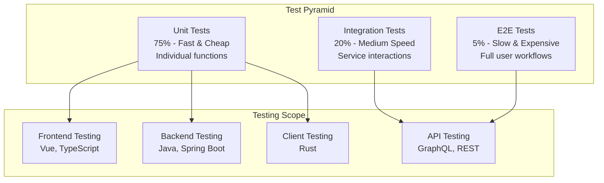

# Testing Overview

OpenFrame employs a comprehensive testing strategy covering unit tests, integration tests, end-to-end tests, and performance testing across all components of the stack.

## Testing Philosophy

OpenFrame follows the test pyramid approach with emphasis on:
- **Fast feedback loops** through comprehensive unit testing
- **Confidence in integration** through service-level testing
- **User experience validation** through E2E testing
- **Performance assurance** through load and stress testing

### Test Pyramid Structure



## Test Organization Structure

### Directory Structure

```
openframe/
├── openframe-e2e-tests/              # End-to-end test suite
│   ├── src/test/java/                # Java-based E2E tests
│   ├── cypress/                      # Frontend E2E tests
│   └── postman/                      # API testing collections
├── services/
│   ├── openframe-api/
│   │   ├── src/main/java/
│   │   └── src/test/java/            # Service unit & integration tests
│   │       ├── unit/                 # Unit tests
│   │       ├── integration/          # Integration tests
│   │       └── testcontainers/       # Container-based tests
│   ├── openframe-frontend/
│   │   ├── src/
│   │   └── tests/                    # Frontend tests
│   │       ├── unit/                 # Jest unit tests
│   │       ├── component/            # Vue component tests
│   │       └── e2e/                  # Cypress tests
└── clients/
    └── openframe-client/
        ├── src/
        └── tests/                    # Rust tests
            ├── unit/
            ├── integration/
            └── common/
```

## Backend Testing (Java/Spring Boot)

### Unit Testing

#### Technology Stack
- **JUnit 5**: Modern testing framework
- **Mockito**: Mocking framework
- **AssertJ**: Fluent assertions
- **TestNG**: Alternative testing framework for specific cases

#### Unit Test Structure

```java
@ExtendWith(MockitoExtension.class)
@DisplayName("Device Service Unit Tests")
class DeviceServiceTest {

    @Mock
    private DeviceRepository deviceRepository;
    
    @Mock
    private RedisTemplate<String, Object> redisTemplate;
    
    @InjectMocks
    private DeviceService deviceService;
    
    @Nested
    @DisplayName("Device Creation Tests")
    class DeviceCreationTests {
        
        @Test
        @DisplayName("Should create device with valid data")
        void shouldCreateDeviceWithValidData() {
            // Given
            CreateDeviceRequest request = CreateDeviceRequest.builder()
                .hostname("test-device")
                .organizationId("org-123")
                .agentId("agent-456")
                .build();
                
            Device expectedDevice = Device.builder()
                .id(UUID.randomUUID())
                .hostname("test-device")
                .organizationId("org-123")
                .createdAt(Instant.now())
                .build();
                
            when(deviceRepository.save(any(Device.class)))
                .thenReturn(expectedDevice);
            
            // When
            Device actualDevice = deviceService.createDevice(request);
            
            // Then
            assertThat(actualDevice)
                .isNotNull()
                .satisfies(device -> {
                    assertThat(device.getHostname()).isEqualTo("test-device");
                    assertThat(device.getOrganizationId()).isEqualTo("org-123");
                    assertThat(device.getCreatedAt()).isNotNull();
                });
                
            verify(deviceRepository).save(argThat(device -> 
                device.getHostname().equals("test-device") &&
                device.getOrganizationId().equals("org-123")
            ));
        }
        
        @Test
        @DisplayName("Should throw exception for duplicate hostname")
        void shouldThrowExceptionForDuplicateHostname() {
            // Given
            CreateDeviceRequest request = CreateDeviceRequest.builder()
                .hostname("existing-device")
                .organizationId("org-123")
                .build();
                
            when(deviceRepository.existsByHostnameAndOrganizationId(
                "existing-device", "org-123"))
                .thenReturn(true);
            
            // When & Then
            assertThatThrownBy(() -> deviceService.createDevice(request))
                .isInstanceOf(DeviceAlreadyExistsException.class)
                .hasMessageContaining("existing-device");
                
            verify(deviceRepository, never()).save(any(Device.class));
        }
    }
}
```

#### Running Unit Tests

```bash
# Run all unit tests
mvn test

# Run specific test class
mvn test -Dtest=DeviceServiceTest

# Run specific test method
mvn test -Dtest=DeviceServiceTest#shouldCreateDeviceWithValidData

# Run with coverage
mvn test jacoco:report

# Generate coverage report
open target/site/jacoco/index.html
```

### Integration Testing

#### Spring Boot Test Configuration

```java
@SpringBootTest(webEnvironment = SpringBootTest.WebEnvironment.RANDOM_PORT)
@Testcontainers
@DirtiesContext
@ActiveProfiles("integration-test")
class DeviceControllerIntegrationTest {

    @Container
    @ServiceConnection
    static MongoDBContainer mongoContainer = new MongoDBContainer("mongo:7")
            .withExposedPorts(27017)
            .withReuse(true);

    @Container
    @ServiceConnection  
    static GenericContainer<?> redisContainer = new GenericContainer<>("redis:7-alpine")
            .withExposedPorts(6379)
            .withReuse(true);

    @Autowired
    private TestRestTemplate restTemplate;

    @Autowired
    private DeviceRepository deviceRepository;

    @Test
    void shouldCreateAndRetrieveDevice() {
        // Given
        CreateDeviceRequest request = CreateDeviceRequest.builder()
            .hostname("integration-test-device")
            .organizationId("test-org")
            .metadata(Map.of("os", "linux", "version", "20.04"))
            .build();

        // When - Create device
        ResponseEntity<DeviceResponse> createResponse = restTemplate
            .postForEntity("/api/devices", request, DeviceResponse.class);

        // Then - Verify creation
        assertThat(createResponse.getStatusCode()).isEqualTo(HttpStatus.CREATED);
        assertThat(createResponse.getBody()).isNotNull();
        
        String deviceId = createResponse.getBody().getId();

        // When - Retrieve device
        ResponseEntity<DeviceResponse> getResponse = restTemplate
            .getForEntity("/api/devices/{id}", DeviceResponse.class, deviceId);

        // Then - Verify retrieval
        assertThat(getResponse.getStatusCode()).isEqualTo(HttpStatus.OK);
        assertThat(getResponse.getBody())
            .satisfies(device -> {
                assertThat(device.getId()).isEqualTo(deviceId);
                assertThat(device.getHostname()).isEqualTo("integration-test-device");
                assertThat(device.getMetadata()).containsEntry("os", "linux");
            });
    }
}
```

#### Database Testing

```java
@DataMongoTest
@Testcontainers
class DeviceRepositoryTest {

    @Container
    @ServiceConnection
    static MongoDBContainer mongoContainer = new MongoDBContainer("mongo:7");

    @Autowired
    private TestEntityManager entityManager;

    @Autowired
    private DeviceRepository deviceRepository;

    @Test
    void shouldFindDevicesByOrganization() {
        // Given
        Device device1 = createDevice("device-1", "org-1");
        Device device2 = createDevice("device-2", "org-1");
        Device device3 = createDevice("device-3", "org-2");

        deviceRepository.saveAll(List.of(device1, device2, device3));

        // When
        List<Device> org1Devices = deviceRepository
            .findByOrganizationId("org-1");

        // Then
        assertThat(org1Devices)
            .hasSize(2)
            .extracting(Device::getHostname)
            .containsExactlyInAnyOrder("device-1", "device-2");
    }
    
    private Device createDevice(String hostname, String orgId) {
        return Device.builder()
            .hostname(hostname)
            .organizationId(orgId)
            .createdAt(Instant.now())
            .build();
    }
}
```

### GraphQL Testing

```java
@SpringBootTest
@AutoConfigureTestDatabase(replace = AutoConfigureTestDatabase.Replace.NONE)
@Testcontainers
class DeviceDataFetcherIntegrationTest {

    @Container
    @ServiceConnection
    static MongoDBContainer mongoContainer = new MongoDBContainer("mongo:7");

    @Autowired
    private DgsQueryExecutor queryExecutor;

    @Test
    void shouldFetchDevicesWithMetrics() {
        // Given
        String query = """
            query GetDevices($orgId: String!) {
                devices(organizationId: $orgId) {
                    edges {
                        node {
                            id
                            hostname
                            status
                            metrics {
                                cpuUsage
                                memoryUsage
                                diskUsage
                            }
                        }
                    }
                }
            }
            """;

        Map<String, Object> variables = Map.of("orgId", "test-org");

        // When
        ExecutionResult result = queryExecutor.executeAndExtractJsonPath(
            query, 
            "data.devices.edges", 
            variables
        );

        // Then
        assertThat(result.getErrors()).isEmpty();
        List<Object> devices = result.getData();
        assertThat(devices).isNotEmpty();
    }
}
```

## Frontend Testing (Vue.js/TypeScript)

### Unit Testing with Vitest

#### Component Testing

```typescript
// tests/unit/DeviceCard.test.ts
import { describe, it, expect, vi } from 'vitest'
import { mount } from '@vue/test-utils'
import { createTestingPinia } from '@pinia/testing'
import DeviceCard from '@/components/devices/DeviceCard.vue'
import type { Device } from '@/types/device'

describe('DeviceCard.vue', () => {
  const mockDevice: Device = {
    id: '123',
    hostname: 'test-device',
    status: 'online',
    organizationId: 'org-1',
    lastSeen: new Date().toISOString(),
    metadata: {
      os: 'Linux',
      version: '20.04'
    }
  }

  it('renders device information correctly', () => {
    const wrapper = mount(DeviceCard, {
      props: { device: mockDevice },
      global: {
        plugins: [createTestingPinia({
          createSpy: vi.fn
        })]
      }
    })

    expect(wrapper.find('[data-testid="device-hostname"]').text())
      .toBe('test-device')
    expect(wrapper.find('[data-testid="device-status"]').text())
      .toBe('online')
    expect(wrapper.find('[data-testid="device-os"]').text())
      .toBe('Linux')
  })

  it('emits edit event when edit button is clicked', async () => {
    const wrapper = mount(DeviceCard, {
      props: { device: mockDevice },
      global: {
        plugins: [createTestingPinia()]
      }
    })

    await wrapper.find('[data-testid="edit-button"]').trigger('click')

    expect(wrapper.emitted('edit')).toBeTruthy()
    expect(wrapper.emitted('edit')![0]).toEqual([mockDevice])
  })
})
```

#### Store Testing

```typescript
// tests/unit/stores/deviceStore.test.ts
import { describe, it, expect, beforeEach, vi } from 'vitest'
import { setActivePinia, createPinia } from 'pinia'
import { useDeviceStore } from '@/stores/deviceStore'
import * as api from '@/services/api'

// Mock API calls
vi.mock('@/services/api')
const mockedApi = vi.mocked(api)

describe('Device Store', () => {
  beforeEach(() => {
    setActivePinia(createPinia())
    vi.clearAllMocks()
  })

  it('fetches devices successfully', async () => {
    // Given
    const mockDevices = [
      { id: '1', hostname: 'device-1', status: 'online' },
      { id: '2', hostname: 'device-2', status: 'offline' }
    ]
    
    mockedApi.getDevices.mockResolvedValue({
      data: { devices: { edges: mockDevices.map(device => ({ node: device })) } }
    })

    const store = useDeviceStore()

    // When
    await store.fetchDevices('org-1')

    // Then
    expect(store.devices).toHaveLength(2)
    expect(store.devices[0].hostname).toBe('device-1')
    expect(store.loading).toBe(false)
    expect(mockedApi.getDevices).toHaveBeenCalledWith('org-1')
  })

  it('handles fetch error gracefully', async () => {
    // Given
    const errorMessage = 'Network error'
    mockedApi.getDevices.mockRejectedValue(new Error(errorMessage))

    const store = useDeviceStore()

    // When
    await store.fetchDevices('org-1')

    // Then
    expect(store.devices).toHaveLength(0)
    expect(store.error).toBe(errorMessage)
    expect(store.loading).toBe(false)
  })
})
```

#### Running Frontend Tests

```bash
# Navigate to frontend directory
cd openframe/services/openframe-frontend

# Install dependencies
npm install

# Run unit tests
npm run test:unit

# Run tests with coverage
npm run test:unit -- --coverage

# Run tests in watch mode
npm run test:watch

# Run specific test file
npm run test:unit -- DeviceCard.test.ts

# Generate coverage report
npm run coverage:report
open coverage/index.html
```

### E2E Testing with Cypress

```typescript
// tests/e2e/devices.cy.ts
describe('Device Management', () => {
  beforeEach(() => {
    // Login before each test
    cy.login('admin@demo.msp', 'password')
    cy.visit('/devices')
  })

  it('should display device list', () => {
    cy.get('[data-testid="devices-table"]').should('be.visible')
    cy.get('[data-testid="device-row"]').should('have.length.at.least', 1)
  })

  it('should create new device', () => {
    cy.get('[data-testid="add-device-button"]').click()
    
    cy.get('[data-testid="device-hostname-input"]')
      .type('cypress-test-device')
    cy.get('[data-testid="device-organization-select"]')
      .select('Demo MSP')
    cy.get('[data-testid="save-device-button"]').click()
    
    cy.get('[data-testid="success-message"]')
      .should('contain', 'Device created successfully')
    cy.get('[data-testid="devices-table"]')
      .should('contain', 'cypress-test-device')
  })

  it('should edit existing device', () => {
    cy.get('[data-testid="device-row"]').first().within(() => {
      cy.get('[data-testid="edit-button"]').click()
    })
    
    cy.get('[data-testid="device-hostname-input"]')
      .clear()
      .type('updated-device-name')
    cy.get('[data-testid="save-device-button"]').click()
    
    cy.get('[data-testid="success-message"]')
      .should('contain', 'Device updated successfully')
  })

  it('should delete device', () => {
    cy.get('[data-testid="device-row"]').first().within(() => {
      cy.get('[data-testid="delete-button"]').click()
    })
    
    cy.get('[data-testid="confirm-delete-button"]').click()
    
    cy.get('[data-testid="success-message"]')
      .should('contain', 'Device deleted successfully')
  })
})
```

#### Custom Cypress Commands

```typescript
// cypress/support/commands.ts
declare global {
  namespace Cypress {
    interface Chainable {
      login(email: string, password: string): Chainable<void>
      seedDatabase(): Chainable<void>
      cleanupTestData(): Chainable<void>
    }
  }
}

Cypress.Commands.add('login', (email: string, password: string) => {
  cy.session([email, password], () => {
    cy.visit('/auth/login')
    cy.get('[data-testid="email-input"]').type(email)
    cy.get('[data-testid="password-input"]').type(password)
    cy.get('[data-testid="login-button"]').click()
    cy.url().should('include', '/dashboard')
  })
})

Cypress.Commands.add('seedDatabase', () => {
  cy.task('seedDatabase')
})

Cypress.Commands.add('cleanupTestData', () => {
  cy.task('cleanupTestData')
})
```

## Rust Client Testing

### Unit Tests

```rust
// clients/openframe-client/tests/unit/device_service_test.rs
use openframe_client::services::DeviceService;
use openframe_client::models::{Device, DeviceMetrics};
use tokio_test;

#[tokio::test]
async fn test_collect_device_info() {
    // Given
    let device_service = DeviceService::new();
    
    // When
    let device_info = device_service.collect_device_info().await;
    
    // Then
    assert!(device_info.is_ok());
    let device = device_info.unwrap();
    assert!(!device.hostname.is_empty());
    assert!(!device.operating_system.is_empty());
    assert!(device.total_memory > 0);
}

#[tokio::test]
async fn test_collect_performance_metrics() {
    // Given
    let device_service = DeviceService::new();
    
    // When
    let metrics = device_service.collect_metrics().await;
    
    // Then
    assert!(metrics.is_ok());
    let device_metrics = metrics.unwrap();
    assert!(device_metrics.cpu_usage >= 0.0 && device_metrics.cpu_usage <= 100.0);
    assert!(device_metrics.memory_usage >= 0.0 && device_metrics.memory_usage <= 100.0);
    assert!(device_metrics.disk_usage >= 0.0 && device_metrics.disk_usage <= 100.0);
}

#[test]
fn test_device_serialization() {
    // Given
    let device = Device {
        id: "test-device".to_string(),
        hostname: "test-host".to_string(),
        operating_system: "Linux".to_string(),
        total_memory: 8192,
        total_disk: 512000,
    };
    
    // When
    let json = serde_json::to_string(&device);
    
    // Then
    assert!(json.is_ok());
    let serialized = json.unwrap();
    assert!(serialized.contains("test-device"));
    assert!(serialized.contains("test-host"));
}
```

### Integration Tests

```rust
// clients/openframe-client/tests/integration/api_client_test.rs
use openframe_client::clients::ApiClient;
use openframe_client::models::{AuthRequest, DeviceRegistrationRequest};
use std::env;

#[tokio::test]
async fn test_authenticate_with_server() {
    // Skip if no test server configured
    let base_url = env::var("TEST_SERVER_URL")
        .unwrap_or_else(|_| "http://localhost:8080".to_string());
    
    let client = ApiClient::new(&base_url);
    
    let auth_request = AuthRequest {
        client_id: "test-client".to_string(),
        client_secret: "test-secret".to_string(),
    };
    
    // This test requires a running OpenFrame instance
    let result = client.authenticate(auth_request).await;
    
    // Assert based on expected test environment
    if env::var("CI").is_ok() {
        // In CI, we might mock this or skip
        println!("Skipping integration test in CI");
    } else {
        assert!(result.is_ok() || result.is_err()); // Either works for test
    }
}

#[tokio::test]
async fn test_device_registration_flow() {
    let client = ApiClient::new("http://localhost:8080");
    
    // First authenticate
    let auth_result = client.authenticate(AuthRequest {
        client_id: "test-client".to_string(),
        client_secret: "test-secret".to_string(),
    }).await;
    
    if auth_result.is_ok() {
        let registration_request = DeviceRegistrationRequest {
            hostname: "rust-test-device".to_string(),
            operating_system: std::env::consts::OS.to_string(),
            agent_version: "1.0.0".to_string(),
        };
        
        let registration_result = client.register_device(registration_request).await;
        
        // Verify registration succeeded or handle expected errors
        match registration_result {
            Ok(response) => {
                assert!(!response.device_id.is_empty());
                assert!(!response.api_key.is_empty());
            }
            Err(e) => {
                // Log error for debugging but don't fail test
                println!("Registration error (expected in test): {}", e);
            }
        }
    }
}
```

#### Running Rust Tests

```bash
# Navigate to client directory
cd clients/openframe-client

# Run all tests
cargo test

# Run specific test module
cargo test device_service

# Run with output
cargo test -- --nocapture

# Run integration tests only
cargo test --test integration

# Run with coverage (requires cargo-tarpaulin)
cargo install cargo-tarpaulin
cargo tarpaulin --out Html
open tarpaulin-report.html
```

## API Testing

### GraphQL Testing

```javascript
// tests/api/graphql/devices.test.js
const { request, gql } = require('graphql-request')

const GRAPHQL_ENDPOINT = process.env.GRAPHQL_ENDPOINT || 'http://localhost:8080/graphql'

describe('Device GraphQL API', () => {
  let authToken

  beforeAll(async () => {
    // Authenticate and get token
    const loginMutation = gql`
      mutation Login($email: String!, $password: String!) {
        login(email: $email, password: $password) {
          token
          user {
            id
            email
          }
        }
      }
    `

    const loginResponse = await request(GRAPHQL_ENDPOINT, loginMutation, {
      email: 'admin@demo.msp',
      password: 'password'
    })

    authToken = loginResponse.login.token
  })

  test('should fetch devices for organization', async () => {
    const query = gql`
      query GetDevices($organizationId: String!) {
        devices(organizationId: $organizationId) {
          edges {
            node {
              id
              hostname
              status
              lastSeen
              metrics {
                cpuUsage
                memoryUsage
              }
            }
          }
          pageInfo {
            hasNextPage
            hasPreviousPage
          }
        }
      }
    `

    const response = await request(
      GRAPHQL_ENDPOINT,
      query,
      { organizationId: 'demo-org' },
      { Authorization: `Bearer ${authToken}` }
    )

    expect(response.devices).toBeDefined()
    expect(response.devices.edges).toBeInstanceOf(Array)
    
    if (response.devices.edges.length > 0) {
      const device = response.devices.edges[0].node
      expect(device.id).toBeDefined()
      expect(device.hostname).toBeDefined()
      expect(device.status).toMatch(/online|offline|unknown/)
    }
  })

  test('should create new device', async () => {
    const mutation = gql`
      mutation CreateDevice($input: CreateDeviceInput!) {
        createDevice(input: $input) {
          id
          hostname
          organizationId
          createdAt
        }
      }
    `

    const input = {
      hostname: 'api-test-device',
      organizationId: 'demo-org',
      agentId: 'test-agent-123',
      metadata: {
        os: 'Linux',
        version: '20.04'
      }
    }

    const response = await request(
      GRAPHQL_ENDPOINT,
      mutation,
      { input },
      { Authorization: `Bearer ${authToken}` }
    )

    expect(response.createDevice).toBeDefined()
    expect(response.createDevice.hostname).toBe('api-test-device')
    expect(response.createDevice.id).toBeDefined()
  })
})
```

### REST API Testing

```bash
# Postman/Newman collection runner
newman run postman/OpenFrame_API_Collection.json \
  --environment postman/Development_Environment.json \
  --reporters cli,json \
  --reporter-json-export test-results.json
```

## Performance Testing

### Load Testing with K6

```javascript
// tests/performance/device-load-test.js
import http from 'k6/http'
import { check, sleep } from 'k6'
import { Rate } from 'k6/metrics'

export let errorRate = new Rate('errors')

export let options = {
  stages: [
    { duration: '2m', target: 100 }, // Ramp up to 100 users
    { duration: '5m', target: 100 }, // Stay at 100 users
    { duration: '2m', target: 200 }, // Ramp up to 200 users  
    { duration: '5m', target: 200 }, // Stay at 200 users
    { duration: '2m', target: 0 },   // Ramp down
  ],
  thresholds: {
    http_req_duration: ['p(99)<500'], // 99% of requests under 500ms
    http_req_failed: ['rate<0.01'],   // Error rate under 1%
    errors: ['rate<0.01']
  }
}

export default function () {
  // GraphQL query for devices
  const query = `
    query GetDevices {
      devices {
        edges {
          node {
            id
            hostname
            status
          }
        }
      }
    }
  `

  const payload = JSON.stringify({ query })
  const params = {
    headers: {
      'Content-Type': 'application/json',
      'Authorization': `Bearer ${__ENV.AUTH_TOKEN}`
    }
  }

  const response = http.post('http://localhost:8080/graphql', payload, params)
  
  const checkResult = check(response, {
    'GraphQL response is 200': (r) => r.status === 200,
    'Response contains data': (r) => {
      try {
        const json = JSON.parse(r.body)
        return json.data && json.data.devices
      } catch (e) {
        return false
      }
    },
    'Response time < 500ms': (r) => r.timings.duration < 500
  })

  errorRate.add(!checkResult)
  sleep(1)
}
```

#### Running Performance Tests

```bash
# Install k6
# macOS
brew install k6

# Ubuntu
sudo apt-key adv --keyserver hkp://keyserver.ubuntu.com:80 --recv-keys 379CE192D401AB61
echo "deb https://dl.bintray.com/loadimpact/deb stable main" | sudo tee -a /etc/apt/sources.list
sudo apt-get update
sudo apt-get install k6

# Run performance tests
k6 run tests/performance/device-load-test.js

# Run with environment variables
AUTH_TOKEN=your_test_token k6 run tests/performance/device-load-test.js

# Generate HTML report
k6 run --out json=results.json tests/performance/device-load-test.js
```

## Test Data Management

### Database Seeding

```java
// Test data seeder for integration tests
@Component
@Profile("test")
public class TestDataSeeder {

    @Autowired
    private OrganizationRepository organizationRepository;
    
    @Autowired
    private DeviceRepository deviceRepository;
    
    @Autowired
    private UserRepository userRepository;

    @PostConstruct
    public void seedTestData() {
        createTestOrganizations();
        createTestUsers();
        createTestDevices();
    }

    private void createTestOrganizations() {
        Organization demoOrg = Organization.builder()
            .id("demo-org")
            .name("Demo MSP")
            .domain("demo.msp")
            .createdAt(Instant.now())
            .build();
            
        organizationRepository.save(demoOrg);
    }

    private void createTestDevices() {
        List<Device> testDevices = IntStream.range(1, 11)
            .mapToObj(i -> Device.builder()
                .hostname("test-device-" + i)
                .organizationId("demo-org")
                .status(i % 2 == 0 ? "online" : "offline")
                .createdAt(Instant.now())
                .metadata(Map.of(
                    "os", i % 2 == 0 ? "Linux" : "Windows",
                    "version", "1.0." + i
                ))
                .build())
            .collect(Collectors.toList());
            
        deviceRepository.saveAll(testDevices);
    }
}
```

### Test Cleanup

```java
@TestMethodOrder(OrderAnnotation.class)
class IntegrationTestsWithCleanup {

    @Autowired
    private MongoTemplate mongoTemplate;

    @AfterEach
    void cleanup() {
        // Clean up test data after each test
        mongoTemplate.getCollectionNames()
            .forEach(collection -> {
                if (!collection.startsWith("system.")) {
                    mongoTemplate.remove(Query.query(
                        Criteria.where("testData").is(true)), collection);
                }
            });
    }
}
```

## Continuous Integration Testing

### GitHub Actions Workflow

```yaml
# .github/workflows/test.yml
name: Test Suite

on:
  push:
    branches: [ main, develop ]
  pull_request:
    branches: [ main ]

jobs:
  backend-tests:
    runs-on: ubuntu-latest
    
    services:
      mongodb:
        image: mongo:7
        ports:
          - 27017:27017
      redis:
        image: redis:7-alpine
        ports:
          - 6379:6379

    steps:
      - uses: actions/checkout@v4
      
      - name: Set up JDK 21
        uses: actions/setup-java@v4
        with:
          java-version: '21'
          distribution: 'temurin'
          
      - name: Cache Maven dependencies
        uses: actions/cache@v3
        with:
          path: ~/.m2
          key: ${{ runner.os }}-m2-${{ hashFiles('**/pom.xml') }}
          
      - name: Run backend tests
        run: |
          mvn clean test
          mvn jacoco:report
          
      - name: Upload coverage to Codecov
        uses: codecov/codecov-action@v3
        with:
          file: ./target/site/jacoco/jacoco.xml

  frontend-tests:
    runs-on: ubuntu-latest
    
    steps:
      - uses: actions/checkout@v4
      
      - name: Setup Node.js
        uses: actions/setup-node@v4
        with:
          node-version: '18'
          cache: 'npm'
          cache-dependency-path: openframe/services/openframe-frontend/package-lock.json
          
      - name: Install dependencies
        run: |
          cd openframe/services/openframe-frontend
          npm ci
          
      - name: Run frontend tests
        run: |
          cd openframe/services/openframe-frontend
          npm run test:unit -- --coverage
          npm run type-check
          
      - name: Upload frontend coverage
        uses: codecov/codecov-action@v3
        with:
          file: ./openframe/services/openframe-frontend/coverage/lcov.info

  rust-tests:
    runs-on: ubuntu-latest
    
    steps:
      - uses: actions/checkout@v4
      
      - name: Setup Rust
        uses: actions-rs/toolchain@v1
        with:
          toolchain: stable
          components: clippy, rustfmt
          
      - name: Cache Rust dependencies
        uses: actions/cache@v3
        with:
          path: |
            ~/.cargo/registry
            ~/.cargo/git
            clients/openframe-client/target
          key: ${{ runner.os }}-cargo-${{ hashFiles('**/Cargo.lock') }}
          
      - name: Run Rust tests
        run: |
          cd clients/openframe-client
          cargo test
          cargo clippy -- -D warnings
          cargo fmt -- --check

  e2e-tests:
    runs-on: ubuntu-latest
    needs: [backend-tests, frontend-tests]
    
    steps:
      - uses: actions/checkout@v4
      
      - name: Setup test environment
        run: |
          docker-compose -f docker-compose.test.yml up -d
          
      - name: Wait for services
        run: |
          timeout 300 bash -c 'until curl -f http://localhost:8080/actuator/health; do sleep 5; done'
          
      - name: Run E2E tests
        run: |
          cd openframe-e2e-tests
          mvn test
```

## Test Coverage and Quality

### Coverage Requirements

| Component | Minimum Coverage | Target Coverage |
|-----------|------------------|-----------------|
| **Backend Services** | 80% | 90% |
| **Frontend Components** | 75% | 85% |
| **Rust Client** | 70% | 80% |
| **GraphQL Resolvers** | 85% | 95% |

### Quality Gates

```yaml
# sonar-project.properties
sonar.organization=openframe
sonar.projectKey=openframe
sonar.projectName=OpenFrame
sonar.projectVersion=1.0

# Coverage exclusions
sonar.coverage.exclusions=**/test/**,**/dto/**,**/config/**

# Quality gate conditions
sonar.qualitygate.wait=true
sonar.coverage.jacoco.xmlReportPaths=target/site/jacoco/jacoco.xml

# Test execution reports
sonar.junit.reportPaths=target/surefire-reports
sonar.testExecutionReportPaths=target/test-results.xml
```

## Testing Best Practices

### General Guidelines

1. **Test Naming**: Use descriptive test names that explain the scenario
2. **Test Structure**: Follow Arrange-Act-Assert (AAA) pattern
3. **Test Independence**: Each test should be independent and repeatable
4. **Test Data**: Use builders and factories for consistent test data
5. **Mocking**: Mock external dependencies, test real business logic

### Backend Testing Best Practices

```java
// Good: Descriptive test name and clear structure
@Test
@DisplayName("Should throw DeviceNotFoundException when device does not exist")
void shouldThrowDeviceNotFoundExceptionWhenDeviceDoesNotExist() {
    // Arrange
    String nonExistentDeviceId = "non-existent-id";
    when(deviceRepository.findById(nonExistentDeviceId))
        .thenReturn(Optional.empty());
    
    // Act & Assert
    assertThatThrownBy(() -> deviceService.getDevice(nonExistentDeviceId))
        .isInstanceOf(DeviceNotFoundException.class)
        .hasMessageContaining(nonExistentDeviceId);
}

// Good: Using test data builders
Device testDevice = DeviceTestDataBuilder.aDevice()
    .withHostname("test-device")
    .withOrganization("test-org")
    .withStatus("online")
    .build();
```

### Frontend Testing Best Practices

```typescript
// Good: Component testing with realistic props
it('should display device status correctly', () => {
  const device = createMockDevice({
    status: 'online',
    lastSeen: new Date().toISOString()
  })
  
  const wrapper = mount(DeviceCard, {
    props: { device },
    global: {
      plugins: [createTestingPinia()]
    }
  })
  
  expect(wrapper.find('[data-testid="status-indicator"]'))
    .toHaveClass('status-online')
})

// Good: Store testing with proper mocking
it('should handle API errors gracefully', async () => {
  const consoleSpy = vi.spyOn(console, 'error').mockImplementation(() => {})
  mockedApi.getDevices.mockRejectedValue(new Error('API Error'))
  
  const store = useDeviceStore()
  await store.fetchDevices()
  
  expect(store.error).toBe('API Error')
  expect(consoleSpy).toHaveBeenCalled()
  
  consoleSpy.mockRestore()
})
```

This comprehensive testing strategy ensures OpenFrame maintains high quality and reliability across all components while supporting rapid development and deployment cycles.