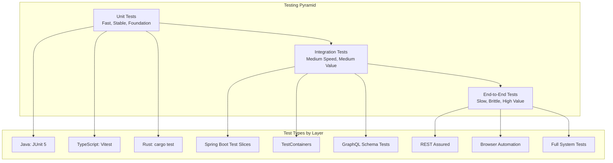

# Testing Overview

OpenFrame employs a comprehensive testing strategy that spans multiple layers, from unit tests to end-to-end integration tests. This document outlines our testing philosophy, frameworks, and best practices.

## Testing Philosophy

OpenFrame follows the **Testing Pyramid** approach, emphasizing:

1. **Fast, Reliable Unit Tests** (Foundation)
2. **Focused Integration Tests** (Service boundaries)
3. **Critical Path E2E Tests** (User journeys)
4. **Performance & Load Tests** (Non-functional requirements)



## Testing Frameworks and Tools

### Backend Testing (Java/Spring Boot)

#### Core Frameworks
| Framework | Version | Purpose |
|-----------|---------|---------|
| **JUnit 5** | 5.10+ | Unit and integration test framework |
| **Mockito** | 5.x | Mocking and stubbing |
| **AssertJ** | 3.24+ | Fluent assertion library |
| **TestContainers** | 1.19+ | Integration testing with real databases |
| **WireMock** | 3.x | HTTP service mocking |
| **REST Assured** | 5.x | API testing |

#### Test Configuration
```java
// Base test configuration
@SpringBootTest(webEnvironment = SpringBootTest.WebEnvironment.RANDOM_PORT)
@TestPropertySource(properties = {
    "spring.profiles.active=test",
    "spring.data.mongodb.database=openframe_test"
})
@Testcontainers
class BaseIntegrationTest {
    
    @Container
    static MongoDBContainer mongodb = new MongoDBContainer("mongo:7.0")
            .withExposedPorts(27017);
    
    @Container  
    static GenericContainer<?> redis = new GenericContainer<>("redis:7.0")
            .withExposedPorts(6379);
}
```

### Frontend Testing (Vue 3/TypeScript)

#### Core Frameworks
| Framework | Version | Purpose |
|-----------|---------|---------|
| **Vitest** | 1.x | Fast unit test runner (Vite-based) |
| **Vue Test Utils** | 2.x | Vue component testing utilities |
| **Testing Library** | 14.x | Component testing best practices |
| **MSW** | 2.x | API mocking for tests |
| **Playwright** | 1.40+ | E2E browser automation |

#### Test Configuration
```typescript
// vitest.config.ts
import { defineConfig } from 'vitest/config'
import vue from '@vitejs/plugin-vue'

export default defineConfig({
  plugins: [vue()],
  test: {
    globals: true,
    environment: 'jsdom',
    setupFiles: ['./src/test/setup.ts']
  }
})
```

### Agent Testing (Rust)

#### Core Frameworks
| Framework | Purpose |
|-----------|---------|
| **Built-in test** | Standard Rust testing framework |
| **mockall** | Mock object generation |
| **tokio-test** | Async testing utilities |
| **wiremock** | HTTP service mocking |

## Testing Strategy by Layer

### Unit Testing

#### Java Service Unit Tests
**Purpose**: Test individual classes and methods in isolation
**Scope**: Business logic, utilities, data transformations

```java
@ExtendWith(MockitoExtension.class)
class DeviceServiceTest {
    
    @Mock
    private DeviceRepository deviceRepository;
    
    @Mock
    private EventPublisher eventPublisher;
    
    @InjectMocks
    private DeviceService deviceService;
    
    @Test
    @DisplayName("Should create device and publish creation event")
    void shouldCreateDeviceAndPublishEvent() {
        // Given
        CreateDeviceRequest request = CreateDeviceRequest.builder()
            .name("Test Device")
            .type(DeviceType.DESKTOP)
            .organizationId("org123")
            .build();
        
        Device savedDevice = Device.builder()
            .id("device123")
            .name("Test Device")
            .status(DeviceStatus.ONLINE)
            .build();
        
        when(deviceRepository.save(any(Device.class)))
            .thenReturn(savedDevice);
        
        // When
        Device result = deviceService.createDevice(request);
        
        // Then
        assertThat(result)
            .isNotNull()
            .hasFieldOrPropertyWithValue("name", "Test Device")
            .hasFieldOrPropertyWithValue("status", DeviceStatus.ONLINE);
        
        verify(eventPublisher).publishEvent(any(DeviceCreatedEvent.class));
    }
}
```

#### Frontend Component Unit Tests
**Purpose**: Test Vue components in isolation
**Scope**: Component behavior, props, events, computed properties

```typescript
import { describe, it, expect } from 'vitest'
import { mount } from '@vue/test-utils'
import DeviceCard from '@/components/DeviceCard.vue'
import type { Device } from '@/types/device'

describe('DeviceCard', () => {
  const mockDevice: Device = {
    id: 'device-1',
    name: 'Test Device',
    status: 'online',
    type: 'desktop',
    lastSeen: new Date().toISOString()
  }

  it('renders device information correctly', () => {
    const wrapper = mount(DeviceCard, {
      props: { device: mockDevice }
    })

    expect(wrapper.text()).toContain('Test Device')
    expect(wrapper.find('[data-testid="device-status"]')).toBeTruthy()
    expect(wrapper.classes()).toContain('device-card--online')
  })

  it('emits click event when card is clicked', async () => {
    const wrapper = mount(DeviceCard, {
      props: { device: mockDevice }
    })

    await wrapper.trigger('click')

    expect(wrapper.emitted('click')).toBeTruthy()
    expect(wrapper.emitted('click')?.[0]).toEqual([mockDevice])
  })
})
```

#### Rust Agent Unit Tests
**Purpose**: Test agent logic, communication protocols, system interactions

```rust
#[cfg(test)]
mod tests {
    use super::*;
    use mockall::predicate::*;
    use tokio_test;

    #[tokio::test]
    async fn should_send_heartbeat_on_schedule() {
        // Given
        let mut mock_client = MockApiClient::new();
        mock_client
            .expect_send_heartbeat()
            .with(eq(HeartbeatMessage {
                device_id: "test-device".to_string(),
                timestamp: anything(),
                status: DeviceStatus::Online,
            }))
            .times(1)
            .returning(|_| Ok(()));

        let agent = Agent::new(mock_client);

        // When
        agent.send_heartbeat().await.unwrap();

        // Then - verified by mock expectations
    }
}
```

### Integration Testing

#### Database Integration Tests
**Purpose**: Test data layer with real databases
**Scope**: Repository methods, data mapping, database constraints

```java
@DataMongoTest
@Testcontainers
class DeviceRepositoryTest {
    
    @Container
    static MongoDBContainer mongodb = new MongoDBContainer("mongo:7.0");
    
    @Autowired
    private DeviceRepository deviceRepository;
    
    @Test
    void shouldFindDevicesByOrganizationId() {
        // Given
        Device device1 = createTestDevice("org1", "Device 1");
        Device device2 = createTestDevice("org1", "Device 2");
        Device device3 = createTestDevice("org2", "Device 3");
        
        deviceRepository.saveAll(List.of(device1, device2, device3));
        
        // When
        List<Device> result = deviceRepository.findByOrganizationId("org1");
        
        // Then
        assertThat(result)
            .hasSize(2)
            .extracting(Device::getName)
            .containsExactlyInAnyOrder("Device 1", "Device 2");
    }
}
```

#### GraphQL Integration Tests
**Purpose**: Test GraphQL schema, resolvers, and data fetching
**Scope**: Query execution, data validation, authorization

```java
@SpringBootTest
@AutoConfigureTestDatabase(replace = AutoConfigureTestDatabase.Replace.NONE)
@Testcontainers
class DeviceGraphQLTest {
    
    @Autowired
    private DgsQueryExecutor dgsQueryExecutor;
    
    @Test
    void shouldQueryDevicesWithFilters() {
        // Given
        String query = """
            query {
              devices(filter: { organizationId: "org1", status: ONLINE }) {
                id
                name
                status
                organization {
                  name
                }
              }
            }
            """;
        
        // When
        ExecutionResult result = dgsQueryExecutor.execute(query);
        
        // Then
        assertThat(result.getErrors()).isEmpty();
        
        List<Map<String, Object>> devices = result.getData();
        assertThat(devices)
            .hasSizeGreaterThan(0)
            .allMatch(device -> 
                "org1".equals(((Map<?, ?>) device.get("organization")).get("id")));
    }
}
```

#### API Integration Tests  
**Purpose**: Test REST endpoints with full Spring context
**Scope**: HTTP handling, JSON serialization, error handling

```java
@SpringBootTest(webEnvironment = SpringBootTest.WebEnvironment.RANDOM_PORT)
@AutoConfigureTestDatabase(replace = AutoConfigureTestDatabase.Replace.NONE)
class DeviceControllerTest {
    
    @Autowired
    private TestRestTemplate restTemplate;
    
    @Test
    void shouldCreateDeviceAndReturnCreated() {
        // Given
        CreateDeviceRequest request = CreateDeviceRequest.builder()
            .name("Integration Test Device")
            .type(DeviceType.DESKTOP)
            .organizationId("org1")
            .build();
        
        // When
        ResponseEntity<Device> response = restTemplate.postForEntity(
            "/api/devices", 
            request, 
            Device.class
        );
        
        // Then
        assertThat(response.getStatusCode()).isEqualTo(HttpStatus.CREATED);
        assertThat(response.getBody())
            .isNotNull()
            .hasFieldOrPropertyWithValue("name", "Integration Test Device");
    }
}
```

### End-to-End Testing

#### Full System E2E Tests
**Purpose**: Test complete user workflows across all services
**Scope**: Authentication, business processes, data consistency

```java
@SpringBootTest
@TestMethodOrder(OrderAnnotation.class)
class UserWorkflowE2ETest extends BaseE2ETest {
    
    @Test
    @Order(1)
    void shouldRegisterOrganizationAndUser() {
        // Given - Organization registration data
        
        // When - Register organization
        given()
            .contentType(ContentType.JSON)
            .body(registrationRequest)
        .when()
            .post("/api/auth/register")
        .then()
            .statusCode(201)
            .body("email", equalTo("admin@testorg.com"))
            .body("organization.name", equalTo("Test Organization"));
    }
    
    @Test 
    @Order(2)
    void shouldLoginAndAccessDashboard() {
        // Given - Valid credentials
        
        // When - Login
        String authToken = given()
            .contentType(ContentType.JSON)
            .body(loginRequest)
        .when()
            .post("/api/auth/login")
        .then()
            .statusCode(200)
            .extract()
            .cookie("auth_token");
        
        // When - Access dashboard
        given()
            .cookie("auth_token", authToken)
        .when()
            .get("/api/dashboard")
        .then()
            .statusCode(200)
            .body("deviceCount", greaterThanOrEqualTo(0))
            .body("organizationName", equalTo("Test Organization"));
    }
    
    @Test
    @Order(3) 
    void shouldAddDeviceAndReceiveHeartbeat() {
        // Test device registration and monitoring flow
    }
}
```

#### Frontend E2E Tests (Playwright)
**Purpose**: Test user interface and user interactions
**Scope**: Browser behavior, UI workflows, accessibility

```typescript
import { test, expect } from '@playwright/test'

test.describe('Device Management', () => {
  test.beforeEach(async ({ page }) => {
    // Login with test user
    await page.goto('/auth/login')
    await page.fill('[data-testid="email"]', 'test@example.com')
    await page.fill('[data-testid="password"]', 'password123')
    await page.click('[data-testid="login-button"]')
    await expect(page).toHaveURL('/dashboard')
  })

  test('should display devices list', async ({ page }) => {
    await page.goto('/devices')
    
    // Wait for devices to load
    await expect(page.locator('[data-testid="devices-table"]')).toBeVisible()
    
    // Verify table headers
    await expect(page.locator('th:has-text("Name")')).toBeVisible()
    await expect(page.locator('th:has-text("Status")')).toBeVisible()
    await expect(page.locator('th:has-text("Organization")')).toBeVisible()
  })

  test('should add new device', async ({ page }) => {
    await page.goto('/devices')
    await page.click('[data-testid="add-device-button"]')
    
    // Fill device form
    await page.fill('[data-testid="device-name"]', 'E2E Test Device')
    await page.selectOption('[data-testid="device-type"]', 'desktop')
    await page.selectOption('[data-testid="organization"]', 'test-org')
    
    await page.click('[data-testid="save-device"]')
    
    // Verify device appears in list
    await expect(page.locator('text=E2E Test Device')).toBeVisible()
  })
})
```

## Test Configuration

### Test Profiles and Properties

#### Application Test Configuration
```yaml
# application-test.yml
spring:
  profiles:
    active: test
  
  datasource:
    mongodb:
      database: openframe_test
  
  redis:
    host: localhost
    port: 6379
    database: 1  # Separate database for tests
  
  kafka:
    bootstrap-servers: localhost:9092
    consumer:
      group-id: test-group
    producer:
      retries: 0

logging:
  level:
    com.openframe: DEBUG
    org.springframework.test: DEBUG

openframe:
  security:
    jwt:
      secret: test-secret-key
  features:
    enable-auth: false  # Disable for some integration tests
```

#### Test Data Management
```java
@TestConfiguration
public class TestDataConfig {
    
    @Bean
    @Primary
    public Clock testClock() {
        return Clock.fixed(
            Instant.parse("2024-01-01T12:00:00Z"),
            ZoneOffset.UTC
        );
    }
    
    @Bean
    public TestDataBuilder testDataBuilder() {
        return new TestDataBuilder(testClock());
    }
}

@Component
public class TestDataBuilder {
    
    public Device.DeviceBuilder defaultDevice() {
        return Device.builder()
            .id(UUID.randomUUID().toString())
            .name("Test Device")
            .type(DeviceType.DESKTOP)
            .status(DeviceStatus.ONLINE)
            .createdAt(clock.instant())
            .lastSeen(clock.instant());
    }
    
    public Organization.OrganizationBuilder defaultOrganization() {
        return Organization.builder()
            .id(UUID.randomUUID().toString())
            .name("Test Organization")
            .domain("test.example.com")
            .status(OrganizationStatus.ACTIVE);
    }
}
```

### Test Utilities and Helpers

#### Custom Test Annotations
```java
@Target(ElementType.TYPE)
@Retention(RetentionPolicy.RUNTIME)
@SpringBootTest
@AutoConfigureTestDatabase(replace = AutoConfigureTestDatabase.Replace.NONE)
@Testcontainers
public @interface OpenFrameIntegrationTest {
}

@Target(ElementType.TYPE)  
@Retention(RetentionPolicy.RUNTIME)
@DataMongoTest
@Testcontainers
public @interface OpenFrameDataTest {
}
```

#### Test Assertions
```java
public class OpenFrameAssertions {
    
    public static DeviceAssert assertThat(Device actual) {
        return new DeviceAssert(actual);
    }
    
    public static class DeviceAssert extends AbstractAssert<DeviceAssert, Device> {
        
        public DeviceAssert(Device device) {
            super(device, DeviceAssert.class);
        }
        
        public DeviceAssert hasValidId() {
            isNotNull();
            if (actual.getId() == null || actual.getId().trim().isEmpty()) {
                failWithMessage("Expected device to have valid ID, but was <%s>", actual.getId());
            }
            return this;
        }
        
        public DeviceAssert belongsToOrganization(String organizationId) {
            isNotNull();
            if (!Objects.equals(actual.getOrganizationId(), organizationId)) {
                failWithMessage("Expected device to belong to organization <%s>, but belonged to <%s>",
                    organizationId, actual.getOrganizationId());
            }
            return this;
        }
    }
}
```

## Testing Best Practices

### General Testing Principles

1. **Test Names Should Be Descriptive**
```java
// ❌ Bad
@Test
void test1() { }

// ✅ Good
@Test
@DisplayName("Should throw DeviceNotFoundException when device with given ID does not exist")
void shouldThrowDeviceNotFoundExceptionWhenDeviceDoesNotExist() { }
```

2. **Follow AAA Pattern (Arrange, Act, Assert)**
```java
@Test
void shouldCalculateDeviceUptime() {
    // Arrange (Given)
    Device device = testDataBuilder.defaultDevice()
        .lastSeen(Instant.now().minus(Duration.ofHours(2)))
        .build();
    
    // Act (When)  
    Duration uptime = deviceService.calculateUptime(device);
    
    // Assert (Then)
    assertThat(uptime).isEqualTo(Duration.ofHours(2));
}
```

3. **Test One Thing at a Time**
```java
// ❌ Bad - testing multiple concerns
@Test
void shouldCreateDeviceAndSendNotificationAndUpdateCache() { }

// ✅ Good - focused tests
@Test
void shouldCreateDeviceWithValidData() { }

@Test  
void shouldSendNotificationAfterDeviceCreation() { }

@Test
void shouldUpdateCacheAfterDeviceCreation() { }
```

### Mocking Guidelines

1. **Mock External Dependencies, Not Internal Logic**
```java
// ✅ Good - mocking external service
@Mock
private EmailService emailService;

// ❌ Bad - mocking internal calculation
@Mock
private UptimeCalculator uptimeCalculator;
```

2. **Use Verification Sparingly**
```java
// ✅ Good - verify important side effects
verify(eventPublisher).publishEvent(any(DeviceCreatedEvent.class));

// ❌ Bad - over-verification
verify(deviceRepository).findById(eq("device123"));
verify(deviceMapper).toDto(any(Device.class));
verify(logger).info(anyString());
```

### Data Management in Tests

1. **Use Test Builders for Complex Objects**
```java
Device device = testDataBuilder.defaultDevice()
    .name("Custom Device")
    .organizationId("specific-org")
    .status(DeviceStatus.OFFLINE)
    .build();
```

2. **Clean Up Test Data**
```java
@BeforeEach
void setUp() {
    deviceRepository.deleteAll();
    organizationRepository.deleteAll();
}
```

## Performance Testing

### Load Testing with JMeter
```xml
<!-- JMeter test plan for API endpoints -->
<TestPlan>
  <ThreadGroup>
    <numThreads>100</numThreads>
    <rampTime>60</rampTime>
    <duration>300</duration>
  </ThreadGroup>
  
  <HTTPSamplerProxy>
    <domain>localhost</domain>
    <port>8080</port>
    <path>/api/devices</path>
    <method>GET</method>
  </HTTPSamplerProxy>
</TestPlan>
```

### Performance Benchmarks
```java
@BenchmarkMode(Mode.AverageTime)
@OutputTimeUnit(TimeUnit.MILLISECONDS)
@State(Scope.Benchmark)
public class DeviceServiceBenchmark {
    
    @Benchmark
    public List<Device> findDevicesByOrganization() {
        return deviceService.findByOrganizationId("benchmark-org");
    }
}
```

## Continuous Integration

### Test Execution in CI/CD

```yaml
# GitHub Actions workflow
name: Tests
on: [push, pull_request]

jobs:
  unit-tests:
    runs-on: ubuntu-latest
    steps:
      - uses: actions/checkout@v3
      - uses: actions/setup-java@v3
        with:
          java-version: '21'
      
      - name: Run unit tests
        run: mvn test
      
      - name: Generate coverage report
        run: mvn jacoco:report
      
      - name: Upload coverage to Codecov
        uses: codecov/codecov-action@v3

  integration-tests:
    runs-on: ubuntu-latest
    services:
      mongodb:
        image: mongo:7.0
        ports:
          - 27017:27017
      redis:
        image: redis:7.0
        ports:
          - 6379:6379
    
    steps:
      - uses: actions/checkout@v3
      - name: Run integration tests
        run: mvn verify -Pintegration-tests

  e2e-tests:
    runs-on: ubuntu-latest
    steps:
      - uses: actions/checkout@v3
      - name: Start services
        run: docker compose up -d
      
      - name: Wait for services
        run: ./scripts/wait-for-services.sh
      
      - name: Run E2E tests
        run: mvn test -Pe2e-tests
```

### Test Coverage Requirements

```xml
<!-- jacoco-maven-plugin configuration -->
<plugin>
  <groupId>org.jacoco</groupId>
  <artifactId>jacoco-maven-plugin</artifactId>
  <executions>
    <execution>
      <id>check-coverage</id>
      <goals>
        <goal>check</goal>
      </goals>
      <configuration>
        <rules>
          <rule>
            <element>PACKAGE</element>
            <limits>
              <limit>
                <counter>LINE</counter>
                <value>COVEREDRATIO</value>
                <minimum>0.80</minimum>
              </limit>
            </limits>
          </rule>
        </rules>
      </configuration>
    </execution>
  </executions>
</plugin>
```

## Running Tests

### Local Test Execution

```bash
# Run all unit tests
mvn test

# Run specific test class
mvn test -Dtest=DeviceServiceTest

# Run specific test method
mvn test -Dtest=DeviceServiceTest#shouldCreateDevice

# Run with coverage
mvn test jacoco:report

# Run integration tests
mvn verify -Pintegration-tests

# Run E2E tests (requires services to be running)
mvn test -Pe2e-tests

# Frontend tests
cd openframe/services/openframe-frontend
npm run test:unit

# Rust agent tests
cd clients/openframe-client  
cargo test
```

### Test Debugging

```bash
# Debug Java tests
mvn test -Dmaven.surefire.debug="-Xdebug -Xrunjdwp:transport=dt_socket,server=y,suspend=y,address=8000"

# Debug with IDE
# In IntelliJ: Right-click test → Debug
# In VS Code: Use Java Test Runner extension
```

## Troubleshooting Common Issues

### Test Container Issues
```bash
# Clear Docker containers and volumes
docker system prune -f
docker volume prune -f

# Check container logs
docker logs <container_id>
```

### MongoDB Test Issues
```java
// Ensure proper cleanup between tests
@BeforeEach
void setUp() {
    mongoTemplate.getCollection("devices").deleteMany(new Document());
}
```

### Race Conditions in Async Tests
```java
// Use Awaitility for async testing
@Test
void shouldProcessEventAsynchronously() {
    // When
    eventPublisher.publishEvent(new DeviceCreatedEvent("device123"));
    
    // Then
    await()
        .atMost(Duration.ofSeconds(5))
        .untilAsserted(() -> {
            verify(notificationService).sendNotification(any());
        });
}
```

---

This testing overview provides a comprehensive foundation for understanding and implementing tests in OpenFrame. Follow these patterns and practices to maintain high code quality and system reliability.