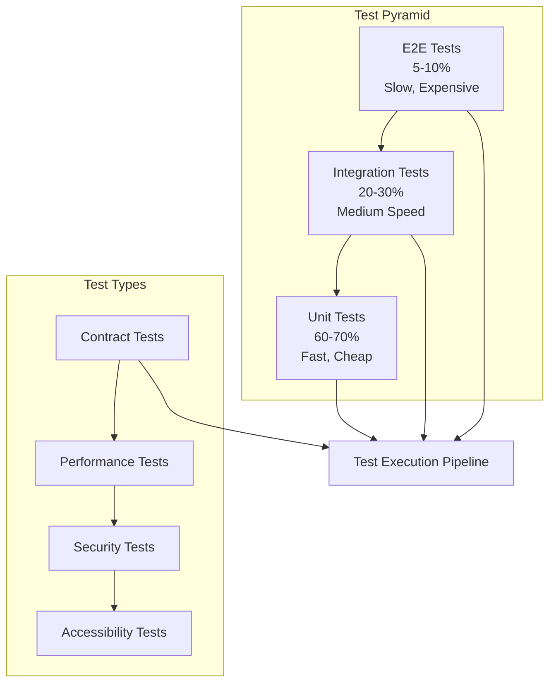

# Testing Overview

OpenFrame follows a comprehensive testing strategy that ensures code quality, reliability, and maintainability across all services. This document outlines our testing philosophy, tools, patterns, and best practices.

## Testing Philosophy

OpenFrame embraces the **Test Pyramid** approach with emphasis on:

- **Fast Feedback**: Tests should run quickly and provide immediate feedback
- **Comprehensive Coverage**: Target 80%+ code coverage with meaningful tests
- **Realistic Testing**: Use real databases and services where practical
- **Test-Driven Development**: Write tests first, then implement functionality
- **Quality Gates**: All tests must pass before deployment



## Testing Stack and Tools

### Core Testing Framework

| Technology | Purpose | Usage |
|------------|---------|-------|
| **JUnit 5** | Java unit testing | Core testing framework |
| **Mockito** | Mocking framework | Mock dependencies |
| **AssertJ** | Fluent assertions | Readable test assertions |
| **Testcontainers** | Integration testing | Real database testing |
| **WireMock** | HTTP service mocking | External service simulation |
| **Spring Boot Test** | Spring context testing | Application slice testing |

### Frontend Testing

| Tool | Purpose | Usage |
|------|---------|-------|
| **Jest** | JavaScript testing | Unit and integration tests |
| **React Testing Library** | React component testing | Component behavior testing |
| **Playwright** | E2E browser testing | Full user journey testing |
| **MSW** | API mocking | Mock API responses |

### Testing Infrastructure

| Component | Technology | Purpose |
|-----------|------------|---------|
| **Test Orchestration** | GitHub Actions | Automated test execution |
| **Test Databases** | Testcontainers | Isolated test data |
| **Load Testing** | k6/JMeter | Performance validation |
| **Security Testing** | OWASP ZAP | Security vulnerability scanning |

## Test Organization and Structure

### Java Test Structure

```text
src/
├── main/java/com/openframe/
│   ├── api/
│   │   ├── controller/
│   │   ├── service/
│   │   └── repository/
└── test/java/com/openframe/
    ├── api/
    │   ├── controller/          # Controller unit tests
    │   │   ├── DeviceControllerTest.java
    │   │   └── OrganizationControllerTest.java
    │   ├── service/             # Service unit tests
    │   │   ├── DeviceServiceTest.java
    │   │   └── OrganizationServiceTest.java
    │   ├── repository/          # Repository integration tests
    │   │   └── DeviceRepositoryTest.java
    │   └── integration/         # Full integration tests
    │       ├── DeviceApiIntegrationTest.java
    │       └── GraphQLIntegrationTest.java
    ├── testcontainers/         # Testcontainer configurations
    └── fixtures/               # Test data and utilities
```

### Test Naming Conventions

**Java Test Methods**:
```java
// Pattern: should{ExpectedBehavior}_when{StateUnderTest}
@Test
void shouldCreateDevice_whenValidRequestProvided() { }

@Test  
void shouldThrowException_whenDeviceNotFound() { }

@Test
void shouldReturnFilteredDevices_whenTenantSpecified() { }
```

**Test Class Naming**:
```text
{ClassUnderTest}Test.java          # Unit tests
{ClassUnderTest}IntegrationTest.java # Integration tests  
{Feature}E2ETest.java              # End-to-end tests
```

## Unit Testing Patterns

### Service Layer Testing

**Example: Device Service Unit Test**

```java
@ExtendWith(MockitoExtension.class)
class DeviceServiceTest {

    @Mock
    private DeviceRepository deviceRepository;
    
    @Mock
    private EventPublisher eventPublisher;
    
    @InjectMocks
    private DeviceService deviceService;
    
    @Test
    void shouldCreateDevice_whenValidRequestProvided() {
        // Given
        String tenantId = "tenant-123";
        CreateDeviceRequest request = CreateDeviceRequest.builder()
            .name("Test Device")
            .hostname("test.local")
            .type(DeviceType.WORKSTATION)
            .build();
            
        Device savedDevice = Device.builder()
            .id("device-123")
            .tenantId(tenantId)
            .name("Test Device")
            .hostname("test.local")
            .type(DeviceType.WORKSTATION)
            .status(DeviceStatus.ONLINE)
            .createdAt(Instant.now())
            .build();
            
        when(deviceRepository.save(any(Device.class)))
            .thenReturn(savedDevice);
            
        // When
        DeviceResponse response = deviceService.createDevice(tenantId, request);
        
        // Then
        assertThat(response)
            .isNotNull()
            .extracting(
                DeviceResponse::getId,
                DeviceResponse::getName,
                DeviceResponse::getHostname,
                DeviceResponse::getType
            )
            .containsExactly(
                "device-123",
                "Test Device", 
                "test.local",
                DeviceType.WORKSTATION
            );
            
        verify(deviceRepository).save(argThat(device -> 
            device.getTenantId().equals(tenantId) &&
            device.getName().equals("Test Device")
        ));
        
        verify(eventPublisher).publishEvent(any(DeviceCreatedEvent.class));
    }
    
    @Test
    void shouldThrowException_whenDeviceNotFound() {
        // Given
        String tenantId = "tenant-123";
        String deviceId = "nonexistent-device";
        
        when(deviceRepository.findByIdAndTenantId(deviceId, tenantId))
            .thenReturn(Optional.empty());
            
        // When & Then
        assertThatThrownBy(() -> deviceService.getDevice(tenantId, deviceId))
            .isInstanceOf(DeviceNotFoundException.class)
            .hasMessage("Device not found: " + deviceId);
    }
}
```

### Controller Layer Testing

**Example: REST Controller Test**

```java
@WebMvcTest(DeviceController.class)
class DeviceControllerTest {

    @Autowired
    private MockMvc mockMvc;
    
    @MockBean
    private DeviceService deviceService;
    
    @MockBean  
    private SecurityService securityService;
    
    @Test
    void shouldCreateDevice_whenValidRequest() throws Exception {
        // Given
        String tenantId = "tenant-123";
        CreateDeviceRequest request = CreateDeviceRequest.builder()
            .name("Test Device")
            .hostname("test.local")
            .type(DeviceType.WORKSTATION)
            .build();
            
        DeviceResponse expectedResponse = DeviceResponse.builder()
            .id("device-123")
            .name("Test Device")
            .hostname("test.local")
            .type(DeviceType.WORKSTATION)
            .status(DeviceStatus.ONLINE)
            .build();
            
        when(securityService.getCurrentTenantId())
            .thenReturn(tenantId);
        when(deviceService.createDevice(tenantId, request))
            .thenReturn(expectedResponse);
            
        // When & Then
        mockMvc.perform(post("/api/v1/devices")
                .contentType(MediaType.APPLICATION_JSON)
                .content(objectMapper.writeValueAsString(request)))
            .andExpect(status().isCreated())
            .andExpect(jsonPath("$.id").value("device-123"))
            .andExpect(jsonPath("$.name").value("Test Device"))
            .andExpect(jsonPath("$.hostname").value("test.local"))
            .andExpect(jsonPath("$.type").value("WORKSTATION"))
            .andExpect(jsonPath("$.status").value("ONLINE"));
    }
    
    @Test
    void shouldReturnBadRequest_whenInvalidRequest() throws Exception {
        // Given - empty device name
        CreateDeviceRequest request = CreateDeviceRequest.builder()
            .name("")  // Invalid: empty name
            .hostname("test.local")
            .build();
            
        // When & Then  
        mockMvc.perform(post("/api/v1/devices")
                .contentType(MediaType.APPLICATION_JSON)
                .content(objectMapper.writeValueAsString(request)))
            .andExpect(status().isBadRequest())
            .andExpect(jsonPath("$.errors").exists())
            .andExpect(jsonPath("$.errors[0].field").value("name"))
            .andExpect(jsonPath("$.errors[0].message").value("Device name is required"));
    }
}
```

## Integration Testing with Testcontainers

### Database Integration Tests

**Example: Repository Integration Test**

```java
@SpringBootTest
@Testcontainers
class DeviceRepositoryIntegrationTest {

    @Container
    static MongoDBContainer mongodb = new MongoDBContainer("mongo:7.0")
            .withExposedPorts(27017);
            
    @Container  
    static RedisContainer redis = new RedisContainer("redis:7.0")
            .withExposedPorts(6379);
            
    @DynamicPropertySource
    static void configureProperties(DynamicPropertyRegistry registry) {
        registry.add("spring.data.mongodb.uri", mongodb::getReplicaSetUrl);
        registry.add("spring.redis.url", () -> "redis://localhost:" + redis.getMappedPort(6379));
    }
    
    @Autowired
    private DeviceRepository deviceRepository;
    
    @Test
    void shouldFindDevicesByTenant() {
        // Given
        String tenantId = "tenant-123";
        
        Device device1 = createDevice("device-1", tenantId, "Device 1");
        Device device2 = createDevice("device-2", tenantId, "Device 2");  
        Device device3 = createDevice("device-3", "other-tenant", "Device 3");
        
        deviceRepository.saveAll(List.of(device1, device2, device3));
        
        // When
        List<Device> devices = deviceRepository.findByTenantId(tenantId);
        
        // Then
        assertThat(devices)
            .hasSize(2)
            .extracting(Device::getId)
            .containsExactlyInAnyOrder("device-1", "device-2");
    }
    
    @Test
    void shouldCreateIndexes() {
        // When
        deviceRepository.createIndexes();
        
        // Then
        MongoCollection<Document> collection = mongoTemplate
            .getCollection("devices");
            
        List<Document> indexes = collection.listIndexes()
            .into(new ArrayList<>());
            
        assertThat(indexes)
            .anyMatch(index -> {
                Document key = (Document) index.get("key");
                return key.containsKey("tenantId") && key.containsKey("status");
            });
    }
    
    private Device createDevice(String id, String tenantId, String name) {
        return Device.builder()
            .id(id)
            .tenantId(tenantId) 
            .name(name)
            .hostname(name.toLowerCase().replace(" ", "-") + ".local")
            .type(DeviceType.WORKSTATION)
            .status(DeviceStatus.ONLINE)
            .createdAt(Instant.now())
            .build();
    }
}
```

### Service Integration Tests

**Example: Full Service Integration Test**

```java
@SpringBootTest(webEnvironment = SpringBootTest.WebEnvironment.RANDOM_PORT)
@Testcontainers
class DeviceServiceIntegrationTest {

    @Container
    static MongoDBContainer mongodb = new MongoDBContainer("mongo:7.0");
    
    @Container
    static KafkaContainer kafka = new KafkaContainer(DockerImageName.parse("confluentinc/cp-kafka:latest"));
    
    @DynamicPropertySource
    static void configureProperties(DynamicPropertyRegistry registry) {
        registry.add("spring.data.mongodb.uri", mongodb::getReplicaSetUrl);
        registry.add("spring.kafka.bootstrap-servers", kafka::getBootstrapServers);
    }
    
    @Autowired
    private DeviceService deviceService;
    
    @Autowired
    private DeviceRepository deviceRepository;
    
    @Autowired  
    private KafkaTemplate<String, Object> kafkaTemplate;
    
    @Test
    void shouldCreateDeviceAndPublishEvent() {
        // Given
        String tenantId = "tenant-123";
        CreateDeviceRequest request = CreateDeviceRequest.builder()
            .name("Integration Test Device")
            .hostname("integration.local")
            .type(DeviceType.SERVER)
            .build();
            
        // When
        DeviceResponse response = deviceService.createDevice(tenantId, request);
        
        // Then - Device created
        assertThat(response.getId()).isNotNull();
        assertThat(response.getName()).isEqualTo("Integration Test Device");
        
        // Then - Device persisted  
        Optional<Device> savedDevice = deviceRepository
            .findByIdAndTenantId(response.getId(), tenantId);
        assertThat(savedDevice).isPresent();
        
        // Then - Event published (simplified verification)
        // In practice, you'd use @KafkaListener test consumer
        verify(kafkaTemplate).send(eq("device.events"), any(DeviceCreatedEvent.class));
    }
}
```

## GraphQL Testing

### GraphQL Query Testing

**Example: GraphQL Data Fetcher Test**

```java
@SpringBootTest
@TestPropertySource(properties = {
    "dgs.graphql.test.enabled=true"
})
class DeviceDataFetcherTest {

    @Autowired
    private DgsQueryExecutor dgsQueryExecutor;
    
    @MockBean
    private DeviceService deviceService;
    
    @Test
    void shouldFetchDevices() {
        // Given
        String tenantId = "tenant-123";
        DeviceFilterInput filter = DeviceFilterInput.builder()
            .status(DeviceStatus.ONLINE)
            .build();
            
        List<DeviceResponse> devices = List.of(
            createDeviceResponse("device-1", "Device 1", DeviceStatus.ONLINE),
            createDeviceResponse("device-2", "Device 2", DeviceStatus.ONLINE)
        );
        
        when(deviceService.findDevices(eq(tenantId), any(DeviceFilterInput.class)))
            .thenReturn(devices);
            
        // When
        List<String> deviceIds = dgsQueryExecutor.executeAndExtractJsonPath(
            "query { devices(filter: { status: ONLINE }) { id name status } }",
            "data.devices[*].id"
        );
        
        // Then
        assertThat(deviceIds).containsExactly("device-1", "device-2");
    }
    
    @Test
    void shouldHandleDeviceNotFound() {
        // Given  
        String deviceId = "nonexistent-device";
        
        when(deviceService.getDevice(anyString(), eq(deviceId)))
            .thenThrow(new DeviceNotFoundException("Device not found"));
            
        // When
        ExecutionResult result = dgsQueryExecutor.execute(
            "query { device(id: \"" + deviceId + "\") { id name } }"
        );
        
        // Then
        assertThat(result.getErrors()).hasSize(1);
        assertThat(result.getErrors().get(0).getMessage())
            .contains("Device not found");
    }
}
```

## Frontend Testing

### React Component Testing

**Example: Device List Component Test**

```typescript
// DeviceList.test.tsx
import { render, screen, waitFor } from '@testing-library/react';
import { MockedProvider } from '@apollo/client/testing';
import { DeviceList } from './DeviceList';
import { GET_DEVICES } from './DeviceList.queries';

const mocks = [
  {
    request: {
      query: GET_DEVICES,
      variables: {
        filter: { status: 'ONLINE' }
      }
    },
    result: {
      data: {
        devices: [
          {
            id: 'device-1',
            name: 'Test Device 1',
            status: 'ONLINE',
            type: 'WORKSTATION',
            lastSeen: '2024-01-01T10:00:00Z'
          },
          {
            id: 'device-2', 
            name: 'Test Device 2',
            status: 'ONLINE',
            type: 'SERVER',
            lastSeen: '2024-01-01T11:00:00Z'
          }
        ]
      }
    }
  }
];

describe('DeviceList', () => {
  it('should display devices when loaded', async () => {
    render(
      <MockedProvider mocks={mocks} addTypename={false}>
        <DeviceList filter={{ status: 'ONLINE' }} />
      </MockedProvider>
    );

    // Loading state
    expect(screen.getByText('Loading devices...')).toBeInTheDocument();

    // Wait for devices to load
    await waitFor(() => {
      expect(screen.getByText('Test Device 1')).toBeInTheDocument();
      expect(screen.getByText('Test Device 2')).toBeInTheDocument();
    });

    // Verify device details
    expect(screen.getByText('WORKSTATION')).toBeInTheDocument();
    expect(screen.getByText('SERVER')).toBeInTheDocument();
  });

  it('should display empty state when no devices', async () => {
    const emptyMocks = [
      {
        request: { query: GET_DEVICES, variables: { filter: {} } },
        result: { data: { devices: [] } }
      }
    ];

    render(
      <MockedProvider mocks={emptyMocks} addTypename={false}>
        <DeviceList filter={{}} />
      </MockedProvider>
    );

    await waitFor(() => {
      expect(screen.getByText('No devices found')).toBeInTheDocument();
    });
  });
});
```

## End-to-End Testing with Playwright

### E2E Test Example

```typescript
// e2e/device-management.spec.ts
import { test, expect } from '@playwright/test';

test.describe('Device Management', () => {
  test.beforeEach(async ({ page }) => {
    // Login as admin
    await page.goto('/auth/login');
    await page.fill('[data-testid=email]', 'admin@test.com');
    await page.fill('[data-testid=password]', 'password');
    await page.click('[data-testid=login-button]');
    
    // Wait for dashboard
    await expect(page).toHaveURL('/dashboard');
  });

  test('should create a new device', async ({ page }) => {
    // Navigate to devices
    await page.click('[data-testid=nav-devices]');
    await expect(page).toHaveURL('/devices');

    // Click add device
    await page.click('[data-testid=add-device-button]');

    // Fill device form
    await page.fill('[data-testid=device-name]', 'E2E Test Device');
    await page.fill('[data-testid=device-hostname]', 'e2e.local');
    await page.selectOption('[data-testid=device-type]', 'WORKSTATION');

    // Submit form
    await page.click('[data-testid=submit-device]');

    // Verify device created
    await expect(page.locator('[data-testid=success-message]'))
      .toContainText('Device created successfully');
      
    // Verify device appears in list
    await expect(page.locator('[data-testid=device-list]'))
      .toContainText('E2E Test Device');
  });

  test('should filter devices by status', async ({ page }) => {
    await page.goto('/devices');

    // Apply online filter
    await page.click('[data-testid=status-filter]');
    await page.click('[data-testid=status-online]');

    // Verify filtering
    await expect(page.locator('[data-testid=device-list] [data-status=ONLINE]'))
      .toHaveCount(2); // Assuming 2 online devices

    // Apply offline filter  
    await page.click('[data-testid=status-filter]');
    await page.click('[data-testid=status-offline]');

    // Verify offline devices shown
    await expect(page.locator('[data-testid=device-list] [data-status=OFFLINE]'))
      .toHaveCount(1); // Assuming 1 offline device
  });
});
```

## Test Data Management

### Test Fixtures and Builders

**Example: Device Test Builder**

```java
public class DeviceTestBuilder {
    private String id = UUID.randomUUID().toString();
    private String tenantId = "default-tenant";
    private String name = "Test Device";
    private String hostname = "test.local";
    private DeviceType type = DeviceType.WORKSTATION;
    private DeviceStatus status = DeviceStatus.ONLINE;
    private Instant createdAt = Instant.now();
    
    public static DeviceTestBuilder aDevice() {
        return new DeviceTestBuilder();
    }
    
    public DeviceTestBuilder withId(String id) {
        this.id = id;
        return this;
    }
    
    public DeviceTestBuilder withTenantId(String tenantId) {
        this.tenantId = tenantId;
        return this;
    }
    
    public DeviceTestBuilder withName(String name) {
        this.name = name;
        return this;
    }
    
    public DeviceTestBuilder withStatus(DeviceStatus status) {
        this.status = status;
        return this;
    }
    
    public DeviceTestBuilder offline() {
        return withStatus(DeviceStatus.OFFLINE);
    }
    
    public DeviceTestBuilder online() {
        return withStatus(DeviceStatus.ONLINE);
    }
    
    public Device build() {
        return Device.builder()
            .id(id)
            .tenantId(tenantId)
            .name(name)
            .hostname(hostname)
            .type(type)
            .status(status)
            .createdAt(createdAt)
            .build();
    }
}
```

**Usage in Tests:**

```java
@Test
void shouldFindOnlineDevices() {
    // Given
    Device onlineDevice = aDevice()
        .withName("Online Device")
        .online()
        .build();
        
    Device offlineDevice = aDevice()
        .withName("Offline Device")  
        .offline()
        .build();
        
    deviceRepository.saveAll(List.of(onlineDevice, offlineDevice));
    
    // When
    List<Device> onlineDevices = deviceService.findOnlineDevices("default-tenant");
    
    // Then
    assertThat(onlineDevices)
        .hasSize(1)
        .extracting(Device::getName)
        .containsExactly("Online Device");
}
```

## Test Execution and CI/CD

### GitHub Actions Test Pipeline

```yaml
# .github/workflows/test.yml
name: Test Pipeline

on:
  push:
    branches: [ main, develop ]
  pull_request:
    branches: [ main ]

jobs:
  unit-tests:
    runs-on: ubuntu-latest
    steps:
      - uses: actions/checkout@v3
      
      - name: Set up JDK 21
        uses: actions/setup-java@v3
        with:
          java-version: '21'
          distribution: 'temurin'
          
      - name: Cache Maven dependencies
        uses: actions/cache@v3
        with:
          path: ~/.m2
          key: ${{ runner.os }}-m2-${{ hashFiles('**/pom.xml') }}
          
      - name: Run unit tests
        run: mvn test -Dspring.profiles.active=test
        
      - name: Generate test report
        run: mvn jacoco:report
        
      - name: Upload coverage to Codecov
        uses: codecov/codecov-action@v3

  integration-tests:
    runs-on: ubuntu-latest
    services:
      mongodb:
        image: mongo:7.0
        ports:
          - 27017:27017
      redis:
        image: redis:7.0
        ports:
          - 6379:6379
          
    steps:
      - uses: actions/checkout@v3
      
      - name: Set up JDK 21
        uses: actions/setup-java@v3
        with:
          java-version: '21'
          distribution: 'temurin'
          
      - name: Run integration tests
        run: mvn verify -Dspring.profiles.active=integration-test
        env:
          MONGODB_URI: mongodb://localhost:27017/openframe_test
          REDIS_URL: redis://localhost:6379

  e2e-tests:
    runs-on: ubuntu-latest
    steps:
      - uses: actions/checkout@v3
      
      - name: Set up Node.js
        uses: actions/setup-node@v3
        with:
          node-version: '20'
          
      - name: Install dependencies
        run: npm ci
        working-directory: ./openframe/services/openframe-frontend
        
      - name: Install Playwright
        run: npx playwright install
        working-directory: ./openframe/services/openframe-frontend
        
      - name: Run E2E tests
        run: npm run test:e2e
        working-directory: ./openframe/services/openframe-frontend
        
      - name: Upload test results
        uses: actions/upload-artifact@v3
        if: always()
        with:
          name: playwright-results
          path: openframe/services/openframe-frontend/test-results/
```

### Local Test Execution

**Run All Tests:**
```bash
# Run unit tests
mvn test

# Run integration tests  
mvn verify -Dspring.profiles.active=integration-test

# Run frontend tests
cd openframe/services/openframe-frontend
npm test

# Run E2E tests
npm run test:e2e
```

**Run Specific Tests:**
```bash
# Run specific test class
mvn test -Dtest=DeviceServiceTest

# Run specific test method
mvn test -Dtest=DeviceServiceTest#shouldCreateDevice_whenValidRequestProvided

# Run tests with coverage
mvn test jacoco:report

# Frontend specific tests
npm test -- --testNamePattern="DeviceList"
```

## Testing Best Practices

### Do's ✅

1. **Write Tests First**: Follow TDD approach where possible
2. **Test Behavior, Not Implementation**: Focus on what the code does, not how
3. **Use Meaningful Names**: Test names should describe the expected behavior
4. **Keep Tests Independent**: Each test should be able to run in isolation
5. **Use Real Databases**: Prefer Testcontainers over mocks for data layer testing
6. **Test Edge Cases**: Include boundary conditions and error scenarios
7. **Maintain Test Data**: Use builders and fixtures for consistent test data
8. **Keep Tests Fast**: Unit tests should run in milliseconds

### Don'ts ❌

1. **Don't Test Framework Code**: Don't test Spring Boot, React, etc. functionality
2. **Don't Over-Mock**: Use real implementations where practical
3. **Don't Write Brittle Tests**: Avoid testing internal implementation details
4. **Don't Ignore Flaky Tests**: Fix or delete unstable tests immediately
5. **Don't Skip Edge Cases**: Always test error conditions and boundaries
6. **Don't Hardcode Test Data**: Use builders and factories for flexibility
7. **Don't Test Everything**: Focus on critical business logic and edge cases

### Test Coverage Guidelines

| Component | Target Coverage | Notes |
|-----------|----------------|-------|
| **Service Layer** | 90%+ | Core business logic |
| **Controllers** | 80%+ | Request/response handling |
| **Repositories** | 70%+ | Data access patterns |
| **Utilities** | 95%+ | Pure functions |
| **Configuration** | 50%+ | Spring configuration |

## Performance Testing

### Load Testing with k6

```javascript
// k6/device-api-load-test.js
import http from 'k6/http';
import { check } from 'k6';
import { Rate } from 'k6/metrics';

const errorRate = new Rate('errors');

export let options = {
  stages: [
    { duration: '5m', target: 100 },  // Ramp up
    { duration: '10m', target: 100 }, // Stay at 100 users
    { duration: '5m', target: 0 },    // Ramp down
  ],
  thresholds: {
    errors: ['rate<0.1'],             // Error rate should be less than 10%
    http_req_duration: ['p(95)<500'], // 95% of requests should be below 500ms
  },
};

export default function() {
  const response = http.get('http://localhost:8081/api/v1/devices', {
    headers: {
      'Authorization': 'Bearer ' + __ENV.JWT_TOKEN,
    },
  });

  const result = check(response, {
    'status is 200': (r) => r.status === 200,
    'response time < 500ms': (r) => r.timings.duration < 500,
  });

  errorRate.add(!result);
}
```

### Running Performance Tests

```bash
# Install k6
brew install k6  # macOS
# or download from k6.io

# Run load test
k6 run k6/device-api-load-test.js

# Run with environment variables
JWT_TOKEN=your-test-token k6 run k6/device-api-load-test.js

# Generate HTML report
k6 run --out html=results.html k6/device-api-load-test.js
```

## Continuous Testing

### Quality Gates

All code must pass these quality gates before merging:

1. **✅ All Tests Pass**: 100% test success rate
2. **✅ Coverage Threshold**: Minimum 80% code coverage
3. **✅ Performance Benchmarks**: Response time within SLA
4. **✅ Security Scans**: No high/critical vulnerabilities  
5. **✅ Code Quality**: SonarCloud quality gate passed

### Test Reporting

**Coverage Reports**:
- JaCoCo for Java code coverage
- Istanbul for JavaScript coverage
- Combined reports in CI/CD pipeline

**Test Results**:
- JUnit XML format for Java tests
- Jest JSON format for JavaScript tests
- Playwright HTML reports for E2E tests

## Next Steps

To implement effective testing in OpenFrame:

1. **Start with Unit Tests**: Focus on service layer business logic
2. **Add Integration Tests**: Use Testcontainers for database testing  
3. **Implement E2E Tests**: Cover critical user journeys
4. **Set Up CI/CD Pipeline**: Automate test execution
5. **Monitor Test Metrics**: Track coverage and performance

Effective testing ensures OpenFrame remains reliable, maintainable, and ready for continuous delivery. 🧪