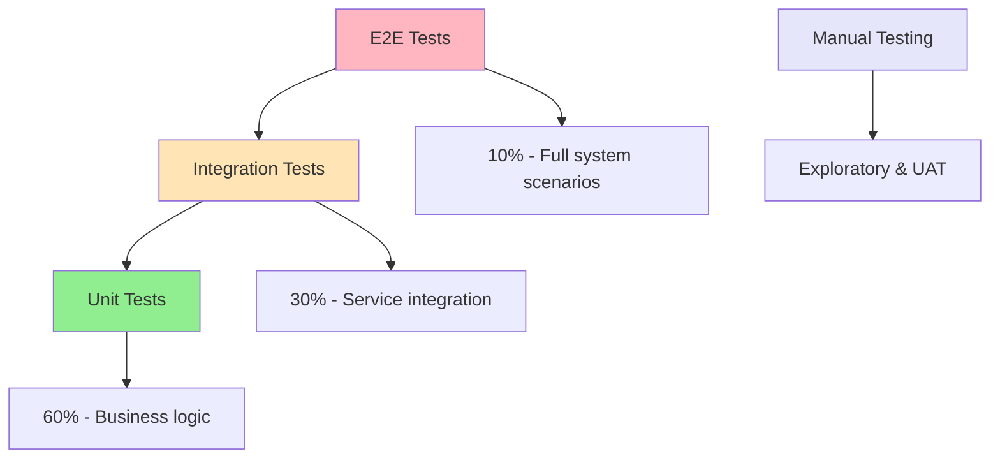
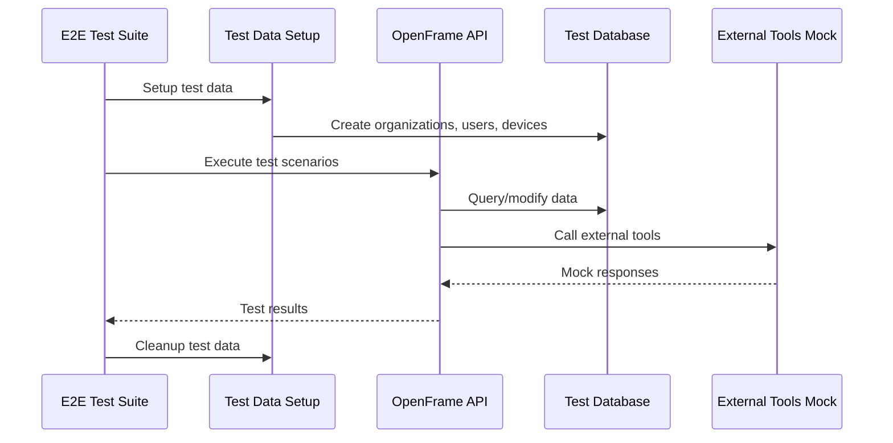

# Testing Overview

OpenFrame employs a comprehensive testing strategy that ensures reliability, maintainability, and quality across all components. This guide covers our testing philosophy, frameworks, and best practices.

## Testing Philosophy & Strategy

### Test Pyramid Implementation

OpenFrame follows the test pyramid strategy with emphasis on fast, reliable tests:



### Testing Principles

1. **Fast Feedback**: Most tests run in seconds
2. **Reliable**: Tests are deterministic and stable
3. **Maintainable**: Tests are easy to understand and modify
4. **Comprehensive**: High coverage of critical paths
5. **Independent**: Tests can run in isolation
6. **Realistic**: Tests use realistic data and scenarios

## Test Structure & Organization

### Test Categories by Layer

| Test Type | Purpose | Framework | Scope | Runtime |
|-----------|---------|-----------|-------|---------|
| **Unit Tests** | Logic validation | JUnit 5, Mockito | Single class/method | < 1s |
| **Integration Tests** | Service interaction | Spring Boot Test | Service + dependencies | < 10s |
| **Contract Tests** | API contracts | Spring Cloud Contract | API boundaries | < 5s |
| **E2E Tests** | User workflows | TestNG, RestAssured | Full application | < 2m |
| **Performance Tests** | Load & stress | JMeter, Gatling | System capacity | 5-30m |
| **Security Tests** | Security validation | OWASP ZAP | Security vulnerabilities | 10-60m |

### Test Directory Structure

```text
openframe-oss-tenant/
├── openframe/services/openframe-api/
│   ├── src/test/java/
│   │   ├── unit/                    # Unit tests
│   │   ├── integration/             # Integration tests
│   │   └── contract/                # Contract tests
│   └── src/test/resources/          # Test data and configs
├── openframe/services/openframe-frontend/
│   ├── src/test/
│   │   ├── unit/                    # Vue component tests
│   │   ├── integration/             # API integration tests
│   │   └── e2e/                     # End-to-end tests
│   └── tests/                       # Test utilities
└── openframe-e2e-tests/             # Full system E2E tests
    ├── src/test/java/
    │   ├── api/                     # API test utilities
    │   ├── tests/                   # Test cases
    │   └── data/                    # Test data generators
    └── src/test/resources/          # Test configurations
```

## Unit Testing

### Java Unit Testing (Backend)

**Framework Stack:**
- **JUnit 5**: Test framework
- **Mockito**: Mocking framework  
- **AssertJ**: Fluent assertions
- **Testcontainers**: Integration with real databases

**Sample Unit Test:**

```java
@ExtendWith(MockitoExtension.class)
class DeviceServiceTest {

    @Mock
    private DeviceRepository deviceRepository;
    
    @Mock
    private EventPublisher eventPublisher;
    
    @InjectMocks
    private DeviceService deviceService;

    @Test
    @DisplayName("Should create device successfully when valid data provided")
    void shouldCreateDeviceSuccessfully() {
        // Given
        CreateDeviceRequest request = CreateDeviceRequest.builder()
            .name("Test Device")
            .organizationId("org123")
            .type(DeviceType.WORKSTATION)
            .build();
            
        Device expectedDevice = Device.builder()
            .id("device123")
            .name("Test Device")
            .status(DeviceStatus.PENDING)
            .build();
            
        when(deviceRepository.save(any(Device.class)))
            .thenReturn(expectedDevice);

        // When
        DeviceResponse result = deviceService.createDevice(request);

        // Then
        assertThat(result)
            .isNotNull()
            .satisfies(device -> {
                assertThat(device.getName()).isEqualTo("Test Device");
                assertThat(device.getStatus()).isEqualTo(DeviceStatus.PENDING);
            });
            
        verify(eventPublisher).publishEvent(any(DeviceCreatedEvent.class));
    }

    @Test
    @DisplayName("Should throw exception when organization not found")
    void shouldThrowExceptionWhenOrganizationNotFound() {
        // Given
        CreateDeviceRequest request = CreateDeviceRequest.builder()
            .name("Test Device")
            .organizationId("nonexistent")
            .build();
            
        when(deviceRepository.existsByOrganizationId("nonexistent"))
            .thenReturn(false);

        // When & Then
        assertThatThrownBy(() -> deviceService.createDevice(request))
            .isInstanceOf(OrganizationNotFoundException.class)
            .hasMessage("Organization not found: nonexistent");
    }
}
```

**Unit Testing Best Practices:**

1. **Test Naming**: Use descriptive test names that explain the scenario
2. **Given-When-Then**: Structure tests with clear arrange-act-assert sections
3. **Single Responsibility**: Each test validates one specific behavior
4. **Mock External Dependencies**: Mock repositories, external services, etc.
5. **Realistic Data**: Use data that reflects real-world scenarios
6. **Edge Cases**: Test boundary conditions and error scenarios

### Frontend Unit Testing (Vue.js)

**Framework Stack:**
- **Vitest**: Fast Vite-native test runner
- **Vue Test Utils**: Vue component testing utilities
- **jsdom**: DOM simulation for browser APIs

**Sample Vue Component Test:**

```typescript
import { describe, it, expect, beforeEach, vi } from 'vitest'
import { mount } from '@vue/test-utils'
import { createPinia, setActivePinia } from 'pinia'
import DeviceCard from '@/components/DeviceCard.vue'
import { useDevicesStore } from '@/stores/devices'

describe('DeviceCard.vue', () => {
  let wrapper: any
  let devicesStore: any

  beforeEach(() => {
    setActivePinia(createPinia())
    devicesStore = useDevicesStore()
  })

  it('should display device information correctly', () => {
    const device = {
      id: 'device-123',
      name: 'Test Device',
      status: 'ONLINE',
      lastSeen: new Date('2024-01-15T10:30:00Z'),
      organization: { name: 'Test Org' }
    }

    wrapper = mount(DeviceCard, {
      props: { device },
      global: {
        stubs: {
          'router-link': true
        }
      }
    })

    expect(wrapper.find('[data-testid="device-name"]').text())
      .toBe('Test Device')
    expect(wrapper.find('[data-testid="device-status"]').text())
      .toBe('ONLINE')
    expect(wrapper.find('[data-testid="organization-name"]').text())
      .toBe('Test Org')
  })

  it('should emit delete event when delete button clicked', async () => {
    const device = { id: 'device-123', name: 'Test Device' }
    
    wrapper = mount(DeviceCard, {
      props: { device }
    })

    await wrapper.find('[data-testid="delete-button"]').trigger('click')

    expect(wrapper.emitted('delete')).toBeTruthy()
    expect(wrapper.emitted('delete')?.[0]).toEqual(['device-123'])
  })

  it('should show loading state when action in progress', async () => {
    const device = { id: 'device-123', name: 'Test Device' }
    
    wrapper = mount(DeviceCard, {
      props: { device, loading: true }
    })

    expect(wrapper.find('[data-testid="loading-spinner"]').exists())
      .toBe(true)
    expect(wrapper.find('[data-testid="delete-button"]').attributes('disabled'))
      .toBeDefined()
  })
})
```

## Integration Testing

### Spring Boot Integration Tests

Integration tests verify that services work correctly with their dependencies:

```java
@SpringBootTest
@TestPropertySource(properties = {
    "spring.datasource.url=jdbc:h2:mem:testdb",
    "spring.jpa.hibernate.ddl-auto=create-drop"
})
@Testcontainers
class DeviceIntegrationTest {

    @Container
    static MongoDBContainer mongoContainer = new MongoDBContainer("mongo:7.0")
        .withExposedPorts(27017);
        
    @Container  
    static GenericContainer<?> redisContainer = new GenericContainer<>("redis:7.0")
        .withExposedPorts(6379);

    @Autowired
    private TestRestTemplate restTemplate;
    
    @Autowired
    private DeviceRepository deviceRepository;

    @DynamicPropertySource
    static void configureProperties(DynamicPropertyRegistry registry) {
        registry.add("spring.data.mongodb.uri", mongoContainer::getReplicaSetUrl);
        registry.add("spring.redis.host", redisContainer::getHost);
        registry.add("spring.redis.port", () -> redisContainer.getMappedPort(6379));
    }

    @Test
    void shouldCreateDeviceEndToEnd() {
        // Given
        CreateDeviceRequest request = CreateDeviceRequest.builder()
            .name("Integration Test Device")
            .organizationId("org123")
            .type(DeviceType.SERVER)
            .build();

        // When
        ResponseEntity<DeviceResponse> response = restTemplate.postForEntity(
            "/api/devices", 
            request, 
            DeviceResponse.class
        );

        // Then
        assertThat(response.getStatusCode()).isEqualTo(HttpStatus.CREATED);
        assertThat(response.getBody()).isNotNull();
        
        // Verify database persistence
        Optional<Device> savedDevice = deviceRepository.findById(
            response.getBody().getId()
        );
        assertThat(savedDevice).isPresent();
        assertThat(savedDevice.get().getName()).isEqualTo("Integration Test Device");
    }
}
```

### API Integration Tests

Testing GraphQL and REST API endpoints:

```java
@SpringBootTest(webEnvironment = SpringBootTest.WebEnvironment.RANDOM_PORT)
class GraphQLIntegrationTest {

    @Autowired
    private TestRestTemplate restTemplate;
    
    @MockBean
    private DeviceService deviceService;

    @Test
    void shouldQueryDevicesSuccessfully() {
        // Given
        String query = """
            {
              devices(organizationId: "org123") {
                id
                name
                status
                organization {
                  name
                }
              }
            }
            """;
            
        List<Device> mockDevices = List.of(
            Device.builder().id("dev1").name("Device 1").build(),
            Device.builder().id("dev2").name("Device 2").build()
        );
        
        when(deviceService.getDevicesByOrganization("org123"))
            .thenReturn(mockDevices);

        // When
        ResponseEntity<String> response = restTemplate.postForEntity(
            "/graphql",
            Map.of("query", query),
            String.class
        );

        // Then
        assertThat(response.getStatusCode()).isEqualTo(HttpStatus.OK);
        
        JsonNode responseBody = objectMapper.readTree(response.getBody());
        JsonNode devices = responseBody.path("data").path("devices");
        
        assertThat(devices).hasSize(2);
        assertThat(devices.get(0).path("name").asText()).isEqualTo("Device 1");
    }
}
```

## End-to-End Testing

### E2E Test Architecture



### Sample E2E Test

```java
@Test(groups = "e2e", description = "Complete device management workflow")
public class DeviceManagementE2ETest extends BaseE2ETest {

    private String organizationId;
    private String deviceId;
    private String authToken;

    @BeforeMethod
    public void setupTestData() {
        // Create test organization
        CreateOrganizationRequest orgRequest = OrganizationGenerator
            .generateCreateRequest("E2E Test Org");
        organizationId = OrganizationApi.createOrganization(orgRequest)
            .getId();
            
        // Authenticate test user
        authToken = AuthHelper.authenticateTestUser("test@example.com");
    }

    @Test
    public void shouldCompleteDeviceLifecycle() {
        // Step 1: Create device
        CreateDeviceRequest createRequest = DeviceGenerator
            .generateCreateRequest(organizationId, "E2E Test Device");
            
        DeviceResponse device = DeviceApi.createDevice(createRequest, authToken);
        deviceId = device.getId();
        
        assertThat(device.getName()).isEqualTo("E2E Test Device");
        assertThat(device.getStatus()).isEqualTo(DeviceStatus.PENDING);

        // Step 2: Activate device (simulate agent registration)
        DeviceApi.updateDeviceStatus(deviceId, DeviceStatus.ONLINE, authToken);
        
        DeviceResponse updatedDevice = DeviceApi.getDevice(deviceId, authToken);
        assertThat(updatedDevice.getStatus()).isEqualTo(DeviceStatus.ONLINE);

        // Step 3: Query devices for organization
        List<DeviceResponse> orgDevices = DeviceApi
            .getDevicesByOrganization(organizationId, authToken);
            
        assertThat(orgDevices)
            .hasSize(1)
            .extracting(DeviceResponse::getId)
            .contains(deviceId);

        // Step 4: Execute remote command (mock tool integration)
        ScriptExecutionRequest scriptRequest = ScriptGenerator
            .generateExecutionRequest(deviceId, "echo 'test'");
            
        ScriptExecutionResponse execution = ScriptApi
            .executeScript(scriptRequest, authToken);
            
        assertThat(execution.getStatus()).isEqualTo(ExecutionStatus.QUEUED);

        // Step 5: Verify logs were created
        List<LogEvent> deviceLogs = LogsApi
            .getDeviceLogs(deviceId, authToken);
            
        assertThat(deviceLogs)
            .isNotEmpty()
            .anyMatch(log -> log.getMessage().contains("Script execution"));
    }

    @AfterMethod
    public void cleanupTestData() {
        if (deviceId != null) {
            DeviceApi.deleteDevice(deviceId, authToken);
        }
        if (organizationId != null) {
            OrganizationApi.deleteOrganization(organizationId, authToken);
        }
    }
}
```

## Running Tests

### Maven Test Execution

```bash
# Run all unit tests
mvn test

# Run specific test class
mvn test -Dtest=DeviceServiceTest

# Run tests with coverage
mvn test jacoco:report

# Run integration tests only
mvn test -Dgroups=integration

# Run tests in parallel
mvn test -Dparallel=methods -DthreadCount=4

# Run tests with specific profile
mvn test -Ptest -Dspring.profiles.active=test,h2
```

### Frontend Test Execution

```bash
# Run all frontend tests
cd openframe/services/openframe-frontend
npm run test

# Run tests in watch mode
npm run test:watch

# Run tests with coverage
npm run test:coverage

# Run specific test file
npm run test -- DeviceCard.test.ts

# Run E2E tests
npm run test:e2e
```

### E2E Test Execution

```bash
# Run E2E tests against local environment
cd openframe-e2e-tests
mvn test -Denv=local

# Run specific test suite
mvn test -Dtest=DeviceManagementE2ETest

# Run tests against staging environment
mvn test -Denv=staging -DbaseUrl=https://staging.openframe.ai

# Run tests with custom browser
mvn test -Dbrowser=chrome -Dheadless=false
```

## Test Configuration

### Test Profiles

**application-test.yml:**
```yaml
spring:
  datasource:
    url: jdbc:h2:mem:testdb;DB_CLOSE_DELAY=-1;DB_CLOSE_ON_EXIT=FALSE
    driver-class-name: org.h2.Driver
  jpa:
    hibernate:
      ddl-auto: create-drop
    show-sql: false
  redis:
    host: localhost
    port: 6379
    database: 1

logging:
  level:
    com.openframe: DEBUG
    org.springframework.test: INFO
    
# Test-specific configurations
test:
  data:
    cleanup: true
    isolation: true
  external:
    mock-enabled: true
  performance:
    timeout: 30s
```

### Test Data Management

**Test Data Builders:**

```java
@Component
public class DeviceTestDataBuilder {

    public static Device.DeviceBuilder defaultDevice() {
        return Device.builder()
            .id(UUID.randomUUID().toString())
            .name("Test Device")
            .status(DeviceStatus.ONLINE)
            .deviceType(DeviceType.WORKSTATION)
            .createdAt(Instant.now())
            .lastSeen(Instant.now());
    }

    public static Device.DeviceBuilder serverDevice() {
        return defaultDevice()
            .name("Test Server")
            .deviceType(DeviceType.SERVER);
    }

    public static Device withOrganization(String organizationId) {
        return defaultDevice()
            .organizationId(organizationId)
            .build();
    }
}
```

## Test Quality & Metrics

### Code Coverage Requirements

| Component | Minimum Coverage | Target Coverage |
|-----------|------------------|-----------------|
| **Service Layer** | 85% | 90% |
| **Controller Layer** | 80% | 85% |
| **Repository Layer** | 70% | 80% |
| **Utility Classes** | 90% | 95% |
| **Frontend Components** | 75% | 85% |

### Coverage Reporting

```bash
# Generate coverage report
mvn jacoco:report

# View coverage report
open target/site/jacoco/index.html

# Frontend coverage
npm run test:coverage
open coverage/lcov-report/index.html
```

### Test Quality Metrics

Monitor these metrics for test health:

- **Test Execution Time**: < 5 minutes for full suite
- **Test Reliability**: > 99% pass rate on main branch
- **Test Coverage**: Meet minimum requirements
- **Test Maintainability**: Regular review and refactoring

## Best Practices & Guidelines

### Writing Effective Tests

1. **Clear Test Names**: Test names should describe the scenario and expected outcome
2. **Independent Tests**: Each test should be able to run in isolation
3. **Realistic Data**: Use data that reflects real-world usage
4. **Proper Setup/Teardown**: Clean setup and cleanup for each test
5. **Assertion Quality**: Use specific, meaningful assertions

### Performance Testing

```java
@Test(timeout = 5000) // Test must complete within 5 seconds
public void shouldHandleLargeDatasetEfficiently() {
    // Given
    List<Device> largeDataset = generateDevices(10000);
    
    // When
    long startTime = System.currentTimeMillis();
    List<DeviceResponse> result = deviceService.processDevices(largeDataset);
    long endTime = System.currentTimeMillis();
    
    // Then
    assertThat(result).hasSize(10000);
    assertThat(endTime - startTime).isLessThan(3000); // Less than 3 seconds
}
```

### Security Testing

```java
@Test
public void shouldRejectUnauthorizedAccess() {
    // When
    ResponseEntity<String> response = restTemplate.getForEntity(
        "/api/devices", 
        String.class
    );
    
    // Then
    assertThat(response.getStatusCode()).isEqualTo(HttpStatus.UNAUTHORIZED);
}

@Test
public void shouldValidateInputData() {
    // Given
    CreateDeviceRequest invalidRequest = CreateDeviceRequest.builder()
        .name("") // Invalid empty name
        .organizationId("invalid-id")
        .build();
    
    // When & Then
    assertThatThrownBy(() -> deviceService.createDevice(invalidRequest))
        .isInstanceOf(ValidationException.class);
}
```

---

*🧪 **Testing foundation established!** Continue to [Contributing Guidelines](../contributing/guidelines.md) to learn about code standards and contribution process.*