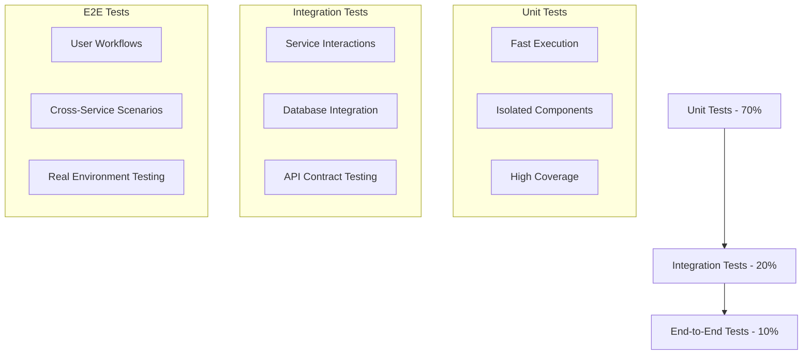

# Testing Overview

OpenFrame employs a comprehensive testing strategy that ensures reliability, performance, and security across the entire platform. This guide covers our testing philosophy, tools, patterns, and best practices.

## Testing Philosophy

### Testing Pyramid

OpenFrame follows the testing pyramid approach with appropriate distribution of test types:



### Core Testing Principles

1. **Test Automation**: All tests run in CI/CD pipeline
2. **Test Isolation**: Tests don't depend on external state
3. **Deterministic Results**: Tests produce consistent results
4. **Fast Feedback**: Quick test execution for development workflow
5. **Comprehensive Coverage**: Critical paths thoroughly tested

## Testing Stack by Technology

### Java/Spring Boot Services

#### Unit Testing Framework
- **JUnit 5**: Primary testing framework
- **Mockito**: Mocking framework for dependencies
- **AssertJ**: Fluent assertions for better test readability
- **Testcontainers**: Integration testing with real databases
- **Spring Boot Test**: Spring-specific testing utilities

#### Example Unit Test Structure

```java
@ExtendWith(MockitoExtension.class)
class DeviceServiceTest {
    
    @Mock
    private DeviceRepository deviceRepository;
    
    @Mock
    private EventPublisher eventPublisher;
    
    @InjectMocks
    private DeviceService deviceService;
    
    @Test
    @DisplayName("Should create device with valid data")
    void shouldCreateDeviceWithValidData() {
        // Given
        CreateDeviceRequest request = CreateDeviceRequest.builder()
            .name("Test Device")
            .type(DeviceType.WORKSTATION)
            .build();
        
        Device savedDevice = Device.builder()
            .id("device-123")
            .name("Test Device")
            .status(DeviceStatus.ONLINE)
            .build();
            
        when(deviceRepository.save(any(Device.class)))
            .thenReturn(savedDevice);
        
        // When
        Device result = deviceService.createDevice("tenant-456", request);
        
        // Then
        assertThat(result)
            .isNotNull()
            .extracting(Device::getName, Device::getStatus)
            .containsExactly("Test Device", DeviceStatus.ONLINE);
            
        verify(eventPublisher).publishEvent(
            argThat(event -> event instanceof DeviceCreatedEvent)
        );
    }
}
```

### Frontend Testing (Vue.js/TypeScript)

#### Testing Framework
- **Vitest**: Fast unit test runner
- **Vue Test Utils**: Vue component testing utilities
- **Testing Library**: User-centric testing approach
- **Playwright**: End-to-end browser testing
- **MSW**: API mocking for tests

#### Component Testing Example

```typescript
import { describe, it, expect, vi } from 'vitest'
import { mount } from '@vue/test-utils'
import { createTestingPinia } from '@pinia/testing'
import DeviceCard from '@/components/DeviceCard.vue'
import type { Device } from '@/types/device'

describe('DeviceCard', () => {
  const mockDevice: Device = {
    id: 'device-123',
    name: 'Test Workstation',
    status: 'online',
    type: 'workstation',
    lastSeen: new Date().toISOString()
  }

  it('displays device information correctly', () => {
    const wrapper = mount(DeviceCard, {
      props: { device: mockDevice },
      global: {
        plugins: [createTestingPinia()]
      }
    })

    expect(wrapper.find('[data-testid="device-name"]').text())
      .toBe('Test Workstation')
    expect(wrapper.find('[data-testid="device-status"]').text())
      .toBe('online')
  })

  it('emits action event when action button clicked', async () => {
    const wrapper = mount(DeviceCard, {
      props: { device: mockDevice },
      global: {
        plugins: [createTestingPinia()]
      }
    })

    await wrapper.find('[data-testid="action-button"]').trigger('click')

    expect(wrapper.emitted('device-action')).toBeTruthy()
    expect(wrapper.emitted('device-action')![0]).toEqual(['restart'])
  })
})
```

### Rust System Agent Testing

#### Testing Framework
- **Native Rust Testing**: Built-in test framework
- **tokio-test**: Async testing utilities  
- **mockall**: Mocking library for traits
- **tempfile**: Temporary file/directory testing
- **wiremock**: HTTP service mocking

#### Rust Test Example

```rust
#[cfg(test)]
mod tests {
    use super::*;
    use mockall::predicate::*;
    use tempfile::TempDir;
    use tokio_test;

    #[tokio::test]
    async fn test_system_metrics_collection() {
        // Given
        let temp_dir = TempDir::new().unwrap();
        let config = AgentConfig {
            server_url: "http://localhost:8080".to_string(),
            metrics_interval: Duration::from_secs(5),
            data_dir: temp_dir.path().to_path_buf(),
        };

        let mut mock_collector = MockMetricsCollector::new();
        mock_collector
            .expect_collect_metrics()
            .times(1)
            .returning(|| {
                Ok(SystemMetrics {
                    cpu_usage: 45.2,
                    memory_usage: 1024 * 1024 * 512, // 512 MB
                    disk_usage: vec![DiskUsage {
                        mount_point: "/".to_string(),
                        used_percent: 75.0,
                    }],
                })
            });

        // When
        let agent = Agent::new(config, Box::new(mock_collector));
        let result = agent.collect_and_send_metrics().await;

        // Then
        assert!(result.is_ok());
    }

    #[test]
    fn test_agent_configuration_parsing() {
        // Given
        let config_content = r#"
        server_url = "https://openframe.example.com"
        metrics_interval = "30s"
        data_dir = "/opt/openframe/data"
        "#;

        // When
        let config: AgentConfig = toml::from_str(config_content).unwrap();

        // Then
        assert_eq!(config.server_url, "https://openframe.example.com");
        assert_eq!(config.metrics_interval, Duration::from_secs(30));
    }
}
```

## Integration Testing Strategies

### Database Integration Testing

#### Testcontainers for Java

```java
@SpringBootTest
@Testcontainers
class DeviceRepositoryIntegrationTest {

    @Container
    static MongoDBContainer mongoDBContainer = new MongoDBContainer("mongo:7.0")
            .withExposedPorts(27017);

    @DynamicPropertySource
    static void configureProperties(DynamicPropertyRegistry registry) {
        registry.add("spring.data.mongodb.uri", mongoDBContainer::getReplicaSetUrl);
    }

    @Autowired
    private DeviceRepository deviceRepository;

    @Test
    void shouldPersistAndRetrieveDevice() {
        // Given
        Device device = Device.builder()
            .tenantId("tenant-123")
            .name("Integration Test Device")
            .status(DeviceStatus.ONLINE)
            .build();

        // When
        Device saved = deviceRepository.save(device);
        Optional<Device> retrieved = deviceRepository.findById(saved.getId());

        // Then
        assertThat(retrieved)
            .isPresent()
            .get()
            .extracting(Device::getName, Device::getStatus)
            .containsExactly("Integration Test Device", DeviceStatus.ONLINE);
    }
}
```

### GraphQL API Integration Testing

#### Schema Testing with DGS Test Framework

```java
@SpringBootTest
@DgsTest
class DeviceDataFetcherIntegrationTest {

    @Autowired
    private DgsQueryExecutor dgsQueryExecutor;

    @MockBean
    private DeviceService deviceService;

    @Test
    void shouldFetchDevicesForTenant() {
        // Given
        List<Device> mockDevices = Arrays.asList(
            Device.builder().id("1").name("Device 1").build(),
            Device.builder().id("2").name("Device 2").build()
        );

        when(deviceService.findDevicesByTenant("tenant-123"))
            .thenReturn(mockDevices);

        // When
        String query = """
            query GetDevices($tenantId: String!) {
                devices(tenantId: $tenantId) {
                    id
                    name
                    status
                }
            }
            """;

        ExecutionResult result = dgsQueryExecutor.executeAndExtractJsonPath(
            query,
            "data.devices[*]",
            Map.of("tenantId", "tenant-123")
        );

        // Then
        assertThat(result.getErrors()).isEmpty();
        
        List<Map<String, Object>> devices = result.getData();
        assertThat(devices)
            .hasSize(2)
            .extracting(device -> device.get("name"))
            .containsExactly("Device 1", "Device 2");
    }
}
```

### Service-to-Service Integration Testing

#### Contract Testing with Pact

```java
@ExtendWith(PactConsumerTestExt.class)
@PactTestFor(providerName = "management-service")
class ManagementServiceContractTest {

    @Pact(consumer = "api-service")
    public RequestResponsePact createToolInstallationPact(PactDslWithProvider builder) {
        return builder
            .given("tool installation endpoint available")
            .uponReceiving("request to install tactical rmm")
            .path("/api/tools/install")
            .method("POST")
            .body("""
                {
                    "toolType": "TACTICAL_RMM",
                    "tenantId": "tenant-123",
                    "config": {
                        "serverUrl": "https://rmm.example.com"
                    }
                }
                """)
            .willRespondWith()
            .status(202)
            .body("""
                {
                    "installationId": "install-456",
                    "status": "PENDING"
                }
                """)
            .toPact();
    }

    @Test
    @PactTestFor(pactMethod = "createToolInstallationPact")
    void shouldInstallTool(MockServer mockServer) {
        // Given
        ManagementServiceClient client = new ManagementServiceClient(
            mockServer.getUrl()
        );
        
        ToolInstallationRequest request = ToolInstallationRequest.builder()
            .toolType(ToolType.TACTICAL_RMM)
            .tenantId("tenant-123")
            .config(Map.of("serverUrl", "https://rmm.example.com"))
            .build();

        // When
        ToolInstallationResponse response = client.installTool(request);

        // Then
        assertThat(response.getInstallationId()).isEqualTo("install-456");
        assertThat(response.getStatus()).isEqualTo(InstallationStatus.PENDING);
    }
}
```

## End-to-End Testing

### Playwright E2E Testing

#### Test Setup and Configuration

```typescript
// playwright.config.ts
import { PlaywrightTestConfig } from '@playwright/test';

const config: PlaywrightTestConfig = {
  testDir: './e2e',
  timeout: 30 * 1000,
  expect: {
    timeout: 5000
  },
  use: {
    baseURL: 'http://localhost:3000',
    trace: 'on-first-retry',
    screenshot: 'only-on-failure'
  },
  projects: [
    {
      name: 'chromium',
      use: { ...devices['Desktop Chrome'] }
    },
    {
      name: 'firefox',
      use: { ...devices['Desktop Firefox'] }
    },
    {
      name: 'webkit',
      use: { ...devices['Desktop Safari'] }
    }
  ]
};

export default config;
```

#### E2E Test Example

```typescript
import { test, expect } from '@playwright/test';

test.describe('Device Management', () => {
  test.beforeEach(async ({ page }) => {
    // Login as test user
    await page.goto('/login');
    await page.fill('[data-testid="email"]', 'admin@test.com');
    await page.fill('[data-testid="password"]', 'password');
    await page.click('[data-testid="login-button"]');
    
    // Wait for dashboard to load
    await expect(page.locator('[data-testid="dashboard"]')).toBeVisible();
  });

  test('should create a new device', async ({ page }) => {
    // Navigate to devices page
    await page.click('[data-testid="nav-devices"]');
    
    // Click add device button
    await page.click('[data-testid="add-device-button"]');
    
    // Fill device form
    await page.fill('[data-testid="device-name"]', 'Test Device');
    await page.selectOption('[data-testid="device-type"]', 'workstation');
    
    // Submit form
    await page.click('[data-testid="save-device-button"]');
    
    // Verify device appears in list
    await expect(page.locator('[data-testid="device-list"]'))
      .toContainText('Test Device');
    
    // Verify success notification
    await expect(page.locator('[data-testid="success-notification"]'))
      .toContainText('Device created successfully');
  });

  test('should execute remote script on device', async ({ page }) => {
    // Navigate to devices and select a device
    await page.click('[data-testid="nav-devices"]');
    await page.click('[data-testid="device-item"]:first-child');
    
    // Open scripts modal
    await page.click('[data-testid="run-script-button"]');
    
    // Select script
    await page.selectOption('[data-testid="script-select"]', 'system-info');
    
    // Execute script
    await page.click('[data-testid="execute-script-button"]');
    
    // Wait for execution to complete
    await expect(page.locator('[data-testid="script-status"]'))
      .toContainText('Completed', { timeout: 10000 });
    
    // Verify output is displayed
    await expect(page.locator('[data-testid="script-output"]'))
      .not.toBeEmpty();
  });
});
```

### API E2E Testing

#### GraphQL E2E Testing

```typescript
import { test, expect } from '@playwright/test';
import { request } from '@playwright/test';

test.describe('GraphQL API E2E', () => {
  let apiContext;
  let authToken;

  test.beforeAll(async () => {
    apiContext = await request.newContext({
      baseURL: 'http://localhost:8080'
    });

    // Authenticate and get token
    const loginResponse = await apiContext.post('/auth/login', {
      data: {
        email: 'admin@test.com',
        password: 'password'
      }
    });

    const cookies = loginResponse.headers()['set-cookie'];
    authToken = cookies.find(cookie => cookie.startsWith('jwt='));
  });

  test('should query devices via GraphQL', async () => {
    const query = `
      query GetDevices($first: Int!) {
        devices(first: $first) {
          edges {
            node {
              id
              name
              status
              type
            }
          }
          pageInfo {
            hasNextPage
            endCursor
          }
        }
      }
    `;

    const response = await apiContext.post('/graphql', {
      headers: {
        'Cookie': authToken,
        'Content-Type': 'application/json'
      },
      data: {
        query,
        variables: { first: 10 }
      }
    });

    expect(response.status()).toBe(200);
    
    const result = await response.json();
    expect(result.errors).toBeUndefined();
    expect(result.data.devices).toBeDefined();
    expect(result.data.devices.edges).toBeInstanceOf(Array);
  });

  test('should create device via GraphQL mutation', async () => {
    const mutation = `
      mutation CreateDevice($input: CreateDeviceInput!) {
        createDevice(input: $input) {
          id
          name
          status
          type
        }
      }
    `;

    const response = await apiContext.post('/graphql', {
      headers: {
        'Cookie': authToken,
        'Content-Type': 'application/json'
      },
      data: {
        query: mutation,
        variables: {
          input: {
            name: 'E2E Test Device',
            type: 'WORKSTATION'
          }
        }
      }
    });

    expect(response.status()).toBe(200);
    
    const result = await response.json();
    expect(result.errors).toBeUndefined();
    expect(result.data.createDevice.name).toBe('E2E Test Device');
    expect(result.data.createDevice.type).toBe('WORKSTATION');
  });
});
```

## Performance Testing

### Load Testing with Artillery

#### Artillery Configuration

```yaml
# artillery-config.yml
config:
  target: 'http://localhost:8080'
  phases:
    - duration: 60
      arrivalRate: 10
    - duration: 120
      arrivalRate: 50
    - duration: 60
      arrivalRate: 100
  defaults:
    headers:
      Authorization: 'Bearer {{ $env.AUTH_TOKEN }}'

scenarios:
  - name: 'GraphQL Device Queries'
    weight: 70
    flow:
      - post:
          url: '/graphql'
          json:
            query: |
              query GetDevices {
                devices(first: 20) {
                  edges {
                    node { id name status }
                  }
                }
              }
      - think: 2

  - name: 'REST API Health Check'
    weight: 30
    flow:
      - get:
          url: '/health'
      - think: 1
```

### Database Performance Testing

#### JMeter Database Testing

```xml
<?xml version="1.0" encoding="UTF-8"?>
<jmeterTestPlan version="1.2">
  <hashTree>
    <TestPlan>
      <stringProp name="TestPlan.test_name">MongoDB Performance Test</stringProp>
    </TestPlan>
    <hashTree>
      <ThreadGroup>
        <stringProp name="ThreadGroup.num_threads">50</stringProp>
        <stringProp name="ThreadGroup.ramp_time">30</stringProp>
        <stringProp name="ThreadGroup.duration">300</stringProp>
      </ThreadGroup>
      <hashTree>
        <MongoSourceElement>
          <stringProp name="connectionString">mongodb://localhost:27017</stringProp>
          <stringProp name="database">openframe</stringProp>
        </MongoSourceElement>
        <MongoScriptSampler>
          <stringProp name="script">
            db.devices.find({
              tenantId: "tenant-123",
              status: "online"
            }).limit(20)
          </stringProp>
        </MongoScriptSampler>
      </hashTree>
    </hashTree>
  </hashTree>
</jmeterTestPlan>
```

## Security Testing

### Automated Security Testing

#### OWASP ZAP Integration

```yaml
# security-scan.yml (GitHub Actions)
name: Security Scan
on: [push, pull_request]

jobs:
  security-scan:
    runs-on: ubuntu-latest
    steps:
      - uses: actions/checkout@v3
      
      - name: Start OpenFrame
        run: |
          docker compose -f integrated-tools/docker-compose.yml up -d
          ./scripts/run-linux.sh --silent &
          sleep 60  # Wait for services to start
      
      - name: Run OWASP ZAP Scan
        uses: zaproxy/action-baseline@v0.7.0
        with:
          target: 'http://localhost:3000'
          rules_file_name: '.zap/rules.tsv'
          cmd_options: '-a'
      
      - name: Upload ZAP Report
        uses: actions/upload-artifact@v3
        with:
          name: zap-report
          path: report_html.html
```

#### Dependency Vulnerability Scanning

```bash
# Java dependencies
mvn org.owasp:dependency-check-maven:check

# Node.js dependencies
cd openframe/services/openframe-frontend
npm audit
npm audit fix

# Rust dependencies
cd clients/openframe-client
cargo audit
```

## Test Data Management

### Test Data Builders

#### Java Test Data Builder Pattern

```java
public class DeviceTestDataBuilder {
    private String id = "device-123";
    private String tenantId = "tenant-456";
    private String name = "Test Device";
    private DeviceStatus status = DeviceStatus.ONLINE;
    private DeviceType type = DeviceType.WORKSTATION;

    public static DeviceTestDataBuilder aDevice() {
        return new DeviceTestDataBuilder();
    }

    public DeviceTestDataBuilder withId(String id) {
        this.id = id;
        return this;
    }

    public DeviceTestDataBuilder withTenant(String tenantId) {
        this.tenantId = tenantId;
        return this;
    }

    public DeviceTestDataBuilder withStatus(DeviceStatus status) {
        this.status = status;
        return this;
    }

    public Device build() {
        return Device.builder()
            .id(id)
            .tenantId(tenantId)
            .name(name)
            .status(status)
            .type(type)
            .createdAt(Instant.now())
            .build();
    }
}

// Usage in tests
@Test
void shouldFindOnlineDevices() {
    Device onlineDevice = aDevice()
        .withStatus(DeviceStatus.ONLINE)
        .withTenant("tenant-123")
        .build();
    
    deviceRepository.save(onlineDevice);
    
    List<Device> result = deviceService.findOnlineDevices("tenant-123");
    
    assertThat(result).contains(onlineDevice);
}
```

### Database Test Fixtures

#### MongoDB Test Data Setup

```java
@Component
@Profile("test")
public class TestDataInitializer implements ApplicationRunner {

    @Autowired
    private MongoTemplate mongoTemplate;

    @Override
    public void run(ApplicationArguments args) {
        if (mongoTemplate.getCollection("devices").countDocuments() == 0) {
            createTestDevices();
        }
    }

    private void createTestDevices() {
        List<Device> devices = Arrays.asList(
            aDevice().withName("Test Workstation 1").withTenant("tenant-1").build(),
            aDevice().withName("Test Server 1").withType(DeviceType.SERVER).withTenant("tenant-1").build(),
            aDevice().withName("Test Workstation 2").withTenant("tenant-2").build()
        );

        devices.forEach(mongoTemplate::save);
    }
}
```

## Continuous Integration Testing

### GitHub Actions Test Pipeline

```yaml
# .github/workflows/test.yml
name: Test Suite
on: [push, pull_request]

jobs:
  unit-tests:
    runs-on: ubuntu-latest
    steps:
      - uses: actions/checkout@v3
      
      - name: Setup Java 21
        uses: actions/setup-java@v3
        with:
          java-version: '21'
          distribution: 'temurin'
          
      - name: Setup Node.js
        uses: actions/setup-node@v3
        with:
          node-version: '20'
          
      - name: Cache Maven dependencies
        uses: actions/cache@v3
        with:
          path: ~/.m2
          key: ${{ runner.os }}-m2-${{ hashFiles('**/pom.xml') }}
          
      - name: Run Java unit tests
        run: mvn test
        
      - name: Run Frontend unit tests
        run: |
          cd openframe/services/openframe-frontend
          npm ci
          npm run test:unit
          
      - name: Run Rust unit tests
        run: |
          cd clients/openframe-client
          cargo test

  integration-tests:
    runs-on: ubuntu-latest
    services:
      mongodb:
        image: mongo:7
        ports:
          - 27017:27017
      redis:
        image: redis:7
        ports:
          - 6379:6379
    
    steps:
      - uses: actions/checkout@v3
      
      - name: Setup Java 21
        uses: actions/setup-java@v3
        with:
          java-version: '21'
          distribution: 'temurin'
          
      - name: Run integration tests
        run: mvn test -Dtest="*IT"
        env:
          MONGODB_URI: mongodb://localhost:27017/openframe_test
          REDIS_URL: redis://localhost:6379

  e2e-tests:
    runs-on: ubuntu-latest
    steps:
      - uses: actions/checkout@v3
      
      - name: Start OpenFrame stack
        run: |
          docker compose -f integrated-tools/docker-compose.yml up -d
          ./scripts/run-linux.sh --silent &
          
      - name: Wait for services
        run: |
          timeout 300 bash -c 'until curl -f http://localhost:3000; do sleep 5; done'
          
      - name: Install Playwright
        run: |
          cd openframe/services/openframe-frontend
          npm ci
          npx playwright install
          
      - name: Run E2E tests
        run: |
          cd openframe/services/openframe-frontend
          npm run test:e2e
          
      - name: Upload test results
        uses: actions/upload-artifact@v3
        if: always()
        with:
          name: playwright-results
          path: openframe/services/openframe-frontend/test-results/
```

## Test Reporting and Metrics

### Code Coverage

#### Java Coverage with JaCoCo

```xml
<!-- pom.xml -->
<plugin>
    <groupId>org.jacoco</groupId>
    <artifactId>jacoco-maven-plugin</artifactId>
    <version>0.8.8</version>
    <executions>
        <execution>
            <goals>
                <goal>prepare-agent</goal>
            </goals>
        </execution>
        <execution>
            <id>report</id>
            <phase>test</phase>
            <goals>
                <goal>report</goal>
            </goals>
        </execution>
    </executions>
</plugin>
```

#### Frontend Coverage with Vitest

```typescript
// vitest.config.ts
import { defineConfig } from 'vitest/config'

export default defineConfig({
  test: {
    environment: 'happy-dom',
    coverage: {
      provider: 'v8',
      reporter: ['text', 'json', 'html'],
      thresholds: {
        global: {
          branches: 80,
          functions: 80,
          lines: 80,
          statements: 80
        }
      }
    }
  }
})
```

### Test Reporting Dashboard

#### Allure Test Reporting

```bash
# Generate Allure report
mvn allure:report

# Serve report
mvn allure:serve
```

## Best Practices and Guidelines

### Test Writing Guidelines

1. **Descriptive Test Names**: Use `should_do_something_when_condition` pattern
2. **Arrange-Act-Assert**: Structure tests with clear sections
3. **Test One Thing**: Each test should verify one behavior
4. **Independent Tests**: Tests shouldn't depend on execution order
5. **Deterministic Tests**: Same input should always produce same output

### Common Anti-Patterns to Avoid

❌ **Don't**:
- Write flaky tests that intermittently fail
- Test implementation details instead of behavior
- Use Thread.sleep() for timing
- Share mutable state between tests
- Write overly complex test setup

✅ **Do**:
- Use proper waiting strategies (WebDriverWait, await)
- Test user-facing behavior
- Use test data builders for complex objects
- Keep tests simple and readable
- Mock external dependencies properly

### Performance Test Guidelines

1. **Establish Baselines**: Measure current performance before changes
2. **Test Realistic Scenarios**: Use production-like data volumes
3. **Monitor Key Metrics**: Response time, throughput, resource usage
4. **Set Clear Thresholds**: Define acceptable performance criteria
5. **Run Regularly**: Include performance tests in CI/CD pipeline

---

This testing overview provides the foundation for maintaining high quality in OpenFrame. For specific implementation examples, refer to the test files in each service directory. Continue with the [Contributing Guidelines](../contributing/guidelines.md) to learn about our development process and code review standards.