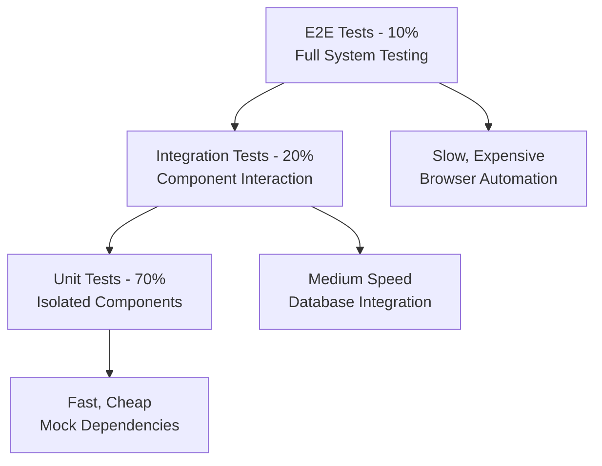

# Testing Overview

This document outlines OpenFrame's comprehensive testing strategy, tools, and best practices. Our testing approach ensures reliability, maintainability, and confidence in continuous deployment.

## Testing Philosophy

OpenFrame follows the **Testing Pyramid** principle with heavy emphasis on fast, isolated unit tests and strategic integration testing.

### Testing Principles

- **Test-Driven Development (TDD)**: Write tests before implementation
- **Behavior-Driven Development (BDD)**: Test business requirements, not implementation details
- **Test Isolation**: Each test is independent and can run in any order
- **Fast Feedback**: Quick test execution for rapid development cycles
- **Comprehensive Coverage**: Cover critical paths, edge cases, and error scenarios

## Testing Pyramid



### Testing Levels

| Level | Scope | Speed | Maintenance | Coverage Target |
|-------|-------|-------|-------------|----------------|
| **Unit** | Single class/function | Very Fast | Low | 70% of tests |
| **Integration** | Service components | Medium | Medium | 20% of tests |
| **End-to-End** | Complete user flows | Slow | High | 10% of tests |

## Java Service Testing

### Testing Stack

**Core Testing Framework**:
- **JUnit 5**: Modern Java testing framework
- **Mockito**: Mocking framework for dependencies
- **AssertJ**: Fluent assertion library
- **TestContainers**: Integration testing with real databases
- **WireMock**: HTTP service mocking
- **Spring Boot Test**: Spring-specific testing utilities

### Unit Testing

**Example: Service Layer Unit Test**
```java
@ExtendWith(MockitoExtension.class)
class DeviceServiceTest {
    
    @Mock
    private DeviceRepository deviceRepository;
    
    @Mock
    private EventPublisher eventPublisher;
    
    @InjectMocks
    private DeviceService deviceService;
    
    @Test
    @DisplayName("Should create device successfully")
    void shouldCreateDeviceSuccessfully() {
        // Given
        var deviceRequest = DeviceTestDataBuilder.aDevice()
            .withHostname("test-device")
            .withOrganizationId("org-123")
            .build();
            
        var savedDevice = DeviceTestDataBuilder.aDevice()
            .withId("device-456")
            .withHostname("test-device")
            .withStatus(DeviceStatus.ONLINE)
            .build();
            
        when(deviceRepository.save(any(Device.class))).thenReturn(savedDevice);
        
        // When
        var result = deviceService.createDevice(deviceRequest);
        
        // Then
        assertThat(result)
            .isNotNull()
            .extracting(Device::getId, Device::getHostname, Device::getStatus)
            .containsExactly("device-456", "test-device", DeviceStatus.ONLINE);
            
        verify(eventPublisher).publish(any(DeviceCreatedEvent.class));
    }
}
```

**Best Practices for Unit Tests**:
- Use test data builders for consistent test data creation
- Mock all external dependencies
- Test one behavior per test method
- Use descriptive test names that explain the scenario
- Follow AAA pattern (Arrange, Act, Assert)

### Integration Testing

**Repository Layer Testing**
```java
@DataMongoTest
class DeviceRepositoryTest {
    
    @Autowired
    private TestEntityManager entityManager;
    
    @Autowired
    private DeviceRepository deviceRepository;
    
    @Test
    @DisplayName("Should find devices by organization ID")
    void shouldFindDevicesByOrganizationId() {
        // Given
        var organization = OrganizationTestDataBuilder.anOrganization()
            .withId("org-123")
            .build();
            
        var device1 = DeviceTestDataBuilder.aDevice()
            .withOrganizationId("org-123")
            .withHostname("device-1")
            .build();
            
        var device2 = DeviceTestDataBuilder.aDevice()
            .withOrganizationId("org-123")  
            .withHostname("device-2")
            .build();
            
        deviceRepository.save(device1);
        deviceRepository.save(device2);
        
        // When
        var devices = deviceRepository.findByOrganizationId("org-123");
        
        // Then
        assertThat(devices)
            .hasSize(2)
            .extracting(Device::getHostname)
            .containsExactlyInAnyOrder("device-1", "device-2");
    }
}
```

**Web Layer Testing**
```java
@WebMvcTest(DeviceController.class)
class DeviceControllerTest {
    
    @Autowired
    private MockMvc mockMvc;
    
    @MockBean
    private DeviceService deviceService;
    
    @Test
    @DisplayName("Should update device status")
    void shouldUpdateDeviceStatus() throws Exception {
        // Given
        var updateRequest = new UpdateDeviceStatusRequest(DeviceStatus.OFFLINE);
        var updatedDevice = DeviceTestDataBuilder.aDevice()
            .withId("device-123")
            .withStatus(DeviceStatus.OFFLINE)
            .build();
            
        when(deviceService.updateDeviceStatus("device-123", DeviceStatus.OFFLINE))
            .thenReturn(updatedDevice);
        
        // When & Then
        mockMvc.perform(patch("/devices/device-123")
                .contentType(MediaType.APPLICATION_JSON)
                .content(objectMapper.writeValueAsString(updateRequest)))
                .andExpect(status().isOk())
                .andExpect(jsonPath("$.id").value("device-123"))
                .andExpect(jsonPath("$.status").value("OFFLINE"));
                
        verify(deviceService).updateDeviceStatus("device-123", DeviceStatus.OFFLINE);
    }
}
```

### Testing Configuration

**Application Test Properties**
```yaml
# src/test/resources/application-test.yml
spring:
  profiles:
    active: test
  
  datasource:
    url: jdbc:h2:mem:testdb
    driver-class-name: org.h2.Driver
    
  jpa:
    hibernate:
      ddl-auto: create-drop
    show-sql: true
    
  kafka:
    bootstrap-servers: ${spring.embedded.kafka.brokers}
    
  cache:
    type: simple
    
logging:
  level:
    com.openframe: DEBUG
    org.springframework.test: DEBUG
```

**TestContainers Configuration**
```java
@TestConfiguration
public class TestContainerConfiguration {
    
    @Bean
    @Primary
    public MongoTemplate mongoTemplate() {
        var mongoContainer = new MongoDBContainer("mongo:7.0")
            .withExposedPorts(27017)
            .withReuse(true);
            
        mongoContainer.start();
        
        var connectionString = mongoContainer.getConnectionString();
        var mongoClient = MongoClients.create(connectionString);
        
        return new MongoTemplate(mongoClient, "testdb");
    }
    
    @Bean
    @Primary
    public RedisTemplate<String, Object> redisTemplate() {
        var redisContainer = new GenericContainer<>("redis:7-alpine")
            .withExposedPorts(6379)
            .withReuse(true);
            
        redisContainer.start();
        
        var jedisConnectionFactory = new JedisConnectionFactory();
        jedisConnectionFactory.setHostName(redisContainer.getHost());
        jedisConnectionFactory.setPort(redisContainer.getFirstMappedPort());
        jedisConnectionFactory.afterPropertiesSet();
        
        var template = new RedisTemplate<String, Object>();
        template.setConnectionFactory(jedisConnectionFactory);
        return template;
    }
}
```

## Frontend Testing

### Testing Stack

**Frontend Testing Tools**:
- **Vitest**: Fast unit testing framework
- **Vue Test Utils**: Vue component testing utilities
- **Testing Library**: User-centric testing utilities
- **MSW (Mock Service Worker)**: API mocking
- **Cypress**: End-to-end testing
- **Playwright**: Cross-browser testing alternative

### Component Testing

**Vue Component Unit Test**
```typescript
import { describe, it, expect, vi } from 'vitest'
import { mount } from '@vue/test-utils'
import { createPinia } from 'pinia'
import DeviceCard from '@/components/devices/DeviceCard.vue'
import { DeviceStatus } from '@/types/device'

describe('DeviceCard', () => {
  const createWrapper = (props = {}) => {
    return mount(DeviceCard, {
      props: {
        device: {
          id: 'device-123',
          hostname: 'test-device',
          status: DeviceStatus.ONLINE,
          lastSeen: new Date('2023-01-01T10:00:00Z'),
          organization: { id: 'org-123', name: 'Test Org' },
          ...props
        }
      },
      global: {
        plugins: [createPinia()]
      }
    })
  }

  it('should display device information correctly', () => {
    const wrapper = createWrapper()
    
    expect(wrapper.find('[data-testid="device-hostname"]').text())
      .toBe('test-device')
    expect(wrapper.find('[data-testid="device-status"]').text())
      .toBe('Online')
  })

  it('should emit edit event when edit button is clicked', async () => {
    const wrapper = createWrapper()
    
    await wrapper.find('[data-testid="edit-button"]').trigger('click')
    
    expect(wrapper.emitted('edit')).toBeTruthy()
    expect(wrapper.emitted('edit')[0]).toEqual(['device-123'])
  })

  it('should show offline status with warning color', () => {
    const wrapper = createWrapper({
      status: DeviceStatus.OFFLINE
    })
    
    const statusElement = wrapper.find('[data-testid="device-status"]')
    expect(statusElement.text()).toBe('Offline')
    expect(statusElement.classes()).toContain('text-warning')
  })
})
```

### Store Testing

**Pinia Store Test**
```typescript
import { describe, it, expect, beforeEach } from 'vitest'
import { setActivePinia, createPinia } from 'pinia'
import { useDeviceStore } from '@/stores/devices'
import { DeviceService } from '@/services/device-service'

// Mock the service
vi.mock('@/services/device-service')
const mockDeviceService = vi.mocked(DeviceService)

describe('Device Store', () => {
  beforeEach(() => {
    setActivePinia(createPinia())
    vi.clearAllMocks()
  })

  it('should load devices successfully', async () => {
    const store = useDeviceStore()
    const mockDevices = [
      { id: '1', hostname: 'device-1', status: 'ONLINE' },
      { id: '2', hostname: 'device-2', status: 'OFFLINE' }
    ]
    
    mockDeviceService.getDevices.mockResolvedValueOnce({
      data: mockDevices,
      total: 2
    })
    
    await store.loadDevices()
    
    expect(store.devices).toEqual(mockDevices)
    expect(store.isLoading).toBe(false)
    expect(mockDeviceService.getDevices).toHaveBeenCalledTimes(1)
  })

  it('should handle device loading errors', async () => {
    const store = useDeviceStore()
    const error = new Error('Network error')
    
    mockDeviceService.getDevices.mockRejectedValueOnce(error)
    
    await store.loadDevices()
    
    expect(store.devices).toEqual([])
    expect(store.error).toBe('Failed to load devices')
    expect(store.isLoading).toBe(false)
  })
})
```

### API Mocking

**Mock Service Worker Setup**
```typescript
// src/mocks/handlers.ts
import { rest } from 'msw'

export const handlers = [
  rest.get('/api/devices', (req, res, ctx) => {
    return res(
      ctx.json({
        data: [
          { id: '1', hostname: 'device-1', status: 'ONLINE' },
          { id: '2', hostname: 'device-2', status: 'OFFLINE' }
        ],
        total: 2
      })
    )
  }),
  
  rest.post('/api/devices', (req, res, ctx) => {
    return res(
      ctx.json({
        id: '3',
        hostname: 'new-device',
        status: 'PENDING'
      })
    )
  }),
  
  rest.put('/api/devices/:id', (req, res, ctx) => {
    return res(
      ctx.json({
        id: req.params.id,
        hostname: 'updated-device',
        status: 'ONLINE'
      })
    )
  })
]
```

**MSW Setup in Tests**
```typescript
// src/mocks/server.ts
import { setupServer } from 'msw/node'
import { handlers } from './handlers'

export const server = setupServer(...handlers)

// Vitest setup
import { beforeAll, afterEach, afterAll } from 'vitest'
import { server } from './mocks/server'

beforeAll(() => server.listen({ onUnhandledRequest: 'error' }))
afterEach(() => server.resetHandlers())
afterAll(() => server.close())
```

## End-to-End Testing

### Cypress Testing

**E2E Test Example**
```typescript
describe('Device Management', () => {
  beforeEach(() => {
    // Login with test user
    cy.login('admin@test.com', 'password123')
    cy.visit('/devices')
  })

  it('should display devices list', () => {
    cy.get('[data-testid="devices-table"]').should('be.visible')
    cy.get('[data-testid="device-row"]').should('have.length.at.least', 1)
  })

  it('should create new device', () => {
    cy.get('[data-testid="add-device-button"]').click()
    
    cy.get('[data-testid="device-hostname-input"]')
      .type('test-device-e2e')
    
    cy.get('[data-testid="organization-select"]')
      .select('Test Organization')
    
    cy.get('[data-testid="save-device-button"]').click()
    
    cy.get('[data-testid="success-message"]')
      .should('contain', 'Device created successfully')
    
    cy.get('[data-testid="devices-table"]')
      .should('contain', 'test-device-e2e')
  })

  it('should edit device details', () => {
    cy.get('[data-testid="device-row"]').first().within(() => {
      cy.get('[data-testid="edit-button"]').click()
    })
    
    cy.get('[data-testid="device-hostname-input"]')
      .clear()
      .type('updated-device-name')
    
    cy.get('[data-testid="save-device-button"]').click()
    
    cy.get('[data-testid="success-message"]')
      .should('contain', 'Device updated successfully')
  })
})
```

**Cypress Configuration**
```javascript
// cypress.config.js
import { defineConfig } from 'cypress'

export default defineConfig({
  e2e: {
    baseUrl: 'http://localhost:3000',
    supportFile: 'cypress/support/e2e.ts',
    specPattern: 'cypress/e2e/**/*.cy.{js,jsx,ts,tsx}',
    viewportWidth: 1280,
    viewportHeight: 720,
    video: false,
    screenshotOnRunFailure: true,
    experimentalStudio: true,
    setupNodeEvents(on, config) {
      // Custom tasks and plugins
    }
  }
})
```

## Rust Client Testing

### Rust Testing Strategy

**Unit Test Example**
```rust
#[cfg(test)]
mod tests {
    use super::*;
    use tokio_test;
    
    #[tokio::test]
    async fn test_agent_registration() {
        // Arrange
        let mut mock_client = MockApiClient::new();
        mock_client
            .expect_register_agent()
            .with(eq("test-secret"))
            .times(1)
            .returning(|_| Ok(AgentRegistrationResponse {
                agent_id: "agent-123".to_string(),
                token: "jwt-token".to_string(),
            }));
        
        let agent_service = AgentService::new(mock_client);
        
        // Act
        let result = agent_service
            .register_with_secret("test-secret")
            .await;
        
        // Assert
        assert!(result.is_ok());
        let response = result.unwrap();
        assert_eq!(response.agent_id, "agent-123");
    }
    
    #[test]
    fn test_heartbeat_message_serialization() {
        let heartbeat = HeartbeatMessage {
            agent_id: "agent-123".to_string(),
            timestamp: SystemTime::now(),
            cpu_usage: 45.2,
            memory_usage: 78.5,
            disk_usage: vec![
                DiskUsage {
                    mount_point: "/".to_string(),
                    used_percentage: 65.0,
                }
            ],
        };
        
        let json = serde_json::to_string(&heartbeat).unwrap();
        let deserialized: HeartbeatMessage = 
            serde_json::from_str(&json).unwrap();
        
        assert_eq!(heartbeat.agent_id, deserialized.agent_id);
        assert_eq!(heartbeat.cpu_usage, deserialized.cpu_usage);
    }
}
```

**Integration Test Example**
```rust
#[cfg(test)]
mod integration_tests {
    use super::*;
    use std::sync::Once;
    use tokio;
    use testcontainers::*;
    
    static INIT: Once = Once::new();
    
    async fn setup_test_environment() -> TestEnvironment {
        INIT.call_once(|| {
            env_logger::init();
        });
        
        let docker = clients::Cli::default();
        let mongo_container = docker.run(images::mongo::Mongo::default());
        
        TestEnvironment {
            docker,
            mongo_container,
        }
    }
    
    #[tokio::test]
    async fn test_full_agent_lifecycle() {
        let env = setup_test_environment().await;
        
        // Test agent registration
        let registration_result = register_agent().await;
        assert!(registration_result.is_ok());
        
        // Test heartbeat sending
        let heartbeat_result = send_heartbeat().await;
        assert!(heartbeat_result.is_ok());
        
        // Test command receiving
        let command_result = receive_commands().await;
        assert!(command_result.is_ok());
    }
}
```

## Test Data Management

### Test Data Builders

**Java Test Data Builder Pattern**
```java
public class DeviceTestDataBuilder {
    private String id = "default-device-id";
    private String hostname = "default-hostname";
    private DeviceStatus status = DeviceStatus.ONLINE;
    private String organizationId = "default-org-id";
    private Instant createdAt = Instant.now();
    
    public static DeviceTestDataBuilder aDevice() {
        return new DeviceTestDataBuilder();
    }
    
    public DeviceTestDataBuilder withId(String id) {
        this.id = id;
        return this;
    }
    
    public DeviceTestDataBuilder withHostname(String hostname) {
        this.hostname = hostname;
        return this;
    }
    
    public DeviceTestDataBuilder withStatus(DeviceStatus status) {
        this.status = status;
        return this;
    }
    
    public Device build() {
        return Device.builder()
            .id(id)
            .hostname(hostname)
            .status(status)
            .organizationId(organizationId)
            .createdAt(createdAt)
            .build();
    }
}
```

**TypeScript Test Data Factory**
```typescript
export class DeviceTestFactory {
  static createDevice(overrides: Partial<Device> = {}): Device {
    return {
      id: 'device-123',
      hostname: 'test-device',
      status: DeviceStatus.ONLINE,
      organizationId: 'org-123',
      createdAt: new Date('2023-01-01'),
      lastSeen: new Date(),
      ipAddress: '192.168.1.100',
      operatingSystem: 'Windows 10',
      ...overrides
    }
  }
  
  static createDevices(count: number): Device[] {
    return Array.from({ length: count }, (_, index) =>
      this.createDevice({
        id: `device-${index}`,
        hostname: `test-device-${index}`
      })
    )
  }
}
```

## Performance Testing

### Load Testing with K6

```javascript
import http from 'k6/http';
import { check } from 'k6';

export let options = {
  stages: [
    { duration: '30s', target: 10 },  // Ramp up
    { duration: '60s', target: 50 },  // Stay at 50 users
    { duration: '30s', target: 0 },   // Ramp down
  ],
  thresholds: {
    http_req_duration: ['p(95)<500'], // 95% of requests < 500ms
    http_req_failed: ['rate<0.1'],    // Error rate < 10%
  },
};

export default function() {
  // Login
  let loginResponse = http.post('http://localhost:8088/auth/login', {
    username: 'test@example.com',
    password: 'password123'
  });
  
  check(loginResponse, {
    'login successful': (r) => r.status === 200,
  });
  
  let authToken = loginResponse.json('token');
  
  // Get devices list
  let devicesResponse = http.get('http://localhost:8088/api/devices', {
    headers: { 'Authorization': `Bearer ${authToken}` },
  });
  
  check(devicesResponse, {
    'devices loaded': (r) => r.status === 200,
    'response time < 500ms': (r) => r.timings.duration < 500,
  });
}
```

## Test Execution

### Running Tests

**Java Tests**
```bash
# Run all tests
mvn test

# Run specific test class
mvn test -Dtest=DeviceServiceTest

# Run tests with coverage
mvn test jacoco:report

# Run integration tests only
mvn test -P integration-tests

# Run tests with specific profile
mvn test -Dspring.profiles.active=test
```

**Frontend Tests**
```bash
# Run unit tests
npm run test

# Run tests in watch mode
npm run test:watch

# Run tests with coverage
npm run test:coverage

# Run E2E tests
npm run test:e2e

# Run E2E tests headless
npm run test:e2e:headless
```

**Rust Tests**
```bash
# Run unit tests
cargo test

# Run tests with output
cargo test -- --nocapture

# Run specific test
cargo test test_agent_registration

# Run integration tests
cargo test --test integration_tests
```

## Quality Gates & CI/CD

### Quality Requirements

| Metric | Threshold | Tool |
|--------|-----------|------|
| **Code Coverage** | > 80% | JaCoCo, Istanbul |
| **Test Success Rate** | 100% | All testing frameworks |
| **Performance** | p95 < 500ms | K6, JMeter |
| **Security** | No high/critical | OWASP ZAP, Snyk |

### CI Pipeline Testing

```yaml
# .github/workflows/test.yml
name: Test Pipeline

on: [push, pull_request]

jobs:
  unit-tests:
    runs-on: ubuntu-latest
    steps:
      - uses: actions/checkout@v3
      - uses: actions/setup-java@v3
        with:
          java-version: '21'
      - name: Run unit tests
        run: mvn test
      - name: Upload coverage
        uses: codecov/codecov-action@v3

  integration-tests:
    runs-on: ubuntu-latest
    needs: unit-tests
    steps:
      - uses: actions/checkout@v3
      - name: Start services
        run: docker-compose up -d
      - name: Run integration tests
        run: mvn verify -P integration-tests

  e2e-tests:
    runs-on: ubuntu-latest
    needs: integration-tests
    steps:
      - uses: actions/checkout@v3
      - name: Setup Node.js
        uses: actions/setup-node@v3
      - name: Install dependencies
        run: npm ci
      - name: Run E2E tests
        run: npm run test:e2e:headless
```

## Best Practices Summary

### Do's
- ✅ Write tests before or alongside code (TDD)
- ✅ Use descriptive test names that explain behavior
- ✅ Keep tests independent and idempotent
- ✅ Mock external dependencies appropriately
- ✅ Test error scenarios and edge cases
- ✅ Maintain test data builders for consistency
- ✅ Run tests in CI/CD pipeline

### Don'ts
- ❌ Test implementation details instead of behavior
- ❌ Write slow tests that block development
- ❌ Ignore test failures or flaky tests
- ❌ Over-mock internal dependencies
- ❌ Skip integration testing entirely
- ❌ Test everything through the UI
- ❌ Hardcode test data without builders

## Next Steps

1. **Set up testing environment**: Configure tools and frameworks
2. **Write your first test**: Start with simple unit tests
3. **Build test confidence**: Add integration and E2E tests gradually
4. **Automate testing**: Integrate with CI/CD pipeline
5. **Monitor quality**: Track coverage and performance metrics

---

**🧪 Testing Mastery!** You now have a comprehensive understanding of OpenFrame's testing strategy and can contribute high-quality, well-tested code!