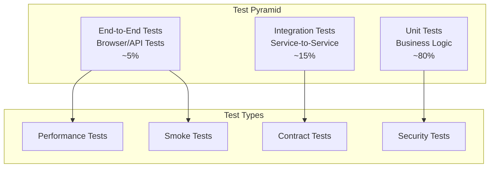

# Testing Overview

OpenFrame employs a comprehensive testing strategy that ensures code quality, system reliability, and maintainability. This guide covers the testing architecture, methodologies, and best practices used across the platform.

## Testing Philosophy

OpenFrame follows a **test pyramid** approach with emphasis on:

- **Fast Feedback**: Unit tests provide immediate feedback during development
- **Realistic Integration**: Integration tests validate service interactions
- **User-Centric E2E**: End-to-end tests ensure user workflows work correctly
- **Performance Validation**: Load tests verify scalability requirements
- **Security Assurance**: Security tests validate authentication and authorization



## Test Structure Overview

### Backend Testing (Java/Spring Boot)

```
src/test/java/
├── com/openframe/api/
│   ├── unit/                    # Unit tests
│   │   ├── service/            # Service layer tests
│   │   ├── controller/         # Controller tests
│   │   └── repository/         # Repository tests
│   ├── integration/            # Integration tests
│   │   ├── api/               # API integration tests
│   │   ├── database/          # Database tests
│   │   └── messaging/         # Kafka/NATS tests
│   └── e2e/                   # End-to-end tests
│       ├── graphql/           # GraphQL E2E tests
│       └── workflows/         # User workflow tests
└── resources/
    ├── application-test.yml    # Test configuration
    ├── test-data/             # Test data fixtures
    └── contracts/             # Contract test definitions
```

### Frontend Testing (Vue.js/TypeScript)

```
src/
├── components/
│   └── __tests__/             # Component unit tests
├── composables/
│   └── __tests__/             # Composable tests
├── stores/
│   └── __tests__/             # Store tests
├── utils/
│   └── __tests__/             # Utility function tests
└── e2e/                       # E2E test directory
    ├── fixtures/              # Test data
    ├── support/               # Helper functions
    └── specs/                 # E2E test specs
```

## Unit Testing

### Backend Unit Tests

**JUnit 5 with Mockito** for service layer testing:

```java
@ExtendWith(MockitoExtension.class)
class DeviceServiceTest {
    
    @Mock
    private DeviceRepository deviceRepository;
    
    @Mock
    private DeviceEventProducer eventProducer;
    
    @InjectMocks
    private DeviceService deviceService;
    
    @Test
    @DisplayName("Should update device status and publish event")
    void shouldUpdateDeviceStatusAndPublishEvent() {
        // Given
        String deviceId = "device-123";
        String tenantId = "tenant-456";
        DeviceStatus newStatus = DeviceStatus.ONLINE;
        
        Device existingDevice = Device.builder()
            .id(deviceId)
            .tenantId(tenantId)
            .status(DeviceStatus.OFFLINE)
            .build();
            
        when(deviceRepository.findByIdAndTenantId(deviceId, tenantId))
            .thenReturn(Optional.of(existingDevice));
        
        when(deviceRepository.save(any(Device.class)))
            .thenReturn(existingDevice.toBuilder().status(newStatus).build());
        
        // When
        Device result = deviceService.updateDeviceStatus(deviceId, tenantId, newStatus);
        
        // Then
        assertThat(result.getStatus()).isEqualTo(newStatus);
        
        verify(deviceRepository).save(argThat(device -> 
            device.getStatus().equals(newStatus) && 
            device.getLastUpdated() != null
        ));
        
        verify(eventProducer).publishDeviceStatusChange(
            argThat(event -> event.getDeviceId().equals(deviceId))
        );
    }
    
    @Test
    @DisplayName("Should throw exception when device not found")
    void shouldThrowExceptionWhenDeviceNotFound() {
        // Given
        String deviceId = "non-existent";
        String tenantId = "tenant-456";
        
        when(deviceRepository.findByIdAndTenantId(deviceId, tenantId))
            .thenReturn(Optional.empty());
        
        // When & Then
        assertThatThrownBy(() -> 
            deviceService.updateDeviceStatus(deviceId, tenantId, DeviceStatus.ONLINE)
        ).isInstanceOf(DeviceNotFoundException.class)
         .hasMessageContaining(deviceId);
    }
}
```

**TestContainers** for repository testing with real databases:

```java
@DataMongoTest
@Testcontainers
class DeviceRepositoryTest {
    
    @Container
    static MongoDBContainer mongoDBContainer = 
        new MongoDBContainer("mongo:7.0")
            .withExposedPorts(27017);
    
    @Autowired
    private TestEntityManager entityManager;
    
    @Autowired
    private DeviceRepository deviceRepository;
    
    @DynamicPropertySource
    static void configureProperties(DynamicPropertyRegistry registry) {
        registry.add("spring.data.mongodb.uri", 
                    mongoDBContainer::getReplicaSetUrl);
    }
    
    @Test
    @DisplayName("Should find devices by tenant and status")
    void shouldFindDevicesByTenantAndStatus() {
        // Given
        String tenantId = "tenant-123";
        Device onlineDevice = createTestDevice(tenantId, DeviceStatus.ONLINE);
        Device offlineDevice = createTestDevice(tenantId, DeviceStatus.OFFLINE);
        Device otherTenantDevice = createTestDevice("other-tenant", DeviceStatus.ONLINE);
        
        deviceRepository.saveAll(List.of(onlineDevice, offlineDevice, otherTenantDevice));
        
        // When
        List<Device> result = deviceRepository.findByTenantIdAndStatus(
            tenantId, DeviceStatus.ONLINE
        );
        
        // Then
        assertThat(result)
            .hasSize(1)
            .extracting(Device::getId)
            .containsExactly(onlineDevice.getId());
    }
}
```

### Frontend Unit Tests

**Vitest with Vue Test Utils** for component testing:

```typescript
// DeviceCard.test.ts
import { mount } from '@vue/test-utils'
import { describe, it, expect, vi } from 'vitest'
import DeviceCard from '@/components/DeviceCard.vue'
import { DeviceStatus } from '@/types/device.types'

describe('DeviceCard', () => {
  const mockDevice = {
    id: 'device-123',
    name: 'Test Device',
    status: DeviceStatus.ONLINE,
    lastSeen: new Date('2024-01-01T10:00:00Z'),
    operatingSystem: 'Windows 11'
  }

  it('displays device information correctly', () => {
    const wrapper = mount(DeviceCard, {
      props: { device: mockDevice }
    })

    expect(wrapper.find('[data-testid="device-name"]').text()).toBe('Test Device')
    expect(wrapper.find('[data-testid="device-status"]').text()).toBe('Online')
    expect(wrapper.find('[data-testid="device-os"]').text()).toBe('Windows 11')
  })

  it('emits device-click event when clicked', async () => {
    const wrapper = mount(DeviceCard, {
      props: { device: mockDevice }
    })

    await wrapper.trigger('click')

    expect(wrapper.emitted('device-click')).toHaveLength(1)
    expect(wrapper.emitted('device-click')?.[0]).toEqual([mockDevice])
  })

  it('shows correct status badge color', () => {
    const wrapper = mount(DeviceCard, {
      props: { device: mockDevice }
    })

    const statusBadge = wrapper.find('[data-testid="status-badge"]')
    expect(statusBadge.classes()).toContain('status-online')
  })
})
```

**Pinia Store Testing**:

```typescript
// deviceStore.test.ts
import { setActivePinia, createPinia } from 'pinia'
import { describe, it, expect, beforeEach, vi } from 'vitest'
import { useDeviceStore } from '@/stores/deviceStore'
import { mockGraphQLClient } from '@/__tests__/mocks/graphql'

describe('Device Store', () => {
  beforeEach(() => {
    setActivePinia(createPinia())
    vi.clearAllMocks()
  })

  it('fetches devices successfully', async () => {
    const store = useDeviceStore()
    const mockDevices = [
      { id: '1', name: 'Device 1', status: 'ONLINE' },
      { id: '2', name: 'Device 2', status: 'OFFLINE' }
    ]

    mockGraphQLClient.query.mockResolvedValue({
      data: { devices: { edges: mockDevices.map(device => ({ node: device })) } }
    })

    await store.fetchDevices()

    expect(store.devices).toHaveLength(2)
    expect(store.isLoading).toBe(false)
    expect(store.error).toBeNull()
  })

  it('handles fetch devices error', async () => {
    const store = useDeviceStore()
    const mockError = new Error('Network error')

    mockGraphQLClient.query.mockRejectedValue(mockError)

    await store.fetchDevices()

    expect(store.devices).toHaveLength(0)
    expect(store.isLoading).toBe(false)
    expect(store.error).toBe(mockError.message)
  })
})
```

## Integration Testing

### Service Integration Tests

**Spring Boot Test** with embedded services:

```java
@SpringBootTest(webEnvironment = SpringBootTest.WebEnvironment.RANDOM_PORT)
@AutoConfigureTestDatabase(replace = AutoConfigureTestDatabase.Replace.NONE)
@Testcontainers
class DeviceApiIntegrationTest {
    
    @Container
    static MongoDBContainer mongodb = new MongoDBContainer("mongo:7.0");
    
    @Container
    static KafkaContainer kafka = new KafkaContainer(
        DockerImageName.parse("confluentinc/cp-kafka:latest")
    );
    
    @Autowired
    private TestRestTemplate restTemplate;
    
    @Autowired
    private DeviceRepository deviceRepository;
    
    @Test
    @WithMockUser(authorities = "DEVICE_READ")
    void shouldReturnDevicesForAuthenticatedUser() {
        // Given
        String tenantId = "test-tenant";
        Device device = createTestDevice(tenantId);
        deviceRepository.save(device);
        
        // When
        ResponseEntity<DeviceListResponse> response = restTemplate.exchange(
            "/api/devices",
            HttpMethod.GET,
            createAuthenticatedRequest(tenantId),
            DeviceListResponse.class
        );
        
        // Then
        assertThat(response.getStatusCode()).isEqualTo(HttpStatus.OK);
        assertThat(response.getBody().getDevices()).hasSize(1);
        assertThat(response.getBody().getDevices().get(0).getId()).isEqualTo(device.getId());
    }
}
```

### GraphQL Integration Tests

**Netflix DGS Test Framework**:

```java
@SpringBootTest
@DgsTest
class DeviceDataFetcherTest {
    
    @Autowired
    private DgsQueryExecutor queryExecutor;
    
    @MockBean
    private DeviceService deviceService;
    
    @Test
    void shouldFetchDeviceById() {
        // Given
        String deviceId = "device-123";
        Device mockDevice = Device.builder()
            .id(deviceId)
            .name("Test Device")
            .status(DeviceStatus.ONLINE)
            .build();
            
        when(deviceService.getDevice(deviceId, anyString()))
            .thenReturn(mockDevice);
        
        String query = """
            query GetDevice($id: ID!) {
                device(id: $id) {
                    id
                    name
                    status
                }
            }
            """;
        
        // When
        ExecutionResult result = queryExecutor.execute(
            query,
            Map.of("id", deviceId)
        );
        
        // Then
        assertThat(result.getErrors()).isEmpty();
        
        Map<String, Object> deviceData = result.getData();
        Map<String, Object> device = (Map<String, Object>) deviceData.get("device");
        
        assertThat(device.get("id")).isEqualTo(deviceId);
        assertThat(device.get("name")).isEqualTo("Test Device");
        assertThat(device.get("status")).isEqualTo("ONLINE");
    }
}
```

### Message Broker Integration

**Kafka Integration Testing**:

```java
@SpringBootTest
@EmbeddedKafka(partitions = 1, topics = {"device-events"})
class DeviceEventIntegrationTest {
    
    @Autowired
    private DeviceEventProducer producer;
    
    @Autowired
    private DeviceEventConsumer consumer;
    
    @Test
    void shouldProduceAndConsumeDeviceEvent() throws Exception {
        // Given
        DeviceEvent event = DeviceEvent.builder()
            .deviceId("device-123")
            .tenantId("tenant-456")
            .eventType("STATUS_CHANGE")
            .eventData(Map.of("status", "ONLINE"))
            .build();
        
        // When
        producer.publishDeviceEvent(event);
        
        // Then
        await().atMost(Duration.ofSeconds(10))
               .untilAsserted(() -> {
                   verify(consumer, times(1)).handleDeviceEvent(
                       argThat(receivedEvent -> 
                           receivedEvent.getDeviceId().equals(event.getDeviceId())
                       )
                   );
               });
    }
}
```

## End-to-End Testing

### Backend E2E Tests

**API Workflow Testing**:

```java
@SpringBootTest(webEnvironment = SpringBootTest.WebEnvironment.RANDOM_PORT)
@TestMethodOrder(OrderAnnotation.class)
class UserWorkflowE2ETest {
    
    @Autowired
    private TestRestTemplate restTemplate;
    
    private static String authToken;
    private static String organizationId;
    
    @Test
    @Order(1)
    void shouldRegisterNewUser() {
        UserRegistrationRequest request = UserRegistrationRequest.builder()
            .email("test@example.com")
            .password("SecurePassword123!")
            .firstName("Test")
            .lastName("User")
            .organizationName("Test Organization")
            .build();
        
        ResponseEntity<AuthResponse> response = restTemplate.postForEntity(
            "/auth/register",
            request,
            AuthResponse.class
        );
        
        assertThat(response.getStatusCode()).isEqualTo(HttpStatus.CREATED);
        authToken = response.getBody().getToken();
        organizationId = response.getBody().getUser().getOrganizationId();
    }
    
    @Test
    @Order(2)
    void shouldCreateDevice() {
        CreateDeviceRequest request = CreateDeviceRequest.builder()
            .name("Test Device")
            .operatingSystem("Ubuntu 22.04")
            .build();
        
        HttpHeaders headers = new HttpHeaders();
        headers.setBearerAuth(authToken);
        HttpEntity<CreateDeviceRequest> entity = new HttpEntity<>(request, headers);
        
        ResponseEntity<DeviceResponse> response = restTemplate.exchange(
            "/api/devices",
            HttpMethod.POST,
            entity,
            DeviceResponse.class
        );
        
        assertThat(response.getStatusCode()).isEqualTo(HttpStatus.CREATED);
        assertThat(response.getBody().getName()).isEqualTo("Test Device");
    }
}
```

### Frontend E2E Tests

**Playwright for Browser Testing**:

```typescript
// tests/e2e/device-management.spec.ts
import { test, expect } from '@playwright/test'
import { loginAsAdmin } from './helpers/auth'

test.describe('Device Management', () => {
  test.beforeEach(async ({ page }) => {
    await loginAsAdmin(page)
  })

  test('should display devices list', async ({ page }) => {
    await page.goto('/devices')
    
    // Wait for devices to load
    await expect(page.locator('[data-testid="devices-table"]')).toBeVisible()
    
    // Check that device cards are displayed
    const deviceCards = page.locator('[data-testid="device-card"]')
    await expect(deviceCards).toHaveCountGreaterThan(0)
  })

  test('should allow device filtering', async ({ page }) => {
    await page.goto('/devices')
    
    // Filter by online devices
    await page.selectOption('[data-testid="status-filter"]', 'ONLINE')
    await page.click('[data-testid="apply-filter"]')
    
    // Verify filtered results
    await page.waitForLoadState('networkidle')
    const onlineDevices = page.locator('[data-testid="device-card"][data-status="ONLINE"]')
    await expect(onlineDevices).toHaveCountGreaterThan(0)
    
    // Ensure no offline devices are shown
    const offlineDevices = page.locator('[data-testid="device-card"][data-status="OFFLINE"]')
    await expect(offlineDevices).toHaveCount(0)
  })

  test('should open device details modal', async ({ page }) => {
    await page.goto('/devices')
    
    // Click on first device
    await page.click('[data-testid="device-card"]:first-child')
    
    // Verify modal opens
    await expect(page.locator('[data-testid="device-details-modal"]')).toBeVisible()
    await expect(page.locator('[data-testid="device-name"]')).toBeVisible()
    await expect(page.locator('[data-testid="device-status"]')).toBeVisible()
  })
})
```

## Performance Testing

### Load Testing with JMeter

**API Performance Tests**:

```xml
<!-- DeviceAPI-LoadTest.jmx -->
<?xml version="1.0" encoding="UTF-8"?>
<jmeterTestPlan version="1.2">
  <hashTree>
    <TestPlan guiclass="TestPlanGui" testclass="TestPlan" testname="Device API Load Test">
      <elementProp name="TestPlan.arguments" elementType="Arguments" guiclass="ArgumentsPanel">
        <collectionProp name="Arguments.arguments"/>
      </elementProp>
      <boolProp name="TestPlan.functional_mode">false</boolProp>
      <boolProp name="TestPlan.serialize_threadgroups">false</boolProp>
    </TestPlan>
    
    <hashTree>
      <ThreadGroup guiclass="ThreadGroupGui" testclass="ThreadGroup" testname="Device Queries">
        <stringProp name="ThreadGroup.on_sample_error">continue</stringProp>
        <elementProp name="ThreadGroup.main_controller" elementType="LoopController">
          <boolProp name="LoopController.continue_forever">false</boolProp>
          <stringProp name="LoopController.loops">100</stringProp>
        </elementProp>
        <stringProp name="ThreadGroup.num_threads">50</stringProp>
        <stringProp name="ThreadGroup.ramp_time">30</stringProp>
      </ThreadGroup>
      
      <hashTree>
        <HTTPSamplerProxy guiclass="HttpTestSampleGui" testclass="HTTPSamplerProxy" testname="Get Devices">
          <stringProp name="HTTPSampler.domain">localhost</stringProp>
          <stringProp name="HTTPSampler.port">8080</stringProp>
          <stringProp name="HTTPSampler.path">/api/devices</stringProp>
          <stringProp name="HTTPSampler.method">GET</stringProp>
        </HTTPSamplerProxy>
      </hashTree>
    </hashTree>
  </hashTree>
</jmeterTestPlan>
```

### Database Performance Testing

**MongoDB Performance Tests**:

```java
@Test
void shouldHandleHighVolumeDeviceQueries() {
    // Setup: Create 10,000 test devices
    List<Device> devices = IntStream.range(0, 10_000)
        .mapToObj(i -> createTestDevice("tenant-" + (i % 100)))
        .collect(Collectors.toList());
    
    deviceRepository.saveAll(devices);
    
    // Performance test: Query devices with various filters
    StopWatch stopWatch = new StopWatch();
    stopWatch.start();
    
    // Simulate concurrent queries
    List<CompletableFuture<List<Device>>> futures = IntStream.range(0, 100)
        .mapToObj(i -> CompletableFuture.supplyAsync(() -> 
            deviceRepository.findByTenantIdAndStatus("tenant-" + (i % 100), DeviceStatus.ONLINE)
        ))
        .collect(Collectors.toList());
    
    CompletableFuture.allOf(futures.toArray(new CompletableFuture[0])).join();
    
    stopWatch.stop();
    
    // Assert performance requirements
    assertThat(stopWatch.getTotalTimeMillis()).isLessThan(5000); // 5 second max
}
```

## Test Data Management

### Test Fixtures

**MongoDB Test Data**:

```java
@Component
@Profile("test")
public class TestDataFixtures {
    
    public Device createTestDevice(String tenantId) {
        return Device.builder()
            .id(UUID.randomUUID().toString())
            .tenantId(tenantId)
            .name("Test Device " + RandomStringUtils.randomNumeric(4))
            .operatingSystem("Ubuntu 22.04")
            .status(DeviceStatus.ONLINE)
            .lastSeen(Instant.now())
            .createdAt(Instant.now())
            .updatedAt(Instant.now())
            .build();
    }
    
    public User createTestUser(String tenantId) {
        return User.builder()
            .id(UUID.randomUUID().toString())
            .tenantId(tenantId)
            .email("test" + RandomStringUtils.randomNumeric(4) + "@example.com")
            .firstName("Test")
            .lastName("User")
            .role(UserRole.TECHNICIAN)
            .status(UserStatus.ACTIVE)
            .createdAt(Instant.now())
            .build();
    }
}
```

### Mock Data Generators

**GraphQL Mock Resolvers**:

```typescript
// src/__tests__/mocks/graphql-mocks.ts
import { graphql } from 'msw'
import { faker } from '@faker-js/faker'

export const handlers = [
  graphql.query('GetDevices', (req, res, ctx) => {
    const devices = Array.from({ length: 10 }, () => ({
      id: faker.datatype.uuid(),
      name: faker.company.name() + ' Server',
      status: faker.helpers.arrayElement(['ONLINE', 'OFFLINE', 'MAINTENANCE']),
      operatingSystem: faker.helpers.arrayElement(['Ubuntu 22.04', 'Windows 11', 'CentOS 8']),
      lastSeen: faker.date.recent().toISOString(),
      ipAddress: faker.internet.ip(),
    }))

    return res(
      ctx.data({
        devices: {
          edges: devices.map(device => ({ node: device })),
          pageInfo: {
            hasNextPage: false,
            hasPreviousPage: false,
          },
        },
      })
    )
  }),

  graphql.mutation('UpdateDeviceStatus', (req, res, ctx) => {
    const { id, status } = req.variables
    
    return res(
      ctx.data({
        updateDeviceStatus: {
          id,
          status,
          lastUpdated: new Date().toISOString(),
        },
      })
    )
  }),
]
```

## Running Tests

### Backend Tests

```bash
# Run all tests
mvn test

# Run specific test classes
mvn test -Dtest=DeviceServiceTest

# Run integration tests only
mvn test -Dtest=*IntegrationTest

# Run with coverage report
mvn test jacoco:report

# Run performance tests
mvn test -Dtest=*PerformanceTest -DargLine="-Xmx4g"
```

### Frontend Tests

```bash
# Run unit tests
npm run test

# Run tests in watch mode
npm run test:watch

# Run tests with coverage
npm run test:coverage

# Run E2E tests
npm run test:e2e

# Run E2E tests in headless mode
npm run test:e2e:headless

# Run specific test file
npm run test DeviceCard.test.ts
```

### Continuous Integration

**GitHub Actions Workflow**:

```yaml
# .github/workflows/test.yml
name: Test Suite

on:
  push:
    branches: [main, develop]
  pull_request:
    branches: [main]

jobs:
  backend-tests:
    runs-on: ubuntu-latest
    
    services:
      mongodb:
        image: mongo:7.0
        ports:
          - 27017:27017
      redis:
        image: redis:7-alpine
        ports:
          - 6379:6379
    
    steps:
      - uses: actions/checkout@v4
      
      - name: Set up JDK 21
        uses: actions/setup-java@v4
        with:
          java-version: '21'
          distribution: 'temurin'
      
      - name: Cache Maven dependencies
        uses: actions/cache@v3
        with:
          path: ~/.m2
          key: ${{ runner.os }}-m2-${{ hashFiles('**/pom.xml') }}
      
      - name: Run backend tests
        run: mvn test
      
      - name: Upload coverage reports
        uses: codecov/codecov-action@v3
        with:
          file: ./target/site/jacoco/jacoco.xml

  frontend-tests:
    runs-on: ubuntu-latest
    
    steps:
      - uses: actions/checkout@v4
      
      - name: Set up Node.js
        uses: actions/setup-node@v4
        with:
          node-version: '18'
          cache: 'npm'
          cache-dependency-path: 'openframe/services/openframe-frontend/package-lock.json'
      
      - name: Install dependencies
        run: npm ci
        working-directory: ./openframe/services/openframe-frontend
      
      - name: Run unit tests
        run: npm run test:coverage
        working-directory: ./openframe/services/openframe-frontend
      
      - name: Run E2E tests
        run: npm run test:e2e:ci
        working-directory: ./openframe/services/openframe-frontend
```

## Test Coverage Requirements

### Coverage Targets

| Test Type | Minimum Coverage | Target Coverage |
|-----------|------------------|-----------------|
| **Unit Tests** | 80% | 90%+ |
| **Integration Tests** | 60% | 75%+ |
| **E2E Tests** | Critical paths | All user workflows |

### Coverage Reporting

**Java Coverage with JaCoCo**:

```xml
<!-- pom.xml -->
<plugin>
  <groupId>org.jacoco</groupId>
  <artifactId>jacoco-maven-plugin</artifactId>
  <version>0.8.8</version>
  <configuration>
    <rules>
      <rule>
        <element>BUNDLE</element>
        <limits>
          <limit>
            <counter>LINE</counter>
            <value>COVEREDRATIO</value>
            <minimum>0.80</minimum>
          </limit>
        </limits>
      </rule>
    </rules>
  </configuration>
</plugin>
```

**TypeScript Coverage with Vitest**:

```typescript
// vitest.config.ts
export default defineConfig({
  test: {
    coverage: {
      provider: 'c8',
      reporter: ['text', 'json', 'html'],
      thresholds: {
        lines: 80,
        functions: 80,
        branches: 75,
        statements: 80,
      },
    },
  },
})
```

## Next Steps

To implement effective testing in your OpenFrame development:

1. **[Set Up Your Development Environment](../setup/environment.md)** - Ensure proper testing tools
2. **[Follow Contributing Guidelines](../contributing/guidelines.md)** - Understand testing requirements
3. **[Practice TDD](../advanced/test-driven-development.md)** - Test-driven development approaches
4. **[Review Code Quality Standards](../quality/standards.md)** - Code quality and testing standards

---

**🧪 Testing Excellence!** You now have a comprehensive understanding of OpenFrame's testing strategy and can contribute high-quality, well-tested code.