# Testing Overview

This guide provides a comprehensive overview of OpenFrame's testing strategy, including test organization, frameworks, execution, and best practices for writing effective tests.

## Testing Philosophy

OpenFrame follows a comprehensive testing approach that emphasizes:

- **Test Pyramid**: Unit tests form the foundation, with integration and E2E tests for critical paths
- **Shift-Left Testing**: Catch issues early in the development process
- **Test-Driven Development**: Write tests before or alongside code
- **Continuous Testing**: Automated testing in CI/CD pipelines
- **Quality Gates**: Minimum coverage and quality requirements

## Testing Strategy Overview

```mermaid
graph TB
    subgraph "Test Types by Scope"
        E2E[End-to-End Tests<br/>Full system flows]
        Integration[Integration Tests<br/>Service interactions]
        Component[Component Tests<br/>Service boundaries]
        Unit[Unit Tests<br/>Individual classes/functions]
    end
    
    subgraph "Test Environments"
        Local[Local Development]
        CI[CI Pipeline]
        Staging[Staging Environment]
        Production[Production Monitoring]
    end
    
    subgraph "Quality Metrics"
        Coverage[Code Coverage >80%]
        Performance[Performance Benchmarks]
        Security[Security Testing]
        Reliability[Reliability Testing]
    end
    
    Unit --> Component
    Component --> Integration  
    Integration --> E2E
    
    Local --> CI
    CI --> Staging
    Staging --> Production
    
    Coverage --> Performance
    Performance --> Security
    Security --> Reliability
    
    style Unit fill:#e8f5e8
    style Integration fill:#e3f2fd
    style E2E fill:#f3e5f5
```



## Test Structure and Organization

### Java Services Test Structure

```text
src/
├── main/java/                          # Production code
│   └── com/openframe/api/
├── test/java/                          # Test code
│   └── com/openframe/api/
│       ├── unit/                       # Unit tests
│       │   ├── service/               # Service layer tests
│       │   ├── controller/            # Controller tests
│       │   └── util/                  # Utility tests
│       ├── integration/               # Integration tests
│       │   ├── repository/           # Database integration
│       │   ├── external/             # External API integration
│       │   └── messaging/            # Kafka/NATS integration
│       └── e2e/                      # End-to-end tests
│           ├── api/                  # API workflow tests
│           └── scenarios/            # Business scenario tests
└── test/resources/                    # Test resources
    ├── application-test.yml          # Test configuration
    ├── data/                         # Test data files
    └── fixtures/                     # Test fixtures
```

### Frontend Test Structure

```text
src/
├── components/                        # React components
│   └── __tests__/                    # Component tests
│       ├── unit/                     # Unit tests
│       ├── integration/              # Integration tests
│       └── snapshots/                # Snapshot tests
├── hooks/                            # Custom hooks
│   └── __tests__/
├── services/                         # API services
│   └── __tests__/
├── utils/                           # Utility functions
│   └── __tests__/
└── e2e/                             # End-to-end tests
    ├── specs/                       # Test specifications
    └── fixtures/                    # Test fixtures
```

### Rust Client Test Structure

```text
src/
├── lib.rs                           # Library code
├── main.rs                          # Binary code
└── **/*.rs                          # Source files with inline tests

tests/                               # Integration tests
├── integration/                     # Integration test modules
│   ├── agent_tests.rs              # Agent functionality
│   ├── config_tests.rs             # Configuration
│   └── communication_tests.rs      # Communication layer
└── common/                          # Shared test utilities
    ├── mod.rs                      # Test utilities
    └── fixtures.rs                 # Test fixtures
```

## Testing Frameworks and Tools

### Java Testing Stack

| Framework | Purpose | Usage |
|-----------|---------|--------|
| **JUnit 5** | Unit testing framework | Primary testing framework |
| **Mockito** | Mocking framework | Mock dependencies and external services |
| **Spring Boot Test** | Integration testing | Spring context and web layer testing |
| **Testcontainers** | Integration testing | Database and external service containers |
| **REST Assured** | API testing | REST endpoint testing |
| **WireMock** | HTTP mocking | Mock external HTTP services |

### Frontend Testing Stack

| Framework | Purpose | Usage |
|-----------|---------|--------|
| **Vitest** | Unit testing | Fast unit and integration tests |
| **React Testing Library** | Component testing | User-centric component testing |
| **MSW (Mock Service Worker)** | API mocking | Mock GraphQL and REST APIs |
| **Playwright** | E2E testing | Browser automation and E2E tests |
| **Storybook** | Component development | Visual testing and documentation |

### Rust Testing Stack

| Tool | Purpose | Usage |
|------|---------|--------|
| **Built-in test framework** | Unit testing | `#[test]` attribute |
| **tokio-test** | Async testing | Testing async functions |
| **mockall** | Mocking | Mock traits and interfaces |
| **tempfile** | File system testing | Temporary files and directories |
| **criterion** | Benchmarking | Performance testing |

## Test Categories and Examples

### Unit Tests

**Purpose**: Test individual functions, methods, and classes in isolation

**Java Unit Test Example**:
```java
@ExtendWith(MockitoExtension.class)
class OrganizationServiceTest {
    
    @Mock
    private OrganizationRepository organizationRepository;
    
    @Mock
    private OrganizationMapper organizationMapper;
    
    @InjectMocks
    private OrganizationService organizationService;
    
    @Test
    void shouldCreateOrganization() {
        // Given
        CreateOrganizationRequest request = CreateOrganizationRequest.builder()
            .name("Test Organization")
            .domain("test.com")
            .build();
            
        Organization organization = new Organization();
        organization.setName("Test Organization");
        
        when(organizationRepository.save(any(Organization.class)))
            .thenReturn(organization);
        when(organizationMapper.toResponse(organization))
            .thenReturn(OrganizationResponse.builder().name("Test Organization").build());
        
        // When
        OrganizationResponse response = organizationService.createOrganization(request);
        
        // Then
        assertThat(response.getName()).isEqualTo("Test Organization");
        verify(organizationRepository).save(any(Organization.class));
    }
}
```

**React Component Unit Test Example**:
```typescript
import { render, screen, fireEvent } from '@testing-library/react';
import { DeviceCard } from '../DeviceCard';
import { Device } from '../../types/device.types';

describe('DeviceCard', () => {
  const mockDevice: Device = {
    id: '1',
    name: 'Test Device',
    status: 'online',
    lastSeen: new Date().toISOString(),
  };

  it('should display device information', () => {
    // Given
    render(<DeviceCard device={mockDevice} />);

    // When/Then
    expect(screen.getByText('Test Device')).toBeInTheDocument();
    expect(screen.getByText('online')).toBeInTheDocument();
  });

  it('should call onEdit when edit button is clicked', () => {
    // Given
    const onEdit = vi.fn();
    render(<DeviceCard device={mockDevice} onEdit={onEdit} />);

    // When
    fireEvent.click(screen.getByRole('button', { name: /edit/i }));

    // Then
    expect(onEdit).toHaveBeenCalledWith(mockDevice);
  });
});
```

**Rust Unit Test Example**:
```rust
#[cfg(test)]
mod tests {
    use super::*;

    #[test]
    fn test_device_registration() {
        // Given
        let device_info = DeviceInfo {
            name: "test-device".to_string(),
            platform: "linux".to_string(),
            version: "1.0.0".to_string(),
        };

        // When
        let result = register_device(&device_info);

        // Then
        assert!(result.is_ok());
        let registration = result.unwrap();
        assert_eq!(registration.device_name, "test-device");
    }

    #[tokio::test]
    async fn test_async_heartbeat() {
        // Given
        let client = create_test_client().await;

        // When
        let result = client.send_heartbeat().await;

        // Then
        assert!(result.is_ok());
    }
}
```

### Integration Tests

**Purpose**: Test interactions between components, services, and external systems

**Spring Boot Integration Test**:
```java
@SpringBootTest(webEnvironment = SpringBootTest.WebEnvironment.RANDOM_PORT)
@Testcontainers
class OrganizationControllerIntegrationTest {
    
    @Container
    static MongoDBContainer mongoDBContainer = new MongoDBContainer(DockerImageName.parse("mongo:7.0"))
            .withExposedPorts(27017);
    
    @Autowired
    private TestRestTemplate restTemplate;
    
    @Autowired
    private OrganizationRepository organizationRepository;
    
    @DynamicPropertySource
    static void configureProperties(DynamicPropertyRegistry registry) {
        registry.add("spring.data.mongodb.uri", mongoDBContainer::getReplicaSetUrl);
    }
    
    @Test
    void shouldCreateAndRetrieveOrganization() {
        // Given
        CreateOrganizationRequest request = CreateOrganizationRequest.builder()
            .name("Integration Test Org")
            .domain("integration.test")
            .build();
        
        // When - Create organization
        ResponseEntity<OrganizationResponse> createResponse = restTemplate
            .postForEntity("/api/organizations", request, OrganizationResponse.class);
        
        // Then - Verify creation
        assertThat(createResponse.getStatusCode()).isEqualTo(HttpStatus.CREATED);
        String organizationId = createResponse.getBody().getId();
        
        // When - Retrieve organization
        ResponseEntity<OrganizationResponse> getResponse = restTemplate
            .getForEntity("/api/organizations/" + organizationId, OrganizationResponse.class);
        
        // Then - Verify retrieval
        assertThat(getResponse.getStatusCode()).isEqualTo(HttpStatus.OK);
        assertThat(getResponse.getBody().getName()).isEqualTo("Integration Test Org");
    }
}
```

**GraphQL Integration Test**:
```java
@GraphQlTest(OrganizationDataFetcher.class)
class OrganizationGraphQlTest {
    
    @Autowired
    private GraphQlTester graphQlTester;
    
    @MockBean
    private OrganizationService organizationService;
    
    @Test
    void shouldQueryOrganizations() {
        // Given
        List<Organization> organizations = List.of(
            Organization.builder().id("1").name("Org 1").build(),
            Organization.builder().id("2").name("Org 2").build()
        );
        when(organizationService.findAll(any())).thenReturn(organizations);
        
        // When & Then
        graphQlTester.documentName("organizations-query")
                .execute()
                .path("organizations.edges")
                .entityList(Organization.class)
                .hasSize(2)
                .path("organizations.edges[0].node.name")
                .entity(String.class)
                .isEqualTo("Org 1");
    }
}
```

**Frontend Integration Test**:
```typescript
import { render, screen, waitFor } from '@testing-library/react';
import { MockedProvider } from '@apollo/client/testing';
import { OrganizationList } from '../OrganizationList';
import { GET_ORGANIZATIONS } from '../queries';

const mocks = [
  {
    request: {
      query: GET_ORGANIZATIONS,
      variables: { first: 10 },
    },
    result: {
      data: {
        organizations: {
          edges: [
            { node: { id: '1', name: 'Test Org 1' } },
            { node: { id: '2', name: 'Test Org 2' } },
          ],
        },
      },
    },
  },
];

describe('OrganizationList Integration', () => {
  it('should fetch and display organizations', async () => {
    // Given
    render(
      <MockedProvider mocks={mocks}>
        <OrganizationList />
      </MockedProvider>
    );

    // When
    expect(screen.getByText('Loading...')).toBeInTheDocument();

    // Then
    await waitFor(() => {
      expect(screen.getByText('Test Org 1')).toBeInTheDocument();
      expect(screen.getByText('Test Org 2')).toBeInTheDocument();
    });
  });
});
```

### End-to-End Tests

**Purpose**: Test complete user workflows across the entire system

**Playwright E2E Test**:
```typescript
import { test, expect } from '@playwright/test';

test.describe('Organization Management', () => {
  test('should create and manage organization', async ({ page }) => {
    // Given - Navigate to organizations page
    await page.goto('/organizations');
    
    // When - Create new organization
    await page.click('button:has-text("Add Organization")');
    await page.fill('input[name="name"]', 'E2E Test Organization');
    await page.fill('input[name="domain"]', 'e2e-test.com');
    await page.fill('input[name="contactEmail"]', 'admin@e2e-test.com');
    await page.click('button:has-text("Create Organization")');
    
    // Then - Verify organization appears in list
    await expect(page.locator('text=E2E Test Organization')).toBeVisible();
    
    // When - Edit organization
    await page.click('button[aria-label="Edit E2E Test Organization"]');
    await page.fill('input[name="name"]', 'Updated E2E Organization');
    await page.click('button:has-text("Save Changes")');
    
    // Then - Verify update
    await expect(page.locator('text=Updated E2E Organization')).toBeVisible();
    
    // When - Delete organization
    await page.click('button[aria-label="Delete Updated E2E Organization"]');
    await page.click('button:has-text("Confirm Delete")');
    
    // Then - Verify deletion
    await expect(page.locator('text=Updated E2E Organization')).not.toBeVisible();
  });
  
  test('should handle organization permissions', async ({ page }) => {
    // Given - Login as non-admin user
    await page.goto('/login');
    await page.fill('input[name="email"]', 'user@test.com');
    await page.fill('input[name="password"]', 'password');
    await page.click('button:has-text("Sign In")');
    
    // When - Navigate to organizations
    await page.goto('/organizations');
    
    // Then - Verify limited permissions
    await expect(page.locator('button:has-text("Add Organization")')).not.toBeVisible();
    await expect(page.locator('text=View Only Access')).toBeVisible();
  });
});
```

## Running Tests

### Local Development

**Java Tests**:
```bash
# Run all tests
mvn test

# Run specific test class
mvn test -Dtest=OrganizationServiceTest

# Run tests with specific profile
mvn test -Dspring.profiles.active=test

# Run integration tests only
mvn test -Dtest="**/*IntegrationTest"

# Run with coverage
mvn test jacoco:report
```

**Frontend Tests**:
```bash
# Run all tests
npm test

# Run tests in watch mode
npm run test:watch

# Run specific test file
npm test -- OrganizationList

# Run E2E tests
npm run test:e2e

# Run tests with coverage
npm run test:coverage
```

**Rust Tests**:
```bash
# Run all tests
cargo test

# Run specific test
cargo test test_device_registration

# Run integration tests only
cargo test --test integration

# Run with output
cargo test -- --nocapture

# Run benchmarks
cargo bench
```

### Continuous Integration

**GitHub Actions Test Pipeline**:
```yaml
name: Test Suite

on: [push, pull_request]

jobs:
  java-tests:
    runs-on: ubuntu-latest
    services:
      mongodb:
        image: mongo:7.0
        ports:
          - 27017:27017
      redis:
        image: redis:7.2
        ports:
          - 6379:6379
    
    steps:
      - uses: actions/checkout@v4
      - uses: actions/setup-java@v4
        with:
          java-version: '21'
          distribution: 'temurin'
      
      - name: Cache Maven dependencies
        uses: actions/cache@v3
        with:
          path: ~/.m2
          key: maven-${{ hashFiles('**/pom.xml') }}
      
      - name: Run tests
        run: mvn test -Dspring.profiles.active=ci
      
      - name: Generate coverage report
        run: mvn jacoco:report
      
      - name: Upload coverage to Codecov
        uses: codecov/codecov-action@v3

  frontend-tests:
    runs-on: ubuntu-latest
    steps:
      - uses: actions/checkout@v4
      - uses: actions/setup-node@v4
        with:
          node-version: '18'
          cache: 'npm'
      
      - name: Install dependencies
        run: npm ci
      
      - name: Run unit tests
        run: npm run test:coverage
      
      - name: Run E2E tests
        run: npm run test:e2e
        
      - name: Upload coverage
        uses: codecov/codecov-action@v3

  rust-tests:
    runs-on: ubuntu-latest
    steps:
      - uses: actions/checkout@v4
      - uses: actions-rs/toolchain@v1
        with:
          toolchain: stable
      
      - name: Run tests
        run: cargo test --all-features
      
      - name: Run integration tests
        run: cargo test --test integration
```

## Coverage Requirements

### Minimum Coverage Thresholds

| Component | Unit Test Coverage | Integration Test Coverage | Overall Coverage |
|-----------|-------------------|--------------------------|------------------|
| **Services** | 90% | 80% | 85% |
| **Controllers** | 85% | 70% | 80% |
| **Components** | 85% | 60% | 75% |
| **Utilities** | 95% | N/A | 95% |

### Coverage Configuration

**Java (JaCoCo)**:
```xml
<plugin>
    <groupId>org.jacoco</groupId>
    <artifactId>jacoco-maven-plugin</artifactId>
    <configuration>
        <rules>
            <rule>
                <element>BUNDLE</element>
                <limits>
                    <limit>
                        <counter>LINE</counter>
                        <value>COVEREDRATIO</value>
                        <minimum>0.80</minimum>
                    </limit>
                </limits>
            </rule>
        </rules>
    </configuration>
</plugin>
```

**Frontend (Vitest)**:
```typescript
// vitest.config.ts
export default defineConfig({
  test: {
    coverage: {
      reporter: ['text', 'html', 'lcov'],
      thresholds: {
        lines: 80,
        branches: 75,
        functions: 80,
        statements: 80,
      },
    },
  },
});
```

## Writing Effective Tests

### Best Practices

#### Test Structure (AAA Pattern)
```java
@Test
void shouldCalculateDeviceUptime() {
    // Arrange (Given)
    Device device = createTestDevice();
    device.setLastSeen(Instant.now().minus(Duration.ofHours(2)));
    
    // Act (When)
    Duration uptime = deviceService.calculateUptime(device);
    
    // Assert (Then)
    assertThat(uptime).isGreaterThan(Duration.ofHours(1));
}
```

#### Descriptive Test Names
```java
// ❌ Bad
@Test
void testDevice() { }

// ✅ Good
@Test
void shouldReturnOnlineStatusWhenDeviceHeartbeatIsRecent() { }

// ✅ Good
@Test
void shouldThrowExceptionWhenDeviceNotFound() { }
```

#### Test Data Management
```java
// Use builders for complex objects
public class OrganizationTestDataBuilder {
    private String name = "Default Org";
    private String domain = "default.com";
    
    public static OrganizationTestDataBuilder anOrganization() {
        return new OrganizationTestDataBuilder();
    }
    
    public OrganizationTestDataBuilder withName(String name) {
        this.name = name;
        return this;
    }
    
    public Organization build() {
        return Organization.builder()
            .name(name)
            .domain(domain)
            .build();
    }
}

// Usage in tests
@Test
void shouldValidateOrganizationDomain() {
    // Given
    Organization org = anOrganization()
        .withName("Test Organization")
        .withDomain("test.com")
        .build();
    
    // When & Then
    assertThat(org.isValidDomain()).isTrue();
}
```

### Common Anti-Patterns to Avoid

#### ❌ Testing Implementation Details
```java
// Bad - testing internal implementation
@Test
void shouldCallRepositorySaveMethod() {
    service.createOrganization(request);
    verify(repository).save(any());
}
```

#### ✅ Testing Behavior
```java
// Good - testing observable behavior
@Test
void shouldReturnCreatedOrganizationWithGeneratedId() {
    OrganizationResponse response = service.createOrganization(request);
    assertThat(response.getId()).isNotNull();
    assertThat(response.getName()).isEqualTo(request.getName());
}
```

#### ❌ Brittle Tests
```java
// Bad - depends on exact timing
@Test
void shouldUpdateTimestamp() {
    Organization org = service.updateOrganization(request);
    assertThat(org.getUpdatedAt()).isEqualTo(Instant.now()); // Flaky!
}
```

#### ✅ Robust Tests
```java
// Good - allows for reasonable variance
@Test
void shouldUpdateTimestamp() {
    Instant before = Instant.now();
    Organization org = service.updateOrganization(request);
    Instant after = Instant.now();
    
    assertThat(org.getUpdatedAt()).isBetween(before, after);
}
```

## Test Environment Configuration

### Test Configuration Files

**application-test.yml**:
```yaml
spring:
  profiles:
    active: test
  datasource:
    url: jdbc:h2:mem:testdb
  data:
    mongodb:
      uri: mongodb://localhost:27017/openframe_test
  kafka:
    bootstrap-servers: localhost:9092
    consumer:
      group-id: test-group

logging:
  level:
    com.openframe: DEBUG
    org.springframework: WARN

openframe:
  security:
    jwt:
      secret: test-jwt-secret-for-testing-only
  features:
    external-integrations: false
```

**Frontend Test Environment**:
```typescript
// test-setup.ts
import { beforeAll, afterAll, afterEach } from 'vitest';
import { server } from './mocks/server';

// Establish API mocking before all tests
beforeAll(() => server.listen());

// Reset any request handlers that we may add during the tests
afterEach(() => server.resetHandlers());

// Clean up after the tests are finished
afterAll(() => server.close());
```

---

**Next Steps**: 
- Review [Contributing Guidelines](../contributing/guidelines.md) to understand the development workflow
- Explore specific service testing examples in the reference documentation
- Set up your local testing environment following the [Local Development Guide](../setup/local-development.md)