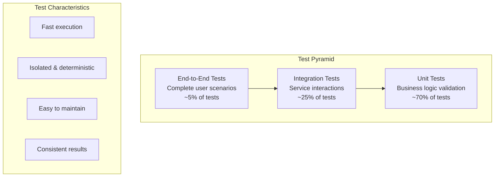

# Testing Overview

OpenFrame employs a comprehensive testing strategy to ensure code quality, reliability, and maintainability. This guide covers the testing philosophy, tools, and practices used across the platform.

## Testing Philosophy

OpenFrame follows the **Test Pyramid** approach with an emphasis on:

- **Fast Feedback**: Quick unit tests that run frequently during development
- **Confidence**: Integration tests that verify component interactions
- **Reality**: End-to-end tests that validate complete user scenarios
- **Quality**: High test coverage with meaningful assertions



## Test Structure and Organization

### Backend Testing (Java Services)

```
src/
├── main/java/com/openframe/api/
│   ├── controller/
│   ├── service/
│   └── repository/
└── test/java/com/openframe/api/
    ├── unit/                    # Unit tests
    │   ├── controller/
    │   ├── service/
    │   └── repository/
    ├── integration/             # Integration tests
    │   ├── controller/
    │   ├── service/
    │   └── repository/
    └── testutil/               # Test utilities
        ├── TestDataBuilder.java
        ├── TestContainers.java
        └── MockConfigurations.java
```

### Frontend Testing (Vue.js)

```
src/
├── components/
│   └── DeviceCard/
│       ├── DeviceCard.vue
│       └── DeviceCard.test.ts
├── views/
│   └── DevicesPage/
│       ├── DevicesPage.vue
│       └── DevicesPage.test.ts
└── services/
    └── deviceService/
        ├── deviceService.ts
        └── deviceService.test.ts
```

### E2E Testing Structure

```
openframe-e2e-tests/
├── src/test/java/com/openframe/
│   ├── api/                    # API test helpers
│   ├── config/                 # Test configuration
│   ├── data/                   # Test data generators
│   ├── tests/                  # Actual test scenarios
│   └── util/                   # Test utilities
└── resources/
    ├── application-test.yml
    └── test-data/
```

## Unit Testing

### Java Unit Testing with JUnit 5

**Testing Framework**: JUnit 5, Mockito, AssertJ, Testcontainers

#### Service Layer Testing

```java
@ExtendWith(MockitoExtension.class)
class DeviceServiceTest {

    @Mock
    private DeviceRepository deviceRepository;

    @Mock
    private EventPublisher eventPublisher;

    @InjectMocks
    private DeviceService deviceService;

    @Test
    @DisplayName("Should create device successfully with valid input")
    void createDevice_WithValidInput_ShouldCreateDevice() {
        // Given
        TenantContext tenantContext = TenantContext.builder()
            .tenantId("tenant-123")
            .build();
            
        CreateDeviceRequest request = CreateDeviceRequest.builder()
            .name("Test Device")
            .type(DeviceType.SERVER)
            .build();
            
        Device expectedDevice = Device.builder()
            .id("device-123")
            .tenantId("tenant-123")
            .name("Test Device")
            .type(DeviceType.SERVER)
            .status(DeviceStatus.PENDING)
            .build();
            
        when(deviceRepository.save(any(Device.class)))
            .thenReturn(expectedDevice);

        // When
        Device result = deviceService.createDevice(request, tenantContext);

        // Then
        assertThat(result)
            .usingRecursiveComparison()
            .isEqualTo(expectedDevice);
            
        verify(deviceRepository).save(argThat(device -> 
            device.getTenantId().equals("tenant-123") &&
            device.getName().equals("Test Device") &&
            device.getStatus() == DeviceStatus.PENDING
        ));
        
        verify(eventPublisher).publishEvent(argThat(event ->
            event instanceof DeviceCreatedEvent &&
            ((DeviceCreatedEvent) event).getDeviceId().equals("device-123")
        ));
    }

    @Test
    @DisplayName("Should throw exception when device name is invalid")
    void createDevice_WithInvalidName_ShouldThrowException() {
        // Given
        TenantContext tenantContext = TenantContext.builder()
            .tenantId("tenant-123")
            .build();
            
        CreateDeviceRequest request = CreateDeviceRequest.builder()
            .name("") // Invalid empty name
            .type(DeviceType.SERVER)
            .build();

        // When & Then
        assertThatThrownBy(() -> deviceService.createDevice(request, tenantContext))
            .isInstanceOf(ValidationException.class)
            .hasMessageContaining("Device name cannot be empty");
    }
}
```

#### Repository Testing with Testcontainers

```java
@Testcontainers
@DataMongoTest
class DeviceRepositoryTest {

    @Container
    static MongoDBContainer mongoContainer = new MongoDBContainer("mongo:7.0")
            .withExposedPorts(27017);

    @Autowired
    private MongoTemplate mongoTemplate;

    @Autowired
    private DeviceRepository deviceRepository;

    private String tenantId = "test-tenant";

    @Test
    @DisplayName("Should find devices by tenant and status")
    void findByTenantIdAndStatus_ShouldReturnMatchingDevices() {
        // Given
        Device onlineDevice = createTestDevice("device-1", DeviceStatus.ONLINE);
        Device offlineDevice = createTestDevice("device-2", DeviceStatus.OFFLINE);
        Device otherTenantDevice = Device.builder()
            .tenantId("other-tenant")
            .name("Other Device")
            .status(DeviceStatus.ONLINE)
            .build();
            
        mongoTemplate.save(onlineDevice);
        mongoTemplate.save(offlineDevice);
        mongoTemplate.save(otherTenantDevice);

        // When
        List<Device> onlineDevices = deviceRepository
            .findByTenantIdAndStatus(tenantId, DeviceStatus.ONLINE);

        // Then
        assertThat(onlineDevices)
            .hasSize(1)
            .extracting(Device::getName)
            .containsExactly("Test Device 1");
    }

    private Device createTestDevice(String deviceId, DeviceStatus status) {
        return Device.builder()
            .id(deviceId)
            .tenantId(tenantId)
            .name("Test Device " + deviceId.substring(deviceId.length() - 1))
            .status(status)
            .createdAt(Instant.now())
            .build();
    }
}
```

### Frontend Unit Testing with Vitest

**Testing Framework**: Vitest, Vue Test Utils, Testing Library

#### Component Testing

```typescript
// DeviceCard.test.ts
import { describe, it, expect, vi } from 'vitest'
import { mount } from '@vue/test-utils'
import { createTestingPinia } from '@pinia/testing'
import DeviceCard from './DeviceCard.vue'
import type { Device } from '@/types/device'

describe('DeviceCard', () => {
  const mockDevice: Device = {
    id: 'device-123',
    name: 'Test Server',
    type: 'SERVER',
    status: 'ONLINE',
    lastSeen: '2024-01-15T10:30:00Z',
    organization: {
      id: 'org-123',
      name: 'Test Organization'
    }
  }

  it('should render device information correctly', () => {
    const wrapper = mount(DeviceCard, {
      props: { device: mockDevice },
      global: {
        plugins: [createTestingPinia({ createSpy: vi.fn })]
      }
    })

    expect(wrapper.find('[data-testid="device-name"]').text())
      .toBe('Test Server')
    expect(wrapper.find('[data-testid="device-status"]').text())
      .toBe('Online')
    expect(wrapper.find('[data-testid="device-type"]').text())
      .toBe('Server')
  })

  it('should emit select event when clicked', async () => {
    const wrapper = mount(DeviceCard, {
      props: { device: mockDevice },
      global: {
        plugins: [createTestingPinia({ createSpy: vi.fn })]
      }
    })

    await wrapper.find('[data-testid="device-card"]').trigger('click')

    expect(wrapper.emitted('select')).toBeTruthy()
    expect(wrapper.emitted('select')![0]).toEqual([mockDevice])
  })

  it('should show offline indicator when device is offline', () => {
    const offlineDevice = { ...mockDevice, status: 'OFFLINE' }
    
    const wrapper = mount(DeviceCard, {
      props: { device: offlineDevice },
      global: {
        plugins: [createTestingPinia({ createSpy: vi.fn })]
      }
    })

    expect(wrapper.find('[data-testid="status-indicator"]').classes())
      .toContain('status-offline')
  })
})
```

#### Service Testing

```typescript
// deviceService.test.ts
import { describe, it, expect, vi, beforeEach } from 'vitest'
import { createDeviceService } from './deviceService'
import { apiClient } from '@/lib/api-client'

vi.mock('@/lib/api-client')

describe('DeviceService', () => {
  const mockApiClient = vi.mocked(apiClient)
  const deviceService = createDeviceService()

  beforeEach(() => {
    vi.clearAllMocks()
  })

  it('should fetch devices with filters', async () => {
    // Given
    const mockResponse = {
      data: {
        devices: {
          edges: [
            {
              node: {
                id: 'device-1',
                name: 'Server 1',
                status: 'ONLINE'
              }
            }
          ],
          pageInfo: {
            hasNextPage: false
          }
        }
      }
    }
    
    mockApiClient.query.mockResolvedValue(mockResponse)

    // When
    const result = await deviceService.getDevices({
      status: 'ONLINE',
      type: 'SERVER'
    })

    // Then
    expect(result.devices).toHaveLength(1)
    expect(result.devices[0].name).toBe('Server 1')
    
    expect(mockApiClient.query).toHaveBeenCalledWith({
      query: expect.any(String),
      variables: {
        filter: {
          status: 'ONLINE',
          type: 'SERVER'
        }
      }
    })
  })

  it('should handle API errors gracefully', async () => {
    // Given
    mockApiClient.query.mockRejectedValue(
      new Error('Network error')
    )

    // When & Then
    await expect(deviceService.getDevices({}))
      .rejects
      .toThrow('Failed to fetch devices')
  })
})
```

## Integration Testing

Integration tests verify that multiple components work together correctly.

### Controller Integration Tests

```java
@SpringBootTest
@AutoConfigureTestDatabase(replace = AutoConfigureTestDatabase.Replace.NONE)
@Testcontainers
class DeviceControllerIntegrationTest {

    @Container
    static MongoDBContainer mongoContainer = new MongoDBContainer("mongo:7.0");
    
    @Container
    static GenericContainer<?> redisContainer = new GenericContainer<>("redis:7-alpine")
            .withExposedPorts(6379);

    @Autowired
    private TestRestTemplate restTemplate;

    @Autowired
    private DeviceRepository deviceRepository;

    @Autowired
    private JwtTokenProvider tokenProvider;

    private String authToken;
    private String tenantId = "test-tenant";

    @BeforeEach
    void setUp() {
        // Create test user and generate JWT
        UserDetails testUser = createTestUser();
        authToken = tokenProvider.generateToken(testUser);
        
        // Clean database
        deviceRepository.deleteAll();
    }

    @Test
    @DisplayName("GET /api/devices should return devices for authenticated user")
    void getDevices_WithValidAuth_ShouldReturnDevices() {
        // Given
        Device device1 = createTestDevice("device-1", "Server 1");
        Device device2 = createTestDevice("device-2", "Server 2");
        deviceRepository.saveAll(List.of(device1, device2));

        HttpHeaders headers = new HttpHeaders();
        headers.setBearerAuth(authToken);
        HttpEntity<String> entity = new HttpEntity<>(headers);

        // When
        ResponseEntity<DeviceListResponse> response = restTemplate.exchange(
            "/api/devices",
            HttpMethod.GET,
            entity,
            DeviceListResponse.class
        );

        // Then
        assertThat(response.getStatusCode()).isEqualTo(HttpStatus.OK);
        assertThat(response.getBody().getDevices()).hasSize(2);
        assertThat(response.getBody().getDevices())
            .extracting(DeviceResponse::getName)
            .containsExactlyInAnyOrder("Server 1", "Server 2");
    }

    @Test
    @DisplayName("POST /api/devices should create new device")
    void createDevice_WithValidRequest_ShouldCreateDevice() {
        // Given
        CreateDeviceRequest request = CreateDeviceRequest.builder()
            .name("New Server")
            .type("SERVER")
            .build();

        HttpHeaders headers = new HttpHeaders();
        headers.setBearerAuth(authToken);
        headers.setContentType(MediaType.APPLICATION_JSON);
        HttpEntity<CreateDeviceRequest> entity = new HttpEntity<>(request, headers);

        // When
        ResponseEntity<DeviceResponse> response = restTemplate.exchange(
            "/api/devices",
            HttpMethod.POST,
            entity,
            DeviceResponse.class
        );

        // Then
        assertThat(response.getStatusCode()).isEqualTo(HttpStatus.CREATED);
        assertThat(response.getBody().getName()).isEqualTo("New Server");
        assertThat(response.getBody().getType()).isEqualTo("SERVER");
        
        // Verify device was saved to database
        List<Device> devices = deviceRepository.findByTenantId(tenantId);
        assertThat(devices).hasSize(1);
        assertThat(devices.get(0).getName()).isEqualTo("New Server");
    }
}
```

### GraphQL Integration Tests

```java
@SpringBootTest
@AutoConfigureGraphQlTester
@Testcontainers
class DeviceGraphQLIntegrationTest {

    @Autowired
    private GraphQlTester graphQlTester;
    
    @Autowired
    private DeviceRepository deviceRepository;

    @Test
    @DisplayName("devices query should return filtered results")
    void devicesQuery_WithFilter_ShouldReturnFilteredResults() {
        // Given
        Device onlineDevice = createTestDevice("device-1", DeviceStatus.ONLINE);
        Device offlineDevice = createTestDevice("device-2", DeviceStatus.OFFLINE);
        deviceRepository.saveAll(List.of(onlineDevice, offlineDevice));

        String query = """
            query GetDevices($filter: DeviceFilter) {
                devices(filter: $filter) {
                    edges {
                        node {
                            id
                            name
                            status
                        }
                    }
                }
            }
        """;

        // When & Then
        graphQlTester
            .document(query)
            .variable("filter", Map.of("status", "ONLINE"))
            .execute()
            .path("devices.edges[*].node")
            .entityList(Device.class)
            .hasSize(1)
            .path("devices.edges[0].node.status")
            .entity(String.class)
            .isEqualTo("ONLINE");
    }
}
```

### Message Integration Tests

```java
@SpringBootTest
@TestPropertySource(properties = {
    "spring.kafka.consumer.auto-offset-reset=earliest"
})
@EmbeddedKafka(partitions = 1, topics = {"device-events"})
class DeviceEventIntegrationTest {

    @Autowired
    private KafkaTemplate<String, Object> kafkaTemplate;

    @Autowired
    private DeviceEventHandler eventHandler;

    @KafkaListener(topics = "device-events", groupId = "test-group")
    @EventListener
    public void handleDeviceEvent(DeviceEvent event) {
        receivedEvents.add(event);
    }

    private List<DeviceEvent> receivedEvents = new ArrayList<>();

    @Test
    @DisplayName("Device status change should publish event")
    void deviceStatusChange_ShouldPublishEvent() throws InterruptedException {
        // Given
        DeviceStatusChangedEvent event = DeviceStatusChangedEvent.builder()
            .deviceId("device-123")
            .previousStatus(DeviceStatus.OFFLINE)
            .newStatus(DeviceStatus.ONLINE)
            .timestamp(Instant.now())
            .build();

        // When
        kafkaTemplate.send("device-events", event);

        // Then
        await().atMost(Duration.ofSeconds(5))
            .until(() -> receivedEvents.size() == 1);
            
        DeviceEvent receivedEvent = receivedEvents.get(0);
        assertThat(receivedEvent.getDeviceId()).isEqualTo("device-123");
        assertThat(receivedEvent.getNewStatus()).isEqualTo(DeviceStatus.ONLINE);
    }
}
```

## End-to-End Testing

E2E tests validate complete user workflows across the entire system.

### Test Setup and Configuration

```java
// TestConfig.java
@TestConfiguration
public class E2ETestConfig {

    @Bean
    @Primary
    public TestContainers testContainers() {
        return TestContainers.builder()
            .mongodb("mongo:7.0")
            .redis("redis:7-alpine")
            .kafka("confluentinc/cp-kafka:latest")
            .build();
    }

    @Bean
    public TestDataGenerator testDataGenerator() {
        return new TestDataGenerator();
    }
}
```

### Authentication E2E Test

```java
@SpringBootTest(webEnvironment = SpringBootTest.WebEnvironment.RANDOM_PORT)
@Testcontainers
class AuthenticationE2ETest {

    @LocalServerPort
    private int port;

    @Container
    static MongoDBContainer mongoContainer = new MongoDBContainer("mongo:7.0");

    private WebDriver driver;
    private String baseUrl;

    @BeforeEach
    void setUp() {
        driver = new ChromeDriver();
        baseUrl = "http://localhost:" + port;
    }

    @AfterEach
    void tearDown() {
        if (driver != null) {
            driver.quit();
        }
    }

    @Test
    @DisplayName("User should be able to register, login, and access dashboard")
    void completeUserJourney_ShouldWork() {
        // Registration
        driver.get(baseUrl + "/auth/signup");
        driver.findElement(By.id("organizationName")).sendKeys("Test Organization");
        driver.findElement(By.id("email")).sendKeys("admin@test.com");
        driver.findElement(By.id("password")).sendKeys("password123");
        driver.findElement(By.id("confirmPassword")).sendKeys("password123");
        driver.findElement(By.id("domain")).sendKeys("testorg");
        driver.findElement(By.cssSelector("button[type='submit']")).click();

        // Wait for redirect to dashboard
        WebDriverWait wait = new WebDriverWait(driver, Duration.ofSeconds(10));
        wait.until(ExpectedConditions.urlContains("/dashboard"));

        // Verify dashboard elements
        assertThat(driver.findElement(By.id("user-menu")).isDisplayed()).isTrue();
        assertThat(driver.findElement(By.cssSelector("h1")).getText())
            .contains("Welcome to OpenFrame");

        // Logout
        driver.findElement(By.id("user-menu")).click();
        driver.findElement(By.id("logout-button")).click();

        // Login again
        wait.until(ExpectedConditions.urlContains("/auth/login"));
        driver.findElement(By.id("email")).sendKeys("admin@test.com");
        driver.findElement(By.id("password")).sendKeys("password123");
        driver.findElement(By.cssSelector("button[type='submit']")).click();

        // Verify successful login
        wait.until(ExpectedConditions.urlContains("/dashboard"));
        assertThat(driver.findElement(By.id("user-menu")).isDisplayed()).isTrue();
    }
}
```

### Device Management E2E Test

```java
@Test
@DisplayName("Complete device management workflow")
void deviceManagementWorkflow_ShouldWork() {
    // Login as admin
    authenticateAsAdmin();

    // Navigate to devices page
    driver.get(baseUrl + "/devices");
    WebDriverWait wait = new WebDriverWait(driver, Duration.ofSeconds(10));

    // Add new device
    driver.findElement(By.id("add-device-button")).click();
    
    WebElement nameInput = wait.until(
        ExpectedConditions.presenceOfElementLocated(By.id("device-name"))
    );
    nameInput.sendKeys("Test Server");
    
    Select typeSelect = new Select(driver.findElement(By.id("device-type")));
    typeSelect.selectByValue("SERVER");
    
    driver.findElement(By.id("submit-device")).click();

    // Verify device appears in list
    wait.until(ExpectedConditions.presenceOfElementLocated(
        By.xpath("//td[contains(text(), 'Test Server')]")
    ));

    // Edit device
    driver.findElement(By.xpath("//button[contains(@class, 'edit-device')]")).click();
    
    WebElement editNameInput = wait.until(
        ExpectedConditions.presenceOfElementLocated(By.id("edit-device-name"))
    );
    editNameInput.clear();
    editNameInput.sendKeys("Updated Server");
    
    driver.findElement(By.id("save-device")).click();

    // Verify update
    wait.until(ExpectedConditions.presenceOfElementLocated(
        By.xpath("//td[contains(text(), 'Updated Server')]")
    ));

    // Delete device
    driver.findElement(By.xpath("//button[contains(@class, 'delete-device')]")).click();
    driver.findElement(By.id("confirm-delete")).click();

    // Verify deletion
    wait.until(ExpectedConditions.invisibilityOfElementLocated(
        By.xpath("//td[contains(text(), 'Updated Server')]")
    ));
}
```

## Running Tests

### Maven Test Execution

```bash
# Run all unit tests
mvn test

# Run integration tests
mvn test -Pintegration

# Run specific test class
mvn test -Dtest=DeviceServiceTest

# Run tests with specific profile
mvn test -Dspring.profiles.active=test

# Skip tests during build
mvn install -DskipTests

# Run tests with coverage
mvn test jacoco:report
```

### Frontend Test Execution

```bash
# Run unit tests
npm run test

# Run tests in watch mode
npm run test:watch

# Run tests with coverage
npm run test:coverage

# Run specific test file
npm run test -- DeviceCard.test.ts

# Run tests in CI mode
npm run test:ci
```

### E2E Test Execution

```bash
# Run all E2E tests
cd openframe-e2e-tests
mvn test

# Run specific test suite
mvn test -Dtest=AuthenticationE2ETest

# Run tests against specific environment
mvn test -Dtest.environment=staging

# Run smoke tests only
mvn test -Dtest=SmokeTest
```

## Test Data Management

### Test Data Builders

```java
public class TestDataBuilder {
    
    public static Device.DeviceBuilder defaultDevice() {
        return Device.builder()
            .id(UUID.randomUUID().toString())
            .tenantId("test-tenant")
            .name("Test Device")
            .type(DeviceType.SERVER)
            .status(DeviceStatus.ONLINE)
            .createdAt(Instant.now())
            .updatedAt(Instant.now());
    }
    
    public static Organization.OrganizationBuilder defaultOrganization() {
        return Organization.builder()
            .id(UUID.randomUUID().toString())
            .name("Test Organization")
            .domain("testorg")
            .contactInformation(ContactInformation.builder()
                .email("admin@testorg.com")
                .phone("+1234567890")
                .build())
            .createdAt(Instant.now());
    }
    
    public static User.UserBuilder defaultUser() {
        return User.builder()
            .id(UUID.randomUUID().toString())
            .email("user@test.com")
            .hashedPassword("$2a$10$encrypted.password")
            .role(UserRole.ADMIN)
            .status(UserStatus.ACTIVE)
            .createdAt(Instant.now());
    }
}
```

### Frontend Test Factories

```typescript
// testFactories.ts
export const createMockDevice = (overrides: Partial<Device> = {}): Device => ({
  id: 'device-123',
  name: 'Test Device',
  type: 'SERVER',
  status: 'ONLINE',
  lastSeen: '2024-01-15T10:30:00Z',
  organization: {
    id: 'org-123',
    name: 'Test Organization'
  },
  ...overrides
})

export const createMockUser = (overrides: Partial<User> = {}): User => ({
  id: 'user-123',
  email: 'user@test.com',
  role: 'ADMIN',
  organization: createMockOrganization(),
  ...overrides
})
```

## Continuous Integration

### GitHub Actions Test Workflow

```yaml
# .github/workflows/tests.yml
name: Tests

on:
  push:
    branches: [ main, develop ]
  pull_request:
    branches: [ main ]

jobs:
  unit-tests:
    runs-on: ubuntu-latest
    services:
      mongodb:
        image: mongo:7.0
        ports:
          - 27017:27017
      redis:
        image: redis:7-alpine
        ports:
          - 6379:6379
    
    steps:
    - uses: actions/checkout@v4
    
    - name: Set up JDK 21
      uses: actions/setup-java@v4
      with:
        java-version: '21'
        distribution: 'temurin'
        
    - name: Cache Maven dependencies
      uses: actions/cache@v3
      with:
        path: ~/.m2
        key: ${{ runner.os }}-m2-${{ hashFiles('**/pom.xml') }}
        
    - name: Run unit tests
      run: mvn test
      
    - name: Upload coverage reports
      uses: codecov/codecov-action@v3

  integration-tests:
    runs-on: ubuntu-latest
    needs: unit-tests
    
    steps:
    - uses: actions/checkout@v4
    - name: Set up JDK 21
      uses: actions/setup-java@v4
      with:
        java-version: '21'
        distribution: 'temurin'
        
    - name: Run integration tests
      run: mvn test -Pintegration

  frontend-tests:
    runs-on: ubuntu-latest
    
    steps:
    - uses: actions/checkout@v4
    - name: Setup Node.js
      uses: actions/setup-node@v4
      with:
        node-version: '20'
        cache: 'npm'
        cache-dependency-path: 'openframe/services/openframe-frontend/package-lock.json'
        
    - name: Install dependencies
      run: |
        cd openframe/services/openframe-frontend
        npm ci
        
    - name: Run tests
      run: |
        cd openframe/services/openframe-frontend
        npm run test:ci
```

## Test Coverage and Quality

### Coverage Targets

- **Unit Tests**: >80% line coverage, >70% branch coverage
- **Integration Tests**: >60% end-to-end scenario coverage
- **E2E Tests**: >90% critical user journey coverage

### Quality Gates

```xml
<!-- jacoco-maven-plugin configuration -->
<plugin>
    <groupId>org.jacoco</groupId>
    <artifactId>jacoco-maven-plugin</artifactId>
    <executions>
        <execution>
            <id>check</id>
            <goals>
                <goal>check</goal>
            </goals>
            <configuration>
                <rules>
                    <rule>
                        <element>BUNDLE</element>
                        <limits>
                            <limit>
                                <counter>LINE</counter>
                                <value>COVEREDRATIO</value>
                                <minimum>0.80</minimum>
                            </limit>
                            <limit>
                                <counter>BRANCH</counter>
                                <value>COVEREDRATIO</value>
                                <minimum>0.70</minimum>
                            </limit>
                        </limits>
                    </rule>
                </rules>
            </configuration>
        </execution>
    </executions>
</plugin>
```

## Best Practices and Guidelines

### Test Naming Conventions

- **Java**: `methodName_condition_expectedResult`
- **TypeScript**: `should do something when condition`
- **E2E**: Describe complete user scenarios

### Test Organization

1. **Arrange-Act-Assert** pattern for all tests
2. **Given-When-Then** for BDD-style tests
3. **Single responsibility** per test method
4. **Descriptive test names** that explain the scenario

### Performance Testing

```java
@Test
@Timeout(value = 5, unit = TimeUnit.SECONDS)
void deviceQuery_ShouldCompleteWithinTimeout() {
    // Test that queries complete within acceptable time limits
}

@ParameterizedTest
@ValueSource(ints = {1, 10, 100, 1000})
void deviceCreation_ShouldScaleLinearly(int deviceCount) {
    // Test performance characteristics at different scales
}
```

## Debugging and Troubleshooting Tests

### Common Test Issues

1. **Flaky Tests**: Use `@RepeatedTest` to identify intermittent failures
2. **Test Pollution**: Ensure tests clean up after themselves
3. **Time-based Tests**: Use `Clock` injection for deterministic time testing
4. **Resource Leaks**: Properly close resources in test teardown

### Test Debugging

```java
// Enable debug logging for tests
@TestPropertySource(properties = {
    "logging.level.com.openframe=DEBUG",
    "logging.level.org.springframework.test=DEBUG"
})

// Use @Disabled temporarily to isolate failing tests
@Disabled("Temporarily disabled while debugging")
@Test
void problematicTest() {
    // Test implementation
}
```

## Next Steps

Now that you understand OpenFrame's testing strategy:

1. **Review [Contributing Guidelines](../contributing/guidelines.md)** for development workflow
2. **Explore specific service tests** to see patterns in action
3. **Write your first test** for a new feature or bug fix
4. **Set up your IDE** with test runner integration

Remember: **Good tests are the foundation of reliable software**. Invest time in writing clear, maintainable tests that will catch regressions and provide confidence in your changes.